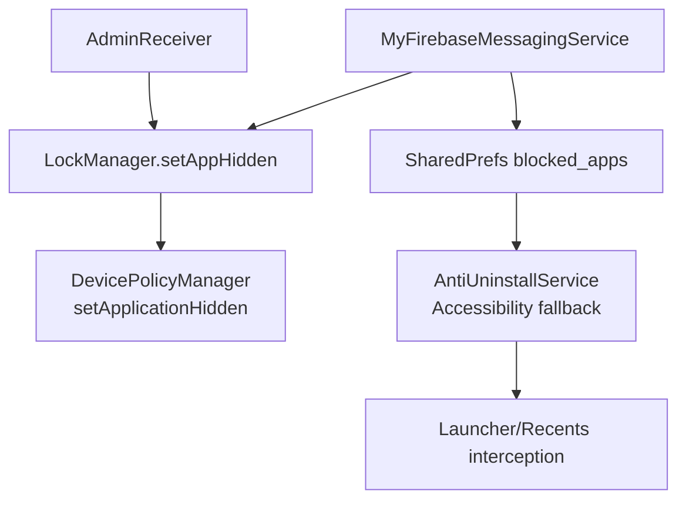
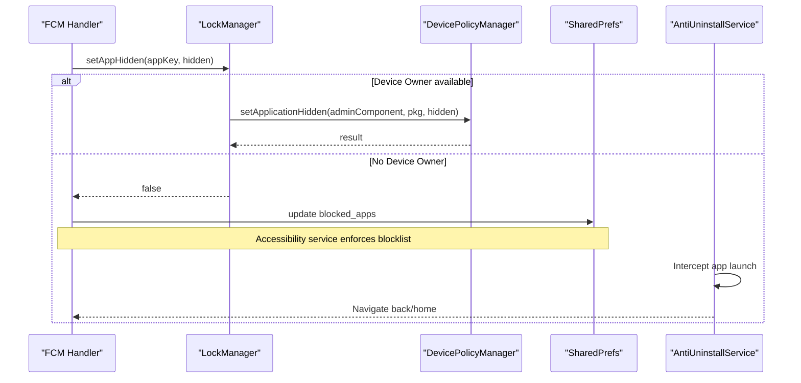
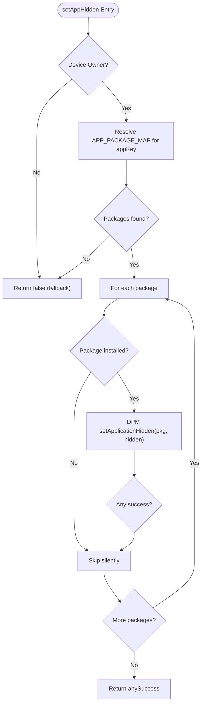
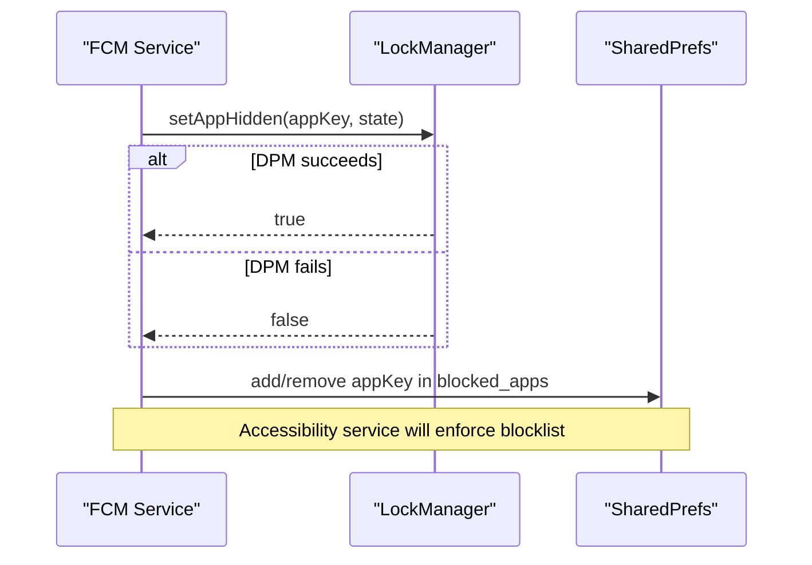
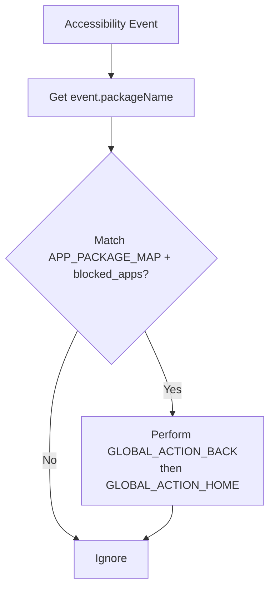
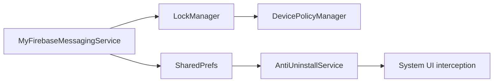

# App Hiding System

<cite>
**Referenced Files in This Document**
- [LockManager.kt](file://app/src/main/java/com/pksafe/lock/manager/util/LockManager.kt)
- [MyFirebaseMessagingService.kt](file://app/src/main/java/com/pksafe/lock/manager/service/MyFirebaseMessagingService.kt)
- [AntiUninstallService.kt](file://app/src/main/java/com/pksafe/lock/manager/service/AntiUninstallService.kt)
- [AdminReceiver.kt](file://app/src/main/java/com/pksafe/lock/manager/receiver/AdminReceiver.kt)
</cite>

## Table of Contents
1. [Introduction](#introduction)
2. [Project Structure](#project-structure)
3. [Core Components](#core-components)
4. [Architecture Overview](#architecture-overview)
5. [Detailed Component Analysis](#detailed-component-analysis)
6. [Dependency Analysis](#dependency-analysis)
7. [Performance Considerations](#performance-considerations)
8. [Troubleshooting Guide](#troubleshooting-guide)
9. [Conclusion](#conclusion)

## Introduction
This document explains PK Locker’s app hiding system centered on the setAppHidden method and the APP_PACKAGE_MAP configuration. It details how the system leverages Device Policy Manager’s setApplicationHidden to remove apps from the launcher and recents without requiring Accessibility services, and how it falls back to SharedPrefs-based blocking with an Accessibility service when Device Owner privileges are unavailable. It also covers package name mapping for multiple app variants, error handling for uninstalled packages, performance optimizations, security considerations, device compatibility, and troubleshooting steps for common issues such as apps remaining visible after hiding operations.

## Project Structure
The app hiding functionality spans several components:
- LockManager: Core logic for device policy operations and app hiding via Device Policy Manager (DPM).
- MyFirebaseMessagingService: Orchestrates remote commands to hide/unhide apps and applies fallbacks.
- AntiUninstallService: Accessibility-based fallback that blocks apps by navigating away from them when they are listed in a SharedPrefs blocklist.
- AdminReceiver: Handles device admin provisioning and sets up critical permissions and customer mode flags.

**Diagram sources**
- [MyFirebaseMessagingService.kt:101-119](file://app/src/main/java/com/pksafe/lock/manager/service/MyFirebaseMessagingService.kt#L101-L119)
- [LockManager.kt:266-291](file://app/src/main/java/com/pksafe/lock/manager/util/LockManager.kt#L266-L291)
- [AntiUninstallService.kt:136-166](file://app/src/main/java/com/pksafe/lock/manager/service/AntiUninstallService.kt#L136-L166)
- [AdminReceiver.kt:16-36](file://app/src/main/java/com/pksafe/lock/manager/receiver/AdminReceiver.kt#L16-L36)

**Section sources**
- [LockManager.kt:266-291](file://app/src/main/java/com/pksafe/lock/manager/util/LockManager.kt#L266-L291)
- [MyFirebaseMessagingService.kt:101-119](file://app/src/main/java/com/pksafe/lock/manager/service/MyFirebaseMessagingService.kt#L101-L119)
- [AntiUninstallService.kt:136-166](file://app/src/main/java/com/pksafe/lock/manager/service/AntiUninstallService.kt#L136-L166)
- [AdminReceiver.kt:16-36](file://app/src/main/java/com/pksafe/lock/manager/receiver/AdminReceiver.kt#L16-L36)

## Core Components
- LockManager.setAppHidden(appKey, hidden): Uses Device Policy Manager to hide or show apps based on a mapping of logical keys to real package names. Requires Device Owner privileges; returns false if not available so callers can fall back.
- APP_PACKAGE_MAP: A map from user-friendly keys (e.g., "whatsapp", "instagram") to lists of actual Android package names supporting multiple variants (main, lite, business).
- MyFirebaseMessagingService.app_block command: Applies both DPM-based hiding and SharedPrefs-based blocking to ensure coverage across devices and privilege levels.
- AntiUninstallService: An Accessibility service that intercepts navigation to blocked apps and redirects users back to the home screen, enforcing SharedPrefs-based blocklists.

**Section sources**
- [LockManager.kt:35-44](file://app/src/main/java/com/pksafe/lock/manager/util/LockManager.kt#L35-L44)
- [LockManager.kt:266-291](file://app/src/main/java/com/pksafe/lock/manager/util/LockManager.kt#L266-L291)
- [MyFirebaseMessagingService.kt:101-119](file://app/src/main/java/com/pksafe/lock/manager/service/MyFirebaseMessagingService.kt#L101-L119)
- [AntiUninstallService.kt:136-166](file://app/src/main/java/com/pksafe/lock/manager/service/AntiUninstallService.kt#L136-L166)

## Architecture Overview
The app hiding system uses a two-tier strategy:
- Primary path: Device Policy Manager setApplicationHidden removes apps from launcher and recents at the OS level. This is reliable and does not require Accessibility services.
- Fallback path: When Device Owner is not available, the system persists a blocklist in SharedPrefs and uses an Accessibility service to prevent launching blocked apps by navigating away from them.

**Diagram sources**
- [MyFirebaseMessagingService.kt:101-119](file://app/src/main/java/com/pksafe/lock/manager/service/MyFirebaseMessagingService.kt#L101-L119)
- [LockManager.kt:266-291](file://app/src/main/java/com/pksafe/lock/manager/util/LockManager.kt#L266-L291)
- [AntiUninstallService.kt:136-166](file://app/src/main/java/com/pksafe/lock/manager/service/AntiUninstallService.kt#L136-L166)

## Detailed Component Analysis

### LockManager.setAppHidden and APP_PACKAGE_MAP
- Purpose: Hide or reveal apps using Device Policy Manager.
- Mapping strategy: Logical keys map to lists of package names to support multiple variants:
  - WhatsApp: main and business versions
  - Facebook: main, lite, and messenger
  - Instagram: main and lite
  - YouTube: main and music variant
  - Chrome: stable and beta
  - Telegram: official and alternative client
  - Hotstar: multiple packaging variants
- Behavior:
  - Checks Device Owner status; if not present, returns false to signal fallback.
  - Iterates mapped packages, checks installation state, then calls setApplicationHidden.
  - Silently skips uninstalled packages and logs errors for others.
  - Returns true if any package was successfully hidden/unhidden.

**Diagram sources**
- [LockManager.kt:266-291](file://app/src/main/java/com/pksafe/lock/manager/util/LockManager.kt#L266-L291)
- [LockManager.kt:35-44](file://app/src/main/java/com/pksafe/lock/manager/util/LockManager.kt#L35-L44)

**Section sources**
- [LockManager.kt:35-44](file://app/src/main/java/com/pksafe/lock/manager/util/LockManager.kt#L35-L44)
- [LockManager.kt:266-291](file://app/src/main/java/com/pksafe/lock/manager/util/LockManager.kt#L266-L291)

### MyFirebaseMessagingService.app_block Workflow
- Receives remote commands to hide/unhide apps.
- Strategy 1: Attempt DPM-based hiding via LockManager.setAppHidden.
- Strategy 2: Persist the app key into SharedPrefs blocked_apps regardless of DPM outcome, enabling Accessibility-based enforcement as a fallback.
- On unlock_all or deregister, clears all restrictions and unhides all apps by iterating known keys and calling setAppHidden(false).

**Diagram sources**
- [MyFirebaseMessagingService.kt:101-119](file://app/src/main/java/com/pksafe/lock/manager/service/MyFirebaseMessagingService.kt#L101-L119)
- [MyFirebaseMessagingService.kt:161-167](file://app/src/main/java/com/pksafe/lock/manager/service/MyFirebaseMessagingService.kt#L161-L167)
- [MyFirebaseMessagingService.kt:198-200](file://app/src/main/java/com/pksafe/lock/manager/service/MyFirebaseMessagingService.kt#L198-L200)

**Section sources**
- [MyFirebaseMessagingService.kt:101-119](file://app/src/main/java/com/pksafe/lock/manager/service/MyFirebaseMessagingService.kt#L101-L119)
- [MyFirebaseMessagingService.kt:161-167](file://app/src/main/java/com/pksafe/lock/manager/service/MyFirebaseMessagingService.kt#L161-L167)
- [MyFirebaseMessagingService.kt:198-200](file://app/src/main/java/com/pksafe/lock/manager/service/MyFirebaseMessagingService.kt#L198-L200)

### AntiUninstallService Accessibility Fallback
- Monitors accessibility events and detects attempts to open blocked apps.
- Uses the same APP_PACKAGE_MAP to match current package against the SharedPrefs blocklist.
- If a blocked app is detected, performs global actions to navigate back and then home, preventing access.
- Also protects settings and uninstall flows when settings are blocked.

**Diagram sources**
- [AntiUninstallService.kt:136-166](file://app/src/main/java/com/pksafe/lock/manager/service/AntiUninstallService.kt#L136-L166)
- [AntiUninstallService.kt:149-158](file://app/src/main/java/com/pksafe/lock/manager/service/AntiUninstallService.kt#L149-L158)

**Section sources**
- [AntiUninstallService.kt:136-166](file://app/src/main/java/com/pksafe/lock/manager/service/AntiUninstallService.kt#L136-L166)
- [AntiUninstallService.kt:149-158](file://app/src/main/java/com/pksafe/lock/manager/service/AntiUninstallService.kt#L149-L158)

### AdminReceiver Role
- Activates device admin and marks provisioning complete.
- Grants critical permissions to self when operating as Device Owner.
- Ensures customer mode flags are set, enabling enforcement behaviors.

**Section sources**
- [AdminReceiver.kt:16-36](file://app/src/main/java/com/pksafe/lock/manager/receiver/AdminReceiver.kt#L16-L36)
- [AdminReceiver.kt:43-101](file://app/src/main/java/com/pksafe/lock/manager/receiver/AdminReceiver.kt#L43-L101)

## Dependency Analysis
- LockManager depends on DevicePolicyManager and AdminReceiver component to apply restrictions and hide apps.
- MyFirebaseMessagingService coordinates remote commands and updates SharedPrefs and DPM states.
- AntiUninstallService depends on Accessibility APIs and reads SharedPrefs to enforce blocklists.
- APP_PACKAGE_MAP is duplicated between LockManager and AntiUninstallService to ensure consistent mapping for both DPM and Accessibility paths.

**Diagram sources**
- [LockManager.kt:266-291](file://app/src/main/java/com/pksafe/lock/manager/util/LockManager.kt#L266-L291)
- [MyFirebaseMessagingService.kt:101-119](file://app/src/main/java/com/pksafe/lock/manager/service/MyFirebaseMessagingService.kt#L101-L119)
- [AntiUninstallService.kt:136-166](file://app/src/main/java/com/pksafe/lock/manager/service/AntiUninstallService.kt#L136-L166)

**Section sources**
- [LockManager.kt:266-291](file://app/src/main/java/com/pksafe/lock/manager/util/LockManager.kt#L266-L291)
- [MyFirebaseMessagingService.kt:101-119](file://app/src/main/java/com/pksafe/lock/manager/service/MyFirebaseMessagingService.kt#L101-L119)
- [AntiUninstallService.kt:136-166](file://app/src/main/java/com/pksafe/lock/manager/service/AntiUninstallService.kt#L136-L166)

## Performance Considerations
- Batch operations: When unlocking or deregistering, iterate known app keys once to unhide all apps efficiently.
- Avoid redundant checks: In setAppHidden, skip packages that are not installed to reduce overhead.
- Minimize Accessibility overhead: The fallback only triggers when a blocked app is launched, avoiding constant scanning.
- Use background threads where appropriate: Network and heavy operations should be offloaded; DPM calls are lightweight but still benefit from non-blocking patterns.

[No sources needed since this section provides general guidance]

## Troubleshooting Guide
Common issues and resolutions:
- Apps remain visible after hiding:
  - Verify Device Owner is active; if not, rely on SharedPrefs blocked_apps and ensure Accessibility service is enabled.
  - Confirm the app package exists in APP_PACKAGE_MAP; missing mappings will cause silent skips.
  - Check for NameNotFoundException in logs indicating uninstalled packages; these are skipped intentionally.
- Device Owner not available:
  - Ensure provisioning completed and AdminReceiver marked customer mode.
  - Enable Accessibility service via Device Owner secure settings or manually enable it in system settings.
- Uninstall protection not working:
  - Confirm AntiUninstallService is enabled and registered; check Settings.Secure ENABLED_ACCESSIBILITY_SERVICES.
  - Validate blocked_apps contains the correct app key and that the service matches package names correctly.
- Remote commands ignored:
  - Administrative devices ignore lock signals; verify is_admin flag is not set.
  - Ensure FCM payload includes correct command and target fields.

**Section sources**
- [LockManager.kt:266-291](file://app/src/main/java/com/pksafe/lock/manager/util/LockManager.kt#L266-L291)
- [MyFirebaseMessagingService.kt:40-45](file://app/src/main/java/com/pksafe/lock/manager/service/MyFirebaseMessagingService.kt#L40-L45)
- [AntiUninstallService.kt:51-79](file://app/src/main/java/com/pksafe/lock/manager/service/AntiUninstallService.kt#L51-L79)
- [AntiUninstallService.kt:136-166](file://app/src/main/java/com/pksafe/lock/manager/service/AntiUninstallService.kt#L136-L166)

## Conclusion
PK Locker’s app hiding system combines robust Device Policy Manager capabilities with a resilient Accessibility-based fallback. The APP_PACKAGE_MAP enables flexible support for multiple app variants, while the dual-path approach ensures visibility control even when Device Owner privileges are unavailable. Proper error handling for uninstalled packages and efficient batch operations improve reliability and performance. Administrators should monitor Device Owner status, ensure Accessibility services are enabled, and validate mappings to avoid visibility issues.

[No sources needed since this section summarizes without analyzing specific files]