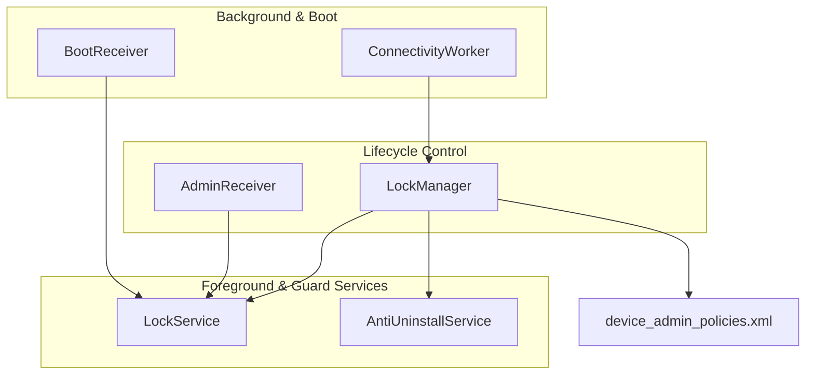
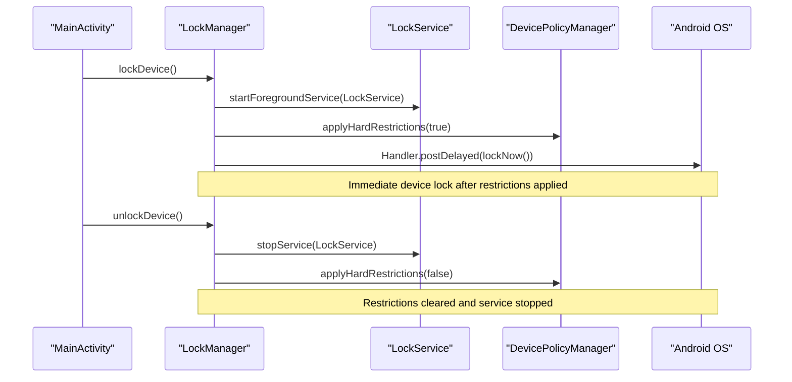
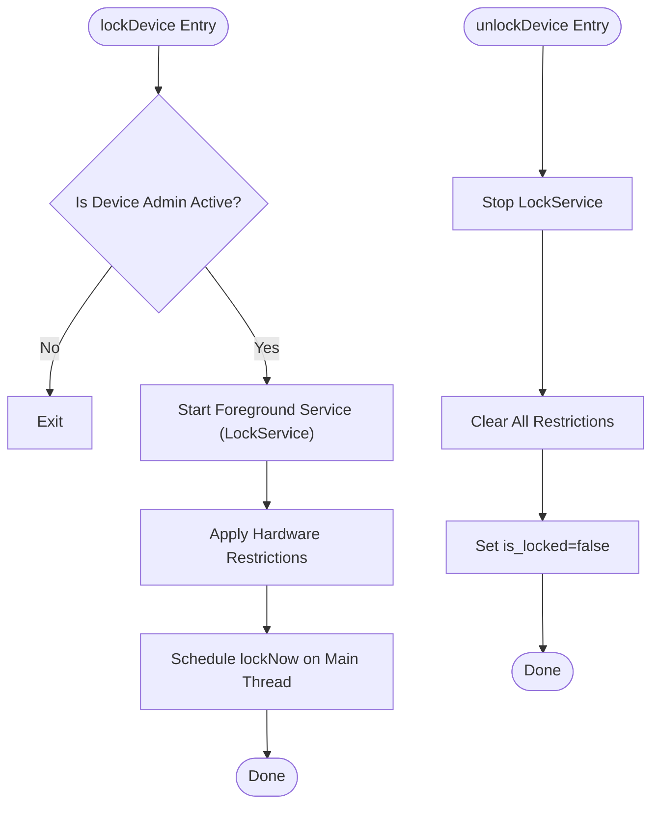
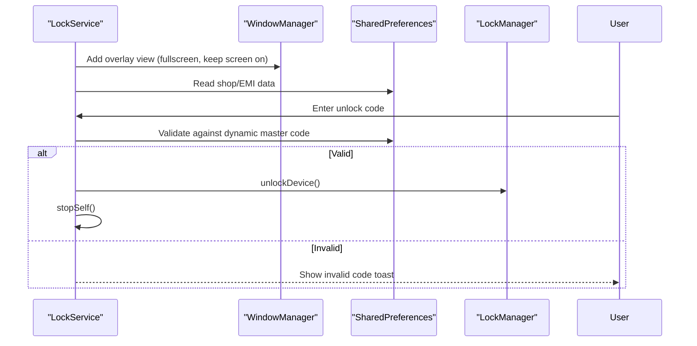
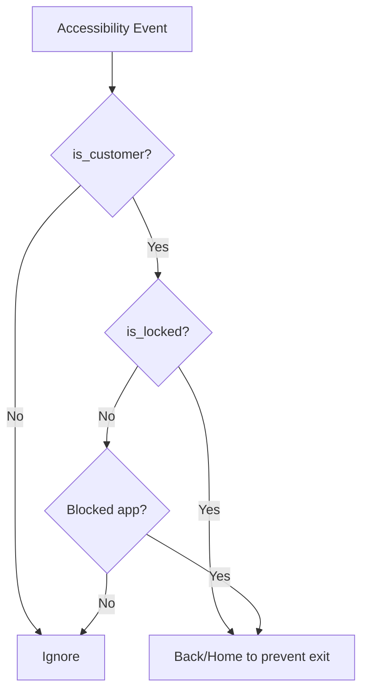
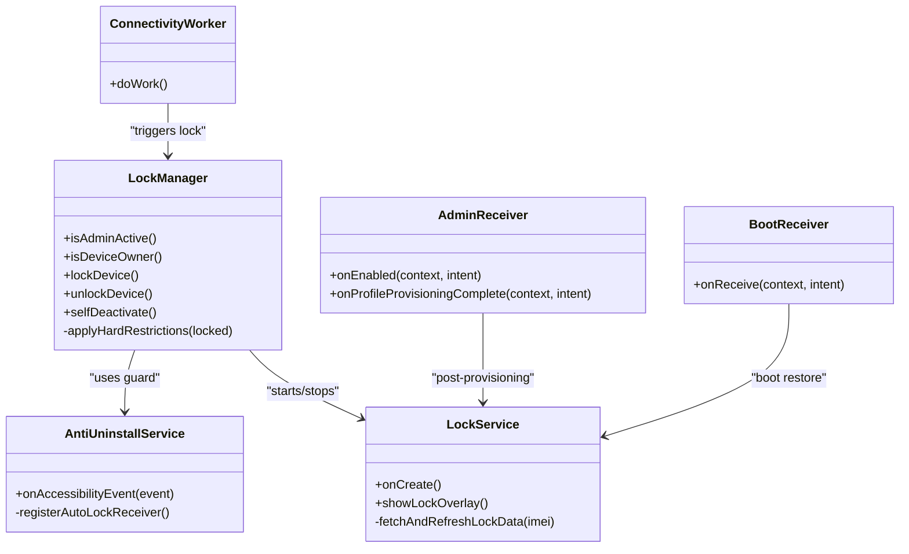

# Device Lifecycle Management

<cite>
**Referenced Files in This Document**
- [LockManager.kt](file://app/src/main/java/com/pksafe/lock/manager/util/LockManager.kt)
- [LockService.kt](file://app/src/main/java/com/pksafe/lock/manager/service/LockService.kt)
- [AdminReceiver.kt](file://app/src/main/java/com/pksafe/lock/manager/receiver/AdminReceiver.kt)
- [AntiUninstallService.kt](file://app/src/main/java/com/pksafe/lock/manager/service/AntiUninstallService.kt)
- [BootReceiver.kt](file://app/src/main/java/com/pksafe/lock/manager/receiver/BootReceiver.kt)
- [ConnectivityWorker.kt](file://app/src/main/java/com/pksafe/lock/manager/service/ConnectivityWorker.kt)
- [device_admin_policies.xml](file://app/src/main/res/xml/device_admin_policies.xml)
- [MainActivity.kt](file://app/src/main/java/com/pksafe/lock/manager/MainActivity.kt)
</cite>

## Table of Contents
1. Introduction
2. Project Structure
3. Core Components
4. Architecture Overview
5. Detailed Component Analysis
6. Dependency Analysis
7. Performance Considerations
8. Troubleshooting Guide
9. Conclusion

## Introduction
This document explains PK Locker’s device lifecycle management with a focus on lock/unlock operations and self-deactivation workflows. It covers how the system initiates foreground services, applies hardware restrictions, locks the device immediately, reverses restrictions to unlock, and removes all Device Admin and Device Owner privileges so the app can be uninstalled normally. It also includes state transitions, error handling, recovery procedures, multi-threading considerations, background service management, user notifications, and troubleshooting across Android versions and OEMs.

## Project Structure
PK Locker organizes lifecycle logic around:
- A central manager for policy enforcement and privilege control
- Foreground services that enforce UI-level locking and guard behavior
- Receivers that bootstrap services after boot or provisioning events
- Background workers that monitor connectivity and trigger locks when offline too long
- Policy declarations for Device Admin capabilities

**Diagram sources**
- [LockManager.kt:111-148](file://app/src/main/java/com/pksafe/lock/manager/util/LockManager.kt#L111-L148)
- [LockService.kt:50-80](file://app/src/main/java/com/pksafe/lock/manager/service/LockService.kt#L50-L80)
- [AdminReceiver.kt:16-36](file://app/src/main/java/com/pksafe/lock/manager/receiver/AdminReceiver.kt#L16-L36)
- [BootReceiver.kt:11-24](file://app/src/main/java/com/pksafe/lock/manager/receiver/BootReceiver.kt#L11-L24)
- [ConnectivityWorker.kt:17-46](file://app/src/main/java/com/pksafe/lock/manager/service/ConnectivityWorker.kt#L17-L46)
- [device_admin_policies.xml:1-12](file://app/src/main/res/xml/device_admin_policies.xml#L1-L12)

**Section sources**
- [LockManager.kt:111-148](file://app/src/main/java/com/pksafe/lock/manager/util/LockManager.kt#L111-L148)
- [LockService.kt:50-80](file://app/src/main/java/com/pksafe/lock/manager/service/LockService.kt#L50-L80)
- [AdminReceiver.kt:16-36](file://app/src/main/java/com/pksafe/lock/manager/receiver/AdminReceiver.kt#L16-L36)
- [BootReceiver.kt:11-24](file://app/src/main/java/com/pksafe/lock/manager/receiver/BootReceiver.kt#L11-L24)
- [ConnectivityWorker.kt:17-46](file://app/src/main/java/com/pksafe/lock/manager/service/ConnectivityWorker.kt#L17-L46)
- [device_admin_policies.xml:1-12](file://app/src/main/res/xml/device_admin_policies.xml#L1-L12)

## Core Components
- LockManager: Orchestrates device locking/unlocking, applies hardware restrictions via DevicePolicyManager, manages Device Admin/Owner privileges, and provides self-deactivation.
- LockService: Foreground service that renders an overlay lock screen, enforces keyguard behavior, and handles unlock code entry.
- AntiUninstallService: Accessibility-based guard that blocks settings navigation and enforces app blocking and auto-lock on connectivity loss.
- AdminReceiver: Handles Device Admin enablement and provisioning completion; grants critical permissions and persists IMEI.
- BootReceiver: Restarts the lock foreground service after reboot if conditions are met.
- ConnectivityWorker: Periodically checks connectivity; locks the device if offline beyond a threshold and reports status to server.
- MainActivity: Triggers lock/unlock based on shared preferences and ensures permanent restrictions for customers.

**Section sources**
- [LockManager.kt:27-405](file://app/src/main/java/com/pksafe/lock/manager/util/LockManager.kt#L27-L405)
- [LockService.kt:41-329](file://app/src/main/java/com/pksafe/lock/manager/service/LockService.kt#L41-L329)
- [AntiUninstallService.kt:22-223](file://app/src/main/java/com/pksafe/lock/manager/service/AntiUninstallService.kt#L22-L223)
- [AdminReceiver.kt:14-103](file://app/src/main/java/com/pksafe/lock/manager/receiver/AdminReceiver.kt#L14-L103)
- [BootReceiver.kt:10-26](file://app/src/main/java/com/pksafe/lock/manager/receiver/BootReceiver.kt#L10-L26)
- [ConnectivityWorker.kt:15-71](file://app/src/main/java/com/pksafe/lock/manager/service/ConnectivityWorker.kt#L15-L71)
- [MainActivity.kt:370-414](file://app/src/main/java/com/pksafe/lock/manager/MainActivity.kt#L370-L414)

## Architecture Overview
The lifecycle is driven by state stored in SharedPreferences (e.g., is_locked, is_customer). When locked, the system starts a foreground service, applies restrictions, and forces immediate lock. When unlocked, it stops services and clears restrictions. Self-deactivation removes privileges entirely.

**Diagram sources**
- [LockManager.kt:111-148](file://app/src/main/java/com/pksafe/lock/manager/util/LockManager.kt#L111-L148)
- [LockService.kt:50-80](file://app/src/main/java/com/pksafe/lock/manager/service/LockService.kt#L50-L80)

## Detailed Component Analysis

### LockManager: lockDevice, unlockDevice, selfDeactivate
- lockDevice
  - Starts LockService as a foreground service (API level aware).
  - Applies hardware restrictions via DevicePolicyManager (camera block, USB transfer, factory reset, safe boot, debugging, Wi‑Fi config, outgoing calls, media mount).
  - Disables status bar expansion and keyguard features where supported.
  - Schedules immediate lock via lockNow on the main thread with a short delay.
- unlockDevice
  - Stops LockService.
  - Clears all previously applied restrictions.
  - Updates local state to reflect unlocked.
- selfDeactivate
  - Clears all user restrictions applied earlier.
  - Removes Device Owner status using clearDeviceOwnerApp.
  - Removes Device Admin active admin component.
  - Resets customer-related flags in SharedPreferences to allow normal uninstallation.

**Diagram sources**
- [LockManager.kt:111-148](file://app/src/main/java/com/pksafe/lock/manager/util/LockManager.kt#L111-L148)
- [LockManager.kt:151-200](file://app/src/main/java/com/pksafe/lock/manager/util/LockManager.kt#L151-L200)

**Section sources**
- [LockManager.kt:111-148](file://app/src/main/java/com/pksafe/lock/manager/util/LockManager.kt#L111-L148)
- [LockManager.kt:151-200](file://app/src/main/java/com/pksafe/lock/manager/util/LockManager.kt#L151-L200)
- [LockManager.kt:351-404](file://app/src/main/java/com/pksafe/lock/manager/util/LockManager.kt#L351-L404)

### LockService: Foreground lock overlay and unlock flow
- Creates a persistent notification channel and runs as a foreground service.
- Renders an overlay view that blocks back/home/recents and shows EMI/support info.
- Validates unlock code derived from device IMEI (fallback master code), then triggers unlockDevice and stops itself.
- Listens for connectivity changes to support auto-lock behavior when configured.

**Diagram sources**
- [LockService.kt:50-80](file://app/src/main/java/com/pksafe/lock/manager/service/LockService.kt#L50-L80)
- [LockService.kt:125-234](file://app/src/main/java/com/pksafe/lock/manager/service/LockService.kt#L125-L234)
- [LockService.kt:200-218](file://app/src/main/java/com/pksafe/lock/manager/service/LockService.kt#L200-L218)

**Section sources**
- [LockService.kt:50-80](file://app/src/main/java/com/pksafe/lock/manager/service/LockService.kt#L50-L80)
- [LockService.kt:125-234](file://app/src/main/java/com/pksafe/lock/manager/service/LockService.kt#L125-L234)
- [LockService.kt:200-218](file://app/src/main/java/com/pksafe/lock/manager/service/LockService.kt#L200-L218)

### AntiUninstallService: Guard and auto-lock
- Monitors accessibility events to detect attempts to open Settings or perform restricted actions.
- Blocks navigation to Settings/Installer screens when configured.
- On connectivity loss (if enabled), marks device as locked and triggers lockDevice.

**Diagram sources**
- [AntiUninstallService.kt:136-211](file://app/src/main/java/com/pksafe/lock/manager/service/AntiUninstallService.kt#L136-L211)
- [AntiUninstallService.kt:88-110](file://app/src/main/java/com/pksafe/lock/manager/service/AntiUninstallService.kt#L88-L110)

**Section sources**
- [AntiUninstallService.kt:88-110](file://app/src/main/java/com/pksafe/lock/manager/service/AntiUninstallService.kt#L88-L110)
- [AntiUninstallService.kt:136-211](file://app/src/main/java/com/pksafe/lock/manager/service/AntiUninstallService.kt#L136-L211)

### AdminReceiver: Provisioning and permission setup
- On admin enablement and provisioning completion, fetches IMEI and sets critical permissions for the app as Device Owner.
- Launches the app post-provisioning to finalize setup.

**Section sources**
- [AdminReceiver.kt:16-36](file://app/src/main/java/com/pksafe/lock/manager/receiver/AdminReceiver.kt#L16-L36)
- [AdminReceiver.kt:43-102](file://app/src/main/java/com/pksafe/lock/manager/receiver/AdminReceiver.kt#L43-L102)

### BootReceiver: Post-boot restoration
- On boot completed, restarts the lock foreground service if Device Admin is active and overlay permission is granted.

**Section sources**
- [BootReceiver.kt:11-24](file://app/src/main/java/com/pksafe/lock/manager/receiver/BootReceiver.kt#L11-L24)

### ConnectivityWorker: Offline lock enforcement
- If device has been offline longer than a threshold, sets is_locked and invokes lockDevice; otherwise sends heartbeat.

**Section sources**
- [ConnectivityWorker.kt:17-46](file://app/src/main/java/com/pksafe/lock/manager/service/ConnectivityWorker.kt#L17-L46)

### MainActivity: State-driven lifecycle triggers
- Observes is_locked and triggers lockDevice/unlockDevice accordingly.
- Ensures permanent restrictions for customers even when not locked.
- Provides reset path that calls selfDeactivate and clears local state.

**Section sources**
- [MainActivity.kt:370-414](file://app/src/main/java/com/pksafe/lock/manager/MainActivity.kt#L370-L414)
- [MainActivity.kt:158-168](file://app/src/main/java/com/pksafe/lock/manager/MainActivity.kt#L158-L168)

## Dependency Analysis
- LockManager depends on DevicePolicyManager and SharedPreferences to enforce policies and persist state.
- LockService depends on WindowManager for overlay and Notification APIs for foreground service.
- AntiUninstallService depends on AccessibilityService and ConnectivityManager for guard and auto-lock.
- BootReceiver and ConnectivityWorker depend on system broadcasts/work scheduling to maintain lifecycle continuity.
- AdminReceiver bridges provisioning events to app state and permissions.

**Diagram sources**
- [LockManager.kt:27-405](file://app/src/main/java/com/pksafe/lock/manager/util/LockManager.kt#L27-L405)
- [LockService.kt:41-329](file://app/src/main/java/com/pksafe/lock/manager/service/LockService.kt#L41-L329)
- [AntiUninstallService.kt:22-223](file://app/src/main/java/com/pksafe/lock/manager/service/AntiUninstallService.kt#L22-L223)
- [AdminReceiver.kt:14-103](file://app/src/main/java/com/pksafe/lock/manager/receiver/AdminReceiver.kt#L14-L103)
- [BootReceiver.kt:10-26](file://app/src/main/java/com/pksafe/lock/manager/receiver/BootReceiver.kt#L10-L26)
- [ConnectivityWorker.kt:15-71](file://app/src/main/java/com/pksafe/lock/manager/service/ConnectivityWorker.kt#L15-L71)

## Performance Considerations
- Foreground service lifecycle: Ensure proper startForeground usage and notification channels to avoid ANRs and kill risks on modern Android.
- Restriction application: Batch restriction changes within a single call chain to minimize overhead and ensure atomicity.
- Overlay rendering: Avoid heavy work on the main thread; use background coroutines for network updates and post UI changes to the main thread.
- Connectivity checks: Use WorkManager for periodic tasks to respect Doze and battery optimizations.
- IMEI fetching: Cache IMEI in SharedPreferences to reduce repeated telephony queries.

[No sources needed since this section provides general guidance]

## Troubleshooting Guide

Common issues and recovery procedures:

- Stuck foreground service after unlock
  - Symptom: Lock overlay remains visible or service does not stop.
  - Recovery: Explicitly stop the service via unlockDevice; verify onDestroy removes overlay views and unregisters receivers.
  - References: [LockService.kt:316-329](file://app/src/main/java/com/pksafe/lock/manager/service/LockService.kt#L316-L329)

- Incomplete restriction removal
  - Symptom: Some restrictions remain after unlock.
  - Recovery: Call unlockDevice to clear all restrictions; verify each setUserRestriction is invoked with false during unlock.
  - References: [LockManager.kt:136-148](file://app/src/main/java/com/pksafe/lock/manager/util/LockManager.kt#L136-L148), [LockManager.kt:194-200](file://app/src/main/java/com/pksafe/lock/manager/util/LockManager.kt#L194-L200)

- Privilege escalation/de-escalation failures
  - Symptom: Unable to remove Device Owner or Device Admin.
  - Recovery: Ensure all user restrictions are cleared before removing Device Owner; then remove active admin. Verify logs for errors and retry.
  - References: [LockManager.kt:351-404](file://app/src/main/java/com/pksafe/lock/manager/util/LockManager.kt#L351-L404)

- Auto-lock not triggered on connectivity loss
  - Symptom: Device stays unlocked despite no internet.
  - Recovery: Confirm AutoUninstallService registers connectivity receiver and triggers lockDevice; check isOnline logic and prefs flags.
  - References: [AntiUninstallService.kt:88-110](file://app/src/main/java/com/pksafe/lock/manager/service/AntiUninstallService.kt#L88-L110)

- Boot-time service not restored
  - Symptom: After reboot, lock overlay does not appear.
  - Recovery: Ensure BootReceiver starts LockService when Device Admin is active and overlay permission is granted.
  - References: [BootReceiver.kt:11-24](file://app/src/main/java/com/pksafe/lock/manager/receiver/BootReceiver.kt#L11-L24)

- Manufacturer-specific behaviors (Samsung Android 13/14)
  - Symptom: Accessibility service not starting reliably via settings.
  - Recovery: Use DevicePolicyManager.setSecureSetting to enable accessibility services for Device Owners; fallback to direct Secure settings write if needed.
  - References: [LockManager.kt:75-108](file://app/src/main/java/com/pksafe/lock/manager/util/LockManager.kt#L75-L108)

- Immediate lock not happening
  - Symptom: Device does not lock right away after restrictions applied.
  - Recovery: Ensure lockNow is scheduled on the main thread with a small delay; verify Device Admin is active.
  - References: [LockManager.kt:111-134](file://app/src/main/java/com/pksafe/lock/manager/util/LockManager.kt#L111-L134)

**Section sources**
- [LockService.kt:316-329](file://app/src/main/java/com/pksafe/lock/manager/service/LockService.kt#L316-L329)
- [LockManager.kt:136-148](file://app/src/main/java/com/pksafe/lock/manager/util/LockManager.kt#L136-L148)
- [LockManager.kt:194-200](file://app/src/main/java/com/pksafe/lock/manager/util/LockManager.kt#L194-L200)
- [LockManager.kt:351-404](file://app/src/main/java/com/pksafe/lock/manager/util/LockManager.kt#L351-L404)
- [AntiUninstallService.kt:88-110](file://app/src/main/java/com/pksafe/lock/manager/service/AntiUninstallService.kt#L88-L110)
- [BootReceiver.kt:11-24](file://app/src/main/java/com/pksafe/lock/manager/receiver/BootReceiver.kt#L11-L24)
- [LockManager.kt:75-108](file://app/src/main/java/com/pksafe/lock/manager/util/LockManager.kt#L75-L108)
- [LockManager.kt:111-134](file://app/src/main/java/com/pksafe/lock/manager/util/LockManager.kt#L111-L134)

## Conclusion
PK Locker’s device lifecycle management combines robust Device Policy Manager controls, a resilient foreground lock service, and guard mechanisms to enforce security across diverse Android environments. The lockDevice workflow ensures immediate locking with comprehensive restrictions, while unlockDevice cleanly reverses them. selfDeactivate safely strips all privileges to permit normal uninstallation. Proper error handling, background service management, and user notifications are integrated throughout to maintain reliability and usability.

[No sources needed since this section summarizes without analyzing specific files]