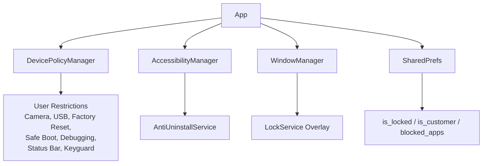
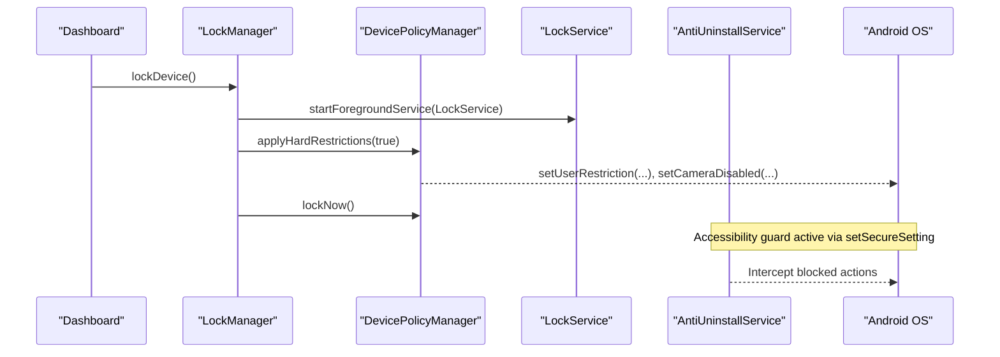
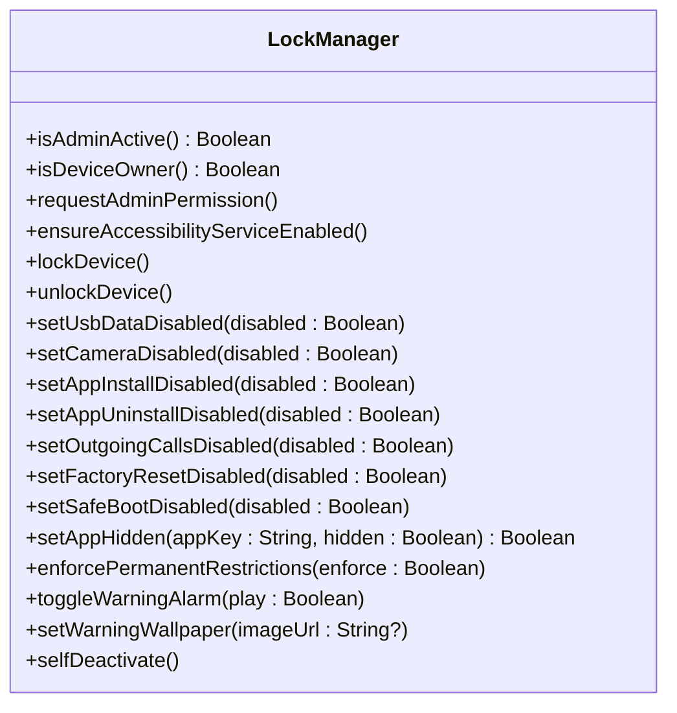
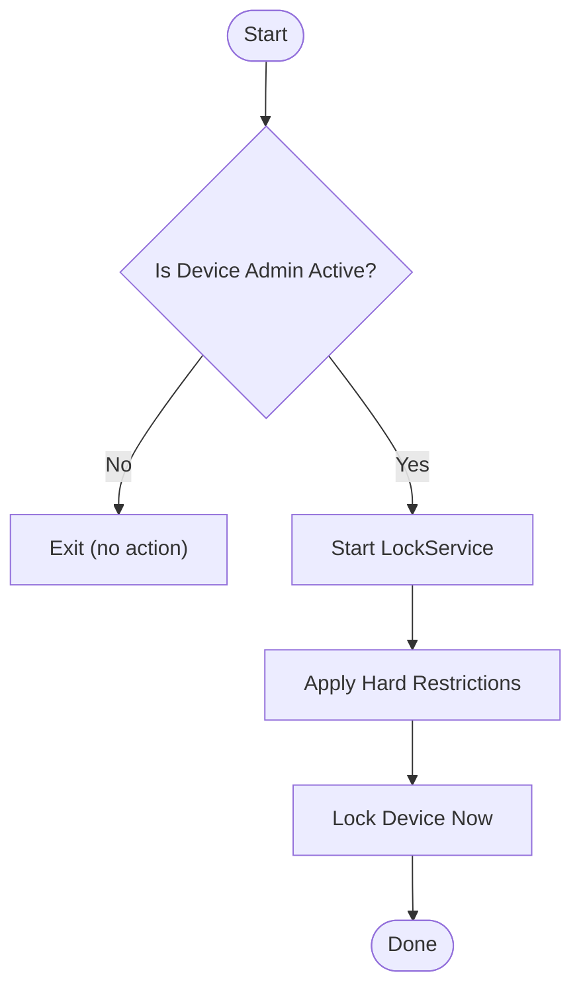
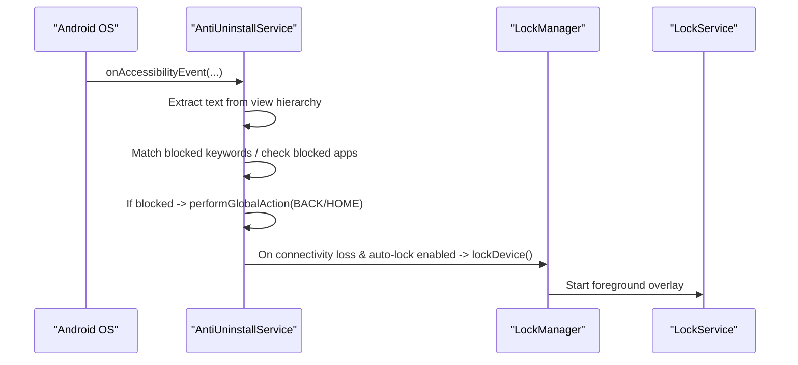
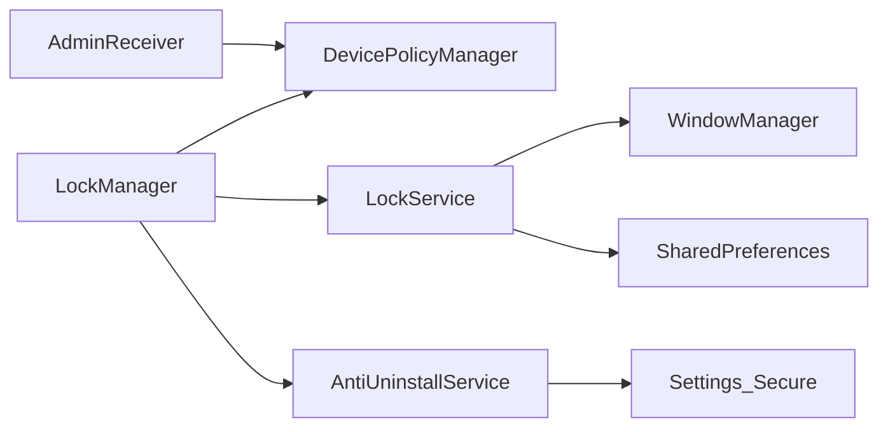

# Device Management System

<cite>
**Referenced Files in This Document**
- [LockManager.kt](file://app/src/main/java/com/pksafe/lock/manager/util/LockManager.kt)
- [AntiUninstallService.kt](file://app/src/main/java/com/pksafe/lock/manager/service/AntiUninstallService.kt)
- [AdminReceiver.kt](file://app/src/main/java/com/pksafe/lock/manager/receiver/AdminReceiver.kt)
- [LockService.kt](file://app/src/main/java/com/pksafe/lock/manager/service/LockService.kt)
- [device_admin_policies.xml](file://app/src/main/res/xml/device_admin_policies.xml)
- [accessibility_service_config.xml](file://app/src/main/res/xml/accessibility_service_config.xml)
- [AndroidManifest.xml](file://app/src/main/AndroidManifest.xml)
</cite>

## Table of Contents
1. Introduction
2. Project Structure
3. Core Components
4. Architecture Overview
5. Detailed Component Analysis
6. Dependency Analysis
7. Performance Considerations
8. Troubleshooting Guide
9. Conclusion

## Introduction
This document explains PK Locker’s device management system with a focus on the LockManager class as the central orchestrator for enterprise-grade device control. It details how hardware restrictions are enforced via Android’s Device Policy Manager (DPM), including camera blocking, USB file transfer prevention, factory reset protection, safe mode disabling, ADB debugging prevention, system settings modification blocking, and status bar restriction. It also documents the Accessibility Service integration for anti-uninstall protection using setSecureSetting enterprise APIs, provides lock/unlock workflows, individual dashboard controls, permanent restriction enforcement, error handling strategies, permission requirements, and compatibility considerations across Android versions.

## Project Structure
PK Locker implements device management through a combination of:
- Device Admin Receiver to handle provisioning and policy activation
- LockManager as the central API surface for DPM-based controls
- LockService for persistent overlay and foreground enforcement
- AntiUninstallService for accessibility-driven UI interception and anti-tamper behavior
- Manifest declarations for services, receivers, and policies

**Diagram sources**
- [LockManager.kt:27-406](file://app/src/main/java/com/pksafe/lock/manager/util/LockManager.kt#L27-L406)
- [AntiUninstallService.kt:22-224](file://app/src/main/java/com/pksafe/lock/manager/service/AntiUninstallService.kt#L22-L224)
- [LockService.kt:41-330](file://app/src/main/java/com/pksafe/lock/manager/service/LockService.kt#L41-L330)
- [AndroidManifest.xml:73-112](file://app/src/main/AndroidManifest.xml#L73-L112)

**Section sources**
- [AndroidManifest.xml:73-112](file://app/src/main/AndroidManifest.xml#L73-L112)
- [device_admin_policies.xml:1-13](file://app/src/main/res/xml/device_admin_policies.xml#L1-L13)
- [accessibility_service_config.xml:1-8](file://app/src/main/res/xml/accessibility_service_config.xml#L1-L8)

## Core Components
- LockManager: Central orchestrator for DPM-based restrictions, overlay start/stop, and permanent enforcement. Provides methods for locking/unlocking, per-feature toggles, app hiding, and self-deactivation.
- AntiUninstallService: Accessibility service that intercepts user actions, blocks restricted settings screens, prevents uninstall flows, and supports auto-lock on connectivity loss.
- AdminReceiver: Handles device admin lifecycle events, grants critical permissions when device owner is active, and captures IMEI for unlock code derivation.
- LockService: Foreground service that renders an overlay enforcing the lock state, validates unlock codes, and integrates with network updates for dynamic content.

**Section sources**
- [LockManager.kt:27-406](file://app/src/main/java/com/pksafe/lock/manager/util/LockManager.kt#L27-L406)
- [AntiUninstallService.kt:22-224](file://app/src/main/java/com/pksafe/lock/manager/service/AntiUninstallService.kt#L22-L224)
- [AdminReceiver.kt:14-104](file://app/src/main/java/com/pksafe/lock/manager/receiver/AdminReceiver.kt#L14-L104)
- [LockService.kt:41-330](file://app/src/main/java/com/pksafe/lock/manager/service/LockService.kt#L41-L330)

## Architecture Overview
The system combines enterprise device policies with runtime enforcement:
- LockManager uses DevicePolicyManager to apply restrictions and manage secure settings for accessibility.
- AntiUninstallService monitors UI events to block unauthorized changes and enforce lockdown.
- LockService maintains a persistent overlay and triggers lock/unlock based on state and connectivity.
- AdminReceiver ensures privileges and permissions are granted during provisioning.

**Diagram sources**
- [LockManager.kt:111-148](file://app/src/main/java/com/pksafe/lock/manager/util/LockManager.kt#L111-L148)
- [LockManager.kt:151-200](file://app/src/main/java/com/pksafe/lock/manager/util/LockManager.kt#L151-L200)
- [LockService.kt:50-80](file://app/src/main/java/com/pksafe/lock/manager/service/LockService.kt#L50-L80)
- [AntiUninstallService.kt:136-211](file://app/src/main/java/com/pksafe/lock/manager/service/AntiUninstallService.kt#L136-L211)

## Detailed Component Analysis

### LockManager: Enterprise Device Control Orchestrator
LockManager encapsulates all device policy operations and enforces both temporary and permanent restrictions.

Key responsibilities:
- Check and request Device Admin and Device Owner privileges
- Enable Accessibility Service via DPM setSecureSetting
- Apply full hardware restrictions when locked
- Provide granular controls for dashboard features
- Enforce permanent restrictions even when unlocked
- Self-deactivate by clearing privileges and restrictions

**Diagram sources**
- [LockManager.kt:27-406](file://app/src/main/java/com/pksafe/lock/manager/util/LockManager.kt#L27-L406)

#### Lock/Unlock Workflows
- Lock workflow:
  - Start LockService as a foreground service
  - Apply hard restrictions via DPM (camera, USB, factory reset, safe boot, debugging, Wi-Fi config, outgoing calls, media mount)
  - Optionally disable status bar expansion and keyguard features
  - Trigger immediate device lock
- Unlock workflow:
  - Stop LockService
  - Clear applied restrictions
  - Persist unlock state

**Diagram sources**
- [LockManager.kt:111-148](file://app/src/main/java/com/pksafe/lock/manager/util/LockManager.kt#L111-L148)
- [LockManager.kt:151-200](file://app/src/main/java/com/pksafe/lock/manager/util/LockManager.kt#L151-L200)

#### Individual Control Methods (Dashboard Features)
- USB data transfer: Disables USB file transfer if Device Owner is active
- Camera: Enables/disables camera globally
- App install/uninstall: Blocks unknown sources and app installs/uninstalls
- Outgoing calls: Restricts making calls
- Factory reset: Prevents manual factory resets
- Safe boot: Blocks safe mode entry

These methods use DPM setUserRestriction or specific setters and log outcomes.

**Section sources**
- [LockManager.kt:204-261](file://app/src/main/java/com/pksafe/lock/manager/util/LockManager.kt#L204-L261)

#### Permanent Restriction Enforcement
Even when the device is “unlocked,” certain restrictions remain enforced to prevent bypasses:
- Block factory reset
- Block USB file transfer
- Block ADB/debugging features

This ensures continuous protection against common tampering vectors.

**Section sources**
- [LockManager.kt:299-315](file://app/src/main/java/com/pksafe/lock/manager/util/LockManager.kt#L299-L315)

#### Accessibility Integration for Anti-Uninstall Protection
- Uses DPM setSecureSetting to enable the Accessibility Service reliably on modern Android versions
- Falls back to direct Settings.Secure writes if needed
- Ensures ACCESSIBILITY_ENABLED is set to true

**Section sources**
- [LockManager.kt:81-108](file://app/src/main/java/com/pksafe/lock/manager/util/LockManager.kt#L81-L108)

#### Self-Deactivation Flow
When authorized to release the device:
- Clears all user restrictions
- Removes Device Owner status
- Removes Device Admin
- Resets local flags in SharedPrefs

**Section sources**
- [LockManager.kt:354-404](file://app/src/main/java/com/pksafe/lock/manager/util/LockManager.kt#L354-L404)

### AntiUninstallService: Accessibility Guard
Monitors UI interactions to block unauthorized actions and enforce lockdown:
- Detects and blocks attempts to access settings, package installer, developer options, and similar screens
- Intercepts navigation to return to home when restricted actions are detected
- Supports auto-lock on connectivity loss when enabled
- Checks whether the service is enabled via system settings and AccessibilityManager

**Diagram sources**
- [AntiUninstallService.kt:119-211](file://app/src/main/java/com/pksafe/lock/manager/service/AntiUninstallService.kt#L119-L211)
- [AntiUninstallService.kt:88-117](file://app/src/main/java/com/pksafe/lock/manager/service/AntiUninstallService.kt#L88-L117)
- [LockManager.kt:111-148](file://app/src/main/java/com/pksafe/lock/manager/util/LockManager.kt#L111-L148)

**Section sources**
- [AntiUninstallService.kt:22-224](file://app/src/main/java/com/pksafe/lock/manager/service/AntiUninstallService.kt#L22-L224)

### AdminReceiver: Provisioning and Privileges
Handles device admin lifecycle and provisioning completion:
- Grants critical permissions to itself when running as Device Owner
- Captures IMEI(s) for dynamic unlock code generation
- Launches the app post-provisioning to finalize setup

**Section sources**
- [AdminReceiver.kt:14-104](file://app/src/main/java/com/pksafe/lock/manager/receiver/AdminReceiver.kt#L14-L104)

### LockService: Persistent Overlay and Enforcement
Maintains a persistent overlay with:
- Foreground notification to keep the service alive
- Overlay window parameters to ensure visibility and input handling
- Dynamic unlock code derived from device IMEI
- Network-backed refresh of EMI and shop information
- Auto-lock trigger on connectivity loss

**Section sources**
- [LockService.kt:41-330](file://app/src/main/java/com/pksafe/lock/manager/service/LockService.kt#L41-L330)

## Dependency Analysis
- LockManager depends on DevicePolicyManager and Context; it coordinates with LockService and AntiUninstallService indirectly via intents and secure settings.
- AntiUninstallService depends on AccessibilityService APIs and reads/writes to Settings.Secure; it interacts with LockManager for lock enforcement.
- AdminReceiver depends on DevicePolicyManager to grant permissions and read telephony info.
- LockService depends on WindowManager, NotificationManager, and SharedPreferences; it may call LockManager to unlock.

**Diagram sources**
- [LockManager.kt:27-406](file://app/src/main/java/com/pksafe/lock/manager/util/LockManager.kt#L27-L406)
- [AntiUninstallService.kt:22-224](file://app/src/main/java/com/pksafe/lock/manager/service/AntiUninstallService.kt#L22-L224)
- [AdminReceiver.kt:14-104](file://app/src/main/java/com/pksafe/lock/manager/receiver/AdminReceiver.kt#L14-L104)
- [LockService.kt:41-330](file://app/src/main/java/com/pksafe/lock/manager/service/LockService.kt#L41-L330)

**Section sources**
- [AndroidManifest.xml:73-112](file://app/src/main/AndroidManifest.xml#L73-L112)

## Performance Considerations
- Minimize repeated DPM calls by batching restrictions within lockDevice and applying them once.
- Use background threads for network-bound tasks (e.g., wallpaper updates, API refresh) to avoid UI jank.
- Avoid excessive Accessibility tree traversal; cache or throttle event processing where possible.
- Ensure foreground notifications comply with platform policies to maintain service longevity.

[No sources needed since this section provides general guidance]

## Troubleshooting Guide
Common issues and resolutions:
- Accessibility service not starting:
  - Ensure Device Owner is active and use setSecureSetting to enable the service; fallback to Settings.Secure if necessary.
  - Verify manifest declares the AccessibilityService and its configuration.
- Restrictions not applied:
  - Confirm Device Admin is active before calling DPM methods.
  - Check Android version compatibility for specific APIs (e.g., status bar disabled requires API level checks).
- Overlay not visible or keyboard unresponsive:
  - Ensure proper window flags and overlay permission are granted.
  - Validate that the service is started as foreground with a valid notification channel.
- Permissions denied:
  - Grant required permissions at runtime and via Device Owner when applicable.
  - Review manifest declarations for SMS, location, overlay, and special foreground service types.

**Section sources**
- [LockManager.kt:81-108](file://app/src/main/java/com/pksafe/lock/manager/util/LockManager.kt#L81-L108)
- [LockManager.kt:151-200](file://app/src/main/java/com/pksafe/lock/manager/util/LockManager.kt#L151-L200)
- [LockService.kt:107-155](file://app/src/main/java/com/pksafe/lock/manager/service/LockService.kt#L107-L155)
- [AndroidManifest.xml:5-34](file://app/src/main/AndroidManifest.xml#L5-L34)

## Conclusion
PK Locker’s device management system centers around LockManager, which leverages Android’s Device Policy Manager to enforce robust enterprise controls. Combined with an Accessibility Service guard and a persistent overlay service, it delivers comprehensive protection against unauthorized usage, tampering, and bypass attempts. The design balances strong security with practical usability, providing granular controls, permanent enforcement, and resilient error handling across Android versions.

[No sources needed since this section summarizes without analyzing specific files]