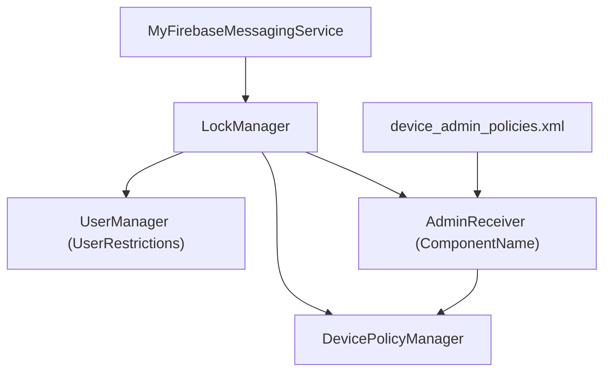
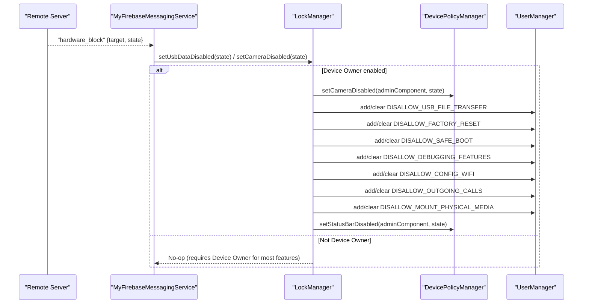
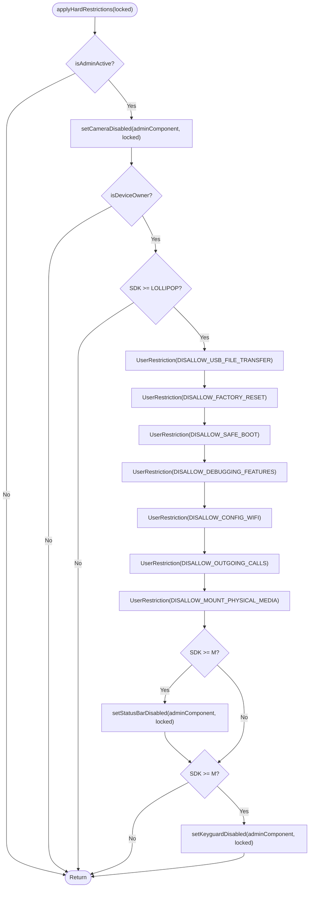
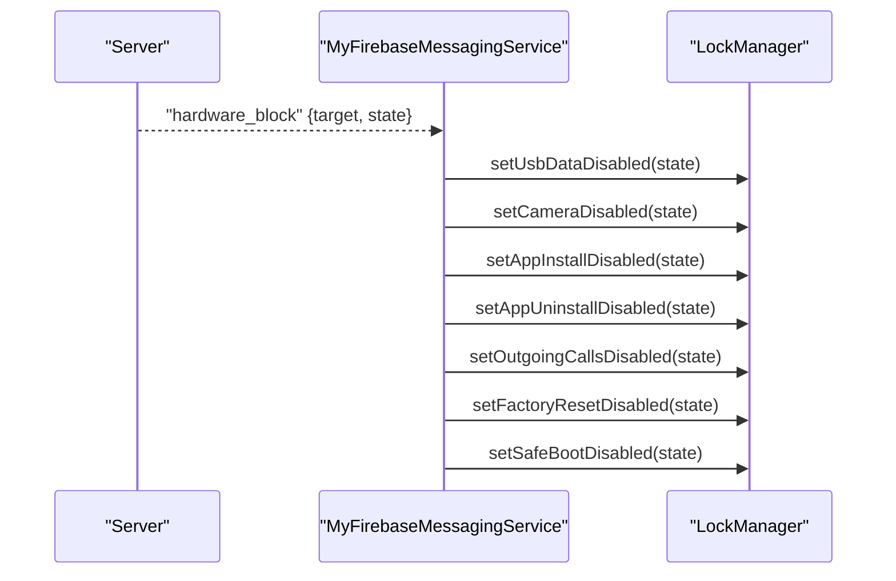
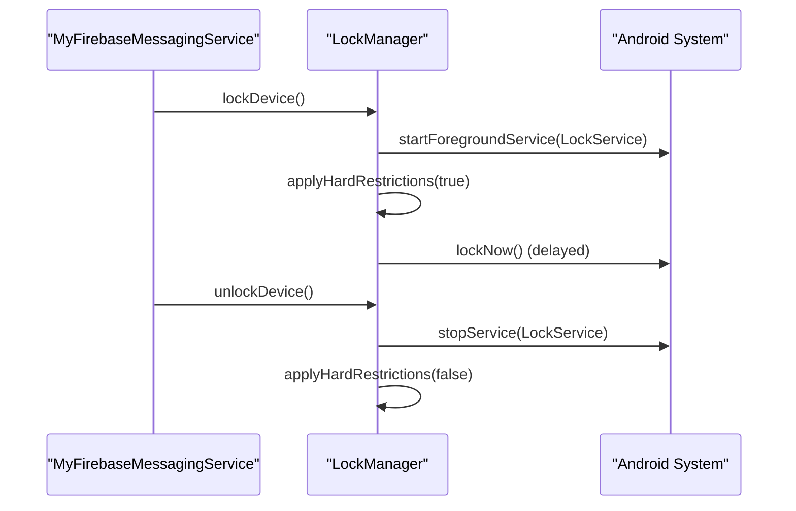
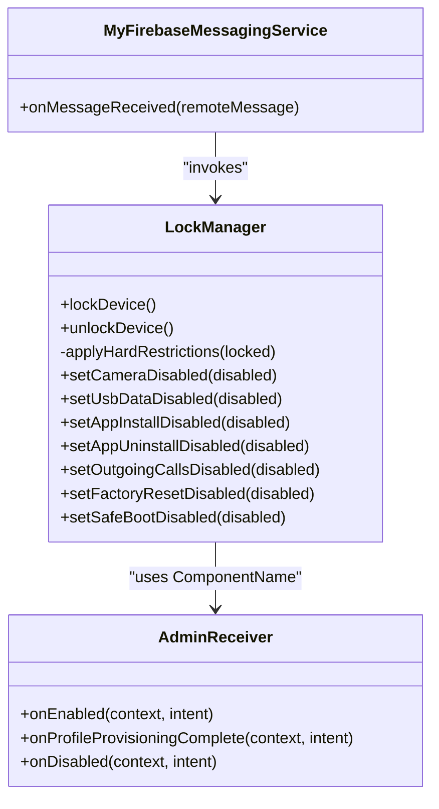

# Hardware Restrictions

<cite>
**Referenced Files in This Document**
- [LockManager.kt](file://app/src/main/java/com/pksafe/lock/manager/util/LockManager.kt)
- [MyFirebaseMessagingService.kt](file://app/src/main/java/com/pksafe/lock/manager/service/MyFirebaseMessagingService.kt)
- [AdminReceiver.kt](file://app/src/main/java/com/pksafe/lock/manager/receiver/AdminReceiver.kt)
- [device_admin_policies.xml](file://app/src/main/res/xml/device_admin_policies.xml)
</cite>

## Table of Contents
1. Introduction
2. Project Structure
3. Core Components
4. Architecture Overview
5. Detailed Component Analysis
6. Dependency Analysis
7. Performance Considerations
8. Troubleshooting Guide
9. Conclusion

## Introduction
This document explains PK Locker’s hardware restriction system with a focus on the applyHardRestrictions method and individual control methods. It details how camera blocking, USB file transfer prevention, factory reset protection, safe mode disabling, ADB debugging prevention, system settings modification blocking, and status bar restriction are enforced via Device Owner APIs. It also covers lock/unlock workflows, error handling strategies across Android versions, permission requirements, compatibility considerations from Android Lollipop onward, fallback mechanisms when Device Owner is not available, and performance implications of enforcement.

## Project Structure
The hardware restriction logic is centralized in LockManager, which integrates with DevicePolicyManager and UserRestrictions. Remote commands that trigger restrictions arrive via MyFirebaseMessagingService. Admin capabilities and provisioning callbacks are handled by AdminReceiver, and device admin policies are declared in device_admin_policies.xml.

**Diagram sources**
- [LockManager.kt:27-30](file://app/src/main/java/com/pksafe/lock/manager/util/LockManager.kt#L27-L30)
- [MyFirebaseMessagingService.kt:22-91](file://app/src/main/java/com/pksafe/lock/manager/service/MyFirebaseMessagingService.kt#L22-L91)
- [AdminReceiver.kt:14-36](file://app/src/main/java/com/pksafe/lock/manager/receiver/AdminReceiver.kt#L14-L36)
- [device_admin_policies.xml:1-12](file://app/src/main/res/xml/device_admin_policies.xml#L1-L12)

**Section sources**
- [LockManager.kt:27-49](file://app/src/main/java/com/pksafe/lock/manager/util/LockManager.kt#L27-L49)
- [MyFirebaseMessagingService.kt:22-91](file://app/src/main/java/com/pksafe/lock/manager/service/MyFirebaseMessagingService.kt#L22-L91)
- [AdminReceiver.kt:14-36](file://app/src/main/java/com/pksafe/lock/manager/receiver/AdminReceiver.kt#L14-L36)
- [device_admin_policies.xml:1-12](file://app/src/main/res/xml/device_admin_policies.xml#L1-L12)

## Core Components
- LockManager: Central orchestrator for applying and clearing restrictions using DevicePolicyManager and UserManager. Provides both bulk enforcement (applyHardRestrictions) and granular controls (e.g., setCameraDisabled, setUsbDataDisabled).
- MyFirebaseMessagingService: Receives remote commands and invokes LockManager to enforce or clear restrictions.
- AdminReceiver: Device Admin receiver that handles provisioning completion and grants critical permissions to the app when it is the Device Owner.
- device_admin_policies.xml: Declares device admin policies used by the app.

Key responsibilities:
- Enforce camera disable via DevicePolicyManager.setCameraDisabled.
- Prevent USB file transfers, factory resets, safe boot, ADB/debugging, and system settings changes via UserManager user restrictions when Device Owner is active.
- Restrict status bar expansion via DevicePolicyManager.setStatusBarDisabled on supported versions.
- Provide per-feature toggles for dashboard or remote control.

**Section sources**
- [LockManager.kt:111-192](file://app/src/main/java/com/pksafe/lock/manager/util/LockManager.kt#L111-L192)
- [LockManager.kt:204-261](file://app/src/main/java/com/pksafe/lock/manager/util/LockManager.kt#L204-L261)
- [MyFirebaseMessagingService.kt:47-91](file://app/src/main/java/com/pksafe/lock/manager/service/MyFirebaseMessagingService.kt#L47-L91)
- [AdminReceiver.kt:23-36](file://app/src/main/java/com/pksafe/lock/manager/receiver/AdminReceiver.kt#L23-L36)
- [device_admin_policies.xml:1-12](file://app/src/main/res/xml/device_admin_policies.xml#L1-L12)

## Architecture Overview
The system uses Device Owner APIs to enforce strong restrictions that cannot be bypassed by users. When locked, the app starts an overlay service, applies hard restrictions, and locks the device. When unlocked, it clears all restrictions and stops services.

**Diagram sources**
- [MyFirebaseMessagingService.kt:69-91](file://app/src/main/java/com/pksafe/lock/manager/service/MyFirebaseMessagingService.kt#L69-L91)
- [LockManager.kt:151-192](file://app/src/main/java/com/pksafe/lock/manager/util/LockManager.kt#L151-L192)
- [LockManager.kt:204-261](file://app/src/main/java/com/pksafe/lock/manager/util/LockManager.kt#L204-L261)

## Detailed Component Analysis

### applyHardRestrictions: Bulk Enforcement
- Purpose: Apply or remove a comprehensive set of restrictions when locking or unlocking the device.
- Behavior:
  - Camera blocking: Uses DevicePolicyManager.setCameraDisabled regardless of Device Owner status; requires Device Admin.
  - Device Owner-only restrictions (Android Lollipop+):
    - Block USB file transfer: DISALLOW_USB_FILE_TRANSFER
    - Block factory reset: DISALLOW_FACTORY_RESET
    - Block safe mode: DISALLOW_SAFE_BOOT
    - Block ADB/debugging: DISALLOW_DEBUGGING_FEATURES
    - Block system settings changes: DISALLOW_CONFIG_WIFI
    - Additional controls: DISALLOW_OUTGOING_CALLS, DISALLOW_MOUNT_PHYSICAL_MEDIA
  - Status bar restriction (Android Marshmallow+): setStatusBarDisabled
  - Keyguard behavior (Android Marshmallow+): setKeyguardDisabled
- Error handling: Wrapped in try-catch with logging; non-fatal failures do not break lock flow.
- Compatibility: Checks Build.VERSION.SDK_INT before calling version-specific APIs.

**Diagram sources**
- [LockManager.kt:151-192](file://app/src/main/java/com/pksafe/lock/manager/util/LockManager.kt#L151-L192)

**Section sources**
- [LockManager.kt:151-192](file://app/src/main/java/com/pksafe/lock/manager/util/LockManager.kt#L151-L192)

### Individual Control Methods
- setCameraDisabled(disabled): Requires Device Admin. Calls DevicePolicyManager.setCameraDisabled. Logs success/failure.
- setUsbDataDisabled(disabled): Requires Device Owner and API level Lollipop+. Applies DISALLOW_USB_FILE_TRANSFER.
- setAppInstallDisabled(disabled): Requires Device Owner. Applies DISALLOW_INSTALL_UNKNOWN_SOURCES and DISALLOW_INSTALL_APPS.
- setAppUninstallDisabled(disabled): Requires Device Owner. Applies DISALLOW_UNINSTALL_APPS.
- setOutgoingCallsDisabled(disabled): Requires Device Owner. Applies DISALLOW_OUTGOING_CALLS.
- setFactoryResetDisabled(disabled): Requires Device Owner. Applies DISALLOW_FACTORY_RESET.
- setSafeBootDisabled(disabled): Requires Device Owner. Applies DISALLOW_SAFE_BOOT.

These methods provide fine-grained control for UI dashboards or targeted remote commands.

**Section sources**
- [LockManager.kt:204-261](file://app/src/main/java/com/pksafe/lock/manager/util/LockManager.kt#L204-L261)

### Remote Command Integration
MyFirebaseMessagingService maps incoming commands to LockManager methods:
- hardware_block targets: usb, camera, install, uninstall, calls, reset, boot
- unlock_all: Clears all restrictions and un-hides apps
- deregister: Removes Device Admin and Device Owner privileges so the app can be uninstalled

**Diagram sources**
- [MyFirebaseMessagingService.kt:69-91](file://app/src/main/java/com/pksafe/lock/manager/service/MyFirebaseMessagingService.kt#L69-L91)
- [LockManager.kt:204-261](file://app/src/main/java/com/pksafe/lock/manager/util/LockManager.kt#L204-L261)

**Section sources**
- [MyFirebaseMessagingService.kt:47-91](file://app/src/main/java/com/pksafe/lock/manager/service/MyFirebaseMessagingService.kt#L47-L91)

### Lock/Unlock Workflows
- Lock workflow:
  - Starts foreground LockService overlay
  - Applies hard restrictions (camera + Device Owner restrictions)
  - Schedules device lockNow after a short delay
- Unlock workflow:
  - Stops LockService
  - Clears all hard restrictions
  - Updates local state to reflect unlocked

**Diagram sources**
- [LockManager.kt:111-148](file://app/src/main/java/com/pksafe/lock/manager/util/LockManager.kt#L111-L148)
- [MyFirebaseMessagingService.kt:47-68](file://app/src/main/java/com/pksafe/lock/manager/service/MyFirebaseMessagingService.kt#L47-L68)

**Section sources**
- [LockManager.kt:111-148](file://app/src/main/java/com/pksafe/lock/manager/util/LockManager.kt#L111-L148)
- [MyFirebaseMessagingService.kt:47-68](file://app/src/main/java/com/pksafe/lock/manager/service/MyFirebaseMessagingService.kt#L47-L68)

### Device Owner API Integration and Advanced Restrictions
- ADB debugging prevention: DISALLOW_DEBUGGING_FEATURES applied when Device Owner is active.
- System settings modification blocking: DISALLOW_CONFIG_WIFI prevents Wi‑Fi configuration changes.
- Status bar restriction: setStatusBarDisabled blocks notification shade expansion on supported versions.
- Additional protections: DISALLOW_OUTGOING_CALLS and DISALLOW_MOUNT_PHYSICAL_MEDIA further reduce bypass vectors.

These are enforced within applyHardRestrictions and individual methods guarded by isDeviceOwner checks and SDK version checks.

**Section sources**
- [LockManager.kt:151-192](file://app/src/main/java/com/pksafe/lock/manager/util/LockManager.kt#L151-L192)
- [LockManager.kt:204-261](file://app/src/main/java/com/pksafe/lock/manager/util/LockManager.kt#L204-L261)

### Permission Requirements and Provisioning
- Device Admin required for camera blocking and basic policy operations.
- Device Owner required for advanced restrictions (USB, factory reset, safe boot, ADB, Wi‑Fi config, etc.).
- AdminReceiver grants critical runtime permissions to the app when it is the Device Owner (e.g., READ_PHONE_STATE, SMS permissions) and triggers provisioning completion flows.

**Section sources**
- [AdminReceiver.kt:23-60](file://app/src/main/java/com/pksafe/lock/manager/receiver/AdminReceiver.kt#L23-L60)
- [device_admin_policies.xml:1-12](file://app/src/main/res/xml/device_admin_policies.xml#L1-L12)

## Dependency Analysis
- LockManager depends on:
  - DevicePolicyManager for camera, status bar, keyguard, and secure settings
  - UserManager for user restrictions (DISALLOW_*)
  - AdminReceiver component name for policy actions
- MyFirebaseMessagingService depends on LockManager to execute remote commands
- AdminReceiver interacts with DevicePolicyManager to grant permissions and finalize provisioning

**Diagram sources**
- [LockManager.kt:27-49](file://app/src/main/java/com/pksafe/lock/manager/util/LockManager.kt#L27-L49)
- [MyFirebaseMessagingService.kt:22-91](file://app/src/main/java/com/pksafe/lock/manager/service/MyFirebaseMessagingService.kt#L22-L91)
- [AdminReceiver.kt:14-36](file://app/src/main/java/com/pksafe/lock/manager/receiver/AdminReceiver.kt#L14-L36)

**Section sources**
- [LockManager.kt:27-49](file://app/src/main/java/com/pksafe/lock/manager/util/LockManager.kt#L27-L49)
- [MyFirebaseMessagingService.kt:22-91](file://app/src/main/java/com/pksafe/lock/manager/service/MyFirebaseMessagingService.kt#L22-L91)
- [AdminReceiver.kt:14-36](file://app/src/main/java/com/pksafe/lock/manager/receiver/AdminReceiver.kt#L14-L36)

## Performance Considerations
- Batch application: applyHardRestrictions groups multiple restrictions into a single call path during lock/unlock to minimize overhead.
- Version gating: SDK checks prevent unnecessary API calls on unsupported versions.
- Background execution: Remote commands are processed in background threads; DevicePolicyManager/UserManager calls are synchronous but lightweight.
- Service lifecycle: Starting/stopping LockService once per lock/unlock avoids repeated work.
- Logging: Minimal logging in hot paths; errors are caught and logged without interrupting flows.

[No sources needed since this section provides general guidance]

## Troubleshooting Guide
Common issues and strategies:
- Device Admin not active:
  - Camera blocking and many restrictions require Device Admin. Ensure admin activation succeeds before enforcing.
  - Verify isAdminActive checks and request admin permission if needed.
- Device Owner not available:
  - Advanced restrictions (USB, factory reset, safe boot, ADB, Wi‑Fi config) require Device Owner. Without it, these calls are skipped.
  - Use selfDeactivate only when intentionally releasing the device; otherwise keep Device Owner active.
- Version compatibility:
  - Status bar and keyguard controls require Android Marshmallow+.
  - Most user restrictions require Android Lollipop+.
- Error handling:
  - All restriction calls are wrapped in try-catch with logging. Failures do not block lock/unlock flows.
  - For critical unlocks, ensure all individual restrictions are cleared explicitly (as done in unlock_all flow).

Operational tips:
- After remote unlock_all, verify that all restrictions are cleared and services stopped.
- If restrictions persist unexpectedly, re-run unlock_all or selfDeactivate to fully release the device.

**Section sources**
- [LockManager.kt:151-192](file://app/src/main/java/com/pksafe/lock/manager/util/LockManager.kt#L151-L192)
- [LockManager.kt:351-404](file://app/src/main/java/com/pksafe/lock/manager/util/LockManager.kt#L351-L404)
- [MyFirebaseMessagingService.kt:120-168](file://app/src/main/java/com/pksafe/lock/manager/service/MyFirebaseMessagingService.kt#L120-L168)

## Conclusion
PK Locker’s hardware restriction system leverages Device Owner APIs to enforce robust controls including camera blocking, USB file transfer prevention, factory reset protection, safe mode disabling, ADB debugging prevention, system settings modification blocking, and status bar restriction. The centralized applyHardRestrictions method ensures consistent enforcement during lock/unlock, while individual control methods enable granular management. The system gracefully handles version differences, logs errors without breaking flows, and provides clear pathways to unlock or fully deregister devices when necessary.

[No sources needed since this section summarizes without analyzing specific files]