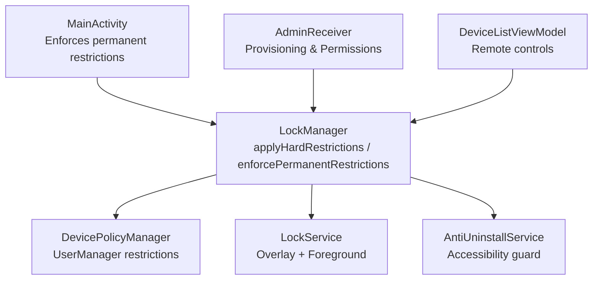
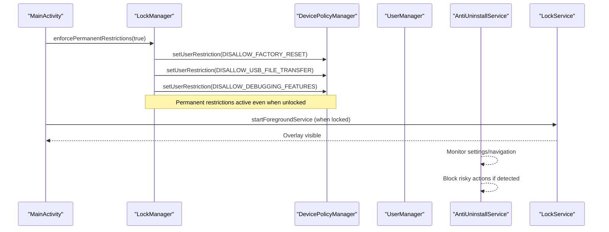
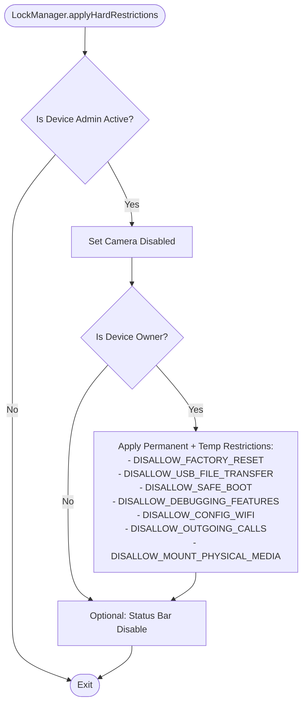
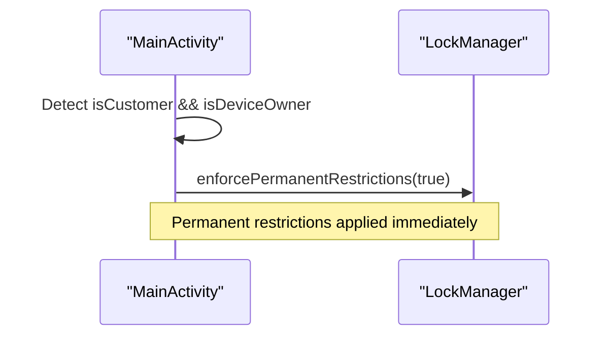
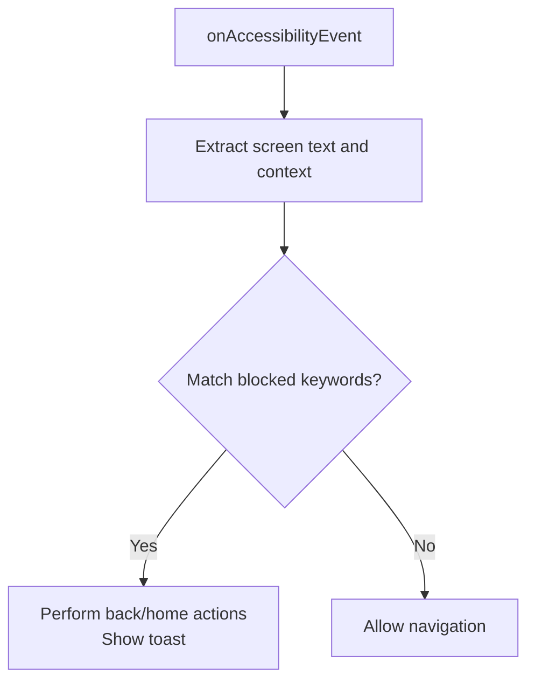
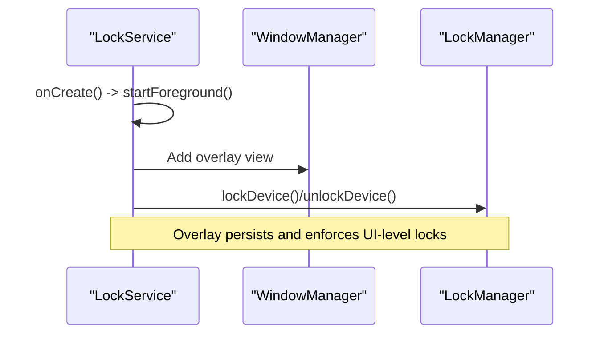
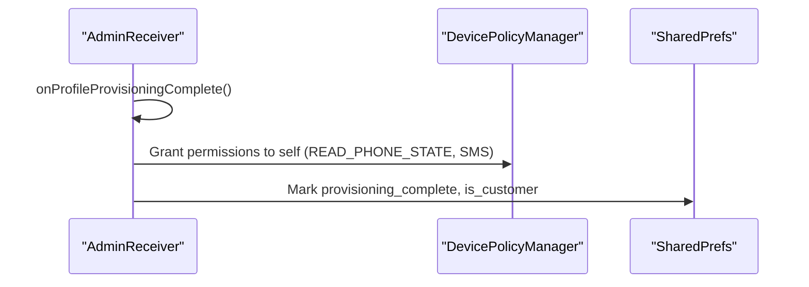
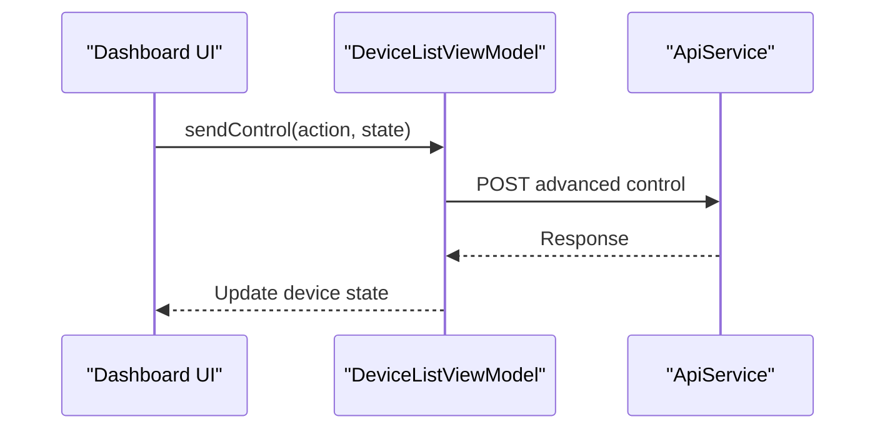
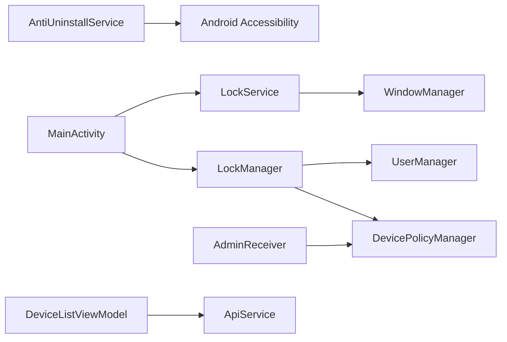

# Permanent Restrictions

<cite>
**Referenced Files in This Document**
- [LockManager.kt](file://app/src/main/java/com/pksafe/lock/manager/util/LockManager.kt)
- [MainActivity.kt](file://app/src/main/java/com/pksafe/lock/manager/MainActivity.kt)
- [AntiUninstallService.kt](file://app/src/main/java/com/pksafe/lock/manager/service/AntiUninstallService.kt)
- [LockService.kt](file://app/src/main/java/com/pksafe/lock/manager/service/LockService.kt)
- [AdminReceiver.kt](file://app/src/main/java/com/pksafe/lock/manager/receiver/AdminReceiver.kt)
- [device_admin_policies.xml](file://app/src/main/res/xml/device_admin_policies.xml)
- [DeviceListViewModel.kt](file://app/src/main/java/com/pksafe/lock/manager/ui/devices/DeviceListViewModel.kt)
</cite>

## Table of Contents
1. Introduction
2. Project Structure
3. Core Components
4. Architecture Overview
5. Detailed Component Analysis
6. Dependency Analysis
7. Performance Considerations
8. Troubleshooting Guide
9. Conclusion

## Introduction
This document explains PK Locker’s permanent restriction enforcement system centered on the enforcePermanentRestrictions method. It details how critical security controls remain active even when devices are technically “unlocked” (EMI paid), including persistent factory reset protection, USB file transfer blocking, and ADB debugging prevention. It also documents the design philosophy behind maintaining core security while allowing limited device functionality, the implementation using setUserRestriction calls, rationale for non-removable restrictions, examples of permanent vs temporary scenarios, administrative override capabilities, recovery procedures, edge cases when Device Owner privileges are lost, automatic restoration mechanisms, and compatibility considerations across Android versions and manufacturer customizations.

## Project Structure
PK Locker implements a layered approach:
- Enforcement layer: LockManager applies Device Policy Manager restrictions and orchestrates services.
- UI and orchestration layer: MainActivity triggers permanent restrictions based on customer state and coordinates permissions.
- Persistence and overlay: LockService provides a persistent lock overlay and foreground service to keep enforcement visible.
- Guard layer: AntiUninstallService monitors user interactions and blocks risky actions via AccessibilityService.
- Provisioning and admin lifecycle: AdminReceiver handles provisioning completion and grants critical permissions; device_admin_policies.xml declares required policies.
- Remote control: DeviceListViewModel sends commands to devices to adjust controls remotely.

**Diagram sources**
- [MainActivity.kt:158-168](file://app/src/main/java/com/pksafe/lock/manager/MainActivity.kt#L158-L168)
- [LockManager.kt:110-192](file://app/src/main/java/com/pksafe/lock/manager/util/LockManager.kt#L110-L192)
- [LockManager.kt:299-315](file://app/src/main/java/com/pksafe/lock/manager/util/LockManager.kt#L299-L315)
- [LockService.kt:50-80](file://app/src/main/java/com/pksafe/lock/manager/service/LockService.kt#L50-L80)
- [AntiUninstallService.kt:136-211](file://app/src/main/java/com/pksafe/lock/manager/service/AntiUninstallService.kt#L136-L211)
- [AdminReceiver.kt:23-36](file://app/src/main/java/com/pksafe/lock/manager/receiver/AdminReceiver.kt#L23-L36)
- [DeviceListViewModel.kt:173-221](file://app/src/main/java/com/pksafe/lock/manager/ui/devices/DeviceListViewModel.kt#L173-L221)

**Section sources**
- [MainActivity.kt:158-168](file://app/src/main/java/com/pksafe/lock/manager/MainActivity.kt#L158-L168)
- [LockManager.kt:110-192](file://app/src/main/java/com/pksafe/lock/manager/util/LockManager.kt#L110-L192)
- [LockManager.kt:299-315](file://app/src/main/java/com/pksafe/lock/manager/util/LockManager.kt#L299-L315)
- [LockService.kt:50-80](file://app/src/main/java/com/pksafe/lock/manager/service/LockService.kt#L50-L80)
- [AntiUninstallService.kt:136-211](file://app/src/main/java/com/pksafe/lock/manager/service/AntiUninstallService.kt#L136-L211)
- [AdminReceiver.kt:23-36](file://app/src/main/java/com/pksafe/lock/manager/receiver/AdminReceiver.kt#L23-L36)
- [DeviceListViewModel.kt:173-221](file://app/src/main/java/com/pksafe/lock/manager/ui/devices/DeviceListViewModel.kt#L173-L221)

## Core Components
- LockManager: Central enforcement engine that applies both temporary (full lock) and permanent (always-on) restrictions using DevicePolicyManager and UserManager APIs.
- MainActivity: Orchestrates app lifecycle and ensures permanent restrictions are applied whenever a device is marked as a customer and enrolled as Device Owner.
- AntiUninstallService: Accessibility-based guard that intercepts risky settings navigation and blocks uninstallation attempts or factory reset flows.
- LockService: Persistent foreground service with an overlay to maintain visibility and block hardware keys during full lock.
- AdminReceiver: Handles provisioning events and grants critical permissions to self as Device Owner.
- DeviceListViewModel: Sends remote control commands to devices to adjust features like unlocking all controls.

Key responsibilities:
- Permanent restrictions: Factory reset, USB file transfer, and ADB/debugging disabled for customers regardless of lock state.
- Temporary restrictions: Full lock behavior includes camera disable, status bar disable, keyguard disable, safe boot, outgoing calls, and more.
- Administrative overrides: Remote unlock-all controls and self-deactivation flow to release privileges when authorized.

**Section sources**
- [LockManager.kt:110-192](file://app/src/main/java/com/pksafe/lock/manager/util/LockManager.kt#L110-L192)
- [LockManager.kt:299-315](file://app/src/main/java/com/pksafe/lock/manager/util/LockManager.kt#L299-L315)
- [MainActivity.kt:158-168](file://app/src/main/java/com/pksafe/lock/manager/MainActivity.kt#L158-L168)
- [AntiUninstallService.kt:136-211](file://app/src/main/java/com/pksafe/lock/manager/service/AntiUninstallService.kt#L136-L211)
- [LockService.kt:50-80](file://app/src/main/java/com/pksafe/lock/manager/service/LockService.kt#L50-L80)
- [AdminReceiver.kt:23-36](file://app/src/main/java/com/pksafe/lock/manager/receiver/AdminReceiver.kt#L23-L36)
- [DeviceListViewModel.kt:173-221](file://app/src/main/java/com/pksafe/lock/manager/ui/devices/DeviceListViewModel.kt#L173-L221)

## Architecture Overview
The enforcement architecture combines policy-level restrictions with runtime guards:
- EnforcePermanentRestrictions is invoked by MainActivity when a device is provisioned as a customer and holds Device Owner privileges.
- LockManager applies permanent restrictions via setUserRestriction calls to prevent factory reset, USB file transfer, and ADB debugging.
- During full lock, additional restrictions are applied to harden the device further.
- AntiUninstallService provides a safety net by monitoring accessibility events and blocking risky actions.
- LockService maintains a persistent overlay and foreground presence to ensure the lock UI remains visible and functional.

**Diagram sources**
- [MainActivity.kt:158-168](file://app/src/main/java/com/pksafe/lock/manager/MainActivity.kt#L158-L168)
- [LockManager.kt:299-315](file://app/src/main/java/com/pksafe/lock/manager/util/LockManager.kt#L299-L315)
- [LockService.kt:50-80](file://app/src/main/java/com/pksafe/lock/manager/service/LockService.kt#L50-L80)
- [AntiUninstallService.kt:136-211](file://app/src/main/java/com/pksafe/lock/manager/service/AntiUninstallService.kt#L136-L211)

## Detailed Component Analysis

### LockManager: Permanent and Temporary Restrictions
LockManager centralizes restriction logic:
- Temporary full lock: Applies broad restrictions including camera disable, status bar disable, keyguard disable, safe boot, outgoing calls, and media mount restrictions.
- Permanent restrictions: Always enforces factory reset, USB file transfer, and ADB/debugging disablement for customers, independent of lock state.
- Helper methods: Individual setters for granular controls (USB, camera, install/uninstall, outgoing calls, factory reset, safe boot).
- Self-deactivation: Clears all restrictions and removes Device Owner and Device Admin privileges to allow normal uninstallation when authorized.

**Diagram sources**
- [LockManager.kt:110-192](file://app/src/main/java/com/pksafe/lock/manager/util/LockManager.kt#L110-L192)

**Section sources**
- [LockManager.kt:110-192](file://app/src/main/java/com/pksafe/lock/manager/util/LockManager.kt#L110-L192)
- [LockManager.kt:299-315](file://app/src/main/java/com/pksafe/lock/manager/util/LockManager.kt#L299-L315)
- [LockManager.kt:354-404](file://app/src/main/java/com/pksafe/lock/manager/util/LockManager.kt#L354-L404)

### MainActivity: Triggering Permanent Restrictions
MainActivity ensures permanent restrictions are enforced whenever a device is marked as a customer and enrolled as Device Owner:
- LaunchedEffect checks customer state and Device Owner status, then calls enforcePermanentRestrictions(true).
- Also manages overlay permission prompts and other mandatory permissions for enforcement reliability.

**Diagram sources**
- [MainActivity.kt:158-168](file://app/src/main/java/com/pksafe/lock/manager/MainActivity.kt#L158-L168)

**Section sources**
- [MainActivity.kt:158-168](file://app/src/main/java/com/pksafe/lock/manager/MainActivity.kt#L158-L168)

### AntiUninstallService: Runtime Guard Against Risky Actions
AntiUninstallService acts as a safety net:
- Monitors accessibility events to detect navigation into Settings or risky actions.
- Blocks keywords related to uninstallation, factory reset, developer options, and similar dangerous operations.
- Triggers global actions (back/home) to prevent users from bypassing restrictions.

**Diagram sources**
- [AntiUninstallService.kt:136-211](file://app/src/main/java/com/pksafe/lock/manager/service/AntiUninstallService.kt#L136-L211)

**Section sources**
- [AntiUninstallService.kt:136-211](file://app/src/main/java/com/pksafe/lock/manager/service/AntiUninstallService.kt#L136-L211)

### LockService: Persistent Overlay and Foreground Presence
LockService ensures the lock UI remains visible and functional:
- Starts as a foreground service with a high-priority notification.
- Displays an overlay that blocks hardware keys and prevents exiting the lock screen.
- Integrates with LockManager to apply/remove hardware restrictions and manage lock state.

**Diagram sources**
- [LockService.kt:50-80](file://app/src/main/java/com/pksafe/lock/manager/service/LockService.kt#L50-L80)
- [LockService.kt:125-169](file://app/src/main/java/com/pksafe/lock/manager/service/LockService.kt#L125-L169)

**Section sources**
- [LockService.kt:50-80](file://app/src/main/java/com/pksafe/lock/manager/service/LockService.kt#L50-L80)
- [LockService.kt:125-169](file://app/src/main/java/com/pksafe/lock/manager/service/LockService.kt#L125-L169)

### AdminReceiver: Provisioning and Permission Grants
AdminReceiver handles provisioning completion and grants critical permissions:
- On provisioning complete, fetches IMEI and marks device as customer mode.
- As Device Owner, grants necessary permissions to self for telephony and SMS operations.

**Diagram sources**
- [AdminReceiver.kt:23-36](file://app/src/main/java/com/pksafe/lock/manager/receiver/AdminReceiver.kt#L23-L36)
- [AdminReceiver.kt:43-99](file://app/src/main/java/com/pksafe/lock/manager/receiver/AdminReceiver.kt#L43-L99)

**Section sources**
- [AdminReceiver.kt:23-36](file://app/src/main/java/com/pksafe/lock/manager/receiver/AdminReceiver.kt#L23-L36)
- [AdminReceiver.kt:43-99](file://app/src/main/java/com/pksafe/lock/manager/receiver/AdminReceiver.kt#L43-L99)

### DeviceListViewModel: Remote Control Capabilities
DeviceListViewModel enables administrators to send advanced control commands to devices:
- Supports sending actions and states to devices.
- Provides unlockAllControls to clear restrictions remotely when authorized.

**Diagram sources**
- [DeviceListViewModel.kt:173-221](file://app/src/main/java/com/pksafe/lock/manager/ui/devices/DeviceListViewModel.kt#L173-L221)

**Section sources**
- [DeviceListViewModel.kt:173-221](file://app/src/main/java/com/pksafe/lock/manager/ui/devices/DeviceListViewModel.kt#L173-L221)

## Dependency Analysis
- MainActivity depends on LockManager to enforce permanent restrictions and on LockService for overlay management.
- LockManager depends on DevicePolicyManager and UserManager APIs to apply restrictions; it also interacts with AntiUninstallService indirectly through shared preferences and device state.
- AntiUninstallService relies on AccessibilityService to monitor and block risky actions.
- AdminReceiver sets up permissions and flags that enable LockManager and other components to function effectively.
- DeviceListViewModel communicates with backend APIs to adjust device controls remotely.

**Diagram sources**
- [MainActivity.kt:158-168](file://app/src/main/java/com/pksafe/lock/manager/MainActivity.kt#L158-L168)
- [LockManager.kt:110-192](file://app/src/main/java/com/pksafe/lock/manager/util/LockManager.kt#L110-L192)
- [LockService.kt:50-80](file://app/src/main/java/com/pksafe/lock/manager/service/LockService.kt#L50-L80)
- [AntiUninstallService.kt:136-211](file://app/src/main/java/com/pksafe/lock/manager/service/AntiUninstallService.kt#L136-L211)
- [AdminReceiver.kt:23-36](file://app/src/main/java/com/pksafe/lock/manager/receiver/AdminReceiver.kt#L23-L36)
- [DeviceListViewModel.kt:173-221](file://app/src/main/java/com/pksafe/lock/manager/ui/devices/DeviceListViewModel.kt#L173-L221)

**Section sources**
- [MainActivity.kt:158-168](file://app/src/main/java/com/pksafe/lock/manager/MainActivity.kt#L158-L168)
- [LockManager.kt:110-192](file://app/src/main/java/com/pksafe/lock/manager/util/LockManager.kt#L110-L192)
- [LockService.kt:50-80](file://app/src/main/java/com/pksafe/lock/manager/service/LockService.kt#L50-L80)
- [AntiUninstallService.kt:136-211](file://app/src/main/java/com/pksafe/lock/manager/service/AntiUninstallService.kt#L136-L211)
- [AdminReceiver.kt:23-36](file://app/src/main/java/com/pksafe/lock/manager/receiver/AdminReceiver.kt#L23-L36)
- [DeviceListViewModel.kt:173-221](file://app/src/main/java/com/pksafe/lock/manager/ui/devices/DeviceListViewModel.kt#L173-L221)

## Performance Considerations
- Restriction application is lightweight and uses system APIs; avoid frequent toggling to minimize overhead.
- Foreground service and overlay should be used judiciously to conserve battery and reduce UI churn.
- Accessibility monitoring runs in background; ensure event processing remains efficient to avoid performance degradation.
- Remote control commands should be rate-limited and idempotent to prevent excessive network usage.

[No sources needed since this section provides general guidance]

## Troubleshooting Guide
Common issues and resolutions:
- Device Owner not active: Ensure provisioning completes successfully and AdminReceiver grants permissions. Verify Device Owner status before applying restrictions.
- Restrictions not applied: Confirm Device Admin and Device Owner privileges; check logs for errors in LockManager.applyHardRestrictions and enforcePermanentRestrictions.
- Overlay not visible: Verify overlay permission granted; prompt user via MainActivity if missing.
- Accessibility guard inactive: Ensure AntiUninstallService is enabled and running; re-enable via Device Owner secure settings if necessary.
- Remote unlock-all controls: Use DeviceListViewModel.unlockAllControls to clear restrictions when authorized; verify server response and device state sync.
- Self-deactivation: Use LockManager.selfDeactivate to remove Device Owner and Device Admin privileges when releasing the device; this clears all restrictions and allows normal uninstallation.

**Section sources**
- [AdminReceiver.kt:23-36](file://app/src/main/java/com/pksafe/lock/manager/receiver/AdminReceiver.kt#L23-L36)
- [LockManager.kt:110-192](file://app/src/main/java/com/pksafe/lock/manager/util/LockManager.kt#L110-L192)
- [LockManager.kt:299-315](file://app/src/main/java/com/pksafe/lock/manager/util/LockManager.kt#L299-L315)
- [AntiUninstallService.kt:136-211](file://app/src/main/java/com/pksafe/lock/manager/service/AntiUninstallService.kt#L136-L211)
- [DeviceListViewModel.kt:173-221](file://app/src/main/java/com/pksafe/lock/manager/ui/devices/DeviceListViewModel.kt#L173-L221)
- [LockManager.kt:354-404](file://app/src/main/java/com/pksafe/lock/manager/util/LockManager.kt#L354-L404)

## Conclusion
PK Locker’s permanent restriction enforcement system ensures critical security controls remain active even when devices are technically unlocked. By leveraging DevicePolicyManager and UserManager APIs, the system enforces factory reset protection, USB file transfer blocking, and ADB debugging prevention for customers. The design balances security with limited functionality, providing robust safeguards while allowing essential use. Administrative overrides and self-deactivation offer controlled release mechanisms. Edge cases such as loss of Device Owner privileges are mitigated through provisioning callbacks and permission grants. Compatibility considerations include version checks and fallback strategies to support diverse Android versions and manufacturer customizations.

[No sources needed since this section summarizes without analyzing specific files]