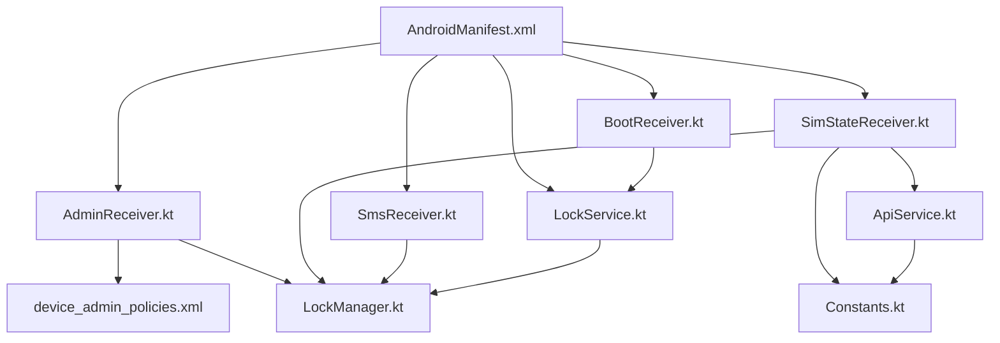
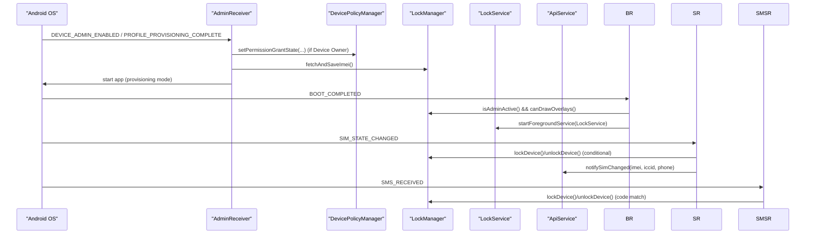
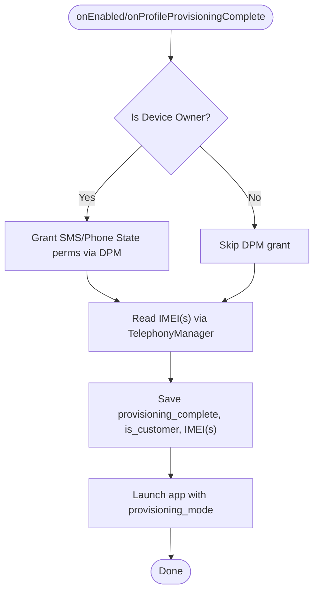
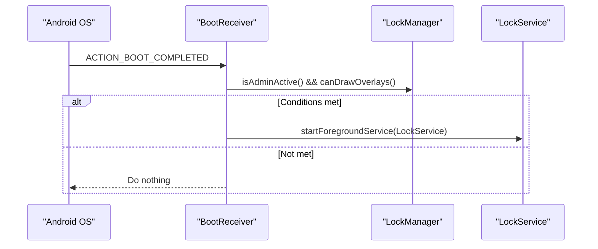
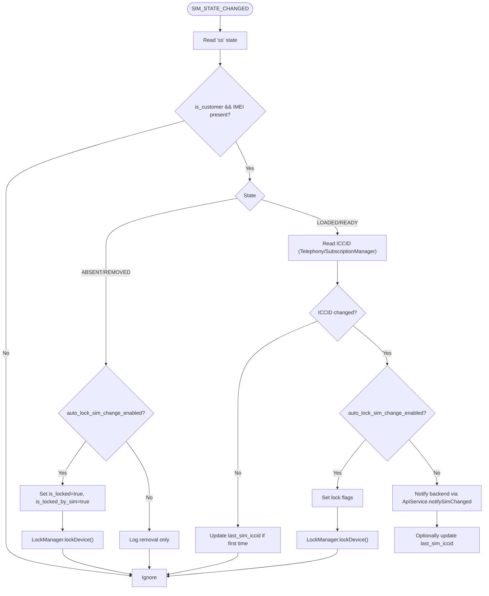
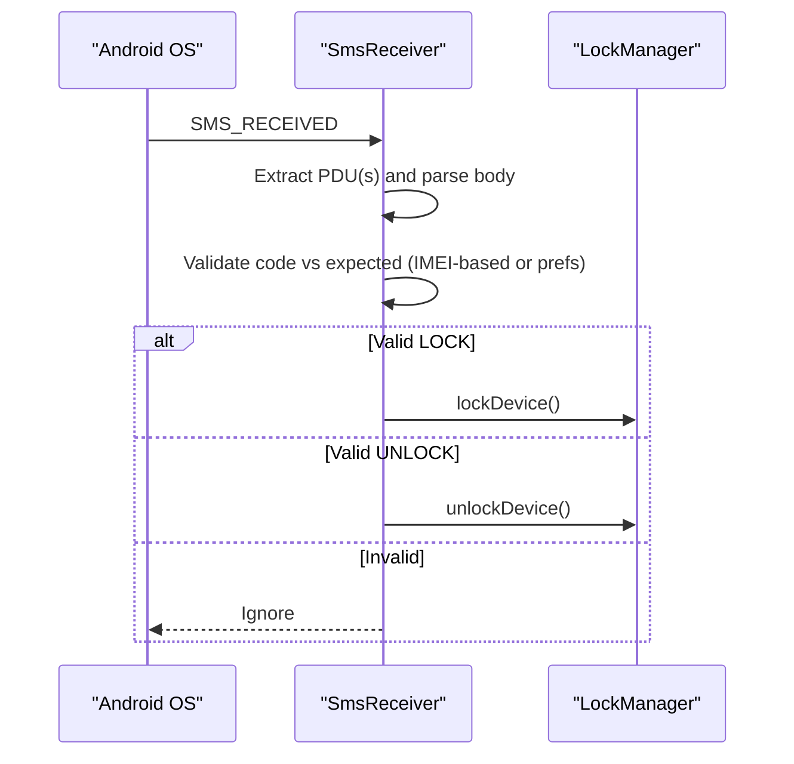
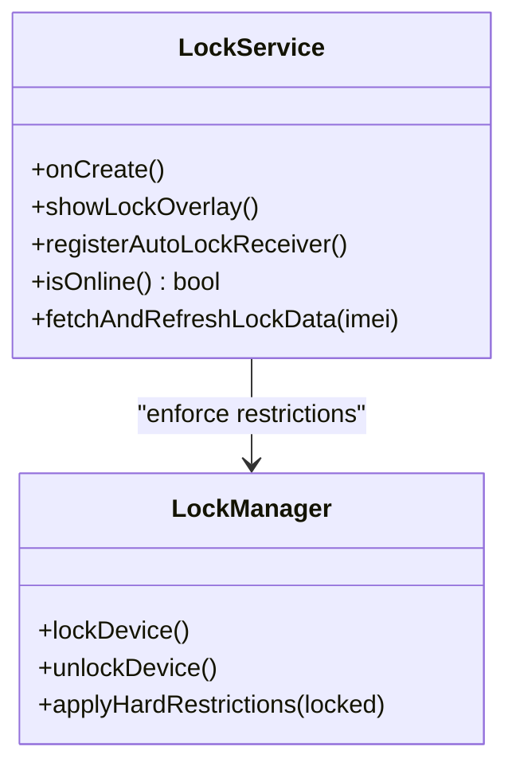
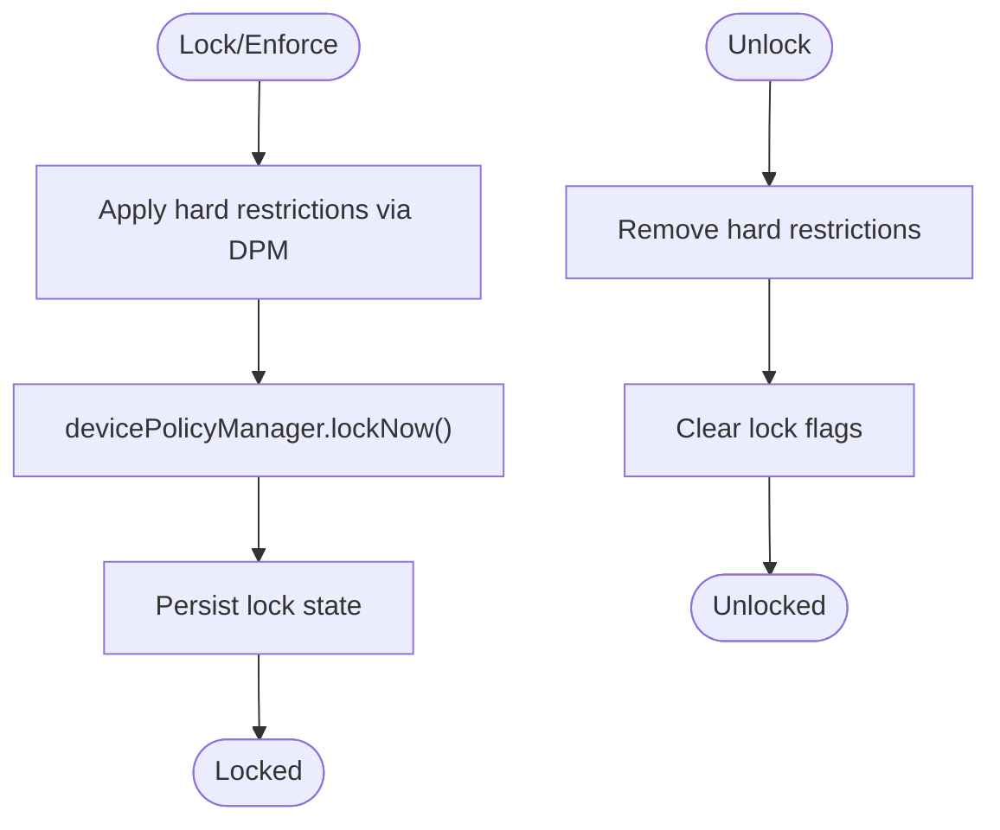
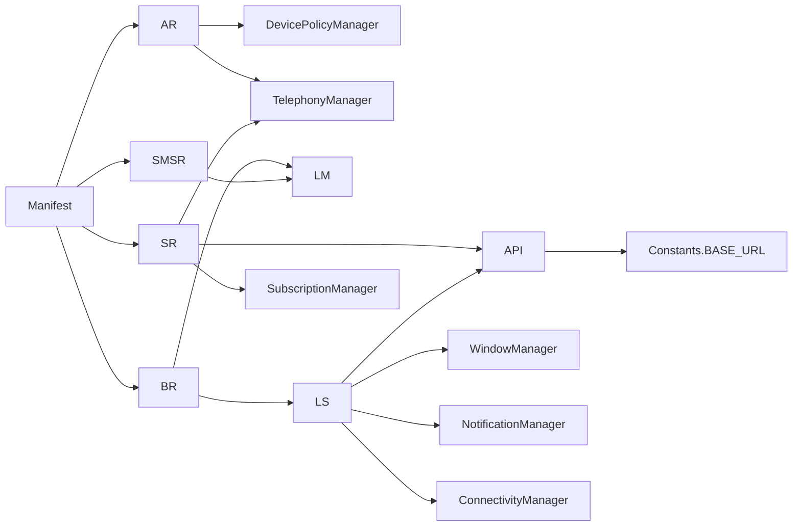

# System Integration

<cite>
**Referenced Files in This Document**
- [AndroidManifest.xml](file://app/src/main/AndroidManifest.xml)
- [device_admin_policies.xml](file://app/src/main/res/xml/device_admin_policies.xml)
- [AdminReceiver.kt](file://app/src/main/java/com/pksafe/lock/manager/receiver/AdminReceiver.kt)
- [BootReceiver.kt](file://app/src/main/java/com/pksafe/lock/manager/receiver/BootReceiver.kt)
- [SimStateReceiver.kt](file://app/src/main/java/com/pksafe/lock/manager/receiver/SimStateReceiver.kt)
- [SmsReceiver.kt](file://app/src/main/java/com/pksafe/lock/manager/receiver/SmsReceiver.kt)
- [LockService.kt](file://app/src/main/java/com/pksafe/lock/manager/service/LockService.kt)
- [LockManager.kt](file://app/src/main/java/com/pksafe/lock/manager/util/LockManager.kt)
- [ApiService.kt](file://app/src/main/java/com/pksafe/lock/manager/data/ApiService.kt)
- [Constants.kt](file://app/src/main/java/com/pksafe/lock/manager/util/Constants.kt)
</cite>

## Table of Contents
1. Introduction
2. Project Structure
3. Core Components
4. Architecture Overview
5. Detailed Component Analysis
6. Dependency Analysis
7. Performance Considerations
8. Troubleshooting Guide
9. Conclusion

## Introduction
This document explains PK Locker’s system integration components that interact deeply with the Android OS to enforce device security and respond to system events. It focuses on:
- AdminReceiver for device admin policy changes and provisioning lifecycle
- BootReceiver for startup initialization and service restoration after reboot
- SimStateReceiver for SIM change detection and automated lock/unlock behavior
- Supporting services and utilities (LockService, LockManager) that implement enforcement and UI overlays
- Broadcast receiver registration, intent filtering, and system event processing
- Permissions, security implications, and compatibility across Android versions and OEM customizations

## Project Structure
PK Locker registers multiple broadcast receivers and a foreground service in the manifest to handle system events and enforce locks. Device admin policies are declared via XML. The core enforcement logic is centralized in a utility class and executed by a persistent overlay service.

**Diagram sources**
- [AndroidManifest.xml:87-130](file://app/src/main/AndroidManifest.xml#L87-L130)
- [device_admin_policies.xml:1-12](file://app/src/main/res/xml/device_admin_policies.xml#L1-L12)
- [AdminReceiver.kt:14-103](file://app/src/main/java/com/pksafe/lock/manager/receiver/AdminReceiver.kt#L14-L103)
- [BootReceiver.kt:10-26](file://app/src/main/java/com/pksafe/lock/manager/receiver/BootReceiver.kt#L10-L26)
- [SimStateReceiver.kt:18-144](file://app/src/main/java/com/pksafe/lock/manager/receiver/SimStateReceiver.kt#L18-L144)
- [SmsReceiver.kt:29-163](file://app/src/main/java/com/pksafe/lock/manager/receiver/SmsReceiver.kt#L29-L163)
- [LockService.kt:41-329](file://app/src/main/java/com/pksafe/lock/manager/service/LockService.kt#L41-L329)
- [LockManager.kt:27-405](file://app/src/main/java/com/pksafe/lock/manager/util/LockManager.kt#L27-L405)
- [ApiService.kt:77-81](file://app/src/main/java/com/pksafe/lock/manager/data/ApiService.kt#L77-L81)
- [Constants.kt:3-9](file://app/src/main/java/com/pksafe/lock/manager/util/Constants.kt#L3-L9)

**Section sources**
- [AndroidManifest.xml:5-23](file://app/src/main/AndroidManifest.xml#L5-L23)
- [AndroidManifest.xml:87-130](file://app/src/main/AndroidManifest.xml#L87-L130)
- [device_admin_policies.xml:1-12](file://app/src/main/res/xml/device_admin_policies.xml#L1-L12)

## Core Components
- AdminReceiver: Handles device admin enable/disable and profile provisioning completion; grants critical permissions when running as Device Owner; fetches IMEI and marks provisioning complete.
- BootReceiver: Restarts the lock enforcement service after boot if admin privileges and overlay permission are available.
- SimStateReceiver: Detects SIM state changes, compares ICCID, optionally auto-locks or unlocks based on settings, and notifies the backend.
- SmsReceiver: Processes offline lock/unlock commands via SMS using deterministic codes derived from IMEI.
- LockService: Foreground service that renders an overlay enforcing lock UI, blocks navigation keys, and refreshes EMI data from the server.
- LockManager: Centralized device policy enforcement (camera, USB, factory reset, safe boot, ADB), app hiding, and self-deactivation flows.

**Section sources**
- [AdminReceiver.kt:14-103](file://app/src/main/java/com/pksafe/lock/manager/receiver/AdminReceiver.kt#L14-L103)
- [BootReceiver.kt:10-26](file://app/src/main/java/com/pksafe/lock/manager/receiver/BootReceiver.kt#L10-L26)
- [SimStateReceiver.kt:18-144](file://app/src/main/java/com/pksafe/lock/manager/receiver/SimStateReceiver.kt#L18-L144)
- [SmsReceiver.kt:29-163](file://app/src/main/java/com/pksafe/lock/manager/receiver/SmsReceiver.kt#L29-L163)
- [LockService.kt:41-329](file://app/src/main/java/com/pksafe/lock/manager/service/LockService.kt#L41-L329)
- [LockManager.kt:27-405](file://app/src/main/java/com/pksafe/lock/manager/util/LockManager.kt#L27-L405)

## Architecture Overview
The system integrates at the Android framework level through device admin APIs, broadcast receivers, and a persistent foreground service. Key flows:
- Provisioning and admin activation trigger IMEI capture and permission granting.
- On boot, the app restores its enforcement service if conditions are met.
- SIM changes can trigger automatic locking/unlocking and backend notifications.
- Offline SMS commands provide remote control without network connectivity.
- LockService enforces UI-level restrictions and hardware restrictions via DevicePolicyManager.

**Diagram sources**
- [AndroidManifest.xml:87-130](file://app/src/main/AndroidManifest.xml#L87-L130)
- [AdminReceiver.kt:16-36](file://app/src/main/java/com/pksafe/lock/manager/receiver/AdminReceiver.kt#L16-L36)
- [AdminReceiver.kt:43-102](file://app/src/main/java/com/pksafe/lock/manager/receiver/AdminReceiver.kt#L43-L102)
- [BootReceiver.kt:11-24](file://app/src/main/java/com/pksafe/lock/manager/receiver/BootReceiver.kt#L11-L24)
- [SimStateReceiver.kt:19-141](file://app/src/main/java/com/pksafe/lock/manager/receiver/SimStateReceiver.kt#L19-L141)
- [SmsReceiver.kt:44-142](file://app/src/main/java/com/pksafe/lock/manager/receiver/SmsReceiver.kt#L44-L142)
- [LockService.kt:50-79](file://app/src/main/java/com/pksafe/lock/manager/service/LockService.kt#L50-L79)
- [ApiService.kt:77-81](file://app/src/main/java/com/pksafe/lock/manager/data/ApiService.kt#L77-L81)

## Detailed Component Analysis

### AdminReceiver: Device Admin Policy and Provisioning
- Lifecycle hooks:
  - onEnabled: logs and triggers IMEI capture.
  - onProfileProvisioningComplete: captures IMEI, launches app in provisioning mode.
  - onDisabled: logs deactivation.
- Permission handling:
  - When running as Device Owner, grants READ_PHONE_STATE, RECEIVE_SMS, READ_SMS, SEND_SMS to itself via DevicePolicyManager.
- IMEI acquisition:
  - Uses TelephonyManager with dual-SIM support on modern Android; falls back to older APIs.
  - Persists provisioning flags and device identifiers to SharedPreferences.

**Diagram sources**
- [AdminReceiver.kt:16-36](file://app/src/main/java/com/pksafe/lock/manager/receiver/AdminReceiver.kt#L16-L36)
- [AdminReceiver.kt:43-102](file://app/src/main/java/com/pksafe/lock/manager/receiver/AdminReceiver.kt#L43-L102)

**Section sources**
- [AdminReceiver.kt:14-103](file://app/src/main/java/com/pksafe/lock/manager/receiver/AdminReceiver.kt#L14-L103)
- [device_admin_policies.xml:1-12](file://app/src/main/res/xml/device_admin_policies.xml#L1-L12)

### BootReceiver: Startup Initialization and Service Restoration
- Listens for BOOT_COMPLETED.
- Checks admin active and overlay permission availability.
- Starts LockService as a foreground service on modern Android versions.

**Diagram sources**
- [BootReceiver.kt:10-26](file://app/src/main/java/com/pksafe/lock/manager/receiver/BootReceiver.kt#L10-L26)
- [LockService.kt:50-79](file://app/src/main/java/com/pksafe/lock/manager/service/LockService.kt#L50-L79)

**Section sources**
- [BootReceiver.kt:10-26](file://app/src/main/java/com/pksafe/lock/manager/receiver/BootReceiver.kt#L10-L26)
- [AndroidManifest.xml:114-121](file://app/src/main/AndroidManifest.xml#L114-L121)

### SimStateReceiver: SIM Change Detection and Security Responses
- Filters android.intent.action.SIM_STATE_CHANGED.
- For customer devices with stored IMEI:
  - ABSENT/REMOVED: If auto-lock enabled, sets lock flags and triggers lock.
  - LOADED/READY: Reads ICCID via TelephonyManager or SubscriptionManager; compares with last known ICCID.
  - If SIM changed and auto-lock enabled, locks device; otherwise updates last ICCID.
  - Notifies backend about SIM change with ICCID and phone number.

**Diagram sources**
- [SimStateReceiver.kt:18-144](file://app/src/main/java/com/pksafe/lock/manager/receiver/SimStateReceiver.kt#L18-L144)
- [ApiService.kt:77-81](file://app/src/main/java/com/pksafe/lock/manager/data/ApiService.kt#L77-L81)

**Section sources**
- [SimStateReceiver.kt:18-144](file://app/src/main/java/com/pksafe/lock/manager/receiver/SimStateReceiver.kt#L18-L144)
- [AndroidManifest.xml:123-130](file://app/src/main/AndroidManifest.xml#L123-L130)

### SmsReceiver: Offline Lock/Unlock via SMS
- Listens to android.provider.Telephony.SMS_RECEIVED with high priority.
- Validates messages against deterministic codes generated from IMEI or persisted codes.
- Supports LOCK#<code> and UNLOCK#<code> commands; aborts broadcast to hide from default SMS app.

**Diagram sources**
- [SmsReceiver.kt:29-163](file://app/src/main/java/com/pksafe/lock/manager/receiver/SmsReceiver.kt#L29-L163)
- [AndroidManifest.xml:132-140](file://app/src/main/AndroidManifest.xml#L132-L140)

**Section sources**
- [SmsReceiver.kt:29-163](file://app/src/main/java/com/pksafe/lock/manager/receiver/SmsReceiver.kt#L29-L163)
- [AndroidManifest.xml:132-140](file://app/src/main/AndroidManifest.xml#L132-L140)

### LockService: Enforcement Overlay and Connectivity Monitoring
- Runs as a foreground service with a persistent notification.
- Renders an overlay view that blocks back/home/recents/menu keys and displays dynamic EMI info.
- Registers a connectivity receiver to auto-lock when internet disconnects (if enabled).
- Supports unlocking via a master code derived from IMEI or fallback constant.

**Diagram sources**
- [LockService.kt:41-329](file://app/src/main/java/com/pksafe/lock/manager/service/LockService.kt#L41-L329)
- [LockManager.kt:110-192](file://app/src/main/java/com/pksafe/lock/manager/util/LockManager.kt#L110-L192)

**Section sources**
- [LockService.kt:41-329](file://app/src/main/java/com/pksafe/lock/manager/service/LockService.kt#L41-L329)
- [AndroidManifest.xml:73-78](file://app/src/main/AndroidManifest.xml#L73-L78)

### LockManager: Device Policy Enforcement and Self Deactivation
- Applies hard restrictions when locked: camera disabled, USB file transfer blocked, factory reset disabled, safe boot disabled, ADB/debugging disabled, status bar disabled, keyguard disabled.
- Provides granular controls for USB, camera, app install/uninstall, outgoing calls, factory reset, safe boot.
- Hides apps via DevicePolicyManager.setApplicationHidden for known packages.
- Enforces permanent restrictions even when unlocked (e.g., block factory reset).
- Self-deactivation clears all restrictions and removes Device Owner/Admin so the app can be uninstalled.

**Diagram sources**
- [LockManager.kt:110-192](file://app/src/main/java/com/pksafe/lock/manager/util/LockManager.kt#L110-L192)
- [LockManager.kt:202-315](file://app/src/main/java/com/pksafe/lock/manager/util/LockManager.kt#L202-L315)
- [LockManager.kt:351-405](file://app/src/main/java/com/pksafe/lock/manager/util/LockManager.kt#L351-L405)

**Section sources**
- [LockManager.kt:27-405](file://app/src/main/java/com/pksafe/lock/manager/util/LockManager.kt#L27-L405)

## Dependency Analysis
- Manifest declares receivers and their intent filters, binding them to system events.
- AdminReceiver depends on DevicePolicyManager and TelephonyManager; writes to SharedPreferences.
- BootReceiver depends on LockManager and starts LockService.
- SimStateReceiver depends on TelephonyManager, SubscriptionManager, SharedPreferences, and ApiService.
- SmsReceiver depends on Telephony APIs and LockManager.
- LockService depends on WindowManager, NotificationManager, ConnectivityManager, and Retrofit-based ApiService.
- Constants centralizes base URLs used by receivers and services.

**Diagram sources**
- [AndroidManifest.xml:87-130](file://app/src/main/AndroidManifest.xml#L87-L130)
- [AdminReceiver.kt:43-102](file://app/src/main/java/com/pksafe/lock/manager/receiver/AdminReceiver.kt#L43-L102)
- [BootReceiver.kt:11-24](file://app/src/main/java/com/pksafe/lock/manager/receiver/BootReceiver.kt#L11-L24)
- [SimStateReceiver.kt:53-69](file://app/src/main/java/com/pksafe/lock/manager/receiver/SimStateReceiver.kt#L53-L69)
- [SimStateReceiver.kt:117-138](file://app/src/main/java/com/pksafe/lock/manager/receiver/SimStateReceiver.kt#L117-L138)
- [SmsReceiver.kt:44-142](file://app/src/main/java/com/pksafe/lock/manager/receiver/SmsReceiver.kt#L44-L142)
- [LockService.kt:100-105](file://app/src/main/java/com/pksafe/lock/manager/service/LockService.kt#L100-L105)
- [ApiService.kt:77-81](file://app/src/main/java/com/pksafe/lock/manager/data/ApiService.kt#L77-L81)
- [Constants.kt:3-9](file://app/src/main/java/com/pksafe/lock/manager/util/Constants.kt#L3-L9)

**Section sources**
- [AndroidManifest.xml:87-130](file://app/src/main/AndroidManifest.xml#L87-L130)
- [ApiService.kt:77-81](file://app/src/main/java/com/pksafe/lock/manager/data/ApiService.kt#L77-L81)
- [Constants.kt:3-9](file://app/src/main/java/com/pksafe/lock/manager/util/Constants.kt#L3-L9)

## Performance Considerations
- Avoid heavy work in receivers; keep operations minimal and offload to background threads where appropriate.
- Use efficient SIM info retrieval strategies (TelephonyManager then SubscriptionManager fallback) to minimize latency.
- Network calls in receivers should use coroutine scopes with IO dispatchers and handle errors gracefully.
- Foreground service ensures persistence but must manage resources carefully to avoid ANRs.

[No sources needed since this section provides general guidance]

## Troubleshooting Guide
- AdminReceiver IMEI fetch failures:
  - Ensure Device Owner status and required permissions granted via DPM.
  - Verify TelephonyManager APIs supported on target Android version; handle exceptions and fall back.
- BootReceiver not starting LockService:
  - Confirm admin active and overlay permission granted.
  - Check FOREGROUND_SERVICE and POST_NOTIFICATIONS permissions on newer Android versions.
- SimStateReceiver not detecting changes:
  - Verify SIM_STATE_CHANGED filter registered and permissions for telephony access.
  - Handle OEM-specific behaviors for ICCID retrieval; use SubscriptionManager fallback.
- SmsReceiver not responding:
  - Ensure RECEIVE_SMS, READ_SMS, SEND_SMS permissions declared and granted.
  - Validate SMS format and code generation matches backend expectations.
- LockService overlay issues:
  - Ensure SYSTEM_ALERT_WINDOW permission granted.
  - Check overlay type selection for Android O+ (TYPE_APPLICATION_OVERLAY).
  - Confirm notification channel created for foreground service.

**Section sources**
- [AdminReceiver.kt:43-102](file://app/src/main/java/com/pksafe/lock/manager/receiver/AdminReceiver.kt#L43-L102)
- [BootReceiver.kt:11-24](file://app/src/main/java/com/pksafe/lock/manager/receiver/BootReceiver.kt#L11-L24)
- [SimStateReceiver.kt:53-69](file://app/src/main/java/com/pksafe/lock/manager/receiver/SimStateReceiver.kt#L53-L69)
- [SmsReceiver.kt:44-142](file://app/src/main/java/com/pksafe/lock/manager/receiver/SmsReceiver.kt#L44-L142)
- [LockService.kt:68-79](file://app/src/main/java/com/pksafe/lock/manager/service/LockService.kt#L68-L79)
- [AndroidManifest.xml:5-23](file://app/src/main/AndroidManifest.xml#L5-L23)

## Conclusion
PK Locker’s system integration leverages Android’s device admin APIs, broadcast receivers, and a persistent foreground service to enforce robust device security. AdminReceiver handles provisioning and permissions, BootReceiver restores enforcement after reboot, SimStateReceiver reacts to SIM changes with optional auto-lock/unlock, and SmsReceiver enables offline control. LockManager centralizes policy enforcement while LockService presents a resilient overlay. Proper permissions, error handling, and compatibility considerations ensure reliable operation across Android versions and OEM customizations.

[No sources needed since this section summarizes without analyzing specific files]