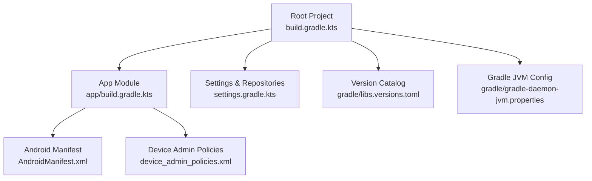
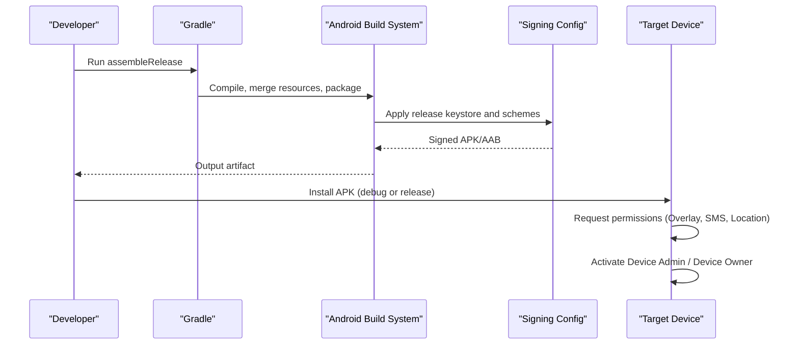
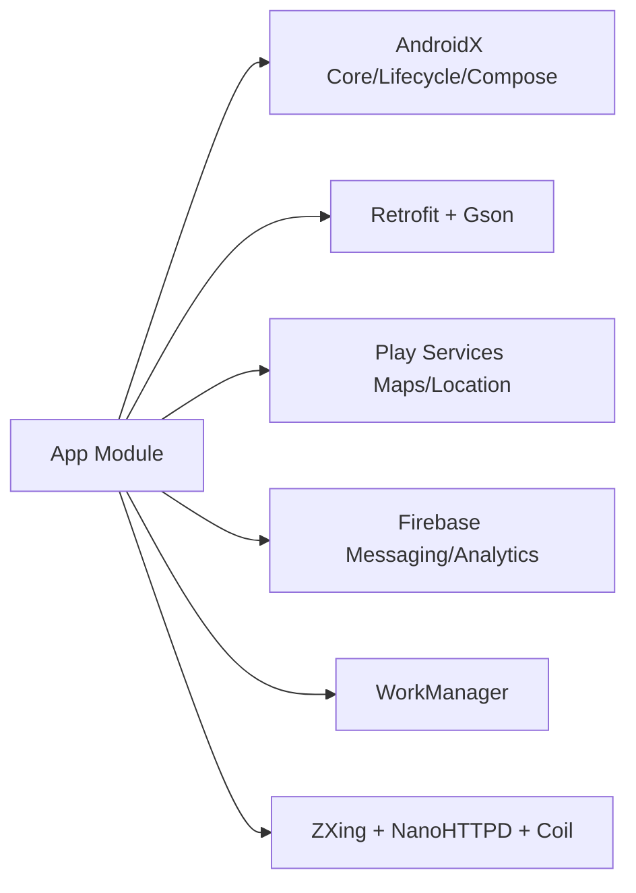

# Getting Started

<cite>
**Referenced Files in This Document**
- [README.md](file://README.md)
- [build.gradle.kts](file://build.gradle.kts)
- [app/build.gradle.kts](file://app/build.gradle.kts)
- [settings.gradle.kts](file://settings.gradle.kts)
- [gradle.properties](file://gradle.properties)
- [gradle/libs.versions.toml](file://gradle/libs.versions.toml)
- [gradle/gradle-daemon-jvm.properties](file://gradle/gradle-daemon-jvm.properties)
- [app/src/main/AndroidManifest.xml](file://app/src/main/AndroidManifest.xml)
- [app/src/main/res/xml/device_admin_policies.xml](file://app/src/main/res/xml/device_admin_policies.xml)
- [setup_device_owner.bat](file://setup_device_owner.bat)
- [app/src/main/java/com/pksafe/lock/manager/MainActivity.kt](file://app/src/main/java/com/pksafe/lock/manager/MainActivity.kt)
- [app/src/main/java/com/pksafe/lock/manager/ui/provisioning/ProvisioningQrScreen.kt](file://app/src/main/java/com/pksafe/lock/manager/ui/provisioning/ProvisioningQrScreen.kt)
</cite>

## Table of Contents
1. Introduction
2. Project Structure
3. Core Components
4. Architecture Overview
5. Detailed Component Analysis
6. Dependency Analysis
7. Performance Considerations
8. Troubleshooting Guide
9. Conclusion
10. Appendices

## Introduction
This guide helps you set up the PK Locker development environment, build and sign release APKs, install on devices, and run common tasks like debugging and building variants. It also covers first-time setup steps such as required permissions, device administrator activation, and initial configuration for both development and production deployments.

## Project Structure
PK Locker is a single Android module app with Gradle Kotlin DSL. The root project configures plugins and repositories; the app module defines SDK versions, signing, build types, dependencies, and features.

**Diagram sources**
- [build.gradle.kts:1-8](file://build.gradle.kts#L1-L8)
- [app/build.gradle.kts:1-73](file://app/build.gradle.kts#L1-L73)
- [settings.gradle.kts:1-27](file://settings.gradle.kts#L1-L27)
- [gradle/libs.versions.toml:1-63](file://gradle/libs.versions.toml#L1-L63)
- [gradle/gradle-daemon-jvm.properties:1-12](file://gradle/gradle-daemon-jvm.properties#L1-L12)
- [app/src/main/AndroidManifest.xml:1-160](file://app/src/main/AndroidManifest.xml#L1-L160)
- [app/src/main/res/xml/device_admin_policies.xml:1-13](file://app/src/main/res/xml/device_admin_policies.xml#L1-L13)

**Section sources**
- [build.gradle.kts:1-8](file://build.gradle.kts#L1-L8)
- [app/build.gradle.kts:1-73](file://app/build.gradle.kts#L1-L73)
- [settings.gradle.kts:1-27](file://settings.gradle.kts#L1-L27)
- [gradle/libs.versions.toml:1-63](file://gradle/libs.versions.toml#L1-L63)
- [gradle/gradle-daemon-jvm.properties:1-12](file://gradle/gradle-daemon-jvm.properties#L1-L12)

## Core Components
- Build system: Gradle with Kotlin DSL, version catalog, and Google Services plugin.
- App module: Android application with Compose UI, Firebase integration, WorkManager, Retrofit, and Play Services.
- Security and provisioning: Device Owner/Admin policies, overlay permission enforcement, SMS-based offline control, and QR/ADB provisioning flows.

Key responsibilities:
- Building debug/release artifacts with signing configured.
- Managing runtime permissions (overlay, SMS, location).
- Enforcing device restrictions via Device Owner/Admin.
- Provisioning devices via QR code or ADB.

**Section sources**
- [app/build.gradle.kts:1-123](file://app/build.gradle.kts#L1-L123)
- [app/src/main/AndroidManifest.xml:1-160](file://app/src/main/AndroidManifest.xml#L1-L160)
- [app/src/main/res/xml/device_admin_policies.xml:1-13](file://app/src/main/res/xml/device_admin_policies.xml#L1-L13)
- [app/src/main/java/com/pksafe/lock/manager/MainActivity.kt:65-445](file://app/src/main/java/com/pksafe/lock/manager/MainActivity.kt#L65-L445)
- [app/src/main/java/com/pksafe/lock/manager/ui/provisioning/ProvisioningQrScreen.kt:120-158](file://app/src/main/java/com/pksafe/lock/manager/ui/provisioning/ProvisioningQrScreen.kt#L120-L158)

## Architecture Overview
High-level flow for building and deploying PK Locker:

**Diagram sources**
- [app/build.gradle.kts:25-53](file://app/build.gradle.kts#L25-L53)
- [app/src/main/AndroidManifest.xml:5-34](file://app/src/main/AndroidManifest.xml#L5-L34)
- [app/src/main/res/xml/device_admin_policies.xml:1-13](file://app/src/main/res/xml/device_admin_policies.xml#L1-L13)

## Detailed Component Analysis

### Environment Setup and JDK 17
- Use JDK 17 to build. The README demonstrates setting JAVA_HOME before running Gradle.
- The Gradle daemon uses a toolchain URL file that points to a compatible JDK distribution.

Steps:
1. Install JDK 17.
2. Set JAVA_HOME to your JDK 17 path.
3. Open a terminal in the repository root.
4. Run Gradle wrapper commands to build.

**Section sources**
- [README.md:18-33](file://README.md#L18-L33)
- [gradle/gradle-daemon-jvm.properties:1-12](file://gradle/gradle-daemon-jvm.properties#L1-L12)

### Gradle Configuration and Versions
- Root build script applies Android, Kotlin, Compose, and Google Services plugins.
- Version catalog centralizes dependency versions and plugin aliases.
- Settings configure repositories and toolchains.

Key points:
- compileSdk/targetSdk = 35, minSdk = 24.
- Java/Kotlin target compatibility set to 11 within the app module.
- Compose enabled.

**Section sources**
- [build.gradle.kts:1-8](file://build.gradle.kts#L1-L8)
- [gradle/libs.versions.toml:1-63](file://gradle/libs.versions.toml#L1-L63)
- [settings.gradle.kts:1-27](file://settings.gradle.kts#L1-L27)
- [app/build.gradle.kts:8-63](file://app/build.gradle.kts#L8-L63)

### Signing and Release Builds
- Release signing is configured with a keystore and passwords.
- All signature schemes are enabled for compatibility and Play Protect acceptance.
- Debug builds reuse the release signing config so behavior matches release.

Build outputs:
- Debug/Release APKs are produced under app/build/outputs/apk/.
- The README references the release APK path.

**Section sources**
- [app/build.gradle.kts:25-53](file://app/build.gradle.kts#L25-L53)
- [README.md:18-33](file://README.md#L18-L33)

### Permissions and Device Administrator Activation
Required runtime/system permissions include:
- Overlay (SYSTEM_ALERT_WINDOW) for lock screen display.
- SMS (RECEIVE_SMS, READ_SMS, SEND_SMS) for offline lock/unlock.
- Location (ACCESS_FINE_LOCATION, ACCESS_COARSE_LOCATION) for periodic updates.
- Boot completed, foreground service, notifications, wake lock, full-screen intent, and package installation.

Device Administrator:
- Declared in manifest with policy XML enabling force-lock, password limits, wipe data, etc.
- Activated by user prompt or during Device Owner provisioning.

Accessibility Guard:
- An accessibility service is declared to prevent uninstallation and enforce restrictions.

**Section sources**
- [app/src/main/AndroidManifest.xml:5-34](file://app/src/main/AndroidManifest.xml#L5-L34)
- [app/src/main/AndroidManifest.xml:73-112](file://app/src/main/AndroidManifest.xml#L73-L112)
- [app/src/main/res/xml/device_admin_policies.xml:1-13](file://app/src/main/res/xml/device_admin_policies.xml#L1-L13)
- [app/src/main/java/com/pksafe/lock/manager/MainActivity.kt:170-325](file://app/src/main/java/com/pksafe/lock/manager/MainActivity.kt#L170-L325)

### First-Time Setup Flow
Two supported methods:
- QR Code provisioning (recommended): Sets Device Owner silently, installs APK, and fetches IMEI automatically.
- Manual installation: Install APK, grant permissions, activate Device Admin, enable overlay, and enter IMEI if prompted.

Initial configuration checklist:
- Ensure Wi-Fi/data connectivity for remote lock/unlock via FCM.
- For manual mode, enable overlay permission and grant SMS/location permissions when prompted.
- If using ADB-based setup, follow the provided Windows batch helper to set Device Owner.

**Section sources**
- [README.md:49-79](file://README.md#L49-L79)
- [setup_device_owner.bat:1-85](file://setup_device_owner.bat#L1-L85)
- [app/src/main/java/com/pksafe/lock/manager/ui/provisioning/ProvisioningQrScreen.kt:120-158](file://app/src/main/java/com/pksafe/lock/manager/ui/provisioning/ProvisioningQrScreen.kt#L120-L158)

### Running the App and Building Variants
Common tasks:
- Run debug build on a connected device.
- Build signed release APK.
- Generate variant-specific outputs for testing and distribution.

Notes:
- Debug builds use the release signing config to mimic production behavior.
- ProGuard rules are included for release builds.

**Section sources**
- [app/build.gradle.kts:38-53](file://app/build.gradle.kts#L38-L53)
- [README.md:18-33](file://README.md#L18-L33)

### Debugging Tips
- Check overlay permission prompts and ensure it is granted for locked customer devices.
- Verify SMS and location permissions are granted for offline and background sync features.
- Use logcat to inspect startup flows, token sync, and auto-update checks.
- For provisioning issues, confirm QR content includes correct admin component, package name, download URL, signature checksum, and optional package checksum.

**Section sources**
- [app/src/main/java/com/pksafe/lock/manager/MainActivity.kt:170-325](file://app/src/main/java/com/pksafe/lock/manager/MainActivity.kt#L170-L325)
- [app/src/main/java/com/pksafe/lock/manager/ui/provisioning/ProvisioningQrScreen.kt:120-158](file://app/src/main/java/com/pksafe/lock/manager/ui/provisioning/ProvisioningQrScreen.kt#L120-L158)

## Dependency Analysis
The app depends on:
- AndroidX core, lifecycle, activity-compose, Compose BOM and Material3.
- Navigation compose and ViewModel support.
- Retrofit and Gson for networking.
- Play Services (code scanner, location, maps) and Maps Compose.
- Firebase BOM with messaging and analytics.
- WorkManager for background tasks.
- Coil for image loading.
- ZXing for QR handling.
- NanoHTTPD for local server capabilities.

These are centrally managed via the version catalog.

**Diagram sources**
- [gradle/libs.versions.toml:24-56](file://gradle/libs.versions.toml#L24-L56)
- [app/build.gradle.kts:87-123](file://app/build.gradle.kts#L87-L123)

**Section sources**
- [gradle/libs.versions.toml:1-63](file://gradle/libs.versions.toml#L1-L63)
- [app/build.gradle.kts:87-123](file://app/build.gradle.kts#L87-L123)

## Performance Considerations
- Keep ProGuard/R8 enabled for release to reduce size and improve performance.
- Avoid unnecessary background work; leverage WorkManager for periodic tasks.
- Minimize network calls; cache tokens and device info locally where appropriate.
- Ensure overlay rendering is efficient to avoid jank on lock screens.

[No sources needed since this section provides general guidance]

## Troubleshooting Guide
Common issues and resolutions:
- Missing overlay permission: Grant “Display over other apps” for PK Locker when prompted.
- IMEI not captured: On Device Owner mode, IMEI is fetched automatically; otherwise, enter manually when prompted.
- Remote lock not working: Confirm internet connectivity, correct IMEI registration, and overlay permission enabled.
- QR provisioning fails: Ensure QR contains correct admin component, package name, download URL, signature checksum, and optionally package checksum.
- ADB setup errors: Follow the Windows batch helper instructions, ensure USB debugging is enabled, and no Google accounts are present on the device during Device Owner setup.

**Section sources**
- [README.md:123-133](file://README.md#L123-L133)
- [app/src/main/java/com/pksafe/lock/manager/MainActivity.kt:170-325](file://app/src/main/java/com/pksafe/lock/manager/MainActivity.kt#L170-L325)
- [setup_device_owner.bat:1-85](file://setup_device_owner.bat#L1-L85)
- [app/src/main/java/com/pksafe/lock/manager/ui/provisioning/ProvisioningQrScreen.kt:120-158](file://app/src/main/java/com/pksafe/lock/manager/ui/provisioning/ProvisioningQrScreen.kt#L120-L158)

## Conclusion
You now have the essentials to set up the PK Locker development environment, build and sign releases, install on devices, and perform first-time setup including permissions and Device Owner activation. Use the troubleshooting tips to resolve common issues quickly and focus on feature development.

[No sources needed since this section summarizes without analyzing specific files]

## Appendices

### Quick Commands Reference
- Build signed release APK:
  - Set JAVA_HOME to JDK 17.
  - Run the Gradle wrapper assemble task for release.
  - Locate the output APK in the standard Gradle outputs directory.

- Build debug APK:
  - Use the Gradle wrapper debug task.

- Install on device:
  - Connect device and use the Gradle install task or Android Studio.

**Section sources**
- [README.md:18-33](file://README.md#L18-L33)
- [app/build.gradle.kts:38-53](file://app/build.gradle.kts#L38-L53)

### Permissions Summary
- Overlay: Required to show lock screen over other apps.
- SMS: Required for offline lock/unlock via SMS codes.
- Location: Required for periodic status updates.
- Device Admin/Owner: Required for strong device control and protection.

**Section sources**
- [app/src/main/AndroidManifest.xml:5-34](file://app/src/main/AndroidManifest.xml#L5-L34)
- [app/src/main/res/xml/device_admin_policies.xml:1-13](file://app/src/main/res/xml/device_admin_policies.xml#L1-L13)

### Provisioning QR Content Elements
When generating QR for Device Owner provisioning, ensure these fields are present:
- Admin component name
- Package name
- Download location for APK
- Signature checksum
- Optional package checksum
- Locale/time zone settings
- Extras bundle flags

**Section sources**
- [app/src/main/java/com/pksafe/lock/manager/ui/provisioning/ProvisioningQrScreen.kt:120-158](file://app/src/main/java/com/pksafe/lock/manager/ui/provisioning/ProvisioningQrScreen.kt#L120-L158)