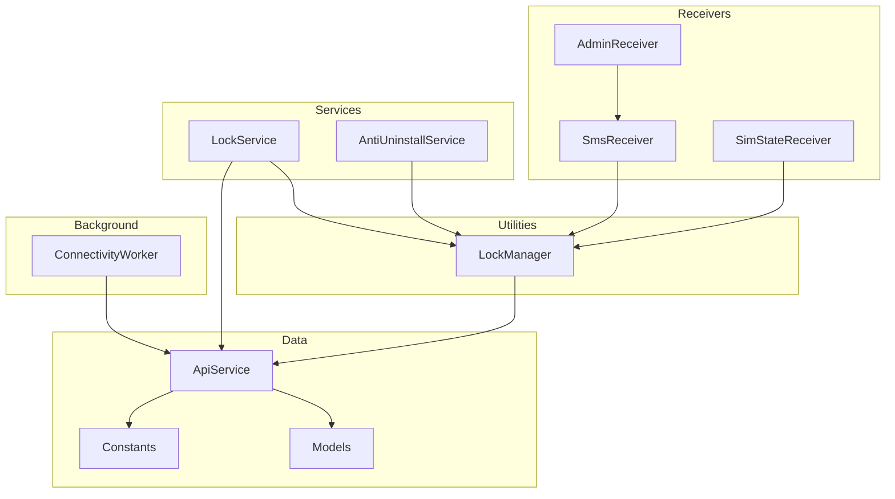
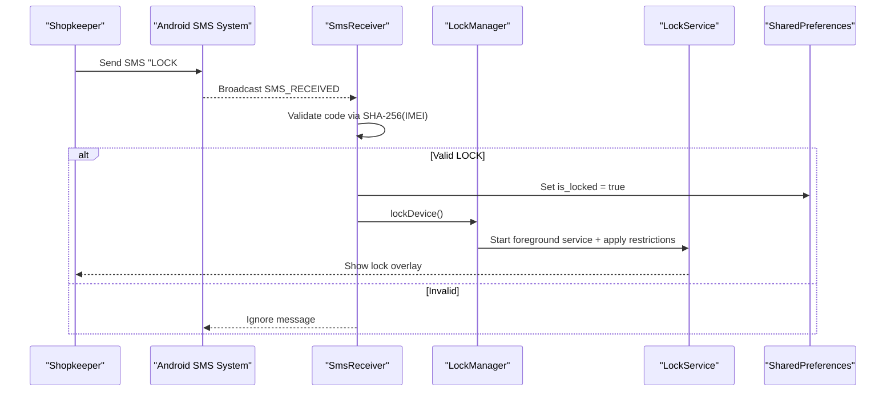
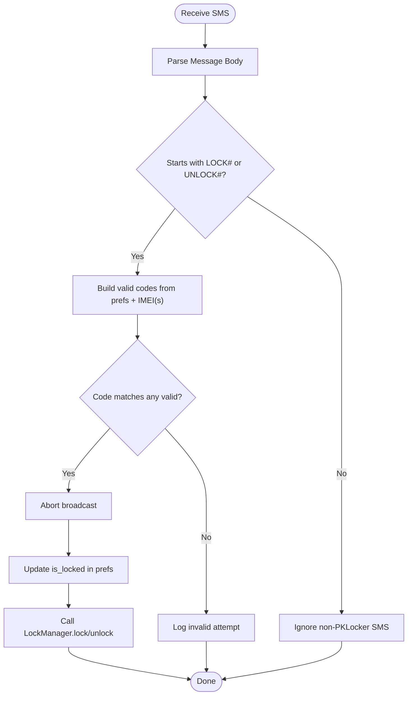
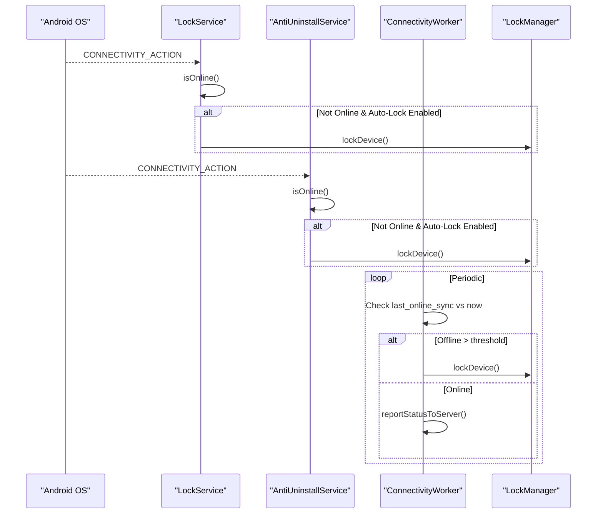
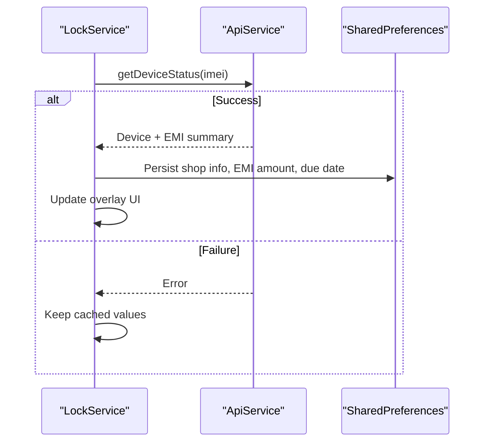
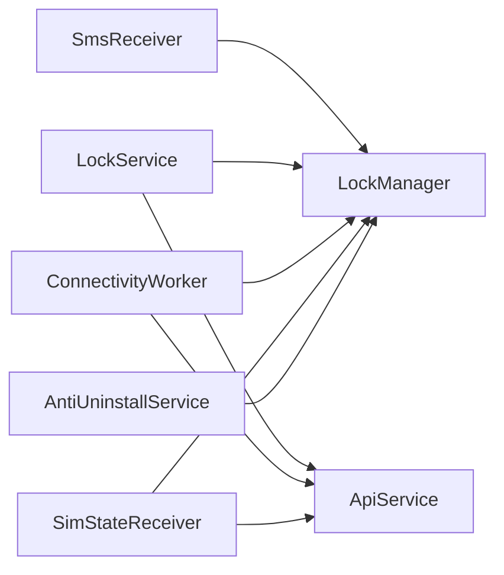

# Offline Capability

<cite>
**Referenced Files in This Document**
- [SmsReceiver.kt](file://app/src/main/java/com/pksafe/lock/manager/receiver/SmsReceiver.kt)
- [LockService.kt](file://app/src/main/java/com/pksafe/lock/manager/service/LockService.kt)
- [LockManager.kt](file://app/src/main/java/com/pksafe/lock/manager/util/LockManager.kt)
- [ConnectivityWorker.kt](file://app/src/main/java/com/pksafe/lock/manager/service/ConnectivityWorker.kt)
- [ApiService.kt](file://app/src/main/java/com/pksafe/lock/manager/data/ApiService.kt)
- [Models.kt](file://app/src/main/java/com/pksafe/lock/manager/data/Models.kt)
- [Constants.kt](file://app/src/main/java/com/pksafe/lock/manager/util/Constants.kt)
- [AdminReceiver.kt](file://app/src/main/java/com/pksafe/lock/manager/receiver/AdminReceiver.kt)
- [SimStateReceiver.kt](file://app/src/main/java/com/pksafe/lock/manager/receiver/SimStateReceiver.kt)
- [AntiUninstallService.kt](file://app/src/main/java/com/pksafe/lock/manager/service/AntiUninstallService.kt)
</cite>

## Table of Contents
1. Introduction
2. Project Structure
3. Core Components
4. Architecture Overview
5. Detailed Component Analysis
6. Dependency Analysis
7. Performance Considerations
8. Troubleshooting Guide
9. Conclusion

## Introduction
This document explains PK Locker’s offline capability for device management without internet connectivity. It focuses on:
- SMS-based command processing that intercepts and validates lock/unlock commands locally using SHA-256 codes derived from the device IMEI(s).
- Local state management to persist lockdown during connectivity outages and synchronize when connectivity is restored.
- Fallback mechanisms including dual IMEI support, command queuing via periodic workers, and conflict resolution strategies between local and server states.
- Connectivity detection, automatic reconnection logic, and data synchronization protocols.
- Examples of SMS formats, security validation, error handling, and recovery procedures after extended connectivity loss.

## Project Structure
PK Locker implements offline enforcement through a combination of receivers, services, utilities, and background workers:
- SMS interception and validation occur in a broadcast receiver.
- Device locking/unlocking is enforced via a foreground service overlay and device policy restrictions.
- Background workers monitor connectivity and enforce offline policies.
- SIM change events trigger auto-lock or unlock behavior.
- An accessibility-based guard service protects against tampering and enforces app blocking.

**Diagram sources**
- [SmsReceiver.kt:1-164](file://app/src/main/java/com/pksafe/lock/manager/receiver/SmsReceiver.kt#L1-L164)
- [LockService.kt:1-330](file://app/src/main/java/com/pksafe/lock/manager/service/LockService.kt#L1-L330)
- [LockManager.kt:1-406](file://app/src/main/java/com/pksafe/lock/manager/util/LockManager.kt#L1-L406)
- [ConnectivityWorker.kt:1-72](file://app/src/main/java/com/pksafe/lock/manager/service/ConnectivityWorker.kt#L1-L72)
- [ApiService.kt:1-234](file://app/src/main/java/com/pksafe/lock/manager/data/ApiService.kt#L1-L234)
- [Models.kt:1-255](file://app/src/main/java/com/pksafe/lock/manager/data/Models.kt#L1-L255)
- [Constants.kt:1-10](file://app/src/main/java/com/pksafe/lock/manager/util/Constants.kt#L1-L10)
- [AdminReceiver.kt:1-104](file://app/src/main/java/com/pksafe/lock/manager/receiver/AdminReceiver.kt#L1-L104)
- [SimStateReceiver.kt:1-145](file://app/src/main/java/com/pksafe/lock/manager/receiver/SimStateReceiver.kt#L1-L145)
- [AntiUninstallService.kt:1-224](file://app/src/main/java/com/pksafe/lock/manager/service/AntiUninstallService.kt#L1-L224)

**Section sources**
- [SmsReceiver.kt:1-164](file://app/src/main/java/com/pksafe/lock/manager/receiver/SmsReceiver.kt#L1-L164)
- [LockService.kt:1-330](file://app/src/main/java/com/pksafe/lock/manager/service/LockService.kt#L1-L330)
- [LockManager.kt:1-406](file://app/src/main/java/com/pksafe/lock/manager/util/LockManager.kt#L1-L406)
- [ConnectivityWorker.kt:1-72](file://app/src/main/java/com/pksafe/lock/manager/service/ConnectivityWorker.kt#L1-L72)
- [ApiService.kt:1-234](file://app/src/main/java/com/pksafe/lock/manager/data/ApiService.kt#L1-L234)
- [Models.kt:1-255](file://app/src/main/java/com/pksafe/lock/manager/data/Models.kt#L1-L255)
- [Constants.kt:1-10](file://app/src/main/java/com/pksafe/lock/manager/util/Constants.kt#L1-L10)
- [AdminReceiver.kt:1-104](file://app/src/main/java/com/pksafe/lock/manager/receiver/AdminReceiver.kt#L1-L104)
- [SimStateReceiver.kt:1-145](file://app/src/main/java/com/pksafe/lock/manager/receiver/SimStateReceiver.kt#L1-L145)
- [AntiUninstallService.kt:1-224](file://app/src/main/java/com/pksafe/lock/manager/service/AntiUninstallService.kt#L1-L224)

## Core Components
- SmsReceiver: Intercepts incoming SMS, validates lock/unlock commands offline using SHA-256 codes derived from stored IMEI(s), and triggers device lock/unlock via LockManager. Also supports fallback codes from preferences if provided by backend.
- LockService: Foreground service that renders a persistent lock overlay, enforces hardware restrictions, monitors connectivity, and refreshes EMI/device info when online.
- LockManager: Central utility to apply device policy restrictions (camera, USB, factory reset, safe boot, debugging, settings), start/stop LockService, and manage permanent restrictions.
- ConnectivityWorker: Periodic worker that detects prolonged offline periods and enforces local lock; also sends heartbeat/status updates when online.
- SimStateReceiver: Responds to SIM changes to auto-lock or unlock based on configuration and tracks ICCID changes.
- AntiUninstallService: Accessibility-based guard that blocks restricted actions and enforces app hiding and settings protection.
- ApiService and Models: Retrofit interface and data models used for network calls when connectivity is available.
- Constants: Server base URL and update endpoints.

**Section sources**
- [SmsReceiver.kt:1-164](file://app/src/main/java/com/pksafe/lock/manager/receiver/SmsReceiver.kt#L1-L164)
- [LockService.kt:1-330](file://app/src/main/java/com/pksafe/lock/manager/service/LockService.kt#L1-L330)
- [LockManager.kt:1-406](file://app/src/main/java/com/pksafe/lock/manager/util/LockManager.kt#L1-L406)
- [ConnectivityWorker.kt:1-72](file://app/src/main/java/com/pksafe/lock/manager/service/ConnectivityWorker.kt#L1-L72)
- [SimStateReceiver.kt:1-145](file://app/src/main/java/com/pksafe/lock/manager/receiver/SimStateReceiver.kt#L1-L145)
- [AntiUninstallService.kt:1-224](file://app/src/main/java/com/pksafe/lock/manager/service/AntiUninstallService.kt#L1-L224)
- [ApiService.kt:1-234](file://app/src/main/java/com/pksafe/lock/manager/data/ApiService.kt#L1-L234)
- [Models.kt:1-255](file://app/src/main/java/com/pksafe/lock/manager/data/Models.kt#L1-L255)
- [Constants.kt:1-10](file://app/src/main/java/com/pksafe/lock/manager/util/Constants.kt#L1-L10)

## Architecture Overview
The offline architecture ensures that critical device management functions operate without internet:
- SMS commands are validated locally using deterministic SHA-256 codes based on device IMEI(s).
- Lock/unlock state is persisted in SharedPreferences and enforced via Device Policy Manager.
- A foreground service maintains a persistent overlay and applies hardware restrictions.
- Background workers detect connectivity status and enforce offline policies or sync when online.
- SIM change events can trigger auto-lock/unlock flows.
- An accessibility guard prevents tampering and enforces app-level controls.

**Diagram sources**
- [SmsReceiver.kt:44-142](file://app/src/main/java/com/pksafe/lock/manager/receiver/SmsReceiver.kt#L44-L142)
- [LockManager.kt:111-148](file://app/src/main/java/com/pksafe/lock/manager/util/LockManager.kt#L111-L148)
- [LockService.kt:50-80](file://app/src/main/java/com/pksafe/lock/manager/service/LockService.kt#L50-L80)

## Detailed Component Analysis

### SMS-Based Command Processing (Offline)
- Command format:
  - Lock: "LOCK#<code>"
  - Unlock: "UNLOCK#<code>"
- Code generation:
  - Deterministic SHA-256 of "LOCK_<imei>" or "UNLOCK_<imei>".
  - Supports dual IMEI fallback: both primary and secondary IMEI generate valid codes.
  - Backend-provided codes can be saved in preferences and accepted alongside generated ones.
- Validation flow:
  - Extract messages from intent, normalize body to uppercase, parse prefix and code.
  - Build set of valid codes from preferences and IMEI(s).
  - If match found, abort broadcast to hide from default SMS app, update local lock state, and invoke LockManager.
- Error handling:
  - Malformed messages are ignored with logs.
  - Missing IMEI(s) prevent validation; logs indicate inability to verify protocol.

**Diagram sources**
- [SmsReceiver.kt:44-142](file://app/src/main/java/com/pksafe/lock/manager/receiver/SmsReceiver.kt#L44-L142)

**Section sources**
- [SmsReceiver.kt:31-42](file://app/src/main/java/com/pksafe/lock/manager/receiver/SmsReceiver.kt#L31-L42)
- [SmsReceiver.kt:64-92](file://app/src/main/java/com/pksafe/lock/manager/receiver/SmsReceiver.kt#L64-L92)
- [SmsReceiver.kt:94-141](file://app/src/main/java/com/pksafe/lock/manager/receiver/SmsReceiver.kt#L94-L141)

### Local State Management and Persistence
- Lock state is stored in SharedPreferences under a boolean flag indicating locked status.
- LockService persists dynamic overlay content (shop name, phone, EMI amount, due date) and refreshes it when online.
- AdminReceiver saves IMEI(s) and marks provisioning complete, enabling customer mode and SMS reception.
- ConnectivityWorker records last successful online sync timestamp to determine offline duration.

Key behaviors:
- On lock: set is_locked true, start LockService, apply hardware restrictions.
- On unlock: stop LockService, clear restrictions, set is_locked false.
- Auto-lock on connectivity loss if enabled.
- SIM removal/change can trigger auto-lock or unlock depending on configuration.

**Section sources**
- [SmsReceiver.kt:104-135](file://app/src/main/java/com/pksafe/lock/manager/receiver/SmsReceiver.kt#L104-L135)
- [LockService.kt:82-105](file://app/src/main/java/com/pksafe/lock/manager/service/LockService.kt#L82-L105)
- [LockService.kt:170-233](file://app/src/main/java/com/pksafe/lock/manager/service/LockService.kt#L170-L233)
- [AdminReceiver.kt:43-98](file://app/src/main/java/com/pksafe/lock/manager/receiver/AdminReceiver.kt#L43-L98)
- [ConnectivityWorker.kt:17-47](file://app/src/main/java/com/pksafe/lock/manager/service/ConnectivityWorker.kt#L17-L47)

### Fallback Mechanisms
- Dual IMEI support:
  - Codes generated from both primary and secondary IMEI(s) are considered valid.
  - AdminReceiver attempts to fetch both slots and stores them in preferences.
- Command queuing:
  - ConnectivityWorker acts as a queue mechanism by periodically checking offline duration and enforcing lock if offline too long.
  - When online, it reports status to server and updates last sync time.
- Conflict resolution:
  - Local state takes precedence during offline periods.
  - On reconnect, background worker synchronizes status with server; server-driven changes can override local state via API responses when applicable.

**Section sources**
- [SmsReceiver.kt:64-92](file://app/src/main/java/com/pksafe/lock/manager/receiver/SmsReceiver.kt#L64-L92)
- [AdminReceiver.kt:62-88](file://app/src/main/java/com/pksafe/lock/manager/receiver/AdminReceiver.kt#L62-L88)
- [ConnectivityWorker.kt:25-47](file://app/src/main/java/com/pksafe/lock/manager/service/ConnectivityWorker.kt#L25-L47)

### Security Validation Using SHA-256
- Code derivation:
  - SHA-256 hash of "LOCK_<imei>" or "UNLOCK_<imei>" produces deterministic codes per device.
  - Both IMEI slots contribute to valid code sets.
- Preference-backed codes:
  - Backend-provided codes can be saved and accepted alongside generated ones for flexibility.
- Validation robustness:
  - Case-insensitive comparison after uppercasing message body.
  - Strict prefix matching ensures only intended commands are processed.

**Section sources**
- [SmsReceiver.kt:31-42](file://app/src/main/java/com/pksafe/lock/manager/receiver/SmsReceiver.kt#L31-L42)
- [SmsReceiver.kt:58-92](file://app/src/main/java/com/pksafe/lock/manager/receiver/SmsReceiver.kt#L58-L92)

### Connectivity Detection and Automatic Reconnection
- Connectivity checks:
  - LockService and AntiUninstallService register receivers for connectivity changes.
  - When auto-lock is enabled and internet disconnects, devices are locked immediately.
- Reconnection logic:
  - ConnectivityWorker runs periodically to check offline duration and enforce lock if exceeded.
  - On successful online sync, last_online_sync timestamp is updated.

**Diagram sources**
- [LockService.kt:82-105](file://app/src/main/java/com/pksafe/lock/manager/service/LockService.kt#L82-L105)
- [AntiUninstallService.kt:88-117](file://app/src/main/java/com/pksafe/lock/manager/service/AntiUninstallService.kt#L88-L117)
- [ConnectivityWorker.kt:17-47](file://app/src/main/java/com/pksafe/lock/manager/service/ConnectivityWorker.kt#L17-L47)

**Section sources**
- [LockService.kt:82-105](file://app/src/main/java/com/pksafe/lock/manager/service/LockService.kt#L82-L105)
- [AntiUninstallService.kt:88-117](file://app/src/main/java/com/pksafe/lock/manager/service/AntiUninstallService.kt#L88-L117)
- [ConnectivityWorker.kt:17-47](file://app/src/main/java/com/pksafe/lock/manager/service/ConnectivityWorker.kt#L17-L47)

### Data Synchronization Protocols
- When online, LockService refreshes device and EMI information from the server and updates overlay UI and preferences.
- ConnectivityWorker reports status updates to server and updates last sync timestamp upon success.
- SimStateReceiver notifies server about SIM changes when possible.

**Diagram sources**
- [LockService.kt:240-314](file://app/src/main/java/com/pksafe/lock/manager/service/LockService.kt#L240-L314)
- [ApiService.kt:101-109](file://app/src/main/java/com/pksafe/lock/manager/data/ApiService.kt#L101-L109)
- [Models.kt:150-165](file://app/src/main/java/com/pksafe/lock/manager/data/Models.kt#L150-L165)

**Section sources**
- [LockService.kt:240-314](file://app/src/main/java/com/pksafe/lock/manager/service/LockService.kt#L240-L314)
- [ConnectivityWorker.kt:49-70](file://app/src/main/java/com/pksafe/lock/manager/service/ConnectivityWorker.kt#L49-L70)
- [SimStateReceiver.kt:116-138](file://app/src/main/java/com/pksafe/lock/manager/receiver/SimStateReceiver.kt#L116-L138)

### SIM Change Handling and Auto-Lock
- Detects SIM removal or insertion and compares current ICCID with stored value.
- If auto-lock on SIM change is enabled:
  - SIM removal locks device immediately.
  - SIM change locks device until authorized SIM is reinserted.
- Notifies server about SIM changes when connectivity is available.

**Section sources**
- [SimStateReceiver.kt:31-49](file://app/src/main/java/com/pksafe/lock/manager/receiver/SimStateReceiver.kt#L31-L49)
- [SimStateReceiver.kt:50-114](file://app/src/main/java/com/pksafe/lock/manager/receiver/SimStateReceiver.kt#L50-L114)
- [SimStateReceiver.kt:116-138](file://app/src/main/java/com/pksafe/lock/manager/receiver/SimStateReceiver.kt#L116-L138)

### Tamper Protection and App Controls
- AntiUninstallService monitors accessibility events to block restricted actions and navigate away from settings screens when blocked.
- Enforces app hiding for known packages via LockManager when device owner privileges are active.
- Maintains global back/home actions to prevent user escape during lock.

**Section sources**
- [AntiUninstallService.kt:26-48](file://app/src/main/java/com/pksafe/lock/manager/service/AntiUninstallService.kt#L26-L48)
- [AntiUninstallService.kt:136-210](file://app/src/main/java/com/pksafe/lock/manager/service/AntiUninstallService.kt#L136-L210)
- [LockManager.kt:263-291](file://app/src/main/java/com/pksafe/lock/manager/util/LockManager.kt#L263-L291)

## Dependency Analysis
Components interact as follows:
- SmsReceiver depends on LockManager to enforce lock/unlock and uses SharedPreferences for state and codes.
- LockService depends on LockManager for restrictions and ApiService for live data refresh.
- ConnectivityWorker depends on ApiService for status reporting and LockManager for offline enforcement.
- SimStateReceiver depends on LockManager for auto-lock/unlock and ApiService for notifications.
- AntiUninstallService depends on LockManager for app controls and SharedPreferences for configuration.

**Diagram sources**
- [SmsReceiver.kt:106-135](file://app/src/main/java/com/pksafe/lock/manager/receiver/SmsReceiver.kt#L106-L135)
- [LockService.kt:240-314](file://app/src/main/java/com/pksafe/lock/manager/service/LockService.kt#L240-L314)
- [ConnectivityWorker.kt:49-70](file://app/src/main/java/com/pksafe/lock/manager/service/ConnectivityWorker.kt#L49-L70)
- [SimStateReceiver.kt:116-138](file://app/src/main/java/com/pksafe/lock/manager/receiver/SimStateReceiver.kt#L116-L138)
- [AntiUninstallService.kt:136-210](file://app/src/main/java/com/pksafe/lock/manager/service/AntiUninstallService.kt#L136-L210)

**Section sources**
- [SmsReceiver.kt:106-135](file://app/src/main/java/com/pksafe/lock/manager/receiver/SmsReceiver.kt#L106-L135)
- [LockService.kt:240-314](file://app/src/main/java/com/pksafe/lock/manager/service/LockService.kt#L240-L314)
- [ConnectivityWorker.kt:49-70](file://app/src/main/java/com/pksafe/lock/manager/service/ConnectivityWorker.kt#L49-L70)
- [SimStateReceiver.kt:116-138](file://app/src/main/java/com/pksafe/lock/manager/receiver/SimStateReceiver.kt#L116-L138)
- [AntiUninstallService.kt:136-210](file://app/src/main/java/com/pksafe/lock/manager/service/AntiUninstallService.kt#L136-L210)

## Performance Considerations
- SMS parsing and SHA-256 validation are lightweight and run on the main thread; ensure minimal overhead by avoiding heavy operations in receivers.
- Network calls for data refresh and status reporting are executed on background threads to avoid blocking UI.
- Foreground service keeps overlay visible and responsive; use efficient UI updates and avoid frequent redraws.
- Periodic worker should be scheduled with reasonable intervals to balance battery usage and responsiveness.

[No sources needed since this section provides general guidance]

## Troubleshooting Guide
Common offline scenarios and resolutions:
- SMS not triggering lock/unlock:
  - Verify device is marked as customer and IMEI(s) are saved.
  - Ensure SMS format matches expected prefixes and codes.
  - Check logs for invalid code attempts and missing IMEI errors.
- Device remains unlocked after power cycle:
  - Confirm SharedPreferences contains is_locked flag and LockService starts correctly.
  - Ensure Device Owner privileges are active and restrictions applied.
- Extended connectivity loss:
  - ConnectivityWorker should enforce lock after threshold; verify last_online_sync timestamp and worker execution.
  - On reconnect, status updates should resume; check API responses and logs.
- SIM-related issues:
  - Validate ICCID detection and auto-lock configuration.
  - Confirm server notification succeeds or falls back gracefully.

Recovery procedures:
- Restore connectivity and allow ConnectivityWorker to sync status.
- Use master unlock code embedded in LockService if necessary.
- Re-provision device if IMEI(s) are missing or corrupted.

**Section sources**
- [SmsReceiver.kt:64-92](file://app/src/main/java/com/pksafe/lock/manager/receiver/SmsReceiver.kt#L64-L92)
- [LockService.kt:200-218](file://app/src/main/java/com/pksafe/lock/manager/service/LockService.kt#L200-L218)
- [ConnectivityWorker.kt:25-47](file://app/src/main/java/com/pksafe/lock/manager/service/ConnectivityWorker.kt#L25-L47)
- [SimStateReceiver.kt:50-114](file://app/src/main/java/com/pksafe/lock/manager/receiver/SimStateReceiver.kt#L50-L114)

## Conclusion
PK Locker’s offline capability ensures reliable device management without internet by leveraging local SMS validation, persistent state, and robust fallback mechanisms. The system enforces lockdown during connectivity outages, synchronizes when online, and protects against tampering through device policy and accessibility guards. Proper configuration of IMEI(s), auto-lock settings, and periodic worker scheduling guarantees consistent behavior across diverse environments.

[No sources needed since this section summarizes without analyzing specific files]