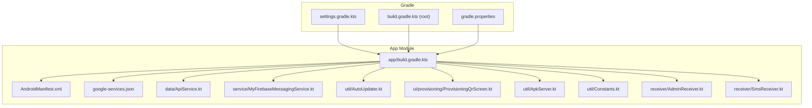
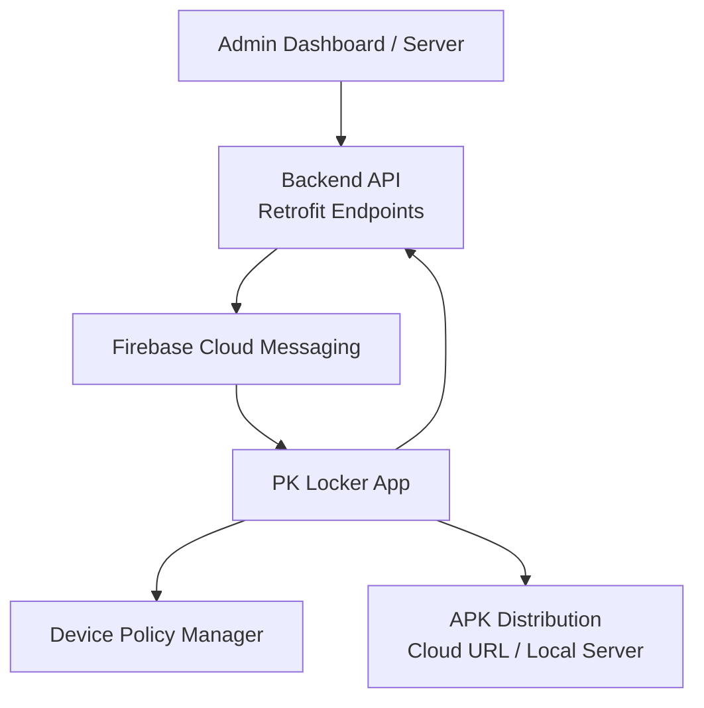
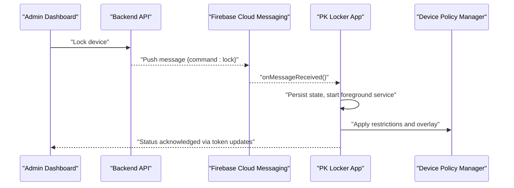
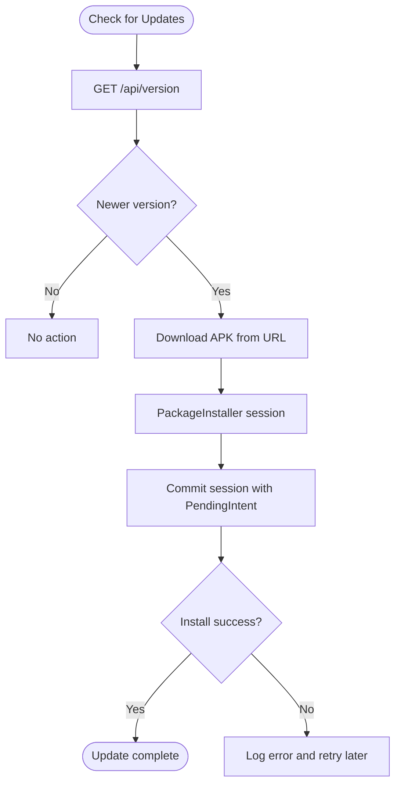
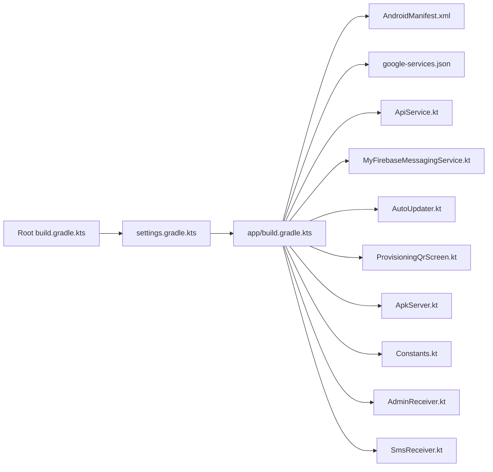

# Deployment Overview

<cite>
**Referenced Files in This Document**
- [app/build.gradle.kts](file://app/build.gradle.kts)
- [build.gradle.kts](file://build.gradle.kts)
- [settings.gradle.kts](file://settings.gradle.kts)
- [gradle.properties](file://gradle.properties)
- [app/google-services.json](file://app/google-services.json)
- [app/src/main/AndroidManifest.xml](file://app/src/main/AndroidManifest.xml)
- [app/src/main/java/com/pksafe/lock\manager/data/ApiService.kt](file://app/src/main/java/com/pksafe/lock\manager/data/ApiService.kt)
- [app/src/main/java/com/pksafe/lock\manager/service/MyFirebaseMessagingService.kt](file://app/src/main/java/com/pksafe/lock\manager/service/MyFirebaseMessagingService.kt)
- [app/src/main/java/com/pksafe/lock\manager/util/AutoUpdater.kt](file://app/src/main/java/com/pksafe/lock\manager/util/AutoUpdater.kt)
- [app/src/main/java/com/pksafe/lock\manager/ui/provisioning/ProvisioningQrScreen.kt](file://app/src/main/java/com/pksafe/lock\manager/ui/provisioning/ProvisioningQrScreen.kt)
- [app/src/main/java/com/pksafe/lock\manager/util/ApkServer.kt](file://app/src/main/java/com/pksafe/lock\manager/util/ApkServer.kt)
- [app/src/main/java/com/pksafe/lock\manager/util/Constants.kt](file://app/src/main/java/com/pksafe/lock\manager/util/Constants.kt)
- [app/src/main/java/com/pksafe/lock\manager/receiver/AdminReceiver.kt](file://app/src/main/java/com/pksafe/lock\manager/receiver/AdminReceiver.kt)
- [app/src/main/java/com/pksafe/lock\manager/receiver/SmsReceiver.kt](file://app/src/main/java/com/pksafe/lock\manager/receiver/SmsReceiver.kt)
- [README.md](file://README.md)
</cite>

## Table of Contents
1. Introduction
2. Project Structure
3. Core Components
4. Architecture Overview
5. Detailed Component Analysis
6. Dependency Analysis
7. Performance Considerations
8. Troubleshooting Guide
9. Conclusion
10. Appendices

## Introduction
This document provides a production-focused deployment overview for PK Locker. It covers building and signing the Android APK with Gradle, distributing updates via direct download URLs and auto-updates, integrating with the backend API and Firebase Cloud Messaging (FCM), provisioning devices using QR codes and Device Owner enrollment, and operational best practices including security, monitoring, and scaling considerations for large device fleets.

## Project Structure
PK Locker is an Android application module within a Gradle project. The app module contains UI screens, services, receivers, utilities, and data APIs. Build configuration and dependencies are centralized in Gradle files, while runtime behavior is declared in the Android manifest.

**Diagram sources**
- [settings.gradle.kts:1-27](file://settings.gradle.kts#L1-L27)
- [build.gradle.kts:1-8](file://build.gradle.kts#L1-L8)
- [gradle.properties:1-21](file://gradle.properties#L1-L21)
- [app/build.gradle.kts:1-123](file://app/build.gradle.kts#L1-L123)
- [app/src/main/AndroidManifest.xml:1-160](file://app/src/main/AndroidManifest.xml#L1-L160)
- [app/google-services.json:1-67](file://app/google-services.json#L1-L67)
- [app/src/main/java/com/pksafe/lock\manager/data/ApiService.kt:1-234](file://app/src/main/java/com/pksafe/lock\manager/data/ApiService.kt#L1-L234)
- [app/src/main/java/com/pksafe/lock\manager/service/MyFirebaseMessagingService.kt:1-309](file://app/src/main/java/com/pksafe/lock\manager/service/MyFirebaseMessagingService.kt#L1-L309)
- [app/src/main/java/com/pksafe/lock\manager/util/AutoUpdater.kt:1-151](file://app/src/main/java/com/pksafe/lock\manager/util/AutoUpdater.kt#L1-L151)
- [app/src/main/java/com/pksafe/lock\manager/ui/provisioning/ProvisioningQrScreen.kt:1-460](file://app/src/main/java/com/pksafe/lock\manager/ui/provisioning/ProvisioningQrScreen.kt#L1-L460)
- [app/src/main/java/com/pksafe/lock\manager/util/ApkServer.kt:1-95](file://app/src/main/java/com/pksafe/lock\manager/util/ApkServer.kt#L1-L95)
- [app/src/main/java/com/pksafe/lock\manager/util/Constants.kt:1-10](file://app/src/main/java/com/pksafe/lock\manager/util/Constants.kt#L1-L10)
- [app/src/main/java/com/pksafe/lock\manager/receiver/AdminReceiver.kt:1-104](file://app/src/main/java/com/pksafe/lock\manager/receiver/AdminReceiver.kt#L1-L104)
- [app/src/main/java/com/pksafe/lock\manager/receiver/SmsReceiver.kt:1-164](file://app/src/main/java/com/pksafe/lock\manager/receiver/SmsReceiver.kt#L1-L164)

**Section sources**
- [settings.gradle.kts:1-27](file://settings.gradle.kts#L1-L27)
- [build.gradle.kts:1-8](file://build.gradle.kts#L1-L8)
- [gradle.properties:1-21](file://gradle.properties#L1-L21)
- [app/build.gradle.kts:1-123](file://app/build.gradle.kts#L1-L123)
- [app/src/main/AndroidManifest.xml:1-160](file://app/src/main/AndroidManifest.xml#L1-L160)

## Core Components
- Build and Signing: Gradle build types and signing configurations produce signed release APKs suitable for distribution and Play Protect compatibility.
- Backend Integration: Retrofit-based API client defines endpoints for authentication, device management, EMI, and key ordering.
- Push Notifications: Firebase Cloud Messaging service handles remote commands to lock/unlock, restrict hardware features, block apps, and deregister devices.
- Auto-Update: Background update checker compares server version code and installs new APKs silently when possible.
- Provisioning: QR-based Device Owner enrollment with signature and package checksum verification; optional local HTTP server to serve the APK from the shopkeeper’s phone or cloud URL.
- Offline Control: SMS receiver enforces lock/unlock without internet using deterministic codes derived from IMEI.

**Section sources**
- [app/build.gradle.kts:25-52](file://app/build.gradle.kts#L25-L52)
- [app/src/main/java/com/pksafe/lock\manager/data/ApiService.kt:11-185](file://app/src/main/java/com/pksafe/lock\manager/data/ApiService.kt#L11-L185)
- [app/src/main/java/com/pksafe/lock\manager/service/MyFirebaseMessagingService.kt:20-224](file://app/src/main/java/com/pksafe/lock\manager/service/MyFirebaseMessagingService.kt#L20-L224)
- [app/src/main/java/com/pksafe/lock\manager/util/AutoUpdater.kt:18-151](file://app/src/main/java/com/pksafe/lock\manager/util/AutoUpdater.kt#L18-L151)
- [app/src/main/java/com/pksafe/lock\manager/ui/provisioning/ProvisioningQrScreen.kt:120-157](file://app/src/main/java/com/pksafe/lock\manager/ui/provisioning/ProvisioningQrScreen.kt#L120-L157)
- [app/src/main/java/com/pksafe/lock\manager/util/ApkServer.kt:9-95](file://app/src/main/java/com/pksafe/lock\manager/util/ApkServer.kt#L9-L95)
- [app/src/main/java/com/pksafe/lock\manager/receiver/SmsReceiver.kt:16-164](file://app/src/main/java/com/pksafe/lock\manager/receiver/SmsReceiver.kt#L16-L164)

## Architecture Overview
The deployment architecture integrates the Android app with a backend API and Firebase Cloud Messaging. Devices are provisioned via QR codes that trigger Device Owner enrollment and silent installation. Updates are delivered through a version check endpoint and silent install flows.

**Diagram sources**
- [app/src/main/java/com/pksafe/lock\manager/data/ApiService.kt:11-185](file://app/src/main/java/com/pksafe/lock\manager/data/ApiService.kt#L11-L185)
- [app/src/main/java/com/pksafe/lock\manager/service/MyFirebaseMessagingService.kt:20-224](file://app/src/main/java/com/pksafe/lock\manager/service/MyFirebaseMessagingService.kt#L20-L224)
- [app/src/main/java/com/pksafe/lock\manager/util/AutoUpdater.kt:18-151](file://app/src/main/java/com/pksafe/lock\manager/util/AutoUpdater.kt#L18-L151)
- [app/src/main/java/com/pksafe/lock\manager/ui/provisioning/ProvisioningQrScreen.kt:120-157](file://app/src/main/java/com/pksafe/lock\manager/ui/provisioning/ProvisioningQrScreen.kt#L120-L157)
- [app/src/main/java/com/pksafe/lock\manager/util/ApkServer.kt:9-95](file://app/src/main/java/com/pksafe/lock\manager/util/ApkServer.kt#L9-L95)

## Detailed Component Analysis

### APK Build and Release Signing
- Build Types: Debug and release build types are configured with signing applied to both for consistent behavior.
- Signing Config: Release signing uses keystore and passwords; multiple signing schemes are enabled to satisfy platform requirements.
- Dependencies and Features: Compose, Retrofit, Firebase, WorkManager, and other libraries are included. Packaging excludes unnecessary resources.

Operational notes:
- Use the provided Gradle tasks to assemble release builds.
- Ensure the keystore and credentials are managed securely in CI/CD pipelines rather than hard-coded values.

**Section sources**
- [app/build.gradle.kts:25-52](file://app/build.gradle.kts#L25-L52)
- [app/build.gradle.kts:87-123](file://app/build.gradle.kts#L87-L123)
- [README.md:18-33](file://README.md#L18-L33)

### Distribution Channels and Auto-Updates
- Direct Download URLs: The app references a public APK URL used during QR provisioning and manual installation.
- Version Check Endpoint: The auto-updater queries a version endpoint to determine if a newer build exists.
- Silent Install Flow: When privileges allow, the app installs updates via PackageInstaller and notifies completion.

Distribution options:
- Cloud URL: Configure a stable HTTPS endpoint for APK hosting.
- Local Server Mode: Optionally start a lightweight HTTP server on the shopkeeper’s device to serve the exact installed APK during provisioning.

**Section sources**
- [app/src/main/java/com/pksafe/lock\manager/ui/provisioning/ProvisioningQrScreen.kt:54-63](file://app/src/main/java/com/pksafe/lock\manager/ui/provisioning/ProvisioningQrScreen.kt#L54-L63)
- [app/src/main/java/com/pksafe/lock\manager/util/Constants.kt:3-10](file://app/src/main/java/com/pksafe/lock\manager/util/Constants.kt#L3-L10)
- [app/src/main/java/com/pksafe/lock\manager/util/AutoUpdater.kt:18-151](file://app/src/main/java/com/pksafe/lock\manager/util/AutoUpdater.kt#L18-L151)
- [app/src/main/java/com/pksafe/lock\manager/util/ApkServer.kt:9-95](file://app/src/main/java/com/pksafe/lock\manager/util/ApkServer.kt#L9-L95)
- [README.md:36-47](file://README.md#L36-L47)

### Backend Integration Points and API Endpoints
The app communicates with the backend via Retrofit endpoints covering:
- Authentication: login and signup.
- Device Management: register, list, stats, analytics, lock/unlock, advanced controls, token updates, SIM change notifications, location reporting, unlock-all, deregistration.
- Customer Access: public device status retrieval.
- EMI Management: schedule retrieval, mark paid, reschedule plan.
- Key Orders: checkout, verify payment, free test keys, wallet pay, history, admin approvals/rejections.

Security considerations:
- Authorization headers are required for protected endpoints.
- Validate responses and handle errors gracefully in the app layer.

**Section sources**
- [app/src/main/java/com/pksafe/lock\manager/data/ApiService.kt:11-185](file://app/src/main/java/com/pksafe/lock\manager/data/ApiService.kt#L11-L185)

### Firebase Cloud Messaging Setup
- Service Registration: The messaging service is declared in the manifest and listens for FCM events.
- Command Handling: The service processes commands such as lock/unlock, hardware restrictions, app blocking, config changes, unlock-all, deregistration, and data requests.
- Notifications: Critical notifications are posted with high priority and full-screen intent to ensure visibility.

Production checklist:
- Ensure google-services.json matches the app’s package name and includes valid API keys.
- Verify notification channels and permissions are correctly set.

**Section sources**
- [app/src/main/AndroidManifest.xml:73-85](file://app/src/main/AndroidManifest.xml#L73-L85)
- [app/google-services.json:1-67](file://app/google-services.json#L1-L67)
- [app/src/main/java/com/pksafe/lock\manager/service/MyFirebaseMessagingService.kt:20-309](file://app/src/main/java/com/pksafe/lock\manager/service/MyFirebaseMessagingService.kt#L20-L309)

### Device Provisioning Workflow (QR Code and Device Owner)
- QR Content: Includes device admin component, package name, download location, signature checksum, package checksum, locale/time zone, and extras indicating setup source and control level.
- Signature and Package Hash: Ensures integrity and trust during enrollment.
- Enrollment Flow: On scanning, Android downloads the APK, installs it, sets Device Owner, and triggers post-provisioning actions like fetching IMEI and launching the app.

Operational modes:
- Cloud Mode: Uses a hosted APK URL.
- Local Server Mode: Starts an internal HTTP server to serve the current APK from the shopkeeper’s device.

**Section sources**
- [app/src/main/java/com/pksafe/lock\manager/ui/provisioning/ProvisioningQrScreen.kt:120-157](file://app/src/main/java/com/pksafe/lock\manager/ui/provisioning/ProvisioningQrScreen.kt#L120-L157)
- [app/src/main/java/com/pksafe/lock\manager/ui/provisioning/ProvisioningQrScreen.kt:64-111](file://app/src/main/java/com/pksafe/lock\manager/ui/provisioning/ProvisioningQrScreen.kt#L64-L111)
- [app/src/main/java/com/pksafe/lock\manager/receiver/AdminReceiver.kt:16-36](file://app/src/main/java/com/pksafe/lock\manager/receiver/AdminReceiver.kt#L16-L36)
- [app/src/main/java/com/pksafe/lock\manager/receiver/AdminReceiver.kt:43-102](file://app/src/main/java/com/pksafe/lock\manager/receiver/AdminReceiver.kt#L43-L102)

### Offline Lock/Unlock via SMS
- Protocol: Messages follow a simple format with deterministic codes derived from IMEI.
- Execution: The receiver validates codes and triggers lock/unlock operations even without network connectivity.

Best practices:
- Ensure IMEI is available in preferences after provisioning.
- Handle multi-SIM scenarios by considering both IMEIs.

**Section sources**
- [app/src/main/java/com/pksafe/lock\manager/receiver/SmsReceiver.kt:16-164](file://app/src/main/java/com/pksafe/lock\manager/receiver/SmsReceiver.kt#L16-L164)

### Sequence Diagrams

#### Remote Lock via FCM

**Diagram sources**
- [app/src/main/java/com/pksafe/lock\manager/service/MyFirebaseMessagingService.kt:47-68](file://app/src/main/java/com/pksafe/lock\manager/service/MyFirebaseMessagingService.kt#L47-L68)
- [app/src/main/java/com/pksafe/lock\manager/data/ApiService.kt:46-56](file://app/src/main/java/com/pksafe/lock\manager/data/ApiService.kt#L46-L56)

#### Auto-Update Flow

**Diagram sources**
- [app/src/main/java/com/pksafe/lock\manager/util/AutoUpdater.kt:33-77](file://app/src/main/java/com/pksafe/lock\manager/util/AutoUpdater.kt#L33-L77)
- [app/src/main/java/com/pksafe/lock\manager/util/AutoUpdater.kt:79-151](file://app/src/main/java/com/pksafe/lock\manager/util/AutoUpdater.kt#L79-L151)

## Dependency Analysis
- Gradle Configuration: Centralized plugin versions and repositories ensure reproducible builds.
- App Module Dependencies: Include Compose UI, Retrofit, Firebase, WorkManager, Maps, and networking utilities.
- Manifest Declarations: Services, receivers, and providers are registered with appropriate permissions and exported flags.

**Diagram sources**
- [build.gradle.kts:1-8](file://build.gradle.kts#L1-L8)
- [settings.gradle.kts:1-27](file://settings.gradle.kts#L1-L27)
- [app/build.gradle.kts:1-123](file://app/build.gradle.kts#L1-L123)
- [app/src/main/AndroidManifest.xml:1-160](file://app/src/main/AndroidManifest.xml#L1-L160)

**Section sources**
- [build.gradle.kts:1-8](file://build.gradle.kts#L1-L8)
- [settings.gradle.kts:1-27](file://settings.gradle.kts#L1-L27)
- [app/build.gradle.kts:1-123](file://app/build.gradle.kts#L1-L123)
- [app/src/main/AndroidManifest.xml:1-160](file://app/src/main/AndroidManifest.xml#L1-L160)

## Performance Considerations
- Network Timeouts: Update checks use short timeouts to avoid blocking the UI thread.
- Background Work: Use foreground services and work managers judiciously to maintain responsiveness.
- Resource Exclusions: Exclude unnecessary resources to reduce APK size and improve load times.
- Concurrency: Offload heavy operations (download, hashing) to background threads.

[No sources needed since this section provides general guidance]

## Troubleshooting Guide
Common issues and resolutions:
- IMEI not captured during provisioning: Ensure Device Owner mode completes and IMEI fetch runs; fallback to manual entry if necessary.
- Lock not triggered remotely: Verify overlay permission, IMEI match, and active internet connection for FCM delivery.
- Auto-update failures: Confirm version endpoint returns correct structure and download URL is reachable; validate PackageInstaller permissions.
- SMS lock not working: Ensure IMEI stored in preferences and codes match deterministic generation logic.

**Section sources**
- [README.md:123-133](file://README.md#L123-L133)
- [app/src/main/java/com/pksafe/lock\manager/receiver/AdminReceiver.kt:43-102](file://app/src/main/java/com/pksafe/lock\manager/receiver/AdminReceiver.kt#L43-L102)
- [app/src/main/java/com/pksafe/lock\manager/receiver/SmsReceiver.kt:64-90](file://app/src/main/java/com/pksafe/lock\manager/receiver/SmsReceiver.kt#L64-L90)
- [app/src/main/java/com/pksafe/lock\manager/util/AutoUpdater.kt:33-77](file://app/src/main/java/com/pksafe/lock\manager/util/AutoUpdater.kt#L33-L77)

## Conclusion
PK Locker supports robust production deployment through signed APK builds, secure distribution via HTTPS endpoints, and reliable device management using Device Owner enrollment and FCM-driven commands. The combination of QR provisioning, auto-updates, offline SMS control, and comprehensive API integration enables scalable fleet management with strong operational controls.

[No sources needed since this section summarizes without analyzing specific files]

## Appendices

### Production Checklist
- Build and Sign:
  - Use Gradle to assemble release builds with all signing schemes enabled.
  - Manage keystore and credentials securely in CI/CD.
- Distribution:
  - Host APK at a stable HTTPS URL.
  - Maintain a version endpoint for force updates.
  - Optionally enable local server mode for rapid provisioning.
- Backend and FCM:
  - Ensure API endpoints are secured and monitored.
  - Validate FCM payload formats and handle edge cases.
  - Keep google-services.json aligned with the app’s package name.
- Provisioning:
  - Generate QR with correct signature and package checksums.
  - Verify Device Owner enrollment and post-setup tasks.
- Monitoring and Scaling:
  - Track update success rates, FCM delivery metrics, and device registration stats.
  - Implement rate limiting and retries on the backend for high concurrency.
  - Use background workers for bulk operations and batch updates.

[No sources needed since this section provides general guidance]