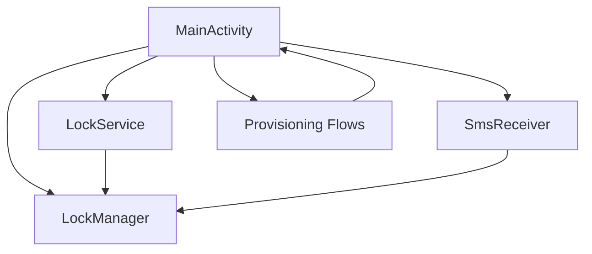
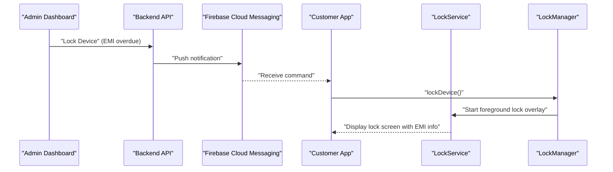
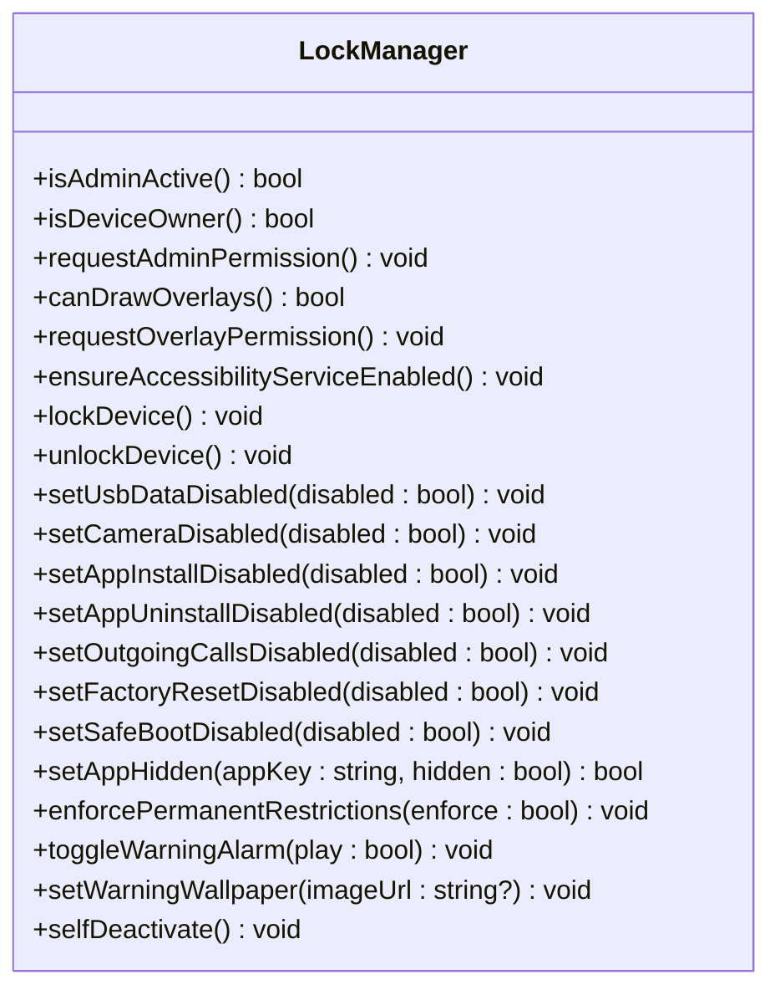
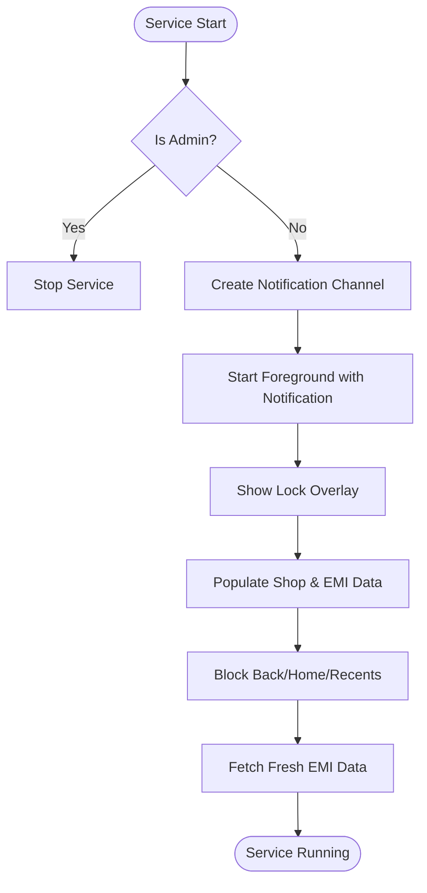
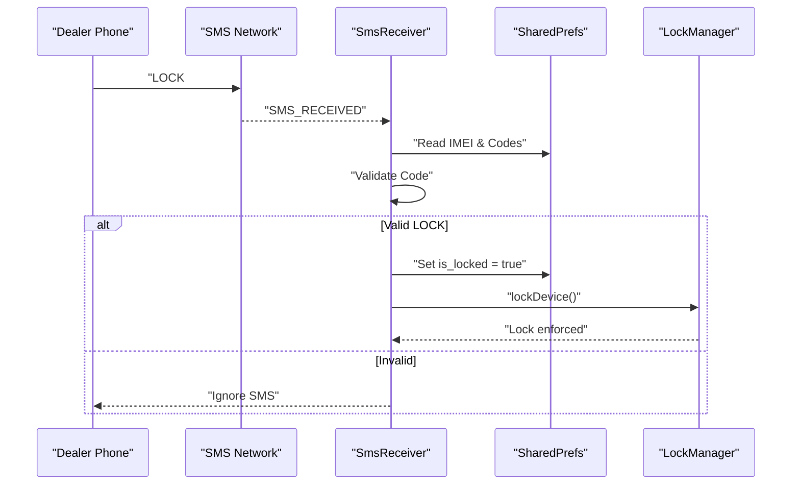
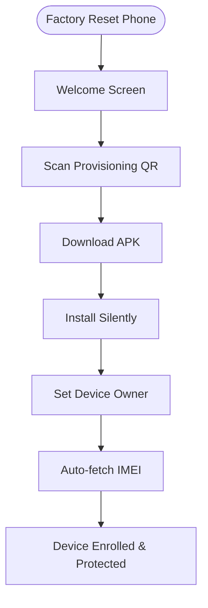
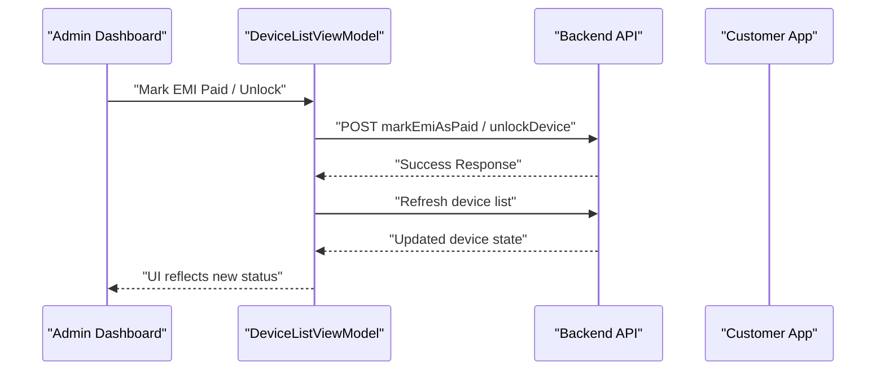
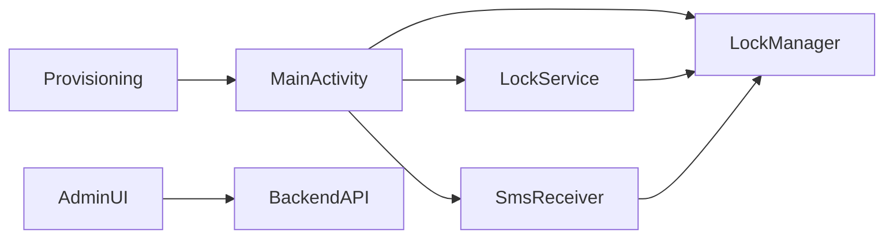

# Introduction

<cite>
**Referenced Files in This Document**
- [README.md](file://README.md)
- [AndroidManifest.xml](file://app/src/main/AndroidManifest.xml)
- [MainActivity.kt](file://app/src/main/java/com/pksafe/lock/manager/MainActivity.kt)
- [LockManager.kt](file://app/src/main/java/com/pksafe/lock/manager/util/LockManager.kt)
- [LockService.kt](file://app/src/main/java/com/pksafe/lock/manager/service/LockService.kt)
- [SmsReceiver.kt](file://app/src/main/java/com/pksafe/lock/manager/receiver/SmsReceiver.kt)
- [DeviceListViewModel.kt](file://app/src/main/java/com/pksafe/lock/manager/ui/devices/DeviceListViewModel.kt)
- [ProvisioningQrScreen.kt](file://app/src/main/java/com/pksafe/lock/manager/ui/provisioning/ProvisioningQrScreen.kt)
</cite>

## Table of Contents
1. [Introduction](#introduction)
2. [Project Structure](#project-structure)
3. [Core Components](#core-components)
4. [Architecture Overview](#architecture-overview)
5. [Detailed Component Analysis](#detailed-component-analysis)
6. [Dependency Analysis](#dependency-analysis)
7. [Performance Considerations](#performance-considerations)
8. [Troubleshooting Guide](#troubleshooting-guide)
9. [Conclusion](#conclusion)

## Introduction
PK Locker is an enterprise-grade Android device management solution designed for mobile phone dealers, financing companies, and device management providers who sell phones on EMI (Equated Monthly Installment) plans. It enables secure remote control of customer devices to enforce payment compliance: when an EMI payment is overdue, the dealer can remotely lock the device; once the payment is completed or arranged, the dealer can unlock it instantly. The platform also supports professional device provisioning so that shops can enroll customer phones as “Device Owner” during setup, ensuring strong security controls that resist tampering, factory resets, and unauthorized uninstallation.

The core purpose is to protect business assets and revenue by preventing device theft and misuse while providing a smooth, professional experience for both dealers and end users. PK Locker integrates with a backend to synchronize device status, EMI schedules, and control commands via push notifications and SMS fallbacks, ensuring reliable enforcement even when devices are offline.

Key value propositions:
- Prevent device theft and unauthorized use through robust Device Owner enrollment and system-level restrictions.
- Ensure payment compliance by enabling instant remote lock/unlock based on EMI status.
- Provide professional provisioning workflows (QR-based enrollment, NFC, ADB, and manual setup) tailored for high-volume retail environments.
- Offer resilient control channels: online FCM push notifications and offline SMS codes for scenarios without internet connectivity.
- Deliver a consistent user experience with clear lock screens showing shop details, EMI amounts, and due dates.

Target audience:
- Mobile phone shops and authorized dealers managing large fleets of financed devices.
- Financing companies requiring automated enforcement of EMI payment terms.
- Device management providers offering MDM-like capabilities for consumer devices at scale.

Business context:
In EMI-based phone sales, dealers finance devices for customers who pay monthly installments. Without enforcement, non-payment can lead to asset loss. PK Locker addresses this by tying device usability to payment compliance, using enterprise Android features to make locks persistent and hard to bypass, while still allowing emergency unlock paths and transparent communication to users.

**Section sources**
- [README.md:1-136](file://README.md#L1-L136)
- [AndroidManifest.xml:5-23](file://app/src/main/AndroidManifest.xml#L5-L23)
- [MainActivity.kt:108-123](file://app/src/main/java/com/pksafe/lock/manager/MainActivity.kt#L108-L123)

## Project Structure
PK Locker is an Android application built with Kotlin and Jetpack Compose for the UI, backed by services, receivers, and utilities that implement device control, provisioning, and communication with a backend server. Key areas include:
- Main entry point and routing logic for admin vs. customer modes.
- Lock enforcement service and overlay UI for locked states.
- Device policy manager integration for hardware restrictions and app hiding.
- Offline SMS handling for lock/unlock without internet.
- Provisioning flows for QR-based Device Owner enrollment and alternative methods.
- Admin dashboard UI for device listing, EMI schedule management, and remote control actions.

**Diagram sources**
- [MainActivity.kt:65-123](file://app/src/main/java/com/pksafe/lock/manager/MainActivity.kt#L65-L123)
- [LockManager.kt:27-46](file://app/src/main/java/com/pksafe/lock/manager/util/LockManager.kt#L27-L46)
- [LockService.kt:41-80](file://app/src/main/java/com/pksafe/lock/manager/service/LockService.kt#L41-L80)
- [SmsReceiver.kt:29-44](file://app/src/main/java/com/pksafe/lock/manager/receiver/SmsReceiver.kt#L29-L44)
- [ProvisioningQrScreen.kt:131-158](file://app/src/main/java/com/pksafe/lock/manager/ui/provisioning/ProvisioningQrScreen.kt#L131-L158)

**Section sources**
- [AndroidManifest.xml:53-155](file://app/src/main/AndroidManifest.xml#L53-L155)
- [MainActivity.kt:65-123](file://app/src/main/java/com/pksafe/lock/manager/MainActivity.kt#L65-L123)

## Core Components
- LockManager: Central utility for device policy operations, including locking/unlocking, applying hardware restrictions, hiding apps, and enforcing permanent restrictions for customer devices.
- LockService: Foreground service that renders a persistent lock overlay, manages notifications, and enforces UI-level controls to prevent navigation away from the lock screen.
- SmsReceiver: Broadcast receiver that intercepts SMS messages to trigger lock/unlock offline using deterministic codes derived from IMEI.
- MainActivity: Application entry point that routes between admin and customer experiences, handles permissions, background sync, and triggers lock/unlock based on state changes.
- Provisioning flows: QR-based Device Owner enrollment and other setup methods to ensure strong security posture from first boot.
- Admin UI components: Device list and EMI schedule management for dealers to monitor and control devices remotely.

These components work together to provide a comprehensive enforcement mechanism aligned with EMI payment cycles.

**Section sources**
- [LockManager.kt:111-148](file://app/src/main/java/com/pksafe/lock/manager/util/LockManager.kt#L111-L148)
- [LockService.kt:50-80](file://app/src/main/java/com/pksafe/lock/manager/service/LockService.kt#L50-L80)
- [SmsReceiver.kt:44-143](file://app/src/main/java/com/pksafe/lock/manager/receiver/SmsReceiver.kt#L44-L143)
- [MainActivity.kt:127-445](file://app/src/main/java/com/pksafe/lock/manager/MainActivity.kt#L127-L445)
- [ProvisioningQrScreen.kt:131-158](file://app/src/main/java/com/pksafe/lock/manager/ui/provisioning/ProvisioningQrScreen.kt#L131-L158)

## Architecture Overview
PK Locker uses a layered architecture:
- Presentation layer: Compose-based UI for admin dashboards and customer lock/status screens.
- Control layer: LockManager orchestrates device policy actions and restrictions.
- Enforcement layer: LockService provides persistent overlays and foreground presence to maintain lock state.
- Communication layer: Firebase Cloud Messaging (FCM) for online commands and SMS for offline control.
- Provisioning layer: QR-based Device Owner enrollment ensures enterprise-grade security from initial setup.

**Diagram sources**
- [DeviceListViewModel.kt:143-195](file://app/src/main/java/com/pksafe/lock/manager/ui/devices/DeviceListViewModel.kt#L143-L195)
- [LockManager.kt:111-134](file://app/src/main/java/com/pksafe/lock/manager/util/LockManager.kt#L111-L134)
- [LockService.kt:50-80](file://app/src/main/java/com/pksafe/lock/manager/service/LockService.kt#L50-L80)
- [AndroidManifest.xml:73-85](file://app/src/main/AndroidManifest.xml#L73-L85)

## Detailed Component Analysis

### LockManager
LockManager encapsulates all device policy and restriction logic. It checks admin/device owner status, applies hardware restrictions (camera, USB, factory reset, safe mode, debugging), hides applications, and enforces permanent restrictions for customer devices. It also supports self-deactivation to release privileges when needed.

**Diagram sources**
- [LockManager.kt:27-406](file://app/src/main/java/com/pksafe/lock/manager/util/LockManager.kt#L27-L406)

**Section sources**
- [LockManager.kt:111-148](file://app/src/main/java/com/pksafe/lock/manager/util/LockManager.kt#L111-L148)
- [LockManager.kt:151-200](file://app/src/main/java/com/pksafe/lock/manager/util/LockManager.kt#L151-L200)
- [LockManager.kt:202-291](file://app/src/main/java/com/pksafe/lock/manager/util/LockManager.kt#L202-L291)
- [LockManager.kt:295-315](file://app/src/main/java/com/pksafe/lock/manager/util/LockManager.kt#L295-L315)
- [LockManager.kt:351-404](file://app/src/main/java/com/pksafe/lock/manager/util/LockManager.kt#L351-L404)

### LockService
LockService runs as a foreground service to display a persistent lock overlay, manage notifications, and block navigation keys. It dynamically populates lock screen content with shop details, EMI amount, and due date, and supports an emergency unlock path using a dynamic master code derived from the device IMEI.

**Diagram sources**
- [LockService.kt:50-80](file://app/src/main/java/com/pksafe/lock/manager/service/LockService.kt#L50-L80)
- [LockService.kt:125-234](file://app/src/main/java/com/pksafe/lock/manager/service/LockService.kt#L125-L234)
- [LockService.kt:240-314](file://app/src/main/java/com/pksafe/lock/manager/service/LockService.kt#L240-L314)

**Section sources**
- [LockService.kt:50-80](file://app/src/main/java/com/pksafe/lock/manager/service/LockService.kt#L50-L80)
- [LockService.kt:125-234](file://app/src/main/java/com/pksafe/lock/manager/service/LockService.kt#L125-L234)
- [LockService.kt:240-314](file://app/src/main/java/com/pksafe/lock/manager/service/LockService.kt#L240-L314)

### SmsReceiver
SmsReceiver handles offline lock/unlock by intercepting SMS messages and validating deterministic codes generated from the device IMEI. It supports both backend-provided codes and fallback generation, ensuring control continuity without internet access.

**Diagram sources**
- [SmsReceiver.kt:44-143](file://app/src/main/java/com/pksafe/lock/manager/receiver/SmsReceiver.kt#L44-L143)
- [LockManager.kt:111-134](file://app/src/main/java/com/pksafe/lock/manager/util/LockManager.kt#L111-L134)

**Section sources**
- [SmsReceiver.kt:29-44](file://app/src/main/java/com/pksafe/lock/manager/receiver/SmsReceiver.kt#L29-L44)
- [SmsReceiver.kt:44-143](file://app/src/main/java/com/pksafe/lock/manager/receiver/SmsReceiver.kt#L44-L143)

### Provisioning and Enrollment
PK Locker supports QR-based Device Owner enrollment, which installs the app silently, sets it as Device Owner, and configures enterprise protections automatically. Alternative methods include manual APK installation and guided setup steps.

**Diagram sources**
- [ProvisioningQrScreen.kt:131-158](file://app/src/main/java/com/pksafe/lock/manager/ui/provisioning/ProvisioningQrScreen.kt#L131-L158)
- [README.md:49-79](file://README.md#L49-L79)

**Section sources**
- [README.md:49-79](file://README.md#L49-L79)
- [ProvisioningQrScreen.kt:131-158](file://app/src/main/java/com/pksafe/lock/manager/ui/provisioning/ProvisioningQrScreen.kt#L131-L158)

### Admin Controls and EMI Management
The admin interface allows dealers to list devices, view EMI schedules, mark payments as paid, reschedule plans, and toggle lock states. These actions communicate with the backend and propagate to customer devices via FCM or SMS.

**Diagram sources**
- [DeviceListViewModel.kt:66-141](file://app/src/main/java/com/pksafe/lock/manager/ui/devices/DeviceListViewModel.kt#L66-L141)
- [DeviceListViewModel.kt:143-195](file://app/src/main/java/com/pksafe/lock/manager/ui/devices/DeviceListViewModel.kt#L143-L195)

**Section sources**
- [DeviceListViewModel.kt:35-64](file://app/src/main/java/com/pksafe/lock/manager/ui/devices/DeviceListViewModel.kt#L35-L64)
- [DeviceListViewModel.kt:66-141](file://app/src/main/java/com/pksafe/lock/manager/ui/devices/DeviceListViewModel.kt#L66-L141)
- [DeviceListViewModel.kt:143-195](file://app/src/main/java/com/pksafe/lock/manager/ui/devices/DeviceListViewModel.kt#L143-L195)

## Dependency Analysis
PK Locker’s components have clear dependencies:
- MainActivity depends on LockManager for policy enforcement and on services/receivers declared in the manifest.
- LockService depends on LockManager to apply restrictions and on shared preferences for state.
- SmsReceiver depends on LockManager and shared preferences for IMEI and codes.
- Provisioning flows depend on Android Device Owner APIs and backend endpoints for APK distribution.
- Admin UI depends on backend APIs for device data and control commands.

**Diagram sources**
- [AndroidManifest.xml:73-155](file://app/src/main/AndroidManifest.xml#L73-L155)
- [MainActivity.kt:127-445](file://app/src/main/java/com/pksafe/lock/manager/MainActivity.kt#L127-L445)
- [LockManager.kt:27-406](file://app/src/main/java/com/pksafe/lock/manager/util/LockManager.kt#L27-L406)

**Section sources**
- [AndroidManifest.xml:5-23](file://app/src/main/AndroidManifest.xml#L5-L23)
- [MainActivity.kt:127-445](file://app/src/main/java/com/pksafe/lock/manager/MainActivity.kt#L127-L445)

## Performance Considerations
- Use foreground services judiciously to minimize battery impact while maintaining lock enforcement.
- Schedule background tasks (like location sync) with WorkManager to avoid excessive wake-ups.
- Prefer efficient network calls and caching to reduce bandwidth usage during lock overlay refreshes.
- Avoid heavy operations on the main thread; offload API calls and image processing to background threads.

[No sources needed since this section provides general guidance]

## Troubleshooting Guide
Common issues and resolutions:
- Missing overlay permission: Prompt users to grant “Display over other apps” and guide them to settings.
- IMEI mismatch: Ensure the registered IMEI matches the device’s actual IMEI.
- Internet connectivity: Verify Wi-Fi/data connectivity for FCM-based commands; fall back to SMS if needed.
- Accessibility guard: Enable accessibility service to prevent uninstallation and settings changes.

**Section sources**
- [README.md:123-133](file://README.md#L123-L133)
- [MainActivity.kt:170-325](file://app/src/main/java/com/pksafe/lock/manager/MainActivity.kt#L170-L325)

## Conclusion
PK Locker delivers a robust, enterprise-ready solution for managing financed Android devices in EMI-based sales. By combining Device Owner enrollment, system-level restrictions, and resilient control channels (FCM and SMS), it protects assets, ensures payment compliance, and provides a professional provisioning experience for dealers and financing partners. Its modular architecture and clear separation of concerns make it scalable and maintainable for high-volume deployments.

[No sources needed since this section summarizes without analyzing specific files]