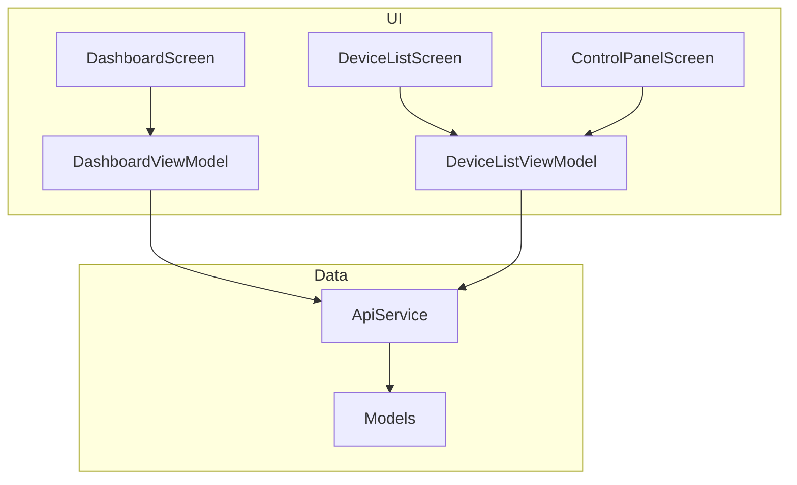
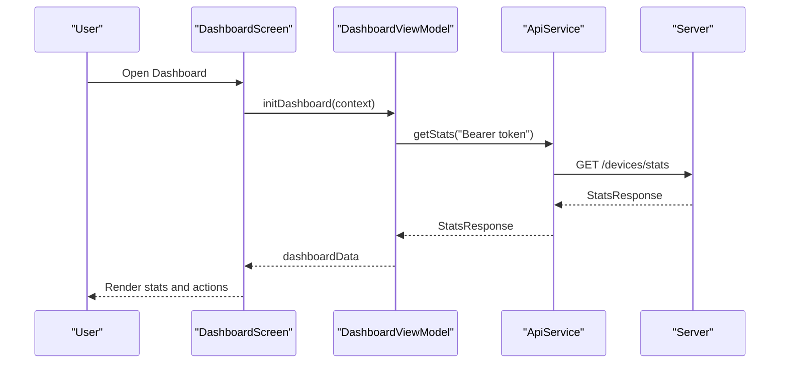
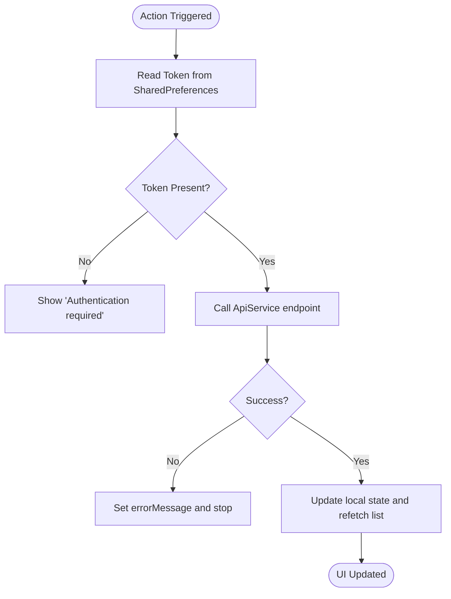
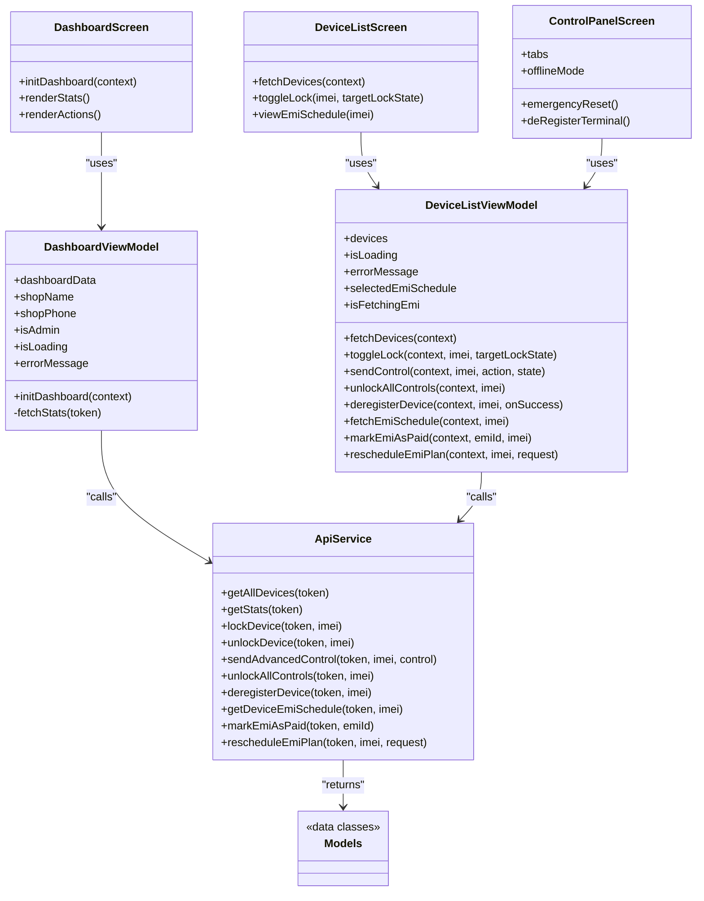
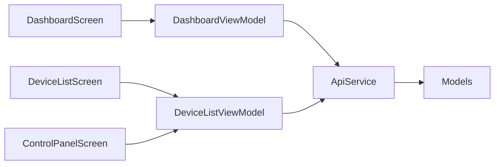

# Administrative Dashboard & Management

<cite>
**Referenced Files in This Document**
- [DashboardScreen.kt](file://app/src/main/java/com/pksafe/lock/manager/ui/dashboard/DashboardScreen.kt)
- [DashboardViewModel.kt](file://app/src/main/java/com/pksafe/lock/manager/ui/dashboard/DashboardViewModel.kt)
- [DeviceListScreen.kt](file://app/src/main/java/com/pksafe/lock/manager/ui/devices/DeviceListScreen.kt)
- [DeviceListViewModel.kt](file://app/src/main/java/com/pksafe/lock/manager/ui/devices/DeviceListViewModel.kt)
- [ControlPanelScreen.kt](file://app/src/main/java/com/pksafe/lock/manager/ui/devices/ControlPanelScreen.kt)
- [ApiService.kt](file://app/src/main/java/com/pksafe/lock/manager/data/ApiService.kt)
- [Models.kt](file://app/src/main/java/com/pksafe/lock/manager/data/Models.kt)
</cite>

## Table of Contents
1. Introduction
2. Project Structure
3. Core Components
4. Architecture Overview
5. Detailed Component Analysis
6. Dependency Analysis
7. Performance Considerations
8. Troubleshooting Guide
9. Conclusion

## Introduction
This document explains the PK Locker administrative dashboard focused on device inventory management and bulk operations for shopkeepers. It covers:
- The dashboard interface that provides a status overview, filtering, and quick actions
- The device list system showing connected devices, current status, and last activity timestamps
- The control panel enabling remote locking/unlocking and hardware restriction management per device or across fleets
- Practical workflows for managing multiple customer devices, fleet-level operations, and reporting features
- Responsive design considerations and accessibility features across device types

## Project Structure
The administrative UI is implemented with Jetpack Compose and organized into feature-based packages:
- Dashboard: high-level stats and quick actions for shopkeepers
- Devices: device list, search/filter, EMI schedule, and per-device control panel
- Data: Retrofit API service and data models used by UI components

**Diagram sources**
- [DashboardScreen.kt:35-428](file://app/src/main/java/com/pksafe/lock/manager/ui/dashboard/DashboardScreen.kt#L35-L428)
- [DashboardViewModel.kt:16-65](file://app/src/main/java/com/pksafe/lock/manager/ui/dashboard/DashboardViewModel.kt#L16-L65)
- [DeviceListScreen.kt:38-190](file://app/src/main/java/com/pksafe/lock/manager/ui/devices/DeviceListScreen.kt#L38-L190)
- [DeviceListViewModel.kt:18-246](file://app/src/main/java/com/pksafe/lock/manager/ui/devices/DeviceListViewModel.kt#L18-L246)
- [ControlPanelScreen.kt:54-229](file://app/src/main/java/com/pksafe/lock/manager/ui/devices/ControlPanelScreen.kt#L54-L229)
- [ApiService.kt:11-185](file://app/src/main/java/com/pksafe/lock/manager/data/ApiService.kt#L11-L185)
- [Models.kt:22-175](file://app/src/main/java/com/pksafe/lock/manager/data/Models.kt#L22-L175)

**Section sources**
- [DashboardScreen.kt:35-428](file://app/src/main/java/com/pksafe/lock/manager/ui/dashboard/DashboardScreen.kt#L35-L428)
- [DeviceListScreen.kt:38-190](file://app/src/main/java/com/pksafe/lock/manager/ui/devices/DeviceListScreen.kt#L38-L190)
- [ControlPanelScreen.kt:54-229](file://app/src/main/java/com/pksafe/lock/manager/ui/devices/ControlPanelScreen.kt#L54-L229)
- [ApiService.kt:11-185](file://app/src/main/java/com/pksafe/lock/manager/data/ApiService.kt#L11-L185)
- [Models.kt:22-175](file://app/src/main/java/com/pksafe/lock/manager/data/Models.kt#L22-L175)

## Core Components
- DashboardScreen: Presents shop info, premium banner, platform key stats, and quick action tiles (e.g., Wireless ADB setup, Cable activation, QR/NFC setup, Buy Keys). It initializes dashboard data via DashboardViewModel.
- DeviceListScreen: Lists all devices with search/filter, shows status badges, and exposes quick lock/unlock actions plus EMI schedule access.
- ControlPanelScreen: Provides per-device controls including security toggles, app restrictions, utilities, EMI reminders, offline SMS commands, hardware info, tracker, profile, and ledger tabs. Includes emergency reset and deregistration flows.
- ViewModels: Handle authentication token retrieval from SharedPreferences, network calls to ApiService, state updates, and error handling.

**Section sources**
- [DashboardScreen.kt:35-428](file://app/src/main/java/com/pksafe/lock/manager/ui/dashboard/DashboardScreen.kt#L35-L428)
- [DeviceListScreen.kt:38-190](file://app/src/main/java/com/pksafe/lock/manager/ui/devices/DeviceListScreen.kt#L38-L190)
- [ControlPanelScreen.kt:54-229](file://app/src/main/java/com/pksafe/lock/manager/ui/devices/ControlPanelScreen.kt#L54-L229)
- [DashboardViewModel.kt:16-65](file://app/src/main/java/com/pksafe/lock/manager/ui/dashboard/DashboardViewModel.kt#L16-L65)
- [DeviceListViewModel.kt:18-246](file://app/src/main/java/com/pksafe/lock/manager/ui/devices/DeviceListViewModel.kt#L18-L246)

## Architecture Overview
The UI layer uses Compose screens bound to ViewModels. ViewModels use Retrofit to call backend endpoints defined in ApiService and map responses to Models. Authentication tokens are read from SharedPreferences before each request.

**Diagram sources**
- [DashboardScreen.kt:43-48](file://app/src/main/java/com/pksafe/lock/manager/ui/dashboard/DashboardScreen.kt#L43-L48)
- [DashboardViewModel.kt:32-65](file://app/src/main/java/com/pksafe/lock/manager/ui/dashboard/DashboardViewModel.kt#L32-L65)
- [ApiService.kt:36-44](file://app/src/main/java/com/pksafe/lock/manager/data/ApiService.kt#L36-L44)
- [Models.kt:22-43](file://app/src/main/java/com/pksafe/lock/manager/data/Models.kt#L22-L43)

## Detailed Component Analysis

### Dashboard Interface
- Shop header displays shop name, phone, and admin badge.
- Premium banner highlights protection features (SIM/network status, auto-lock).
- Platform key stats show available/used/total keys for Android and iOS.
- Quick action grid includes upcoming EMIs, active customers, QR code scanning, NFC setup, buying keys, and video help.
- Support card provides contact information.

Operational notes:
- Initializes dashboard data on load using token from SharedPreferences.
- Refresh button triggers re-fetching stats.
- Share APK functionality allows sharing the base APK for distribution.

**Section sources**
- [DashboardScreen.kt:56-428](file://app/src/main/java/com/pksafe/lock/manager/ui/dashboard/DashboardScreen.kt#L56-L428)
- [DashboardViewModel.kt:32-65](file://app/src/main/java/com/pksafe/lock/manager/ui/dashboard/DashboardViewModel.kt#L32-L65)

### Device List Management
- Displays a scrollable list of devices with search by name or IMEI.
- Each device card shows:
  - Customer name and truncated IMEI
  - Status badge (Locked/Active)
  - Phone number, installment amount, registration date, tenure
  - Actions: Panel (open control panel), EMIs (schedule view), quick lock/unlock
- Empty state offers refresh; loading states show progress indicators.

Operational notes:
- Fetches devices on startup and supports manual refresh.
- Lock/unlock triggers confirmation dialog then calls toggleLock.
- EMI bottom sheet loads schedule and supports marking payments and rescheduling plans.

**Section sources**
- [DeviceListScreen.kt:38-190](file://app/src/main/java/com/pksafe/lock/manager/ui/devices/DeviceListScreen.kt#L38-L190)
- [DeviceListScreen.kt:192-370](file://app/src/main/java/com/pksafe/lock/manager/ui/devices/DeviceListScreen.kt#L192-L370)
- [DeviceListScreen.kt:372-638](file://app/src/main/java/com/pksafe/lock/manager/ui/devices/DeviceListScreen.kt#L372-L638)
- [DeviceListViewModel.kt:33-141](file://app/src/main/java/com/pksafe/lock/manager/ui/devices/DeviceListViewModel.kt#L33-L141)

### Control Panel Functionality
- Tabs: Secure Control, Hardware Tech, Live Tracker, Customer Profile, EMI Ledger.
- Secure Control:
  - Online mode sends advanced controls via API; Offline mode opens SMS composer with lock/unlock codes.
  - Security System toggles: Auto-Lock, SIM change lock, USB terminal block, camera block, install/settings/debugging blocks, soft reset/boot blocks, outgoing calls block, warning audio/wallpaper.
  - App Restrictions: Instagram, WhatsApp, YouTube blocks.
  - Terminal Utilities: Request location, trigger warning audio/wallpaper.
  - EMI Reminder Protocol: WhatsApp message, SMS + push notification, warning siren.
  - Emergency Reset: Clear all restrictions at once.
  - De-register: Permanent release requiring typed confirmation.
- Bottom bar: Secure Lock and Release buttons with confirmation dialog.

Operational notes:
- Uses sendAdvancedControl for granular toggles and unlockAllControls for emergency reset.
- ToggleLock enforces confirmation dialog before execution.
- Offline SMS tab constructs messages with lock/unlock codes and handles fallbacks if no SMS app exists.

**Section sources**
- [ControlPanelScreen.kt:54-229](file://app/src/main/java/com/pksafe/lock/manager/ui/devices/ControlPanelScreen.kt#L54-L229)
- [ControlPanelScreen.kt:250-494](file://app/src/main/java/com/pksafe/lock/manager/ui/devices/ControlPanelScreen.kt#L250-L494)
- [ControlPanelScreen.kt:571-648](file://app/src/main/java/com/pksafe/lock/manager/ui/devices/ControlPanelScreen.kt#L571-L648)
- [DeviceListViewModel.kt:143-246](file://app/src/main/java/com/pksafe/lock/manager/ui/devices/DeviceListViewModel.kt#L143-L246)

### Data Flows and Processing Logic
- Authentication: Token retrieved from SharedPreferences and passed as Authorization header.
- Device listing: getAllDevices returns list of DeviceResponse; UI filters locally by search query.
- Lock/Unlock: toggleLock calls lockDevice or unlockDevice; success triggers refetch to update UI.
- Advanced controls: sendAdvancedControl accepts action/state pairs; success triggers refetch.
- EMI schedule: fetchEmiSchedule retrieves schedule; markEmiAsPaid and rescheduleEmiPlan update schedule and device list.

**Diagram sources**
- [DeviceListViewModel.kt:33-64](file://app/src/main/java/com/pksafe/lock/manager/ui/devices/DeviceListViewModel.kt#L33-L64)
- [DeviceListViewModel.kt:143-171](file://app/src/main/java/com/pksafe/lock/manager/ui/devices/DeviceListViewModel.kt#L143-L171)
- [DeviceListViewModel.kt:173-195](file://app/src/main/java/com/pksafe/lock/manager/ui/devices/DeviceListViewModel.kt#L173-L195)
- [ApiService.kt:26-99](file://app/src/main/java/com/pksafe/lock/manager/data/ApiService.kt#L26-L99)

### Class Relationships

**Diagram sources**
- [DashboardScreen.kt:35-428](file://app/src/main/java/com/pksafe/lock/manager/ui/dashboard/DashboardScreen.kt#L35-L428)
- [DashboardViewModel.kt:16-65](file://app/src/main/java/com/pksafe/lock/manager/ui/dashboard/DashboardViewModel.kt#L16-L65)
- [DeviceListScreen.kt:38-190](file://app/src/main/java/com/pksafe/lock/manager/ui/devices/DeviceListScreen.kt#L38-L190)
- [DeviceListViewModel.kt:18-246](file://app/src/main/java/com/pksafe/lock/manager/ui/devices/DeviceListViewModel.kt#L18-L246)
- [ControlPanelScreen.kt:54-229](file://app/src/main/java/com/pksafe/lock/manager/ui/devices/ControlPanelScreen.kt#L54-L229)
- [ApiService.kt:11-185](file://app/src/main/java/com/pksafe/lock/manager/data/ApiService.kt#L11-L185)
- [Models.kt:22-175](file://app/src/main/java/com/pksafe/lock/manager/data/Models.kt#L22-L175)

## Dependency Analysis
- UI components depend on ViewModels for state and business logic.
- ViewModels depend on ApiService for network operations and Models for data mapping.
- Authentication dependency: All requests require a valid token from SharedPreferences; missing token results in early exit with error message.
- Coupling:
  - DeviceListScreen and ControlPanelScreen both rely on DeviceListViewModel for device state and actions.
  - DashboardScreen relies on DashboardViewModel for stats and shop metadata.
- External integrations:
  - Retrofit for HTTP calls
  - Android intents for sharing APK and sending SMS
  - WebView integration in ControlPanelScreen for live tracker (map rendering)

**Diagram sources**
- [DashboardScreen.kt:35-428](file://app/src/main/java/com/pksafe/lock/manager/ui/dashboard/DashboardScreen.kt#L35-L428)
- [DeviceListScreen.kt:38-190](file://app/src/main/java/com/pksafe/lock/manager/ui/devices/DeviceListScreen.kt#L38-L190)
- [ControlPanelScreen.kt:54-229](file://app/src/main/java/com/pksafe/lock/manager/ui/devices/ControlPanelScreen.kt#L54-L229)
- [ApiService.kt:11-185](file://app/src/main/java/com/pksafe/lock/manager/data/ApiService.kt#L11-L185)
- [Models.kt:22-175](file://app/src/main/java/com/pksafe/lock/manager/data/Models.kt#L22-L175)

**Section sources**
- [ApiService.kt:11-185](file://app/src/main/java/com/pksafe/lock/manager/data/ApiService.kt#L11-L185)
- [Models.kt:22-175](file://app/src/main/java/com/pksafe/lock/manager/data/Models.kt#L22-L175)

## Performance Considerations
- Network efficiency:
  - Use pagination or filtering on the server side for large device lists to reduce payload size.
  - Debounce search input to avoid excessive recompositions and unnecessary filtering.
- UI responsiveness:
  - LazyColumn efficiently renders long device lists.
  - Avoid heavy computations in composition; keep filtering in ViewModel or use derivedStateOf where appropriate.
- State synchronization:
  - Refetch device list after critical actions (lock/unlock, advanced controls, EMI updates) to ensure consistency.
- Error resilience:
  - Provide clear error messages and retry mechanisms for failed network calls.
  - Time-bound processing indicators to prevent indefinite loading states.

[No sources needed since this section provides general guidance]

## Troubleshooting Guide
Common issues and resolutions:
- Authentication required:
  - Ensure auth_token exists in SharedPreferences; otherwise, login flow must be completed first.
  - Check token validity and expiration; refresh if necessary.
- Connection failures:
  - Verify network connectivity and server availability.
  - Inspect error logs in ViewModels for detailed failure reasons.
- Device not updating:
  - After lock/unlock or control changes, confirm refetch is triggered to update UI state.
- Offline SMS issues:
  - Confirm customer phone number presence; handle cases where no SMS app is installed by providing fallback intent.
- EMI schedule errors:
  - If fetching fails, display user-friendly error and allow retry.

**Section sources**
- [DeviceListViewModel.kt:33-64](file://app/src/main/java/com/pksafe/lock/manager/ui/devices/DeviceListViewModel.kt#L33-L64)
- [DeviceListViewModel.kt:143-171](file://app/src/main/java/com/pksafe/lock/manager/ui/devices/DeviceListViewModel.kt#L143-L171)
- [ControlPanelScreen.kt:571-648](file://app/src/main/java/com/pksafe/lock/manager/ui/devices/ControlPanelScreen.kt#L571-L648)

## Conclusion
The PK Locker administrative dashboard provides a comprehensive toolkit for shopkeepers to manage device inventories and perform bulk operations efficiently. With a modern Compose UI, robust ViewModels, and a well-defined API surface, it supports real-time device status monitoring, filtering, and control panel functionalities for remote locking/unlocking and hardware restriction management. Practical workflows enable fleet management, EMI tracking, and reporting insights, while responsive design and accessibility considerations ensure usability across various devices.

[No sources needed since this section summarizes without analyzing specific files]