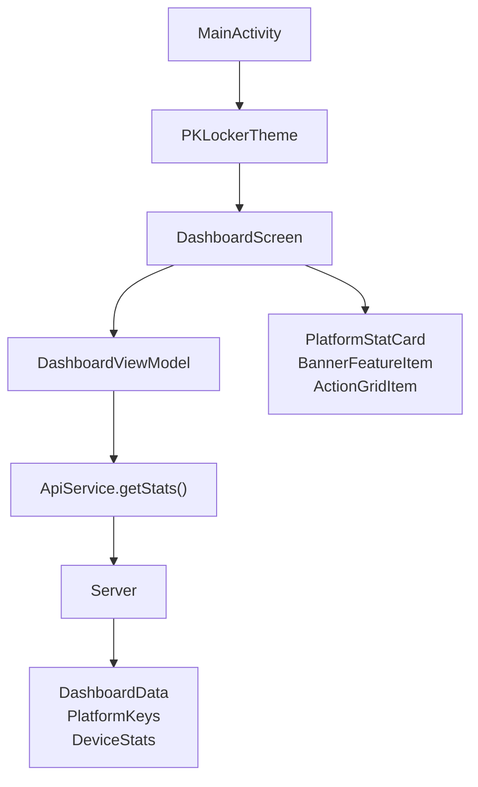
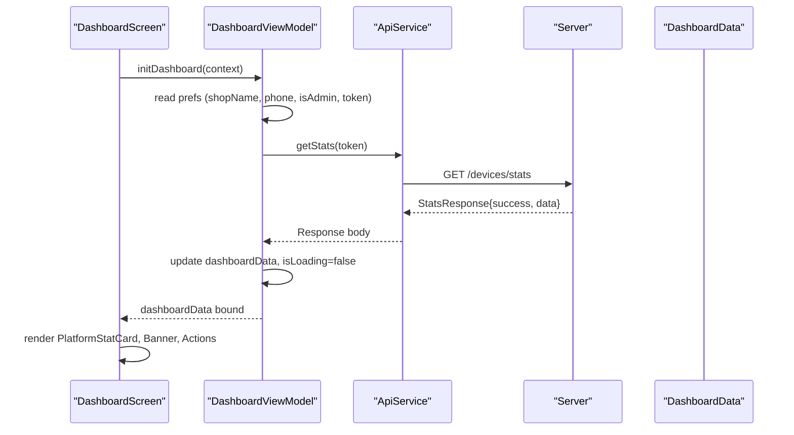
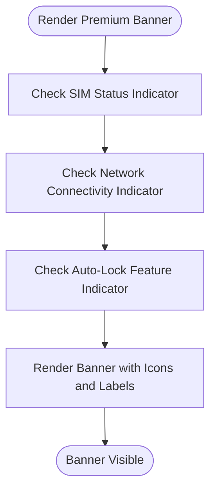
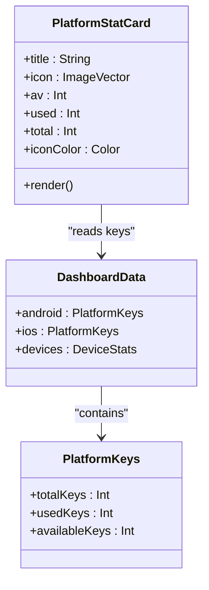
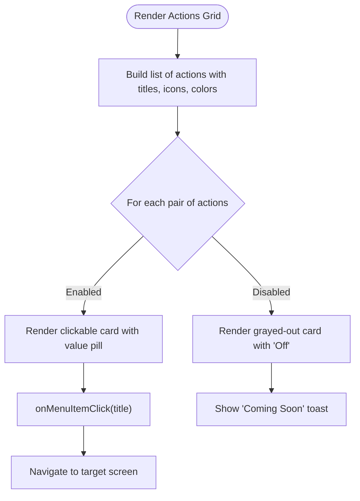
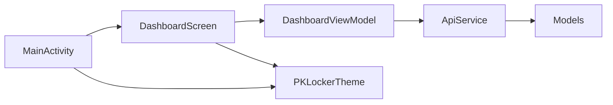

# Dashboard Overview & Statistics

<cite>
**Referenced Files in This Document**
- [DashboardScreen.kt](file://app/src/main/java/com/pksafe/lock/manager/ui/dashboard/DashboardScreen.kt)
- [DashboardViewModel.kt](file://app/src/main/java/com/pksafe/lock/manager/ui/dashboard/DashboardViewModel.kt)
- [ApiService.kt](file://app/src/main/java/com/pksafe/lock/manager/data/ApiService.kt)
- [Models.kt](file://app/src/main/java/com/pksafe/lock/manager/data/Models.kt)
- [Theme.kt](file://app/src/main/java/com/pksafe/lock/manager/ui/theme/Theme.kt)
- [Color.kt](file://app/src/main/java/com/pksafe/lock/manager/ui/theme/Color.kt)
- [MainActivity.kt](file://app/src/main/java/com/pksafe/lock/manager/MainActivity.kt)
</cite>

## Table of Contents
1. [Introduction](#introduction)
2. [Project Structure](#project-structure)
3. [Core Components](#core-components)
4. [Architecture Overview](#architecture-overview)
5. [Detailed Component Analysis](#detailed-component-analysis)
6. [Dependency Analysis](#dependency-analysis)
7. [Performance Considerations](#performance-considerations)
8. [Troubleshooting Guide](#troubleshooting-guide)
9. [Conclusion](#conclusion)
10. [Appendices](#appendices)

## Introduction
This document explains the PK Locker shopkeeper dashboard overview interface focused on analytics and system statistics. It covers the main dashboard screen that displays key metrics such as device counts, platform distribution (Android/iOS), available license keys, and active customer status. It also details the premium banner system showing EMI protection status with visual indicators for SIM status, network connectivity, and auto-lock features. The document includes practical examples for shopkeepers to interpret dashboard data, monitor fleet health, and track performance, along with notes on responsive design and accessibility considerations implemented in the UI.

## Project Structure
The dashboard is implemented using Jetpack Compose with a clear separation between UI and state management:
- UI layer: DashboardScreen composable defines the layout, cards, banners, and actions.
- State layer: DashboardViewModel manages loading states, authentication, and fetches stats from the server.
- Data layer: ApiService defines endpoints; Models define response structures including dashboard stats and device information.
- Theme: PKLockerTheme provides light/dark color schemes and typography.
- Entry point: MainActivity integrates the theme and routes to screens, including the dashboard.

**Diagram sources**
- [MainActivity.kt:84-88](file://app/src/main/java/com/pksafe/lock/manager/MainActivity.kt#L84-L88)
- [DashboardScreen.kt:35-46](file://app/src/main/java/com/pksafe/lock/manager/ui/dashboard/DashboardScreen.kt#L35-L46)
- [DashboardViewModel.kt:16-30](file://app/src/main/java/com/pksafe/lock/manager/ui/dashboard/DashboardViewModel.kt#L16-L30)
- [ApiService.kt:36-44](file://app/src/main/java/com/pksafe/lock/manager/data/ApiService.kt#L36-L44)
- [Models.kt:23-43](file://app/src/main/java/com/pksafe/lock/manager/data/Models.kt#L23-L43)

**Section sources**
- [DashboardScreen.kt:35-46](file://app/src/main/java/com/pksafe/lock/manager/ui/dashboard/DashboardScreen.kt#L35-L46)
- [DashboardViewModel.kt:16-30](file://app/src/main/java/com/pksafe/lock/manager/ui/dashboard/DashboardViewModel.kt#L16-L30)
- [ApiService.kt:36-44](file://app/src/main/java/com/pksafe/lock/manager/data/ApiService.kt#L36-L44)
- [Models.kt:23-43](file://app/src/main/java/com/pksafe/lock/manager/data/Models.kt#L23-L43)
- [Theme.kt:21-33](file://app/src/main/java/com/pksafe/lock/manager/ui/theme/Theme.kt#L21-L33)
- [MainActivity.kt:84-88](file://app/src/main/java/com/pksafe/lock/manager/MainActivity.kt#L84-L88)

## Core Components
- DashboardScreen: Renders the top header (shop name, phone, admin badge), premium banner, system stats, master tools, manage customers grid, and support card. It initializes data via ViewModel and shows a progress indicator while loading.
- DashboardViewModel: Reads persisted shop info and token, calls API to fetch stats, updates state for UI binding, and handles errors.
- ApiService: Defines endpoints for getting stats and dashboard analytics used by the dashboard.
- Models: Define DashboardData, PlatformKeys, DeviceStats, and related analytics structures consumed by the UI.
- Theme: Provides Material 3 color schemes and typography for consistent look across devices.

Key responsibilities:
- Display real-time metrics for Android and iOS platforms (available, used, total keys).
- Show device inventory summary (total, locked, deregistered).
- Present premium banner with EMI protection status and feature indicators (SIM, network, auto-lock).
- Provide quick actions for provisioning and key management.

**Section sources**
- [DashboardScreen.kt:35-46](file://app/src/main/java/com/pksafe/lock/manager/ui/dashboard/DashboardScreen.kt#L35-L46)
- [DashboardScreen.kt:172-228](file://app/src/main/java/com/pksafe/lock/manager/ui/dashboard/DashboardScreen.kt#L172-L228)
- [DashboardScreen.kt:243-266](file://app/src/main/java/com/pksafe/lock/manager/ui/dashboard/DashboardScreen.kt#L243-L266)
- [DashboardViewModel.kt:32-64](file://app/src/main/java/com/pksafe/lock/manager/ui/dashboard/DashboardViewModel.kt#L32-L64)
- [ApiService.kt:36-44](file://app/src/main/java/com/pksafe/lock/manager/data/ApiService.kt#L36-L44)
- [Models.kt:23-43](file://app/src/main/java/com/pksafe/lock/manager/data/Models.kt#L23-L43)

## Architecture Overview
The dashboard follows a unidirectional data flow:
- UI triggers initialization which reads local preferences and calls the ViewModel.
- ViewModel performs an authenticated request to get stats.
- Server returns structured data mapped to DashboardData.
- UI binds to ViewModel state to render cards and banners.

**Diagram sources**
- [DashboardScreen.kt:43-46](file://app/src/main/java/com/pksafe/lock/manager/ui/dashboard/DashboardScreen.kt#L43-L46)
- [DashboardViewModel.kt:32-64](file://app/src/main/java/com/pksafe/lock/manager/ui/dashboard/DashboardViewModel.kt#L32-L64)
- [ApiService.kt:36-44](file://app/src/main/java/com/pksafe/lock/manager/data/ApiService.kt#L36-L44)
- [Models.kt:23-43](file://app/src/main/java/com/pksafe/lock/manager/data/Models.kt#L23-L43)

## Detailed Component Analysis

### Premium Banner System (EMI Protection Status)
The premium banner communicates EMI protection status and highlights three operational indicators:
- SIM status: Visualized with a SIM-related icon and label indicating current SIM condition.
- Network connectivity: Visualized with a network-related icon and label indicating connectivity status.
- Auto-lock: Visualized with a lock-clock icon and label indicating whether auto-lock is enabled.

These indicators are rendered via a helper component that pairs icons with labels and uses distinct tints for clarity.

**Diagram sources**
- [DashboardScreen.kt:172-228](file://app/src/main/java/com/pksafe/lock/manager/ui/dashboard/DashboardScreen.kt#L172-L228)
- [DashboardScreen.kt:435-448](file://app/src/main/java/com/pksafe/lock/manager/ui/dashboard/DashboardScreen.kt#L435-L448)

**Section sources**
- [DashboardScreen.kt:172-228](file://app/src/main/java/com/pksafe/lock/manager/ui/dashboard/DashboardScreen.kt#L172-L228)
- [DashboardScreen.kt:435-448](file://app/src/main/java/com/pksafe/lock/manager/ui/dashboard/DashboardScreen.kt#L435-L448)

### Statistics Cards (Platform Distribution and Key Usage)
Two primary stat cards display platform-specific key usage:
- Android card: Shows available, used, and total keys for Android.
- iOS card: Shows available, used, and total keys for iOS.

Each card includes a title, platform icon, and rows for Available, Used, and Total values. These values are sourced from DashboardData’s PlatformKeys fields.

**Diagram sources**
- [DashboardScreen.kt:450-468](file://app/src/main/java/com/pksafe/lock/manager/ui/dashboard/DashboardScreen.kt#L450-L468)
- [Models.kt:23-31](file://app/src/main/java/com/pksafe/lock/manager/data/Models.kt#L23-L31)

**Section sources**
- [DashboardScreen.kt:243-266](file://app/src/main/java/com/pksafe/lock/manager/ui/dashboard/DashboardScreen.kt#L243-L266)
- [DashboardScreen.kt:450-468](file://app/src/main/java/com/pksafe/lock/manager/ui/dashboard/DashboardScreen.kt#L450-L468)
- [Models.kt:23-31](file://app/src/main/java/com/pksafe/lock/manager/data/Models.kt#L23-L31)

### Manage Customers Grid and Quick Actions
The dashboard includes a grid of actionable items for shopkeepers:
- Upcoming EMIs: Displays count based on device totals.
- Active Customers: Displays count based on device totals.
- QR Code: Navigates to QR setup when enabled.
- NFC Setup: Navigates to NFC setup when enabled.
- Buy Keys: Shows available keys count for Android.
- Video Help: Placeholder action.
- Key Requests: Admin-focused entry.

Actions are rendered via ActionGridItem with enabled/disabled states and value pills.

**Diagram sources**
- [DashboardScreen.kt:369-391](file://app/src/main/java/com/pksafe/lock/manager/ui/dashboard/DashboardScreen.kt#L369-L391)
- [DashboardScreen.kt:485-528](file://app/src/main/java/com/pksafe/lock/manager/ui/dashboard/DashboardScreen.kt#L485-L528)

**Section sources**
- [DashboardScreen.kt:369-391](file://app/src/main/java/com/pksafe/lock/manager/ui/dashboard/DashboardScreen.kt#L369-L391)
- [DashboardScreen.kt:485-528](file://app/src/main/java/com/pksafe/lock/manager/ui/dashboard/DashboardScreen.kt#L485-L528)

### Shopkeeper Master Tools (Provisioning)
Two prominent cards provide fast paths for device activation:
- Wireless ADB Setup: No cable required; guided steps via Wi-Fi code.
- Instant Cable Activation: Connect via cable for immediate provisioning.

Both cards trigger navigation through onMenuItemClick callbacks to respective provisioning flows.

**Section sources**
- [DashboardScreen.kt:277-358](file://app/src/main/java/com/pksafe/lock/manager/ui/dashboard/DashboardScreen.kt#L277-L358)

### Header and Profile Area
The header displays:
- App logo/avatar.
- Shop name and optional verified admin badge.
- Shop phone number or default text.
- Share APK button and refresh button.

Accessibility attributes are present for icons and images to support screen readers.

**Section sources**
- [DashboardScreen.kt:56-168](file://app/src/main/java/com/pksafe/lock/manager/ui/dashboard/DashboardScreen.kt#L56-L168)

## Dependency Analysis
The dashboard depends on:
- ViewModel for state and API calls.
- ApiService for network operations.
- Models for data mapping.
- Theme for consistent styling.
- MainActivity for app entry and routing.

**Diagram sources**
- [DashboardScreen.kt:35-46](file://app/src/main/java/com/pksafe/lock/manager/ui/dashboard/DashboardScreen.kt#L35-L46)
- [DashboardViewModel.kt:16-30](file://app/src/main/java/com/pksafe/lock/manager/ui/dashboard/DashboardViewModel.kt#L16-L30)
- [ApiService.kt:36-44](file://app/src/main/java/com/pksafe/lock/manager/data/ApiService.kt#L36-L44)
- [Models.kt:23-43](file://app/src/main/java/com/pksafe/lock/manager/data/Models.kt#L23-L43)
- [Theme.kt:21-33](file://app/src/main/java/com/pksafe/lock/manager/ui/theme/Theme.kt#L21-L33)
- [MainActivity.kt:84-88](file://app/src/main/java/com/pksafe/lock/manager/MainActivity.kt#L84-L88)

**Section sources**
- [DashboardScreen.kt:35-46](file://app/src/main/java/com/pksafe/lock/manager/ui/dashboard/DashboardScreen.kt#L35-L46)
- [DashboardViewModel.kt:16-30](file://app/src/main/java/com/pksafe/lock/manager/ui/dashboard/DashboardViewModel.kt#L16-L30)
- [ApiService.kt:36-44](file://app/src/main/java/com/pksafe/lock/manager/data/ApiService.kt#L36-L44)
- [Models.kt:23-43](file://app/src/main/java/com/pksafe/lock/manager/data/Models.kt#L23-L43)
- [Theme.kt:21-33](file://app/src/main/java/com/pksafe/lock/manager/ui/theme/Theme.kt#L21-L33)
- [MainActivity.kt:84-88](file://app/src/main/java/com/pksafe/lock/manager/MainActivity.kt#L84-L88)

## Performance Considerations
- Lazy rendering: The dashboard uses Compose Column with vertical scrolling; ensure lists remain efficient if expanded.
- Network calls: Stats are fetched once on init; consider caching strategies for offline scenarios.
- Loading state: LinearProgressIndicator indicates async work; avoid redundant refreshes.
- Memory: Avoid heavy image loads in headers; use optimized drawables.

[No sources needed since this section provides general guidance]

## Troubleshooting Guide
Common issues and resolutions:
- Authentication required: If no token is found, the ViewModel sets an error message. Ensure login completes successfully before opening the dashboard.
- Connection failed: Network errors set a connection failure message; verify internet connectivity and server availability.
- Empty stats: If server returns success but empty data, UI will show zeros; confirm backend population of dashboard analytics.

Operational tips:
- Use the refresh button to re-fetch stats.
- Check logs for detailed error messages from the ViewModel.

**Section sources**
- [DashboardViewModel.kt:32-64](file://app/src/main/java/com/pksafe/lock/manager/ui/dashboard/DashboardViewModel.kt#L32-L64)

## Conclusion
The PK Locker dashboard provides shopkeepers with a comprehensive view of device inventory, platform distribution, and key usage, alongside actionable tools for provisioning and management. The premium banner offers clear visibility into EMI protection status and critical device features. With accessible UI elements and a responsive layout, shopkeepers can efficiently monitor fleet health and make informed business decisions.

[No sources needed since this section summarizes without analyzing specific files]

## Appendices

### Practical Examples for Shopkeepers
- Interpreting platform distribution: Compare Android vs iOS available/used keys to plan purchases and deployments.
- Monitoring fleet health: Track total devices and locked/deregistered counts to identify at-risk devices.
- Managing EMI protection: Use banner indicators to ensure SIM and network readiness and auto-lock settings are correct.
- Optimizing provisioning: Choose wireless or cable activation based on environment constraints.

[No sources needed since this section provides general guidance]