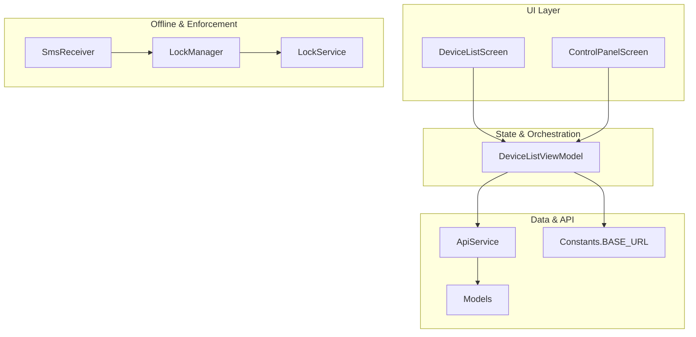
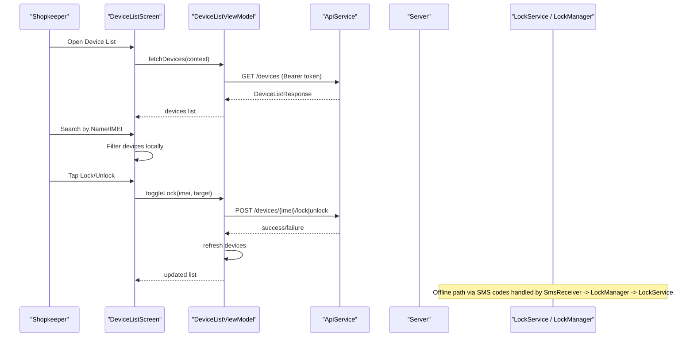
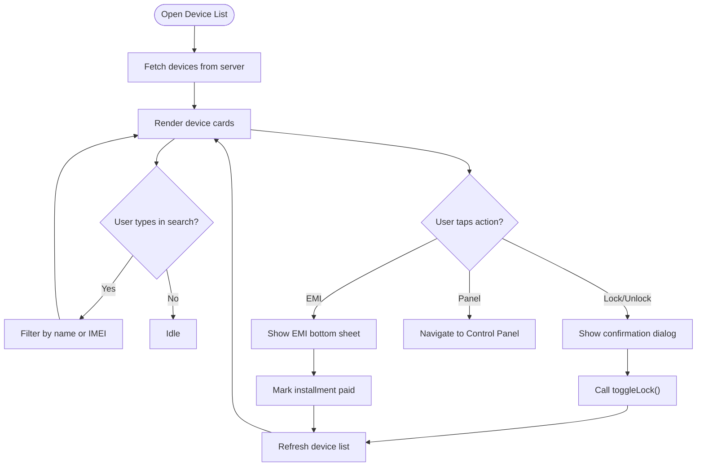
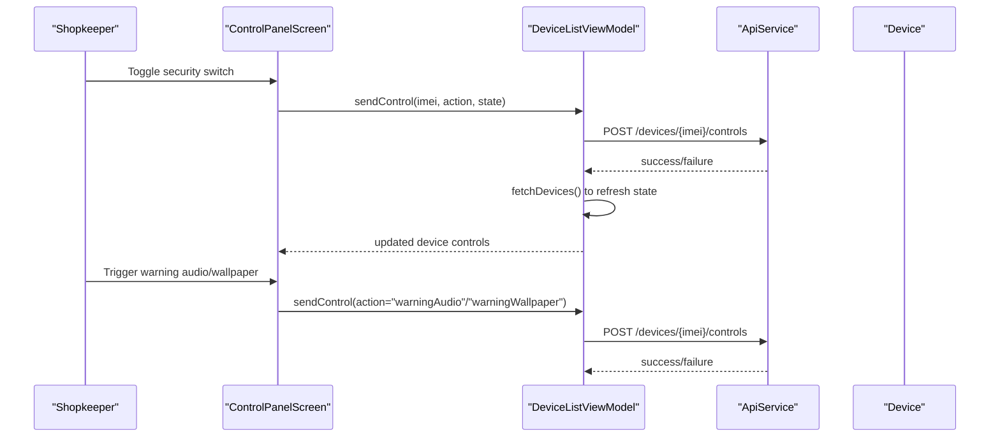
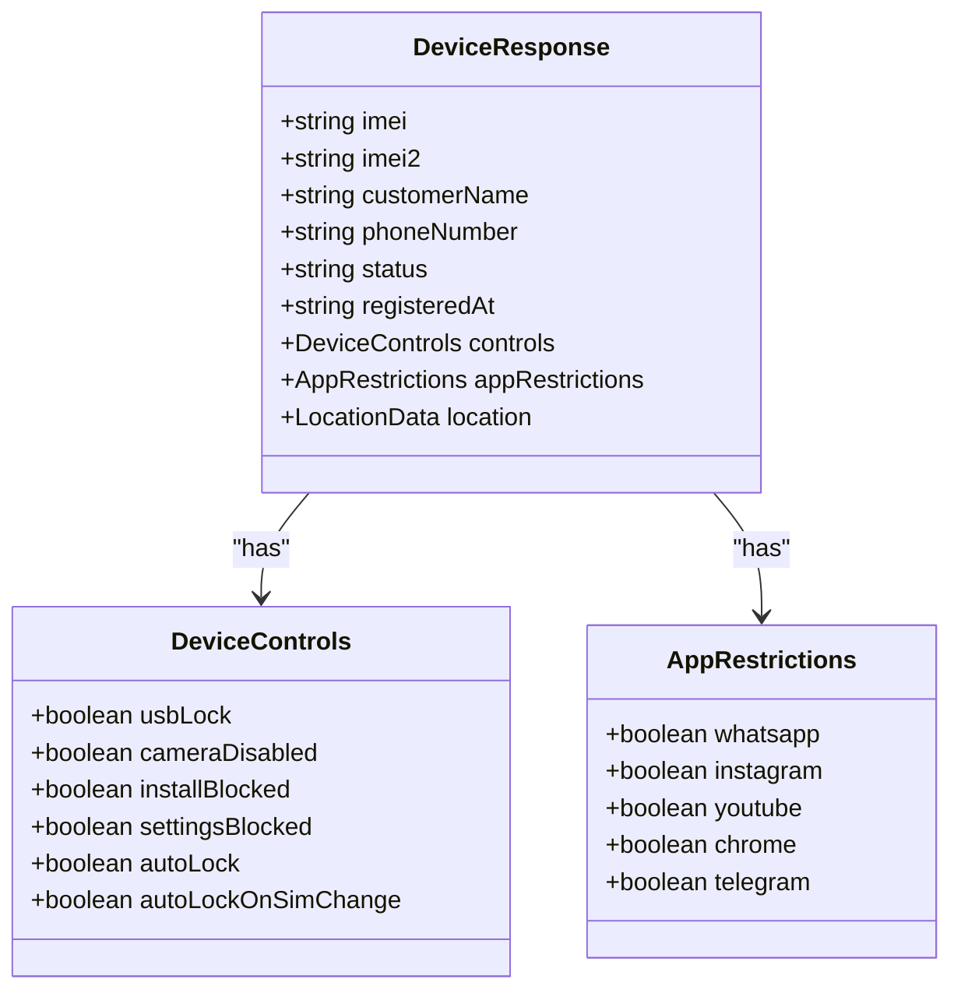
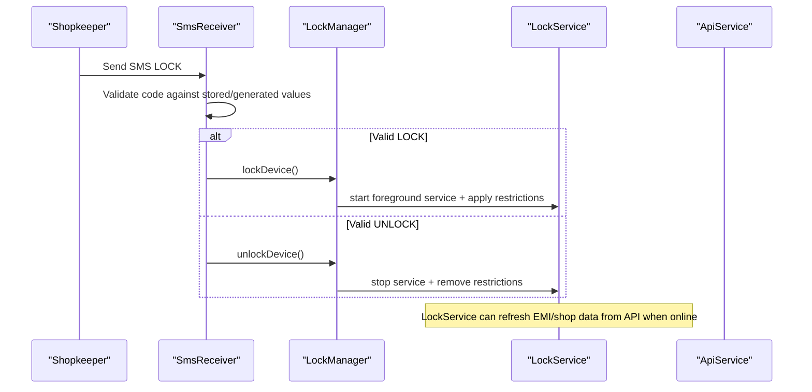
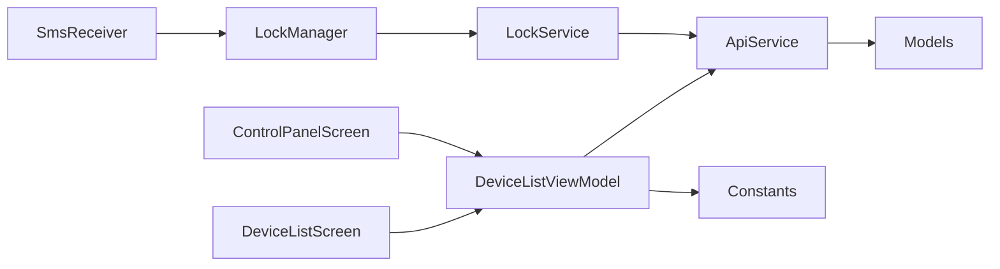

# Device Inventory Management

<cite>
**Referenced Files in This Document**
- [DeviceListScreen.kt](file://app/src/main/java/com/pksafe/lock/manager/ui/devices/DeviceListScreen.kt)
- [DeviceListViewModel.kt](file://app/src/main/java/com/pksafe/lock/manager/ui/devices/DeviceListViewModel.kt)
- [ControlPanelScreen.kt](file://app/src/main/java/com/pksafe/lock/manager/ui/devices/ControlPanelScreen.kt)
- [ApiService.kt](file://app/src/main/java/com/pksafe/lock/manager/data/ApiService.kt)
- [Models.kt](file://app/src/main/java/com/pksafe/lock/manager/data/Models.kt)
- [LockService.kt](file://app/src/main/java/com/pksafe/lock/manager/service/LockService.kt)
- [SmsReceiver.kt](file://app/src/main/java/com/pksafe/lock/manager/receiver/SmsReceiver.kt)
- [LockManager.kt](file://app/src/main/java/com/pksafe/lock/manager/util/LockManager.kt)
- [Constants.kt](file://app/src/main/java/com/pksafe/lock/manager/util/Constants.kt)
</cite>

## Table of Contents
1. Introduction
2. Project Structure
3. Core Components
4. Architecture Overview
5. Detailed Component Analysis
6. Dependency Analysis
7. Performance Considerations
8. Troubleshooting Guide
9. Conclusion

## Introduction
This document explains the PK Locker device inventory management system with a focus on comprehensive device tracking and control capabilities for shopkeepers managing large fleets of customer devices. It covers:
- The device list interface that displays all connected customer devices, their status, registration date, IMEI numbers, and connection-related states.
- Filtering and search functionality to quickly locate devices by name or IMEI.
- Bulk operations such as mass locking/unlocking and configuration updates across multiple devices.
- Practical workflows for fleet management, health monitoring, and administrative tasks.
- Real-time synchronization features and offline capabilities that maintain functionality during connectivity issues.

## Project Structure
The inventory and control features are implemented primarily in the UI layer (Compose screens), a ViewModel for state and API orchestration, and data models describing device information and EMI schedules. Backend integration is defined via Retrofit endpoints. Offline enforcement and SMS-based controls are handled by services and receivers.

**Diagram sources**
- [DeviceListScreen.kt:38-174](file://app/src/main/java/com/pksafe/lock/manager/ui/devices/DeviceListScreen.kt#L38-L174)
- [ControlPanelScreen.kt:54-229](file://app/src/main/java/com/pksafe/lock/manager/ui/devices/ControlPanelScreen.kt#L54-L229)
- [DeviceListViewModel.kt:18-64](file://app/src/main/java/com/pksafe/lock/manager/ui/devices/DeviceListViewModel.kt#L18-L64)
- [ApiService.kt:11-185](file://app/src/main/java/com/pksafe/lock/manager/data/ApiService.kt#L11-L185)
- [Models.kt:45-175](file://app/src/main/java/com/pksafe/lock/manager/data/Models.kt#L45-L175)
- [LockService.kt:41-123](file://app/src/main/java/com/pksafe/lock/manager/service/LockService.kt#L41-L123)
- [SmsReceiver.kt:29-143](file://app/src/main/java/com/pksafe/lock/manager/receiver/SmsReceiver.kt#L29-L143)
- [LockManager.kt:27-148](file://app/src/main/java/com/pksafe/lock/manager/util/LockManager.kt#L27-L148)
- [Constants.kt:3-10](file://app/src/main/java/com/pksafe/lock/manager/util/Constants.kt#L3-L10)

**Section sources**
- [DeviceListScreen.kt:38-174](file://app/src/main/java/com/pksafe/lock/manager/ui/devices/DeviceListScreen.kt#L38-L174)
- [DeviceListViewModel.kt:18-64](file://app/src/main/java/com/pksafe/lock/manager/ui/devices/DeviceListViewModel.kt#L18-L64)
- [ApiService.kt:11-185](file://app/src/main/java/com/pksafe/lock/manager/data/ApiService.kt#L11-L185)
- [Models.kt:45-175](file://app/src/main/java/com/pksafe/lock/manager/data/Models.kt#L45-L175)
- [LockService.kt:41-123](file://app/src/main/java/com/pksafe/lock/manager/service/LockService.kt#L41-L123)
- [SmsReceiver.kt:29-143](file://app/src/main/java/com/pksafe/lock/manager/receiver/SmsReceiver.kt#L29-L143)
- [LockManager.kt:27-148](file://app/src/main/java/com/pksafe/lock/manager/util/LockManager.kt#L27-L148)
- [Constants.kt:3-10](file://app/src/main/java/com/pksafe/lock/manager/util/Constants.kt#L3-L10)

## Core Components
- Device List Interface: Displays all customer devices with key fields including IMEI, customer name, phone number, registration date, installment details, and current lock status. Includes a modern search bar for filtering by name or IMEI.
- Control Panel: Provides per-device controls (security toggles, app restrictions, utilities), live tracker view, customer profile, and EMI ledger. Supports online mode (cloud commands) and offline mode (SMS-based commands).
- ViewModel: Orchestrates fetching device lists, EMI schedules, lock/unlock actions, advanced controls, unlocking all controls, and deregistration. Handles authentication token retrieval and error states.
- Data Layer: Retrofit API definitions for devices, EMI, keys, and admin endpoints; data models representing devices, controls, locations, and EMI schedules.
- Offline Enforcement: LockService provides persistent overlay and auto-lock behavior; SmsReceiver handles offline lock/unlock via SMS codes; LockManager applies hardware and policy restrictions.

**Section sources**
- [DeviceListScreen.kt:38-174](file://app/src/main/java/com/pksafe/lock/manager/ui/devices/DeviceListScreen.kt#L38-L174)
- [ControlPanelScreen.kt:54-229](file://app/src/main/java/com/pksafe/lock/manager/ui/devices/ControlPanelScreen.kt#L54-L229)
- [DeviceListViewModel.kt:18-246](file://app/src/main/java/com/pksafe/lock/manager/ui/devices/DeviceListViewModel.kt#L18-L246)
- [ApiService.kt:11-185](file://app/src/main/java/com/pksafe/lock/manager/data/ApiService.kt#L11-L185)
- [Models.kt:45-175](file://app/src/main/java/com/pksafe/lock/manager/data/Models.kt#L45-L175)
- [LockService.kt:41-123](file://app/src/main/java/com/pksafe/lock/manager/service/LockService.kt#L41-L123)
- [SmsReceiver.kt:29-143](file://app/src/main/java/com/pksafe/lock/manager/receiver/SmsReceiver.kt#L29-L143)
- [LockManager.kt:27-148](file://app/src/main/java/com/pksafe/lock/manager/util/LockManager.kt#L27-L148)

## Architecture Overview
The system follows a layered architecture:
- UI Compose screens render device lists and control panels.
- ViewModel manages state and calls Retrofit APIs.
- ApiService defines endpoints for device management, EMI scheduling, and admin operations.
- Models define request/response structures.
- Offline enforcement uses LockService and SmsReceiver to handle lock/unlock without internet.
- LockManager enforces device policies and hardware restrictions.

**Diagram sources**
- [DeviceListScreen.kt:38-174](file://app/src/main/java/com/pksafe/lock/manager/ui/devices/DeviceListScreen.kt#L38-L174)
- [DeviceListViewModel.kt:33-64](file://app/src/main/java/com/pksafe/lock/manager/ui/devices/DeviceListViewModel.kt#L33-L64)
- [ApiService.kt:26-56](file://app/src/main/java/com/pksafe/lock/manager/data/ApiService.kt#L26-L56)
- [SmsReceiver.kt:44-143](file://app/src/main/java/com/pksafe/lock/manager/receiver/SmsReceiver.kt#L44-L143)
- [LockManager.kt:111-148](file://app/src/main/java/com/pksafe/lock/manager/util/LockManager.kt#L111-L148)
- [LockService.kt:50-123](file://app/src/main/java/com/pksafe/lock/manager/service/LockService.kt#L50-L123)

## Detailed Component Analysis

### Device List Interface
- Displays all devices with:
  - Customer name, IMEI (partial display), phone number, registration date, installment amount, tenure, and lock status badge.
- Search bar filters by customer name or IMEI in real time.
- Actions per device:
  - Open Control Panel for detailed management.
  - View EMI schedule and mark installments as paid.
  - Quick lock/unlock with confirmation dialog.
- Pull-to-refresh and empty state handling with refresh action.

**Diagram sources**
- [DeviceListScreen.kt:38-174](file://app/src/main/java/com/pksafe/lock/manager/ui/devices/DeviceListScreen.kt#L38-L174)
- [DeviceListViewModel.kt:33-64](file://app/src/main/java/com/pksafe/lock/manager/ui/devices/DeviceListViewModel.kt#L33-L64)

**Section sources**
- [DeviceListScreen.kt:38-174](file://app/src/main/java/com/pksafe/lock/manager/ui/devices/DeviceListScreen.kt#L38-L174)
- [DeviceListViewModel.kt:33-64](file://app/src/main/java/com/pksafe/lock/manager/ui/devices/DeviceListViewModel.kt#L33-L64)

### Control Panel Screen
- Tabs: Secure Control, Hardware Tech, Live Tracker, Customer Profile, EMI Ledger.
- Online Mode: Sends advanced control commands to the device via API (e.g., USB lock, camera block, app restrictions, warning audio/wallpaper).
- Offline Mode: Generates and sends SMS commands using stored lock/unlock codes.
- Emergency Reset: Clears all active restrictions for a device.
- De-register Terminal: Removes device from network permanently after confirmation.

**Diagram sources**
- [ControlPanelScreen.kt:251-494](file://app/src/main/java/com/pksafe/lock/manager/ui/devices/ControlPanelScreen.kt#L251-L494)
- [DeviceListViewModel.kt:173-195](file://app/src/main/java/com/pksafe/lock/manager/ui/devices/DeviceListViewModel.kt#L173-L195)
- [ApiService.kt:58-63](file://app/src/main/java/com/pksafe/lock/manager/data/ApiService.kt#L58-L63)

**Section sources**
- [ControlPanelScreen.kt:54-229](file://app/src/main/java/com/pksafe/lock/manager/ui/devices/ControlPanelScreen.kt#L54-L229)
- [ControlPanelScreen.kt:251-494](file://app/src/main/java/com/pksafe/lock/manager/ui/devices/ControlPanelScreen.kt#L251-L494)
- [DeviceListViewModel.kt:173-195](file://app/src/main/java/com/pksafe/lock/manager/ui/devices/DeviceListViewModel.kt#L173-L195)
- [ApiService.kt:58-63](file://app/src/main/java/com/pksafe/lock/manager/data/ApiService.kt#L58-L63)

### Data Models and API Endpoints
- DeviceResponse includes IMEI(s), customer info, status, controls, app restrictions, location, and EMI fields.
- DeviceControls and AppRestrictions represent granular control flags.
- EMI schedule endpoints allow fetching, marking payments, and rescheduling plans.
- Device management endpoints include register, get all, stats, lock/unlock, controls, unlock-all, deregister.

**Diagram sources**
- [Models.kt:48-101](file://app/src/main/java/com/pksafe/lock/manager/data/Models.kt#L48-L101)

**Section sources**
- [Models.kt:45-175](file://app/src/main/java/com/pksafe/lock/manager/data/Models.kt#L45-L175)
- [ApiService.kt:11-185](file://app/src/main/java/com/pksafe/lock/manager/data/ApiService.kt#L11-L185)

### Offline Capabilities and Real-Time Sync
- Offline SMS Locking:
  - SmsReceiver listens for SMS messages and validates lock/unlock codes derived from IMEI or stored codes.
  - On valid code, it triggers LockManager to apply hardware restrictions and start LockService overlay.
- Real-Time Sync:
  - DeviceListViewModel fetches fresh device lists and EMI schedules after actions.
  - LockService periodically refreshes EMI and shop info from the server when available, updating the lock overlay with latest data.

**Diagram sources**
- [SmsReceiver.kt:44-143](file://app/src/main/java/com/pksafe/lock/manager/receiver/SmsReceiver.kt#L44-L143)
- [LockManager.kt:111-148](file://app/src/main/java/com/pksafe/lock/manager/util/LockManager.kt#L111-L148)
- [LockService.kt:227-314](file://app/src/main/java/com/pksafe/lock/manager/service/LockService.kt#L227-L314)

**Section sources**
- [SmsReceiver.kt:29-143](file://app/src/main/java/com/pksafe/lock/manager/receiver/SmsReceiver.kt#L29-L143)
- [LockManager.kt:111-148](file://app/src/main/java/com/pksafe/lock/manager/util/LockManager.kt#L111-L148)
- [LockService.kt:227-314](file://app/src/main/java/com/pksafe/lock/manager/service/LockService.kt#L227-L314)

## Dependency Analysis
- UI depends on ViewModel for state and API calls.
- ViewModel depends on ApiService and Constants for base URL.
- ApiService depends on Models for request/response shapes.
- Offline enforcement depends on SmsReceiver and LockManager; LockManager interacts with Android DevicePolicyManager and starts LockService.
- LockService may call ApiService to refresh EMI data.

**Diagram sources**
- [DeviceListScreen.kt:38-174](file://app/src/main/java/com/pksafe/lock/manager/ui/devices/DeviceListScreen.kt#L38-L174)
- [ControlPanelScreen.kt:54-229](file://app/src/main/java/com/pksafe/lock/manager/ui/devices/ControlPanelScreen.kt#L54-L229)
- [DeviceListViewModel.kt:18-64](file://app/src/main/java/com/pksafe/lock/manager/ui/devices/DeviceListViewModel.kt#L18-L64)
- [ApiService.kt:11-185](file://app/src/main/java/com/pksafe/lock/manager/data/ApiService.kt#L11-L185)
- [Models.kt:45-175](file://app/src/main/java/com/pksafe/lock/manager/data/Models.kt#L45-L175)
- [SmsReceiver.kt:29-143](file://app/src/main/java/com/pksafe/lock/manager/receiver/SmsReceiver.kt#L29-L143)
- [LockManager.kt:27-148](file://app/src/main/java/com/pksafe/lock/manager/util/LockManager.kt#L27-L148)
- [LockService.kt:227-314](file://app/src/main/java/com/pksafe/lock/manager/service/LockService.kt#L227-L314)

**Section sources**
- [DeviceListViewModel.kt:18-64](file://app/src/main/java/com/pksafe/lock/manager/ui/devices/DeviceListViewModel.kt#L18-L64)
- [ApiService.kt:11-185](file://app/src/main/java/com/pksafe/lock/manager/data/ApiService.kt#L11-L185)
- [Models.kt:45-175](file://app/src/main/java/com/pksafe/lock/manager/data/Models.kt#L45-L175)
- [SmsReceiver.kt:29-143](file://app/src/main/java/com/pksafe/lock/manager/receiver/SmsReceiver.kt#L29-L143)
- [LockManager.kt:27-148](file://app/src/main/java/com/pksafe/lock/manager/util/LockManager.kt#L27-L148)
- [LockService.kt:227-314](file://app/src/main/java/com/pksafe/lock/manager/service/LockService.kt#L227-L314)

## Performance Considerations
- Efficient local filtering: Device list filtering is performed client-side on the displayed list to avoid unnecessary network calls.
- Selective refresh: After lock/unlock or EMI actions, only necessary data is refreshed to minimize bandwidth and improve responsiveness.
- Background sync: LockService refreshes EMI and shop info in background without blocking UI.
- Avoid redundant requests: ViewModel checks authentication token before making API calls to prevent unnecessary network traffic.

[No sources needed since this section provides general guidance]

## Troubleshooting Guide
- Authentication required: If no token is present, device fetch returns an error message. Ensure shopkeeper login has completed and token is stored.
- Server errors: Non-success responses set error messages in ViewModel; verify API availability and credentials.
- Connection failures: Network exceptions result in “Connection Failed” messages; retry by refreshing the device list.
- Offline SMS not working: Verify that SMS codes are correctly generated/stored and that the device is marked as a customer device; check permissions for SMS reception.
- Controls not applying: Ensure Device Admin privileges are active; if not, prompt user to grant permissions. Use “Emergency Reset” to clear stuck restrictions.

**Section sources**
- [DeviceListViewModel.kt:33-64](file://app/src/main/java/com/pksafe/lock/manager/ui/devices/DeviceListViewModel.kt#L33-L64)
- [DeviceListViewModel.kt:143-171](file://app/src/main/java/com/pksafe/lock/manager/ui/devices/DeviceListViewModel.kt#L143-L171)
- [SmsReceiver.kt:44-143](file://app/src/main/java/com/pksafe/lock/manager/receiver/SmsReceiver.kt#L44-L143)
- [LockManager.kt:50-73](file://app/src/main/java/com/pksafe/lock/manager/util/LockManager.kt#L50-L73)

## Conclusion
PK Locker’s device inventory management system provides a robust interface for shopkeepers to track and control large fleets of customer devices. The device list offers quick search and filtering, while the control panel enables granular security and utility controls both online and offline. Real-time synchronization ensures up-to-date device states, and offline SMS-based controls maintain functionality during connectivity issues. Together, these features support efficient fleet management, health monitoring, and administrative tasks at scale.

[No sources needed since this section summarizes without analyzing specific files]