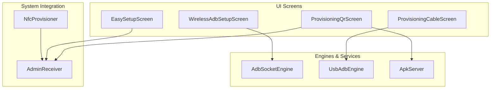
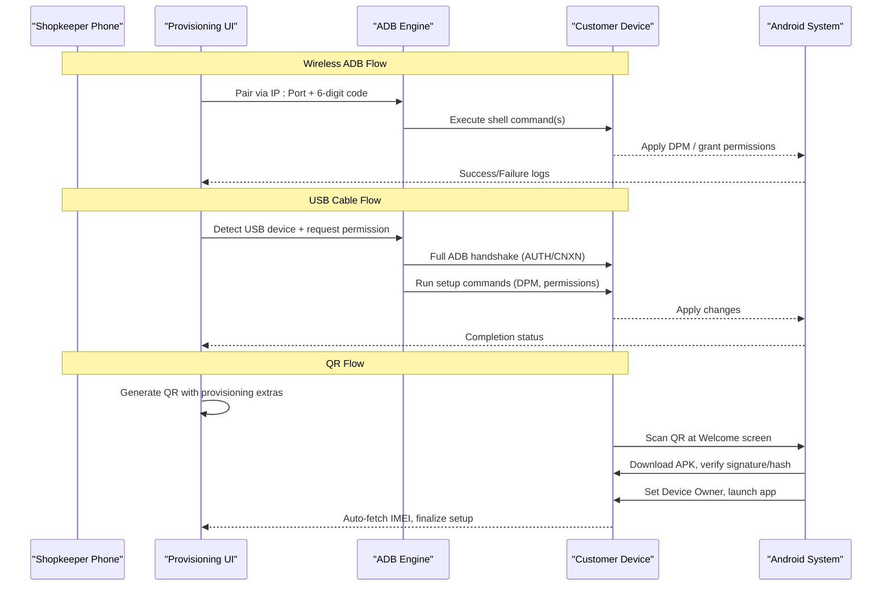
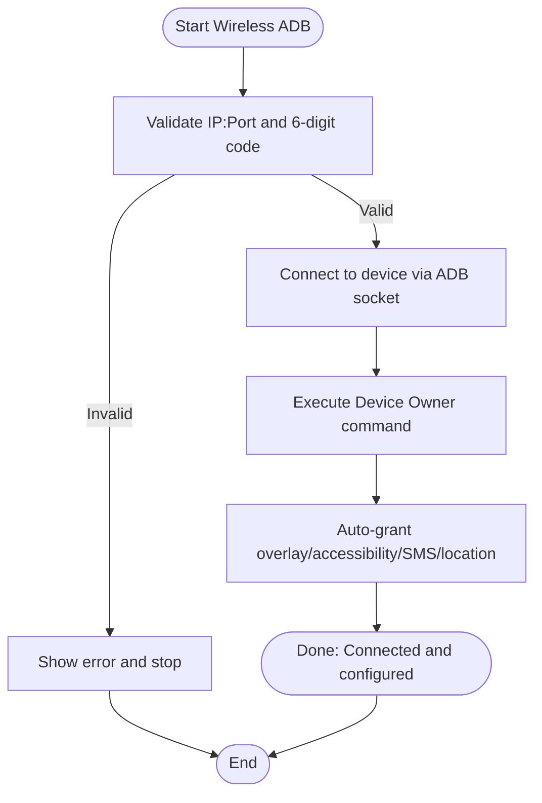
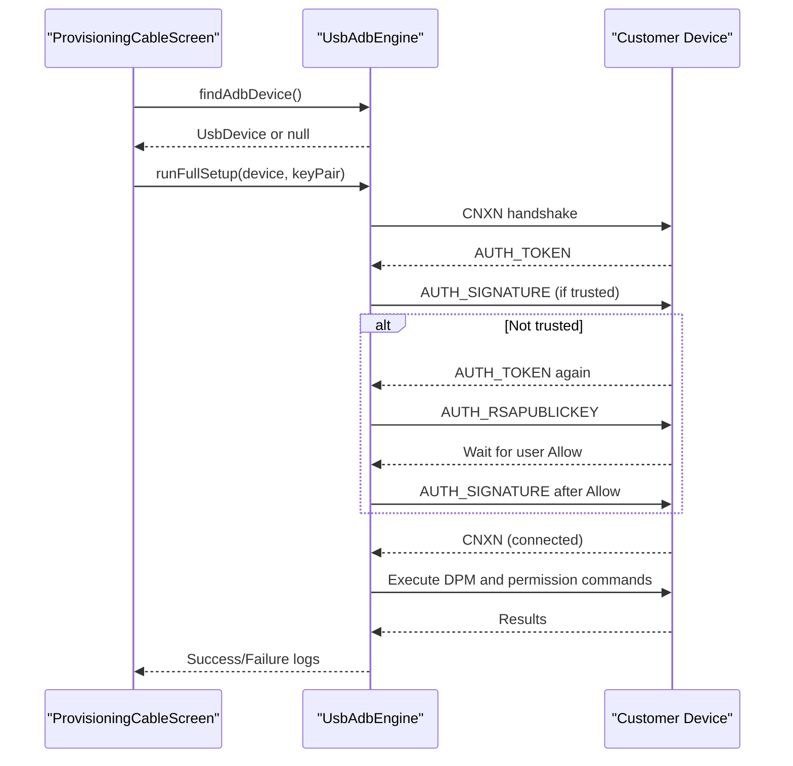
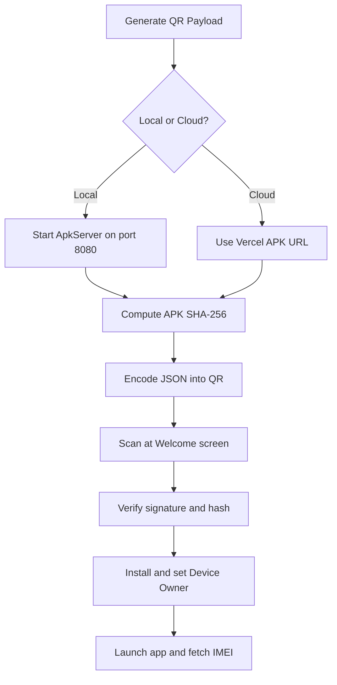
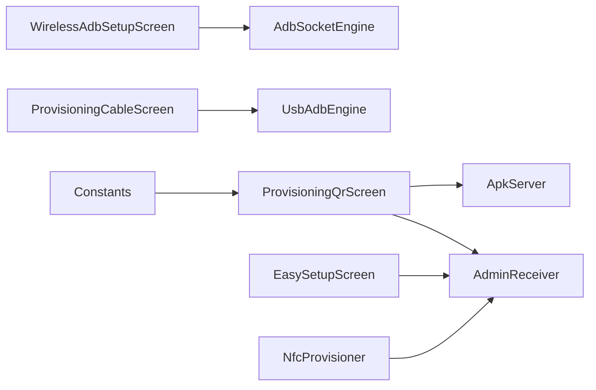

# Provisioning & Setup Tools

<cite>
**Referenced Files in This Document**
- [WirelessAdbSetupScreen.kt](file://app/src/main/java/com/pksafe/lock/manager/ui/provisioning/WirelessAdbSetupScreen.kt)
- [ProvisioningCableScreen.kt](file://app/src/main/java/com/pksafe/lock/manager/ui/provisioning/ProvisioningCableScreen.kt)
- [ProvisioningQrScreen.kt](file://app/src/main/java/com/pksafe/lock/manager/ui/provisioning/ProvisioningQrScreen.kt)
- [EasySetupScreen.kt](file://app/src/main/java/com/pksafe/lock/manager/ui/provisioning/EasySetupScreen.kt)
- [AdbSocketEngine.kt](file://app/src/main/java/com/pksafe/lock/manager/util/AdbSocketEngine.kt)
- [UsbAdbEngine.kt](file://app/src/main/java/com/pksafe/lock/manager/util/UsbAdbEngine.kt)
- [ApkServer.kt](file://app/src/main/java/com/pksafe/lock/manager/util/ApkServer.kt)
- [AdminReceiver.kt](file://app/src/main/java/com/pksafe/lock/manager/receiver/AdminReceiver.kt)
- [NfcProvisioner.kt](file://app/src/main/java/com/pksafe/lock/manager/util/NfcProvisioner.kt)
- [Constants.kt](file://app/src/main/java/com/pksafe/lock/manager/util/Constants.kt)
- [README.md](file://README.md)
</cite>

## Table of Contents
1. Introduction
2. Project Structure
3. Core Components
4. Architecture Overview
5. Detailed Component Analysis
6. Dependency Analysis
7. Performance Considerations
8. Troubleshooting Guide
9. Conclusion
10. Appendices

## Introduction
This document explains PK Locker’s provisioning and setup tools for device enrollment, focusing on three primary workflows:
- Wireless ADB activation (cable-free via Wi-Fi pairing code)
- Instant cable activation (USB C-to-C with guided setup)
- QR code scanning (visual codes containing setup parameters)

It also covers practical deployment scenarios, troubleshooting, optimization for high-volume deployments, and security measures to prevent unauthorized access and ensure chain of custody.

## Project Structure
PK Locker implements provisioning through a set of UI screens and utility engines:
- UI screens guide the shopkeeper or end user through each provisioning method
- Utility engines implement low-level communication (ADB over TCP or USB) and local APK serving
- Receivers handle post-provisioning tasks like IMEI capture and permission grants

**Diagram sources**
- [WirelessAdbSetupScreen.kt:52-382](file://app/src/main/java/com/pksafe/lock/manager/ui/provisioning/WirelessAdbSetupScreen.kt#L52-L382)
- [ProvisioningCableScreen.kt:87-350](file://app/src/main/java/com/pksafe/lock/manager/ui/provisioning/ProvisioningCableScreen.kt#L87-L350)
- [ProvisioningQrScreen.kt:42-381](file://app/src/main/java/com/pksafe/lock/manager/ui/provisioning/ProvisioningQrScreen.kt#L42-L381)
- [AdbSocketEngine.kt:25-96](file://app/src/main/java/com/pksafe/lock/manager/util/AdbSocketEngine.kt#L25-L96)
- [UsbAdbEngine.kt:189-352](file://app/src/main/java/com/pksafe/lock/manager/util/UsbAdbEngine.kt#L189-L352)
- [ApkServer.kt:14-93](file://app/src/main/java/com/pksafe/lock/manager/util/ApkServer.kt#L14-L93)
- [AdminReceiver.kt:14-103](file://app/src/main/java/com/pksafe/lock/manager/receiver/AdminReceiver.kt#L14-L103)
- [NfcProvisioner.kt:15-49](file://app/src/main/java/com/pksafe/lock/manager/util/NfcProvisioner.kt#L15-L49)

**Section sources**
- [WirelessAdbSetupScreen.kt:52-382](file://app/src/main/java/com/pksafe/lock/manager/ui/provisioning/WirelessAdbSetupScreen.kt#L52-L382)
- [ProvisioningCableScreen.kt:87-350](file://app/src/main/java/com/pksafe/lock/manager/ui/provisioning/ProvisioningCableScreen.kt#L87-L350)
- [ProvisioningQrScreen.kt:42-381](file://app/src/main/java/com/pksafe/lock/manager/ui/provisioning/ProvisioningQrScreen.kt#L42-L381)
- [AdbSocketEngine.kt:25-96](file://app/src/main/java/com/pksafe/lock/manager/util/AdbSocketEngine.kt#L25-L96)
- [UsbAdbEngine.kt:189-352](file://app/src/main/java/com/pksafe/lock/manager/util/UsbAdbEngine.kt#L189-L352)
- [ApkServer.kt:14-93](file://app/src/main/java/com/pksafe/lock/manager/util/ApkServer.kt#L14-L93)
- [AdminReceiver.kt:14-103](file://app/src/main/java/com/pksafe/lock/manager/receiver/AdminReceiver.kt#L14-L103)
- [NfcProvisioner.kt:15-49](file://app/src/main/java/com/pksafe/lock/manager/util/NfcProvisioner.kt#L15-L49)

## Core Components
- Wireless ADB Activation: Enables cable-free setup by pairing via Wi-Fi debugging and executing commands remotely.
- Instant Cable Activation: Uses USB host mode to perform full ADB handshake and run all setup commands in one click.
- QR Code Provisioning: Generates a provisioning QR that triggers Android’s built-in Device Owner flow with signature and package checksums.
- Easy Setup: Non-Device Owner path using manual install and permissions; useful when Device Owner is not required.
- Local APK Server: Serves the exact installed APK from the shopkeeper’s phone during QR flows.
- Admin Receiver: Post-provisioning automation including IMEI capture and critical permission grants.

**Section sources**
- [WirelessAdbSetupScreen.kt:52-382](file://app/src/main/java/com/pksafe/lock/manager/ui/provisioning/WirelessAdbSetupScreen.kt#L52-L382)
- [ProvisioningCableScreen.kt:87-350](file://app/src/main/java/com/pksafe/lock/manager/ui/provisioning/ProvisioningCableScreen.kt#L87-L350)
- [ProvisioningQrScreen.kt:42-381](file://app/src/main/java/com/pksafe/lock/manager/ui/provisioning/ProvisioningQrScreen.kt#L42-L381)
- [EasySetupScreen.kt:29-223](file://app/src/main/java/com/pksafe/lock/manager/ui/provisioning/EasySetupScreen.kt#L29-L223)
- [ApkServer.kt:14-93](file://app/src/main/java/com/pksafe/lock/manager/util/ApkServer.kt#L14-L93)
- [AdminReceiver.kt:14-103](file://app/src/main/java/com/pksafe/lock/manager/receiver/AdminReceiver.kt#L14-L103)

## Architecture Overview
The provisioning system integrates UI flows with low-level engines and Android system services to achieve secure, automated device enrollment.

**Diagram sources**
- [WirelessAdbSetupScreen.kt:226-382](file://app/src/main/java/com/pksafe/lock/manager/ui/provisioning/WirelessAdbSetupScreen.kt#L226-L382)
- [AdbSocketEngine.kt:25-96](file://app/src/main/java/com/pksafe/lock/manager/util/AdbSocketEngine.kt#L25-L96)
- [ProvisioningCableScreen.kt:112-350](file://app/src/main/java/com/pksafe/lock/manager/ui/provisioning/ProvisioningCableScreen.kt#L112-L350)
- [UsbAdbEngine.kt:189-352](file://app/src/main/java/com/pksafe/lock/manager/util/UsbAdbEngine.kt#L189-L352)
- [ProvisioningQrScreen.kt:120-169](file://app/src/main/java/com/pksafe/lock/manager/ui/provisioning/ProvisioningQrScreen.kt#L120-L169)
- [AdminReceiver.kt:23-36](file://app/src/main/java/com/pksafe/lock/manager/receiver/AdminReceiver.kt#L23-L36)

## Detailed Component Analysis

### Wireless ADB Activation
Purpose: Enable cable-free device setup using Wi-Fi Debugging and a 6-digit pairing code. The shopkeeper enters the target device’s IP:Port and pairing code, then executes commands remotely to set Device Owner and grant permissions.

Key behaviors:
- Validates inputs (IP:Port format and 6-digit code)
- Connects via ADB socket to the target device
- Executes Device Owner command and auto-grants overlay, accessibility, SMS, and location permissions
- Provides live logs and copy-to-clipboard support

**Diagram sources**
- [WirelessAdbSetupScreen.kt:226-382](file://app/src/main/java/com/pksafe/lock/manager/ui/provisioning/WirelessAdbSetupScreen.kt#L226-L382)
- [AdbSocketEngine.kt:25-96](file://app/src/main/java/com/pksafe/lock/manager/util/AdbSocketEngine.kt#L25-L96)

**Section sources**
- [WirelessAdbSetupScreen.kt:52-382](file://app/src/main/java/com/pksafe/lock/manager/ui/provisioning/WirelessAdbSetupScreen.kt#L52-L382)
- [AdbSocketEngine.kt:25-96](file://app/src/main/java/com/pksafe/lock/manager/util/AdbSocketEngine.kt#L25-L96)

### Instant Cable Activation (USB)
Purpose: Provide guided, one-click activation when devices are physically connected via USB. It performs the full ADB USB handshake, handles RSA key exchange, and runs all setup commands automatically.

Key behaviors:
- Detects USB ADB interface and requests permission
- Persists RSA key pair across sessions for trust continuity
- Implements ADB AUTH state machine (token/signature/public key)
- Runs Device Owner and permission commands in sequence
- Displays real-time logs and completion status

**Diagram sources**
- [ProvisioningCableScreen.kt:112-350](file://app/src/main/java/com/pksafe/lock/manager/ui/provisioning/ProvisioningCableScreen.kt#L112-L350)
- [UsbAdbEngine.kt:189-352](file://app/src/main/java/com/pksafe/lock/manager/util/UsbAdbEngine.kt#L189-L352)

**Section sources**
- [ProvisioningCableScreen.kt:87-350](file://app/src/main/java/com/pksafe/lock/manager/ui/provisioning/ProvisioningCableScreen.kt#L87-L350)
- [UsbAdbEngine.kt:189-352](file://app/src/main/java/com/pksafe/lock/manager/util/UsbAdbEngine.kt#L189-L352)

### QR Code Scanning Provisioning
Purpose: Streamline device registration by generating a QR code containing provisioning parameters. When scanned at the Android Welcome screen, it triggers automatic download, verification, installation, and Device Owner setup.

Key behaviors:
- Builds a JSON payload with provisioning extras (admin component, package name, download URL, signature checksum, optional package checksum)
- Supports local server mode (shopkeeper’s phone serves APK) or cloud mode (Vercel URL)
- Computes and verifies APK hash for integrity
- Displays status and instructions for new phones

**Diagram sources**
- [ProvisioningQrScreen.kt:120-169](file://app/src/main/java/com/pksafe/lock/manager/ui/provisioning/ProvisioningQrScreen.kt#L120-L169)
- [ApkServer.kt:14-93](file://app/src/main/java/com/pksafe/lock/manager/util/ApkServer.kt#L14-L93)
- [AdminReceiver.kt:23-36](file://app/src/main/java/com/pksafe/lock/manager/receiver/AdminReceiver.kt#L23-L36)

**Section sources**
- [ProvisioningQrScreen.kt:42-381](file://app/src/main/java/com/pksafe/lock/manager/ui/provisioning/ProvisioningQrScreen.kt#L42-L381)
- [ApkServer.kt:14-93](file://app/src/main/java/com/pksafe/lock/manager/util/ApkServer.kt#L14-L93)
- [AdminReceiver.kt:23-36](file://app/src/main/java/com/pksafe/lock/manager/receiver/AdminReceiver.kt#L23-L36)

### Easy Setup (Non-Device Owner)
Purpose: Provide a simpler path without requiring Device Owner. Useful when factory reset or advanced controls are not needed.

Key behaviors:
- Share APK directly via share sheet or send download link
- Guides users to install and grant Device Admin, Overlay, Accessibility, and SMS/Location permissions
- Captures IMEI manually if needed

**Section sources**
- [EasySetupScreen.kt:29-223](file://app/src/main/java/com/pksafe/lock/manager/ui/provisioning/EasySetupScreen.kt#L29-L223)

### NFC Provisioning Helper
Purpose: Enable quick setup by tapping phones together at the Welcome screen to deliver provisioning parameters via NFC.

Key behaviors:
- Creates an NDEF message with provisioning properties (admin component, package name, download URL, signature checksum)
- Can include locale/time zone settings and optional WiFi credentials

**Section sources**
- [NfcProvisioner.kt:15-49](file://app/src/main/java/com/pksafe/lock/manager/util/NfcProvisioner.kt#L15-L49)

## Dependency Analysis
High-level dependencies between components:

**Diagram sources**
- [WirelessAdbSetupScreen.kt:226-382](file://app/src/main/java/com/pksafe/lock/manager/ui/provisioning/WirelessAdbSetupScreen.kt#L226-L382)
- [ProvisioningCableScreen.kt:112-350](file://app/src/main/java/com/pksafe/lock/manager/ui/provisioning/ProvisioningCableScreen.kt#L112-L350)
- [ProvisioningQrScreen.kt:120-169](file://app/src/main/java/com/pksafe/lock/manager/ui/provisioning/ProvisioningQrScreen.kt#L120-L169)
- [ApkServer.kt:14-93](file://app/src/main/java/com/pksafe/lock/manager/util/ApkServer.kt#L14-L93)
- [AdminReceiver.kt:14-103](file://app/src/main/java/com/pksafe/lock/manager/receiver/AdminReceiver.kt#L14-L103)
- [Constants.kt:3-10](file://app/src/main/java/com/pksafe/lock/manager/util/Constants.kt#L3-L10)

**Section sources**
- [WirelessAdbSetupScreen.kt:226-382](file://app/src/main/java/com/pksafe/lock/manager/ui/provisioning/WirelessAdbSetupScreen.kt#L226-L382)
- [ProvisioningCableScreen.kt:112-350](file://app/src/main/java/com/pksafe/lock/manager/ui/provisioning/ProvisioningCableScreen.kt#L112-L350)
- [ProvisioningQrScreen.kt:120-169](file://app/src/main/java/com/pksafe/lock/manager/ui/provisioning/ProvisioningQrScreen.kt#L120-L169)
- [ApkServer.kt:14-93](file://app/src/main/java/com/pksafe/lock/manager/util/ApkServer.kt#L14-L93)
- [AdminReceiver.kt:14-103](file://app/src/main/java/com/pksafe/lock/manager/receiver/AdminReceiver.kt#L14-L103)
- [Constants.kt:3-10](file://app/src/main/java/com/pksafe/lock/manager/util/Constants.kt#L3-L10)

## Performance Considerations
- Prefer QR provisioning for high-volume deployments: zero-touch, no cables, and OS-managed installation reduce human error and speed up throughput.
- For USB flows, persist RSA keys to avoid repeated “Allow” dialogs and speed up subsequent connections.
- Use local APK server only when necessary; cloud URLs reduce network overhead on the shopkeeper device.
- Batch operations where possible: wireless ADB can execute multiple commands in sequence to minimize connection churn.
- Monitor timeouts and fallbacks: ADB socket engine includes fallback to default port and direct socket execution to improve reliability.

[No sources needed since this section provides general guidance]

## Troubleshooting Guide
Common issues and resolutions:

- Wireless ADB pairing fails:
  - Ensure both devices are on the same Wi-Fi network
  - Confirm correct IP:Port format and valid 6-digit pairing code
  - Check that Wireless Debugging is enabled on the customer device
  - Review logs for connection errors and try fallback port

- USB activation not proceeding:
  - Confirm USB Debugging is ON and cable is properly connected
  - Accept the “Allow USB Debugging?” dialog when prompted
  - Reconnect cable and retry; check logs for USB permission or endpoint errors

- QR provisioning does not complete:
  - Verify APK URL is reachable and returns correct content type
  - Ensure signature checksum matches the installed APK
  - Confirm device is on Wi-Fi and can reach the server
  - Refresh hash and regenerate QR if server content changed

- Post-provisioning issues:
  - If IMEI is not captured, confirm Device Owner is active and permissions granted
  - Ensure overlay and accessibility permissions are enabled for lock functionality
  - Check network connectivity for remote lock/unlock via FCM

**Section sources**
- [WirelessAdbSetupScreen.kt:226-382](file://app/src/main/java/com/pksafe/lock/manager/ui/provisioning/WirelessAdbSetupScreen.kt#L226-L382)
- [ProvisioningCableScreen.kt:112-350](file://app/src/main/java/com/pksafe/lock/manager/ui/provisioning/ProvisioningCableScreen.kt#L112-L350)
- [ProvisioningQrScreen.kt:120-169](file://app/src/main/java/com/pksafe/lock/manager/ui/provisioning/ProvisioningQrScreen.kt#L120-L169)
- [AdminReceiver.kt:43-103](file://app/src/main/java/com/pksafe/lock/manager/receiver/AdminReceiver.kt#L43-L103)
- [README.md:123-133](file://README.md#L123-L133)

## Conclusion
PK Locker provides robust, flexible provisioning options tailored for different deployment contexts:
- QR-based zero-touch enrollment for fast, scalable rollouts
- Wireless ADB for cable-free control and automation
- USB cable activation for guided, hands-on setups
- Easy setup for non-Device Owner scenarios

Security is enforced through signature and package checksum verification, controlled Device Owner assignment, and automated permission management. These mechanisms help prevent unauthorized access and maintain chain of custody during enrollment.

[No sources needed since this section summarizes without analyzing specific files]

## Appendices

### Practical Deployment Examples

- Scenario A: High-volume retail rollout
  - Use QR provisioning with local APK server to serve the exact signed APK
  - Pre-generate QRs with verified hashes and signature checksums
  - Train staff to scan QR at Welcome screen; automate IMEI capture via AdminReceiver

- Scenario B: On-site technician with limited connectivity
  - Use USB cable activation to perform full setup in one click
  - Persist RSA keys to reduce friction across multiple devices
  - Rely on logs to diagnose any handshake or permission issues

- Scenario C: Remote customer self-setup
  - Provide QR or download link; instruct to scan at Welcome screen
  - Ensure Wi-Fi connectivity and correct signature/hash
  - Post-setup, verify IMEI and enable remote lock/unlock via dashboard

[No sources needed since this section provides general guidance]

### Security Measures During Provisioning
- Signature and package checksum validation in QR provisioning ensures only authorized APKs are installed
- Device Owner assignment restricts uninstallation and factory resets
- Automated permission grants limit user tampering while enabling core features
- USB authentication uses RSA key exchange to establish trusted channels
- AdminReceiver enforces critical permissions and captures IMEI to bind device identity

**Section sources**
- [ProvisioningQrScreen.kt:120-169](file://app/src/main/java/com/pksafe/lock/manager/ui/provisioning/ProvisioningQrScreen.kt#L120-L169)
- [UsbAdbEngine.kt:189-352](file://app/src/main/java/com/pksafe/lock/manager/util/UsbAdbEngine.kt#L189-L352)
- [AdminReceiver.kt:43-103](file://app/src/main/java/com/pksafe/lock/manager/receiver/AdminReceiver.kt#L43-L103)