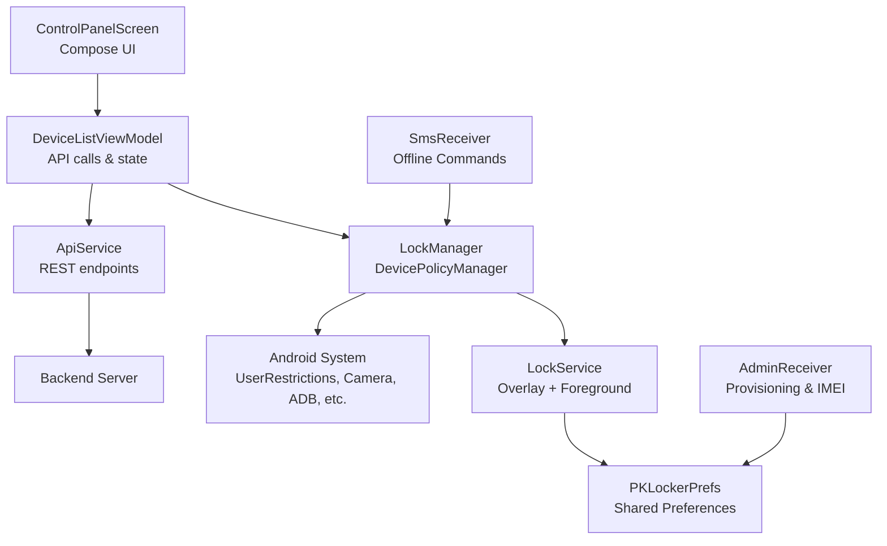
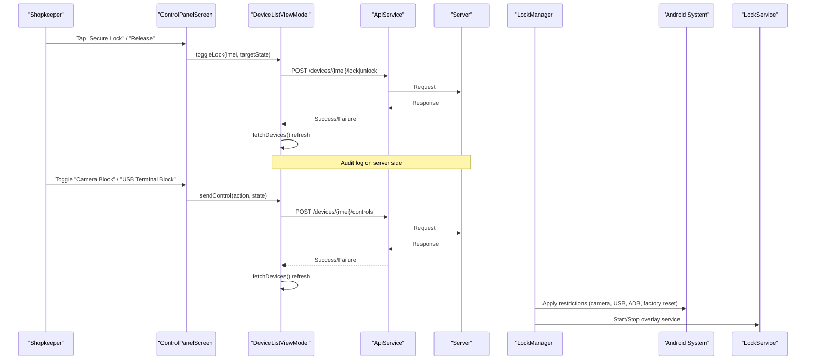
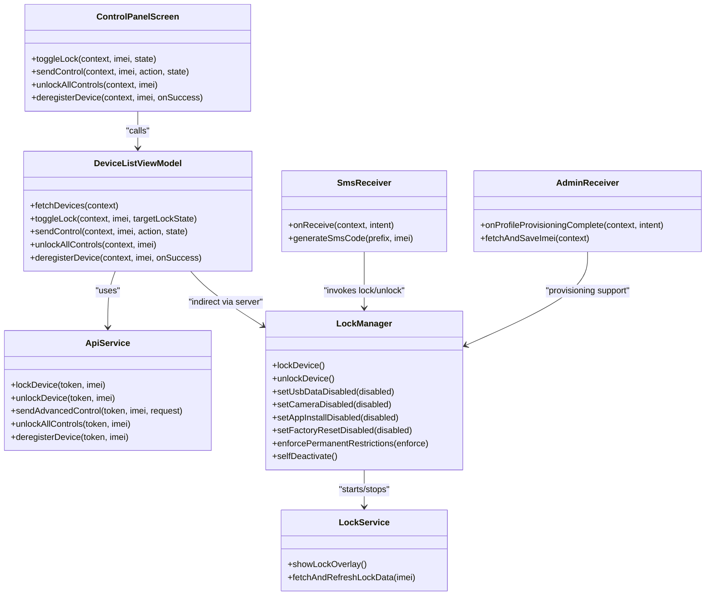

# Remote Control Panel

<cite>
**Referenced Files in This Document**
- [ControlPanelScreen.kt](file://app/src/main/java/com/pksafe/lock/manager/ui/devices/ControlPanelScreen.kt)
- [DeviceListViewModel.kt](file://app/src/main/java/com/pksafe/lock/manager/ui/devices/DeviceListViewModel.kt)
- [ApiService.kt](file://app/src/main/java/com/pksafe/lock/manager/data/ApiService.kt)
- [Models.kt](file://app/src/main/java/com/pksafe/lock/manager/data/Models.kt)
- [LockManager.kt](file://app/src/main/java/com/pksafe/lock/manager/util/LockManager.kt)
- [LockService.kt](file://app/src/main/java/com/pksafe/lock/manager/service/LockService.kt)
- [AdminReceiver.kt](file://app/src/main/java/com/pksafe/lock/manager/receiver/AdminReceiver.kt)
- [SmsReceiver.kt](file://app/src/main/java/com/pksafe/lock/manager/receiver/SmsReceiver.kt)
- [device_admin_policies.xml](file://app/src/main/res/xml/device_admin_policies.xml)
</cite>

## Table of Contents
1. [Introduction](#introduction)
2. [Project Structure](#project-structure)
3. [Core Components](#core-components)
4. [Architecture Overview](#architecture-overview)
5. [Detailed Component Analysis](#detailed-component-analysis)
6. [Dependency Analysis](#dependency-analysis)
7. [Performance Considerations](#performance-considerations)
8. [Troubleshooting Guide](#troubleshooting-guide)
9. [Conclusion](#conclusion)
10. [Appendices](#appendices)

## Introduction
This document explains the PK Locker remote control panel for shopkeepers to manage individual devices and enforce hardware restrictions. It covers:
- Granular device controls: lock/unlock, camera block, USB file transfer block, app install/settings locks, auto-lock behaviors, and factory reset prevention.
- Hardware restriction toggles that selectively disable features such as camera access, USB file transfer, system modifications, and debugging.
- Emergency override functions for immediate lockdown or release when needed.
- Practical scenarios: temporary suspension, permanent lockdown for non-payment, compliance feature restrictions.
- Confirmation mechanisms and audit logging to ensure secure and accountable operations.

## Project Structure
The control panel is a Compose-based UI backed by a ViewModel that calls a REST API. Device enforcement runs via Android Device Policy Manager (DPM) and a foreground Lock Service overlay. Offline SMS commands provide a fallback path without internet.

**Diagram sources**
- [ControlPanelScreen.kt:55-229](file://app/src/main/java/com/pksafe/lock/manager/ui/devices/ControlPanelScreen.kt#L55-L229)
- [DeviceListViewModel.kt:18-246](file://app/src/main/java/com/pksafe/lock/manager/ui/devices/DeviceListViewModel.kt#L18-L246)
- [ApiService.kt:11-185](file://app/src/main/java/com/pksafe/lock/manager/data/ApiService.kt#L11-L185)
- [LockManager.kt:27-406](file://app/src/main/java/com/pksafe/lock/manager/util/LockManager.kt#L27-L406)
- [LockService.kt:41-330](file://app/src/main/java/com/pksafe/lock/manager/service/LockService.kt#L41-L330)
- [SmsReceiver.kt:29-164](file://app/src/main/java/com/pksafe/lock/manager/receiver/SmsReceiver.kt#L29-L164)
- [AdminReceiver.kt:14-104](file://app/src/main/java/com/pksafe/lock/manager/receiver/AdminReceiver.kt#L14-L104)

**Section sources**
- [ControlPanelScreen.kt:55-229](file://app/src/main/java/com/pksafe/lock/manager/ui/devices/ControlPanelScreen.kt#L55-L229)
- [DeviceListViewModel.kt:18-246](file://app/src/main/java/com/pksafe/lock/manager/ui/devices/DeviceListViewModel.kt#L18-L246)
- [ApiService.kt:11-185](file://app/src/main/java/com/pksafe/lock/manager/data/ApiService.kt#L11-L185)
- [LockManager.kt:27-406](file://app/src/main/java/com/pksafe/lock/manager/util/LockManager.kt#L27-L406)
- [LockService.kt:41-330](file://app/src/main/java/com/pksafe/lock/manager/service/LockService.kt#L41-L330)
- [SmsReceiver.kt:29-164](file://app/src/main/java/com/pksafe/lock/manager/receiver/SmsReceiver.kt#L29-L164)
- [AdminReceiver.kt:14-104](file://app/src/main/java/com/pksafe/lock/manager/receiver/AdminReceiver.kt#L14-L104)

## Core Components
- Control Panel UI: Provides tabs for Secure Control, Hardware Tech, Live Tracker, Customer Profile, and EMI Ledger. Includes emergency reset banner, action buttons for lock/release, and mode selection (Online vs Offline).
- Device List ViewModel: Orchestrates API calls for device listing, locking/unlocking, sending advanced controls, unlocking all controls, and deregistering devices.
- ApiService: Defines REST endpoints for authentication, device management, controls, EMI, keys, and admin key orders.
- LockManager: Applies hardware restrictions using DevicePolicyManager and UserRestrictions; manages overlay service start/stop; supports app hiding and warning alarms/wallpaper updates.
- LockService: Foreground service that displays a persistent lock overlay, blocks navigation keys, and enforces auto-lock on connectivity loss.
- SmsReceiver: Handles offline LOCK/UNLOCK SMS commands with deterministic code verification based on IMEI.
- AdminReceiver: Handles provisioning completion, grants critical permissions, and persists IMEI data.

**Section sources**
- [ControlPanelScreen.kt:55-229](file://app/src/main/java/com/pksafe/lock/manager/ui/devices/ControlPanelScreen.kt#L55-L229)
- [DeviceListViewModel.kt:18-246](file://app/src/main/java/com/pksafe/lock/manager/ui/devices/DeviceListViewModel.kt#L18-L246)
- [ApiService.kt:11-185](file://app/src/main/java/com/pksafe/lock/manager/data/ApiService.kt#L11-L185)
- [LockManager.kt:27-406](file://app/src/main/java/com/pksafe/lock/manager/util/LockManager.kt#L27-L406)
- [LockService.kt:41-330](file://app/src/main/java/com/pksafe/lock/manager/service/LockService.kt#L41-L330)
- [SmsReceiver.kt:29-164](file://app/src/main/java/com/pksafe/lock/manager/receiver/SmsReceiver.kt#L29-L164)
- [AdminReceiver.kt:14-104](file://app/src/main/java/com/pksafe/lock/manager/receiver/AdminReceiver.kt#L14-L104)

## Architecture Overview
The control flow spans UI, ViewModel, API, and device enforcement layers. The UI triggers actions that call the ViewModel, which communicates with the backend via ApiService. For immediate device control, LockManager applies restrictions through DPM and starts/stops LockService. Offline SMS provides a direct path to enforce lock/unlock without network.

**Diagram sources**
- [ControlPanelScreen.kt:179-200](file://app/src/main/java/com/pksafe/lock/manager/ui/devices/ControlPanelScreen.kt#L179-L200)
- [DeviceListViewModel.kt:143-195](file://app/src/main/java/com/pksafe/lock/manager/ui/devices/DeviceListViewModel.kt#L143-L195)
- [ApiService.kt:46-93](file://app/src/main/java/com/pksafe/lock/manager/data/ApiService.kt#L46-L93)
- [LockManager.kt:111-192](file://app/src/main/java/com/pksafe/lock/manager/util/LockManager.kt#L111-L192)
- [LockService.kt:54-80](file://app/src/main/java/com/pksafe/lock/manager/service/LockService.kt#L54-L80)

## Detailed Component Analysis

### Control Panel UI: Secure Control and Hardware Restrictions
- Tabs and modes:
  - Secure Control tab shows switches for auto-lock, SIM change lock, USB terminal block, camera block, app install lock, settings lock.
  - App Restrictions tab toggles Instagram, WhatsApp, YouTube.
  - Terminal Utilities include location ping, warning audio, warning wallpaper.
  - EMI Reminder Protocol includes WhatsApp, SMS+Push, and warning siren trigger.
- Emergency Reset banner: Clears all active restrictions with confirmation dialog.
- De-register Terminal: Requires typed confirmation to permanently release device.

Key interactions:
- Lock/Release bottom buttons open a confirmation dialog before executing lock/unlock.
- Mode selection toggles between Online (cloud) and Offline (SMS) flows.

**Section sources**
- [ControlPanelScreen.kt:55-229](file://app/src/main/java/com/pksafe/lock/manager/ui/devices/ControlPanelScreen.kt#L55-L229)
- [ControlPanelScreen.kt:250-494](file://app/src/main/java/com/pksafe/lock/manager/ui/devices/ControlPanelScreen.kt#L250-L494)
- [ControlPanelScreen.kt:571-648](file://app/src/main/java/com/pksafe/lock/manager/ui/devices/ControlPanelScreen.kt#L571-L648)

### Device List ViewModel: API Orchestration and State Management
- Fetches device list and updates UI state.
- Toggles lock/unlock via dedicated endpoints and refreshes device list on success.
- Sends advanced controls (individual toggles) and refreshes state after successful commands.
- Supports unlock-all controls and deregistration workflows.

Error handling:
- Sets error messages on failures and ensures loading states are cleared.
- Rolls back UI state by refreshing device list on exceptions.

**Section sources**
- [DeviceListViewModel.kt:18-246](file://app/src/main/java/com/pksafe/lock/manager/ui/devices/DeviceListViewModel.kt#L18-L246)

### ApiService: Endpoints for Device Control
- Authentication: login, signup.
- Devices: register, list, stats, analytics, lock/unlock, advanced controls, unlock-all, deregister.
- Location and SIM change notifications.
- EMI schedule retrieval, marking payments, rescheduling plans.
- Key orders and admin approvals.

These endpoints underpin the control panel’s capabilities and are used by the ViewModel to execute shopkeeper actions.

**Section sources**
- [ApiService.kt:11-185](file://app/src/main/java/com/pksafe/lock/manager/data/ApiService.kt#L11-L185)

### LockManager: Hardware Restrictions and Enforcement
- Admin and Device Owner checks: Ensures privileges before applying restrictions.
- Full enforcement:
  - Starts LockService overlay.
  - Applies hard restrictions: camera disabled, USB file transfer blocked, factory reset blocked, safe boot blocked, ADB/debugging blocked, status bar disabled, keyguard disabled.
  - Triggers system lock after delay.
- Individual controls:
  - USB data disabled, camera disabled, app install/uninstall disabled, outgoing calls disabled, factory reset disabled, safe boot disabled.
- Advanced features:
  - App hiding via setApplicationHidden for known packages.
  - Permanent restrictions enforcement for critical protections.
  - Warning alarm toggle and wallpaper update.
  - Self-deactivation to remove privileges and clear restrictions for release.

Complexity considerations:
- Restriction application uses DPM APIs; some require Device Owner mode.
- Error handling logs failures and continues gracefully where possible.

**Section sources**
- [LockManager.kt:27-406](file://app/src/main/java/com/pksafe/lock/manager/util/LockManager.kt#L27-L406)

### LockService: Persistent Lock Overlay and Auto-Lock
- Foreground service with high-priority notification indicating security active.
- Displays an overlay view that blocks Back/Home/Recents and keeps screen on.
- Auto-lock behavior: listens for connectivity changes and sets locked flag if auto-lock enabled and offline.
- Unlock mechanism: accepts dynamic master code derived from IMEI last digits; clears restrictions and stops service.
- Live refresh: fetches fresh EMI and shop info from server and updates overlay UI.

**Section sources**
- [LockService.kt:41-330](file://app/src/main/java/com/pksafe/lock/manager/service/LockService.kt#L41-L330)

### SmsReceiver: Offline Command Handling
- Validates incoming SMS against generated codes based on stored IMEIs.
- Executes lock/unlock by invoking LockManager methods.
- Aborts broadcast to hide message from default SMS app upon valid command.
- Fallback code generation supports dual IMEI slots.

**Section sources**
- [SmsReceiver.kt:29-164](file://app/src/main/java/com/pksafe/lock/manager/receiver/SmsReceiver.kt#L29-L164)

### AdminReceiver: Provisioning and Permissions
- On provisioning complete, grants critical permissions (phone state, SMS read/send) to self as Device Owner.
- Fetches and stores IMEI(s), marks provisioning complete, and launches app to finalize setup.

**Section sources**
- [AdminReceiver.kt:14-104](file://app/src/main/java/com/pksafe/lock/manager/receiver/AdminReceiver.kt#L14-L104)

### Data Models: Controls and Restrictions
- DeviceControls includes flags for USB lock, camera disabled, install blocked, uninstall blocked, settings blocked, debugging blocked, auto-lock, auto-lock on SIM change, soft reset/boot blocked, outgoing calls blocked, warning audio/wallpaper.
- AppRestrictions includes toggles for specific apps like WhatsApp, Facebook, Instagram, YouTube, Chrome, Telegram.

These models reflect the granular controls exposed by the UI and enforced by LockManager.

**Section sources**
- [Models.kt:48-101](file://app/src/main/java/com/pksafe/lock/manager/data/Models.kt#L48-L101)

## Dependency Analysis
- UI depends on ViewModel for state and actions.
- ViewModel depends on ApiService for backend communication.
- LockManager depends on Android DevicePolicyManager and UserRestrictions to enforce hardware controls.
- LockService depends on WindowManager for overlay and NotificationManager for foreground service.
- SmsReceiver depends on Telephony APIs and shared preferences for IMEI and codes.
- AdminReceiver depends on DevicePolicyManager to grant permissions and persist provisioning state.

**Diagram sources**
- [ControlPanelScreen.kt:55-229](file://app/src/main/java/com/pksafe/lock/manager/ui/devices/ControlPanelScreen.kt#L55-L229)
- [DeviceListViewModel.kt:18-246](file://app/src/main/java/com/pksafe/lock/manager/ui/devices/DeviceListViewModel.kt#L18-L246)
- [ApiService.kt:11-185](file://app/src/main/java/com/pksafe/lock/manager/data/ApiService.kt#L11-L185)
- [LockManager.kt:27-406](file://app/src/main/java/com/pksafe/lock/manager/util/LockManager.kt#L27-L406)
- [LockService.kt:41-330](file://app/src/main/java/com/pksafe/lock/manager/service/LockService.kt#L41-L330)
- [SmsReceiver.kt:29-164](file://app/src/main/java/com/pksafe/lock/manager/receiver/SmsReceiver.kt#L29-L164)
- [AdminReceiver.kt:14-104](file://app/src/main/java/com/pksafe/lock/manager/receiver/AdminReceiver.kt#L14-L104)

**Section sources**
- [ControlPanelScreen.kt:55-229](file://app/src/main/java/com/pksafe/lock/manager/ui/devices/ControlPanelScreen.kt#L55-L229)
- [DeviceListViewModel.kt:18-246](file://app/src/main/java/com/pksafe/lock/manager/ui/devices/DeviceListViewModel.kt#L18-L246)
- [ApiService.kt:11-185](file://app/src/main/java/com/pksafe/lock/manager/data/ApiService.kt#L11-L185)
- [LockManager.kt:27-406](file://app/src/main/java/com/pksafe/lock/manager/util/LockManager.kt#L27-L406)
- [LockService.kt:41-330](file://app/src/main/java/com/pksafe/lock/manager/service/LockService.kt#L41-L330)
- [SmsReceiver.kt:29-164](file://app/src/main/java/com/pksafe/lock/manager/receiver/SmsReceiver.kt#L29-L164)
- [AdminReceiver.kt:14-104](file://app/src/main/java/com/pksafe/lock/manager/receiver/AdminReceiver.kt#L14-L104)

## Performance Considerations
- Network calls: ViewModel performs asynchronous requests and refreshes device lists only on success to minimize unnecessary updates.
- UI responsiveness: Switch items show processing indicators and timeout guards to prevent stuck states.
- Overlay performance: LockService uses foreground service and minimal UI updates; live refresh runs on background threads and posts UI updates on main thread.
- Restriction application: DPM calls are guarded by version checks and exception handling to avoid blocking the UI thread.

[No sources needed since this section provides general guidance]

## Troubleshooting Guide
Common issues and resolutions:
- Admin/Device Owner not active:
  - Ensure Device Admin privileges are granted; LockManager checks admin status before applying restrictions.
  - Provisioning must complete to enable Device Owner features; AdminReceiver handles permission grants and IMEI persistence.
- Overlay not showing:
  - Verify overlay permission is granted; LockManager can request overlay permission via system settings.
- SMS commands not working:
  - Confirm IMEI stored in preferences; SmsReceiver requires valid IMEI(s) to generate and verify codes.
  - Ensure SMS permissions are granted; AdminReceiver grants SMS read/send permissions during provisioning.
- Auto-lock not triggering:
  - Check connectivity receiver registration and auto-lock preference; LockService monitors connectivity changes and sets locked flag accordingly.
- Restrictions not applied:
  - Some restrictions require Device Owner mode; confirm device owner status and supported Android versions.
  - Review logs for errors in LockManager and LockService; handle exceptions gracefully.

**Section sources**
- [LockManager.kt:46-73](file://app/src/main/java/com/pksafe/lock/manager/util/LockManager.kt#L46-L73)
- [AdminReceiver.kt:43-104](file://app/src/main/java/com/pksafe/lock/manager/receiver/AdminReceiver.kt#L43-L104)
- [SmsReceiver.kt:44-143](file://app/src/main/java/com/pksafe/lock/manager/receiver/SmsReceiver.kt#L44-L143)
- [LockService.kt:82-105](file://app/src/main/java/com/pksafe/lock/manager/service/LockService.kt#L82-L105)

## Conclusion
The PK Locker remote control panel provides comprehensive device management and hardware restriction capabilities for shopkeepers. Through a structured UI, robust ViewModel orchestration, and secure enforcement via DevicePolicyManager, it enables:
- Immediate lock/unlock operations with confirmation dialogs.
- Granular hardware controls including camera, USB, app installation, settings, and debugging restrictions.
- Emergency overrides for rapid lockdown or release.
- Offline SMS fallback for critical operations without internet.
- Auditable actions via server-side endpoints and local logging for accountability.

Best practices:
- Always use confirmation dialogs for destructive actions.
- Maintain Device Owner privileges for full restriction coverage.
- Monitor connectivity and auto-lock settings for reliable enforcement.
- Leverage offline SMS commands as a resilient backup channel.

[No sources needed since this section summarizes without analyzing specific files]

## Appendices

### Practical Control Scenarios
- Temporary device suspension:
  - Use Secure Control tab to toggle USB terminal block and camera block temporarily.
  - Trigger warning audio/wallpaper to notify the user.
  - Release restrictions later via Release button with confirmation.
- Permanent lockdown for non-payment:
  - Execute Secure Lock with confirmation; server records action.
  - Enforce permanent restrictions via LockManager to block factory reset, USB, and ADB.
  - Optionally deregister device to fully release privileges post-resolution.
- Compliance feature restrictions:
  - Enable app restrictions for specific apps (e.g., Instagram, WhatsApp, YouTube).
  - Disable settings and install locks to prevent unauthorized changes.
  - Use EMI Reminder Protocol to send multi-channel notifications.

[No sources needed since this section provides conceptual guidance]

### Confirmation Mechanisms and Audit Logging
- Confirmation dialogs:
  - Lock/Release: Dialog prompts before execution to prevent accidental actions.
  - Emergency Reset: Warning dialog clarifies impact before clearing all restrictions.
  - De-register: Requires typed confirmation to proceed.
- Audit logging:
  - ViewModel logs success/failure of control actions.
  - LockManager and LockService log restriction application and service lifecycle events.
  - SmsReceiver logs SMS validation and action outcomes.
  - Backend endpoints record lock/unlock/control actions for server-side auditing.

**Section sources**
- [ControlPanelScreen.kt:72-98](file://app/src/main/java/com/pksafe/lock/manager/ui/devices/ControlPanelScreen.kt#L72-L98)
- [ControlPanelScreen.kt:257-280](file://app/src/main/java/com/pksafe/lock/manager/ui/devices/ControlPanelScreen.kt#L257-L280)
- [ControlPanelScreen.kt:435-472](file://app/src/main/java/com/pksafe/lock/manager/ui/devices/ControlPanelScreen.kt#L435-L472)
- [DeviceListViewModel.kt:143-195](file://app/src/main/java/com/pksafe/lock/manager/ui/devices/DeviceListViewModel.kt#L143-L195)
- [LockManager.kt:111-192](file://app/src/main/java/com/pksafe/lock/manager/util/LockManager.kt#L111-L192)
- [SmsReceiver.kt:94-143](file://app/src/main/java/com/pksafe/lock/manager/receiver/SmsReceiver.kt#L94-L143)