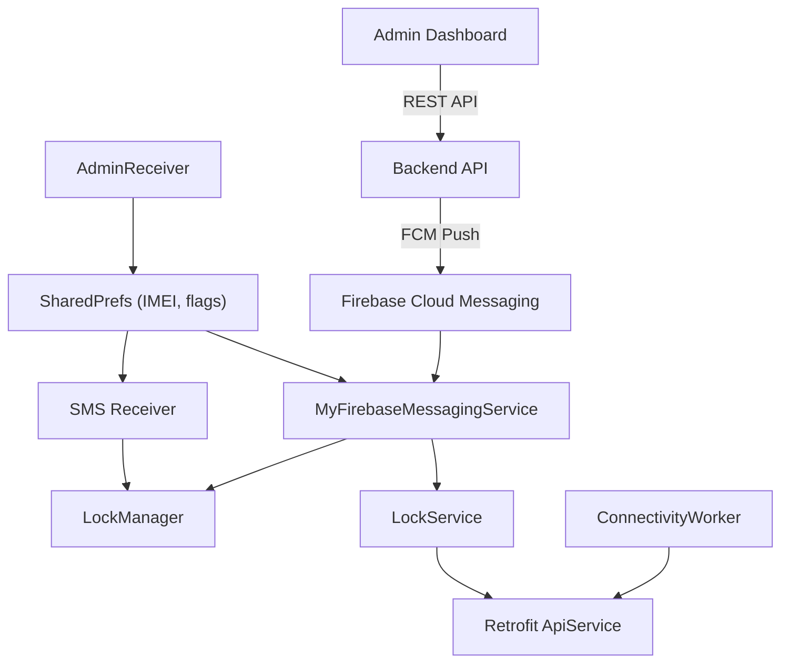
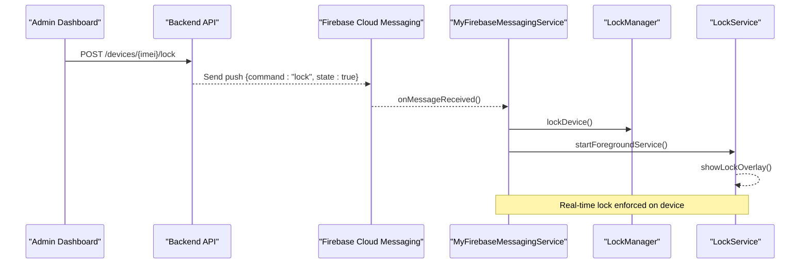
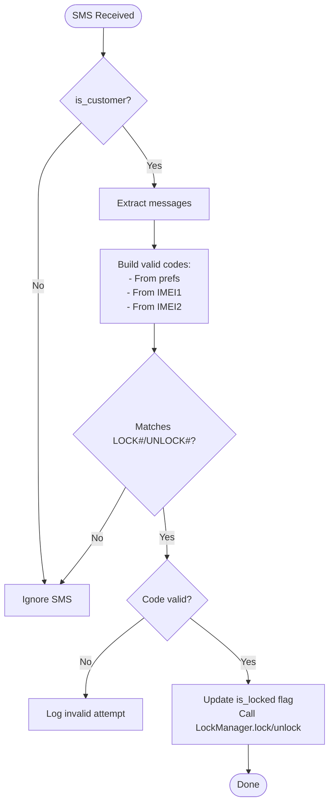
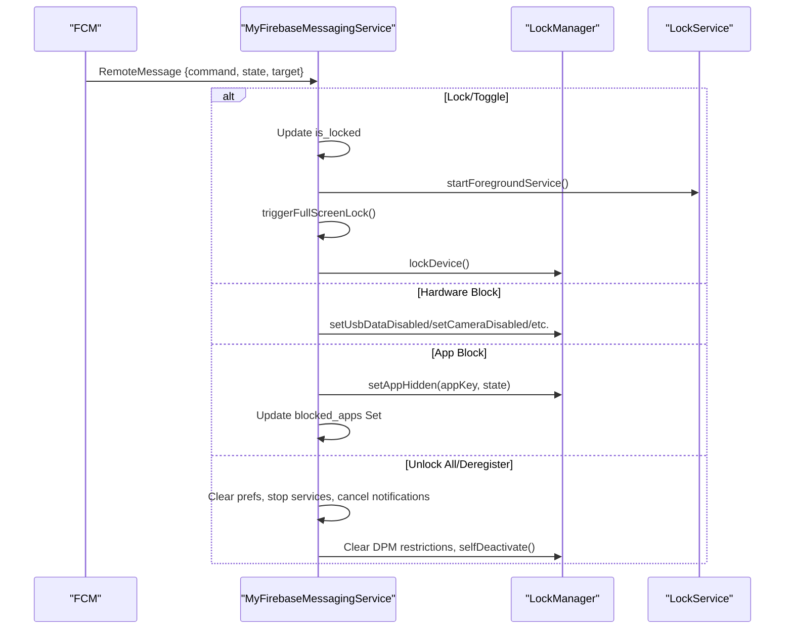
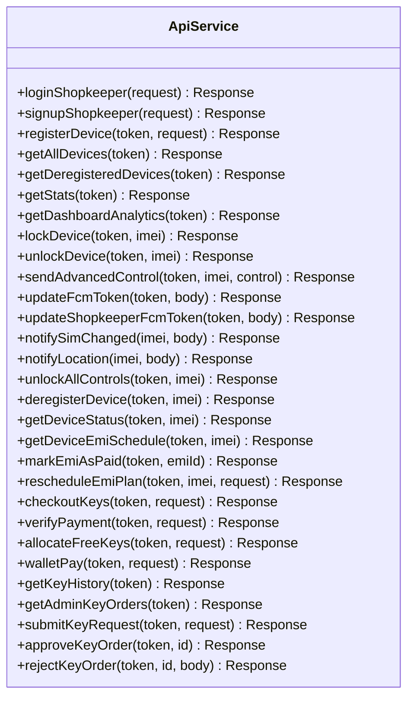
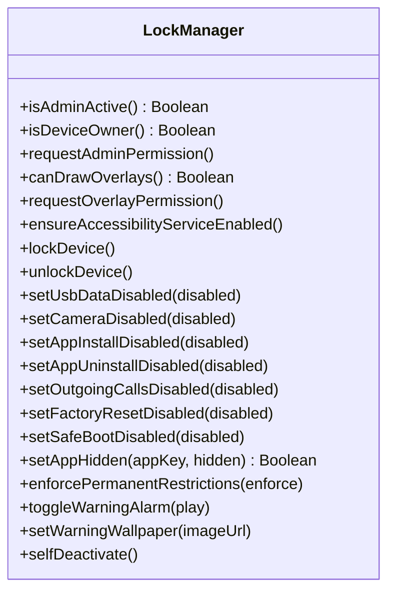
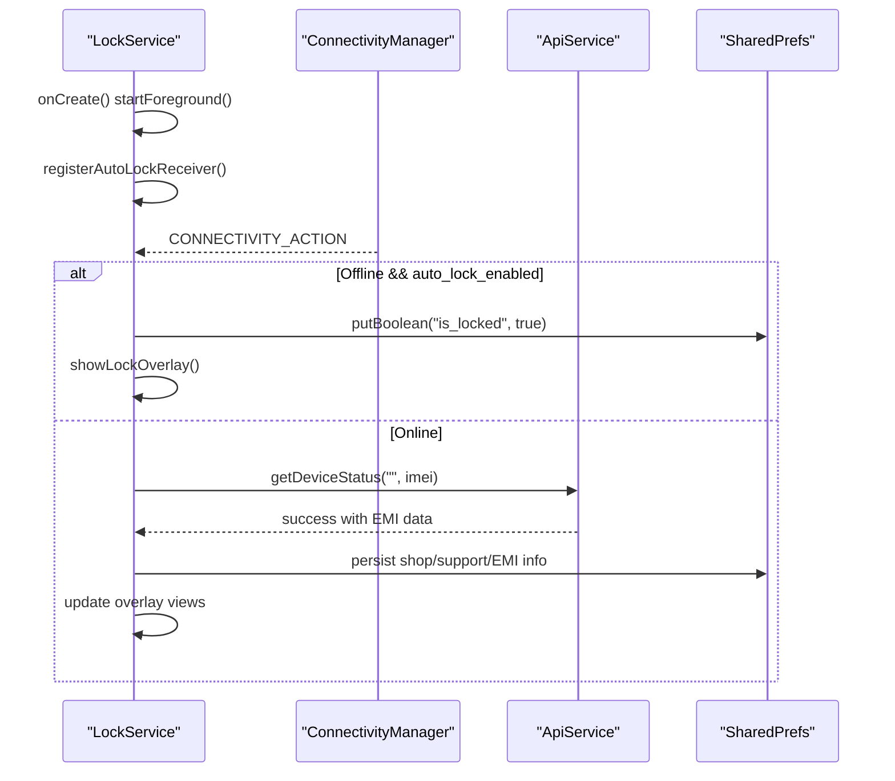
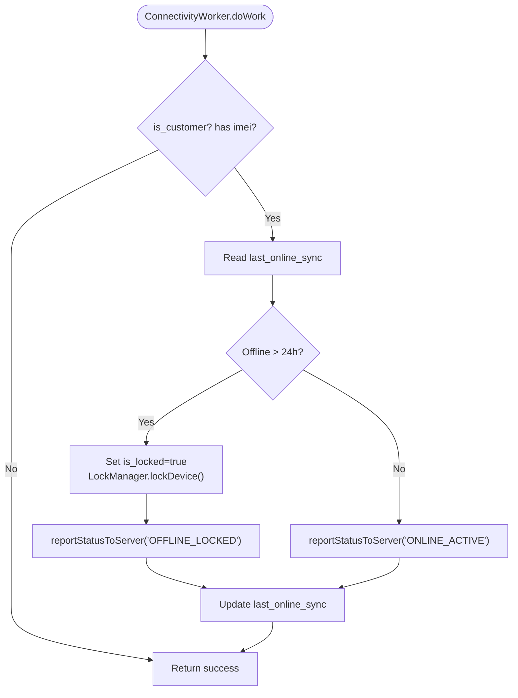
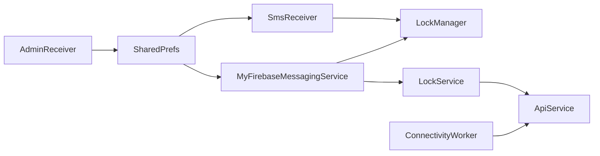

# Communication & Command Processing

<cite>
**Referenced Files in This Document**
- [SmsReceiver.kt](file://app/src/main/java/com/pksafe/lock/manager/receiver/SmsReceiver.kt)
- [MyFirebaseMessagingService.kt](file://app/src/main/java/com/pksafe/lock/manager/service/MyFirebaseMessagingService.kt)
- [ApiService.kt](file://app/src/main/java/com/pksafe/lock/manager/data/ApiService.kt)
- [Models.kt](file://app/src/main/java/com/pksafe/lock/manager/data/Models.kt)
- [LockManager.kt](file://app/src/main/java/com/pksafe/lock/manager/util/LockManager.kt)
- [LockService.kt](file://app/src/main/java/com/pksafe/lock/manager/service/LockService.kt)
- [AdminReceiver.kt](file://app/src/main/java/com/pksafe/lock/manager/receiver/AdminReceiver.kt)
- [ConnectivityWorker.kt](file://app/src/main/java/com/pksafe/lock/manager/service/ConnectivityWorker.kt)
- [Constants.kt](file://app/src/main/java/com/pksafe/lock/manager/util/Constants.kt)
</cite>

## Table of Contents
1. Introduction
2. Project Structure
3. Core Components
4. Architecture Overview
5. Detailed Component Analysis
6. Dependency Analysis
7. Performance Considerations
8. Troubleshooting Guide
9. Conclusion

## Introduction
This document explains the PK Locker communication systems that enable multi-channel command processing and real-time synchronization between an admin dashboard and customer devices. It covers:
- Offline SMS-based lock/unlock with SHA-256 code validation and dual IMEI fallback
- Firebase Cloud Messaging (FCM) for push notifications and real-time device control
- Retrofit-based REST API client for authentication, error handling, and data synchronization
- End-to-end command flows from admin to device execution, offline processing scenarios, and network connectivity fallbacks
- Security considerations for command validation and message integrity

## Project Structure
The communication stack spans receivers, services, utilities, and data layers:
- Receivers handle incoming events (SMS, boot, SIM changes)
- Services enforce locks, manage overlays, and process FCM commands
- Utilities implement Device Policy Manager controls and system-level restrictions
- Data layer defines Retrofit endpoints and models for server communication
- Background workers monitor connectivity and trigger offline safeguards

**Diagram sources**
- [MyFirebaseMessagingService.kt:22-223](file://app/src/main/java/com/pksafe/lock/manager/service/MyFirebaseMessagingService.kt#L22-L223)
- [SmsReceiver.kt:44-143](file://app/src/main/java/com/pksafe/lock/manager/receiver/SmsReceiver.kt#L44-L143)
- [ConnectivityWorker.kt:17-70](file://app/src/main/java/com/pksafe/lock/manager/service/ConnectivityWorker.kt#L17-L70)
- [LockService.kt:50-314](file://app/src/main/java/com/pksafe/lock/manager/service/LockService.kt#L50-L314)
- [AdminReceiver.kt:16-102](file://app/src/main/java/com/pksafe/lock/manager/receiver/AdminReceiver.kt#L16-L102)
- [ApiService.kt:11-185](file://app/src/main/java/com/pksafe/lock/manager/data/ApiService.kt#L11-L185)

**Section sources**
- [SmsReceiver.kt:44-143](file://app/src/main/java/com/pksafe/lock/manager/receiver/SmsReceiver.kt#L44-L143)
- [MyFirebaseMessagingService.kt:22-223](file://app/src/main/java/com/pksafe/lock/manager/service/MyFirebaseMessagingService.kt#L22-L223)
- [ApiService.kt:11-185](file://app/src/main/java/com/pksafe/lock/manager/data/ApiService.kt#L11-L185)
- [LockManager.kt:111-148](file://app/src/main/java/com/pksafe/lock/manager/util/LockManager.kt#L111-L148)
- [LockService.kt:50-314](file://app/src/main/java/com/pksafe/lock/manager/service/LockService.kt#L50-L314)
- [AdminReceiver.kt:16-102](file://app/src/main/java/com/pksafe/lock/manager/receiver/AdminReceiver.kt#L16-L102)
- [ConnectivityWorker.kt:17-70](file://app/src/main/java/com/pksafe/lock/manager/service/ConnectivityWorker.kt#L17-L70)
- [Constants.kt:3-10](file://app/src/main/java/com/pksafe/lock/manager/util/Constants.kt#L3-L10)

## Core Components
- SMS Receiver: Validates offline lock/unlock commands using SHA-256 codes derived from device IMEIs; supports dual IMEI fallback and persisted codes from backend.
- FCM Service: Processes push commands for locking, unlocking, hardware blocks, app blocking, configuration changes, deregistration, and status requests.
- Retrofit API Client: Defines endpoints for authentication, device management, EMI operations, key orders, and status reporting; used by UI and background components.
- Lock Manager: Applies Device Policy Manager restrictions, manages overlay service lifecycle, and provides granular controls (camera, USB, install/uninstall, calls, reset, safe boot).
- Lock Service: Foreground overlay enforcing lock state, auto-lock on connectivity loss, live refresh of EMI data via API, and emergency unlock via dynamic master code.
- Admin Receiver: On provisioning completion, grants critical permissions and fetches dual IMEI into shared preferences for offline SMS validation.
- Connectivity Worker: Periodically checks online status; if offline beyond threshold, triggers local lock and attempts to report status to server.

**Section sources**
- [SmsReceiver.kt:31-42](file://app/src/main/java/com/pksafe/lock/manager/receiver/SmsReceiver.kt#L31-L42)
- [SmsReceiver.kt:64-92](file://app/src/main/java/com/pksafe/lock/manager/receiver/SmsReceiver.kt#L64-L92)
- [MyFirebaseMessagingService.kt:47-223](file://app/src/main/java/com/pksafe/lock/manager/service/MyFirebaseMessagingService.kt#L47-L223)
- [ApiService.kt:11-185](file://app/src/main/java/com/pksafe/lock/manager/data/ApiService.kt#L11-L185)
- [LockManager.kt:111-148](file://app/src/main/java/com/pksafe/lock/manager/util/LockManager.kt#L111-L148)
- [LockService.kt:82-105](file://app/src/main/java/com/pksafe/lock/manager/service/LockService.kt#L82-L105)
- [AdminReceiver.kt:43-102](file://app/src/main/java/com/pksafe/lock/manager/receiver/AdminReceiver.kt#L43-L102)
- [ConnectivityWorker.kt:17-70](file://app/src/main/java/com/pksafe/lock/manager/service/ConnectivityWorker.kt#L17-L70)

## Architecture Overview
PK Locker uses a hybrid architecture combining offline SMS commands and online FCM pushes, synchronized through shared preferences and periodic connectivity checks. The flow ensures robust enforcement even when internet is unavailable.

**Diagram sources**
- [ApiService.kt:46-56](file://app/src/main/java/com/pksafe/lock/manager/data/ApiService.kt#L46-L56)
- [MyFirebaseMessagingService.kt:47-68](file://app/src/main/java/com/pksafe/lock/manager/service/MyFirebaseMessagingService.kt#L47-L68)
- [LockManager.kt:111-134](file://app/src/main/java/com/pksafe/lock/manager/util/LockManager.kt#L111-L134)
- [LockService.kt:125-234](file://app/src/main/java/com/pksafe/lock/manager/service/LockService.kt#L125-L234)

## Detailed Component Analysis

### SMS Receiver: Offline Lock/Unlock with SHA-256 Validation and Dual IMEI Fallback
- Purpose: Accept LOCK#code and UNLOCK#code SMS messages without internet.
- Code generation: Uses SHA-256 of "LOCK_{imei}" or "UNLOCK_{imei}" to compute expected codes.
- Fallback mechanism: Collects valid codes from:
  - Backend-provided codes saved in shared preferences
  - Dynamically generated codes from both IMEIs stored during provisioning
- Execution: On valid code match, updates lock state and invokes LockManager to apply restrictions and start overlay.

**Diagram sources**
- [SmsReceiver.kt:44-143](file://app/src/main/java/com/pksafe/lock/manager/receiver/SmsReceiver.kt#L44-L143)
- [SmsReceiver.kt:31-42](file://app/src/main/java/com/pksafe/lock/manager/receiver/SmsReceiver.kt#L31-L42)
- [AdminReceiver.kt:43-102](file://app/src/main/java/com/pksafe/lock/manager/receiver/AdminReceiver.kt#L43-L102)

**Section sources**
- [SmsReceiver.kt:31-42](file://app/src/main/java/com/pksafe/lock/manager/receiver/SmsReceiver.kt#L31-L42)
- [SmsReceiver.kt:64-92](file://app/src/main/java/com/pksafe/lock/manager/receiver/SmsReceiver.kt#L64-L92)
- [SmsReceiver.kt:94-141](file://app/src/main/java/com/pksafe/lock/manager/receiver/SmsReceiver.kt#L94-L141)
- [AdminReceiver.kt:43-102](file://app/src/main/java/com/pksafe/lock/manager/receiver/AdminReceiver.kt#L43-L102)

### Firebase Cloud Messaging: Push Notifications and Real-Time Device Status Updates
- Purpose: Receive remote commands and immediately enforce device policies.
- Supported commands:
  - Lock/unlock and toggle states
  - Hardware blocks (USB, camera, settings, alarm, install/uninstall, calls, factory reset, safe boot)
  - App blocking via Device Owner or SharedPrefs fallback
  - Configuration changes (wallpaper)
  - Unlock all and deregister (full release)
  - Request data (location, phone info)
- Enforcement: Starts LockService directly, triggers full-screen lock notification, wakes screen, and applies restrictions via LockManager.

**Diagram sources**
- [MyFirebaseMessagingService.kt:22-223](file://app/src/main/java/com/pksafe/lock/manager/service/MyFirebaseMessagingService.kt#L22-L223)
- [LockManager.kt:111-148](file://app/src/main/java/com/pksafe/lock/manager/util/LockManager.kt#L111-L148)
- [LockService.kt:125-234](file://app/src/main/java/com/pksafe/lock/manager/service/LockService.kt#L125-L234)

**Section sources**
- [MyFirebaseMessagingService.kt:47-223](file://app/src/main/java/com/pksafe/lock/manager/service/MyFirebaseMessagingService.kt#L47-L223)
- [MyFirebaseMessagingService.kt:226-307](file://app/src/main/java/com/pksafe/lock/manager/service/MyFirebaseMessagingService.kt#L226-L307)

### REST API Client: Retrofit Implementation, Authentication, Error Handling, Sync
- Purpose: Provide typed endpoints for authentication, device management, EMI scheduling, key orders, and status reporting.
- Authentication: Bearer token passed via Authorization header; tokens stored in shared preferences and injected per call.
- Error handling: ViewModels and services check response.isSuccessful and log errors; background workers catch exceptions and continue gracefully.
- Synchronization: ConnectivityWorker reports heartbeat or offline lock status; LockService fetches live EMI data to update overlay.

**Diagram sources**
- [ApiService.kt:11-185](file://app/src/main/java/com/pksafe/lock/manager/data/ApiService.kt#L11-L185)

**Section sources**
- [ApiService.kt:11-185](file://app/src/main/java/com/pksafe/lock/manager/data/ApiService.kt#L11-L185)
- [Models.kt:7-255](file://app/src/main/java/com/pksafe/lock/manager/data/Models.kt#L7-L255)
- [ConnectivityWorker.kt:49-70](file://app/src/main/java/com/pksafe/lock/manager/service/ConnectivityWorker.kt#L49-L70)
- [LockService.kt:240-314](file://app/src/main/java/com/pksafe/lock/manager/service/LockService.kt#L240-L314)

### Lock Manager: Device Policy Controls and Enforcement
- Purpose: Centralize Device Policy Manager interactions and system-level restrictions.
- Capabilities:
  - Lock/unlock device, start overlay service, apply hard restrictions
  - Disable camera, USB file transfer, install/uninstall, outgoing calls, factory reset, safe boot
  - Hide apps via Device Owner mapping to package names
  - Toggle warning alarm and set wallpaper
  - Self-deactivate to remove Device Owner and Admin privileges
- Safety: Guards against running on admin devices; ensures accessibility service enabled via secure settings.

**Diagram sources**
- [LockManager.kt:27-405](file://app/src/main/java/com/pksafe/lock/manager/util/LockManager.kt#L27-L405)

**Section sources**
- [LockManager.kt:111-148](file://app/src/main/java/com/pksafe/lock/manager/util/LockManager.kt#L111-L148)
- [LockManager.kt:151-200](file://app/src/main/java/com/pksafe/lock/manager/util/LockManager.kt#L151-L200)
- [LockManager.kt:204-291](file://app/src/main/java/com/pksafe/lock/manager/util/LockManager.kt#L204-L291)
- [LockManager.kt:299-405](file://app/src/main/java/com/pksafe/lock/manager/util/LockManager.kt#L299-L405)

### Lock Service: Overlay Enforcement and Live Refresh
- Purpose: Maintain persistent lock overlay, enforce auto-lock on connectivity loss, and refresh EMI data from server.
- Features:
  - Foreground service with high-priority notification
  - Auto-lock receiver triggers lock when offline and auto-lock enabled
  - Dynamic master unlock code based on last 6 digits of IMEI
  - Live refresh via Retrofit to update shop name, support phone, EMI amount, due date

**Diagram sources**
- [LockService.kt:50-314](file://app/src/main/java/com/pksafe/lock/manager/service/LockService.kt#L50-L314)

**Section sources**
- [LockService.kt:82-105](file://app/src/main/java/com/pksafe/lock/manager/service/LockService.kt#L82-L105)
- [LockService.kt:125-234](file://app/src/main/java/com/pksafe/lock/manager/service/LockService.kt#L125-L234)
- [LockService.kt:240-314](file://app/src/main/java/com/pksafe/lock/manager/service/LockService.kt#L240-L314)

### Connectivity Worker: Offline Guard and Heartbeat
- Purpose: Ensure devices remain protected when offline too long; periodically report status to server.
- Behavior:
  - If last sync older than 24 hours, locally lock device and attempt to notify server
  - Otherwise, send ONLINE_ACTIVE heartbeat
  - Uses Retrofit to call advanced control endpoint with Bearer token

**Diagram sources**
- [ConnectivityWorker.kt:17-70](file://app/src/main/java/com/pksafe/lock/manager/service/ConnectivityWorker.kt#L17-L70)

**Section sources**
- [ConnectivityWorker.kt:17-70](file://app/src/main/java/com/pksafe/lock/manager/service/ConnectivityWorker.kt#L17-L70)

## Dependency Analysis
- Coupling:
  - MyFirebaseMessagingService depends on LockManager and LockService for enforcement
  - SmsReceiver depends on LockManager and shared preferences for offline validation
  - ConnectivityWorker depends on ApiService and LockManager for offline safeguards
  - LockService depends on ApiService for live data refresh and on LockManager for emergency unlock
- Cohesion:
  - LockManager centralizes Device Policy Manager usage, improving cohesion around restrictions
  - ApiService encapsulates all backend endpoints, improving maintainability
- External dependencies:
  - Firebase Cloud Messaging for push delivery
  - Retrofit for HTTP communication
  - Android Device Policy Manager for enterprise controls

**Diagram sources**
- [MyFirebaseMessagingService.kt:22-223](file://app/src/main/java/com/pksafe/lock/manager/service/MyFirebaseMessagingService.kt#L22-L223)
- [SmsReceiver.kt:44-143](file://app/src/main/java/com/pksafe/lock/manager/receiver/SmsReceiver.kt#L44-L143)
- [ConnectivityWorker.kt:17-70](file://app/src/main/java/com/pksafe/lock/manager/service/ConnectivityWorker.kt#L17-L70)
- [LockService.kt:240-314](file://app/src/main/java/com/pksafe/lock/manager/service/LockService.kt#L240-L314)
- [AdminReceiver.kt:43-102](file://app/src/main/java/com/pksafe/lock/manager/receiver/AdminReceiver.kt#L43-L102)

**Section sources**
- [MyFirebaseMessagingService.kt:22-223](file://app/src/main/java/com/pksafe/lock/manager/service/MyFirebaseMessagingService.kt#L22-L223)
- [SmsReceiver.kt:44-143](file://app/src/main/java/com/pksafe/lock/manager/receiver/SmsReceiver.kt#L44-L143)
- [ConnectivityWorker.kt:17-70](file://app/src/main/java/com/pksafe/lock/manager/service/ConnectivityWorker.kt#L17-L70)
- [LockService.kt:240-314](file://app/src/main/java/com/pksafe/lock/manager/service/LockService.kt#L240-L314)
- [AdminReceiver.kt:43-102](file://app/src/main/java/com/pksafe/lock/manager/receiver/AdminReceiver.kt#L43-L102)

## Performance Considerations
- Minimize main-thread work in FCM handlers; use Handler delays only where necessary for overlay startup.
- Use foreground services for lock overlay to ensure persistence and visibility.
- Batch preference updates and avoid excessive writes; commit atomic changes for critical flags.
- Network calls should be offloaded to background threads; Retrofit coroutines are used appropriately.
- Avoid redundant API calls; cache device status locally and refresh periodically.

[No sources needed since this section provides general guidance]

## Troubleshooting Guide
- SMS not triggering lock/unlock:
  - Verify is_customer flag and IMEI presence in shared preferences
  - Confirm SHA-256 code generation matches backend logic
  - Check logs for invalid code attempts
- FCM commands ignored:
  - Ensure device is not marked as admin; admin devices are protected from remote locking
  - Validate command payload keys and values
- Overlay not showing:
  - Confirm overlay permission granted and service started in foreground mode
  - Check for exceptions in LockService creation and window manager setup
- Connectivity issues:
  - Review ConnectivityWorker logs for offline lock triggers
  - Ensure BASE_URL is correctly configured for production or development
- Deregistration failures:
  - Verify Device Owner and Admin privileges can be removed
  - Check that all restrictions are cleared before removing Device Owner

**Section sources**
- [SmsReceiver.kt:64-92](file://app/src/main/java/com/pksafe/lock/manager/receiver/SmsReceiver.kt#L64-L92)
- [MyFirebaseMessagingService.kt:40-45](file://app/src/main/java/com/pksafe/lock/manager/service/MyFirebaseMessagingService.kt#L40-L45)
- [LockService.kt:54-80](file://app/src/main/java/com/pksafe/lock/manager/service/LockService.kt#L54-L80)
- [ConnectivityWorker.kt:17-70](file://app/src/main/java/com/pksafe/lock/manager/service/ConnectivityWorker.kt#L17-L70)
- [Constants.kt:3-10](file://app/src/main/java/com/pksafe/lock/manager/util/Constants.kt#L3-L10)

## Conclusion
PK Locker’s communication system combines offline SMS validation with online FCM-driven controls to ensure reliable device management under varying connectivity conditions. The design emphasizes security through deterministic code validation, robust fallback mechanisms, and strict enforcement via Device Policy Manager. Retrofit-based APIs provide structured communication for authentication, synchronization, and operational controls, while background workers safeguard devices against prolonged offline periods. Together, these components deliver a resilient, multi-channel command processing pipeline suitable for real-world deployment.

[No sources needed since this section summarizes without analyzing specific files]