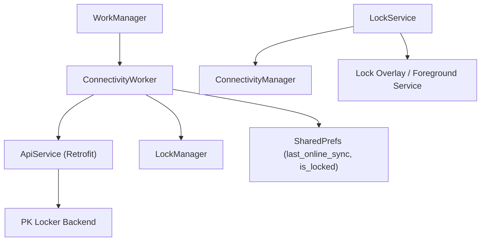
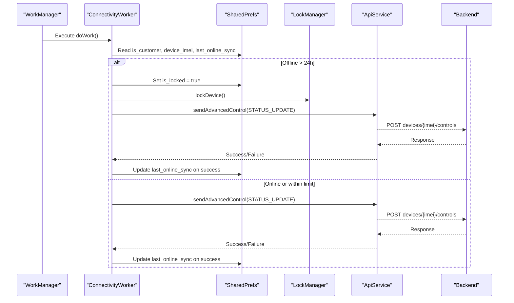
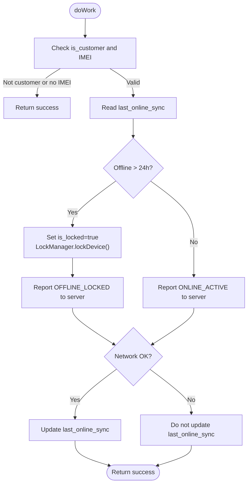
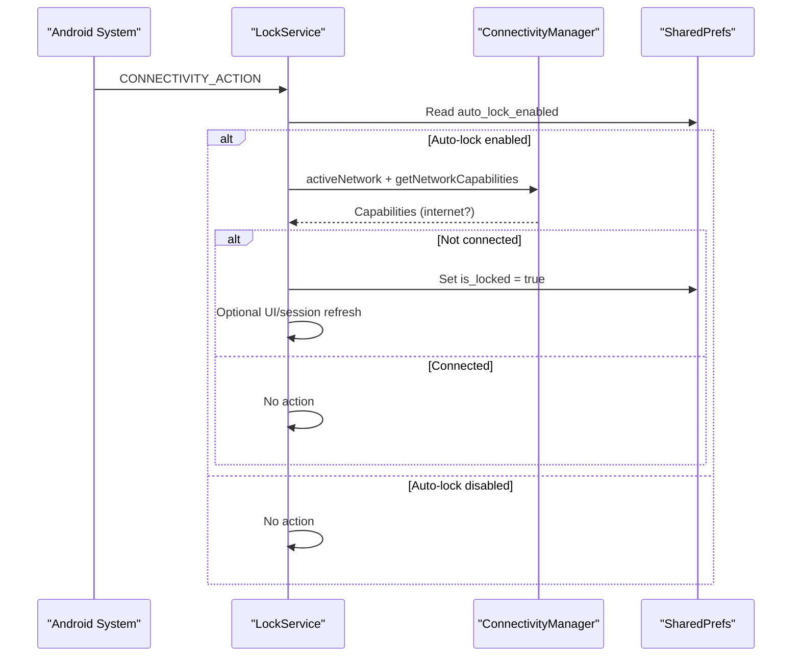
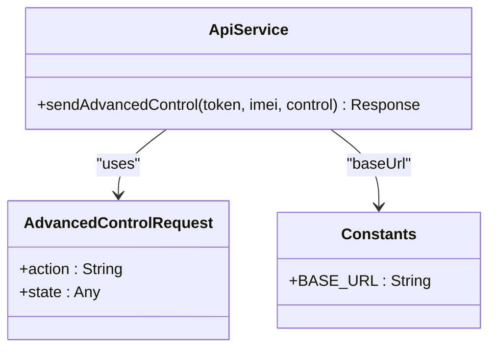
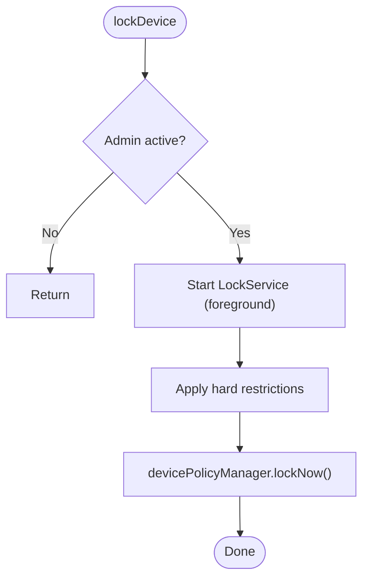
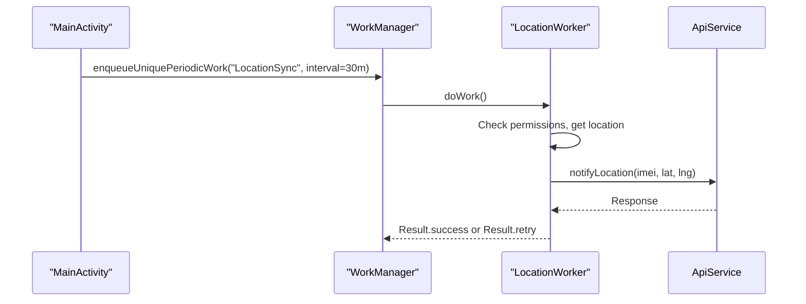
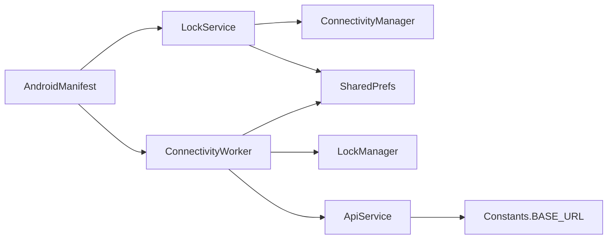

# Network Connectivity Management

<cite>
**Referenced Files in This Document**
- [ConnectivityWorker.kt](file://app/src/main/java/com/pksafe/lock/manager/service/ConnectivityWorker.kt)
- [LockService.kt](file://app/src/main/java/com/pksafe/lock/manager/service/LockService.kt)
- [ApiService.kt](file://app/src/main/java/com/pksafe/lock/manager/data/ApiService.kt)
- [Models.kt](file://app/src/main/java/com/pksafe/lock/manager/data/Models.kt)
- [LockManager.kt](file://app/src/main/java/com/pksafe/lock/manager/util/LockManager.kt)
- [Constants.kt](file://app/src/main/java/com/pksafe/lock/manager/util/Constants.kt)
- [MainActivity.kt](file://app/src/main/java/com/pksafe/lock/manager/MainActivity.kt)
- [AndroidManifest.xml](file://app/src/main/AndroidManifest.xml)
</cite>

## Table of Contents
1. Introduction
2. Project Structure
3. Core Components
4. Architecture Overview
5. Detailed Component Analysis
6. Dependency Analysis
7. Performance Considerations
8. Troubleshooting Guide
9. Conclusion

## Introduction
This document explains how PK Locker manages network connectivity and synchronization. It focuses on the background worker that monitors connectivity state, enforces offline safety policies, and synchronizes with the server when possible. It also covers fallback behavior between online and offline modes, command queuing via WorkManager retry, automatic retries, integration points with Android connectivity APIs, and practical examples of state transitions and conflict resolution after extended offline periods.

## Project Structure
The connectivity management spans a few key components:
- A background worker that periodically checks connectivity and syncs status or triggers local lock if offline too long.
- A foreground service that listens to connectivity broadcasts and can enforce auto-lock when internet is lost.
- An API layer for reporting device status and receiving remote commands.
- A lock manager that applies device restrictions and locks the screen when needed.
- App configuration (base URL) and scheduling logic in the main activity.

**Diagram sources**
- [ConnectivityWorker.kt:15-70](file://app/src/main/java/com/pksafe/lock/manager/service/ConnectivityWorker.kt#L15-L70)
- [LockService.kt:82-105](file://app/src/main/java/com/pksafe/lock/manager/service/LockService.kt#L82-L105)
- [ApiService.kt:58-63](file://app/src/main/java/com/pksafe/lock/manager/data/ApiService.kt#L58-L63)
- [LockManager.kt:111-134](file://app/src/main/java/com/pksafe/lock/manager/util/LockManager.kt#L111-L134)
- [Constants.kt:3-10](file://app/src/main/java/com/pksafe/lock/manager/util/Constants.kt#L3-L10)

**Section sources**
- [ConnectivityWorker.kt:15-70](file://app/src/main/java/com/pksafe/lock/manager/service/ConnectivityWorker.kt#L15-L70)
- [LockService.kt:82-105](file://app/src/main/java/com/pksafe/lock/manager/service/LockService.kt#L82-L105)
- [ApiService.kt:58-63](file://app/src/main/java/com/pksafe/lock/manager/data/ApiService.kt#L58-L63)
- [LockManager.kt:111-134](file://app/src/main/java/com/pksafe/lock/manager/util/LockManager.kt#L111-L134)
- [Constants.kt:3-10](file://app/src/main/java/com/pksafe/lock/manager/util/Constants.kt#L3-L10)

## Core Components
- ConnectivityWorker: Periodically runs to report device status or enforce local lock when offline beyond a threshold. Updates last sync time on success.
- LockService: Registers a broadcast receiver for connectivity changes and can trigger auto-lock when internet drops while auto-lock is enabled.
- ApiService: Retrofit interface used to send advanced control/status updates and other device operations.
- LockManager: Applies device policy restrictions and locks the device using Device Policy Manager.
- MainActivity: Schedules periodic work for location sync; similar patterns apply for connectivity-related scheduling.
- Constants: Centralized base URL for backend calls.

Key responsibilities:
- Monitor connectivity state and decide whether to heartbeat or enforce offline lock.
- Persist last successful sync timestamp to avoid repeated locking.
- Use WorkManager’s retry semantics to queue failed sync attempts.
- Enforce local security controls when offline thresholds are exceeded.

**Section sources**
- [ConnectivityWorker.kt:15-70](file://app/src/main/java/com/pksafe/lock/manager/service/ConnectivityWorker.kt#L15-L70)
- [LockService.kt:82-105](file://app/src/main/java/com/pksafe/lock/manager/service/LockService.kt#L82-L105)
- [ApiService.kt:58-63](file://app/src/main/java/com/pksafe/lock/manager/data/ApiService.kt#L58-L63)
- [LockManager.kt:111-134](file://app/src/main/java/com/pksafe/lock/manager/util/LockManager.kt#L111-L134)
- [MainActivity.kt:467-476](file://app/src/main/java/com/pksafe/lock/manager/MainActivity.kt#L467-L476)
- [Constants.kt:3-10](file://app/src/main/java/com/pksafe/lock/manager/util/Constants.kt#L3-L10)

## Architecture Overview
The system uses a hybrid approach:
- Background periodic execution via WorkManager to ensure connectivity checks even when the app is not in the foreground.
- Real-time connectivity change handling via a BroadcastReceiver in a foreground service to react quickly to network drops.
- Server synchronization through Retrofit with token-based authentication.
- Local enforcement via Device Policy Manager to secure the device during prolonged offline states.

**Diagram sources**
- [ConnectivityWorker.kt:17-70](file://app/src/main/java/com/pksafe/lock/manager/service/ConnectivityWorker.kt#L17-L70)
- [ApiService.kt:58-63](file://app/src/main/java/com/pksafe/lock/manager/data/ApiService.kt#L58-L63)
- [LockManager.kt:111-134](file://app/src/main/java/com/pksafe/lock/manager/util/LockManager.kt#L111-L134)

## Detailed Component Analysis

### ConnectivityWorker: Monitoring and Fallback Logic
Responsibilities:
- Determine if the device belongs to a customer and has an IMEI.
- Compare last successful sync time against a 24-hour threshold.
- If offline too long, set local lock flag and invoke device lock via LockManager.
- Always attempt to report status to the server; update last sync time on success.
- Use WorkManager’s retry mechanism implicitly by returning appropriate results from workers that call network endpoints.

**Diagram sources**
- [ConnectivityWorker.kt:17-70](file://app/src/main/java/com/pksafe/lock/manager/service/ConnectivityWorker.kt#L17-L70)

**Section sources**
- [ConnectivityWorker.kt:17-70](file://app/src/main/java/com/pksafe/lock/manager/service/ConnectivityWorker.kt#L17-L70)

### LockService: Connectivity Broadcast Handling
Responsibilities:
- Register a BroadcastReceiver for connectivity changes.
- When auto-lock is enabled and connectivity is lost, mark device as locked locally.
- Provide an isOnline check using ConnectivityManager and NetworkCapabilities.

**Diagram sources**
- [LockService.kt:82-105](file://app/src/main/java/com/pksafe/lock/manager/service/LockService.kt#L82-L105)

**Section sources**
- [LockService.kt:82-105](file://app/src/main/java/com/pksafe/lock/manager/service/LockService.kt#L82-L105)

### API Integration and Data Models
- The worker reports device status using the advanced control endpoint.
- The request model includes an action and state payload.
- Authentication is passed via Authorization header with a Bearer token stored in SharedPrefs.

**Diagram sources**
- [ApiService.kt:58-63](file://app/src/main/java/com/pksafe/lock/manager/data/ApiService.kt#L58-L63)
- [Models.kt:216-219](file://app/src/main/java/com/pksafe/lock/manager/data/Models.kt#L216-L219)
- [Constants.kt:3-10](file://app/src/main/java/com/pksafe/lock/manager/util/Constants.kt#L3-L10)

**Section sources**
- [ApiService.kt:58-63](file://app/src/main/java/com/pksafe/lock/manager/data/ApiService.kt#L58-L63)
- [Models.kt:216-219](file://app/src/main/java/com/pksafe/lock/manager/data/Models.kt#L216-L219)
- [Constants.kt:3-10](file://app/src/main/java/com/pksafe/lock/manager/util/Constants.kt#L3-L10)

### LockManager: Enforcement Actions
Responsibilities:
- Start the lock overlay service.
- Apply hardware restrictions via Device Policy Manager.
- Lock the screen after a short delay.

**Diagram sources**
- [LockManager.kt:111-134](file://app/src/main/java/com/pksafe/lock/manager/util/LockManager.kt#L111-L134)

**Section sources**
- [LockManager.kt:111-134](file://app/src/main/java/com/pksafe/lock/manager/util/LockManager.kt#L111-L134)

### Scheduling and Background Sync
- Location sync is scheduled using WorkManager with a periodic request. Connectivity monitoring follows a similar pattern conceptually, ensuring background execution.
- The main activity schedules periodic tasks and ensures permissions are granted before running background tasks.

**Diagram sources**
- [MainActivity.kt:467-476](file://app/src/main/java/com/pksafe/lock/manager/MainActivity.kt#L467-L476)
- [ApiService.kt:83-87](file://app/src/main/java/com/pksafe/lock/manager/data/ApiService.kt#L83-L87)

**Section sources**
- [MainActivity.kt:467-476](file://app/src/main/java/com/pksafe/lock/manager/MainActivity.kt#L467-L476)

## Dependency Analysis
- ConnectivityWorker depends on SharedPrefs for state, LockManager for enforcement, and ApiService for server communication.
- LockService depends on ConnectivityManager to detect connectivity changes and on SharedPrefs for user preferences.
- ApiService depends on Retrofit and Constants for base URL configuration.
- AndroidManifest declares necessary permissions and services/receivers required for connectivity and background execution.

**Diagram sources**
- [ConnectivityWorker.kt:15-70](file://app/src/main/java/com/pksafe/lock/manager/service/ConnectivityWorker.kt#L15-L70)
- [LockService.kt:82-105](file://app/src/main/java/com/pksafe/lock/manager/service/LockService.kt#L82-L105)
- [ApiService.kt:58-63](file://app/src/main/java/com/pksafe/lock/manager/data/ApiService.kt#L58-L63)
- [Constants.kt:3-10](file://app/src/main/java/com/pksafe/lock/manager/util/Constants.kt#L3-L10)
- [AndroidManifest.xml:5-23](file://app/src/main/AndroidManifest.xml#L5-L23)
- [AndroidManifest.xml:73-155](file://app/src/main/AndroidManifest.xml#L73-L155)

**Section sources**
- [AndroidManifest.xml:5-23](file://app/src/main/AndroidManifest.xml#L5-L23)
- [AndroidManifest.xml:73-155](file://app/src/main/AndroidManifest.xml#L73-L155)

## Performance Considerations
- Battery conservation:
  - Use WorkManager for background tasks to leverage system scheduling and doze mode compatibility.
  - Avoid tight polling loops; rely on periodic intervals and connectivity broadcasts for responsiveness.
- Network efficiency:
  - Batch status updates where possible; the current design sends a single status update per run.
  - Reuse Retrofit instances or centralize configuration to reduce overhead.
- Concurrency:
  - Ensure network calls run off the main thread (already using coroutines in workers).
- Memory:
  - Avoid holding large objects in receivers or workers; keep logic minimal and stateless where possible.

[No sources needed since this section provides general guidance]

## Troubleshooting Guide
Common issues and diagnostics:
- Connectivity not detected:
  - Verify ConnectivityManager usage and capabilities check in LockService.
  - Confirm INTERNET permission and network security configuration in AndroidManifest.
- Worker not executing:
  - Check WorkManager logs and constraints; ensure device idle requirements are met if any are set.
- Server sync failures:
  - Validate Authorization header and token retrieval from SharedPrefs.
  - Inspect API response codes and handle retries appropriately.
- Auto-lock not triggering:
  - Ensure auto_lock_enabled flag is set and broadcast receiver is registered.
  - Confirm connectivity broadcast actions are received.

Practical steps:
- Enable detailed logging in ConnectivityWorker and LockService around connectivity checks and API calls.
- Use adb logcat filters for tags like OFFLINE_GUARD, AUTO_LOCK, LOCATION_WORKER.
- Test across WiFi, mobile data, and airplane mode scenarios to validate behavior.

**Section sources**
- [ConnectivityWorker.kt:49-70](file://app/src/main/java/com/pksafe/lock/manager/service/ConnectivityWorker.kt#L49-L70)
- [LockService.kt:82-105](file://app/src/main/java/com/pksafe/lock/manager/service/LockService.kt#L82-L105)
- [AndroidManifest.xml:5-23](file://app/src/main/AndroidManifest.xml#L5-L23)

## Conclusion
PK Locker’s connectivity management combines robust background scheduling with real-time connectivity monitoring. ConnectivityWorker enforces offline safety by locking the device after a defined threshold and keeps the server informed when possible. LockService reacts immediately to connectivity changes to enforce auto-lock when configured. Together, these components provide reliable fallback mechanisms, efficient synchronization, and strong device security under varying network conditions.

[No sources needed since this section summarizes without analyzing specific files]