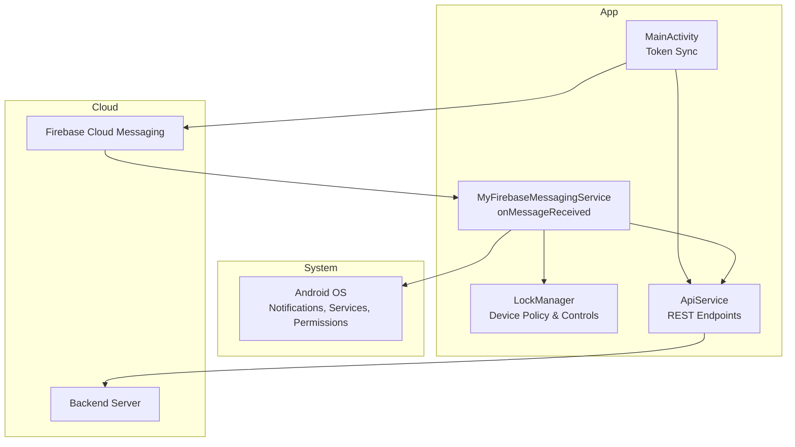
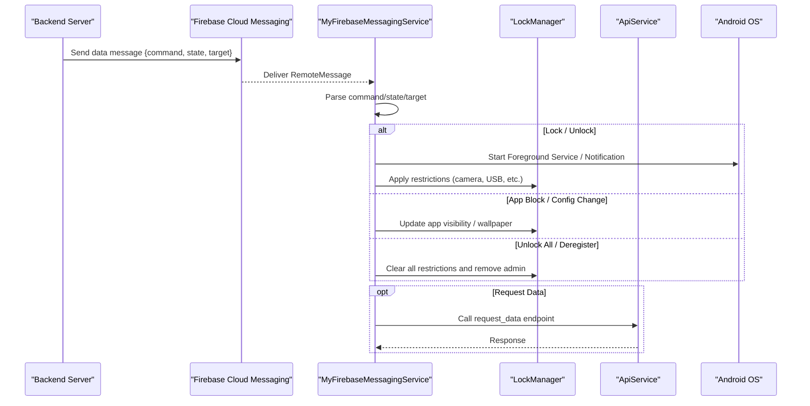
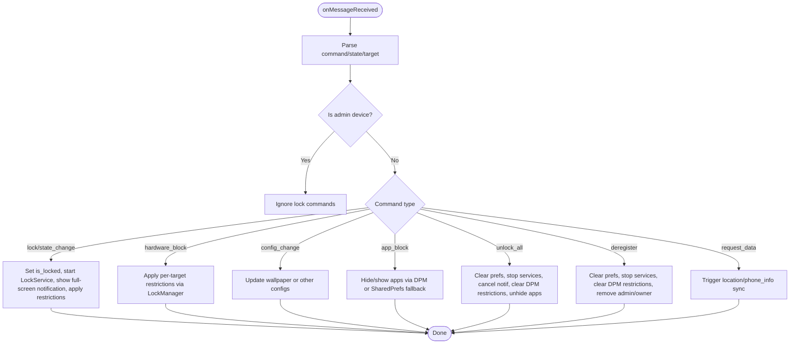
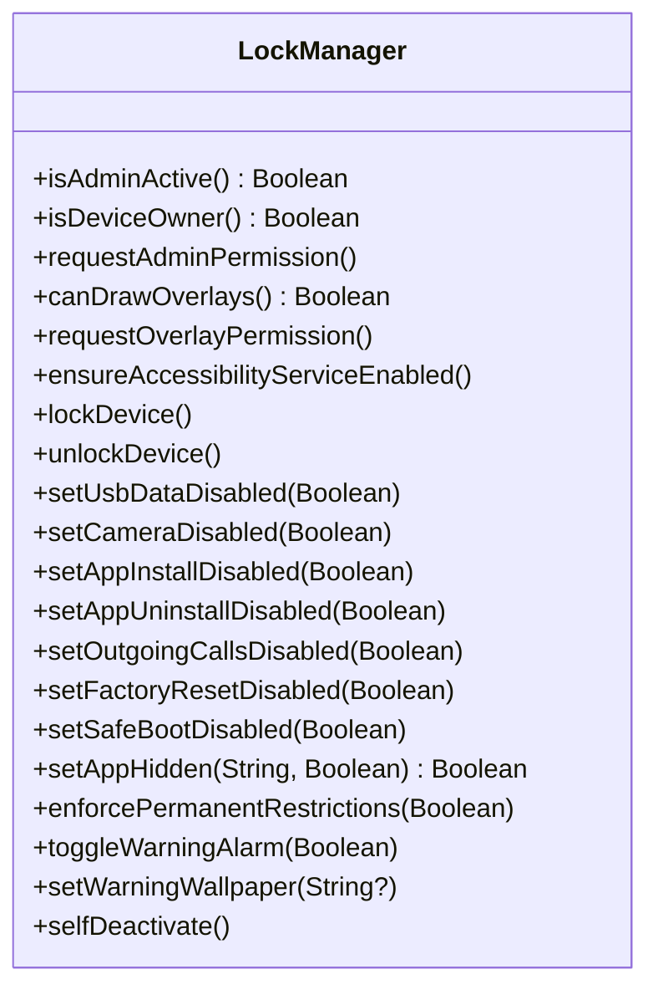
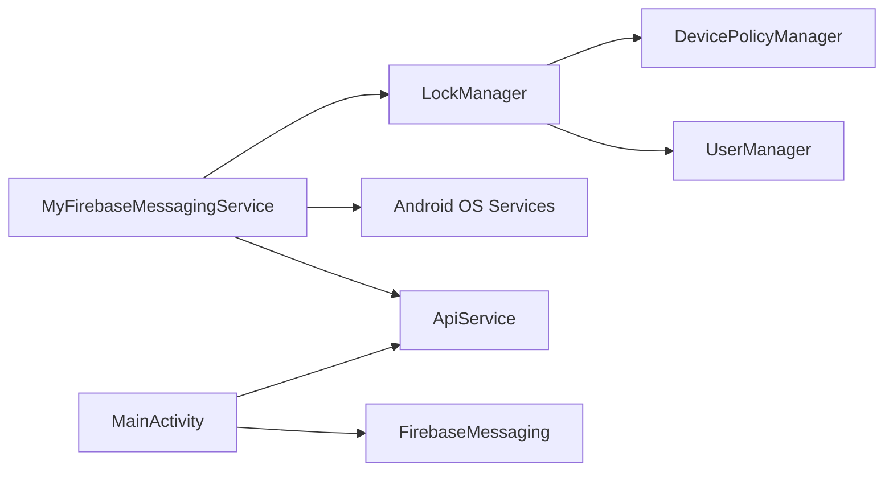

# Push Notifications & Firebase Integration

<cite>
**Referenced Files in This Document**
- [MyFirebaseMessagingService.kt](file://app/src/main/java/com/pksafe/lock/manager/service/MyFirebaseMessagingService.kt)
- [ApiService.kt](file://app/src/main/java/com/pksafe/lock/manager/data/ApiService.kt)
- [Models.kt](file://app/src/main/java/com/pksafe/lock/manager/data/Models.kt)
- [LockManager.kt](file://app/src/main/java/com/pksafe/lock/manager/util/LockManager.kt)
- [MainActivity.kt](file://app/src/main/java/com/pksafe/lock/manager/MainActivity.kt)
- [AndroidManifest.xml](file://app/src/main/AndroidManifest.xml)
- [google-services.json](file://app/google-services.json)
</cite>

## Table of Contents
1. [Introduction](#introduction)
2. [Project Structure](#project-structure)
3. [Core Components](#core-components)
4. [Architecture Overview](#architecture-overview)
5. [Detailed Component Analysis](#detailed-component-analysis)
6. [Dependency Analysis](#dependency-analysis)
7. [Performance Considerations](#performance-considerations)
8. [Troubleshooting Guide](#troubleshooting-guide)
9. [Conclusion](#conclusion)
10. [Appendices](#appendices)

## Introduction
This document explains the push notification system powered by Firebase Cloud Messaging (FCM) in the PK Locker application. It focuses on how MyFirebaseMessagingService receives and processes remote commands from the backend to enforce device controls, synchronize state with the server via ApiService, and maintain robust offline behavior. It also covers payload structure, authentication mechanisms, error handling strategies, performance optimization, battery considerations, and debugging approaches for FCM integration issues.

## Project Structure
The FCM integration spans several key components:
- Service layer: MyFirebaseMessagingService handles incoming messages and triggers device actions.
- Data layer: ApiService defines REST endpoints used to register devices, update tokens, lock/unlock devices, and sync status.
- Utilities: LockManager enforces Device Policy Manager restrictions and manages app visibility and hardware features.
- UI entrypoint: MainActivity registers and synchronizes the FCM token with the backend.
- Manifest and configuration: AndroidManifest declares services and permissions; google-services.json configures FCM for multiple package names.

**Diagram sources**
- [MainActivity.kt:334-353](file://app/src/main/java/com/pksafe/lock/manager/MainActivity.kt#L334-L353)
- [MyFirebaseMessagingService.kt:22-224](file://app/src/main/java/com/pksafe/lock/manager/service/MyFirebaseMessagingService.kt#L22-L224)
- [ApiService.kt:11-185](file://app/src/main/java/com/pksafe/lock/manager/data/ApiService.kt#L11-L185)
- [LockManager.kt:27-405](file://app/src/main/java/com/pksafe/lock/manager/util/LockManager.kt#L27-L405)
- [AndroidManifest.xml:73-85](file://app/src/main/AndroidManifest.xml#L73-L85)

**Section sources**
- [AndroidManifest.xml:1-160](file://app/src/main/AndroidManifest.xml#L1-L160)
- [google-services.json:1-67](file://app/google-services.json#L1-L67)

## Core Components
- MyFirebaseMessagingService: Parses command payloads, applies device restrictions, starts foreground services, shows critical notifications, and handles special commands like unlock_all and deregister.
- LockManager: Centralizes Device Policy Manager operations to block USB, camera, settings changes, factory reset, safe boot, outgoing calls, and hide apps. Provides self-deactivation to remove admin privileges.
- ApiService: Retrofit interface exposing endpoints for device registration, locking/unlocking, advanced controls, token updates, location/SIM change notifications, and more.
- MainActivity: Retrieves the FCM token and synchronizes it to the backend for both customer and shopkeeper flows.

**Section sources**
- [MyFirebaseMessagingService.kt:22-224](file://app/src/main/java/com/pksafe/lock/manager/service/MyFirebaseMessagingService.kt#L22-L224)
- [LockManager.kt:27-405](file://app/src/main/java/com/pksafe/lock/manager/util/LockManager.kt#L27-L405)
- [ApiService.kt:11-185](file://app/src/main/java/com/pksafe/lock/manager/data/ApiService.kt#L11-L185)
- [MainActivity.kt:334-353](file://app/src/main/java/com/pksafe/lock/manager/MainActivity.kt#L334-L353)

## Architecture Overview
The flow begins when the backend sends an FCM data message to the device. The service parses the command and executes corresponding actions using LockManager. For certain commands, it also synchronizes state or requests data via ApiService. Critical lock events trigger a high-priority notification and a full-screen intent to bring up the lock UI. Token synchronization occurs at app startup to ensure the backend can target the correct device.

**Diagram sources**
- [MyFirebaseMessagingService.kt:22-224](file://app/src/main/java/com/pksafe/lock/manager/service/MyFirebaseMessagingService.kt#L22-L224)
- [ApiService.kt:65-99](file://app/src/main/java/com/pksafe/lock/manager/data/ApiService.kt#L65-L99)
- [LockManager.kt:110-192](file://app/src/main/java/com/pksafe/lock/manager/util/LockManager.kt#L110-L192)

## Detailed Component Analysis

### MyFirebaseMessagingService: Command Processing and Enforcement
- Message parsing: Extracts command, state, and target from the data payload. Supports backward compatibility by mapping legacy payloads without a command to a toggle behavior.
- Admin protection: Ignores lock signals on administrative devices to prevent accidental lockdowns.
- Commands supported:
  - Lock/Unlock: Persists lock state, starts LockService directly if needed, triggers full-screen lock notification, and applies restrictions via LockManager.
  - Hardware blocks: Toggles USB, camera, settings, auto-lock, alarm, install/uninstall, outgoing calls, factory reset, safe boot based on target.
  - Configuration changes: Updates warning wallpaper URL.
  - App blocking: Uses Device Owner APIs to hide apps; falls back to shared preferences and accessibility-based blocking if not device owner.
  - Unlock all: Clears all restrictions, stops services, cancels notifications, and removes admin privileges.
  - Deregister: Fully releases device ownership and admin rights so the app can be uninstalled.
  - Request data: Placeholder for one-time location or phone info retrieval.
- Notifications: Creates a high-importance channel and posts a persistent notification with full-screen intent to force the lock UI.
- Wake-up: Acquires a short wake lock to ensure overlay and services start reliably.

**Diagram sources**
- [MyFirebaseMessagingService.kt:22-224](file://app/src/main/java/com/pksafe/lock/manager/service/MyFirebaseMessagingService.kt#L22-L224)

**Section sources**
- [MyFirebaseMessagingService.kt:22-309](file://app/src/main/java/com/pksafe/lock/manager/service/MyFirebaseMessagingService.kt#L22-L309)

### LockManager: Device Policy and Control Enforcement
- Enforces permanent restrictions for customers (factory reset, USB file transfer, debugging).
- Applies granular controls: camera disabled, USB blocked, install/uninstall blocked, outgoing calls blocked, safe boot blocked, status bar disabled, keyguard disabled.
- Hides apps via Device Policy Manager setApplicationHidden with package name mapping; falls back to shared preferences and accessibility-based blocking when not device owner.
- Self-deactivation: Clears all user restrictions, removes device owner, and removes active admin so the app becomes uninstallable.

**Diagram sources**
- [LockManager.kt:27-405](file://app/src/main/java/com/pksafe/lock/manager/util/LockManager.kt#L27-L405)

**Section sources**
- [LockManager.kt:27-405](file://app/src/main/java/com/pksafe/lock/manager/util/LockManager.kt#L27-L405)

### ApiService: Synchronization and Control Endpoints
Key endpoints relevant to push-driven workflows:
- Token management: updateFcmToken, updateShopkeeperFcmToken
- Device control: lockDevice, unlockDevice, sendAdvancedControl, unlockAllControls
- Status reporting: notifySimChanged, notifyLocation
- Customer view: getDeviceStatus

Authentication:
- Authorization header is required for most endpoints. In the current implementation, token passing varies by call site; ensure consistent authorization headers are provided where needed.

**Section sources**
- [ApiService.kt:11-185](file://app/src/main/java/com/pksafe/lock/manager/data/ApiService.kt#L11-L185)

### MainActivity: FCM Token Registration and Sync
- Retrieves the FCM token asynchronously and persists it locally.
- Syncs the token to the backend for customer devices using IMEI, and for shopkeeper sessions using auth token.
- Ensures background location scheduling for periodic status updates.

**Section sources**
- [MainActivity.kt:334-353](file://app/src/main/java/com/pksafe/lock/manager/MainActivity.kt#L334-L353)
- [MainActivity.kt:448-463](file://app/src/main/java/com/pksafe/lock/manager/MainActivity.kt#L448-L463)

## Dependency Analysis
- MyFirebaseMessagingService depends on:
  - LockManager for enforcing device policies and managing app visibility.
  - Android OS services for notifications, foreground services, and wake locks.
  - Optional ApiService for data requests triggered by push commands.
- MainActivity depends on:
  - FirebaseMessaging for token acquisition.
  - ApiService for token synchronization.
- LockManager depends on:
  - DevicePolicyManager and UserManager for enterprise-level controls.
  - Accessibility services and shared preferences for fallback behaviors.

**Diagram sources**
- [MyFirebaseMessagingService.kt:22-224](file://app/src/main/java/com/pksafe/lock/manager/service/MyFirebaseMessagingService.kt#L22-L224)
- [LockManager.kt:27-405](file://app/src/main/java/com/pksafe/lock/manager/util/LockManager.kt#L27-L405)
- [MainActivity.kt:334-353](file://app/src/main/java/com/pksafe/lock/manager/MainActivity.kt#L334-L353)
- [ApiService.kt:11-185](file://app/src/main/java/com/pksafe/lock/manager/data/ApiService.kt#L11-L185)

**Section sources**
- [MyFirebaseMessagingService.kt:22-224](file://app/src/main/java/com/pksafe/lock/manager/service/MyFirebaseMessagingService.kt#L22-L224)
- [LockManager.kt:27-405](file://app/src/main/java/com/pksafe/lock/manager/util/LockManager.kt#L27-L405)
- [MainActivity.kt:334-353](file://app/src/main/java/com/pksafe/lock/manager/MainActivity.kt#L334-L353)
- [ApiService.kt:11-185](file://app/src/main/java/com/pksafe/lock/manager/data/ApiService.kt#L11-L185)

## Performance Considerations
- Minimize work in onMessageReceived: Keep parsing and dispatching fast; delegate heavy operations to background threads or services.
- Use foreground services judiciously: Start LockService only when necessary and stop promptly after unlocking or deregistration.
- Avoid excessive wake locks: The current implementation uses a short wake lock to ensure overlay startup; ensure it is released quickly to conserve battery.
- Batch or throttle network calls: When syncing status or requesting data, avoid redundant calls; consider debouncing or coalescing requests.
- Leverage Device Policy Manager efficiently: Group restriction changes where possible to reduce overhead.
- Notification channels: Reuse existing channels and avoid recreating them unnecessarily.

[No sources needed since this section provides general guidance]

## Troubleshooting Guide
Common issues and remedies:
- FCM token not syncing:
  - Ensure MainActivity retrieves the token and calls the update endpoint. Check logs for token sync success/failure.
  - Verify google-services.json contains the correct package name and API keys.
- Messages not received:
  - Confirm MyFirebaseMessagingService is declared in AndroidManifest with the correct intent filter.
  - Check device network connectivity and FCM delivery logs on the backend.
- Lock not applied:
  - Validate that Device Admin/Device Owner privileges are active before applying restrictions.
  - Review LockManager logs for permission errors and ensure overlays are permitted when needed.
- Full-screen notification not showing:
  - Ensure USE_FULL_SCREEN_INTENT permission is granted and notification channel has high importance.
  - On newer Android versions, confirm the activity flags and pending intent are correctly configured.
- Deregistration fails:
  - Ensure all restrictions are cleared before removing device owner/admin; check for exceptions during selfDeactivate.

**Section sources**
- [AndroidManifest.xml:73-85](file://app/src/main/AndroidManifest.xml#L73-L85)
- [google-services.json:1-67](file://app/google-services.json#L1-L67)
- [MainActivity.kt:334-353](file://app/src/main/java/com/pksafe/lock/manager/MainActivity.kt#L334-L353)
- [MyFirebaseMessagingService.kt:242-309](file://app/src/main/java/com/pksafe/lock/manager/service/MyFirebaseMessagingService.kt#L242-L309)
- [LockManager.kt:351-405](file://app/src/main/java/com/pksafe/lock/manager/util/LockManager.kt#L351-L405)

## Conclusion
The PK Locker push notification system leverages FCM to deliver real-time device control commands. MyFirebaseMessagingService interprets structured payloads and enforces device policies through LockManager, while maintaining synchronization with the backend via ApiService. Robust error handling, admin protections, and fallback mechanisms ensure reliable operation across diverse device states. Proper configuration in AndroidManifest and google-services.json, combined with careful performance tuning and thorough debugging practices, supports a resilient and secure enforcement workflow.

[No sources needed since this section summarizes without analyzing specific files]

## Appendices

### Notification Payload Structure
- Fields:
  - command: Enumerated action such as lock, unlock, hardware_block, app_block, config_change, unlock_all, deregister, request_data.
  - state: Boolean-like string indicating enable/disable or true/false.
  - target: Specific feature or app identifier depending on command (e.g., usb, camera, whatsapp).
- Backward compatibility: If command is missing but state exists, treated as a lock toggle.

**Section sources**
- [MyFirebaseMessagingService.kt:27-35](file://app/src/main/java/com/pksafe/lock/manager/service/MyFirebaseMessagingService.kt#L27-L35)

### Authentication Mechanisms
- FCM token synchronization:
  - MainActivity obtains the token and calls updateFcmToken with IMEI or shopkeeper context.
- API authorization:
  - Most ApiService endpoints require an Authorization header; ensure tokens are attached consistently in production flows.

**Section sources**
- [MainActivity.kt:334-353](file://app/src/main/java/com/pksafe/lock/manager/MainActivity.kt#L334-L353)
- [ApiService.kt:11-185](file://app/src/main/java/com/pksafe/lock/manager/data/ApiService.kt#L11-L185)

### Error Handling Strategies
- Graceful degradation:
  - If Device Owner is unavailable, app blocking falls back to shared preferences and accessibility-based blocking.
- Exception logging:
  - Extensive logging around service starts, notification creation, and policy changes aids diagnostics.
- Safe cleanup:
  - Unlock all and deregister commands systematically clear restrictions and remove admin privileges to avoid partial states.

**Section sources**
- [MyFirebaseMessagingService.kt:101-119](file://app/src/main/java/com/pksafe/lock/manager/service/MyFirebaseMessagingService.kt#L101-L119)
- [MyFirebaseMessagingService.kt:120-168](file://app/src/main/java/com/pksafe/lock/manager/service/MyFirebaseMessagingService.kt#L120-L168)
- [MyFirebaseMessagingService.kt:169-211](file://app/src/main/java/com/pksafe/lock/manager/service/MyFirebaseMessagingService.kt#L169-L211)
- [LockManager.kt:263-291](file://app/src/main/java/com/pksafe/lock/manager/util/LockManager.kt#L263-L291)

### Background Processing Workflows
- Foreground service:
  - LockService is started directly from FCM to ensure immediate enforcement even if the app is backgrounded or killed.
- Location and SIM updates:
  - ApiService exposes endpoints to report location and SIM changes; integrate periodic workers to keep backend informed.

**Section sources**
- [MyFirebaseMessagingService.kt:226-240](file://app/src/main/java/com/pksafe/lock/manager/service/MyFirebaseMessagingService.kt#L226-L240)
- [ApiService.kt:77-87](file://app/src/main/java/com/pksafe/lock/manager/data/ApiService.kt#L77-L87)

### Offline Queue Management
- Current approach:
  - No explicit offline queue is implemented in the analyzed files. Commands requiring network responses should handle retries and idempotency on the backend.
- Recommendations:
  - Implement a local queue (e.g., Room database or WorkManager) to persist unsent requests and retry upon connectivity restoration.
  - Use idempotent endpoints and deduplicate repeated commands to avoid unintended side effects.

[No sources needed since this section provides general guidance]

### Practical Examples of Notification Types
- Lock command:
  - command: "lock", state: true -> Enforces lock, starts LockService, displays full-screen notification, applies restrictions.
- Unlock command:
  - command: "state_change" or "unlock" with state false -> Stops LockService, clears restrictions, cancels notifications.
- Hardware block:
  - command: "hardware_block", target: "usb"/"camera"/"settings"/... -> Toggles specific device features via LockManager.
- App block:
  - command: "app_block", target: "whatsapp"/"facebook"/... -> Hides or unhides apps using Device Owner APIs with fallbacks.
- Unlock all:
  - command: "unlock_all" -> Clears all restrictions and stops enforcement immediately.
- Deregister:
  - command: "deregister" -> Removes all privileges and allows normal uninstallation.

**Section sources**
- [MyFirebaseMessagingService.kt:47-223](file://app/src/main/java/com/pksafe/lock/manager/service/MyFirebaseMessagingService.kt#L47-L223)

### Debugging Approaches for FCM Issues
- Log analysis:
  - Inspect FCM_LOG entries for message receipt, command parsing, and execution outcomes.
- Token verification:
  - Confirm token retrieval and sync in MainActivity logs; verify backend receives updated tokens.
- Permission checks:
  - Validate DEVICE_ADMIN, OVERLAY, WAKE_LOCK, and FULL_SCREEN_INTENT permissions are granted.
- Service lifecycle:
  - Monitor LockService start/stop sequences and notification creation to ensure timely enforcement.

**Section sources**
- [MyFirebaseMessagingService.kt:25-309](file://app/src/main/java/com/pksafe/lock/manager/service/MyFirebaseMessagingService.kt#L25-L309)
- [MainActivity.kt:334-353](file://app/src/main/java/com/pksafe/lock/manager/MainActivity.kt#L334-L353)
- [AndroidManifest.xml:1-160](file://app/src/main/AndroidManifest.xml#L1-L160)