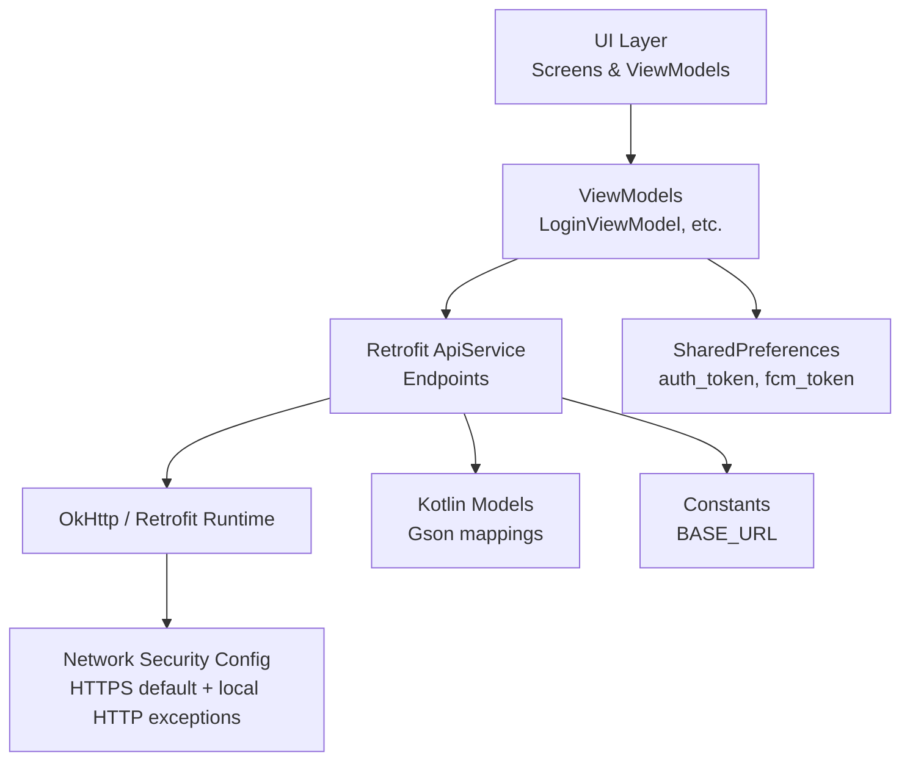
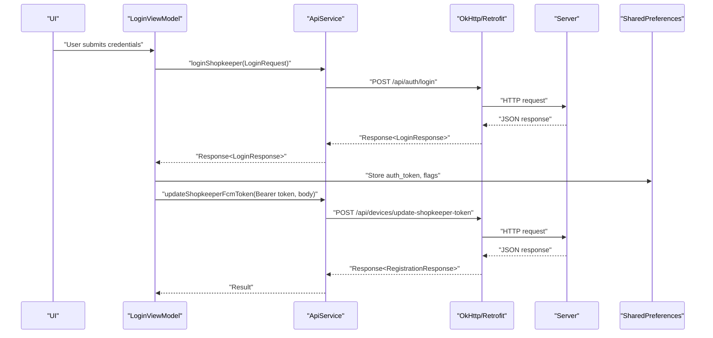
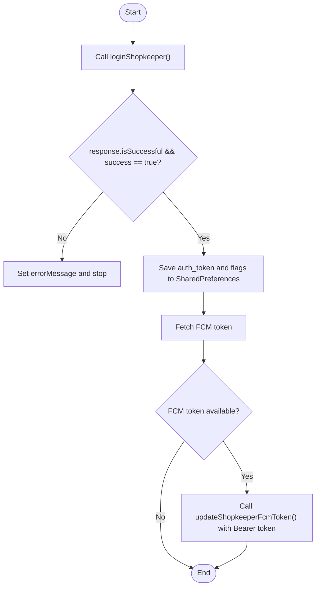
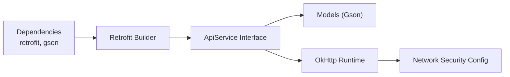

# REST API Client Implementation

<cite>
**Referenced Files in This Document**
- [ApiService.kt](file://app/src/main/java/com/pksafe/lock\manager/data/ApiService.kt)
- [Models.kt](file://app/src/main/java/com/pksafe/lock\manager/data/Models.kt)
- [Constants.kt](file://app/src/main/java/com/pksafe/lock\manager/util/Constants.kt)
- [LoginViewModel.kt](file://app/src/main/java/com/pksafe/lock\manager/ui/login/LoginViewModel.kt)
- [MainActivity.kt](file://app/src/main/java/com/pksafe/lock\manager/MainActivity.kt)
- [network_security_config.xml](file://app/src/main/res/xml/network_security_config.xml)
- [build.gradle.kts](file://app/build.gradle.kts)
- [proguard-rules.pro](file://app/proguard-rules.pro)
</cite>

## Table of Contents
1. [Introduction](#introduction)
2. [Project Structure](#project-structure)
3. [Core Components](#core-components)
4. [Architecture Overview](#architecture-overview)
5. [Detailed Component Analysis](#detailed-component-analysis)
6. [Dependency Analysis](#dependency-analysis)
7. [Performance Considerations](#performance-considerations)
8. [Troubleshooting Guide](#troubleshooting-guide)
9. [Conclusion](#conclusion)
10. [Appendices](#appendices)

## Introduction
This document explains the REST API client implementation used by PK Locker on Android. It focuses on the Retrofit-based ApiService interface, HTTP request/response handling, data serialization with Kotlin models, authentication and token management, error handling strategies, retry and caching considerations, security configuration, and testing approaches for integration and development.

## Project Structure
The API client is centered around a single Retrofit interface that declares endpoints for authentication, device management, EMI operations, key ordering, and admin controls. Data models are defined as Kotlin data classes annotated for JSON mapping. The base URL is centralized in a constants file, and network security is configured via an XML resource to enforce HTTPS by default while allowing controlled cleartext for local networks.

**Diagram sources**
- [ApiService.kt:11-185](file://app/src/main/java/com/pksafe/lock\manager/data/ApiService.kt#L11-L185)
- [Models.kt:7-255](file://app/src/main/java/com/pksafe/lock\manager/data/Models.kt#L7-L255)
- [Constants.kt:3-10](file://app/src/main/java/com/pksafe/lock\manager/util/Constants.kt#L3-L10)
- [network_security_config.xml:9-27](file://app/src/main/res/xml/network_security_config.xml#L9-L27)

**Section sources**
- [ApiService.kt:11-185](file://app/src/main/java/com/pksafe/lock\manager/data/ApiService.kt#L11-L185)
- [Models.kt:7-255](file://app/src/main/java/com/pksafe/lock\manager/data/Models.kt#L7-L255)
- [Constants.kt:3-10](file://app/src/main/java/com/pksafe/lock\manager/util/Constants.kt#L3-L10)
- [network_security_config.xml:9-27](file://app/src/main/res/xml/network_security_config.xml#L9-L27)

## Core Components
- ApiService: Declares all HTTP endpoints using Retrofit annotations. Endpoints cover shopkeeper authentication, device registration and control, analytics, EMI scheduling, key ordering, and admin approvals. Many endpoints require an Authorization header carrying a bearer token.
- Models: Kotlin data classes representing requests and responses, with Gson @SerializedName annotations to map server fields to Kotlin properties.
- Constants: Centralizes BASE_URL for the production API.
- Login flow: ViewModel calls login endpoint, stores token in SharedPreferences, and updates FCM tokens on the server.
- MainActivity: Synchronizes FCM tokens to the server for both customer and shopkeeper flows; also demonstrates ad-hoc Retrofit usage for token sync.

Key responsibilities:
- Define typed endpoints and return Response<T> for explicit success/error handling.
- Serialize/deserialize payloads using Gson through Retrofit’s converter factory.
- Manage auth tokens in persistent storage and attach them to protected endpoints.

**Section sources**
- [ApiService.kt:11-185](file://app/src/main/java/com/pksafe/lock\manager/data/ApiService.kt#L11-L185)
- [Models.kt:7-255](file://app/src/main/java/com/pksafe/lock\manager/data/Models.kt#L7-L255)
- [Constants.kt:3-10](file://app/src/main/java/com/pksafe/lock\manager/util/Constants.kt#L3-L10)
- [LoginViewModel.kt:34-87](file://app/src/main/java/com/pksafe/lock\manager/ui/login/LoginViewModel.kt#L34-L87)
- [MainActivity.kt:331-469](file://app/src/main/java/com/pksafe/lock\manager/MainActivity.kt#L331-L469)

## Architecture Overview
The client follows a layered architecture:
- UI/ViewModel layer triggers API calls.
- Retrofit ApiService defines endpoints and types.
- OkHttp/Retrofit runtime handles networking and JSON conversion.
- Network security config enforces HTTPS by default with limited cleartext allowances.
- SharedPreferences store auth tokens and app state.

**Diagram sources**
- [LoginViewModel.kt:34-87](file://app/src/main/java/com/pksafe/lock\manager/ui/login/LoginViewModel.kt#L34-L87)
- [ApiService.kt:11-75](file://app/src/main/java/com/pksafe/lock\manager/data/ApiService.kt#L11-L75)
- [Constants.kt:3-10](file://app/src/main/java/com/pksafe/lock\manager/util/Constants.kt#L3-L10)

## Detailed Component Analysis

### ApiService Interface Design
- Authentication endpoints:
  - POST /api/auth/login returns a token and shopkeeper info.
  - POST /api/auth/register creates a new shopkeeper account.
- Device management:
  - Register devices, list devices, fetch stats and analytics.
  - Lock/unlock devices, send advanced controls, update FCM tokens (device and shopkeeper).
  - Notify SIM changes and location updates.
  - Deregister devices and unlock all controls.
- Customer-facing endpoint:
  - GET /api/devices/public/{imei} returns device status and SMS codes for offline locking.
- EMI management:
  - Fetch schedule, mark paid, reschedule plan.
- Key management:
  - Checkout via SafePay, verify payment, allocate free keys, wallet pay, history.
- Admin key management:
  - List orders, submit requests, approve/reject orders.

All protected endpoints pass Authorization headers with a Bearer token.

**Section sources**
- [ApiService.kt:11-185](file://app/src/main/java/com/pksafe/lock\manager/data/ApiService.kt#L11-L185)

### HTTP Request/Response Handling
- All methods are suspend functions returning retrofit2.Response<T>, enabling explicit checks for success and parsing of body content.
- Requests use @Body for JSON payloads and @Path for path parameters.
- Responses are mapped to strongly-typed Kotlin models via Gson.

Error handling strategy:
- Check response.isSuccessful and response.body()?.success before proceeding.
- Catch network or parsing exceptions and surface user-friendly messages.
- Store tokens only after successful login and propagate errors appropriately.

**Section sources**
- [LoginViewModel.kt:34-87](file://app/src/main/java/com/pksafe/lock\manager/ui/login/LoginViewModel.kt#L34-L87)
- [ApiService.kt:11-185](file://app/src/main/java/com/pksafe/lock\manager/data/ApiService.kt#L11-L185)

### Data Serialization with Kotlin Models
- Models use @SerializedName to map server field names to Kotlin properties.
- Request/response structures include nested objects for complex payloads (e.g., Shopkeeper, DeviceControls, EmiScheduleData).
- Gson converter is added via Retrofit builder in build dependencies.

Serialization best practices:
- Keep model classes immutable (data classes).
- Use nullable fields where appropriate to handle partial responses.
- Ensure ProGuard rules keep annotated fields and data classes.

**Section sources**
- [Models.kt:7-255](file://app/src/main/java/com/pksafe/lock\manager/data/Models.kt#L7-L255)
- [proguard-rules.pro:22-40](file://app/proguard-rules.pro#L22-L40)
- [build.gradle.kts:100-101](file://app/build.gradle.kts#L100-L101)

### Authentication Mechanisms
- Token acquisition:
  - Login endpoint returns a token stored in SharedPreferences.
- Token usage:
  - Protected endpoints receive Authorization header with Bearer token.
- Session handling:
  - Flags like is_logged_in, is_admin, and is_customer are persisted alongside the token.
- FCM token synchronization:
  - After login, the shopkeeper FCM token is updated on the server.
  - For customers, the device FCM token is synced when available.

**Diagram sources**
- [LoginViewModel.kt:34-87](file://app/src/main/java/com/pksafe/lock\manager/ui/login/LoginViewModel.kt#L34-L87)
- [ApiService.kt:11-75](file://app/src/main/java/com/pksafe/lock\manager/data/ApiService.kt#L11-L75)

**Section sources**
- [LoginViewModel.kt:34-87](file://app/src/main/java/com/pksafe/lock\manager/ui/login/LoginViewModel.kt#L34-L87)
- [MainActivity.kt:331-469](file://app/src/main/java/com/pksafe/lock\manager/MainActivity.kt#L331-L469)

### Security Considerations
- HTTPS enforcement:
  - Network security config sets cleartextTrafficPermitted=false by default.
  - Cleartext allowed only for private IP ranges and localhost for local device communication.
- Trust anchors:
  - System certificates are trusted by default.
- SSL pinning:
  - Not implemented in the current codebase; consider adding certificate pinning for high-security environments.
- Input validation:
  - Validate inputs at the UI/ViewModel layer before sending to the API.
  - Rely on server-side validation for critical fields.
- Protection against MITM:
  - Enforce HTTPS and avoid custom trust managers unless necessary.
  - Restrict cleartext to known safe domains/IPs.

**Section sources**
- [network_security_config.xml:9-27](file://app/src/main/res/xml/network_security_config.xml#L9-L27)

### Practical Examples of Common API Calls
- Device registration:
  - Endpoint: POST /api/devices/register
  - Requires Authorization header and DeviceRegistrationRequest body.
- Status updates:
  - Endpoint: GET /api/devices/stats
  - Requires Authorization header; returns StatsResponse.
- Bulk operations:
  - Unlock all controls: POST /api/devices/{imei}/unlock-all
  - Requires Authorization header and IMEI path parameter.
- FCM token updates:
  - Device token: POST /api/devices/update-token
  - Shopkeeper token: POST /api/devices/update-shopkeeper-token

These examples demonstrate typical patterns for authenticated requests and payload structures.

**Section sources**
- [ApiService.kt:19-99](file://app/src/main/java/com/pksafe/lock\manager/data/ApiService.kt#L19-L99)

### Retry Mechanisms
- Current implementation does not include built-in retry logic in the Retrofit setup.
- Recommended approach:
  - Implement an OkHttp Interceptor to detect transient errors (e.g., timeouts, 5xx) and retry with exponential backoff.
  - Limit retries to prevent excessive network load.
  - Avoid retrying idempotent vs non-idempotent requests indiscriminately.

[No sources needed since this section provides general guidance]

### Caching Strategies
- Current implementation does not configure HTTP caching.
- Recommended approach:
  - Use OkHttp Cache for read-only endpoints (e.g., device lists, stats) with appropriate cache-control headers from the server.
  - Invalidate caches on write operations (lock/unlock, deregister).
  - Respect server directives and set max-age policies suitable for real-time features.

[No sources needed since this section provides general guidance]

## Dependency Analysis
- Retrofit and Gson converters are declared in the app module dependencies.
- ProGuard rules preserve Retrofit annotations, OkHttp classes, and data models to ensure runtime functionality.
- Base URL is centralized to avoid duplication and simplify environment switching.

**Diagram sources**
- [build.gradle.kts:100-101](file://app/build.gradle.kts#L100-L101)
- [proguard-rules.pro:1-40](file://app/proguard-rules.pro#L1-L40)
- [network_security_config.xml:9-27](file://app/src/main/res/xml/network_security_config.xml#L9-L27)

**Section sources**
- [build.gradle.kts:100-101](file://app/build.gradle.kts#L100-L101)
- [proguard-rules.pro:1-40](file://app/proguard-rules.pro#L1-L40)
- [Constants.kt:3-10](file://app/src/main/java/com/pksafe/lock\manager/util/Constants.kt#L3-L10)

## Performance Considerations
- Use suspend functions to avoid blocking threads.
- Minimize payload sizes by requesting only necessary fields.
- Consider pagination for large device lists if introduced later.
- Avoid redundant token updates; debounce FCM token refreshes.
- Leverage background workers for periodic tasks (e.g., location sync) already present in the app.

[No sources needed since this section provides general guidance]

## Troubleshooting Guide
Common issues and resolutions:
- Network connectivity failures:
  - Verify internet permissions and DNS resolution.
  - Check for cleartext restrictions; ensure endpoints use HTTPS or are within allowed domains/IPs.
- Authentication errors:
  - Confirm Authorization header includes valid Bearer token.
  - Re-login if token expires or becomes invalid.
- Parsing errors:
  - Ensure Gson mappings match server response structure.
  - Review ProGuard rules to keep annotated fields and data classes.
- Rate limiting:
  - Implement client-side throttling and respect server rate-limit headers if provided.
  - Add retry with backoff for transient 429 responses.

**Section sources**
- [LoginViewModel.kt:34-87](file://app/src/main/java/com/pksafe/lock\manager/ui/login/LoginViewModel.kt#L34-L87)
- [proguard-rules.pro:22-40](file://app/proguard-rules.pro#L22-L40)
- [network_security_config.xml:9-27](file://app/src/main/res/xml/network_security_config.xml#L9-L27)

## Conclusion
PK Locker’s REST API client is built around a clean Retrofit interface with strongly-typed models and centralized configuration. Authentication is handled via token persistence and header injection, while network security defaults to HTTPS with controlled cleartext exceptions. Although retry and caching are not currently implemented, they can be added via OkHttp interceptors and cache configurations. Testing should focus on integration with mocked servers and unit tests for ViewModel flows.

[No sources needed since this section summarizes without analyzing specific files]

## Appendices

### API Endpoints Summary
- Authentication:
  - POST /api/auth/login
  - POST /api/auth/register
- Devices:
  - POST /api/devices/register
  - GET /api/devices
  - GET /api/devices/deregistered
  - GET /api/devices/stats
  - GET /api/devices/dashboard-analytics
  - POST /api/devices/{imei}/lock
  - POST /api/devices/{imei}/unlock
  - POST /api/devices/{imei}/controls
  - POST /api/devices/update-token
  - POST /api/devices/update-shopkeeper-token
  - POST /api/devices/{imei}/sim-changed
  - POST /api/devices/{imei}/location
  - POST /api/devices/{imei}/unlock-all
  - POST /api/devices/{imei}/deregister
  - GET /api/devices/public/{imei}
- EMI:
  - GET /api/emis/device/{imei}
  - POST /api/emis/{emiId}/mark-paid
  - POST /api/emis/device/{imei}
- Key Orders:
  - POST /api/key-orders/checkout-safepay
  - POST /api/key-orders/verify-safepay
  - POST /api/key-orders/free-test-keys
  - POST /api/key-orders/wallet-pay
  - GET /api/key-orders/history
- Admin:
  - GET /api/admin/key-orders
  - POST /api/key-orders/request
  - POST /api/admin/key-orders/{id}/approve
  - POST /api/admin/key-orders/{id}/reject

**Section sources**
- [ApiService.kt:11-185](file://app/src/main/java/com/pksafe/lock\manager/data/ApiService.kt#L11-L185)