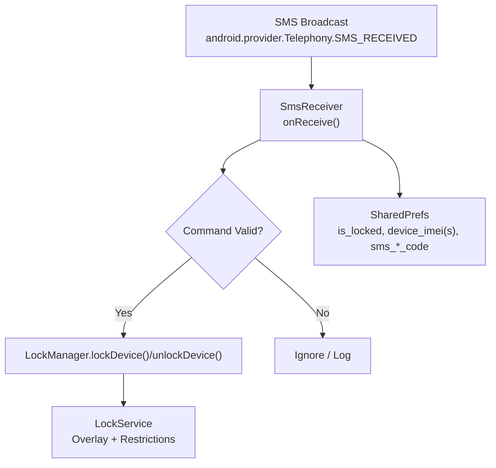
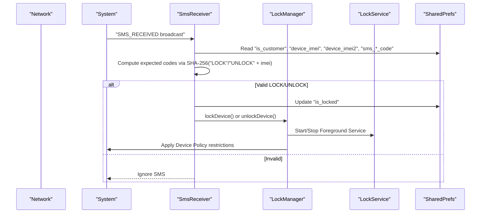
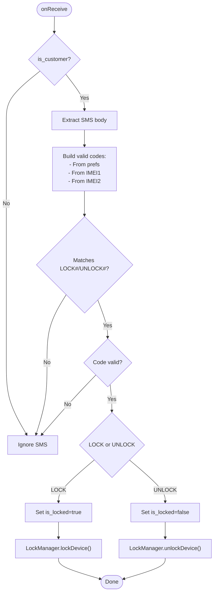
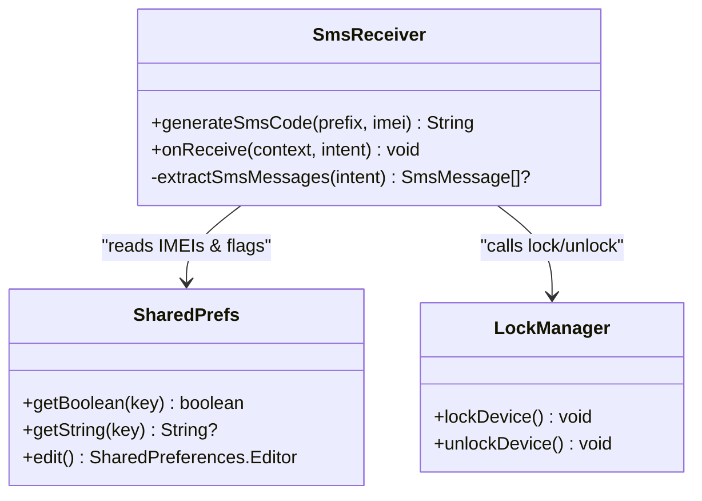
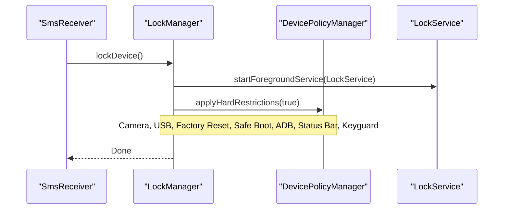
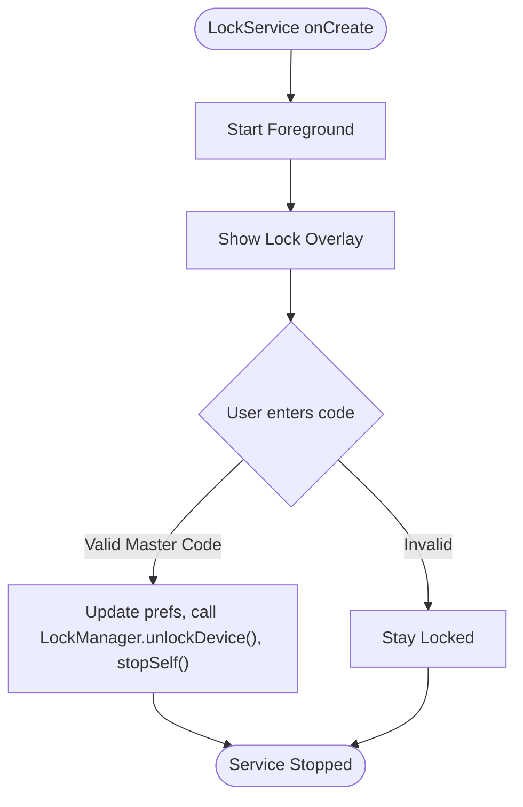
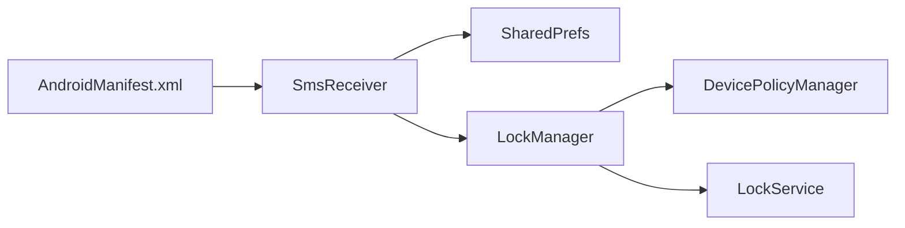

# SMS Command Processing

<cite>
**Referenced Files in This Document**
- [SmsReceiver.kt](file://app/src/main/java/com/pksafe/lock/manager/receiver/SmsReceiver.kt)
- [LockManager.kt](file://app/src/main/java/com/pksafe/lock/manager/util/LockManager.kt)
- [LockService.kt](file://app/src/main/java/com/pksafe/lock/manager/service/LockService.kt)
- [AndroidManifest.xml](file://app/src/main/AndroidManifest.xml)
- [ControlPanelScreen.kt](file://app/src/main/java/com/pksafe/lock/manager/ui/devices/ControlPanelScreen.kt)
</cite>

## Table of Contents
1. [Introduction](#introduction)
2. [Project Structure](#project-structure)
3. [Core Components](#core-components)
4. [Architecture Overview](#architecture-overview)
5. [Detailed Component Analysis](#detailed-component-analysis)
6. [Dependency Analysis](#dependency-analysis)
7. [Performance Considerations](#performance-considerations)
8. [Troubleshooting Guide](#troubleshooting-guide)
9. [Conclusion](#conclusion)
10. [Appendices](#appendices)

## Introduction
This document explains how PK Locker processes offline SMS commands to lock and unlock devices without requiring network connectivity. It covers:
- How SmsReceiver handles incoming SMS messages when the device is offline
- The SHA-256 code validation mechanism that authenticates commands
- The dual IMEI fallback mechanism for robust device identification
- Practical SMS command formats, error handling scenarios, and integration with LockManager
- Security considerations including message validation and protection against spoofed SMS

## Project Structure
The SMS command processing system spans a receiver, a service, and a manager:
- SmsReceiver listens for SMS broadcasts and validates commands locally
- LockManager applies device-level restrictions via Android Device Policy Manager
- LockService provides the persistent lock overlay and enforcement UI
- AndroidManifest registers the SMS receiver with high priority and required permissions
- ControlPanelScreen exposes UI actions to send LOCK/UNLOCK SMS using generated codes

**Diagram sources**
- [AndroidManifest.xml:132-140](file://app/src/main/AndroidManifest.xml#L132-L140)
- [SmsReceiver.kt:44-143](file://app/src/main/java/com/pksafe/lock/manager/receiver/SmsReceiver.kt#L44-L143)
- [LockManager.kt:111-148](file://app/src/main/java/com/pksafe/lock/manager/util/LockManager.kt#L111-L148)
- [LockService.kt:50-80](file://app/src/main/java/com/pksafe/lock/manager/service/LockService.kt#L50-L80)

**Section sources**
- [AndroidManifest.xml:5-23](file://app/src/main/AndroidManifest.xml#L5-L23)
- [AndroidManifest.xml:132-140](file://app/src/main/AndroidManifest.xml#L132-L140)
- [SmsReceiver.kt:16-42](file://app/src/main/java/com/pksafe/lock/manager/receiver/SmsReceiver.kt#L16-L42)

## Core Components
- SmsReceiver: Parses SMS, validates command authenticity using SHA-256 codes derived from device IMEIs or stored codes, and triggers lock/unlock operations.
- LockManager: Applies hardware and software restrictions (camera, USB, factory reset, safe boot, ADB, status bar, keyguard) and starts/stops LockService.
- LockService: Runs as a foreground service, shows an overlay, enforces input blocking, and supports emergency unlock via dynamic master code.
- AndroidManifest: Declares SMS permissions and registers SmsReceiver with high priority to intercept SMS before default apps.
- ControlPanelScreen: Provides UI to generate and send LOCK/UNLOCK SMS using deterministic codes based on device identifiers.

**Section sources**
- [SmsReceiver.kt:44-143](file://app/src/main/java/com/pksafe/lock/manager/receiver/SmsReceiver.kt#L44-L143)
- [LockManager.kt:111-192](file://app/src/main/java/com/pksafe/lock/manager/util/LockManager.kt#L111-L192)
- [LockService.kt:50-80](file://app/src/main/java/com/pksafe/lock/manager/service/LockService.kt#L50-L80)
- [AndroidManifest.xml:132-140](file://app/src/main/AndroidManifest.xml#L132-L140)
- [ControlPanelScreen.kt:608-620](file://app/src/main/java/com/pksafe/lock/manager/ui/devices/ControlPanelScreen.kt#L608-L620)

## Architecture Overview
The system is designed to operate fully offline by validating commands locally using deterministic hashes tied to device identity.

**Diagram sources**
- [SmsReceiver.kt:44-143](file://app/src/main/java/com/pksafe/lock/manager/receiver/SmsReceiver.kt#L44-L143)
- [LockManager.kt:111-148](file://app/src/main/java/com/pksafe/lock/manager/util/LockManager.kt#L111-L148)
- [LockService.kt:50-80](file://app/src/main/java/com/pksafe/lock/manager/service/LockService.kt#L50-L80)

## Detailed Component Analysis

### SmsReceiver: Offline Command Handling and Validation
- Intercepts SMS broadcasts only for customer devices flagged in preferences.
- Extracts message bodies and normalizes them to uppercase for parsing.
- Builds a set of valid codes from:
  - Stored codes in preferences (if provided by backend during provisioning)
  - Deterministic SHA-256 codes computed from both IMEIs (primary and secondary)
- Validates incoming commands:
  - LOCK#<code>: If valid, marks device as locked and calls LockManager to enforce restrictions
  - UNLOCK#<code>: If valid, marks device as unlocked and calls LockManager to remove restrictions
- Uses abortBroadcast to prevent default SMS app from seeing the command.

**Diagram sources**
- [SmsReceiver.kt:44-143](file://app/src/main/java/com/pksafe/lock/manager/receiver/SmsReceiver.kt#L44-L143)

**Section sources**
- [SmsReceiver.kt:44-143](file://app/src/main/java/com/pksafe/lock/manager/receiver/SmsReceiver.kt#L44-L143)

### Dual IMEI Fallback Mechanism
- Retrieves two IMEIs from preferences: primary ("device_imei") and secondary ("device_imei2").
- Generates deterministic codes for both IMEIs and adds them to the valid sets.
- Ensures redundancy: if one IMEI is missing or invalid, the other can still validate commands.
- Also accepts pre-stored codes from preferences if present, enabling backend-provisioned codes alongside IMEI-derived ones.

**Diagram sources**
- [SmsReceiver.kt:64-93](file://app/src/main/java/com/pksafe/lock/manager/receiver/SmsReceiver.kt#L64-L93)
- [LockManager.kt:111-148](file://app/src/main/java/com/pksafe/lock/manager/util/LockManager.kt#L111-L148)

**Section sources**
- [SmsReceiver.kt:64-93](file://app/src/main/java/com/pksafe/lock/manager/receiver/SmsReceiver.kt#L64-L93)

### LockManager: Device Control Operations
- Starts LockService as a foreground service to maintain persistent lock overlay.
- Applies hard restrictions via DevicePolicyManager:
  - Camera disabled
  - USB file transfer blocked
  - Factory reset blocked
  - Safe mode blocked
  - Debugging features blocked
  - Status bar disabled
  - Keyguard disabled (to show custom overlay)
- Removes restrictions on unlock and stops LockService.

**Diagram sources**
- [LockManager.kt:111-192](file://app/src/main/java/com/pksafe/lock/manager/util/LockManager.kt#L111-L192)

**Section sources**
- [LockManager.kt:111-192](file://app/src/main/java/com/pksafe/lock/manager/util/LockManager.kt#L111-L192)

### LockService: Persistent Enforcement and Emergency Unlock
- Runs as a foreground service with a persistent notification.
- Displays an overlay view that blocks navigation keys and captures user input.
- Supports emergency unlock using a dynamic master code derived from the last six digits of the stored IMEI; falls back to a hardcoded value if IMEI is invalid or missing.
- On successful unlock, updates preferences and calls LockManager to remove restrictions and stop itself.

**Diagram sources**
- [LockService.kt:50-80](file://app/src/main/java/com/pksafe/lock/manager/service/LockService.kt#L50-L80)
- [LockService.kt:200-218](file://app/src/main/java/com/pksafe/lock/manager/service/LockService.kt#L200-L218)

**Section sources**
- [LockService.kt:50-80](file://app/src/main/java/com/pksafe/lock/manager/service/LockService.kt#L50-L80)
- [LockService.kt:200-218](file://app/src/main/java/com/pksafe/lock/manager/service/LockService.kt#L200-L218)

### SMS Command Formats and Examples
- Format:
  - LOCK#<code>
  - UNLOCK#<code>
- Codes are either:
  - Pre-stored in preferences (from backend provisioning)
  - Deterministically generated using SHA-256 of "LOCK_<imei>" or "UNLOCK_<imei>"
- Example flows:
  - Send "LOCK#abc123..." to lock the device if the code matches any valid set
  - Send "UNLOCK#def456..." to unlock the device if the code matches any valid set

Practical notes:
- Commands are case-insensitive due to uppercasing before parsing
- Extra whitespace is trimmed
- Only customer devices process commands

**Section sources**
- [SmsReceiver.kt:58-93](file://app/src/main/java/com/pksafe/lock/manager/receiver/SmsReceiver.kt#L58-L93)
- [ControlPanelScreen.kt:608-620](file://app/src/main/java/com/pksafe/lock/manager/ui/devices/ControlPanelScreen.kt#L608-L620)

### Error Handling Scenarios
- No IMEI available: Logs an error and ignores the SMS to prevent unauthorized access.
- Invalid command format: Ignores the SMS silently after logging.
- Invalid code: Logs a warning and does not change device state.
- Exception during extraction or execution: Caught and logged; operation aborted safely.

**Section sources**
- [SmsReceiver.kt:64-71](file://app/src/main/java/com/pksafe/lock/manager/receiver/SmsReceiver.kt#L64-L71)
- [SmsReceiver.kt:138-141](file://app/src/main/java/com/pksafe/lock/manager/receiver/SmsReceiver.kt#L138-L141)
- [SmsReceiver.kt:145-162](file://app/src/main/java/com/pksafe/lock/manager/receiver/SmsReceiver.kt#L145-L162)

### Integration with LockManager
- On valid LOCK command:
  - Sets "is_locked" to true
  - Calls LockManager.lockDevice() to start LockService and apply restrictions
- On valid UNLOCK command:
  - Sets "is_locked" to false
  - Calls LockManager.unlockDevice() to stop LockService and remove restrictions

**Section sources**
- [SmsReceiver.kt:94-136](file://app/src/main/java/com/pksafe/lock/manager/receiver/SmsReceiver.kt#L94-L136)
- [LockManager.kt:111-148](file://app/src/main/java/com/pksafe/lock/manager/util/LockManager.kt#L111-L148)

## Dependency Analysis
- SmsReceiver depends on:
  - Android Telephony APIs to parse SMS
  - SharedPrefs for device flags and identifiers
  - LockManager to execute device control operations
- LockManager depends on:
  - DevicePolicyManager for enterprise controls
  - LockService for persistent overlay enforcement
- AndroidManifest configures:
  - SMS permissions
  - High-priority receiver registration

**Diagram sources**
- [AndroidManifest.xml:132-140](file://app/src/main/AndroidManifest.xml#L132-L140)
- [SmsReceiver.kt:44-143](file://app/src/main/java/com/pksafe/lock/manager/receiver/SmsReceiver.kt#L44-L143)
- [LockManager.kt:111-192](file://app/src/main/java/com/pksafe/lock/manager/util/LockManager.kt#L111-L192)

**Section sources**
- [AndroidManifest.xml:132-140](file://app/src/main/AndroidManifest.xml#L132-L140)
- [SmsReceiver.kt:44-143](file://app/src/main/java/com/pksafe/lock/manager/receiver/SmsReceiver.kt#L44-L143)
- [LockManager.kt:111-192](file://app/src/main/java/com/pksafe/lock/manager/util/LockManager.kt#L111-L192)

## Performance Considerations
- Message parsing is lightweight and runs on the main thread within BroadcastReceiver; avoid heavy work here.
- LockManager applies restrictions synchronously; ensure Device Owner privileges are active to minimize retries.
- LockService uses a foreground service to survive process death and maintain overlay visibility.
- Preference reads/writes are minimal and localized to critical paths.

[No sources needed since this section provides general guidance]

## Troubleshooting Guide
Common issues and resolutions:
- SMS ignored because device is not marked as customer: Ensure "is_customer" is set during provisioning.
- No IMEI found: Provisioning must store at least one IMEI; otherwise, validation cannot proceed.
- Invalid code errors: Verify that the sender uses the correct deterministic code derived from the device’s IMEI(s) or the pre-stored code.
- LockService not starting: Confirm Device Admin/Device Owner privileges and required permissions are granted.
- Emergency unlock fails: Check that the IMEI is valid so the dynamic master code can be computed; otherwise, use the fallback code.

**Section sources**
- [SmsReceiver.kt:49-71](file://app/src/main/java/com/pksafe/lock/manager/receiver/SmsReceiver.kt#L49-L71)
- [LockService.kt:200-218](file://app/src/main/java/com/pksafe/lock/manager/service/LockService.kt#L200-L218)

## Conclusion
PK Locker’s SMS command processing enables secure, offline device control through deterministic code validation and robust fallback mechanisms. By combining SHA-256-based authentication with dual IMEI support and strict Device Policy enforcement, the system ensures that only authorized commands can lock or unlock devices, even without network connectivity. The integration between SmsReceiver, LockManager, and LockService provides a resilient pipeline for enforcing security policies and maintaining device integrity.

[No sources needed since this section summarizes without analyzing specific files]

## Appendices

### Security Considerations
- Message encryption: Commands are not encrypted; authenticity relies on deterministic SHA-256 codes tied to device identity.
- Command validation: Both pre-stored and IMEI-derived codes are accepted; dual IMEI fallback increases resilience.
- Protection against spoofed SMS:
  - Only customer devices process commands
  - Strict code matching prevents arbitrary commands
  - High-priority receiver intercepts SMS before default apps
  - abortBroadcast hides processed commands from other apps
- Additional safeguards:
  - Emergency unlock uses a dynamic master code derived from IMEI
  - Device Policy restrictions block common bypass methods (factory reset, safe mode, ADB, USB file transfer)

**Section sources**
- [SmsReceiver.kt:49-93](file://app/src/main/java/com/pksafe/lock/manager/receiver/SmsReceiver.kt#L49-L93)
- [LockManager.kt:151-192](file://app/src/main/java/com/pksafe/lock/manager/util/LockManager.kt#L151-L192)
- [LockService.kt:200-218](file://app/src/main/java/com/pksafe/lock/manager/service/LockService.kt#L200-L218)