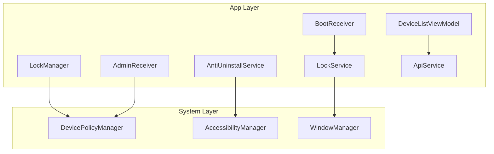
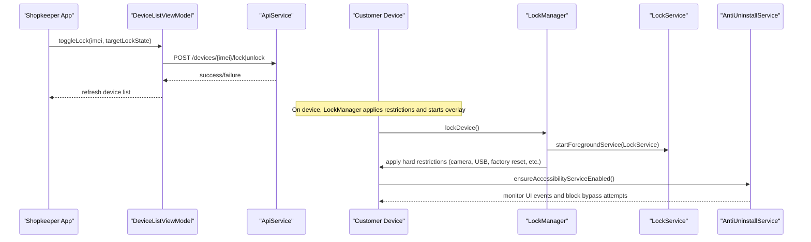
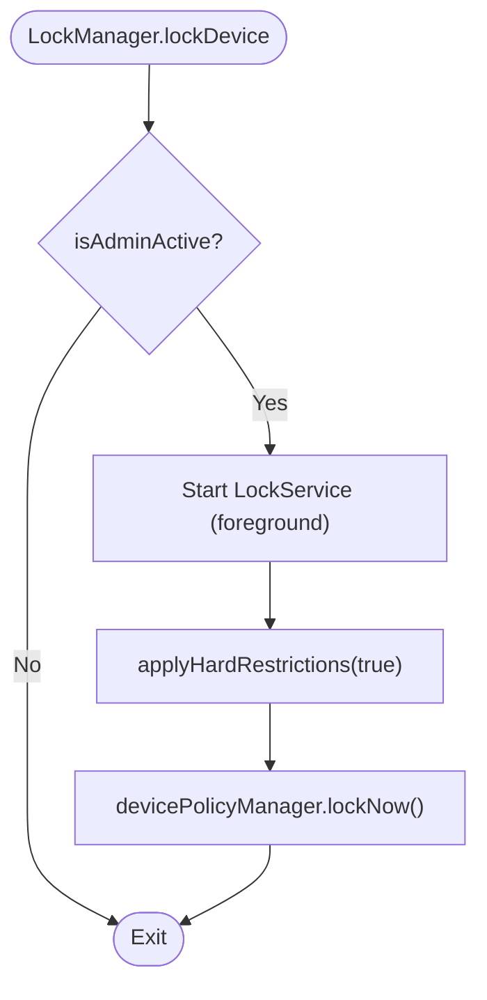
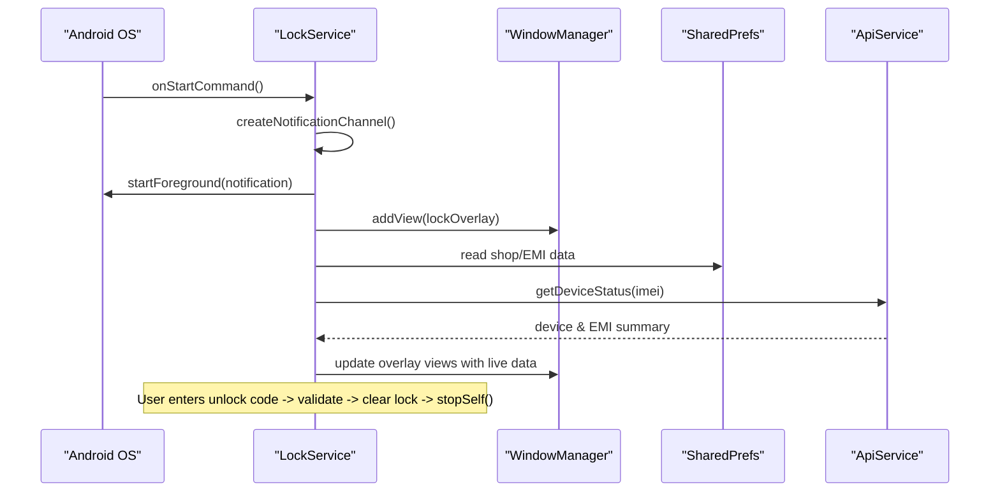
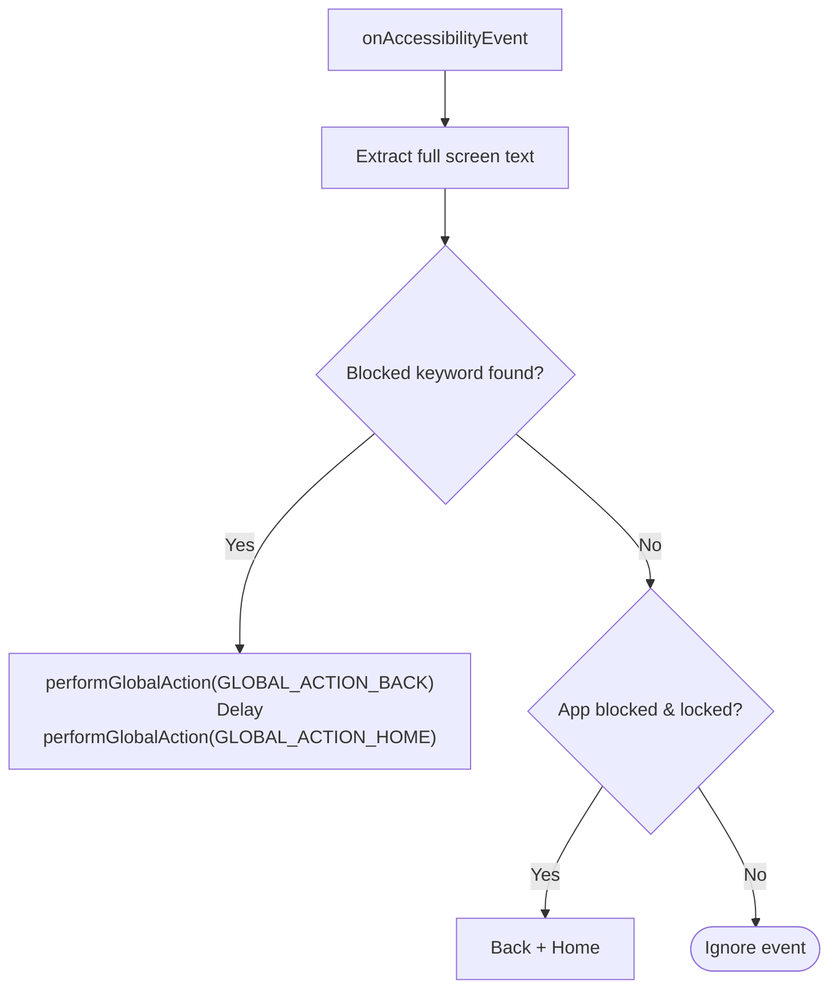
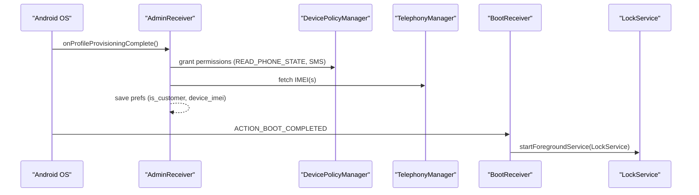
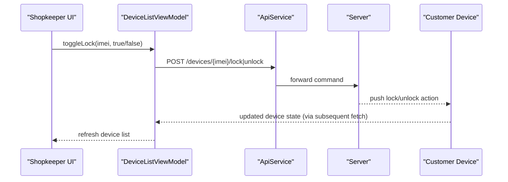
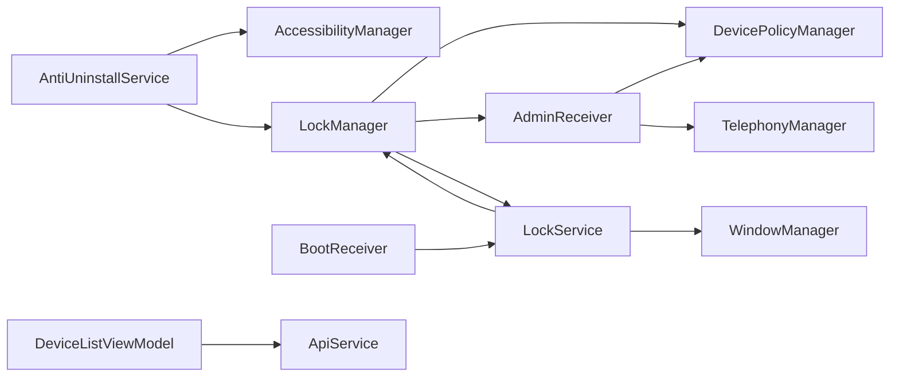

# Device Control System

<cite>
**Referenced Files in This Document**
- [LockManager.kt](file://app/src/main/java/com/pksafe/lock/manager/util/LockManager.kt)
- [AntiUninstallService.kt](file://app/src/main/java/com/pksafe/lock/manager/service/AntiUninstallService.kt)
- [LockService.kt](file://app/src/main/java/com/pksafe/lock/manager/service/LockService.kt)
- [AdminReceiver.kt](file://app/src/main/java/com/pksafe/lock/manager/receiver/AdminReceiver.kt)
- [BootReceiver.kt](file://app/src/main/java/com/pksafe/lock/manager/receiver/BootReceiver.kt)
- [accessibility_service_config.xml](file://app/src/main/res/xml/accessibility_service_config.xml)
- [device_admin_policies.xml](file://app/src/main/res/xml/device_admin_policies.xml)
- [layout_persistent_lock.xml](file://app/src/main/res/layout/layout_persistent_lock.xml)
- [DeviceListViewModel.kt](file://app/src/main/java/com/pksafe/lock/manager/ui/devices/DeviceListViewModel.kt)
- [ApiService.kt](file://app/src/main/java/com/pksafe/lock/manager/data/ApiService.kt)
</cite>

## Table of Contents
1. [Introduction](#introduction)
2. [Project Structure](#project-structure)
3. [Core Components](#core-components)
4. [Architecture Overview](#architecture-overview)
5. [Detailed Component Analysis](#detailed-component-analysis)
6. [Dependency Analysis](#dependency-analysis)
7. [Performance Considerations](#performance-considerations)
8. [Troubleshooting Guide](#troubleshooting-guide)
9. [Conclusion](#conclusion)

## Introduction
This document explains the PK Locker device control system with a focus on hardware restriction management and device lockdown capabilities. It details how LockManager integrates with Android’s Device Policy Manager to enforce camera disabling, USB port restrictions, factory reset prevention, safe boot blocking, ADB/debugging controls, status bar restrictions, and app hiding. It also documents the persistent overlay lock screen implemented via a foreground service and accessibility-based protections that prevent uninstallation or bypass attempts. Finally, it provides practical examples for shopkeepers to remotely control customer devices, configure hardware restrictions, and maintain security through system-level permissions and recovery mechanisms.

## Project Structure
The system is organized into:
- Utility layer: LockManager orchestrates device policy enforcement and app hiding.
- Services: LockService renders a persistent overlay lock screen; AntiUninstallService enforces anti-bypass behaviors using Accessibility APIs.
- Receivers: AdminReceiver handles device admin lifecycle and IMEI capture; BootReceiver restarts services after reboot.
- UI and API: DeviceListViewModel drives remote control actions via ApiService endpoints.
- Resources: XML configurations define device admin policies and accessibility service behavior; layout defines the lock overlay UI.

**Diagram sources**
- [LockManager.kt:27-46](file://app/src/main/java/com/pksafe/lock/manager/util/LockManager.kt#L27-L46)
- [LockService.kt:41-80](file://app/src/main/java/com/pksafe/lock/manager/service/LockService.kt#L41-L80)
- [AntiUninstallService.kt:22-80](file://app/src/main/java/com/pksafe/lock/manager/service/AntiUninstallService.kt#L22-L80)
- [AdminReceiver.kt:14-36](file://app/src/main/java/com/pksafe/lock/manager/receiver/AdminReceiver.kt#L14-L36)
- [BootReceiver.kt:10-26](file://app/src/main/java/com/pksafe/lock/manager/receiver/BootReceiver.kt#L10-L26)
- [DeviceListViewModel.kt:18-31](file://app/src/main/java/com/pksafe/lock/manager/ui/devices/DeviceListViewModel.kt#L18-L31)
- [ApiService.kt:11-109](file://app/src/main/java/com/pksafe/lock/manager/data/ApiService.kt#L11-L109)

**Section sources**
- [LockManager.kt:27-46](file://app/src/main/java/com/pksafe/lock/manager/util/LockManager.kt#L27-L46)
- [LockService.kt:41-80](file://app/src/main/java/com/pksafe/lock/manager/service/LockService.kt#L41-L80)
- [AntiUninstallService.kt:22-80](file://app/src/main/java/com/pksafe/lock/manager/service/AntiUninstallService.kt#L22-L80)
- [AdminReceiver.kt:14-36](file://app/src/main/java/com/pksafe/lock/manager/receiver/AdminReceiver.kt#L14-L36)
- [BootReceiver.kt:10-26](file://app/src/main/java/com/pksafe/lock/manager/receiver/BootReceiver.kt#L10-L26)
- [DeviceListViewModel.kt:18-31](file://app/src/main/java/com/pksafe/lock/manager/ui/devices/DeviceListViewModel.kt#L18-L31)
- [ApiService.kt:11-109](file://app/src/main/java/com/pksafe/lock/manager/data/ApiService.kt#L11-L109)

## Core Components
- LockManager: Central controller for device policy enforcement (camera, USB, factory reset, safe boot, ADB, status bar), app hiding, overlay permission handling, and self-deactivation flow.
- LockService: Foreground service that displays a persistent overlay lock screen, enforces keyguard behavior, and supports dynamic unlock code verification.
- AntiUninstallService: Accessibility service that monitors UI events, blocks restricted settings/actions, prevents app launching when locked, and auto-locks on connectivity loss.
- AdminReceiver: Handles device admin enablement and provisioning completion, grants critical permissions as device owner, and captures device identifiers.
- BootReceiver: Restarts the lock overlay service after device boot if conditions are met.
- DeviceListViewModel and ApiService: Provide shopkeeper-side remote control over devices (lock/unlock, advanced controls, EMI schedule).

**Section sources**
- [LockManager.kt:110-148](file://app/src/main/java/com/pksafe/lock/manager/util/LockManager.kt#L110-L148)
- [LockService.kt:50-80](file://app/src/main/java/com/pksafe/lock/manager/service/LockService.kt#L50-L80)
- [AntiUninstallService.kt:136-211](file://app/src/main/java/com/pksafe/lock/manager/service/AntiUninstallService.kt#L136-L211)
- [AdminReceiver.kt:16-36](file://app/src/main/java/com/pksafe/lock/manager/receiver/AdminReceiver.kt#L16-L36)
- [BootReceiver.kt:11-25](file://app/src/main/java/com/pksafe/lock/manager/receiver/BootReceiver.kt#L11-L25)
- [DeviceListViewModel.kt:143-195](file://app/src/main/java/com/pksafe/lock/manager/ui/devices/DeviceListViewModel.kt#L143-L195)
- [ApiService.kt:46-109](file://app/src/main/java/com/pksafe/lock/manager/data/ApiService.kt#L46-L109)

## Architecture Overview
The system combines enterprise-grade device administration with runtime overlays and accessibility monitoring to create a robust lockdown experience.

**Diagram sources**
- [DeviceListViewModel.kt:143-171](file://app/src/main/java/com/pksafe/lock/manager/ui/devices/DeviceListViewModel.kt#L143-L171)
- [ApiService.kt:46-56](file://app/src/main/java/com/pksafe/lock/manager/data/ApiService.kt#L46-L56)
- [LockManager.kt:110-148](file://app/src/main/java/com/pksafe/lock/manager/util/LockManager.kt#L110-L148)
- [LockService.kt:50-80](file://app/src/main/java/com/pksafe/lock/manager/service/LockService.kt#L50-L80)
- [AntiUninstallService.kt:82-117](file://app/src/main/java/com/pksafe/lock/manager/service/AntiUninstallService.kt#L82-L117)

## Detailed Component Analysis

### LockManager: Device Policy Orchestration
LockManager coordinates all device-level controls:
- Enforces camera disablement via DevicePolicyManager.
- Applies user restrictions for USB file transfer, factory reset, safe boot, debugging features, Wi-Fi configuration, outgoing calls, and physical media mounting.
- Disables status bar expansion and keyguard where supported.
- Hides apps by package using setApplicationHidden for known mappings.
- Provides individual toggles for USB, camera, install/uninstall, outgoing calls, factory reset, and safe boot.
- Ensures accessibility service is enabled via secure settings when device owner mode is active.
- Supports permanent restrictions enforcement even when unlocked.
- Offers self-deactivation to remove device admin and owner privileges for release scenarios.

**Diagram sources**
- [LockManager.kt:110-148](file://app/src/main/java/com/pksafe/lock/manager/util/LockManager.kt#L110-L148)
- [LockManager.kt:151-200](file://app/src/main/java/com/pksafe/lock/manager/util/LockManager.kt#L151-L200)

**Section sources**
- [LockManager.kt:46-108](file://app/src/main/java/com/pksafe/lock/manager/util/LockManager.kt#L46-L108)
- [LockManager.kt:110-200](file://app/src/main/java/com/pksafe/lock/manager/util/LockManager.kt#L110-L200)
- [LockManager.kt:202-291](file://app/src/main/java/com/pksafe/lock/manager/util/LockManager.kt#L202-L291)
- [LockManager.kt:293-404](file://app/src/main/java/com/pksafe/lock/manager/util/LockManager.kt#L293-L404)

### LockService: Persistent Overlay Lock Screen
LockService runs as a foreground service and draws an overlay view that cannot be dismissed easily:
- Creates a notification channel and starts in foreground mode to survive process kills.
- Inflates a persistent lock layout with shop info, EMI details, and a hidden unlock entry.
- Blocks back/home/app switch/menu keys at the overlay level.
- Validates a dynamic master unlock code derived from device IMEI and clears lock state upon success.
- Fetches live EMI data from the server and updates the overlay UI asynchronously.

**Diagram sources**
- [LockService.kt:50-80](file://app/src/main/java/com/pksafe/lock/manager/service/LockService.kt#L50-L80)
- [LockService.kt:125-234](file://app/src/main/java/com/pksafe/lock/manager/service/LockService.kt#L125-L234)
- [LockService.kt:240-314](file://app/src/main/java/com/pksafe/lock/manager/service/LockService.kt#L240-L314)
- [layout_persistent_lock.xml:188-226](file://app/src/main/res/layout/layout_persistent_lock.xml#L188-L226)

**Section sources**
- [LockService.kt:50-80](file://app/src/main/java/com/pksafe/lock/manager/service/LockService.kt#L50-L80)
- [LockService.kt:125-234](file://app/src/main/java/com/pksafe/lock/manager/service/LockService.kt#L125-L234)
- [LockService.kt:240-314](file://app/src/main/java/com/pksafe/lock/manager/service/LockService.kt#L240-L314)
- [layout_persistent_lock.xml:188-226](file://app/src/main/res/layout/layout_persistent_lock.xml#L188-L226)

### AntiUninstallService: Accessibility-Based Protection
AntiUninstallService uses Accessibility APIs to detect and block attempts to uninstall or modify the app:
- Monitors window changes and extracts text from the active window to detect restricted keywords related to settings, uninstallation, developer options, and more.
- When blocked content is detected, performs global actions to navigate away and shows a warning toast.
- Prevents launching of blocked apps when the device is locked.
- Auto-locks the device if internet connectivity is lost while auto-lock is enabled.
- Checks whether the accessibility service is enabled via system settings and AccessibilityManager.

**Diagram sources**
- [AntiUninstallService.kt:119-211](file://app/src/main/java/com/pksafe/lock/manager/service/AntiUninstallService.kt#L119-L211)

**Section sources**
- [AntiUninstallService.kt:22-80](file://app/src/main/java/com/pksafe/lock/manager/service/AntiUninstallService.kt#L22-L80)
- [AntiUninstallService.kt:82-117](file://app/src/main/java/com/pksafe/lock/manager/service/AntiUninstallService.kt#L82-L117)
- [AntiUninstallService.kt:136-211](file://app/src/main/java/com/pksafe/lock/manager/service/AntiUninstallService.kt#L136-L211)
- [accessibility_service_config.xml:1-8](file://app/src/main/res/xml/accessibility_service_config.xml#L1-L8)

### AdminReceiver and BootReceiver: Lifecycle and Persistence
- AdminReceiver:
  - Captures IMEI(s) and marks device as customer upon provisioning completion.
  - Grants critical permissions (phone state, SMS) to itself when running as device owner.
  - Launches the app post-provisioning to finalize setup.
- BootReceiver:
  - Restarts the lock overlay service after boot if device admin is active and overlay permission is granted.

**Diagram sources**
- [AdminReceiver.kt:16-36](file://app/src/main/java/com/pksafe/lock/manager/receiver/AdminReceiver.kt#L16-L36)
- [AdminReceiver.kt:43-102](file://app/src/main/java/com/pksafe/lock/manager/receiver/AdminReceiver.kt#L43-L102)
- [BootReceiver.kt:11-25](file://app/src/main/java/com/pksafe/lock/manager/receiver/BootReceiver.kt#L11-L25)

**Section sources**
- [AdminReceiver.kt:16-36](file://app/src/main/java/com/pksafe/lock/manager/receiver/AdminReceiver.kt#L16-L36)
- [AdminReceiver.kt:43-102](file://app/src/main/java/com/pksafe/lock/manager/receiver/AdminReceiver.kt#L43-L102)
- [BootReceiver.kt:11-25](file://app/src/main/java/com/pksafe/lock/manager/receiver/BootReceiver.kt#L11-L25)

### Remote Control Flow: Shopkeeper to Customer Device
Shopkeepers use DeviceListViewModel to send commands to devices via ApiService endpoints. The backend then instructs the customer device to lock/unlock or apply controls.

**Diagram sources**
- [DeviceListViewModel.kt:143-171](file://app/src/main/java/com/pksafe/lock/manager/ui/devices/DeviceListViewModel.kt#L143-L171)
- [ApiService.kt:46-56](file://app/src/main/java/com/pksafe/lock/manager/data/ApiService.kt#L46-L56)

**Section sources**
- [DeviceListViewModel.kt:143-195](file://app/src/main/java/com/pksafe/lock/manager/ui/devices/DeviceListViewModel.kt#L143-L195)
- [ApiService.kt:46-109](file://app/src/main/java/com/pksafe/lock/manager/data/ApiService.kt#L46-L109)

## Dependency Analysis
Key dependencies and relationships:
- LockManager depends on DevicePolicyManager and UserManager for restrictions; it also references AdminReceiver component and LockService for enforcement.
- LockService depends on WindowManager for overlay rendering and NotificationManager for foreground persistence; it calls LockManager for unlocking.
- AntiUninstallService depends on AccessibilityManager and Settings.Secure to monitor and protect the device; it triggers LockManager for auto-lock.
- AdminReceiver interacts with DevicePolicyManager to grant permissions and TelephonyManager to read IMEI.
- BootReceiver restarts LockService based on device admin state and overlay permission.
- DeviceListViewModel communicates with ApiService for remote device control and EMI management.

**Diagram sources**
- [LockManager.kt:27-46](file://app/src/main/java/com/pksafe/lock/manager/util/LockManager.kt#L27-L46)
- [LockService.kt:41-80](file://app/src/main/java/com/pksafe/lock/manager/service/LockService.kt#L41-L80)
- [AntiUninstallService.kt:22-80](file://app/src/main/java/com/pksafe/lock/manager/service/AntiUninstallService.kt#L22-L80)
- [AdminReceiver.kt:14-36](file://app/src/main/java/com/pksafe/lock/manager/receiver/AdminReceiver.kt#L14-L36)
- [BootReceiver.kt:10-26](file://app/src/main/java/com/pksafe/lock/manager/receiver/BootReceiver.kt#L10-L26)
- [DeviceListViewModel.kt:18-31](file://app/src/main/java/com/pksafe/lock/manager/ui/devices/DeviceListViewModel.kt#L18-L31)

**Section sources**
- [LockManager.kt:27-46](file://app/src/main/java/com/pksafe/lock/manager/util/LockManager.kt#L27-L46)
- [LockService.kt:41-80](file://app/src/main/java/com/pksafe/lock/manager/service/LockService.kt#L41-L80)
- [AntiUninstallService.kt:22-80](file://app/src/main/java/com/pksafe/lock/manager/service/AntiUninstallService.kt#L22-L80)
- [AdminReceiver.kt:14-36](file://app/src/main/java/com/pksafe/lock/manager/receiver/AdminReceiver.kt#L14-L36)
- [BootReceiver.kt:10-26](file://app/src/main/java/com/pksafe/lock/manager/receiver/BootReceiver.kt#L10-L26)
- [DeviceListViewModel.kt:18-31](file://app/src/main/java/com/pksafe/lock/manager/ui/devices/DeviceListViewModel.kt#L18-L31)

## Performance Considerations
- Foreground service usage ensures the lock overlay remains resilient against process termination; keep notifications minimal and avoid heavy work on the main thread.
- Network requests for EMI data run on background threads; cache results locally to reduce repeated calls.
- Accessibility event processing should be efficient; avoid deep recursion beyond necessary and recycle nodes promptly.
- Device policy operations are relatively expensive; batch restrictions where possible and only apply when needed.

[No sources needed since this section provides general guidance]

## Troubleshooting Guide
Common issues and resolutions:
- Overlay permission denied: Ensure overlay permission is granted; LockManager can prompt the user to open overlay settings.
- Accessibility service not enabled: Use device owner secure settings to enable the service; fallback to direct settings writes if needed.
- Restrictions not applied: Verify device admin and device owner modes; confirm required SDK versions for specific restrictions.
- Auto-lock not triggering: Confirm connectivity receiver registration and auto-lock preference; verify network capability checks.
- Uninstall attempts succeed: Ensure accessibility service is active and protected; check blocked keywords and settings access flags.

**Section sources**
- [LockManager.kt:63-108](file://app/src/main/java/com/pksafe/lock/manager/util/LockManager.kt#L63-L108)
- [AntiUninstallService.kt:82-117](file://app/src/main/java/com/pksafe/lock/manager/service/AntiUninstallService.kt#L82-L117)
- [device_admin_policies.xml:1-13](file://app/src/main/res/xml/device_admin_policies.xml#L1-L13)

## Conclusion
PK Locker implements a comprehensive device control system combining enterprise device administration, persistent overlays, and accessibility-based protections to enforce hardware restrictions and prevent bypass attempts. LockManager centralizes policy enforcement, LockService maintains a resilient lock screen, and AntiUninstallService guards against unauthorized changes. Shopkeepers can remotely manage devices through a clean API-driven interface, ensuring consistent enforcement across diverse environments.

[No sources needed since this section summarizes without analyzing specific files]