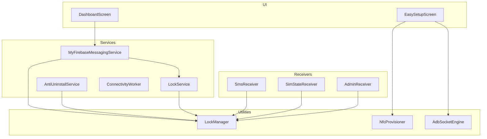
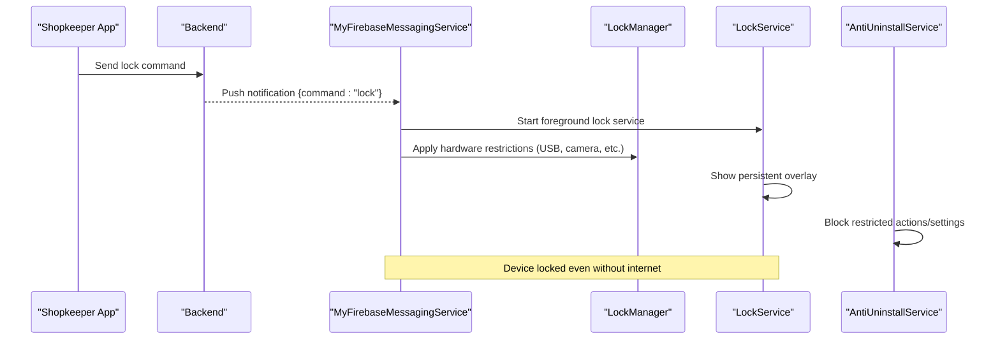
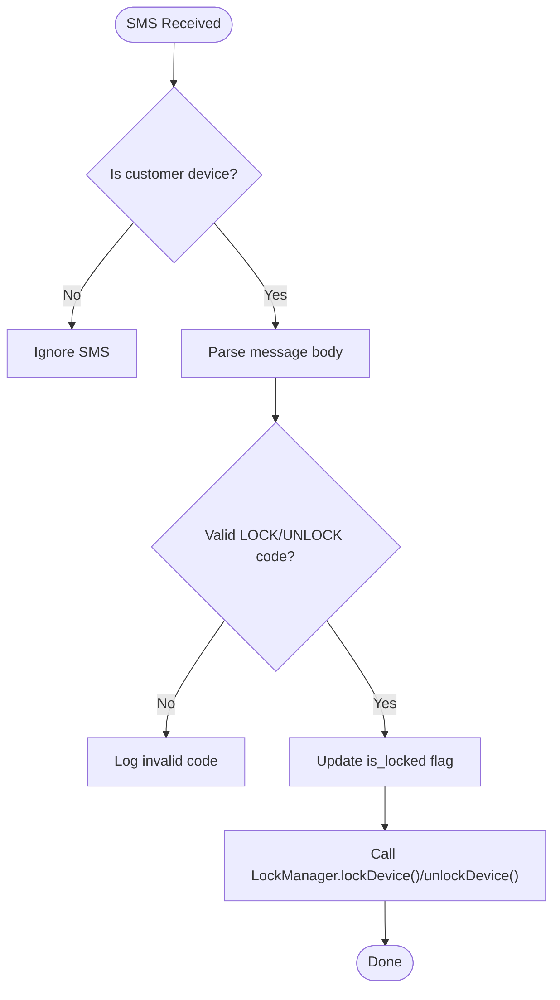
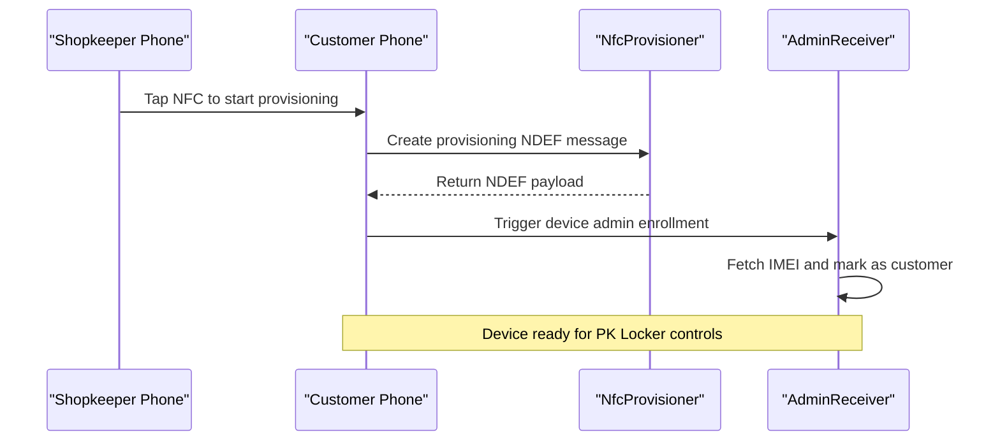
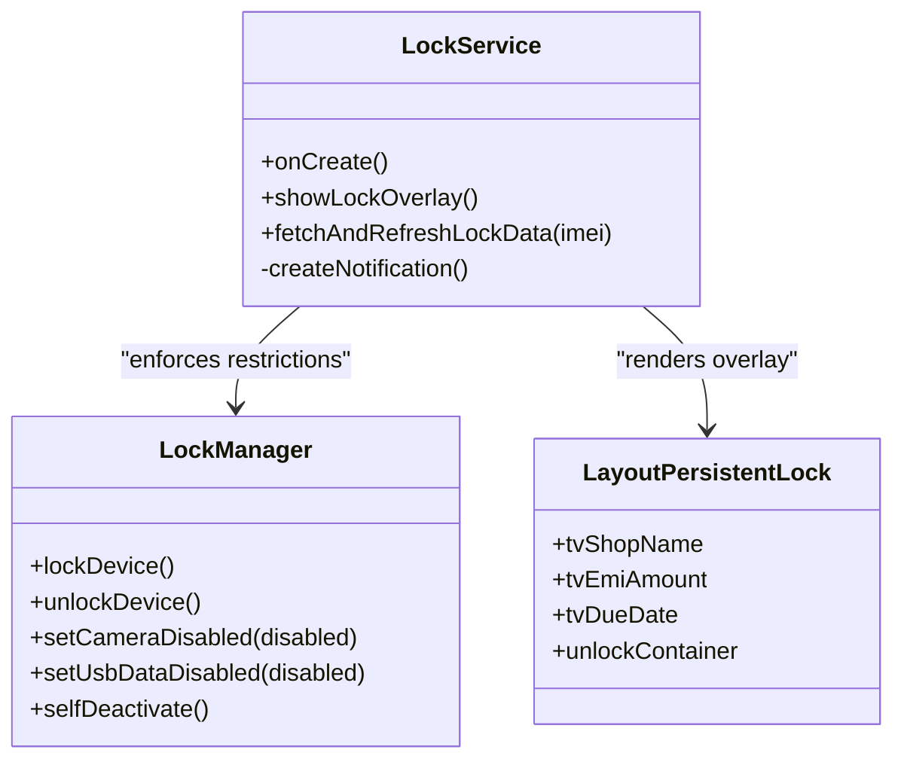
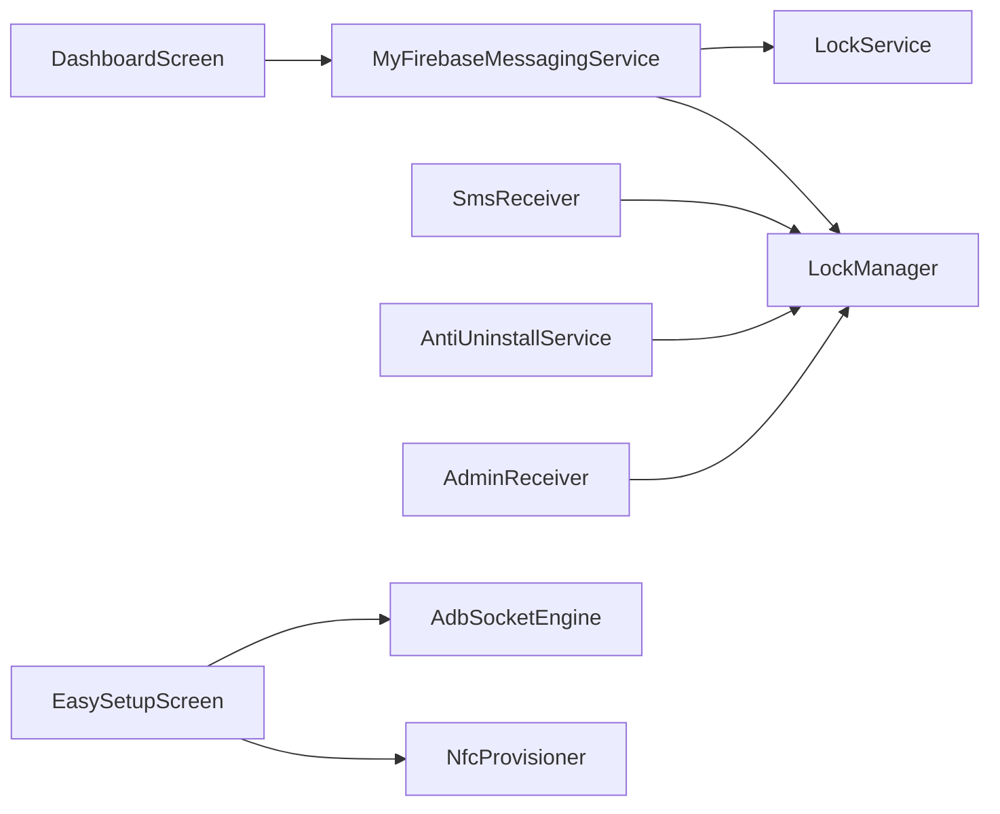

# Key Features

<cite>
**Referenced Files in This Document**
- [LockManager.kt](file://app/src/main/java/com/pksafe/lock/manager/util/LockManager.kt)
- [SmsReceiver.kt](file://app/src/main/java/com/pksafe/lock/manager/receiver/SmsReceiver.kt)
- [MyFirebaseMessagingService.kt](file://app/src/main/java/com/pksafe/lock/manager/service/MyFirebaseMessagingService.kt)
- [LockService.kt](file://app/src/main/java/com/pksafe/lock/manager/service/LockService.kt)
- [AntiUninstallService.kt](file://app/src/main/java/com/pksafe/lock/manager/service/AntiUninstallService.kt)
- [AdminReceiver.kt](file://app/src/main/java/com/pksafe/lock/manager/receiver/AdminReceiver.kt)
- [NfcProvisioner.kt](file://app/src/main/java/com/pksafe/lock/manager/util/NfcProvisioner.kt)
- [AdbSocketEngine.kt](file://app/src/main/java/com/pksafe/lock/manager/util/AdbSocketEngine.kt)
- [EasySetupScreen.kt](file://app/src/main/java/com/pksafe/lock/manager/ui/provisioning/EasySetupScreen.kt)
- [DashboardScreen.kt](file://app/src/main/java/com/pksafe/lock/manager/ui/dashboard/DashboardScreen.kt)
- [SimStateReceiver.kt](file://app/src/main/java/com/pksafe/lock/manager/receiver/SimStateReceiver.kt)
- [ConnectivityWorker.kt](file://app/src/main/java/com/pksafe/lock/manager/service/ConnectivityWorker.kt)
- [layout_persistent_lock.xml](file://app/src/main/res/layout/layout_persistent_lock.xml)
- [accessibility_service_config.xml](file://app/src/main/res/xml/accessibility_service_config.xml)
- [device_admin_policies.xml](file://app/src/main/res/xml/device_admin_policies.xml)
</cite>

## Table of Contents
1. Introduction
2. Project Structure
3. Core Components
4. Architecture Overview
5. Detailed Component Analysis
6. Dependency Analysis
7. Performance Considerations
8. Troubleshooting Guide
9. Conclusion

## Introduction
PK Locker is an Android device protection app designed for shopkeepers to secure customer devices, enforce EMI-related controls, and manage devices remotely. It provides:
- Remote lock/unlock via push notifications and offline SMS commands
- Hardware restriction controls (camera, USB, factory reset prevention, safe mode, ADB/debugging)
- Multi-method provisioning (QR code enrollment, NFC setup, manual installation, wireless ADB)
- Offline capability with SMS command processing
- Administrative dashboard for device management
- Anti-uninstall protection through accessibility services
- Persistent overlay lock screen with dynamic content

This document explains each feature’s technical implementation and user benefits, with practical shopkeeper scenarios and the relationships between core components like LockManager, SmsReceiver, and background services.

## Project Structure
The application is organized by feature areas:
- Receivers handle system events (SMS, SIM state, boot, admin lifecycle)
- Services provide persistent enforcement (foreground lock service, anti-uninstall guard, FCM handler)
- Utilities centralize policy control (LockManager), provisioning helpers (NFC, ADB socket)
- UI screens support provisioning flows and the shopkeeper dashboard

**Diagram sources**
- [SmsReceiver.kt:44-143](file://app/src/main/java/com/pksafe/lock/manager/receiver/SmsReceiver.kt#L44-L143)
- [SimStateReceiver.kt:19-145](file://app/src/main/java/com/pksafe/lock/manager/receiver/SimStateReceiver.kt#L19-L145)
- [MyFirebaseMessagingService.kt:22-224](file://app/src/main/java/com/pksafe/lock/manager/service/MyFirebaseMessagingService.kt#L22-L224)
- [LockService.kt:50-329](file://app/src/main/java/com/pksafe/lock/manager/service/LockService.kt#L50-L329)
- [AntiUninstallService.kt:22-224](file://app/src/main/java/com/pksafe/lock/manager/service/AntiUninstallService.kt#L22-L224)
- [LockManager.kt:27-406](file://app/src/main/java/com/pksafe/lock/manager/util/LockManager.kt#L27-L406)
- [NfcProvisioner.kt:15-51](file://app/src/main/java/com/pksafe/lock/manager/util/NfcProvisioner.kt#L15-L51)
- [AdbSocketEngine.kt:18-164](file://app/src/main/java/com/pksafe/lock/manager/util/AdbSocketEngine.kt#L18-L164)
- [DashboardScreen.kt:36-429](file://app/src/main/java/com/pksafe/lock/manager/ui/dashboard/DashboardScreen.kt#L36-L429)
- [EasySetupScreen.kt:29-314](file://app/src/main/java/com/pksafe/lock/manager/ui/provisioning/EasySetupScreen.kt#L29-L314)

**Section sources**
- [SmsReceiver.kt:44-143](file://app/src/main/java/com/pksafe/lock/manager/receiver/SmsReceiver.kt#L44-L143)
- [MyFirebaseMessagingService.kt:22-224](file://app/src/main/java/com/pksafe/lock/manager/service/MyFirebaseMessagingService.kt#L22-L224)
- [LockService.kt:50-329](file://app/src/main/java/com/pksafe/lock/manager/service/LockService.kt#L50-L329)
- [AntiUninstallService.kt:22-224](file://app/src/main/java/com/pksafe/lock/manager/service/AntiUninstallService.kt#L22-L224)
- [LockManager.kt:27-406](file://app/src/main/java/com/pksafe/lock/manager/util/LockManager.kt#L27-L406)
- [NfcProvisioner.kt:15-51](file://app/src/main/java/com/pksafe/lock/manager/util/NfcProvisioner.kt#L15-L51)
- [AdbSocketEngine.kt:18-164](file://app/src/main/java/com/pksafe/lock/manager/util/AdbSocketEngine.kt#L18-L164)
- [DashboardScreen.kt:36-429](file://app/src/main/java/com/pksafe/lock/manager/ui/dashboard/DashboardScreen.kt#L36-L429)
- [EasySetupScreen.kt:29-314](file://app/src/main/java/com/pksafe/lock/manager/ui/provisioning/EasySetupScreen.kt#L29-L314)

## Core Components
- LockManager: Central orchestrator for Device Policy Manager operations, hardware restrictions, overlay permissions, and self-deactivation.
- SmsReceiver: Offline lock/unlock via SMS with deterministic codes derived from IMEI.
- MyFirebaseMessagingService: Processes remote commands (lock/unlock, hardware blocks, app blocking, deregister).
- LockService: Foreground service that renders a persistent overlay lock screen and enforces UI-level restrictions.
- AntiUninstallService: Accessibility-based guard against uninstall attempts and restricted settings navigation.
- AdminReceiver: Lifecycle hooks for device admin/device owner activation and IMEI capture.
- NfcProvisioner and AdbSocketEngine: Provisioning helpers for NFC-based enterprise enrollment and wireless ADB shell execution.
- DashboardScreen and EasySetupScreen: Shopkeeper-facing UIs for device management and multi-method provisioning.

**Section sources**
- [LockManager.kt:27-406](file://app/src/main/java/com/pksafe/lock/manager/util/LockManager.kt#L27-L406)
- [SmsReceiver.kt:44-143](file://app/src/main/java/com/pksafe/lock/manager/receiver/SmsReceiver.kt#L44-L143)
- [MyFirebaseMessagingService.kt:22-224](file://app/src/main/java/com/pksafe/lock/manager/service/MyFirebaseMessagingService.kt#L22-L224)
- [LockService.kt:50-329](file://app/src/main/java/com/pksafe/lock/manager/service/LockService.kt#L50-L329)
- [AntiUninstallService.kt:22-224](file://app/src/main/java/com/pksafe/lock/manager/service/AntiUninstallService.kt#L22-L224)
- [AdminReceiver.kt:16-104](file://app/src/main/java/com/pksafe/lock/manager/receiver/AdminReceiver.kt#L16-L104)
- [NfcProvisioner.kt:15-51](file://app/src/main/java/com/pksafe/lock/manager/util/NfcProvisioner.kt#L15-L51)
- [AdbSocketEngine.kt:18-164](file://app/src/main/java/com/pksafe/lock/manager/util/AdbSocketEngine.kt#L18-L164)
- [DashboardScreen.kt:36-429](file://app/src/main/java/com/pksafe/lock/manager/ui/dashboard/DashboardScreen.kt#L36-L429)
- [EasySetupScreen.kt:29-314](file://app/src/main/java/com/pksafe/lock/manager/ui/provisioning/EasySetupScreen.kt#L29-L314)

## Architecture Overview
PK Locker uses a layered architecture:
- Event layer: Receivers listen to SMS, SIM changes, connectivity, and admin lifecycle events.
- Command layer: FCM handles remote commands; SMS handles offline commands.
- Enforcement layer: LockManager applies Device Policy Manager restrictions; LockService renders persistent overlay; AntiUninstallService guards UI interactions.
- Provisioning layer: NFC and wireless ADB enable enterprise enrollment and device ownership.
- Management layer: Dashboard exposes controls to shopkeepers.

**Diagram sources**
- [MyFirebaseMessagingService.kt:47-68](file://app/src/main/java/com/pksafe/lock/manager/service/MyFirebaseMessagingService.kt#L47-L68)
- [LockManager.kt:111-148](file://app/src/main/java/com/pksafe/lock/manager/util/LockManager.kt#L111-L148)
- [LockService.kt:50-80](file://app/src/main/java/com/pksafe/lock/manager/service/LockService.kt#L50-L80)
- [AntiUninstallService.kt:136-211](file://app/src/main/java/com/pksafe/lock/manager/service/AntiUninstallService.kt#L136-L211)

## Detailed Component Analysis

### Remote Lock/Unlock via Push Notifications
- Technical approach:
  - MyFirebaseMessagingService parses incoming data payloads and dispatches commands such as lock, unlock, hardware_block, app_block, unlock_all, and deregister.
  - For lock, it starts LockService, triggers full-screen lock, and calls LockManager to apply restrictions.
  - For unlock, it stops the lock service, clears restrictions, and cancels notifications.
- User benefits:
  - Instant remote control regardless of app state; works even if the app is killed due to foreground service usage and wake locks.
  - Granular controls: block USB, camera, app installs/uninstalls, outgoing calls, factory reset, safe boot, and more.

Practical example:
- A shopkeeper sees a missed EMI payment and sends a lock command from the dashboard. The customer’s phone immediately shows the lock overlay and disables USB/file transfer and camera access until payment is made.

**Section sources**
- [MyFirebaseMessagingService.kt:22-224](file://app/src/main/java/com/pksafe/lock/manager/service/MyFirebaseMessagingService.kt#L22-L224)
- [LockManager.kt:111-148](file://app/src/main/java/com/pksafe/lock/manager/util/LockManager.kt#L111-L148)

### Remote Lock/Unlock via SMS Commands (Offline Capability)
- Technical approach:
  - SmsReceiver intercepts SMS broadcasts and validates messages against deterministic codes generated from device IMEI(s).
  - On valid LOCK/UNLOCK commands, it updates local state and invokes LockManager to enforce or clear restrictions.
  - Works without internet; codes are precomputed using SHA-256 on the device side.
- User benefits:
  - Reliable control in areas with poor connectivity; no dependency on network for critical lock/unlock actions.

Practical example:
- During a power outage, the shopkeeper texts a LOCK command to a customer’s phone. Even without mobile data, the device locks and restricts hardware features.

**Diagram sources**
- [SmsReceiver.kt:44-143](file://app/src/main/java/com/pksafe/lock/manager/receiver/SmsReceiver.kt#L44-L143)
- [LockManager.kt:111-148](file://app/src/main/java/com/pksafe/lock/manager/util/LockManager.kt#L111-L148)

**Section sources**
- [SmsReceiver.kt:44-143](file://app/src/main/java/com/pksafe/lock/manager/receiver/SmsReceiver.kt#L44-L143)
- [LockManager.kt:111-148](file://app/src/main/java/com/pksafe/lock/manager/util/LockManager.kt#L111-L148)

### Hardware Restriction Controls
- Technical approach:
  - LockManager uses DevicePolicyManager to disable camera, block USB file transfer, prevent factory reset, disable safe boot, block ADB/debugging, and restrict status bar expansion and keyguard features when locked.
  - Individual toggles exposed via FCM commands allow granular control (e.g., setUsbDataDisabled, setCameraDisabled, setFactoryResetDisabled).
- User benefits:
  - Prevents data exfiltration via USB, avoids bypass via safe mode or ADB, and ensures compliance with shop policies.

Practical example:
- After locking a device, the shopkeeper enables “block USB” and “block camera” to ensure the customer cannot copy files or take photos while the device is under restriction.

**Section sources**
- [LockManager.kt:151-200](file://app/src/main/java/com/pksafe/lock/manager/util/LockManager.kt#L151-L200)
- [LockManager.kt:204-261](file://app/src/main/java/com/pksafe/lock/manager/util/LockManager.kt#L204-L261)
- [MyFirebaseMessagingService.kt:69-91](file://app/src/main/java/com/pksafe/lock/manager/service/MyFirebaseMessagingService.kt#L69-L91)

### Multi-Method Device Provisioning
- QR Code Enrollment:
  - Uses Android enterprise provisioning flow triggered via QR; AdminReceiver captures IMEI and marks device as customer upon completion.
- NFC Setup:
  - NfcProvisioner creates an NDEF message containing device admin component and APK download info for quick bump-to-enroll.
- Manual Installation:
  - EasySetupScreen guides shopkeepers to share the APK directly and walk customers through granting Device Admin, Overlay, and Accessibility permissions.
- Wireless ADB:
  - AdbSocketEngine connects to target device’s ADB daemon over TCP to execute shell commands (e.g., setting device owner) without cables.

User benefits:
- Flexible onboarding options suited to different shop environments and device capabilities.

Practical example:
- In a busy store, the shopkeeper taps “Wireless ADB Setup,” enters a 6-digit code, and completes device ownership setup without connecting cables.

**Diagram sources**
- [NfcProvisioner.kt:15-51](file://app/src/main/java/com/pksafe/lock/manager/util/NfcProvisioner.kt#L15-L51)
- [AdminReceiver.kt:16-104](file://app/src/main/java/com/pksafe/lock/manager/receiver/AdminReceiver.kt#L16-L104)

**Section sources**
- [AdminReceiver.kt:16-104](file://app/src/main/java/com/pksafe/lock/manager/receiver/AdminReceiver.kt#L16-L104)
- [NfcProvisioner.kt:15-51](file://app/src/main/java/com/pksafe/lock/manager/util/NfcProvisioner.kt#L15-L51)
- [EasySetupScreen.kt:29-314](file://app/src/main/java/com/pksafe/lock/manager/ui/provisioning/EasySetupScreen.kt#L29-L314)
- [AdbSocketEngine.kt:18-164](file://app/src/main/java/com/pksafe/lock/manager/util/AdbSocketEngine.kt#L18-L164)

### Anti-Uninstall Protection via Accessibility Services
- Technical approach:
  - AntiUninstallService monitors UI events and blocks navigation to settings or uninstall flows by detecting blocked keywords and performing global back/home actions.
  - LockManager ensures the accessibility service is enabled via Device Owner APIs and falls back to direct settings writes.
- User benefits:
  - Prevents customers from disabling protections or uninstalling the app during lockdown.

Practical example:
- A customer tries to go to Settings > Apps to uninstall PK Locker. The service detects the action and returns them to the home screen with a security notice.

**Section sources**
- [AntiUninstallService.kt:22-224](file://app/src/main/java/com/pksafe/lock/manager/service/AntiUninstallService.kt#L22-L224)
- [LockManager.kt:81-108](file://app/src/main/java/com/pksafe/lock/manager/util/LockManager.kt#L81-L108)
- [accessibility_service_config.xml:1-8](file://app/src/main/res/xml/accessibility_service_config.xml#L1-L8)

### Persistent Overlay Lock Screen
- Technical approach:
  - LockService runs as a foreground service and draws an overlay view using WindowManager with flags to stay on top, keep the screen on, and dismiss keyguard.
  - The overlay displays shop details, EMI amount, due date, and a hidden unlock entry field validated against a dynamic master code derived from IMEI.
  - The layout is defined in XML and dynamically populated at runtime.
- User benefits:
  - Clear, non-dismissible visual indication of device lock with actionable support information and emergency unlock path.

Practical example:
- When locked, the customer sees a prominent “DEVICE LOCKED” screen with shop contact and EMI details. They can reveal a hidden input to enter a clearance code if authorized.

**Diagram sources**
- [LockService.kt:50-329](file://app/src/main/java/com/pksafe/lock/manager/service/LockService.kt#L50-L329)
- [LockManager.kt:111-148](file://app/src/main/java/com/pksafe/lock/manager/util/LockManager.kt#L111-L148)
- [layout_persistent_lock.xml:1-234](file://app/src/main/res/layout/layout_persistent_lock.xml#L1-L234)

**Section sources**
- [LockService.kt:50-329](file://app/src/main/java/com/pksafe/lock/manager/service/LockService.kt#L50-L329)
- [layout_persistent_lock.xml:1-234](file://app/src/main/res/layout/layout_persistent_lock.xml#L1-L234)

### Administrative Dashboard for Device Management
- Technical approach:
  - DashboardScreen presents shopkeeper tools including sharing the APK, initiating wireless ADB setup, cable activation, and managing customers.
  - Integrates with backend to display stats and actions; supports QR and NFC setup shortcuts.
- User benefits:
  - Centralized control panel to provision devices, monitor status, and apply restrictions remotely.

Practical example:
- From the dashboard, the shopkeeper selects “Wireless ADB Setup,” follows steps to pair with the customer device, and then applies lock/hardware restrictions.

**Section sources**
- [DashboardScreen.kt:36-429](file://app/src/main/java/com/pksafe/lock/manager/ui/dashboard/DashboardScreen.kt#L36-L429)

### Auto-Lock on Connectivity Loss and SIM Changes
- Technical approach:
  - ConnectivityWorker periodically checks online status and can trigger lock if offline beyond a threshold; also reports status to server.
  - SimStateReceiver listens for SIM state changes and can auto-lock on SIM removal/change based on preferences; notifies backend about SIM changes.
- User benefits:
  - Ensures device remains protected when connectivity drops or SIM is swapped unexpectedly.

Practical example:
- If a customer removes their SIM and auto-lock-on-SIM-change is enabled, the device locks automatically and the backend is notified of the new SIM.

**Section sources**
- [ConnectivityWorker.kt:15-72](file://app/src/main/java/com/pksafe/lock/manager/service/ConnectivityWorker.kt#L15-L72)
- [SimStateReceiver.kt:19-145](file://app/src/main/java/com/pksafe/lock/manager/receiver/SimStateReceiver.kt#L19-L145)

## Dependency Analysis
Key dependencies and relationships:
- MyFirebaseMessagingService depends on LockManager for policy enforcement and on LockService for overlay rendering.
- SmsReceiver depends on LockManager to apply restrictions after validating SMS commands.
- AntiUninstallService depends on LockManager to check device owner status and to trigger lock on connectivity loss.
- AdminReceiver sets up device admin privileges and captures IMEI for subsequent flows.
- NfcProvisioner and AdbSocketEngine assist provisioning to achieve device ownership quickly.

**Diagram sources**
- [MyFirebaseMessagingService.kt:22-224](file://app/src/main/java/com/pksafe/lock/manager/service/MyFirebaseMessagingService.kt#L22-L224)
- [SmsReceiver.kt:44-143](file://app/src/main/java/com/pksafe/lock/manager/receiver/SmsReceiver.kt#L44-L143)
- [AntiUninstallService.kt:22-224](file://app/src/main/java/com/pksafe/lock/manager/service/AntiUninstallService.kt#L22-L224)
- [AdminReceiver.kt:16-104](file://app/src/main/java/com/pksafe/lock/manager/receiver/AdminReceiver.kt#L16-L104)
- [DashboardScreen.kt:36-429](file://app/src/main/java/com/pksafe/lock/manager/ui/dashboard/DashboardScreen.kt#L36-L429)
- [EasySetupScreen.kt:29-314](file://app/src/main/java/com/pksafe/lock/manager/ui/provisioning/EasySetupScreen.kt#L29-L314)
- [NfcProvisioner.kt:15-51](file://app/src/main/java/com/pksafe/lock/manager/util/NfcProvisioner.kt#L15-L51)
- [AdbSocketEngine.kt:18-164](file://app/src/main/java/com/pksafe/lock/manager/util/AdbSocketEngine.kt#L18-L164)

**Section sources**
- [MyFirebaseMessagingService.kt:22-224](file://app/src/main/java/com/pksafe/lock/manager/service/MyFirebaseMessagingService.kt#L22-L224)
- [SmsReceiver.kt:44-143](file://app/src/main/java/com/pksafe/lock/manager/receiver/SmsReceiver.kt#L44-L143)
- [AntiUninstallService.kt:22-224](file://app/src/main/java/com/pksafe/lock/manager/service/AntiUninstallService.kt#L22-L224)
- [AdminReceiver.kt:16-104](file://app/src/main/java/com/pksafe/lock/manager/receiver/AdminReceiver.kt#L16-L104)
- [DashboardScreen.kt:36-429](file://app/src/main/java/com/pksafe/lock/manager/ui/dashboard/DashboardScreen.kt#L36-L429)
- [EasySetupScreen.kt:29-314](file://app/src/main/java/com/pksafe/lock/manager/ui/provisioning/EasySetupScreen.kt#L29-L314)
- [NfcProvisioner.kt:15-51](file://app/src/main/java/com/pksafe/lock/manager/util/NfcProvisioner.kt#L15-L51)
- [AdbSocketEngine.kt:18-164](file://app/src/main/java/com/pksafe/lock/manager/util/AdbSocketEngine.kt#L18-L164)

## Performance Considerations
- Foreground service usage: LockService uses START_STICKY and a high-priority notification to minimize being killed by the OS.
- Network efficiency: ConnectivityWorker batches status reporting and limits sync frequency to reduce overhead.
- Overlay performance: LockService minimizes UI work and posts updates on the main thread only when necessary.
- ADB fallbacks: AdbSocketEngine includes port fallbacks and direct socket commands to improve reliability across devices.

[No sources needed since this section provides general guidance]

## Troubleshooting Guide
Common issues and resolutions:
- Overlay permission not granted:
  - Ensure overlay permission is allowed; LockManager provides a method to request overlay settings.
- Accessibility service not active:
  - Use LockManager.ensureAccessibilityServiceEnabled to enable via Device Owner APIs; verify configuration in accessibility_service_config.xml.
- Device Admin not active:
  - Confirm device admin is enabled; AdminReceiver logs lifecycle events and can re-launch the app post-provisioning.
- SMS commands not working:
  - Verify IMEI stored in preferences and that codes match expected format; check SmsReceiver logs for validation results.
- Remote commands ignored:
  - Ensure device is not marked as admin; MyFirebaseMessagingService skips commands for administrative devices.

**Section sources**
- [LockManager.kt:63-73](file://app/src/main/java/com/pksafe/lock/manager/util/LockManager.kt#L63-L73)
- [LockManager.kt:81-108](file://app/src/main/java/com/pksafe/lock/manager/util/LockManager.kt#L81-L108)
- [AdminReceiver.kt:16-36](file://app/src/main/java/com/pksafe/lock/manager/receiver/AdminReceiver.kt#L16-L36)
- [SmsReceiver.kt:44-143](file://app/src/main/java/com/pksafe/lock/manager/receiver/SmsReceiver.kt#L44-L143)
- [MyFirebaseMessagingService.kt:40-45](file://app/src/main/java/com/pksafe/lock/manager/service/MyFirebaseMessagingService.kt#L40-L45)

## Conclusion
PK Locker delivers robust device protection through a combination of remote commands, offline SMS control, strict hardware restrictions, and resilient enforcement via foreground services and accessibility guards. Its multi-method provisioning ensures flexible onboarding for shopkeepers, while the dashboard centralizes management. Together, these features provide reliable EMI protection and operational control in real-world retail environments.

[No sources needed since this section summarizes without analyzing specific files]