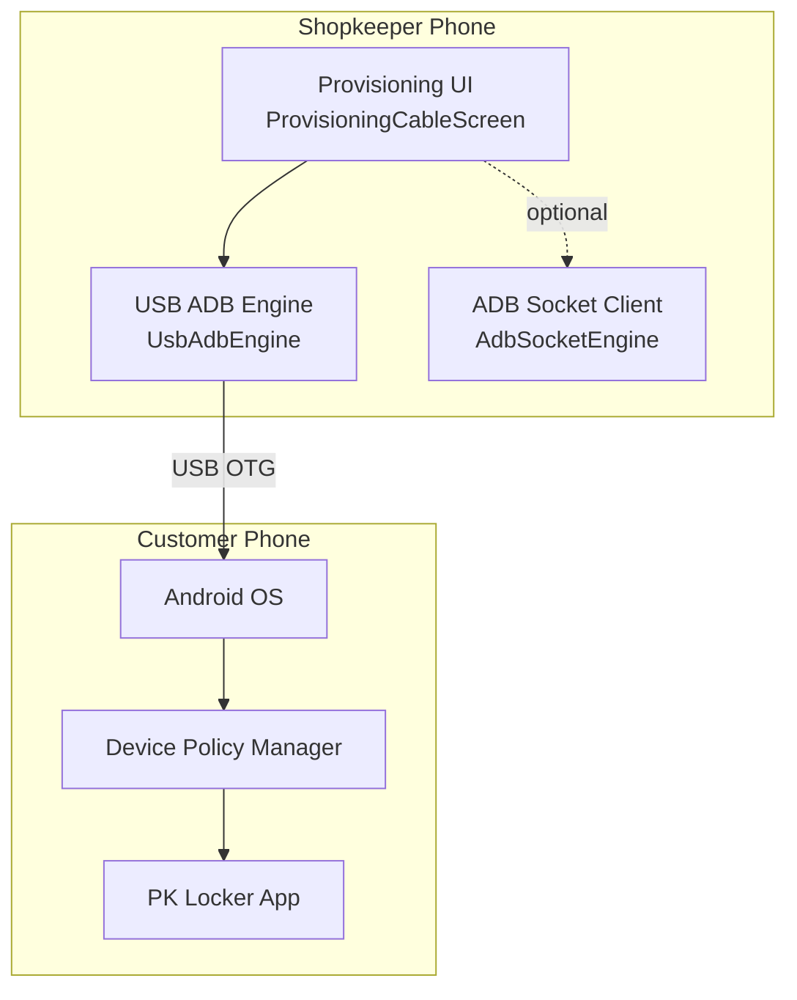
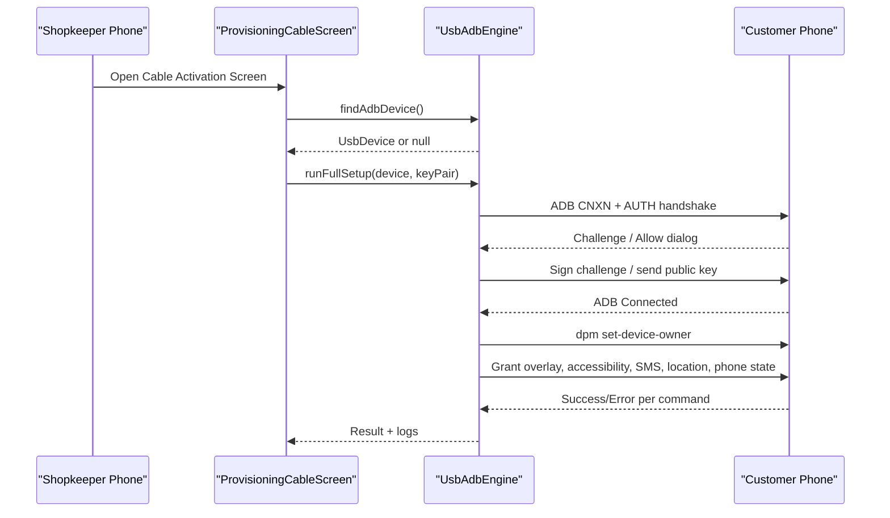
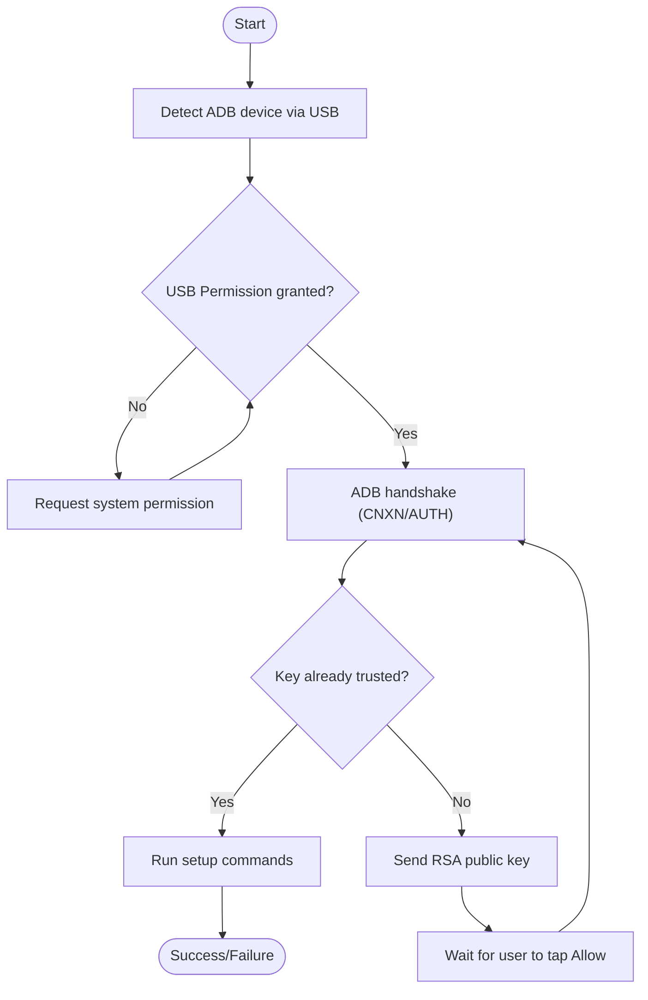
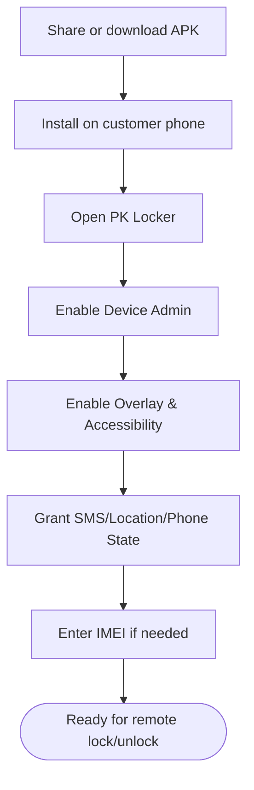
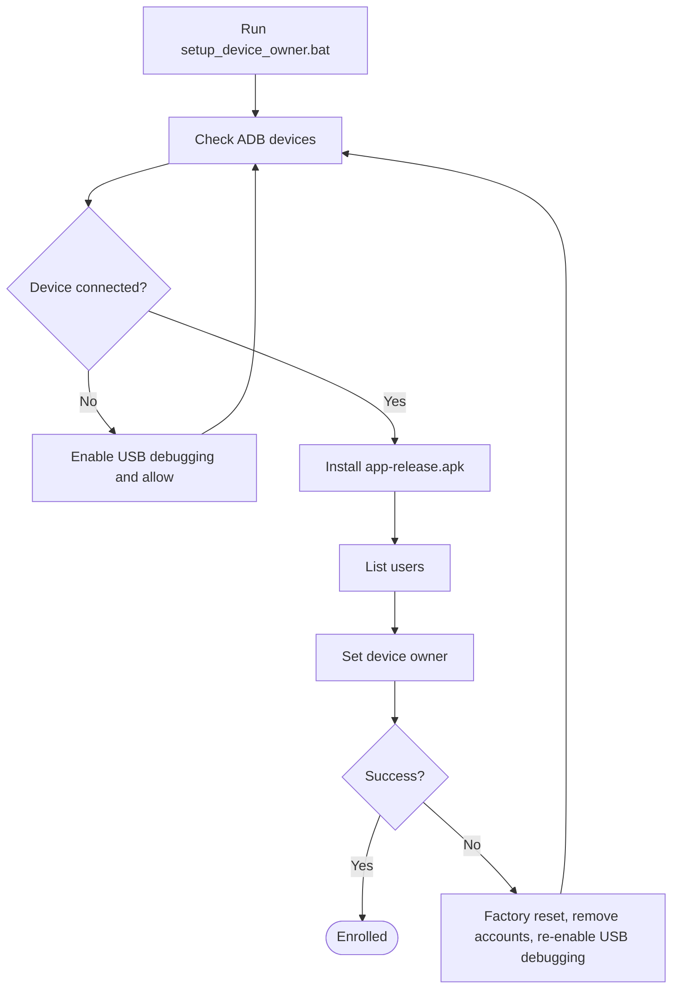
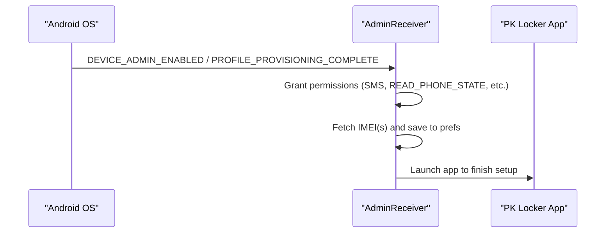
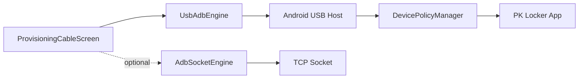

# Manual Installation Setup

<cite>
**Referenced Files in This Document**
- [README.md](file://README.md)
- [setup_device_owner.bat](file://setup_device_owner.bat)
- [AndroidManifest.xml](file://app/src/main/AndroidManifest.xml)
- [ProvisioningCableScreen.kt](file://app/src/main/java/com/pksafe/lock/manager/ui/provisioning/ProvisioningCableScreen.kt)
- [UsbAdbEngine.kt](file://app/src/main/java/com/pksafe/lock/manager/util/UsbAdbEngine.kt)
- [AdbSocketEngine.kt](file://app/src/main/java/com/pksafe/lock/manager/util/AdbSocketEngine.kt)
- [AdminReceiver.kt](file://app/src/main/java/com/pksafe/lock/manager/receiver/AdminReceiver.kt)
- [device_admin_policies.xml](file://app/src/main/res/xml/device_admin_policies.xml)
- [EasySetupScreen.kt](file://app/src/main/java/com/pksafe/lock/manager/ui/provisioning/EasySetupScreen.kt)
</cite>

## Table of Contents
1. Introduction
2. Project Structure
3. Core Components
4. Architecture Overview
5. Detailed Component Analysis
6. Dependency Analysis
7. Performance Considerations
8. Troubleshooting Guide
9. Conclusion
10. Appendices

## Introduction
This document explains how to manually install PK Locker and provision devices using cable-based methods, including USB ADB workflows and manual device owner activation. It is designed for shopkeepers who prefer hands-on setup on customer phones without relying solely on QR provisioning. It also covers bulk deployment scenarios, security considerations, and troubleshooting common issues such as permissions, compatibility, and enrollment failures.

## Project Structure
PK Locker provides multiple provisioning paths:
- QR-based Device Owner enrollment (recommended)
- Manual APK installation with guided steps
- Cable-based ADB provisioning from one Android phone to another via USB OTG
- PC-assisted batch setup using a Windows script

**Diagram sources**
- [ProvisioningCableScreen.kt:87-150](file://app/src/main/java/com/pksafe/lock/manager/ui/provisioning/ProvisioningCableScreen.kt#L87-L150)
- [UsbAdbEngine.kt:18-38](file://app/src/main/java/com/pksafe/lock/manager/util/UsbAdbEngine.kt#L18-L38)
- [AdbSocketEngine.kt:13-24](file://app/src/main/java/com/pksafe/lock/manager/util/AdbSocketEngine.kt#L13-L24)

**Section sources**
- [README.md:49-79](file://README.md#L49-L79)
- [AndroidManifest.xml:34-35](file://app/src/main/AndroidManifest.xml#L34-L35)

## Core Components
- ProvisioningCableScreen: Guides the shopkeeper through USB OTG connection, permission handling, and one-click activation.
- UsbAdbEngine: Implements the ADB USB protocol over OTG, performs RSA key exchange, and executes device-owner setup commands.
- AdbSocketEngine: Connects to wireless ADB (TCP) to run shell commands when available.
- AdminReceiver: Handles device admin events, grants critical permissions, and auto-fetches IMEI after provisioning.
- Device Admin Policies: Declares policies used by the app when acting as device admin.
- EasySetupScreen: Provides step-by-step guidance for manual APK installation and standard device admin mode.

**Section sources**
- [ProvisioningCableScreen.kt:87-150](file://app/src/main/java/com/pksafe/lock/manager/ui/provisioning/ProvisioningCableScreen.kt#L87-L150)
- [UsbAdbEngine.kt:18-38](file://app/src/main/java/com/pksafe/lock/manager/util/UsbAdbEngine.kt#L18-L38)
- [AdbSocketEngine.kt:13-24](file://app/src/main/java/com/pksafe/lock/manager/util/AdbSocketEngine.kt#L13-L24)
- [AdminReceiver.kt:14-36](file://app/src/main/java/com/pksafe/lock/manager/receiver/AdminReceiver.kt#L14-L36)
- [device_admin_policies.xml:1-13](file://app/src/main/res/xml/device_admin_policies.xml#L1-L13)
- [EasySetupScreen.kt:29-39](file://app/src/main/java/com/pksafe/lock/manager/ui/provisioning/EasySetupScreen.kt#L29-L39)

## Architecture Overview
The cable-based flow uses USB OTG to connect the shopkeeper’s phone to the customer’s phone. The app detects the ADB-capable device, requests USB permission, authenticates via RSA keys, and runs a sequence of shell commands to set PK Locker as device owner and grant required permissions.

**Diagram sources**
- [ProvisioningCableScreen.kt:294-323](file://app/src/main/java/com/pksafe/lock/manager/ui/provisioning/ProvisioningCableScreen.kt#L294-L323)
- [UsbAdbEngine.kt:189-343](file://app/src/main/java/com/pksafe/lock/manager/util/UsbAdbEngine.kt#L189-L343)

## Detailed Component Analysis

### Cable-Based ADB Provisioning Flow
- Device detection and permission:
  - Polls for ADB-capable USB devices and requests system permission once per connection.
  - Displays a checklist and status indicators for the shopkeeper.
- ADB authentication:
  - Generates and persists an RSA key pair on the shopkeeper device.
  - Performs ADB auth handshake; if the key is not trusted, sends the public key to trigger “Allow USB Debugging” on the customer device.
- Device owner setup:
  - Executes a fixed sequence of shell commands to set device owner and grant permissions.
  - Reports success/failure per command and overall result.

**Diagram sources**
- [ProvisioningCableScreen.kt:111-170](file://app/src/main/java/com/pksafe/lock/manager/ui/provisioning/ProvisioningCableScreen.kt#L111-L170)
- [UsbAdbEngine.kt:211-284](file://app/src/main/java/com/pksafe/lock/manager/util/UsbAdbEngine.kt#L211-L284)

**Section sources**
- [ProvisioningCableScreen.kt:87-170](file://app/src/main/java/com/pksafe/lock/manager/ui/provisioning/ProvisioningCableScreen.kt#L87-L170)
- [UsbAdbEngine.kt:189-343](file://app/src/main/java/com/pksafe/lock/manager/util/UsbAdbEngine.kt#L189-L343)

### Manual APK Installation (No Laptop)
- Share or send the APK to the customer phone via share sheet or download link.
- Install the APK and open the app.
- Follow in-app prompts to enable Device Admin, Overlay, Accessibility, and grant SMS/Location/Phone State permissions.
- Enter IMEI if prompted; otherwise, it may be auto-fetched after device owner enrollment.

**Diagram sources**
- [EasySetupScreen.kt:107-190](file://app/src/main/java/com/pksafe/lock/manager/ui/provisioning/EasySetupScreen.kt#L107-L190)
- [README.md:67-79](file://README.md#L67-L79)

**Section sources**
- [EasySetupScreen.kt:29-39](file://app/src/main/java/com/pksafe/lock/manager/ui/provisioning/EasySetupScreen.kt#L29-L39)
- [EasySetupScreen.kt:107-190](file://app/src/main/java/com/pksafe/lock/manager/ui/provisioning/EasySetupScreen.kt#L107-L190)
- [README.md:67-79](file://README.md#L67-L79)

### PC-Assisted Bulk Deployment (Windows Script)
- Use the provided Windows batch script to automate:
  - Verifying ADB connectivity
  - Installing the release APK
  - Checking users
  - Setting PK Locker as device owner
- Ensure the target phone is factory reset, no Google account added during setup wizard, Developer Options enabled, and USB debugging allowed.

**Diagram sources**
- [setup_device_owner.bat:12-22](file://setup_device_owner.bat#L12-L22)
- [setup_device_owner.bat:24-55](file://setup_device_owner.bat#L24-L55)
- [setup_device_owner.bat:57-81](file://setup_device_owner.bat#L57-L81)

**Section sources**
- [setup_device_owner.bat:12-22](file://setup_device_owner.bat#L12-L22)
- [setup_device_owner.bat:24-55](file://setup_device_owner.bat#L24-L55)
- [setup_device_owner.bat:57-81](file://setup_device_owner.bat#L57-L81)

### Post-Provisioning Behavior
- On device admin enable or profile provisioning complete, the app:
  - Grants critical permissions to itself as device owner
  - Auto-fetches IMEI(s) and marks provisioning complete
  - Launches the app to finalize setup

**Diagram sources**
- [AdminReceiver.kt:16-36](file://app/src/main/java/com/pksafe/lock/manager/receiver/AdminReceiver.kt#L16-L36)
- [AdminReceiver.kt:43-102](file://app/src/main/java/com/pksafe/lock/manager/receiver/AdminReceiver.kt#L43-L102)

**Section sources**
- [AdminReceiver.kt:16-36](file://app/src/main/java/com/pksafe/lock/manager/receiver/AdminReceiver.kt#L16-L36)
- [AdminReceiver.kt:43-102](file://app/src/main/java/com/pksafe/lock/manager/receiver/AdminReceiver.kt#L43-L102)

## Dependency Analysis
- UI depends on UsbAdbEngine for ADB operations and displays real-time logs.
- UsbAdbEngine relies on Android USB Host APIs and implements ADB protocol details.
- AdbSocketEngine provides an alternative path via TCP for wireless ADB.
- AdminReceiver integrates with DevicePolicyManager to enforce policies and manage permissions post-enrollment.
- Manifest declares necessary permissions and components for USB host, device admin, services, and receivers.

**Diagram sources**
- [ProvisioningCableScreen.kt:87-150](file://app/src/main/java/com/pksafe/lock/manager/ui/provisioning/ProvisioningCableScreen.kt#L87-L150)
- [UsbAdbEngine.kt:18-38](file://app/src/main/java/com/pksafe/lock/manager/util/UsbAdbEngine.kt#L18-L38)
- [AdbSocketEngine.kt:13-24](file://app/src/main/java/com/pksafe/lock/manager/util/AdbSocketEngine.kt#L13-L24)
- [AndroidManifest.xml:34-35](file://app/src/main/AndroidManifest.xml#L34-L35)

**Section sources**
- [AndroidManifest.xml:5-23](file://app/src/main/AndroidManifest.xml#L5-L23)
- [AndroidManifest.xml:73-155](file://app/src/main/AndroidManifest.xml#L73-L155)

## Performance Considerations
- USB polling interval and timeouts are tuned to balance responsiveness and battery usage.
- ADB message sizes and CRC checks ensure reliable transfers.
- For bulk deployments, prefer the PC script to parallelize across multiple devices via separate ADB sessions.
- Wireless ADB fallback can reduce cabling overhead but may introduce network latency.

[No sources needed since this section provides general guidance]

## Troubleshooting Guide

### Common Installation Issues
- USB device not detected:
  - Ensure the customer phone has USB debugging enabled and is connected via a working C-to-C cable.
  - Confirm the shopkeeper phone supports USB Host and that the correct interface is claimed.
- USB permission denied:
  - Reconnect the cable and accept the system prompt to allow access.
  - Use the in-app “Request USB Permission” button if the dialog does not appear automatically.
- ADB authentication timeout:
  - If the RSA key is not trusted, the customer device will show “Allow USB Debugging?”—tap Allow.
  - Retry after ensuring both devices are on the same session and cables are secure.

**Section sources**
- [ProvisioningCableScreen.kt:111-170](file://app/src/main/java/com/pksafe/lock/manager/ui/provisioning/ProvisioningCableScreen.kt#L111-L170)
- [UsbAdbEngine.kt:211-284](file://app/src/main/java/com/pksafe/lock/manager/util/UsbAdbEngine.kt#L211-L284)

### Permission Problems
- Overlay permission missing:
  - Enable “Display over other apps” for PK Locker in Settings.
- Accessibility disabled:
  - Enable PK Locker’s accessibility service and mark it active.
- SMS/Location/Phone State not granted:
  - These are requested during setup; if missing, re-run the cable activation or use the in-app permission prompts.

**Section sources**
- [UsbAdbEngine.kt:287-305](file://app/src/main/java/com/pksafe/lock/manager/util/UsbAdbEngine.kt#L287-L305)
- [README.md:67-79](file://README.md#L67-L79)

### Device Compatibility Concerns
- Samsung devices often require explicit “Allow USB Debugging?” confirmation; ensure you tap Allow when prompted.
- Some OEM skins may restrict USB Host or background processes; verify USB debugging and developer options are enabled.
- Factory reset and clean setup improve reliability for device owner enrollment.

**Section sources**
- [UsbAdbEngine.kt:250-258](file://app/src/main/java/com/pksafe/lock/manager/util/UsbAdbEngine.kt#L250-L258)
- [setup_device_owner.bat:12-22](file://setup_device_owner.bat#L12-L22)

### Security Considerations
- RSA key persistence:
  - The shopkeeper device stores an RSA key pair to authenticate with the customer device. Keep the shopkeeper device secure.
- Least privilege:
  - Only request and grant permissions necessary for enforcement (overlay, accessibility, SMS, location, phone state).
- Verify enrollment:
  - After setup, confirm device owner status and that critical permissions are active before handing the device to the customer.

**Section sources**
- [ProvisioningCableScreen.kt:61-84](file://app/src/main/java/com/pksafe/lock/manager/ui/provisioning/ProvisioningCableScreen.kt#L61-L84)
- [UsbAdbEngine.kt:146-185](file://app/src/main/java/com/pksafe/lock/manager/util/UsbAdbEngine.kt#L146-L185)
- [AdminReceiver.kt:43-60](file://app/src/main/java/com/pksafe/lock/manager/receiver/AdminReceiver.kt#L43-L60)

## Conclusion
PK Locker supports flexible manual installation and cable-based provisioning to accommodate shopkeepers who prefer hands-on device configuration. The USB OTG flow automates ADB authentication and device owner setup, while the PC script enables efficient bulk deployments. Always verify permissions and enrollment, and follow the troubleshooting steps to resolve common issues quickly.

[No sources needed since this section summarizes without analyzing specific files]

## Appendices

### Quick Reference: Steps for Cable-Based Activation
- Prepare customer phone:
  - Enable Developer Options and USB debugging.
  - Remove existing Google accounts if possible for clean enrollment.
- Connect via C-to-C cable:
  - Plug into both phones; accept USB permission on the shopkeeper device.
- Activate:
  - Tap “ACTIVATE”; on the customer device, tap “Allow USB Debugging?” if prompted.
- Verify:
  - Check logs for success and confirm device owner and permissions are active.

**Section sources**
- [ProvisioningCableScreen.kt:97-103](file://app/src/main/java/com/pksafe/lock/manager/ui/provisioning/ProvisioningCableScreen.kt#L97-L103)
- [ProvisioningCableScreen.kt:294-323](file://app/src/main/java/com/pksafe/lock/manager/ui/provisioning/ProvisioningCableScreen.kt#L294-L323)
- [UsbAdbEngine.kt:287-343](file://app/src/main/java/com/pksafe/lock/manager/util/UsbAdbEngine.kt#L287-L343)