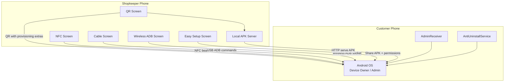
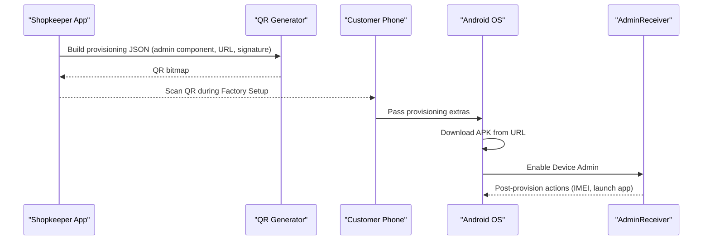
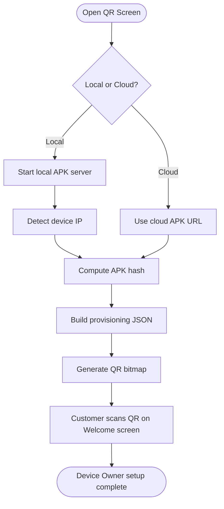
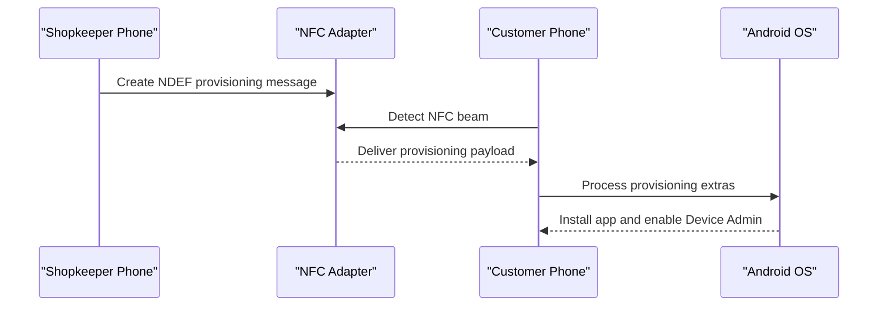
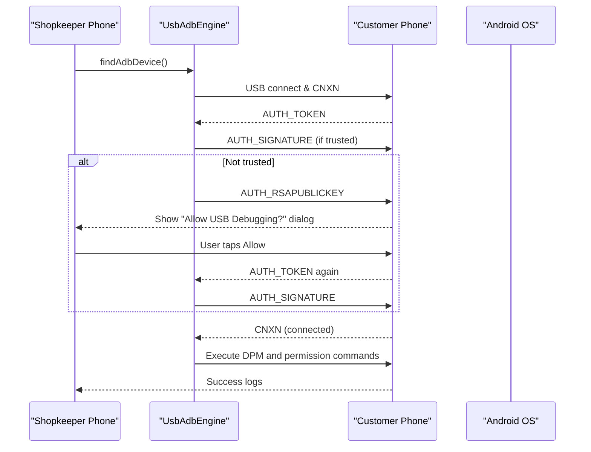
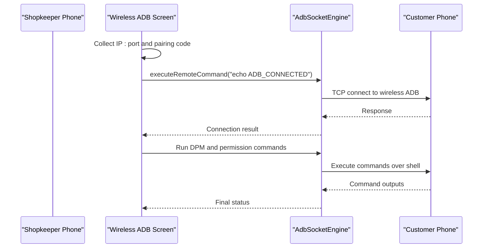
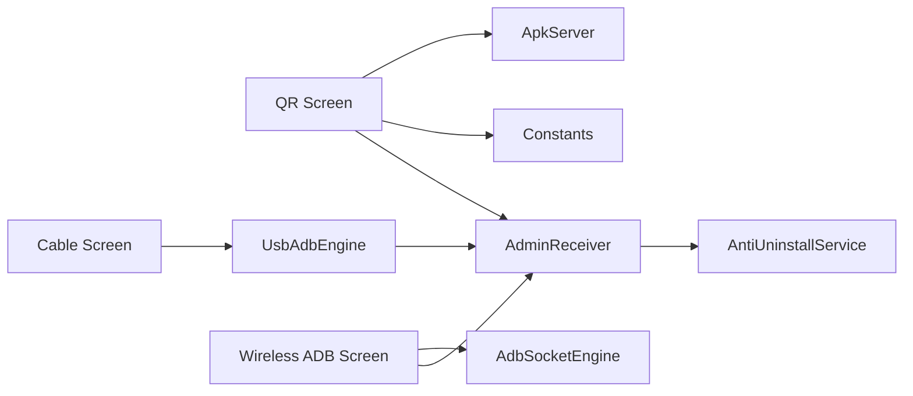

# Multi-Method Device Provisioning

<cite>
**Referenced Files in This Document**
- [ProvisioningQrScreen.kt](file://app/src/main/java/com/pksafe/lock/manager/ui/provisioning/ProvisioningQrScreen.kt)
- [NfcSetupScreen.kt](file://app/src/main/java/com/pksafe/lock/manager/ui/provisioning/NfcSetupScreen.kt)
- [ProvisioningCableScreen.kt](file://app/src/main/java/com/pksafe/lock/manager/ui/provisioning/ProvisioningCableScreen.kt)
- [WirelessAdbSetupScreen.kt](file://app/src/main/java/com/pksafe/lock/manager/ui/provisioning/WirelessAdbSetupScreen.kt)
- [NfcProvisioner.kt](file://app/src/main/java/com/pksafe/lock/manager/util/NfcProvisioner.kt)
- [UsbAdbEngine.kt](file://app/src/main/java/com/pksafe/lock/manager/util/UsbAdbEngine.kt)
- [AdbSocketEngine.kt](file://app/src/main/java/com/pksafe/lock/manager/util/AdbSocketEngine.kt)
- [ApkServer.kt](file://app/src/main/java/com/pksafe/lock/manager/util/ApkServer.kt)
- [Constants.kt](file://app/src/main/java/com/pksafe/lock/manager/util/Constants.kt)
- [AdminReceiver.kt](file://app/src/main/java/com/pksafe/lock/manager/receiver/AdminReceiver.kt)
- [AntiUninstallService.kt](file://app/src/main/java/com/pksafe/lock/manager/service/AntiUninstallService.kt)
- [device_admin_policies.xml](file://app/src/main/res/xml/device_admin_policies.xml)
</cite>

## Table of Contents
1. Introduction
2. Project Structure
3. Core Components
4. Architecture Overview
5. Detailed Component Analysis
6. Dependency Analysis
7. Performance Considerations
8. Troubleshooting Guide
9. Conclusion
10. Appendices

## Introduction
This document explains PK Locker’s multi-method device provisioning system for shopkeepers and deployers. It covers:
- QR code enrollment for factory-new devices to become Device Owner
- NFC-based contactless setup (beam) on supported Android versions
- Cable-based provisioning via USB ADB for bulk deployments
- Wireless ADB setup for remote device enrollment and automated permission granting

Each method includes use cases, technical implementation, user workflow, step-by-step guides, troubleshooting, and fallback strategies.

## Project Structure
PK Locker implements provisioning through dedicated UI screens and utility engines:
- UI screens: QR, NFC, Cable (USB), Wireless ADB, and an “Easy Setup” flow
- Utilities: APK server for local downloads, USB ADB engine, wireless ADB socket client, NFC helper
- Runtime components: Device Admin receiver and anti-uninstall guard service

**Diagram sources**
- [ProvisioningQrScreen.kt:120-157](file://app/src/main/java/com/pksafe/lock/manager/ui/provisioning/ProvisioningQrScreen.kt#L120-L157)
- [NfcSetupScreen.kt:29-45](file://app/src/main/java/com/pksafe/lock/manager/ui/provisioning/NfcSetupScreen.kt#L29-L45)
- [ProvisioningCableScreen.kt:87-150](file://app/src/main/java/com/pksafe/lock/manager/ui/provisioning/ProvisioningCableScreen.kt#L87-L150)
- [WirelessAdbSetupScreen.kt:51-75](file://app/src/main/java/com/pksafe/lock/manager/ui/provisioning/WirelessAdbSetupScreen.kt#L51-L75)
- [ApkServer.kt:14-44](file://app/src/main/java/com/pksafe/lock/manager/util/ApkServer.kt#L14-L44)
- [AdminReceiver.kt:16-36](file://app/src/main/java/com/pksafe/lock/manager/receiver/AdminReceiver.kt#L16-L36)
- [AntiUninstallService.kt:22-79](file://app/src/main/java/com/pksafe/lock/manager/service/AntiUninstallService.kt#L22-L79)

**Section sources**
- [ProvisioningQrScreen.kt:1-170](file://app/src/main/java/com/pksafe/lock/manager/ui/provisioning/ProvisioningQrScreen.kt#L1-L170)
- [NfcSetupScreen.kt:1-148](file://app/src/main/java/com/pksafe/lock/manager/ui/provisioning/NfcSetupScreen.kt#L1-L148)
- [ProvisioningCableScreen.kt:1-410](file://app/src/main/java/com/pksafe/lock/manager/ui/provisioning/ProvisioningCableScreen.kt#L1-L410)
- [WirelessAdbSetupScreen.kt:1-556](file://app/src/main/java/com/pksafe/lock/manager/ui/provisioning/WirelessAdbSetupScreen.kt#L1-L556)
- [ApkServer.kt:1-95](file://app/src/main/java/com/pksafe/lock/manager/util/ApkServer.kt#L1-L95)
- [AdminReceiver.kt:1-104](file://app/src/main/java/com/pksafe/lock/manager/receiver/AdminReceiver.kt#L1-L104)
- [AntiUninstallService.kt:1-224](file://app/src/main/java/com/pksafe/lock/manager/service/AntiUninstallService.kt#L1-L224)

## Core Components
- QR Enrollment: Generates a provisioning QR containing device admin component, package download URL, signature checksum, and flags. Supports local APK server or cloud URL.
- NFC Beam: Creates an NDEF message with provisioning properties; note that modern Android deprecates beam APIs.
- Cable Provisioning: Implements full USB ADB protocol, RSA key exchange, and runs a sequence of DPM and permission commands to set Device Owner and grant permissions.
- Wireless ADB: Connects over TCP to the customer device’s wireless debugging port, executes DPM and permission commands, and auto-grants critical runtime permissions.
- Easy Setup: Shares the APK directly and walks users through installing and enabling Device Admin and required permissions without Device Owner.

**Section sources**
- [ProvisioningQrScreen.kt:120-157](file://app/src/main/java/com/pksafe/lock/manager/ui/provisioning/ProvisioningQrScreen.kt#L120-L157)
- [NfcProvisioner.kt:15-49](file://app/src/main/java/com/pksafe/lock/manager/util/NfcProvisioner.kt#L15-L49)
- [UsbAdbEngine.kt:188-352](file://app/src/main/java/com/pksafe/lock/manager/util/UsbAdbEngine.kt#L188-L352)
- [AdbSocketEngine.kt:25-96](file://app/src/main/java/com/pksafe/lock/manager/util/AdbSocketEngine.kt#L25-L96)
- [WirelessAdbSetupScreen.kt:320-367](file://app/src/main/java/com/pksafe/lock/manager/ui/provisioning/WirelessAdbSetupScreen.kt#L320-L367)
- [EasySetupScreen.kt:29-39](file://app/src/main/java/com/pksafe/lock/manager/ui/provisioning/EasySetupScreen.kt#L29-L39)

## Architecture Overview
The provisioning architecture centers around two roles:
- Shopkeeper phone: Provides QR, NFC, cable, or wireless ADB flows and may host a local APK server.
- Customer phone: Receives provisioning data, installs the app, becomes Device Owner or enables Device Admin, and activates protections.

**Diagram sources**
- [ProvisioningQrScreen.kt:120-157](file://app/src/main/java/com/pksafe/lock/manager/ui/provisioning/ProvisioningQrScreen.kt#L120-L157)
- [AdminReceiver.kt:16-36](file://app/src/main/java/com/pksafe/lock/manager/receiver/AdminReceiver.kt#L16-L36)

## Detailed Component Analysis

### QR Code Enrollment
Use case: Fastest path for factory-new devices to become Device Owner without cables or laptops. Works across Wi-Fi or mobile data.

Technical highlights:
- Builds provisioning JSON with device admin component, package download location, signature checksum, and UX flags.
- Supports local APK server on shopkeeper phone or a cloud URL.
- Computes APK hash and displays status; generates QR bitmap for scanning.

User workflow:
1. Ensure shopkeeper phone is connected to Wi‑Fi (for local mode).
2. Toggle “Phone Server Mode” if you want the shopkeeper phone to serve the APK locally; otherwise use cloud mode.
3. Wait until status shows ready and QR appears.
4. On the customer phone at the Welcome screen, open the QR scanner and scan the code.
5. The device downloads the app and completes Device Owner setup automatically.

**Diagram sources**
- [ProvisioningQrScreen.kt:64-111](file://app/src/main/java/com/pksafe/lock/manager/ui/provisioning/ProvisioningQrScreen.kt#L64-L111)
- [ProvisioningQrScreen.kt:120-169](file://app/src/main/java/com/pksafe/lock/manager/ui/provisioning/ProvisioningQrScreen.kt#L120-L169)
- [ApkServer.kt:25-44](file://app/src/main/java/com/pksafe/lock/manager/util/ApkServer.kt#L25-L44)

**Section sources**
- [ProvisioningQrScreen.kt:41-170](file://app/src/main/java/com/pksafe/lock/manager/ui/provisioning/ProvisioningQrScreen.kt#L41-L170)
- [ApkServer.kt:14-95](file://app/src/main/java/com/pksafe/lock/manager/util/ApkServer.kt#L14-L95)
- [Constants.kt:3-10](file://app/src/main/java/com/pksafe/lock/manager/util/Constants.kt#L3-L10)

### NFC-Based Setup
Use case: Contactless provisioning by tapping two phones back-to-back during the Welcome screen.

Technical highlights:
- Creates an NDEF message with provisioning properties (admin component, download URL, signature checksum, locale/time zone).
- Note: NFC beam APIs are deprecated on recent Android versions; the screen detects capability and informs the user accordingly.

User workflow:
1. Ensure both phones have NFC enabled.
2. Place the customer phone on the Welcome screen.
3. Tap the phones back-to-back. If supported, the provisioning beam triggers installation and Device Owner setup.

**Diagram sources**
- [NfcProvisioner.kt:15-49](file://app/src/main/java/com/pksafe/lock/manager/util/NfcProvisioner.kt#L15-L49)
- [NfcSetupScreen.kt:29-45](file://app/src/main/java/com/pksafe/lock/manager/ui/provisioning/NfcSetupScreen.kt#L29-L45)

**Section sources**
- [NfcSetupScreen.kt:29-148](file://app/src/main/java/com/pksafe/lock/manager/ui/provisioning/NfcSetupScreen.kt#L29-L148)
- [NfcProvisioner.kt:1-51](file://app/src/main/java/com/pksafe/lock/manager/util/NfcProvisioner.kt#L1-L51)

### Cable-Based Provisioning (USB ADB)
Use case: Reliable, high-throughput provisioning for bulk deployments without relying on network connectivity.

Technical highlights:
- Implements full USB ADB protocol: CNXN handshake, RSA key exchange, AUTH state machine, and shell command execution.
- Persists RSA keys between sessions so the customer phone trusts the shopkeeper device after first approval.
- Executes a fixed sequence of commands to set Device Owner and grant critical permissions.

User workflow:
1. On the customer phone, enable Developer Options and USB Debugging.
2. Connect both phones using a USB-C to USB-C cable.
3. Grant USB permission when prompted on the shopkeeper phone.
4. Tap “ACTIVATE.” The shopkeeper phone will handle authentication and run all setup commands.
5. Confirm success in the log panel.

**Diagram sources**
- [UsbAdbEngine.kt:188-352](file://app/src/main/java/com/pksafe/lock/manager/util/UsbAdbEngine.kt#L188-L352)
- [ProvisioningCableScreen.kt:87-150](file://app/src/main/java/com/pksafe/lock/manager/ui/provisioning/ProvisioningCableScreen.kt#L87-L150)

**Section sources**
- [ProvisioningCableScreen.kt:87-410](file://app/src/main/java/com/pksafe/lock/manager/ui/provisioning/ProvisioningCableScreen.kt#L87-L410)
- [UsbAdbEngine.kt:1-354](file://app/src/main/java/com/pksafe/lock/manager/util/UsbAdbEngine.kt#L1-L354)

### Wireless ADB Setup
Use case: Remote enrollment when a physical cable is not available; ideal for field setups where both devices share Wi‑Fi.

Technical highlights:
- Guides the shopkeeper to obtain the customer’s IP:port and pairing code from Developer Options.
- Uses a pure Kotlin ADB socket client to connect and execute commands remotely.
- Automates setting Device Owner and granting overlay, accessibility, SMS, and location permissions.

User workflow:
1. Have the customer install the PK Locker APK (scan the provided QR or use the link).
2. On the customer phone, enable Developer Options and turn on Wireless Debugging.
3. Enter the customer’s IP:port and 6-digit pairing code into the shopkeeper app and tap “PAIR & CONNECT.”
4. Once connected, tap “SET DEVICE OWNER” to run the automation sequence.
5. Review logs and confirm completion.

**Diagram sources**
- [WirelessAdbSetupScreen.kt:226-263](file://app/src/main/java/com/pksafe/lock/manager/ui/provisioning/WirelessAdbSetupScreen.kt#L226-L263)
- [AdbSocketEngine.kt:25-96](file://app/src/main/java/com/pksafe/lock/manager/util/AdbSocketEngine.kt#L25-L96)

**Section sources**
- [WirelessAdbSetupScreen.kt:51-556](file://app/src/main/java/com/pksafe/lock/manager/ui/provisioning/WirelessAdbSetupScreen.kt#L51-L556)
- [AdbSocketEngine.kt:1-164](file://app/src/main/java/com/pksafe/lock/manager/util/AdbSocketEngine.kt#L1-L164)

### Easy Setup (Manual Installation with Guided Configuration)
Use case: When Device Owner is not required or not possible, this flow installs the app and enables Device Admin plus essential permissions.

Technical highlights:
- Shares the current APK via Android share sheet or provides a download link.
- Walks users through enabling Device Admin, overlay, and accessibility services.
- Captures IMEI to link the device to the shopkeeper account.

User workflow:
1. Share the APK to the customer phone or send the download link.
2. Customer installs and opens the app.
3. Follow prompts to enable Device Admin, overlay, and accessibility services.
4. Enter the IMEI when prompted.
5. Complete setup; the shopkeeper can manage the device remotely.

**Section sources**
- [EasySetupScreen.kt:29-314](file://app/src/main/java/com/pksafe/lock/manager/ui/provisioning/EasySetupScreen.kt#L29-L314)
- [AdminReceiver.kt:43-102](file://app/src/main/java/com/pksafe/lock/manager/receiver/AdminReceiver.kt#L43-L102)

## Dependency Analysis
Key dependencies among provisioning components:
- QR screen depends on ApkServer for local serving and uses Constants for cloud URLs.
- Cable screen depends on UsbAdbEngine for USB ADB protocol and RSA key handling.
- Wireless ADB screen depends on AdbSocketEngine for TCP-based ADB communication.
- All flows converge on AdminReceiver to finalize provisioning and capture IMEI.
- AntiUninstallService protects settings and enforces lock behavior post-provisioning.

**Diagram sources**
- [ProvisioningQrScreen.kt:120-157](file://app/src/main/java/com/pksafe/lock/manager/ui/provisioning/ProvisioningQrScreen.kt#L120-L157)
- [ApkServer.kt:14-44](file://app/src/main/java/com/pksafe/lock/manager/util/ApkServer.kt#L14-L44)
- [Constants.kt:3-10](file://app/src/main/java/com/pksafe/lock/manager/util/Constants.kt#L3-L10)
- [ProvisioningCableScreen.kt:87-150](file://app/src/main/java/com/pksafe/lock/manager/ui/provisioning/ProvisioningCableScreen.kt#L87-L150)
- [UsbAdbEngine.kt:188-352](file://app/src/main/java/com/pksafe/lock/manager/util/UsbAdbEngine.kt#L188-L352)
- [WirelessAdbSetupScreen.kt:320-367](file://app/src/main/java/com/pksafe/lock/manager/ui/provisioning/WirelessAdbSetupScreen.kt#L320-L367)
- [AdbSocketEngine.kt:25-96](file://app/src/main/java/com/pksafe/lock/manager/util/AdbSocketEngine.kt#L25-L96)
- [AdminReceiver.kt:16-36](file://app/src/main/java/com/pksafe/lock/manager/receiver/AdminReceiver.kt#L16-L36)
- [AntiUninstallService.kt:22-79](file://app/src/main/java/com/pksafe/lock/manager/service/AntiUninstallService.kt#L22-L79)

**Section sources**
- [ProvisioningQrScreen.kt:1-170](file://app/src/main/java/com/pksafe/lock/manager/ui/provisioning/ProvisioningQrScreen.kt#L1-L170)
- [ProvisioningCableScreen.kt:1-410](file://app/src/main/java/com/pksafe/lock/manager/ui/provisioning/ProvisioningCableScreen.kt#L1-L410)
- [WirelessAdbSetupScreen.kt:1-556](file://app/src/main/java/com/pksafe/lock/manager/ui/provisioning/WirelessAdbSetupScreen.kt#L1-L556)
- [UsbAdbEngine.kt:1-354](file://app/src/main/java/com/pksafe/lock/manager/util/UsbAdbEngine.kt#L1-L354)
- [AdbSocketEngine.kt:1-164](file://app/src/main/java/com/pksafe/lock/manager/util/AdbSocketEngine.kt#L1-L164)
- [AdminReceiver.kt:1-104](file://app/src/main/java/com/pksafe/lock/manager/receiver/AdminReceiver.kt#L1-L104)
- [AntiUninstallService.kt:1-224](file://app/src/main/java/com/pksafe/lock/manager/service/AntiUninstallService.kt#L1-L224)

## Performance Considerations
- Prefer local APK server only when both devices are on the same Wi‑Fi to reduce latency and avoid external network issues.
- USB ADB is the most reliable for bulk deployments; it avoids network variability and supports parallel operations across multiple devices.
- Wireless ADB depends on stable Wi‑Fi and correct pairing codes; ensure minimal interference and consistent IP assignment.
- Keep RSA keys persisted to avoid repeated “Allow USB Debugging?” dialogs after initial trust.

[No sources needed since this section provides general guidance]

## Troubleshooting Guide
Common issues and resolutions:

- QR fails to provision:
  - Verify the APK URL is reachable and returns a valid file.
  - Ensure the signature checksum matches the installed app’s signing certificate.
  - For local mode, confirm Wi‑Fi connectivity and that the shopkeeper phone serves the APK.

- NFC beam not working:
  - Modern Android versions deprecate beam; the screen will inform you if unsupported.
  - Fall back to QR or cable methods.

- USB ADB connection errors:
  - Ensure Developer Options and USB Debugging are enabled on the customer phone.
  - Grant USB permission on the shopkeeper phone when prompted.
  - If the device does not trust the key, allow the “Allow USB Debugging?” dialog once; subsequent connections reuse the stored key.

- Wireless ADB pairing failures:
  - Confirm the customer’s IP:port format and that Wireless Debugging is ON.
  - Re-enter the 6-digit pairing code and retry.
  - If the default port fails, the engine attempts fallback to port 5555.

- Permissions not granted:
  - After Device Owner is set, the system grants critical permissions automatically; verify logs for each step.
  - For non-Device Owner flows, manually enable overlay and accessibility services.

- Anti-uninstall protection interfering:
  - The guard service blocks certain settings interactions; follow guided steps to complete setup without triggering blocks.

**Section sources**
- [ProvisioningQrScreen.kt:64-111](file://app/src/main/java/com/pksafe/lock/manager/ui/provisioning/ProvisioningQrScreen.kt#L64-L111)
- [NfcSetupScreen.kt:29-45](file://app/src/main/java/com/pksafe/lock/manager/ui/provisioning/NfcSetupScreen.kt#L29-L45)
- [ProvisioningCableScreen.kt:111-170](file://app/src/main/java/com/pksafe/lock/manager/ui/provisioning/ProvisioningCableScreen.kt#L111-L170)
- [UsbAdbEngine.kt:211-284](file://app/src/main/java/com/pksafe/lock/manager/util/UsbAdbEngine.kt#L211-L284)
- [WirelessAdbSetupScreen.kt:226-263](file://app/src/main/java/com/pksafe/lock/manager/ui/provisioning/WirelessAdbSetupScreen.kt#L226-L263)
- [AdbSocketEngine.kt:83-96](file://app/src/main/java/com/pksafe/lock/manager/util/AdbSocketEngine.kt#L83-L96)
- [AntiUninstallService.kt:136-210](file://app/src/main/java/com/pksafe/lock/manager/service/AntiUninstallService.kt#L136-L210)

## Conclusion
PK Locker offers flexible provisioning paths tailored to different deployment scenarios:
- QR for quick, contactless Device Owner setup on new devices
- NFC for legacy-style beam workflows where supported
- USB cable for robust, scalable bulk provisioning
- Wireless ADB for remote enrollment without cables
- Easy Setup for environments where Device Owner is unnecessary

Choose the method based on your environment, device readiness, and operational constraints. Always validate prerequisites and use logs to diagnose issues quickly.

[No sources needed since this section summarizes without analyzing specific files]

## Appendices

### Shopkeeper Quick Guides

- QR Enrollment
  - Use local server on same Wi‑Fi or cloud mode
  - Wait for Ready status and scan QR on Welcome screen
  - Device Owner setup completes automatically

- NFC Beam
  - Enable NFC on both phones
  - Tap back-to-back on Welcome screen
  - If unsupported, switch to QR or cable

- Cable Provisioning
  - Enable Developer Options and USB Debugging
  - Connect C-to-C cable and grant USB permission
  - Tap ACTIVATE and follow logs

- Wireless ADB
  - Install APK on customer phone
  - Enable Wireless Debugging and obtain IP:port and pairing code
  - Pair and then set Device Owner with one tap

- Fallback Strategy
  - If QR fails, try cable or wireless ADB
  - If NFC beam fails, use QR or cable
  - If wireless ADB fails, revert to cable

**Section sources**
- [ProvisioningQrScreen.kt:120-169](file://app/src/main/java/com/pksafe/lock/manager/ui/provisioning/ProvisioningQrScreen.kt#L120-L169)
- [NfcSetupScreen.kt:29-45](file://app/src/main/java/com/pksafe/lock/manager/ui/provisioning/NfcSetupScreen.kt#L29-L45)
- [ProvisioningCableScreen.kt:87-170](file://app/src/main/java/com/pksafe/lock/manager/ui/provisioning/ProvisioningCableScreen.kt#L87-L170)
- [WirelessAdbSetupScreen.kt:108-367](file://app/src/main/java/com/pksafe/lock/manager/ui/provisioning/WirelessAdbSetupScreen.kt#L108-L367)