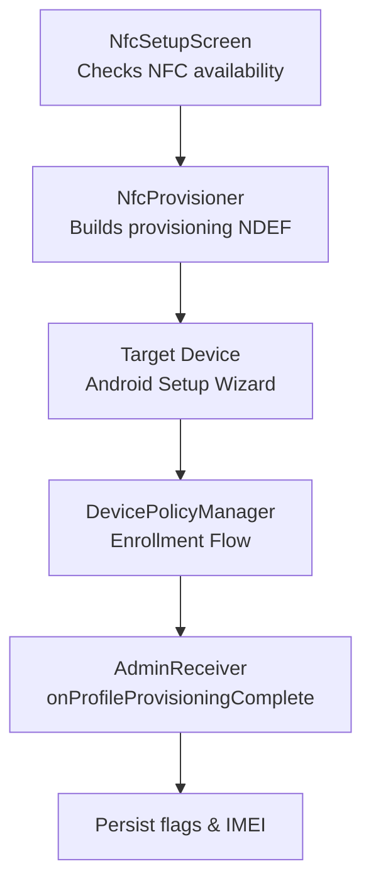
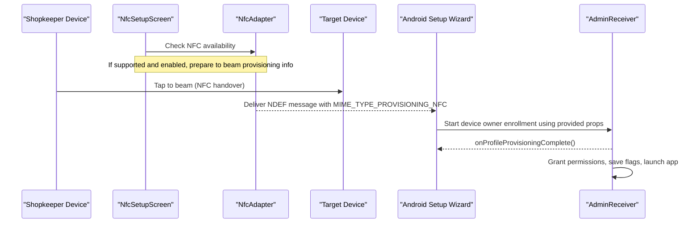
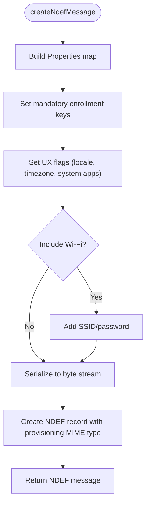
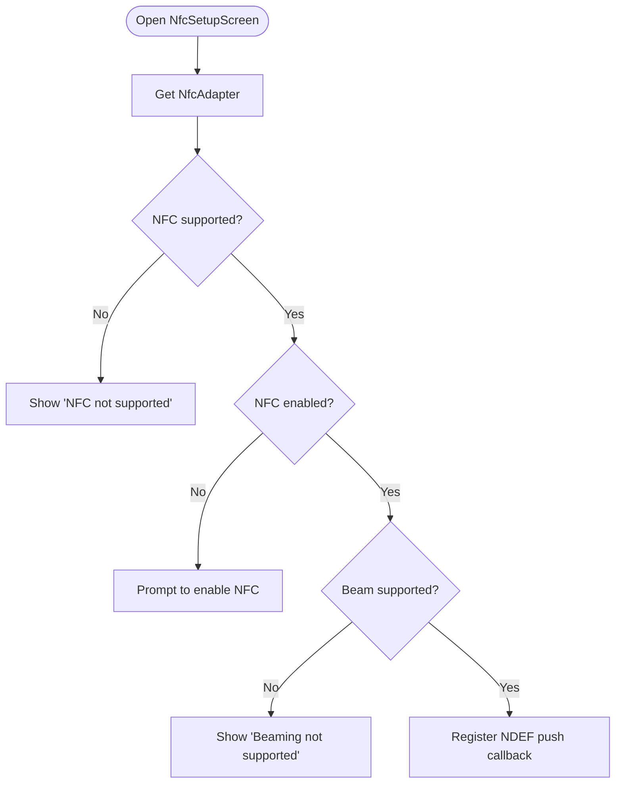
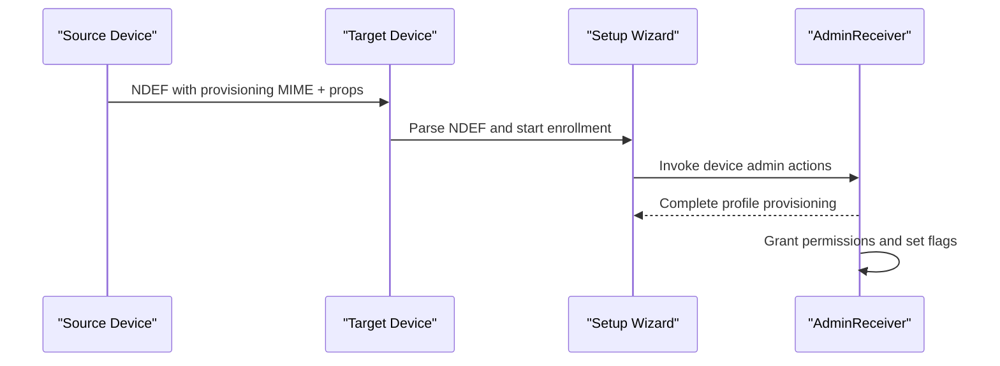
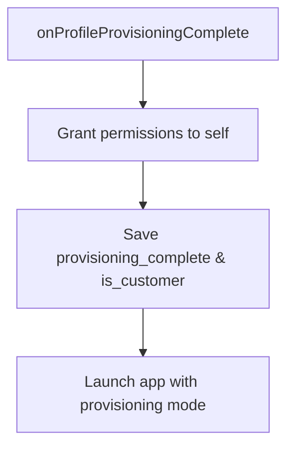
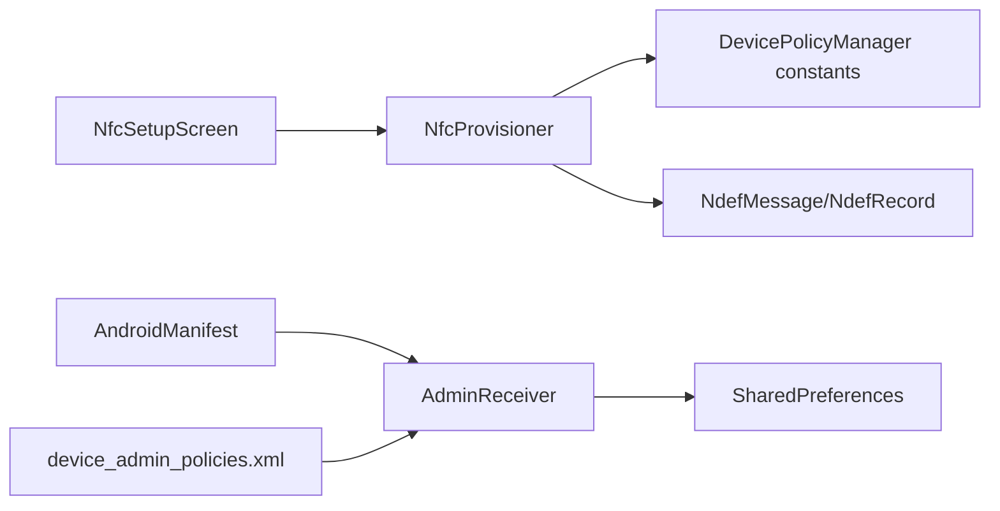

# NFC-Based Provisioning

<cite>
**Referenced Files in This Document**
- [NfcProvisioner.kt](file://app/src/main/java/com/pksafe/lock/manager/util/NfcProvisioner.kt)
- [NfcSetupScreen.kt](file://app/src/main/java/com/pksafe/lock/manager/ui/provisioning/NfcSetupScreen.kt)
- [AdminReceiver.kt](file://app/src/main/java/com/pksafe/lock/manager/receiver/AdminReceiver.kt)
- [AndroidManifest.xml](file://app/src/main/AndroidManifest.xml)
- [device_admin_policies.xml](file://app/src/main/res/xml/device_admin_policies.xml)
- [GetProvisioningModeActivity.kt](file://app/src/main/java/com/pksafe/lock/manager/receiver/GetProvisioningModeActivity.kt)
- [AdminPolicyComplianceActivity.kt](file://app/src/main/java/com/pksafe/lock/manager/receiver/AdminPolicyComplianceActivity.kt)
</cite>

## Table of Contents
1. [Introduction](#introduction)
2. [Project Structure](#project-structure)
3. [Core Components](#core-components)
4. [Architecture Overview](#architecture-overview)
5. [Detailed Component Analysis](#detailed-component-analysis)
6. [Dependency Analysis](#dependency-analysis)
7. [Performance Considerations](#performance-considerations)
8. [Troubleshooting Guide](#troubleshooting-guide)
9. [Conclusion](#conclusion)

## Introduction
This document explains how PK Locker uses NFC to provision devices as device owners during initial setup. It covers the NFC tag format, data encoding, and the end-to-end flow from a shopkeeper’s device broadcasting provisioning information to a target device that enrolls itself as a fully managed device. It also documents current implementation status, compatibility requirements, and troubleshooting steps for NFC-related issues during provisioning.

## Project Structure
PK Locker implements NFC-based provisioning through:
- A UI screen that checks NFC availability and guides users to perform a tap-beam flow.
- An NFC helper that builds a standard Android provisioning NDEF message containing device owner enrollment parameters.
- A Device Admin Receiver that finalizes provisioning by granting permissions and marking the device as customer-managed.
- Manifest entries declaring the device admin receiver and related policies.

**Diagram sources**
- [NfcSetupScreen.kt:29-45](file://app/src/main/java/com/pksafe/lock/manager/ui/provisioning/NfcSetupScreen.kt#L29-L45)
- [NfcProvisioner.kt:22-49](file://app/src/main/java/com/pksafe/lock/manager/util/NfcProvisioner.kt#L22-L49)
- [AdminReceiver.kt:23-36](file://app/src/main/java/com/pksafe/lock/manager/receiver/AdminReceiver.kt#L23-L36)

**Section sources**
- [NfcSetupScreen.kt:29-45](file://app/src/main/java/com/pksafe/lock/manager/ui/provisioning/NfcSetupScreen.kt#L29-L45)
- [NfcProvisioner.kt:22-49](file://app/src/main/java/com/pksafe/lock/manager/util/NfcProvisioner.kt#L22-L49)
- [AdminReceiver.kt:23-36](file://app/src/main/java/com/pksafe/lock/manager/receiver/AdminReceiver.kt#L23-L36)
- [AndroidManifest.xml:87-99](file://app/src/main/AndroidManifest.xml#L87-L99)

## Core Components
- NfcProvisioner: Creates an NDEF message with Android provisioning properties (device admin package, component name, download URL, signature checksum, locale/time zone, system app policy).
- NfcSetupScreen: Detects NFC hardware and state; currently comments out deprecated push APIs and informs users about version limitations.
- AdminReceiver: Handles post-provisioning tasks such as granting critical permissions and persisting provisioning completion flags.
- Manifest declarations: Register the device admin receiver and its policies.

Key responsibilities:
- Build standardized provisioning payload using MIME type for Android provisioning.
- Ensure device admin receiver is declared and policies are configured.
- Finalize provisioning by setting flags and launching the app.

**Section sources**
- [NfcProvisioner.kt:15-49](file://app/src/main/java/com/pksafe/lock/manager/util/NfcProvisioner.kt#L15-L49)
- [NfcSetupScreen.kt:29-45](file://app/src/main/java/com/pksafe/lock/manager/ui/provisioning/NfcSetupScreen.kt#L29-L45)
- [AdminReceiver.kt:23-36](file://app/src/main/java/com/pksafe/lock/manager/receiver/AdminReceiver.kt#L23-L36)
- [AndroidManifest.xml:87-99](file://app/src/main/AndroidManifest.xml#L87-L99)
- [device_admin_policies.xml:1-13](file://app/src/main/res/xml/device_admin_policies.xml#L1-L13)

## Architecture Overview
The NFC provisioning architecture follows Android’s built-in device owner enrollment via NFC:

**Diagram sources**
- [NfcSetupScreen.kt:29-45](file://app/src/main/java/com/pksafe/lock/manager/ui/provisioning/NfcSetupScreen.kt#L29-L45)
- [NfcProvisioner.kt:22-49](file://app/src/main/java/com/pksafe/lock/manager/util/NfcProvisioner.kt#L22-L49)
- [AdminReceiver.kt:23-36](file://app/src/main/java/com/pksafe/lock/manager/receiver/AdminReceiver.kt#L23-L36)

## Detailed Component Analysis

### NFC Tag Format and Data Encoding
- The provisioning payload is encoded as an NDEF record with MIME type for Android provisioning.
- The payload is a serialized Properties object containing:
  - Device admin package name
  - Device admin component name (receiver class)
  - APK download location
  - Signature checksum for verification
  - Locale and time zone settings
  - System apps policy flag
- Optional fields exist for Wi-Fi credentials but are disabled by default.

**Diagram sources**
- [NfcProvisioner.kt:22-49](file://app/src/main/java/com/pksafe/lock/manager/util/NfcProvisioner.kt#L22-L49)

**Section sources**
- [NfcProvisioner.kt:22-49](file://app/src/main/java/com/pksafe/lock/manager/util/NfcProvisioner.kt#L22-L49)

### NFC Intent Handling and Tag Discovery
- The UI obtains the NFC adapter and checks if NFC is supported and enabled.
- The code path that would register a callback to beam the provisioning NDEF message is commented out due to deprecation/removal in recent Android versions.
- As a result, the UI currently shows a message indicating NFC beaming is not supported on this Android version.

**Diagram sources**
- [NfcSetupScreen.kt:29-45](file://app/src/main/java/com/pksafe/lock/manager/ui/provisioning/NfcSetupScreen.kt#L29-L45)

**Section sources**
- [NfcSetupScreen.kt:29-45](file://app/src/main/java/com/pksafe/lock/manager/ui/provisioning/NfcSetupScreen.kt#L29-L45)

### Secure Data Exchange Between Devices
- The provisioning payload includes the device admin component and a signature checksum to ensure the target device trusts the DPC.
- The target device’s Setup Wizard validates the payload and initiates enrollment when it receives the correct MIME type.
- After enrollment completes, the device admin receiver grants necessary permissions and persists provisioning state.

**Diagram sources**
- [NfcProvisioner.kt:22-49](file://app/src/main/java/com/pksafe/lock/manager/util/NfcProvisioner.kt#L22-L49)
- [AdminReceiver.kt:23-36](file://app/src/main/java/com/pksafe/lock/manager/receiver/AdminReceiver.kt#L23-L36)

**Section sources**
- [NfcProvisioner.kt:22-49](file://app/src/main/java/com/pksafe/lock/manager/util/NfcProvisioner.kt#L22-L49)
- [AdminReceiver.kt:23-36](file://app/src/main/java/com/pksafe/lock/manager/receiver/AdminReceiver.kt#L23-L36)

### Post-Provisioning Behavior
- On profile provisioning complete, the receiver:
  - Grants critical permissions to itself as device owner
  - Saves provisioning completion flags
  - Launches the app to continue setup

**Diagram sources**
- [AdminReceiver.kt:23-36](file://app/src/main/java/com/pksafe/lock/manager/receiver/AdminReceiver.kt#L23-L36)
- [AdminReceiver.kt:43-102](file://app/src/main/java/com/pksafe/lock/manager/receiver/AdminReceiver.kt#L43-L102)

**Section sources**
- [AdminReceiver.kt:23-36](file://app/src/main/java/com/pksafe/lock/manager/receiver/AdminReceiver.kt#L23-L36)
- [AdminReceiver.kt:43-102](file://app/src/main/java/com/pksafe/lock/manager/receiver/AdminReceiver.kt#L43-L102)

### Compatibility Requirements
- Requires NFC-capable hardware and OS support for device owner provisioning via NFC.
- The current UI detects NFC presence and enables/disables guidance accordingly.
- Due to API deprecation, NFC beam registration is commented out; therefore, direct tap-beam provisioning may not function on newer Android versions without updating to alternative discovery methods.

**Section sources**
- [NfcSetupScreen.kt:29-45](file://app/src/main/java/com/pksafe/lock/manager/ui/provisioning/NfcSetupScreen.kt#L29-L45)
- [AndroidManifest.xml:87-99](file://app/src/main/AndroidManifest.xml#L87-L99)

## Dependency Analysis
PK Locker’s NFC provisioning depends on Android framework components and internal receivers:

**Diagram sources**
- [NfcSetupScreen.kt:29-45](file://app/src/main/java/com/pksafe/lock/manager/ui/provisioning/NfcSetupScreen.kt#L29-L45)
- [NfcProvisioner.kt:22-49](file://app/src/main/java/com/pksafe/lock/manager/util/NfcProvisioner.kt#L22-L49)
- [AdminReceiver.kt:23-36](file://app/src/main/java/com/pksafe/lock/manager/receiver/AdminReceiver.kt#L23-L36)
- [AndroidManifest.xml:87-99](file://app/src/main/AndroidManifest.xml#L87-L99)
- [device_admin_policies.xml:1-13](file://app/src/main/res/xml/device_admin_policies.xml#L1-L13)

**Section sources**
- [NfcSetupScreen.kt:29-45](file://app/src/main/java/com/pksafe/lock/manager/ui/provisioning/NfcSetupScreen.kt#L29-L45)
- [NfcProvisioner.kt:22-49](file://app/src/main/java/com/pksafe/lock/manager/util/NfcProvisioner.kt#L22-L49)
- [AdminReceiver.kt:23-36](file://app/src/main/java/com/pksafe/lock/manager/receiver/AdminReceiver.kt#L23-L36)
- [AndroidManifest.xml:87-99](file://app/src/main/AndroidManifest.xml#L87-L99)
- [device_admin_policies.xml:1-13](file://app/src/main/res/xml/device_admin_policies.xml#L1-L13)

## Performance Considerations
- NFC handover and NDEF parsing are lightweight operations; performance impact is minimal.
- Avoid unnecessary re-checks of NFC state; cache adapter availability within the screen lifecycle.
- Keep the provisioning payload small; only include required fields to minimize overhead.

[No sources needed since this section provides general guidance]

## Troubleshooting Guide
Common issues and resolutions:
- NFC not supported or disabled:
  - The UI displays messages when NFC is unavailable or disabled. Ensure NFC is enabled in device settings.
- Beaming not supported:
  - The current implementation comments out the deprecated callback used to beam NDEF messages. On newer Android versions, use alternative NFC discovery mechanisms (e.g., foreground dispatch) to read/write tags or implement peer-to-peer communication.
- Enrollment fails:
  - Verify the device admin receiver is declared in the manifest and policies are correctly configured.
  - Ensure the APK download URL and signature checksum match the installed DPC.
- Post-provisioning state not set:
  - Confirm that onProfileProvisioningComplete runs and sets provisioning flags. Check logs for permission grant and state persistence.

Operational notes:
- The device admin receiver grants permissions and saves provisioning flags upon completion.
- For QR-based flows, additional activities handle mode selection and compliance responses; these are separate from NFC but part of the overall provisioning strategy.

**Section sources**
- [NfcSetupScreen.kt:29-45](file://app/src/main/java/com/pksafe/lock/manager/ui/provisioning/NfcSetupScreen.kt#L29-L45)
- [AdminReceiver.kt:23-36](file://app/src/main/java/com/pksafe/lock/manager/receiver/AdminReceiver.kt#L23-L36)
- [AndroidManifest.xml:87-99](file://app/src/main/AndroidManifest.xml#L87-L99)
- [GetProvisioningModeActivity.kt:18-36](file://app/src/main/java/com/pksafe/lock/manager/receiver/GetProvisioningModeActivity.kt#L18-L36)
- [AdminPolicyComplianceActivity.kt:16-34](file://app/src/main/java/com/pksafe/lock/manager/receiver/AdminPolicyComplianceActivity.kt#L16-L34)

## Conclusion
PK Locker’s NFC provisioning leverages Android’s standard device owner enrollment mechanism by emitting an NDEF message with provisioning properties. While the core payload and receiver logic are implemented, the current UI does not actively beam the NDEF message due to API deprecation. To restore NFC-based provisioning on modern Android versions, update the NFC interaction to use supported discovery methods and ensure the device admin receiver remains properly registered. Once integrated, the flow will enroll target devices as fully managed devices, grant necessary permissions, and finalize setup automatically.