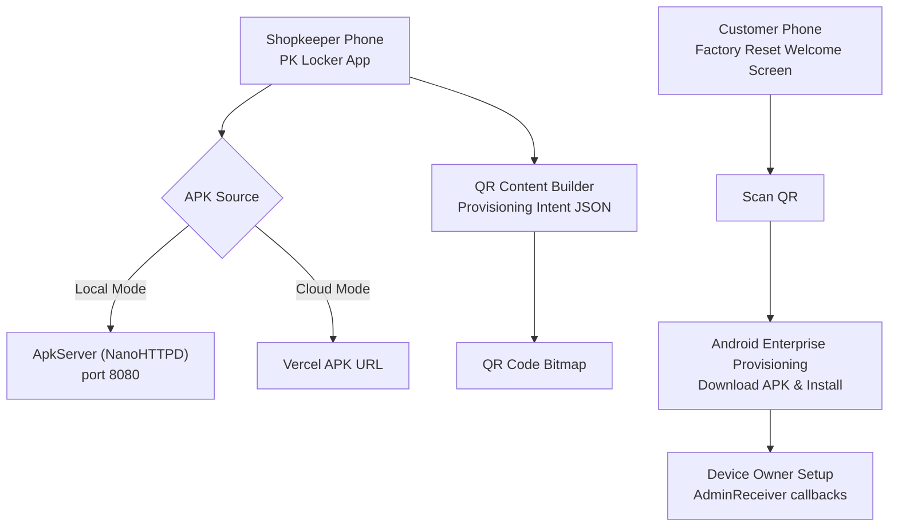
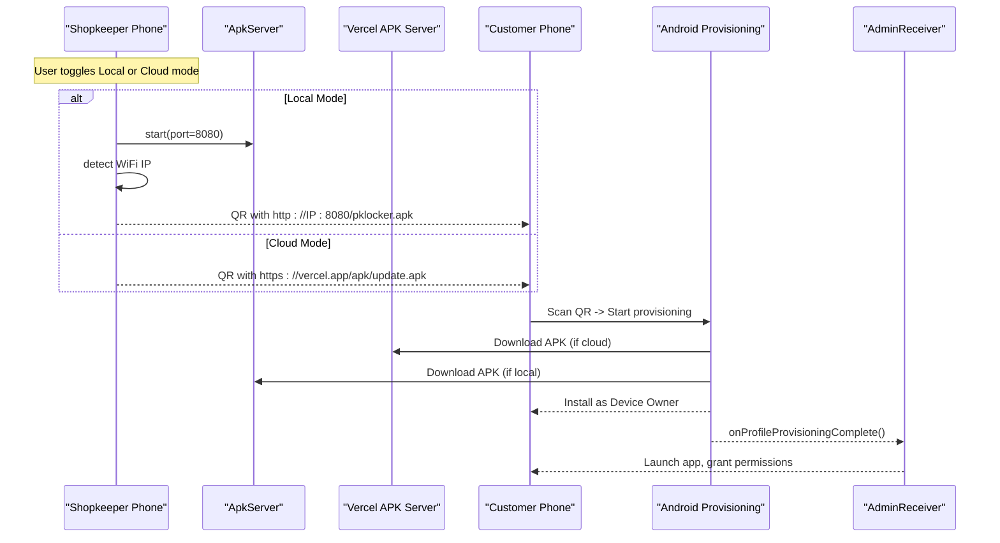
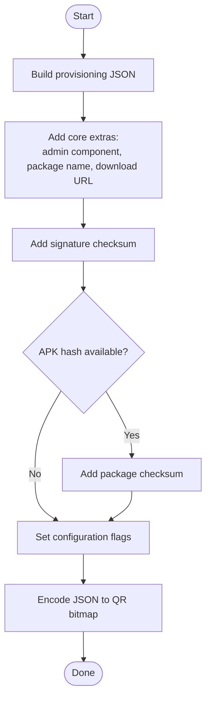
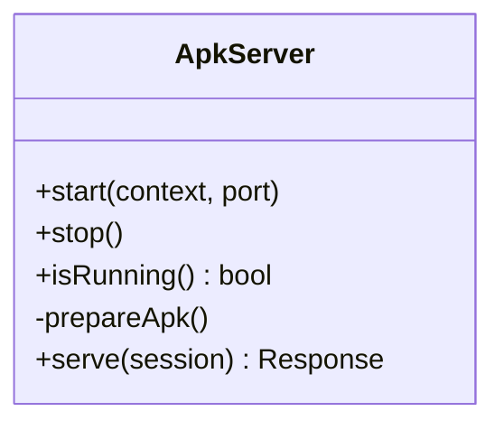
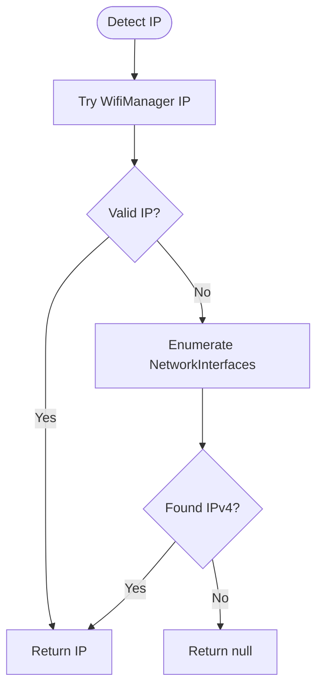
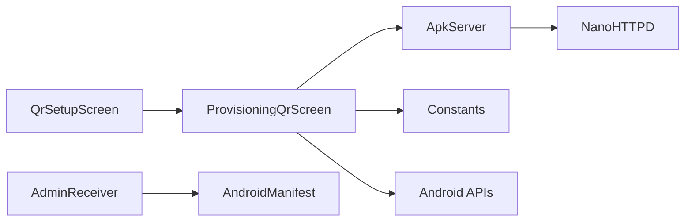

# QR Code Provisioning

<cite>
**Referenced Files in This Document**
- [ProvisioningQrScreen.kt](file://app/src/main/java/com/pksafe/lock/manager/ui/provisioning/ProvisioningQrScreen.kt)
- [ApkServer.kt](file://app/src/main/java/com/pksafe/lock/manager/util/ApkServer.kt)
- [Constants.kt](file://app/src/main/java/com/pksafe/lock/manager/util/Constants.kt)
- [AdminReceiver.kt](file://app/src/main/java/com/pksafe/lock/manager/receiver/AdminReceiver.kt)
- [AndroidManifest.xml](file://app/src/main/AndroidManifest.xml)
- [QrSetupScreen.kt](file://app/src/main/java/com/pksafe/lock/manager/ui/dashboard/QrSetupScreen.kt)
</cite>

## Table of Contents
1. Introduction
2. Project Structure
3. Core Components
4. Architecture Overview
5. Detailed Component Analysis
6. Dependency Analysis
7. Performance Considerations
8. Troubleshooting Guide
9. Conclusion

## Introduction
This document explains how PK Locker generates and uses QR codes to provision customer Android devices as Device Owner during factory reset setup. It covers both cloud mode (Vercel-hosted APK server) and local server mode (shopkeeper phone serves the APK), including WiFi IP detection, APK download verification via checksums, and the exact provisioning extras embedded in the QR content. It also provides step-by-step instructions for shopkeepers to provision new phones by scanning the generated QR code on the device’s welcome screen, along with troubleshooting guidance for common issues like WiFi connectivity, QR generation failures, and device owner setup problems.

## Project Structure
PK Locker implements QR-based provisioning primarily through a Compose UI that builds an Android provisioning intent JSON, computes security checksums, and renders a scannable QR code. A lightweight HTTP server can run directly on the shopkeeper’s phone to serve the APK locally, or the app can use a Vercel-hosted APK URL. After scanning, the target device downloads and installs the app as Device Owner using Android’s built-in enterprise provisioning flow.

**Diagram sources**
- [ProvisioningQrScreen.kt:120-157](file://app/src/main/java/com/pksafe/lock/manager/ui/provisioning/ProvisioningQrScreen.kt#L120-L157)
- [ApkServer.kt:25-43](file://app/src/main/java/com/pksafe/lock/manager/util/ApkServer.kt#L25-L43)
- [Constants.kt:7-9](file://app/src/main/java/com/pksafe/lock/manager/util/Constants.kt#L7-L9)
- [AdminReceiver.kt:23-36](file://app/src/main/java/com/pksafe/lock/manager/receiver/AdminReceiver.kt#L23-L36)

**Section sources**
- [ProvisioningQrScreen.kt:42-118](file://app/src/main/java/com/pksafe/lock/manager/ui/provisioning/ProvisioningQrScreen.kt#L42-L118)
- [ApkServer.kt:1-95](file://app/src/main/java/com/pksafe/lock/manager/util/ApkServer.kt#L1-L95)
- [Constants.kt:1-10](file://app/src/main/java/com/pksafe/lock/manager/util/Constants.kt#L1-L10)
- [AndroidManifest.xml:87-99](file://app/src/main/AndroidManifest.xml#L87-L99)

## Core Components
- QR Content Builder: Assembles Android provisioning intent extras into a JSON string and encodes it into a QR bitmap. Includes device admin component name, package name, download location, signature checksum, optional package checksum, and configuration flags.
- Local APK Server: Runs NanoHTTPD on the shopkeeper’s phone to serve the currently installed APK under a simple path. Provides health status and supports serving the APK file.
- WiFi IP Detection: Detects the shopkeeper phone’s IPv4 address from Wi-Fi or network interfaces to build a reachable local URL for the target device.
- Cloud Mode: Uses a Vercel-hosted APK URL when not running the local server. Computes the APK hash remotely to include in the QR payload.
- Device Owner Receiver: Handles provisioning completion, grants critical permissions, captures IMEI, and launches the app post-setup.

**Section sources**
- [ProvisioningQrScreen.kt:120-157](file://app/src/main/java/com/pksafe/lock/manager/ui/provisioning/ProvisioningQrScreen.kt#L120-L157)
- [ProvisioningQrScreen.kt:385-459](file://app/src/main/java/com/pksafe/lock/manager/ui/provisioning/ProvisioningQrScreen.kt#L385-L459)
- [ApkServer.kt:25-93](file://app/src/main/java/com/pksafe/lock/manager/util/ApkServer.kt#L25-L93)
- [AdminReceiver.kt:23-36](file://app/src/main/java/com/pksafe/lock/manager/receiver/AdminReceiver.kt#L23-L36)

## Architecture Overview
The provisioning flow is driven by two modes:

- Cloud Mode (Vercel): The app uses a fixed APK URL hosted on Vercel. It fetches the APK stream to compute its SHA-256 hash and includes this checksum in the QR payload. The target device downloads the APK from Vercel during provisioning.
- Local Mode (Phone Server): The app starts a local HTTP server on port 8080, copies the current APK to a cache directory, and serves it at a known path. It detects the shopkeeper phone’s WiFi IP and constructs a local URL for the target device to download the APK.

After scanning, Android’s enterprise provisioning flow handles downloading and installing the app as Device Owner. Upon completion, the app’s receiver triggers post-provisioning tasks such as granting permissions and launching the app.

**Diagram sources**
- [ProvisioningQrScreen.kt:64-111](file://app/src/main/java/com/pksafe/lock/manager/ui/provisioning/ProvisioningQrScreen.kt#L64-L111)
- [ProvisioningQrScreen.kt:120-157](file://app/src/main/java/com/pksafe/lock/manager/ui/provisioning/ProvisioningQrScreen.kt#L120-L157)
- [ApkServer.kt:25-93](file://app/src/main/java/com/pksafe/lock/manager/util/ApkServer.kt#L25-L93)
- [AdminReceiver.kt:23-36](file://app/src/main/java/com/pksafe/lock/manager/receiver/AdminReceiver.kt#L23-L36)

## Detailed Component Analysis

### QR Content Generation and Security Checksums
- Intent extras included:
  - Device admin component name and package name
  - APK download location (local or Vercel)
  - Signature checksum (Base64-encoded SHA-256 of the app signing certificate)
  - Optional package checksum (SHA-256 of the APK file)
  - Configuration flags: leave system apps enabled, skip encryption, allow mobile data, locale, time zone
  - Extras bundle passed to the app after setup
- QR encoding: The JSON string is encoded into a QR bitmap using a QR writer.

**Diagram sources**
- [ProvisioningQrScreen.kt:120-157](file://app/src/main/java/com/pksafe/lock/manager/ui/provisioning/ProvisioningQrScreen.kt#L120-L157)

**Section sources**
- [ProvisioningQrScreen.kt:120-157](file://app/src/main/java/com/pksafe/lock/manager/ui/provisioning/ProvisioningQrScreen.kt#L120-L157)

### Local Server Mode (ApkServer)
- Starts a NanoHTTPD server on port 8080
- Copies the currently installed APK to a cache directory and serves it at a known path
- Provides a health endpoint and returns the APK MIME type for installation
- Supports stopping and checking if the server is alive

**Diagram sources**
- [ApkServer.kt:14-93](file://app/src/main/java/com/pksafe/lock/manager/util/ApkServer.kt#L14-L93)

**Section sources**
- [ApkServer.kt:25-93](file://app/src/main/java/com/pksafe/lock/manager/util/ApkServer.kt#L25-L93)

### WiFi IP Detection
- Attempts to get the IPv4 address via Wi-Fi manager connection info
- Falls back to enumerating network interfaces to find a non-loopback IPv4 address
- Used to construct a reachable local URL for the target device

**Diagram sources**
- [ProvisioningQrScreen.kt:385-418](file://app/src/main/java/com/pksafe/lock/manager/ui/provisioning/ProvisioningQrScreen.kt#L385-L418)

**Section sources**
- [ProvisioningQrScreen.kt:385-418](file://app/src/main/java/com/pksafe/lock/manager/ui/provisioning/ProvisioningQrScreen.kt#L385-L418)

### Cloud Mode (Vercel)
- Uses a constant APK URL for production
- Downloads the APK stream to compute its SHA-256 hash and includes it in the QR payload
- Displays readiness status once the hash is successfully fetched

**Section sources**
- [Constants.kt:7-9](file://app/src/main/java/com/pksafe/lock/manager/util/Constants.kt#L7-L9)
- [ProvisioningQrScreen.kt:95-111](file://app/src/main/java/com/pksafe/lock/manager/ui/provisioning/ProvisioningQrScreen.kt#L95-L111)
- [ProvisioningQrScreen.kt:445-459](file://app/src/main/java/com/pksafe/lock/manager/ui/provisioning/ProvisioningQrScreen.kt#L445-L459)

### Post-Provisioning Handling (AdminReceiver)
- Receives provisioning completion events
- Grants critical permissions to itself as Device Owner
- Captures IMEI information and marks provisioning complete
- Launches the app with provisioning mode extras

**Section sources**
- [AdminReceiver.kt:23-36](file://app/src/main/java/com/pksafe/lock/manager/receiver/AdminReceiver.kt#L23-L36)
- [AdminReceiver.kt:43-102](file://app/src/main/java/com/pksafe/lock/manager/receiver/AdminReceiver.kt#L43-L102)
- [AndroidManifest.xml:87-99](file://app/src/main/AndroidManifest.xml#L87-L99)

### QR Entry Points and Options
- Dashboard screen offers two options:
  - App Download QR: Generates a QR containing the APK download URL for normal camera scanning
  - Welcome Screen Setup QR: Navigates to the full provisioning QR screen for Device Owner setup

**Section sources**
- [QrSetupScreen.kt:32-37](file://app/src/main/java/com/pksafe/lock/manager/ui/dashboard/QrSetupScreen.kt#L32-L37)
- [QrSetupScreen.kt:163-242](file://app/src/main/java/com/pksafe/lock/manager/ui/dashboard/QrSetupScreen.kt#L163-L242)
- [QrSetupScreen.kt:250-268](file://app/src/main/java/com/pksafe/lock/manager/ui/dashboard/QrSetupScreen.kt#L250-L268)

## Dependency Analysis
- ProvisioningQrScreen depends on:
  - ApkServer for local mode
  - Constants for cloud mode URLs
  - Android APIs for QR generation, networking, and signature retrieval
- ApkServer depends on NanoHTTPD and Android Context
- AdminReceiver is declared in the manifest and receives provisioning lifecycle events
- QrSetupScreen delegates to ProvisioningQrScreen for full provisioning flows

**Diagram sources**
- [ProvisioningQrScreen.kt:30-38](file://app/src/main/java/com/pksafe/lock/manager/ui/provisioning/ProvisioningQrScreen.kt#L30-L38)
- [ApkServer.kt:3-7](file://app/src/main/java/com/pksafe/lock/manager/util/ApkServer.kt#L3-L7)
- [AndroidManifest.xml:87-99](file://app/src/main/AndroidManifest.xml#L87-L99)
- [QrSetupScreen.kt:28-37](file://app/src/main/java/com/pksafe/lock/manager/ui/dashboard/QrSetupScreen.kt#L28-L37)

**Section sources**
- [ProvisioningQrScreen.kt:30-38](file://app/src/main/java/com/pksafe/lock/manager/ui/provisioning/ProvisioningQrScreen.kt#L30-L38)
- [ApkServer.kt:3-7](file://app/src/main/java/com/pksafe/lock/manager/util/ApkServer.kt#L3-L7)
- [AndroidManifest.xml:87-99](file://app/src/main/AndroidManifest.xml#L87-L99)
- [QrSetupScreen.kt:28-37](file://app/src/main/java/com/pksafe/lock/manager/ui/dashboard/QrSetupScreen.kt#L28-L37)

## Performance Considerations
- QR generation runs on the UI thread but uses small bitmaps; ensure background work for network operations to avoid blocking.
- APK hash computation streams the entire APK; prefer caching results and refreshing only when needed.
- Local server serves the APK from disk; ensure sufficient storage and fast I/O.
- Avoid frequent refresh cycles; provide manual refresh controls to reduce network overhead.

[No sources needed since this section provides general guidance]

## Troubleshooting Guide

- WiFi Connectivity Issues (Local Mode)
  - Symptom: No IP detected; QR shows “WiFi not connected” warning.
  - Actions:
    - Ensure the shopkeeper phone is connected to the same WiFi network as the customer phone.
    - If no WiFi is available, enable a hotspot on the shopkeeper phone and connect the customer phone to it.
    - Verify the local server started successfully and the status shows “Ready”.

- QR Generation Failures
  - Symptom: QR does not appear or status indicates failure.
  - Actions:
    - Confirm the APK source is reachable (local server or Vercel).
    - Use the refresh button to recompute the APK hash.
    - Check for exceptions during QR encoding and network requests.

- Device Owner Setup Problems
  - Symptom: Provisioning fails or app does not become Device Owner.
  - Actions:
    - Ensure the device is on the factory reset welcome screen and the enterprise QR scanner is triggered.
    - Verify the signature checksum matches the app’s signing certificate.
    - Confirm the download URL is reachable from the customer device.
    - Check that the app’s device admin receiver is registered in the manifest.

- Post-Provisioning Launch Issues
  - Symptom: App does not launch automatically after provisioning.
  - Actions:
    - Confirm the receiver handles provisioning completion and launches the app.
    - Verify permissions are granted and provisioning flags are set correctly.

**Section sources**
- [ProvisioningQrScreen.kt:64-111](file://app/src/main/java/com/pksafe/lock/manager/ui/provisioning/ProvisioningQrScreen.kt#L64-L111)
- [ProvisioningQrScreen.kt:295-387](file://app/src/main/java/com/pksafe/lock/manager/ui/provisioning/ProvisioningQrScreen.kt#L295-L387)
- [ProvisioningQrScreen.kt:385-459](file://app/src/main/java/com/pksafe/lock/manager/ui/provisioning/ProvisioningQrScreen.kt#L385-L459)
- [AdminReceiver.kt:23-36](file://app/src/main/java/com/pksafe/lock/manager/receiver/AdminReceiver.kt#L23-L36)
- [AndroidManifest.xml:87-99](file://app/src/main/AndroidManifest.xml#L87-L99)

## Conclusion
PK Locker’s QR-based provisioning enables shopkeepers to quickly set up customer devices as Device Owner using either a local server or a cloud-hosted APK. The system embeds essential provisioning extras, validates APK integrity via checksums, and automates post-setup tasks. By following the provided steps and troubleshooting guidance, shopkeepers can reliably provision devices even in environments with limited connectivity.

[No sources needed since this section summarizes without analyzing specific files]