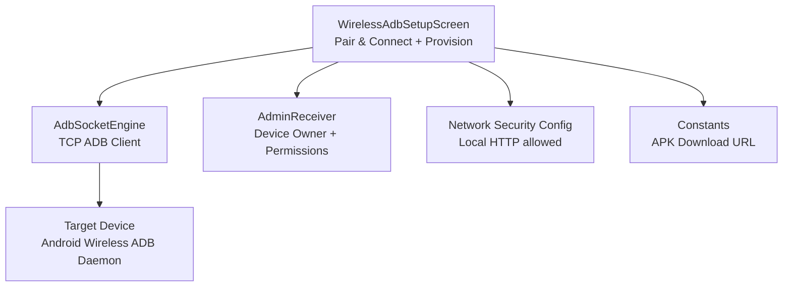
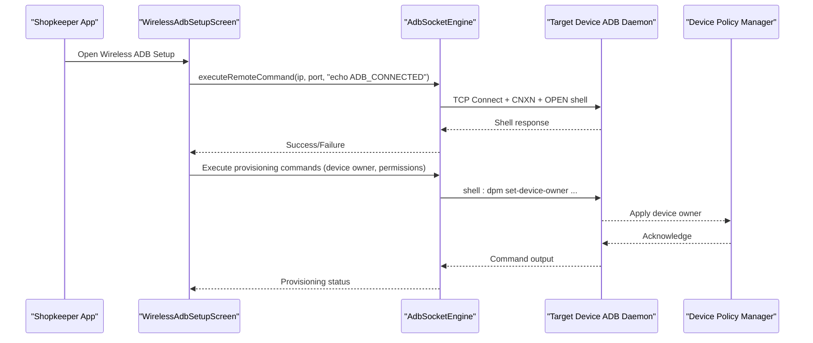
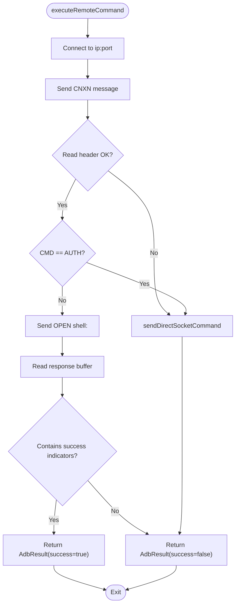
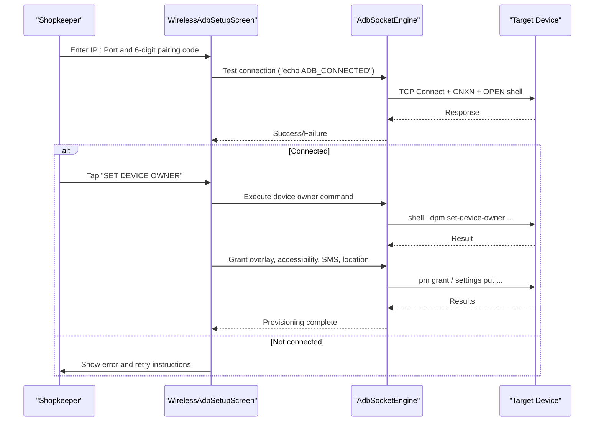
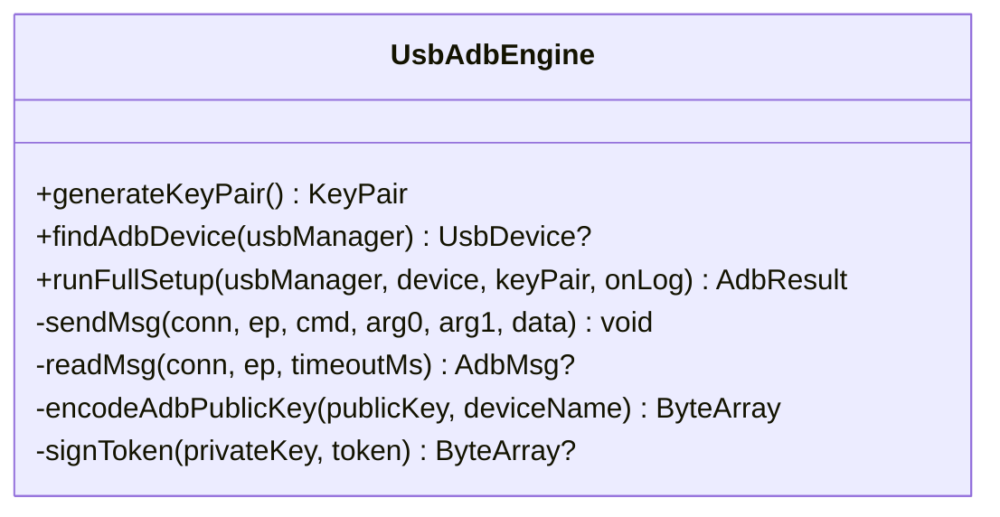
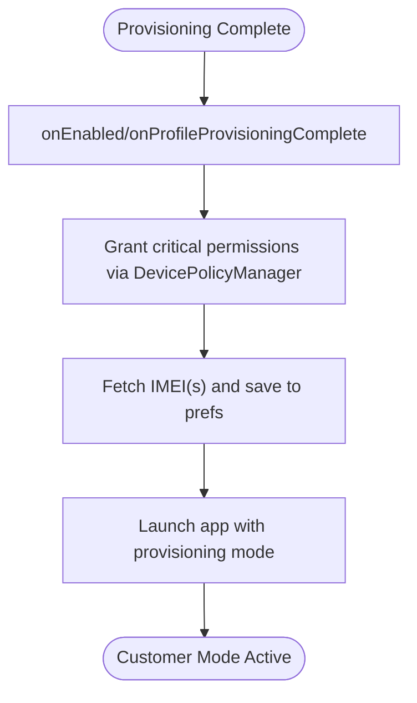
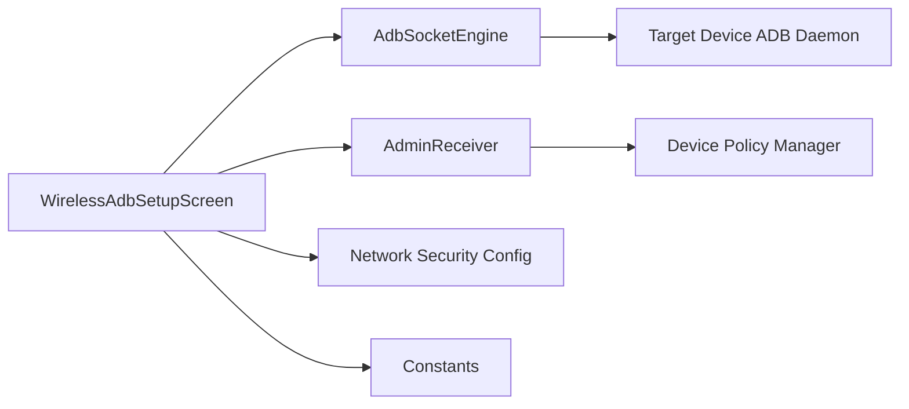

# Wireless ADB Configuration

<cite>
**Referenced Files in This Document**
- [AdbSocketEngine.kt](file://app/src/main/java/com/pksafe/lock/manager/util/AdbSocketEngine.kt)
- [WirelessAdbSetupScreen.kt](file://app/src/main/java/com/pksafe/lock/manager/ui/provisioning/WirelessAdbSetupScreen.kt)
- [UsbAdbEngine.kt](file://app/src/main/java/com/pksafe/lock/manager/util/UsbAdbEngine.kt)
- [AdminReceiver.kt](file://app/src/main/java/com/pksafe/lock/manager/receiver/AdminReceiver.kt)
- [Constants.kt](file://app/src/main/java/com/pksafe/lock/manager/util/Constants.kt)
- [network_security_config.xml](file://app/src/main/res/xml/network_security_config.xml)
</cite>

## Table of Contents
1. Introduction
2. Project Structure
3. Core Components
4. Architecture Overview
5. Detailed Component Analysis
6. Dependency Analysis
7. Performance Considerations
8. Troubleshooting Guide
9. Conclusion

## Introduction
This document explains how PK Locker enables wireless ADB debugging for remote device provisioning. It covers the end-to-end workflow from enabling wireless debugging on target devices to establishing secure connections over a local Wi-Fi network and executing provisioning commands remotely. The system includes a custom ADB socket engine that communicates directly with Android’s wireless ADB daemon, a guided UI for shopkeepers to pair and provision devices without cables, and security measures to protect wireless connections.

## Project Structure
The wireless ADB provisioning flow spans UI, networking, and device administration components:
- UI layer guides shopkeepers through pairing and provisioning steps.
- Networking layer implements an ADB socket client to execute shell commands over TCP.
- Device administration ensures the app becomes device owner and auto-grants required permissions.
- Network security configuration allows necessary local traffic while enforcing HTTPS elsewhere.

**Diagram sources**
- [WirelessAdbSetupScreen.kt:52-382](file://app/src/main/java/com/pksafe/lock/manager/ui/provisioning/WirelessAdbSetupScreen.kt#L52-L382)
- [AdbSocketEngine.kt:25-96](file://app/src/main/java/com/pksafe/lock/manager/util/AdbSocketEngine.kt#L25-L96)
- [AdminReceiver.kt:16-36](file://app/src/main/java/com/pksafe/lock/manager/receiver/AdminReceiver.kt#L16-L36)
- [network_security_config.xml:16-26](file://app/src/main/res/xml/network_security_config.xml#L16-L26)
- [Constants.kt:7-9](file://app/src/main/java/com/pksafe/lock/manager/util/Constants.kt#L7-L9)

**Section sources**
- [WirelessAdbSetupScreen.kt:52-382](file://app/src/main/java/com/pksafe/lock/manager/ui/provisioning/WirelessAdbSetupScreen.kt#L52-L382)
- [AdbSocketEngine.kt:25-96](file://app/src/main/java/com/pksafe/lock/manager/util/AdbSocketEngine.kt#L25-L96)
- [AdminReceiver.kt:16-36](file://app/src/main/java/com/pksafe/lock/manager/receiver/AdminReceiver.kt#L16-L36)
- [network_security_config.xml:16-26](file://app/src/main/res/xml/network_security_config.xml#L16-L26)
- [Constants.kt:7-9](file://app/src/main/java/com/pksafe/lock/manager/util/Constants.kt#L7-L9)

## Core Components
- AdbSocketEngine: Implements a pure Kotlin ADB TCP client to connect to the target device’s wireless ADB daemon and execute shell commands (e.g., set device owner, grant permissions). Includes fallback logic for authentication or alternate ports.
- WirelessAdbSetupScreen: Provides a step-by-step guided flow for shopkeepers to enable developer options, turn on wireless debugging, pair using a 6-digit code, and run provisioning commands remotely.
- UsbAdbEngine: Alternative USB-based ADB implementation used when a physical connection is available; included here for completeness and comparison.
- AdminReceiver: Handles device owner activation and automatically grants critical permissions and captures IMEI after provisioning completes.
- Constants: Centralizes server URLs including the APK download link used during QR-based installation flows.
- Network Security Config: Allows cleartext HTTP within private IP ranges for local device communication while defaulting to HTTPS for other traffic.

**Section sources**
- [AdbSocketEngine.kt:13-163](file://app/src/main/java/com/pksafe/lock/manager/util/AdbSocketEngine.kt#L13-L163)
- [WirelessAdbSetupScreen.kt:52-382](file://app/src/main/java/com/pksafe/lock/manager/ui/provisioning/WirelessAdbSetupScreen.kt#L52-L382)
- [UsbAdbEngine.kt:13-353](file://app/src/main/java/com/pksafe/lock/manager/util/UsbAdbEngine.kt#L13-L353)
- [AdminReceiver.kt:16-103](file://app/src/main/java/com/pksafe/lock/manager/receiver/AdminReceiver.kt#L16-L103)
- [Constants.kt:3-10](file://app/src/main/java/com/pksafe/lock/manager/util/Constants.kt#L3-L10)
- [network_security_config.xml:9-27](file://app/src/main/res/xml/network_security_config.xml#L9-L27)

## Architecture Overview
The wireless provisioning architecture consists of three main layers:
- Shopkeeper UI: Guides users through enabling wireless debugging, entering pairing codes, and triggering provisioning.
- ADB Socket Layer: Communicates with the target device’s wireless ADB daemon over TCP, sending CNXN/OPEN messages and executing shell commands.
- Device Administration: Sets the app as device owner and grants necessary permissions to enforce lock policies and anti-uninstall protections.

**Diagram sources**
- [WirelessAdbSetupScreen.kt:226-367](file://app/src/main/java/com/pksafe/lock/manager/ui/provisioning/WirelessAdbSetupScreen.kt#L226-L367)
- [AdbSocketEngine.kt:25-96](file://app/src/main/java/com/pksafe/lock/manager/util/AdbSocketEngine.kt#L25-L96)
- [AdminReceiver.kt:16-36](file://app/src/main/java/com/pksafe/lock/manager/receiver/AdminReceiver.kt#L16-L36)

## Detailed Component Analysis

### ADB Socket Engine
The ADB socket engine establishes a TCP connection to the target device’s wireless ADB daemon and executes shell commands by constructing ADB protocol messages (CNXN, OPEN) and reading responses. It includes:
- Connection handling with timeouts and error logging.
- Fallback behavior if authentication is required or if the specified port fails, attempting default port 5555.
- Direct socket fallback for paired or TLS-authenticated scenarios.

**Diagram sources**
- [AdbSocketEngine.kt:25-96](file://app/src/main/java/com/pksafe/lock/manager/util/AdbSocketEngine.kt#L25-L96)
- [AdbSocketEngine.kt:98-114](file://app/src/main/java/com/pksafe/lock/manager/util/AdbSocketEngine.kt#L98-L114)

**Section sources**
- [AdbSocketEngine.kt:25-96](file://app/src/main/java/com/pksafe/lock/manager/util/AdbSocketEngine.kt#L25-L96)
- [AdbSocketEngine.kt:98-114](file://app/src/main/java/com/pksafe/lock/manager/util/AdbSocketEngine.kt#L98-L114)

### Wireless ADB Setup Screen
The setup screen provides a guided workflow:
- Step 1: Display QR code for APK download.
- Step 2: Enable Developer Options on the target device.
- Step 3: Enable Wireless Debugging and capture IP:Port.
- Step 4: Pair using a 6-digit pairing code shown on the target device.
- Step 5: Set Device Owner and auto-grant critical permissions via ADB commands.

**Diagram sources**
- [WirelessAdbSetupScreen.kt:226-367](file://app/src/main/java/com/pksafe/lock/manager/ui/provisioning/WirelessAdbSetupScreen.kt#L226-L367)
- [AdbSocketEngine.kt:25-96](file://app/src/main/java/com/pksafe/lock/manager/util/AdbSocketEngine.kt#L25-L96)

**Section sources**
- [WirelessAdbSetupScreen.kt:108-382](file://app/src/main/java/com/pksafe/lock/manager/ui/provisioning/WirelessAdbSetupScreen.kt#L108-L382)

### USB ADB Engine (Alternative Path)
When a physical USB connection is available, the USB ADB engine performs full ADB handshake, RSA key exchange, and runs the same provisioning commands over USB bulk transfers. This path is useful when wireless pairing is not possible or when higher reliability is needed.

**Diagram sources**
- [UsbAdbEngine.kt:47-174](file://app/src/main/java/com/pksafe/lock/manager/util/UsbAdbEngine.kt#L47-L174)
- [UsbAdbEngine.kt:189-353](file://app/src/main/java/com/pksafe/lock/manager/util/UsbAdbEngine.kt#L189-L353)

**Section sources**
- [UsbAdbEngine.kt:189-353](file://app/src/main/java/com/pksafe/lock/manager/util/UsbAdbEngine.kt#L189-L353)

### Device Administration and Post-Provisioning
After setting device owner, the app becomes the device administrator and can enforce policies and manage permissions. On provisioning completion, it:
- Auto-grants critical permissions (SMS, phone state).
- Captures IMEI information for device identification.
- Launches the app to finalize setup.

**Diagram sources**
- [AdminReceiver.kt:16-36](file://app/src/main/java/com/pksafe/lock/manager/receiver/AdminReceiver.kt#L16-L36)
- [AdminReceiver.kt:43-103](file://app/src/main/java/com/pksafe/lock/manager/receiver/AdminReceiver.kt#L43-L103)

**Section sources**
- [AdminReceiver.kt:16-103](file://app/src/main/java/com/pksafe/lock/manager/receiver/AdminReceiver.kt#L16-L103)

## Dependency Analysis
The wireless ADB provisioning depends on:
- UI orchestration in WirelessAdbSetupScreen coordinating user inputs and command execution.
- AdbSocketEngine providing low-level ADB TCP communication.
- AdminReceiver ensuring device ownership and permission management post-provisioning.
- Network security configuration allowing local HTTP traffic for LAN communications.
- Constants centralizing URLs for APK downloads and API endpoints.

**Diagram sources**
- [WirelessAdbSetupScreen.kt:226-367](file://app/src/main/java/com/pksafe/lock/manager/ui/provisioning/WirelessAdbSetupScreen.kt#L226-L367)
- [AdbSocketEngine.kt:25-96](file://app/src/main/java/com/pksafe/lock/manager/util/AdbSocketEngine.kt#L25-L96)
- [AdminReceiver.kt:16-36](file://app/src/main/java/com/pksafe/lock/manager/receiver/AdminReceiver.kt#L16-L36)
- [network_security_config.xml:16-26](file://app/src/main/res/xml/network_security_config.xml#L16-L26)
- [Constants.kt:7-9](file://app/src/main/java/com/pksafe/lock/manager/util/Constants.kt#L7-L9)

**Section sources**
- [WirelessAdbSetupScreen.kt:226-367](file://app/src/main/java/com/pksafe/lock/manager/ui/provisioning/WirelessAdbSetupScreen.kt#L226-L367)
- [AdbSocketEngine.kt:25-96](file://app/src/main/java/com/pksafe/lock/manager/util/AdbSocketEngine.kt#L25-L96)
- [AdminReceiver.kt:16-36](file://app/src/main/java/com/pksafe/lock/manager/receiver/AdminReceiver.kt#L16-L36)
- [network_security_config.xml:16-26](file://app/src/main/res/xml/network_security_config.xml#L16-L26)
- [Constants.kt:7-9](file://app/src/main/java/com/pksafe/lock/manager/util/Constants.kt#L7-L9)

## Performance Considerations
- Timeouts: Default socket timeout is set to reduce hanging connections; adjust based on network conditions.
- Port Fallback: If the configured port fails, the engine attempts default port 5555 to improve connectivity chances.
- Buffer Sizes: Response buffers are sized to handle typical shell outputs; large outputs may require chunked reading strategies.
- Concurrency: Commands are executed sequentially in the UI flow to ensure deterministic provisioning order.

[No sources needed since this section provides general guidance]

## Troubleshooting Guide
Common issues and resolutions:
- Pairing Code Mismatch: Ensure the 6-digit pairing code entered matches the one displayed on the target device’s wireless debugging dialog.
- IP:Port Format: Verify the input format is “IP:Port” and that both values are correct; defaults fall back to 5555 if parsing fails.
- Connectivity Errors: Confirm both devices are on the same Wi-Fi network and that wireless debugging is enabled on the target device.
- Authentication Required: If the ADB daemon requires TLS/auth pairing, the engine falls back to direct socket commands; ensure pairing dialog remains open.
- Permission Denials: After device owner setup, verify that overlay, accessibility, SMS, and location permissions are granted.
- Network Security: For local HTTP traffic, confirm the target IP falls within allowed private ranges in the network security config.

**Section sources**
- [WirelessAdbSetupScreen.kt:226-261](file://app/src/main/java/com/pksafe/lock/manager/ui/provisioning/WirelessAdbSetupScreen.kt#L226-L261)
- [WirelessAdbSetupScreen.kt:512-532](file://app/src/main/java/com/pksafe/lock/manager/ui/provisioning/WirelessAdbSetupScreen.kt#L512-L532)
- [AdbSocketEngine.kt:83-92](file://app/src/main/java/com/pksafe/lock/manager/util/AdbSocketEngine.kt#L83-L92)
- [network_security_config.xml:16-26](file://app/src/main/res/xml/network_security_config.xml#L16-L26)

## Conclusion
PK Locker’s wireless ADB provisioning enables shopkeepers to remotely configure and secure devices over Wi-Fi without physical cables. The combination of a guided UI, a robust ADB socket engine, and device administration capabilities streamlines deployment at scale. Security is enforced through pairing codes, controlled local network access, and device owner policies. When wireless connectivity is unreliable, the USB ADB engine provides a reliable alternative.

[No sources needed since this section summarizes without analyzing specific files]