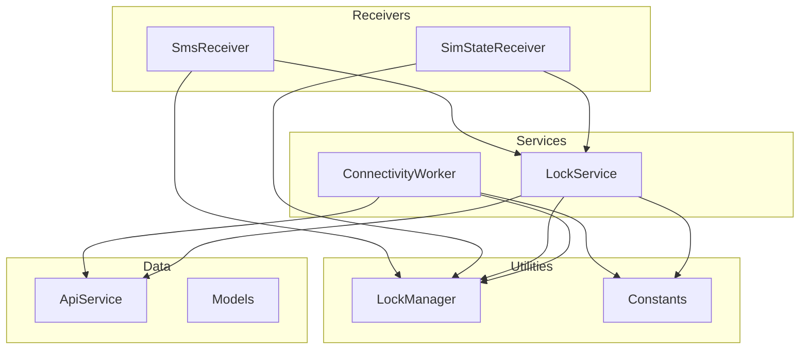
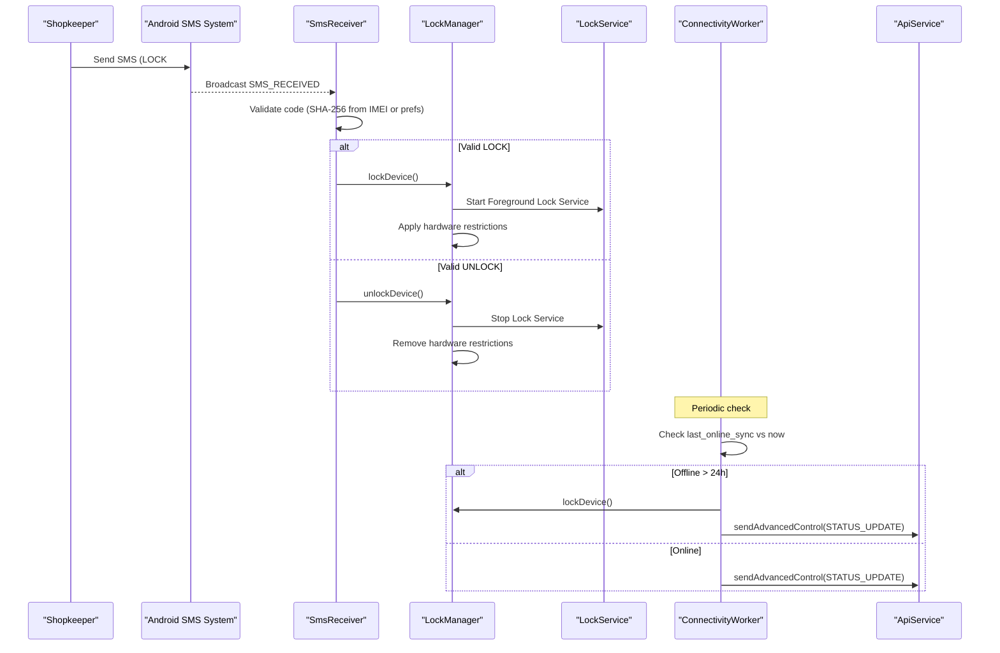
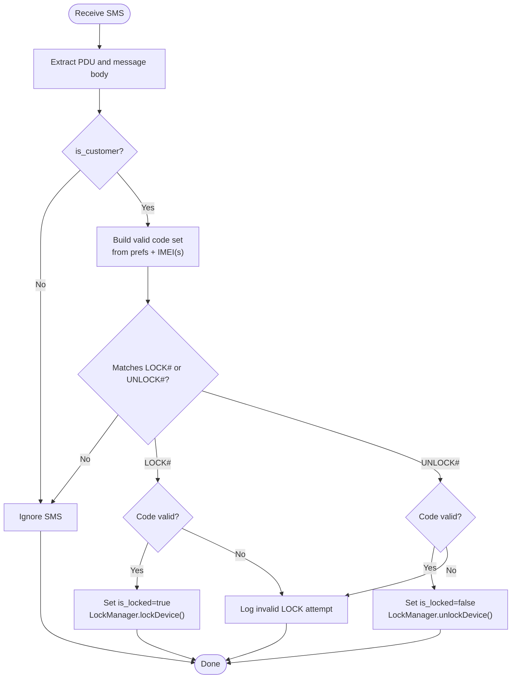
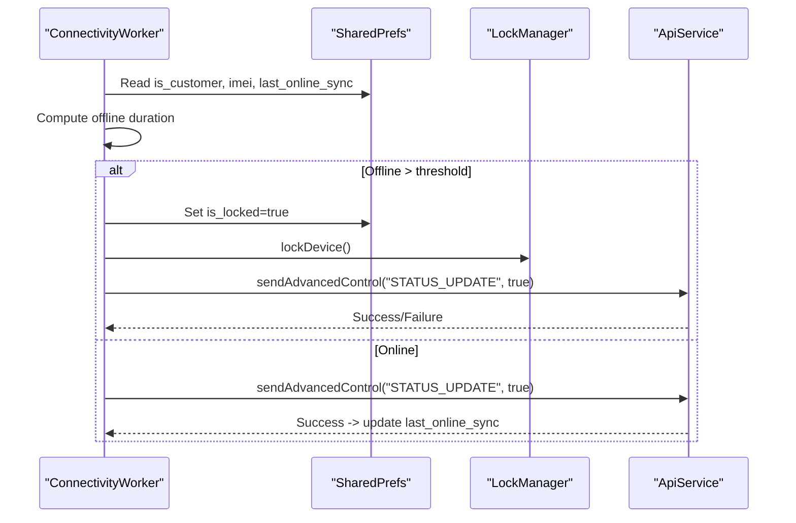
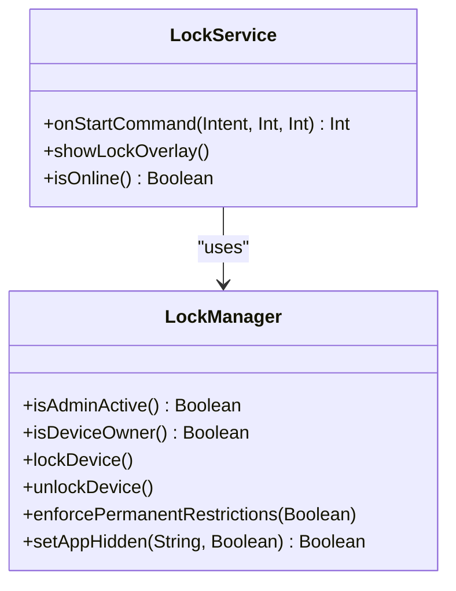
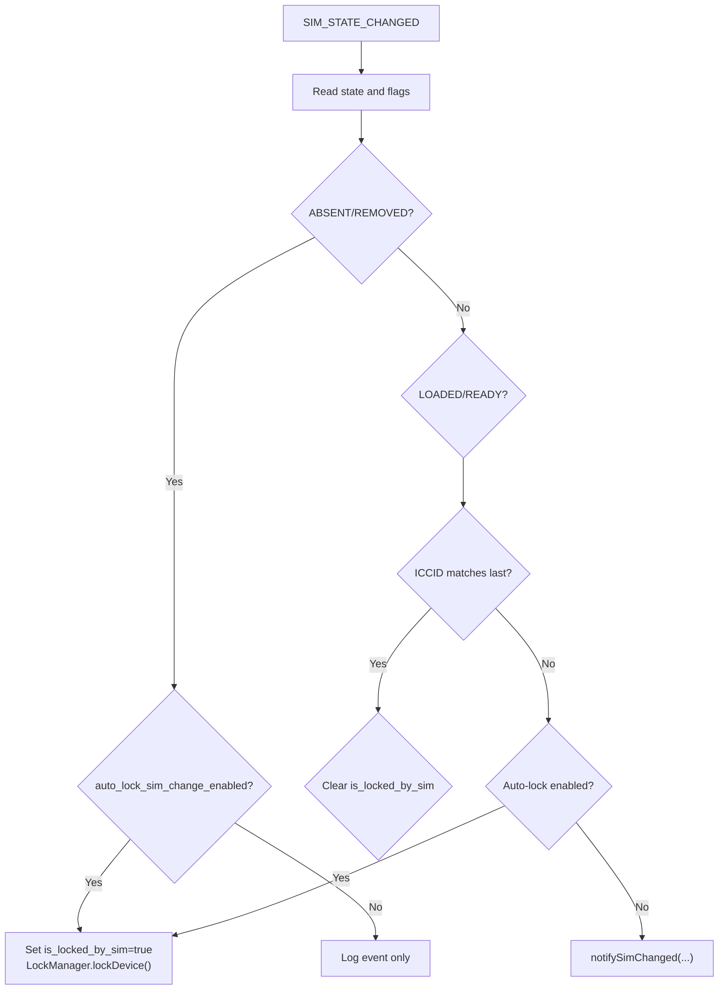
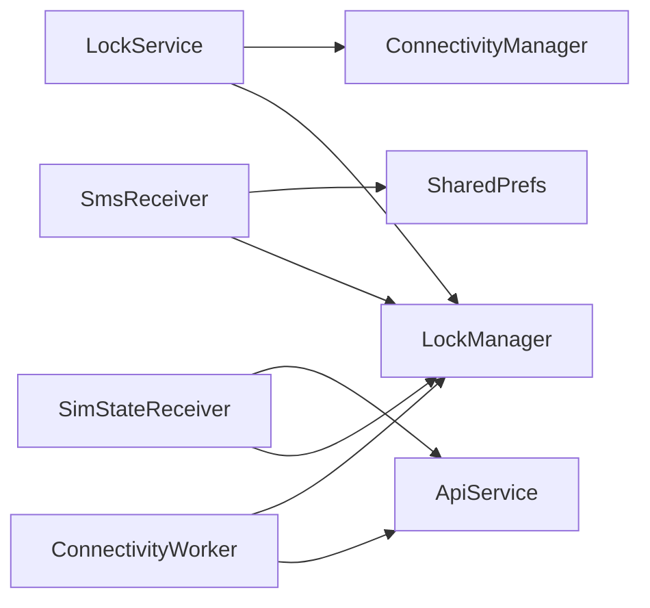

# Offline Functionality & Fallback Systems

<cite>
**Referenced Files in This Document**
- [SmsReceiver.kt](file://app/src/main/java/com/pksafe/lock/manager/receiver/SmsReceiver.kt)
- [ConnectivityWorker.kt](file://app/src/main/java/com/pksafe/lock/manager/service/ConnectivityWorker.kt)
- [LockManager.kt](file://app/src/main/java/com/pksafe/lock/manager/util/LockManager.kt)
- [LockService.kt](file://app/src/main/java/com/pksafe/lock/manager/service/LockService.kt)
- [SimStateReceiver.kt](file://app/src/main/java/com/pksafe/lock/manager/receiver/SimStateReceiver.kt)
- [ApiService.kt](file://app/src/main/java/com/pksafe/lock/manager/data/ApiService.kt)
- [Models.kt](file://app/src/main/java/com/pksafe/lock/manager/data/Models.kt)
- [Constants.kt](file://app/src/main/java/com/pksafe/lock/manager/util/Constants.kt)
</cite>

## Table of Contents
1. [Introduction](#introduction)
2. [Project Structure](#project-structure)
3. [Core Components](#core-components)
4. [Architecture Overview](#architecture-overview)
5. [Detailed Component Analysis](#detailed-component-analysis)
6. [Dependency Analysis](#dependency-analysis)
7. [Performance Considerations](#performance-considerations)
8. [Troubleshooting Guide](#troubleshooting-guide)
9. [Conclusion](#conclusion)

## Introduction
This document explains the PK Locker offline capability system that preserves device control when internet connectivity is unavailable. It focuses on:
- SMS-based command processing for lock/unlock without network access
- Connectivity monitoring and automatic fallback behavior
- Local state management to persist device status and pending operations
- Practical workflows, SMS format specifications, and synchronization upon reconnection
- Reliability considerations, queuing mechanisms, and conflict resolution strategies

## Project Structure
The offline system spans receivers, services, utilities, and data layers:
- Receivers handle SMS and SIM events
- Services enforce locks and monitor connectivity
- Utilities implement core locking logic and constants
- Data layer defines API contracts and models used by background workers

**Diagram sources**
- [SmsReceiver.kt:1-164](file://app/src/main/java/com/pksafe/lock/manager/receiver/SmsReceiver.kt#L1-L164)
- [SimStateReceiver.kt:1-145](file://app/src/main/java/com/pksafe/lock/manager/receiver/SimStateReceiver.kt#L1-L145)
- [LockService.kt:1-330](file://app/src/main/java/com/pksafe/lock/manager/service/LockService.kt#L1-L330)
- [ConnectivityWorker.kt:1-72](file://app/src/main/java/com/pksafe/lock/manager/service/ConnectivityWorker.kt#L1-L72)
- [LockManager.kt:1-406](file://app/src/main/java/com/pksafe/lock/manager/util/LockManager.kt#L1-L406)
- [ApiService.kt:1-234](file://app/src/main/java/com/pksafe/lock/manager/data/ApiService.kt#L1-L234)
- [Models.kt:1-255](file://app/src/main/java/com/pksafe/lock/manager/data/Models.kt#L1-L255)
- [Constants.kt:1-10](file://app/src/main/java/com/pksafe/lock/manager/util/Constants.kt#L1-L10)

**Section sources**
- [SmsReceiver.kt:1-164](file://app/src/main/java/com/pksafe/lock/manager/receiver/SmsReceiver.kt#L1-L164)
- [ConnectivityWorker.kt:1-72](file://app/src/main/java/com/pksafe/lock/manager/service/ConnectivityWorker.kt#L1-L72)
- [LockManager.kt:1-406](file://app/src/main/java/com/pksafe/lock/manager/util/LockManager.kt#L1-L406)
- [LockService.kt:1-330](file://app/src/main/java/com/pksafe/lock/manager/service/LockService.kt#L1-L330)
- [SimStateReceiver.kt:1-145](file://app/src/main/java/com/pksafe/lock/manager/receiver/SimStateReceiver.kt#L1-L145)
- [ApiService.kt:1-234](file://app/src/main/java/com/pksafe/lock/manager/data/ApiService.kt#L1-L234)
- [Models.kt:1-255](file://app/src/main/java/com/pksafe/lock/manager/data/Models.kt#L1-L255)
- [Constants.kt:1-10](file://app/src/main/java/com/pksafe/lock/manager/util/Constants.kt#L1-L10)

## Core Components
- SMS Receiver: Parses incoming SMS messages, validates codes, and triggers local lock/unlock without requiring internet.
- Lock Manager: Applies hardware restrictions, starts/stops the persistent lock overlay, and enforces permanent controls.
- Lock Service: Runs a foreground service with an overlay UI, monitors connectivity changes, and supports auto-lock on disconnect.
- Connectivity Worker: Periodically checks last online sync time; if offline beyond threshold, forces local lock and reports status.
- SIM State Receiver: Detects SIM removal/change and can auto-lock based on policy; notifies backend when possible.
- API Layer: Defines endpoints for remote control and status reporting used by background workers and services.

Key responsibilities:
- Offline command acceptance via SMS
- Immediate enforcement of lock/unlock locally
- Background monitoring and safe fallbacks
- Persistent state stored in shared preferences

**Section sources**
- [SmsReceiver.kt:1-164](file://app/src/main/java/com/pksafe/lock/manager/receiver/SmsReceiver.kt#L1-L164)
- [LockManager.kt:110-200](file://app/src/main/java/com/pksafe/lock/manager/util/LockManager.kt#L110-L200)
- [LockService.kt:50-105](file://app/src/main/java/com/pksafe/lock/manager/service/LockService.kt#L50-L105)
- [ConnectivityWorker.kt:17-71](file://app/src/main/java/com/pksafe/lock/manager/service/ConnectivityWorker.kt#L17-L71)
- [SimStateReceiver.kt:19-145](file://app/src/main/java/com/pksafe/lock/manager/receiver/SimStateReceiver.kt#L19-L145)
- [ApiService.kt:46-109](file://app/src/main/java/com/pksafe/lock/manager/data/ApiService.kt#L46-L109)

## Architecture Overview
The offline architecture ensures continuous control through layered safeguards:
- SMS commands are processed locally using deterministic code validation
- Locking is enforced immediately via Device Policy Manager and overlay
- Background worker enforces safety lock after prolonged offline periods
- SIM change events trigger auto-lock policies
- When connectivity returns, background tasks report status and refresh UI

**Diagram sources**
- [SmsReceiver.kt:44-142](file://app/src/main/java/com/pksafe/lock/manager/receiver/SmsReceiver.kt#L44-L142)
- [LockManager.kt:110-148](file://app/src/main/java/com/pksafe/lock/manager/util/LockManager.kt#L110-L148)
- [LockService.kt:50-105](file://app/src/main/java/com/pksafe/lock/manager/service/LockService.kt#L50-L105)
- [ConnectivityWorker.kt:17-71](file://app/src/main/java/com/pksafe/lock/manager/service/ConnectivityWorker.kt#L17-L71)
- [ApiService.kt:58-63](file://app/src/main/java/com/pksafe/lock/manager/data/ApiService.kt#L58-L63)

## Detailed Component Analysis

### SMS-Based Command Processing (Offline Lock/Unlock)
- Code Validation:
  - Accepts codes from shared preferences or generates them deterministically using SHA-256 of prefixes and IMEIs
  - Supports both single and dual IMI fallback generation
- Actions:
  - On valid LOCK: sets local locked flag, aborts broadcast to hide message, calls LockManager to start overlay and apply restrictions
  - On valid UNLOCK: clears locked flag, aborts broadcast, calls LockManager to stop overlay and remove restrictions
- Robustness:
  - Handles malformed SMS gracefully
  - Logs attempts and outcomes for diagnostics

**Diagram sources**
- [SmsReceiver.kt:44-142](file://app/src/main/java/com/pksafe/lock/manager/receiver/SmsReceiver.kt#L44-L142)
- [SmsReceiver.kt:31-42](file://app/src/main/java/com/pksafe/lock/manager/receiver/SmsReceiver.kt#L31-L42)

**Section sources**
- [SmsReceiver.kt:31-42](file://app/src/main/java/com/pksafe/lock/manager/receiver/SmsReceiver.kt#L31-L42)
- [SmsReceiver.kt:44-142](file://app/src/main/java/com/pksafe/lock/manager/receiver/SmsReceiver.kt#L44-L142)

### Connectivity Monitoring and Auto-Lock Guard
- Heartbeat and Safety Lock:
  - Tracks last successful online sync timestamp
  - If offline longer than configured threshold, forces local lock and attempts to notify server
  - Otherwise sends heartbeat indicating active status
- Reporting:
  - Uses API endpoint to send advanced control status updates
  - Updates last sync time on success

**Diagram sources**
- [ConnectivityWorker.kt:17-71](file://app/src/main/java/com/pksafe/lock/manager/service/ConnectivityWorker.kt#L17-L71)
- [ApiService.kt:58-63](file://app/src/main/java/com/pksafe/lock/manager/data/ApiService.kt#L58-L63)

**Section sources**
- [ConnectivityWorker.kt:17-71](file://app/src/main/java/com/pksafe/lock/manager/service/ConnectivityWorker.kt#L17-L71)

### Lock Enforcement and Overlay Management
- Lock Flow:
  - Starts foreground service with persistent notification
  - Applies hardware restrictions via Device Policy Manager
  - Schedules immediate lockNow call
- Unlock Flow:
  - Stops foreground service
  - Removes hardware restrictions
  - Clears local locked flag
- Overlay Behavior:
  - Displays lock screen with dynamic master unlock code derived from IMEI
  - Blocks navigation keys and maintains focus
  - Refreshes EMI/shop info from server when available

**Diagram sources**
- [LockManager.kt:110-200](file://app/src/main/java/com/pksafe/lock/manager/util/LockManager.kt#L110-L200)
- [LockService.kt:50-105](file://app/src/main/java/com/pksafe/lock/manager/service/LockService.kt#L50-L105)

**Section sources**
- [LockManager.kt:110-200](file://app/src/main/java/com/pksafe/lock/manager/util/LockManager.kt#L110-L200)
- [LockService.kt:50-105](file://app/src/main/java/com/pksafe/lock/manager/service/LockService.kt#L50-L105)
- [LockService.kt:125-234](file://app/src/main/java/com/pksafe/lock/manager/service/LockService.kt#L125-L234)

### SIM Change Handling and Auto-Lock Policy
- Detects SIM removal or insertion and compares ICCID to stored value
- Can auto-lock on SIM removal/change based on policy flags
- Notifies backend about SIM changes when reachable
- Unlocks automatically when authorized SIM is detected and previously locked by SIM

**Diagram sources**
- [SimStateReceiver.kt:19-145](file://app/src/main/java/com/pksafe/lock/manager/receiver/SimStateReceiver.kt#L19-L145)

**Section sources**
- [SimStateReceiver.kt:19-145](file://app/src/main/java/com/pksafe/lock/manager/receiver/SimStateReceiver.kt#L19-L145)

### Local State Management
- Shared Preferences Keys Used:
  - is_customer: identifies customer device mode
  - device_imei / device_imei2: identifiers for code generation and API calls
  - sms_lock_code / sms_unlock_code: optional backend-provided codes for offline SMS
  - is_locked: current lock state persisted across app restarts
  - last_online_sync: timestamp for offline guard decisions
  - auto_lock_enabled / auto_lock_sim_change_enabled: policy toggles
  - is_locked_by_sim: tracks SIM-triggered lock state
- Persistence Strategy:
  - All critical state is written synchronously or via apply to ensure durability
  - LockService refreshes UI data from server when online but falls back to cached values otherwise

**Section sources**
- [SmsReceiver.kt:47-92](file://app/src/main/java/com/pksafe/lock/manager/receiver/SmsReceiver.kt#L47-L92)
- [ConnectivityWorker.kt:17-64](file://app/src/main/java/com/pksafe/lock/manager/service/ConnectivityWorker.kt#L17-L64)
- [LockService.kt:54-105](file://app/src/main/java/com/pksafe/lock/manager/service/LockService.kt#L54-L105)
- [SimStateReceiver.kt:24-113](file://app/src/main/java/com/pksafe/lock/manager/receiver/SimStateReceiver.kt#L24-L113)

### Practical Examples and Workflows

#### Offline Command Workflow (SMS)
- Shopkeeper sends:
  - LOCK#<code> to lock device
  - UNLOCK#<code> to unlock device
- Codes:
  - Deterministic SHA-256 of "LOCK_{imei}" or "UNLOCK_{imei}"
  - Alternatively, codes provided by backend during provisioning and saved locally
- Execution:
  - SmsReceiver validates and applies lock/unlock immediately
  - No internet required

#### Automatic Synchronization When Connectivity Restored
- ConnectivityWorker periodically checks last_online_sync
- If offline too long, it forces local lock and attempts to report status
- On successful report, updates last_online_sync timestamp
- LockService refreshes overlay content from server when reachable

**Section sources**
- [SmsReceiver.kt:31-42](file://app/src/main/java/com/pksafe/lock/manager/receiver/SmsReceiver.kt#L31-L42)
- [SmsReceiver.kt:73-92](file://app/src/main/java/com/pksafe/lock/manager/receiver/SmsReceiver.kt#L73-L92)
- [ConnectivityWorker.kt:25-64](file://app/src/main/java/com/pksafe/lock/manager/service/ConnectivityWorker.kt#L25-L64)
- [LockService.kt:227-314](file://app/src/main/java/com/pksafe/lock/manager/service/LockService.kt#L227-L314)

### SMS Format Specifications
- Message formats:
  - LOCK#<code>
  - UNLOCK#<code>
- Code derivation:
  - SHA-256 of "LOCK_{imei}" or "UNLOCK_{imei}"
  - Or codes stored in shared preferences from backend provisioning
- Case handling:
  - Messages are normalized to uppercase before parsing
  - Codes compared case-insensitively

**Section sources**
- [SmsReceiver.kt:31-42](file://app/src/main/java/com/pksafe/lock/manager/receiver/SmsReceiver.kt#L31-L42)
- [SmsReceiver.kt:58-92](file://app/src/main/java/com/pksafe/lock/manager/receiver/SmsReceiver.kt#L58-L92)

## Dependency Analysis
- SmsReceiver depends on LockManager for enforcement and uses shared preferences for codes and flags
- LockService depends on LockManager and ConnectivityManager for overlay and auto-lock behavior
- ConnectivityWorker depends on ApiService for status reporting and LockManager for forced lock
- SimStateReceiver depends on LockManager and ApiService for policy enforcement and notifications
- All components rely on shared preferences for persistent state

**Diagram sources**
- [SmsReceiver.kt:1-164](file://app/src/main/java/com/pksafe/lock/manager/receiver/SmsReceiver.kt#L1-L164)
- [LockService.kt:1-330](file://app/src/main/java/com/pksafe/lock/manager/service/LockService.kt#L1-L330)
- [ConnectivityWorker.kt:1-72](file://app/src/main/java/com/pksafe/lock/manager/service/ConnectivityWorker.kt#L1-L72)
- [SimStateReceiver.kt:1-145](file://app/src/main/java/com/pksafe/lock/manager/receiver/SimStateReceiver.kt#L1-L145)
- [ApiService.kt:1-234](file://app/src/main/java/com/pksafe/lock/manager/data/ApiService.kt#L1-L234)

**Section sources**
- [SmsReceiver.kt:1-164](file://app/src/main/java/com/pksafe/lock/manager/receiver/SmsReceiver.kt#L1-L164)
- [LockService.kt:1-330](file://app/src/main/java/com/pksafe/lock/manager/service/LockService.kt#L1-L330)
- [ConnectivityWorker.kt:1-72](file://app/src/main/java/com/pksafe/lock/manager/service/ConnectivityWorker.kt#L1-L72)
- [SimStateReceiver.kt:1-145](file://app/src/main/java/com/pksafe/lock/manager/receiver/SimStateReceiver.kt#L1-L145)
- [ApiService.kt:1-234](file://app/src/main/java/com/pksafe/lock/manager/data/ApiService.kt#L1-L234)

## Performance Considerations
- SMS processing runs in broadcast receiver context; keep logic minimal and avoid heavy I/O
- LockManager applies restrictions efficiently using Device Policy Manager APIs
- ConnectivityWorker performs lightweight checks and network calls only when necessary
- LockService minimizes UI overhead and defers network requests to background scopes
- Use of shared preferences ensures fast reads/writes for critical state

[No sources needed since this section provides general guidance]

## Troubleshooting Guide
Common issues and resolutions:
- Invalid SMS code:
  - Ensure codes match expected format and are generated correctly from IMEI or stored in preferences
  - Check logs for code validation failures
- Lock not applied:
  - Verify device admin and device owner privileges are active
  - Confirm LockService started successfully and overlay visible
- Auto-lock not triggering:
  - Check auto_lock_enabled and auto_lock_sim_change_enabled flags
  - Ensure ConnectivityWorker runs and last_online_sync is updated
- SIM change not handled:
  - Confirm SIM state receiver registered and permissions granted
  - Validate ICCID reading and comparison logic

**Section sources**
- [SmsReceiver.kt:94-142](file://app/src/main/java/com/pksafe/lock/manager/receiver/SmsReceiver.kt#L94-L142)
- [LockManager.kt:110-200](file://app/src/main/java/com/pksafe/lock/manager/util/LockManager.kt#L110-L200)
- [ConnectivityWorker.kt:17-71](file://app/src/main/java/com/pksafe/lock/manager/service/ConnectivityWorker.kt#L17-L71)
- [SimStateReceiver.kt:19-145](file://app/src/main/java/com/pksafe/lock/manager/receiver/SimStateReceiver.kt#L19-L145)

## Conclusion
PK Locker’s offline capability system ensures reliable device control without internet by combining:
- Deterministic SMS-based command validation
- Immediate local enforcement via Device Policy Manager and persistent overlay
- Background monitoring to enforce safety locks after extended offline periods
- SIM-aware policies for additional security
- Local state persistence to maintain consistency across restarts

These components together provide robust offline operation, clear synchronization pathways, and resilient fallback behaviors suitable for shopkeeper-managed devices.

[No sources needed since this section summarizes without analyzing specific files]