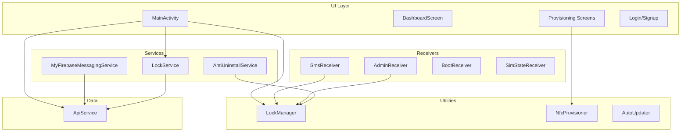
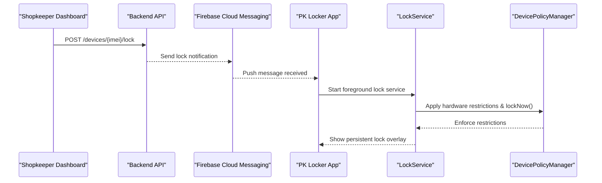
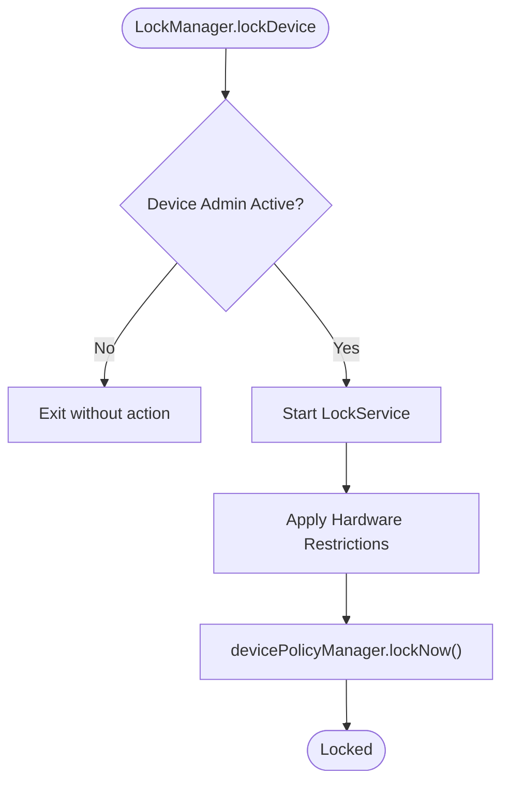
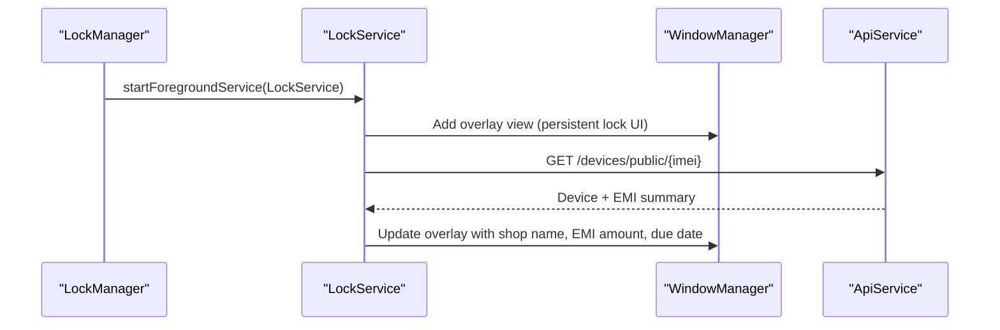
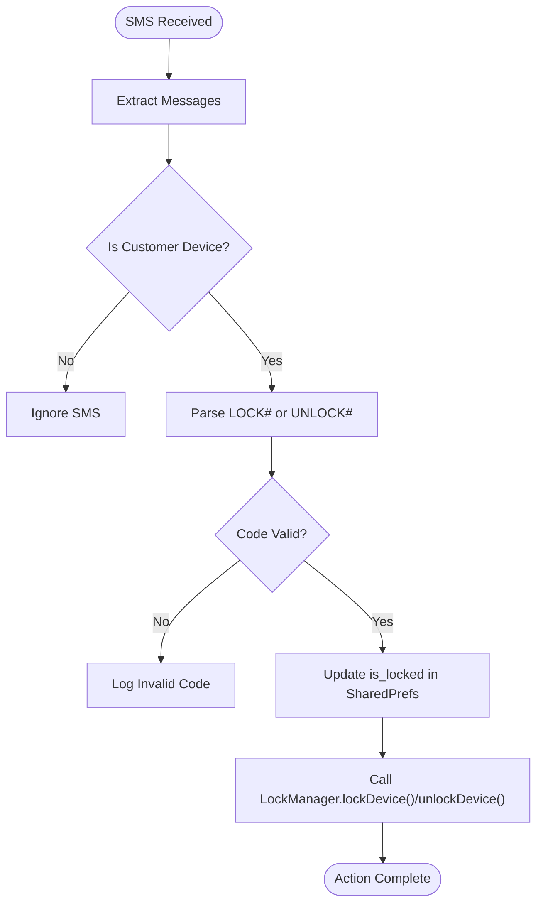
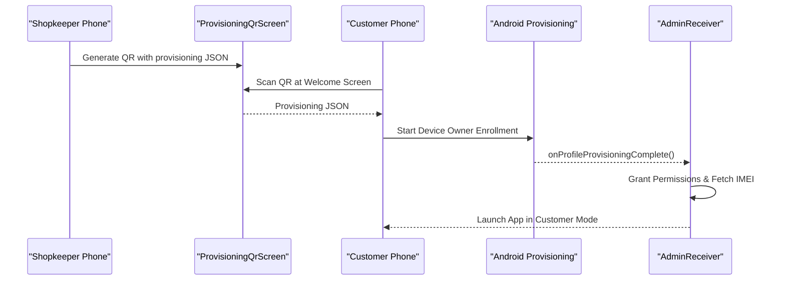
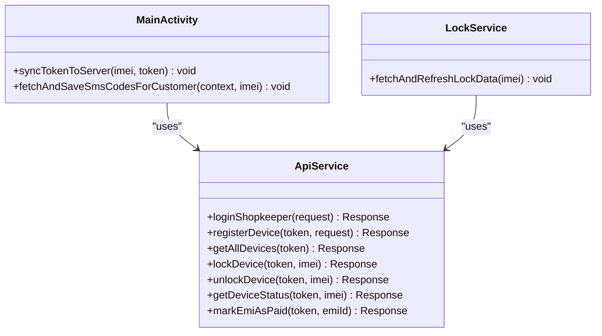
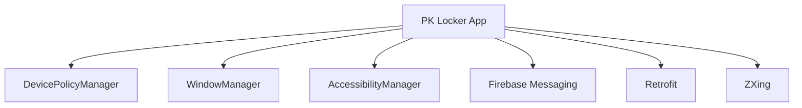

# Project Overview

<cite>
**Referenced Files in This Document**
- [README.md](file://README.md)
- [AndroidManifest.xml](file://app/src/main/AndroidManifest.xml)
- [MainActivity.kt](file://app/src/main/java/com/pksafe/lock/manager/MainActivity.kt)
- [LockManager.kt](file://app/src/main/java/com/pksafe/lock/manager/util/LockManager.kt)
- [device_admin_policies.xml](file://app/src/main/res/xml/device_admin_policies.xml)
- [SmsReceiver.kt](file://app/src/main/java/com/pksafe/lock/manager/receiver/SmsReceiver.kt)
- [NfcProvisioner.kt](file://app/src/main/java/com/pksafe/lock/manager/util/NfcProvisioner.kt)
- [ApiService.kt](file://app/src/main/java/com/pksafe/lock/manager/data/ApiService.kt)
- [LockService.kt](file://app/src/main/java/com/pksafe/lock/manager/service/LockService.kt)
- [ProvisioningQrScreen.kt](file://app/src/main/java/com/pksafe/lock/manager/ui/provisioning/ProvisioningQrScreen.kt)
- [AdminReceiver.kt](file://app/src/main/java/com/pksafe/lock/manager/receiver/AdminReceiver.kt)
- [AntiUninstallService.kt](file://app/src/main/java/com/pksafe/lock/manager/service/AntiUninstallService.kt)
- [build.gradle.kts](file://app/build.gradle.kts)
</cite>

## Table of Contents
1. Introduction
2. Project Structure
3. Core Components
4. Architecture Overview
5. Detailed Component Analysis
6. Dependency Analysis
7. Performance Considerations
8. Troubleshooting Guide
9. Conclusion
10. Appendices

## Introduction
PK Locker is an enterprise-grade Android device management application designed for mobile phone dealers to enforce EMI compliance on customer devices. It provides remote lock/unlock, hardware restrictions, and multi-method provisioning (QR code, NFC, manual), with offline SMS command processing and a shopkeeper administrative dashboard. The app integrates deeply with Android’s Device Policy Manager to operate as a Device Owner or Device Admin, ensuring robust enforcement even when the user attempts to bypass controls.

Key concepts used throughout:
- Device Owner: A privileged mode that enables strong system-level controls such as blocking factory reset, USB debugging, and uninstallation.
- LockManager: Central utility coordinating lock/unlock flows, hardware restrictions, and policy enforcement.
- Provisioning: The process of enrolling a device into PK Locker via QR code, NFC, or manual installation.
- Device administration: The baseline admin privileges required for many enforcement features; Device Owner extends these capabilities.

Practical use cases:
- Shopkeeper setup workflow: Generate a provisioning QR code on the shopkeeper’s device and scan it on a new customer phone during initial setup to enroll as Device Owner.
- Customer enrollment: After provisioning, the app auto-fetches IMEI and syncs EMI data from the backend; customers can see their due dates and contact info on the lock screen.
- Emergency lockdown: If internet is unavailable, the shopkeeper sends a secret SMS to trigger immediate lock; if online, FCM pushes commands to lock instantly.

System requirements and supported versions:
- Minimum SDK 24 (Android 7.0 Nougat) and target SDK 35.
- Requires permissions for overlay display, SMS, location, boot completion, foreground services, and notifications.
- Uses Firebase Cloud Messaging for push notifications and Retrofit for REST API calls.

**Section sources**
- [build.gradle.kts:11-19](file://app/build.gradle.kts#L11-L19)
- [AndroidManifest.xml:5-23](file://app/src/main/AndroidManifest.xml#L5-L23)
- [README.md:49-107](file://README.md#L49-L107)

## Project Structure
The project follows a feature-oriented structure under the main package:
- ui: Compose-based screens for dashboard, provisioning, login, registration, device control, EMI list, keys, profile, and theme.
- service: Background services including LockService (overlay lock UI), AntiUninstallService (accessibility guard), MyFirebaseMessagingService (push handling), ConnectivityWorker (background tasks).
- receiver: Broadcast receivers for device admin events, boot completion, SIM state changes, and SMS interception.
- util: Utilities like LockManager (policy enforcement), NfcProvisioner (NFC provisioning), ApkServer (local server for APK distribution), AutoUpdater (update checks), UsbAdbEngine (ADB over USB), Constants.
- data: Network layer using Retrofit ApiService and data models.

**Diagram sources**
- [MainActivity.kt:65-124](file://app/src/main/java/com/pksafe/lock/manager/MainActivity.kt#L65-L124)
- [LockService.kt:41-80](file://app/src/main/java/com/pksafe/lock/manager/service/LockService.kt#L41-L80)
- [SmsReceiver.kt:29-44](file://app/src/main/java/com/pksafe/lock/manager/receiver/SmsReceiver.kt#L29-L44)
- [AdminReceiver.kt:14-36](file://app/src/main/java/com/pksafe/lock/manager/receiver/AdminReceiver.kt#L14-L36)
- [LockManager.kt:27-49](file://app/src/main/java/com/pksafe/lock/manager/util/LockManager.kt#L27-L49)
- [NfcProvisioner.kt:15-49](file://app/src/main/java/com/pksafe/lock/manager/util/NfcProvisioner.kt#L15-L49)
- [ApiService.kt:11-109](file://app/src/main/java/com/pksafe/lock/manager/data/ApiService.kt#L11-L109)

**Section sources**
- [AndroidManifest.xml:53-155](file://app/src/main/AndroidManifest.xml#L53-L155)
- [MainActivity.kt:65-124](file://app/src/main/java/com/pksafe/lock/manager/MainActivity.kt#L65-L124)

## Core Components
- MainActivity: Entry point orchestrating authentication, provisioning, lock state transitions, permission guards, FCM token sync, and background location sync.
- LockManager: Central policy engine using DevicePolicyManager to apply hardware restrictions, manage overlays, enable accessibility services, hide apps, and self-deactivate upon release.
- LockService: Foreground service rendering a persistent lock overlay, enforcing back/home/recents blocking, dynamic unlock code entry, and live refresh of EMI/shop data.
- SmsReceiver: Offline command processor intercepting SMS messages to lock/unlock based on deterministic codes derived from IMEI or fetched from backend.
- AdminReceiver: Handles device admin lifecycle events, grants critical permissions as Device Owner, and auto-fetches IMEI to activate customer mode.
- AntiUninstallService: Accessibility-based guard preventing unauthorized settings navigation, app uninstallation, and enforcing global actions to maintain security posture.
- ProvisioningQrScreen and NfcProvisioner: Multi-method provisioning interfaces generating QR codes and NFC payloads for seamless Device Owner enrollment.
- ApiService: Retrofit interface defining endpoints for device management, EMI scheduling, key orders, and token updates.

**Section sources**
- [MainActivity.kt:126-445](file://app/src/main/java/com/pksafe/lock/manager/MainActivity.kt#L126-L445)
- [LockManager.kt:110-199](file://app/src/main/java/com/pksafe/lock/manager/util/LockManager.kt#L110-L199)
- [LockService.kt:125-234](file://app/src/main/java/com/pksafe/lock/manager/service/LockService.kt#L125-L234)
- [SmsReceiver.kt:44-143](file://app/src/main/java/com/pksafe/lock/manager/receiver/SmsReceiver.kt#L44-L143)
- [AdminReceiver.kt:16-36](file://app/src/main/java/com/pksafe/lock/manager/receiver/AdminReceiver.kt#L16-L36)
- [AntiUninstallService.kt:22-80](file://app/src/main/java/com/pksafe/lock/manager/service/AntiUninstallService.kt#L22-L80)
- [ProvisioningQrScreen.kt:41-157](file://app/src/main/java/com/pksafe/lock/manager/ui/provisioning/ProvisioningQrScreen.kt#L41-L157)
- [NfcProvisioner.kt:15-49](file://app/src/main/java/com/pksafe/lock/manager/util/NfcProvisioner.kt#L15-L49)
- [ApiService.kt:11-109](file://app/src/main/java/com/pksafe/lock/manager/data/ApiService.kt#L11-L109)

## Architecture Overview
PK Locker implements a layered architecture:
- UI Layer: Compose screens handle user interactions and state management.
- Service Layer: Foreground and background services enforce locks, handle push notifications, and monitor connectivity.
- Receiver Layer: Broadcast receivers respond to system events (boot, SIM changes, SMS) and device admin lifecycle.
- Utility Layer: LockManager encapsulates Device Policy Manager operations; NfcProvisioner handles NFC provisioning; AutoUpdater manages updates.
- Data Layer: ApiService communicates with the backend for device registration, EMI schedules, lock/unlock commands, and analytics.

**Diagram sources**
- [ApiService.kt:46-56](file://app/src/main/java/com/pksafe/lock/manager/data/ApiService.kt#L46-L56)
- [LockService.kt:115-133](file://app/src/main/java/com/pksafe/lock/manager/service/LockService.kt#L115-L133)
- [LockManager.kt:110-133](file://app/src/main/java/com/pksafe/lock/manager/util/LockManager.kt#L110-L133)

**Section sources**
- [AndroidManifest.xml:73-85](file://app/src/main/AndroidManifest.xml#L73-L85)
- [ApiService.kt:46-56](file://app/src/main/java/com/pksafe/lock/manager/data/ApiService.kt#L46-L56)

## Detailed Component Analysis

### LockManager
LockManager coordinates all enforcement actions through DevicePolicyManager and system APIs:
- Lock/Unlock: Starts/stops LockService, applies/removes hardware restrictions, and triggers system lock.
- Restrictions: Blocks camera, USB file transfer, factory reset, safe boot, ADB/debugging, status bar expansion, and keyguard features when locked or permanently enforced.
- App Hiding: Uses setApplicationHidden to hide specific apps by mapping logical keys to real packages.
- Self Deactivation: Clears all restrictions, removes Device Owner and Device Admin privileges, and resets shared preferences to fully release the device.

**Diagram sources**
- [LockManager.kt:110-133](file://app/src/main/java/com/pksafe/lock/manager/util/LockManager.kt#L110-L133)
- [LockManager.kt:151-199](file://app/src/main/java/com/pksafe/lock/manager/util/LockManager.kt#L151-L199)

**Section sources**
- [LockManager.kt:27-49](file://app/src/main/java/com/pksafe/lock/manager/util/LockManager.kt#L27-L49)
- [LockManager.kt:110-199](file://app/src/main/java/com/pksafe/lock/manager/util/LockManager.kt#L110-L199)
- [LockManager.kt:202-291](file://app/src/main/java/com/pksafe/lock/manager/util/LockManager.kt#L202-L291)
- [LockManager.kt:295-315](file://app/src/main/java/com/pksafe/lock/manager/util/LockManager.kt#L295-L315)
- [LockManager.kt:351-404](file://app/src/main/java/com/pksafe/lock/manager/util/LockManager.kt#L351-L404)

### LockService
LockService renders a persistent overlay that cannot be dismissed while locked:
- Foreground service with high-priority notification to ensure persistence.
- Overlay window blocks back/home/recents/menu keys and supports dynamic unlock code input.
- Live refresh pulls fresh EMI and shop details from the backend to update the lock screen in real time.
- Auto-lock on connectivity loss if enabled.

**Diagram sources**
- [LockService.kt:50-80](file://app/src/main/java/com/pksafe/lock/manager/service/LockService.kt#L50-L80)
- [LockService.kt:125-234](file://app/src/main/java/com/pksafe/lock/manager/service/LockService.kt#L125-L234)
- [ApiService.kt:101-109](file://app/src/main/java/com/pksafe/lock/manager/data/ApiService.kt#L101-L109)

**Section sources**
- [LockService.kt:41-80](file://app/src/main/java/com/pksafe/lock/manager/service/LockService.kt#L41-L80)
- [LockService.kt:125-234](file://app/src/main/java/com/pksafe/lock/manager/service/LockService.kt#L125-L234)
- [LockService.kt:236-314](file://app/src/main/java/com/pksafe/lock/manager/service/LockService.kt#L236-L314)

### SmsReceiver
SmsReceiver enables offline lock/unlock via SMS:
- Intercepts incoming SMS and validates against deterministic codes generated from IMEI or fetched from backend.
- Supports LOCK#<code> and UNLOCK#<code> formats.
- On valid code, updates lock state and invokes LockManager to enforce system-level lock/unlock.

**Diagram sources**
- [SmsReceiver.kt:44-143](file://app/src/main/java/com/pksafe/lock/manager/receiver/SmsReceiver.kt#L44-L143)
- [SmsReceiver.kt:145-163](file://app/src/main/java/com/pksafe/lock/manager/receiver/SmsReceiver.kt#L145-L163)

**Section sources**
- [SmsReceiver.kt:29-44](file://app/src/main/java/com/pksafe/lock/manager/receiver/SmsReceiver.kt#L29-L44)
- [SmsReceiver.kt:44-143](file://app/src/main/java/com/pksafe/lock/manager/receiver/SmsReceiver.kt#L44-L143)

### Provisioning (QR Code and NFC)
Multi-method provisioning ensures flexible enrollment:
- QR Code: Generates a JSON payload containing device admin component, package name, download URL, signature checksum, and optional extras. Scanning enrolls the device as Device Owner silently.
- NFC: Creates an NDEF message with provisioning properties for bump-to-enroll scenarios.
- Manual: Allows direct APK installation and granting of Device Admin and overlay permissions.

**Diagram sources**
- [ProvisioningQrScreen.kt:120-157](file://app/src/main/java/com/pksafe/lock/manager/ui/provisioning/ProvisioningQrScreen.kt#L120-L157)
- [NfcProvisioner.kt:22-49](file://app/src/main/java/com/pksafe/lock/manager/util/NfcProvisioner.kt#L22-L49)
- [AdminReceiver.kt:23-36](file://app/src/main/java/com/pksafe/lock/manager/receiver/AdminReceiver.kt#L23-L36)

**Section sources**
- [ProvisioningQrScreen.kt:41-157](file://app/src/main/java/com/pksafe/lock/manager/ui/provisioning/ProvisioningQrScreen.kt#L41-L157)
- [NfcProvisioner.kt:15-49](file://app/src/main/java/com/pksafe/lock/manager/util/NfcProvisioner.kt#L15-L49)
- [README.md:49-79](file://README.md#L49-L79)

### Administrative Dashboard and Backend Integration
The shopkeeper dashboard manages devices, EMI plans, and key orders via the backend:
- Authentication and device registration endpoints.
- Remote lock/unlock and advanced controls.
- EMI schedule retrieval and payment marking.
- Key order checkout, verification, and history.

**Diagram sources**
- [ApiService.kt:11-109](file://app/src/main/java/com/pksafe/lock/manager/data/ApiService.kt#L11-L109)
- [MainActivity.kt:448-463](file://app/src/main/java/com/pksafe/lock/manager/MainActivity.kt#L448-L463)
- [LockService.kt:236-314](file://app/src/main/java/com/pksafe/lock/manager/service/LockService.kt#L236-L314)

**Section sources**
- [ApiService.kt:11-109](file://app/src/main/java/com/pksafe/lock/manager/data/ApiService.kt#L11-L109)
- [MainActivity.kt:448-463](file://app/src/main/java/com/pksafe/lock/manager/MainActivity.kt#L448-L463)
- [LockService.kt:236-314](file://app/src/main/java/com/pksafe/lock/manager/service/LockService.kt#L236-L314)

## Dependency Analysis
PK Locker depends on several Android system components and third-party libraries:
- Android Framework: DevicePolicyManager, WindowManager, TelephonyManager, AccessibilityService, WorkManager.
- Firebase: Cloud Messaging for push notifications and Analytics.
- Retrofit: HTTP client for REST API communication.
- ZXing: QR code generation and scanning support.
- Coil: Image loading for wallpapers and UI assets.

**Diagram sources**
- [LockManager.kt:27-49](file://app/src/main/java/com/pksafe/lock/manager/util/LockManager.kt#L27-L49)
- [LockService.kt:41-80](file://app/src/main/java/com/pksafe/lock/manager/service/LockService.kt#L41-L80)
- [AntiUninstallService.kt:22-80](file://app/src/main/java/com/pksafe/lock/manager/service/AntiUninstallService.kt#L22-L80)
- [build.gradle.kts:87-113](file://app/build.gradle.kts#L87-L113)

**Section sources**
- [build.gradle.kts:87-113](file://app/build.gradle.kts#L87-L113)
- [AndroidManifest.xml:5-23](file://app/src/main/AndroidManifest.xml#L5-L23)

## Performance Considerations
- Foreground Services: LockService runs as a foreground service to ensure persistence and responsiveness during lock states.
- Background Sync: Location and EMI data are refreshed periodically using WorkManager to minimize battery impact.
- Network Efficiency: Retrofit calls are scoped to necessary endpoints; responses are cached locally in SharedPrefs to reduce redundant requests.
- Overlay Rendering: LockService uses efficient window parameters to avoid unnecessary redraws and ensure smooth UI updates.

[No sources needed since this section provides general guidance]

## Troubleshooting Guide
Common issues and resolutions:
- Missing Overlay Permission: Prompt users to grant “Display over other apps” and guide them to Settings.
- IMEI Not Detected: Ensure Device Owner mode is active; AdminReceiver auto-grants READ_PHONE_STATE and fetches IMEI.
- SMS Commands Not Working: Verify SMS permissions and correct code format; fallback to IMEI-based code generation if backend codes are unavailable.
- Auto-Lock Not Triggering: Confirm connectivity monitoring is active and auto-lock preference is enabled.

**Section sources**
- [MainActivity.kt:170-325](file://app/src/main/java/com/pksafe/lock/manager/MainActivity.kt#L170-L325)
- [AdminReceiver.kt:43-102](file://app/src/main/java/com/pksafe/lock/manager/receiver/AdminReceiver.kt#L43-L102)
- [SmsReceiver.kt:44-143](file://app/src/main/java/com/pksafe/lock/manager/receiver/SmsReceiver.kt#L44-L143)
- [AntiUninstallService.kt:88-117](file://app/src/main/java/com/pksafe/lock/manager/service/AntiUninstallService.kt#L88-L117)

## Conclusion
PK Locker delivers a comprehensive enterprise solution for mobile phone dealers to enforce EMI compliance through robust Android device management capabilities. Its multi-method provisioning, offline SMS command processing, and deep integration with Device Policy Manager ensure reliable enforcement across diverse deployment scenarios. The modular architecture separates concerns between UI, services, receivers, utilities, and data layers, enabling maintainability and scalability. With clear system requirements and practical workflows, PK Locker empowers shopkeepers to manage customer devices securely and efficiently.

[No sources needed since this section summarizes without analyzing specific files]

## Appendices
- System Requirements:
  - Minimum SDK: 24 (Android 7.0)
  - Target SDK: 35
  - Required Permissions: Internet, SYSTEM_ALERT_WINDOW, RECEIVE_BOOT_COMPLETED, FOREGROUND_SERVICE, POST_NOTIFICATIONS, WAKE_LOCK, USE_FULL_SCREEN_INTENT, REQUEST_INSTALL_PACKAGES, RECEIVE_SMS, READ_SMS, SEND_SMS, ACCESS_FINE_LOCATION, ACCESS_COARSE_LOCATION
- Supported Android Versions: Android 7.0 and above, with enhanced features on newer versions (e.g., overlay permissions, WorkManager, modern DevicePolicyManager APIs).
- Deployment Considerations:
  - Use QR code provisioning for seamless Device Owner enrollment on factory-new devices.
  - Ensure consistent signing certificates for APK integrity checks during provisioning.
  - Configure backend endpoints for device registration, EMI management, and push notifications.
  - Test offline SMS functionality thoroughly across different carriers and regions.

**Section sources**
- [build.gradle.kts:11-19](file://app/build.gradle.kts#L11-L19)
- [AndroidManifest.xml:5-23](file://app/src/main/AndroidManifest.xml#L5-L23)
- [README.md:49-107](file://README.md#L49-L107)