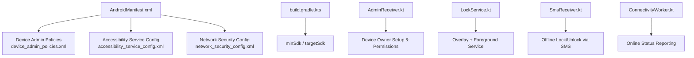
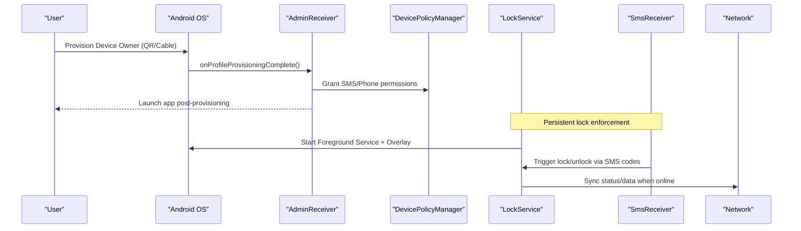
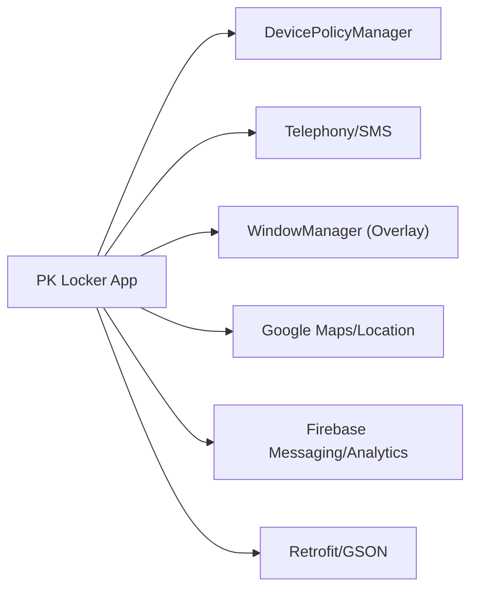

# System Requirements

<cite>
**Referenced Files in This Document**
- [AndroidManifest.xml](file://app/src/main/AndroidManifest.xml)
- [build.gradle.kts](file://app/build.gradle.kts)
- [libs.versions.toml](file://gradle/libs.versions.toml)
- [device_admin_policies.xml](file://app/src/main/res/xml/device_admin_policies.xml)
- [accessibility_service_config.xml](file://app/src/main/res/xml/accessibility_service_config.xml)
- [network_security_config.xml](file://app/src/main/res/xml/network_security_config.xml)
- [AdminReceiver.kt](file://app/src/main/java/com/pksafe/lock/manager/receiver/AdminReceiver.kt)
- [LockService.kt](file://app/src/main/java/com/pksafe/lock/manager/service/LockService.kt)
- [SmsReceiver.kt](file://app/src/main/java/com/pksafe/lock/manager/receiver/SmsReceiver.kt)
- [ConnectivityWorker.kt](file://app/src/main/java/com/pksafe/lock/manager/service/ConnectivityWorker.kt)
- [ProvisioningQrScreen.kt](file://app/src/main/java/com/pksafe/lock/manager/ui/provisioning/ProvisioningQrScreen.kt)
</cite>

## Table of Contents
1. Introduction
2. Project Structure
3. Core Components
4. Architecture Overview
5. Detailed Component Analysis
6. Dependency Analysis
7. Performance Considerations
8. Troubleshooting Guide
9. Conclusion

## Introduction
This document defines the system requirements for PK Locker, focusing on technical prerequisites and compatibility. It covers minimum Android version, supported device types, hardware features, required permissions (including Device Admin, Accessibility Services, Display Over Other Apps, SMS, and Location), network requirements and offline fallbacks, storage and memory considerations, battery optimization settings, OEM customization compatibility, and troubleshooting guidance for common permission-related issues.

## Project Structure
PK Locker is an Android application that enforces device lock policies via Device Owner mode, maintains a persistent foreground service with an overlay, listens for SMS-based control commands, and integrates location services and Firebase messaging. The manifest declares all runtime and install-time permissions and components; build configuration sets the minimum SDK and target versions; XML resources define Device Admin policies and Accessibility Service behavior; and network security configuration controls cleartext usage for local LAN communication.

**Diagram sources**
- [AndroidManifest.xml:1-160](file://app/src/main/AndroidManifest.xml#L1-L160)
- [device_admin_policies.xml:1-13](file://app/src/main/res/xml/device_admin_policies.xml#L1-L13)
- [accessibility_service_config.xml:1-8](file://app/src/main/res/xml/accessibility_service_config.xml#L1-L8)
- [network_security_config.xml:1-28](file://app/src/main/res/xml/network_security_config.xml#L1-L28)
- [build.gradle.kts:8-23](file://app/build.gradle.kts#L8-L23)
- [AdminReceiver.kt:1-104](file://app/src/main/java/com/pksafe/lock/manager/receiver/AdminReceiver.kt#L1-L104)
- [LockService.kt:41-330](file://app/src/main/java/com/pksafe/lock/manager/service/LockService.kt#L41-L330)
- [SmsReceiver.kt:1-164](file://app/src/main/java/com/pksafe/lock/manager/receiver/SmsReceiver.kt#L1-L164)
- [ConnectivityWorker.kt:59-71](file://app/src/main/java/com/pksafe/lock/manager/service/ConnectivityWorker.kt#L59-L71)

**Section sources**
- [AndroidManifest.xml:1-160](file://app/src/main/AndroidManifest.xml#L1-L160)
- [build.gradle.kts:8-23](file://app/build.gradle.kts#L8-L23)

## Core Components
- Minimum Android Version: API level 24 (Android 7.0). Target and compile SDK are set to modern levels for full feature support.
- Supported Devices: Any Android device meeting minSdk 24 with telephony (for SMS and IMEI), optional USB host (for cable provisioning), and standard Wi-Fi/mobile data radios.
- Hardware Features:
  - Telephony: Required for SMS and IMEI retrieval.
  - USB Host: Declared for direct USB debugging flows during provisioning.
  - GPS/Location: Fine and coarse location used for location features.
- Key Runtime Permissions:
  - Internet, Boot Completed, Foreground Service, Notifications, Wake Lock, Full Screen Intent, Request Install Packages, Query All Packages.
  - SMS: Receive, Read, Send.
  - Location: Fine and Coarse.
  - Overlay: SYSTEM_ALERT_WINDOW for overlay UI.
  - Phone State: READ_PHONE_STATE declared but commented out to avoid blocking QR provisioning on some OEMs; granted programmatically when Device Owner is active.
- Device Admin Privileges:
  - Device Admin Receiver enabled with policies including force-lock, password limits, wipe-data, expire-password, watch-login, and keyguard feature toggles.
  - On provisioning complete or admin enable, critical permissions (READ_PHONE_STATE, RECEIVE_SMS, READ_SMS, SEND_SMS) are auto-granted by Device Policy Manager.
- Accessibility Services:
  - Accessibility Guard service declared with broad event capture and window content retrieval flags to enforce anti-uninstall and policy enforcement behaviors.
- Network Security:
  - Cleartext allowed only for private IP ranges and localhost for local device-to-device communication; all other traffic uses HTTPS by default.

**Section sources**
- [build.gradle.kts:11-17](file://app/build.gradle.kts#L11-L17)
- [AndroidManifest.xml:5-34](file://app/src/main/AndroidManifest.xml#L5-L34)
- [device_admin_policies.xml:1-13](file://app/src/main/res/xml/device_admin_policies.xml#L1-L13)
- [accessibility_service_config.xml:1-8](file://app/src/main/res/xml/accessibility_service_config.xml#L1-L8)
- [network_security_config.xml:1-28](file://app/src/main/res/xml/network_security_config.xml#L1-L28)
- [AdminReceiver.kt:43-60](file://app/src/main/java/com/pksafe/lock/manager/receiver/AdminReceiver.kt#L43-L60)

## Architecture Overview
PK Locker enforces locking through a combination of Device Owner privileges, a persistent foreground service with an overlay, and background receivers for boot and SMS events. Online features rely on Firebase Messaging and REST APIs; offline functionality supports SMS-based lock/unlock and cached state.

**Diagram sources**
- [AdminReceiver.kt:23-60](file://app/src/main/java/com/pksafe/lock/manager/receiver/AdminReceiver.kt#L23-L60)
- [LockService.kt:54-80](file://app/src/main/java/com/pksafe/lock/manager/service/LockService.kt#L54-L80)
- [SmsReceiver.kt:44-143](file://app/src/main/java/com/pksafe/lock/manager/receiver/SmsReceiver.kt#L44-L143)

## Detailed Component Analysis

### Minimum Android Version and Build Targets
- Minimum SDK: 24 (Android 7.0).
- Target SDK: 35.
- Compile SDK: 35.
- Java/Kotlin targets configured for JVM 11.

These settings ensure compatibility with modern Android while maintaining a baseline for older devices.

**Section sources**
- [build.gradle.kts:11-17](file://app/build.gradle.kts#L11-L17)
- [build.gradle.kts:54-63](file://app/build.gradle.kts#L54-L63)

### Device Types and Hardware Specifications
- Telephony-enabled devices required for SMS and IMEI-based workflows.
- USB Host capability declared for cable-based provisioning flows.
- Location services (Fine/Coarse) used for location features.
- Overlay rendering requires WindowManager access and appropriate permissions.

**Section sources**
- [AndroidManifest.xml:18-23](file://app/src/main/AndroidManifest.xml#L18-L23)
- [AndroidManifest.xml:34-34](file://app/src/main/AndroidManifest.xml#L34-L34)

### Required System Permissions
- Internet and notifications for background operations and alerts.
- Foreground Service and Special Use type for persistent lock overlay.
- Boot completed to reinitialize services after reboot.
- SMS permissions (Receive/Read/Send) for offline lock/unlock via SMS.
- Location permissions (Fine/Coarse) for location features.
- SYSTEM_ALERT_WINDOW for overlay UI.
- REQUEST_INSTALL_PACKAGES for update flows.
- QUERY_ALL_PACKAGES for package discovery.
- READ_PHONE_STATE declared but commented out to avoid blocking QR provisioning on certain OEMs; granted programmatically when Device Owner is active.

**Section sources**
- [AndroidManifest.xml:5-32](file://app/src/main/AndroidManifest.xml#L5-L32)
- [AdminReceiver.kt:48-60](file://app/src/main/java/com/pksafe/lock/manager/receiver/AdminReceiver.kt#L48-L60)

### Device Admin Privileges
- Device Admin Receiver registered with policies enabling force-lock, password management, wipe-data, and keyguard feature control.
- On provisioning completion, the app grants itself critical permissions via DevicePolicyManager and launches the app to finalize setup.

**Section sources**
- [device_admin_policies.xml:1-13](file://app/src/main/res/xml/device_admin_policies.xml#L1-L13)
- [AndroidManifest.xml:87-99](file://app/src/main/AndroidManifest.xml#L87-L99)
- [AdminReceiver.kt:23-60](file://app/src/main/java/com/pksafe/lock/manager/receiver/AdminReceiver.kt#L23-L60)

### Accessibility Services
- Accessibility Guard service declared with broad event capture and window content retrieval flags to enforce anti-uninstall and policy enforcement behaviors.

**Section sources**
- [AndroidManifest.xml:101-112](file://app/src/main/AndroidManifest.xml#L101-L112)
- [accessibility_service_config.xml:1-8](file://app/src/main/res/xml/accessibility_service_config.xml#L1-L8)

### Display Over Other Apps (Overlay)
- LockService creates a full-screen overlay using WindowManager with flags to show when locked, keep screen on, dismiss keyguard, and turn screen on. Requires SYSTEM_ALERT_WINDOW and proper overlay type handling per Android version.

**Section sources**
- [AndroidManifest.xml:6](file://app/src/main/AndroidManifest.xml#L6)
- [LockService.kt:125-155](file://app/src/main/java/com/pksafe/lock/manager/service/LockService.kt#L125-L155)

### SMS Permissions and Offline Functionality
- SMS receiver handles LOCK# and UNLOCK# commands without internet, using deterministic code generation based on IMEI.
- Supports dual-SIM IMEIs and falls back to locally stored codes if available.

**Section sources**
- [AndroidManifest.xml:18-20](file://app/src/main/AndroidManifest.xml#L18-L20)
- [SmsReceiver.kt:16-42](file://app/src/main/java/com/pksafe/lock/manager/receiver/SmsReceiver.kt#L16-L42)
- [SmsReceiver.kt:44-143](file://app/src/main/java/com/pksafe/lock/manager/receiver/SmsReceiver.kt#L44-L143)

### Location Services
- Declares fine and coarse location permissions for location features.

**Section sources**
- [AndroidManifest.xml:21-23](file://app/src/main/AndroidManifest.xml#L21-L23)

### Network Requirements and Fallback Mechanisms
- Network Security Configuration allows cleartext only for private IP ranges and localhost for local device-to-device communication; all other traffic uses HTTPS by default.
- Connectivity checks are performed to trigger actions like auto-lock when offline.
- Connectivity worker reports status updates to server when online.

**Section sources**
- [network_security_config.xml:1-28](file://app/src/main/res/xml/network_security_config.xml#L1-L28)
- [LockService.kt:82-105](file://app/src/main/java/com/pksafe/lock/manager/service/LockService.kt#L82-L105)
- [ConnectivityWorker.kt:59-71](file://app/src/main/java/com/pksafe/lock/manager/service/ConnectivityWorker.kt#L59-L71)

### Storage Requirements and Memory Considerations
- Uses SharedPreferences for local state (e.g., provisioning flags, IMEI, lock state).
- No explicit large file storage or media handling observed; typical app footprint expected.
- Foreground service runs persistently; ensure adequate RAM to maintain overlay and background tasks.

[No sources needed since this section provides general guidance]

### Battery Optimization Settings
- Foreground service with high-importance notification channel ensures reliability under battery optimizations.
- Boot receiver reinitializes services after reboot.
- Avoid aggressive Doze restrictions by keeping necessary foreground tasks and using WorkManager where applicable.

**Section sources**
- [AndroidManifest.xml:115-121](file://app/src/main/AndroidManifest.xml#L115-L121)
- [LockService.kt:107-123](file://app/src/main/java/com/pksafe/lock/manager/service/LockService.kt#L107-L123)

### Compatibility with Android OEM Customizations
- QR provisioning flow includes flags to allow mobile data downloads and skip encryption during setup.
- READ_PHONE_STATE is commented out in manifest to avoid blocking QR provisioning on Samsung and similar OEMs; instead granted programmatically when Device Owner is active.
- Overlay and accessibility features may require user consent; guide users to grant SYSTEM_ALERT_WINDOW and enable Accessibility Service in OEM-specific settings screens.

**Section sources**
- [ProvisioningQrScreen.kt:131-153](file://app/src/main/java/com/pksafe/lock/manager/ui/provisioning/ProvisioningQrScreen.kt#L131-L153)
- [AndroidManifest.xml:14-15](file://app/src/main/AndroidManifest.xml#L14-L15)
- [AdminReceiver.kt:48-60](file://app/src/main/java/com/pksafe/lock/manager/receiver/AdminReceiver.kt#L48-L60)

## Dependency Analysis
PK Locker depends on Android framework services (DevicePolicyManager, Telephony, WindowManager), Google Play Services (location/maps), Firebase (messaging/analytics), and networking libraries (Retrofit/Gson). These dependencies influence runtime behavior and resource usage.

**Diagram sources**
- [AndroidManifest.xml:73-85](file://app/src/main/AndroidManifest.xml#L73-L85)
- [libs.versions.toml:44-56](file://gradle/libs.versions.toml#L44-L56)

**Section sources**
- [libs.versions.toml:44-56](file://gradle/libs.versions.toml#L44-L56)

## Performance Considerations
- Keep overlay lightweight; avoid heavy computations on the main thread.
- Use background workers for network calls; cache results locally to minimize repeated requests.
- Ensure notification channels are created once and reused.
- Monitor memory usage for overlay views and release them on service destruction.

[No sources needed since this section provides general guidance]

## Troubleshooting Guide
Common permission-related problems and resolutions:
- Missing SYSTEM_ALERT_WINDOW:
  - Ensure the app has been granted “Display over other apps” permission; overlay will not render otherwise.
- Accessibility Service not enabled:
  - Enable the Accessibility Service in device settings; required for anti-uninstall and policy enforcement.
- SMS permissions denied:
  - On non-Device Owner devices, prompt for SMS permissions; on Device Owner devices, permissions are auto-granted by DevicePolicyManager.
- READ_PHONE_STATE blocked on some OEMs:
  - Manifest entry is commented out to avoid blocking QR provisioning; rely on Device Owner to grant at runtime.
- Network issues:
  - Verify connectivity; cleartext is allowed only for private IPs and localhost; ensure HTTPS for external endpoints.
- Boot issues:
  - Ensure Boot Completed receiver is active; services should restart after reboot.

**Section sources**
- [AndroidManifest.xml:6-20](file://app/src/main/AndroidManifest.xml#L6-L20)
- [AndroidManifest.xml:101-112](file://app/src/main/AndroidManifest.xml#L101-L112)
- [AdminReceiver.kt:48-60](file://app/src/main/java/com/pksafe/lock/manager/receiver/AdminReceiver.kt#L48-L60)
- [network_security_config.xml:16-26](file://app/src/main/res/xml/network_security_config.xml#L16-L26)
- [AndroidManifest.xml:115-121](file://app/src/main/AndroidManifest.xml#L115-L121)

## Conclusion
PK Locker requires Android 7.0+ with telephony capabilities and declares specific hardware features for advanced provisioning. It relies on Device Admin privileges, Accessibility Services, overlay permissions, and SMS/location permissions to deliver robust locking and control. Network security is tightly controlled, with offline fallbacks via SMS and cached state. Properly guiding users through permission grants and OEM-specific settings ensures reliable operation across diverse devices.