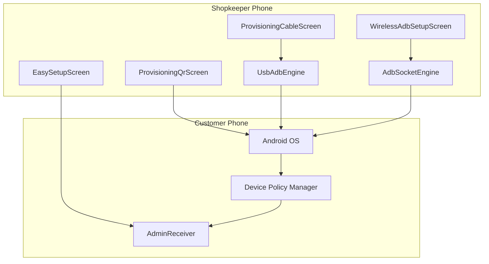
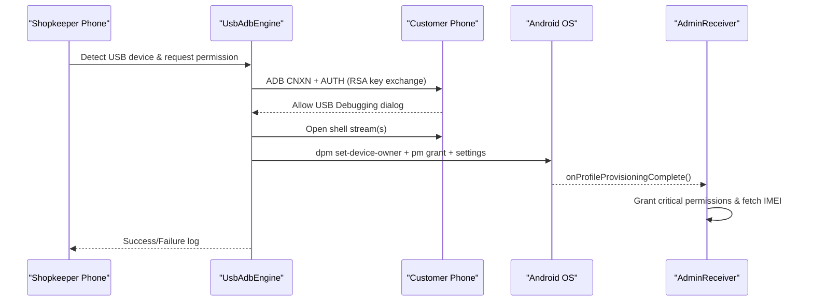
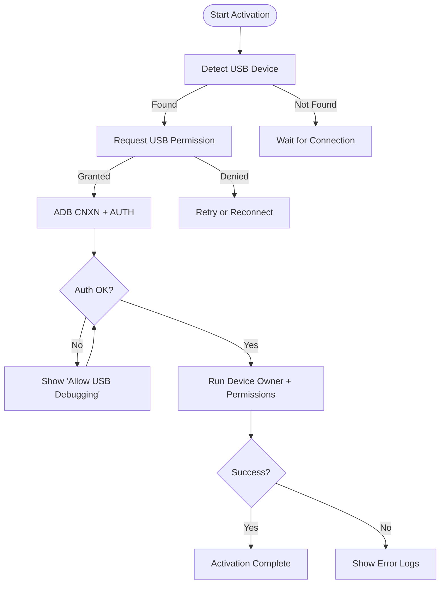
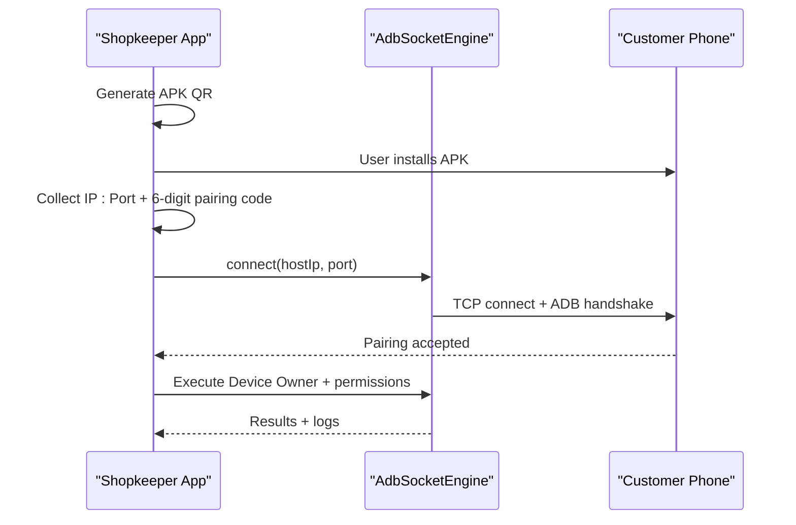
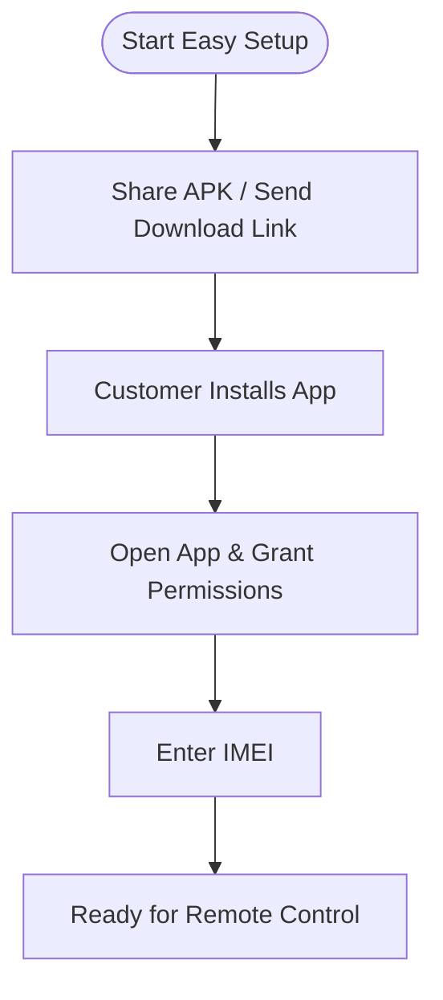
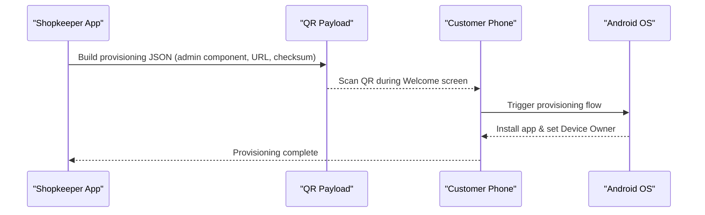
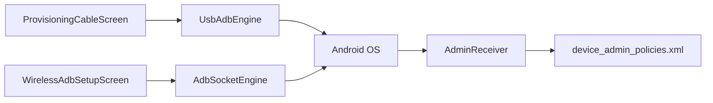

# Manual Installation Process

<cite>
**Referenced Files in This Document**
- [EasySetupScreen.kt](file://app/src/main/java/com/pksafe/lock/manager/ui/provisioning/EasySetupScreen.kt)
- [ProvisioningCableScreen.kt](file://app/src/main/java/com/pksafe/lock/manager/ui/provisioning/ProvisioningCableScreen.kt)
- [WirelessAdbSetupScreen.kt](file://app/src/main/java/com/pksafe/lock/manager/ui/provisioning/WirelessAdbSetupScreen.kt)
- [UsbAdbEngine.kt](file://app/src/main/java/com/pksafe/lock/manager/util/UsbAdbEngine.kt)
- [AdbSocketEngine.kt](file://app/src/main/java/com/pksafe/lock/manager/util/AdbSocketEngine.kt)
- [NfcProvisioner.kt](file://app/src/main/java/com/pksafe/lock/manager/util/NfcProvisioner.kt)
- [ProvisioningQrScreen.kt](file://app/src/main/java/com/pksafe/lock/manager/ui/provisioning/ProvisioningQrScreen.kt)
- [AdminReceiver.kt](file://app/src/main/java/com/pksafe/lock/manager/receiver/AdminReceiver.kt)
- [device_admin_policies.xml](file://app/src/main/res/xml/device_admin_policies.xml)
- [setup_device_owner.bat](file://setup_device_owner.bat)
</cite>

## Table of Contents
1. [Introduction](#introduction)
2. [Project Structure](#project-structure)
3. [Core Components](#core-components)
4. [Architecture Overview](#architecture-overview)
5. [Detailed Component Analysis](#detailed-component-analysis)
6. [Dependency Analysis](#dependency-analysis)
7. [Performance Considerations](#performance-considerations)
8. [Troubleshooting Guide](#troubleshooting-guide)
9. [Security Considerations and Best Practices](#security-considerations-and-best-practices)
10. [Conclusion](#conclusion)

## Introduction
This document explains PK Locker’s manual installation methods for scenarios where automated provisioning is not available. It covers:
- Cable-based installation using USB debugging and ADB commands (shopkeeper-to-customer via C-to-C cable).
- Wireless ADB setup wizard that guides users through pairing, Device Owner enrollment, and automatic permission grants.
- Easy Setup flow for shopkeeper-assisted deployment without a laptop or Device Owner mode.
- Technical requirements such as enabling Developer Options and USB Debugging, and using command-line tools.
- Step-by-step instructions for both shopkeeper-assisted and self-service workflows.
- Troubleshooting guidance for common issues and security considerations for large-scale deployments.

## Project Structure
PK Locker implements multiple provisioning paths within the app:
- UI screens guide users through each method (cable, wireless ADB, QR/NFC, easy setup).
- Utility engines implement ADB over USB and TCP sockets to execute device management commands.
- Admin receiver handles post-enrollment tasks like IMEI capture and permission grants.
- Configuration files define device admin policies.

**Diagram sources**
- [ProvisioningCableScreen.kt:87-150](file://app/src/main/java/com/pksafe/lock/manager/ui/provisioning/ProvisioningCableScreen.kt#L87-L150)
- [WirelessAdbSetupScreen.kt:51-120](file://app/src/main/java/com/pksafe/lock/manager/ui/provisioning/WirelessAdbSetupScreen.kt#L51-L120)
- [UsbAdbEngine.kt:188-352](file://app/src/main/java/com/pksafe/lock/manager/util/UsbAdbEngine.kt#L188-L352)
- [AdbSocketEngine.kt:25-96](file://app/src/main/java/com/pksafe/lock/manager/util/AdbSocketEngine.kt#L25-L96)
- [AdminReceiver.kt:16-36](file://app/src/main/java/com/pksafe/lock/manager/receiver/AdminReceiver.kt#L16-L36)

**Section sources**
- [ProvisioningCableScreen.kt:87-150](file://app/src/main/java/com/pksafe/lock/manager/ui/provisioning/ProvisioningCableScreen.kt#L87-L150)
- [WirelessAdbSetupScreen.kt:51-120](file://app/src/main/java/com/pksafe/lock/manager/ui/provisioning/WirelessAdbSetupScreen.kt#L51-L120)
- [UsbAdbEngine.kt:188-352](file://app/src/main/java/com/pksafe/lock/manager/util/UsbAdbEngine.kt#L188-L352)
- [AdbSocketEngine.kt:25-96](file://app/src/main/java/com/pksafe/lock/manager/util/AdbSocketEngine.kt#L25-L96)
- [AdminReceiver.kt:16-36](file://app/src/main/java/com/pksafe/lock/manager/receiver/AdminReceiver.kt#L16-L36)

## Core Components
- Cable-based ADB engine: Implements full ADB USB protocol to authenticate, open shell streams, and run device management commands directly from one Android phone to another via USB OTG.
- Wireless ADB socket engine: Connects to the target device’s wireless ADB daemon over TCP to execute commands without cables.
- Provisioning screens: Provide guided steps, status indicators, logs, and one-click actions to complete setup.
- Admin receiver: Activates after enrollment to grant permissions and capture device identifiers.
- Device admin policies: Define capabilities granted to the app when acting as device admin.

Key responsibilities:
- UsbAdbEngine: USB host ADB handshake, RSA key exchange, shell command execution, and Device Owner setup.
- AdbSocketEngine: TCP socket client for wireless ADB with fallback behavior and result parsing.
- ProvisioningCableScreen: Orchestrates USB detection, permission prompts, and triggers full setup.
- WirelessAdbSetupScreen: Guides user through developer options, wireless debugging, pairing code entry, and executes Device Owner and permission commands.
- EasySetupScreen: Shopkeeper-assisted flow without Device Owner; uses share/install and permission prompts.
- AdminReceiver: Post-provisioning tasks including IMEI capture and permission grants.

**Section sources**
- [UsbAdbEngine.kt:18-53](file://app/src/main/java/com/pksafe/lock/manager/util/UsbAdbEngine.kt#L18-L53)
- [AdbSocketEngine.kt:13-24](file://app/src/main/java/com/pksafe/lock/manager/util/AdbSocketEngine.kt#L13-L24)
- [ProvisioningCableScreen.kt:87-150](file://app/src/main/java/com/pksafe/lock/manager/ui/provisioning/ProvisioningCableScreen.kt#L87-L150)
- [WirelessAdbSetupScreen.kt:51-120](file://app/src/main/java/com/pksafe/lock/manager/ui/provisioning/WirelessAdbSetupScreen.kt#L51-L120)
- [EasySetupScreen.kt:29-39](file://app/src/main/java/com/pksafe/lock/manager/ui/provisioning/EasySetupScreen.kt#L29-L39)
- [AdminReceiver.kt:16-36](file://app/src/main/java/com/pksafe/lock/manager/receiver/AdminReceiver.kt#L16-L36)

## Architecture Overview
The system supports three primary manual installation paths:
- Cable-based ADB: Direct USB communication between two phones to set Device Owner and grant permissions automatically.
- Wireless ADB: Pair over Wi-Fi using a pairing code and execute commands remotely.
- Easy Setup: No Device Owner; app runs as device admin with standard permission flows.

**Diagram sources**
- [ProvisioningCableScreen.kt:294-323](file://app/src/main/java/com/pksafe/lock/manager/ui/provisioning/ProvisioningCableScreen.kt#L294-L323)
- [UsbAdbEngine.kt:214-352](file://app/src/main/java/com/pksafe/lock/manager/util/UsbAdbEngine.kt#L214-L352)
- [AdminReceiver.kt:23-36](file://app/src/main/java/com/pksafe/lock/manager/receiver/AdminReceiver.kt#L23-L36)

## Detailed Component Analysis

### Cable-Based Installation (USB Debugging via C-to-C)
This method enables full Device Owner enrollment without a PC by using one Android phone as an ADB host connected to the customer phone via USB OTG.

Requirements:
- Customer phone must have Developer Options enabled and USB Debugging turned on.
- Use a compatible C-to-C cable and ensure USB debugging authorization is allowed on the customer device.
- The shopkeeper phone must support USB Host mode and be able to enumerate the ADB interface.

Flow:
- Detect USB device and request system permission.
- Perform ADB handshake and RSA key exchange; prompt user to allow USB debugging if needed.
- Execute Device Owner setup and auto-grant required permissions (overlay, accessibility, SMS, location, phone state).
- Display live logs and success/failure status.

**Diagram sources**
- [ProvisioningCableScreen.kt:111-170](file://app/src/main/java/com/pksafe/lock/manager/ui/provisioning/ProvisioningCableScreen.kt#L111-L170)
- [UsbAdbEngine.kt:214-284](file://app/src/main/java/com/pksafe/lock/manager/util/UsbAdbEngine.kt#L214-L284)
- [UsbAdbEngine.kt:287-352](file://app/src/main/java/com/pksafe/lock/manager/util/UsbAdbEngine.kt#L287-L352)

Step-by-step (shopkeeper-assisted):
1. On the customer phone, enable Developer Options and turn on USB Debugging.
2. Connect the customer phone to the shopkeeper phone using a C-to-C cable.
3. When prompted on the customer phone, allow USB debugging.
4. In the shopkeeper app, tap “ACTIVATE” to start the process.
5. Follow on-screen checklist and confirm permissions.
6. Review logs and confirm activation completion.

Technical notes:
- The engine performs ADB authentication using RSA keys persisted on the shopkeeper device to avoid repeated prompts.
- After successful connection, it opens shell streams and executes Device Owner and permission commands in sequence.

**Section sources**
- [ProvisioningCableScreen.kt:87-150](file://app/src/main/java/com/pksafe/lock/manager/ui/provisioning/ProvisioningCableScreen.kt#L87-L150)
- [ProvisioningCableScreen.kt:294-323](file://app/src/main/java/com/pksafe/lock/manager/ui/provisioning/ProvisioningCableScreen.kt#L294-L323)
- [UsbAdbEngine.kt:188-352](file://app/src/main/java/com/pksafe/lock/manager/util/UsbAdbEngine.kt#L188-L352)

### Wireless ADB Setup Wizard
This wizard guides users through enabling wireless debugging, pairing via a 6-digit code, and executing Device Owner enrollment and permission grants over TCP.

Requirements:
- Customer phone must have Developer Options and Wireless Debugging enabled.
- Both devices should be on the same Wi-Fi network.
- The shopkeeper app will generate a QR for APK download and then pair via IP:Port and pairing code.

Flow:
- Show QR to install the app on the customer phone.
- Enter the customer’s IP:Port and 6-digit pairing code.
- Establish a TCP connection to the wireless ADB daemon.
- Execute Device Owner and auto-grant permissions.

**Diagram sources**
- [WirelessAdbSetupScreen.kt:108-124](file://app/src/main/java/com/pksafe/lock/manager/ui/provisioning/WirelessAdbSetupScreen.kt#L108-L124)
- [WirelessAdbSetupScreen.kt:226-262](file://app/src/main/java/com/pksafe/lock/manager/ui/provisioning/WirelessAdbSetupScreen.kt#L226-L262)
- [AdbSocketEngine.kt:25-96](file://app/src/main/java/com/pksafe/lock/manager/util/AdbSocketEngine.kt#L25-L96)

Step-by-step (self-service):
1. Scan the QR to install the app on the customer phone.
2. Enable Developer Options and Wireless Debugging on the customer phone.
3. Note the IP:Port shown under Wireless Debugging and the 6-digit pairing code.
4. On the shopkeeper app, enter IP:Port and pairing code, then tap “PAIR & CONNECT”.
5. Once connected, tap “SET DEVICE OWNER” to enroll and auto-grant permissions.
6. Confirm success via logs and status indicator.

**Section sources**
- [WirelessAdbSetupScreen.kt:154-221](file://app/src/main/java/com/pksafe/lock/manager/ui/provisioning/WirelessAdbSetupScreen.kt#L154-L221)
- [WirelessAdbSetupScreen.kt:226-382](file://app/src/main/java/com/pksafe/lock/manager/ui/provisioning/WirelessAdbSetupScreen.kt#L226-L382)
- [AdbSocketEngine.kt:25-96](file://app/src/main/java/com/pksafe/lock/manager/util/AdbSocketEngine.kt#L25-L96)

### Easy Setup (Shopkeeper-Assisted Without Device Owner)
This method avoids Device Owner enrollment entirely. The shopkeeper shares the APK, the customer installs it, and the app requests necessary permissions (Device Admin, Overlay, Accessibility).

Flow:
- Share APK via system share sheet or provide a download link.
- Customer installs and opens the app.
- App prompts for Device Admin, Overlay, and Accessibility permissions.
- Customer enters IMEI to link to the shopkeeper account.

**Diagram sources**
- [EasySetupScreen.kt:29-39](file://app/src/main/java/com/pksafe/lock/manager/ui/provisioning/EasySetupScreen.kt#L29-L39)
- [EasySetupScreen.kt:107-190](file://app/src/main/java/com/pksafe/lock/manager/ui/provisioning/EasySetupScreen.kt#L107-L190)
- [EasySetupScreen.kt:286-313](file://app/src/main/java/com/pksafe/lock/manager/ui/provisioning/EasySetupScreen.kt#L286-L313)

Step-by-step:
1. Tap “SHARE APK” or copy the download link and send it to the customer.
2. Customer installs the app and allows unknown sources if prompted.
3. Open the app and grant requested permissions (Device Admin, Overlay, Accessibility).
4. Enter the IMEI as registered in the dashboard to link the device.
5. Confirm setup completion; remote control is available from the dashboard.

**Section sources**
- [EasySetupScreen.kt:107-190](file://app/src/main/java/com/pksafe/lock/manager/ui/provisioning/EasySetupScreen.kt#L107-L190)
- [EasySetupScreen.kt:286-313](file://app/src/main/java/com/pksafe/lock/manager/ui/provisioning/EasySetupScreen.kt#L286-L313)

### QR/NFC Provisioning (Alternative Enrollment)
QR and NFC can be used to trigger native Android provisioning flows that set Device Owner during initial setup.

- QR screen generates a provisioning payload including device admin component, package URL, signature checksum, and optional package checksum.
- NFC provisioner creates an NDEF message with provisioning properties for bump-to-setup on the welcome screen.

**Diagram sources**
- [ProvisioningQrScreen.kt:120-158](file://app/src/main/java/com/pksafe/lock/manager/ui/provisioning/ProvisioningQrScreen.kt#L120-L158)
- [NfcProvisioner.kt:22-48](file://app/src/main/java/com/pksafe/lock/manager/util/NfcProvisioner.kt#L22-L48)

**Section sources**
- [ProvisioningQrScreen.kt:120-158](file://app/src/main/java/com/pksafe/lock/manager/ui/provisioning/ProvisioningQrScreen.kt#L120-L158)
- [NfcProvisioner.kt:22-48](file://app/src/main/java/com/pksafe/lock/manager/util/NfcProvisioner.kt#L22-L48)

### Command-Line Tool (PC-Based Batch Script)
For environments where a PC is available, a batch script automates ADB operations to install the APK and set Device Owner.

Steps:
1. Factory reset the target phone and skip adding any Google accounts during setup.
2. Enable Developer Options and USB Debugging.
3. Connect the target phone to the PC via USB and allow debugging.
4. Run the provided batch script to check ADB connectivity, install the APK, verify users, and set Device Owner.
5. Follow error messages if setup fails (e.g., accounts present, factory reset required).

**Section sources**
- [setup_device_owner.bat:12-22](file://setup_device_owner.bat#L12-L22)
- [setup_device_owner.bat:24-55](file://setup_device_owner.bat#L24-L55)
- [setup_device_owner.bat:57-81](file://setup_device_owner.bat#L57-L81)

## Dependency Analysis
- ProvisioningCableScreen depends on UsbAdbEngine for USB ADB operations and displays real-time logs.
- WirelessAdbSetupScreen depends on AdbSocketEngine for TCP-based ADB commands and provides step-by-step guidance.
- AdminReceiver is invoked by the OS after Device Owner enrollment to finalize setup and grant permissions.
- Device admin policies define the capabilities available to the app when acting as device admin.

**Diagram sources**
- [ProvisioningCableScreen.kt:294-323](file://app/src/main/java/com/pksafe/lock/manager/ui/provisioning/ProvisioningCableScreen.kt#L294-L323)
- [WirelessAdbSetupScreen.kt:320-382](file://app/src/main/java/com/pksafe/lock/manager/ui/provisioning/WirelessAdbSetupScreen.kt#L320-L382)
- [AdminReceiver.kt:16-36](file://app/src/main/java/com/pksafe/lock/manager/receiver/AdminReceiver.kt#L16-L36)
- [device_admin_policies.xml:1-13](file://app/src/main/res/xml/device_admin_policies.xml#L1-L13)

**Section sources**
- [ProvisioningCableScreen.kt:294-323](file://app/src/main/java/com/pksafe/lock/manager/ui/provisioning/ProvisioningCableScreen.kt#L294-L323)
- [WirelessAdbSetupScreen.kt:320-382](file://app/src/main/java/com/pksafe/lock/manager/ui/provisioning/WirelessAdbSetupScreen.kt#L320-L382)
- [AdminReceiver.kt:16-36](file://app/src/main/java/com/pksafe/lock/manager/receiver/AdminReceiver.kt#L16-L36)
- [device_admin_policies.xml:1-13](file://app/src/main/res/xml/device_admin_policies.xml#L1-L13)

## Performance Considerations
- USB ADB throughput: Bulk transfers are used for ADB messages; ensure stable connections and avoid interruptions during handshake and command execution.
- Timeout handling: ADB operations include timeouts; long waits may occur when prompting users to allow USB debugging.
- Network reliability: Wireless ADB depends on Wi-Fi stability; consider retry logic and clear error messaging.
- Logging overhead: Live logs are helpful but can impact UI responsiveness if too verbose; keep logs concise and scrollable.

[No sources needed since this section provides general guidance]

## Troubleshooting Guide
Common issues and resolutions:
- USB connection problems:
  - Ensure the correct cable and USB OTG support on the shopkeeper phone.
  - Verify the customer phone shows “Allow USB Debugging” and accepts the prompt.
  - If the device is not detected, recheck Developer Options and USB Debugging settings.
- Permission denials:
  - If USB permission is denied, reconnect the cable and accept the system dialog again.
  - For wireless ADB, ensure the IP:Port and pairing code are correct and the device is on the same network.
- Device-specific compatibility:
  - Some OEM skins may restrict USB debugging or require additional steps; consult device documentation.
  - If Device Owner cannot be set due to existing accounts, perform a factory reset and skip adding accounts during setup.
- Errors in scripts:
  - For PC-based setup, verify platform-tools path and ADB connectivity before running the script.
  - Check error messages indicating missing accounts, incorrect debug settings, or pre-existing Device Owner.

Operational tips:
- Use the in-app log window to copy and share logs for support.
- For wireless ADB, validate connection with a simple echo command before proceeding to Device Owner enrollment.
- Keep the shopkeeper app updated to benefit from improved compatibility and bug fixes.

**Section sources**
- [ProvisioningCableScreen.kt:111-170](file://app/src/main/java/com/pksafe/lock/manager/ui/provisioning/ProvisioningCableScreen.kt#L111-L170)
- [ProvisioningCableScreen.kt:294-323](file://app/src/main/java/com/pksafe/lock/manager/ui/provisioning/ProvisioningCableScreen.kt#L294-L323)
- [WirelessAdbSetupScreen.kt:226-262](file://app/src/main/java/com/pksafe/lock/manager/ui/provisioning/WirelessAdbSetupScreen.kt#L226-L262)
- [setup_device_owner.bat:57-81](file://setup_device_owner.bat#L57-L81)

## Security Considerations and Best Practices
- USB Debugging risks:
  - Only enable USB Debugging on trusted devices and cables.
  - Revoke USB debugging authorizations periodically, especially in shared environments.
- RSA key persistence:
  - Keys are stored locally on the shopkeeper device; protect the device and consider secure storage practices.
- APK distribution:
  - Prefer signed APKs and verify signatures/checksums to prevent tampering.
  - Use HTTPS endpoints for APK downloads and enforce integrity checks.
- Least privilege:
  - Request only necessary permissions and use Device Owner mode only when required.
  - For non-Device Owner setups, rely on standard permission flows and clearly inform users.
- Large-scale deployment:
  - Standardize device preparation (factory reset, no accounts, developer options enabled).
  - Provide training materials and checklists for shopkeepers and end-users.
  - Centralize logging and monitoring to detect failures early and improve success rates.

[No sources needed since this section provides general guidance]

## Conclusion
PK Locker offers flexible manual installation methods tailored for enterprise and shopkeeper environments:
- Cable-based ADB enables fast, reliable Device Owner enrollment without a PC.
- Wireless ADB provides a convenient, cable-free workflow with guided pairing and automation.
- Easy Setup supports quick deployments without Device Owner constraints.
- QR/NFC provisioning leverages Android’s native enrollment for streamlined experiences.
By following the documented steps, troubleshooting guidance, and security best practices, organizations can deploy PK Locker efficiently at scale while maintaining control and safety.

[No sources needed since this section summarizes without analyzing specific files]