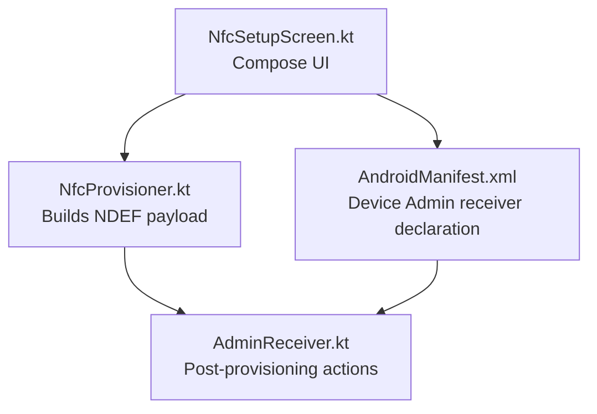
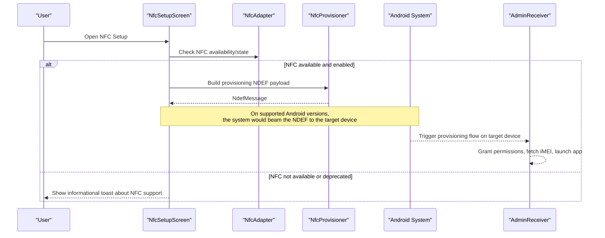
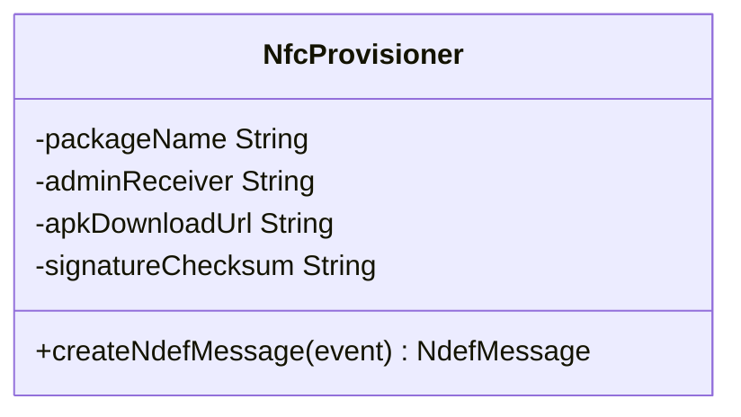
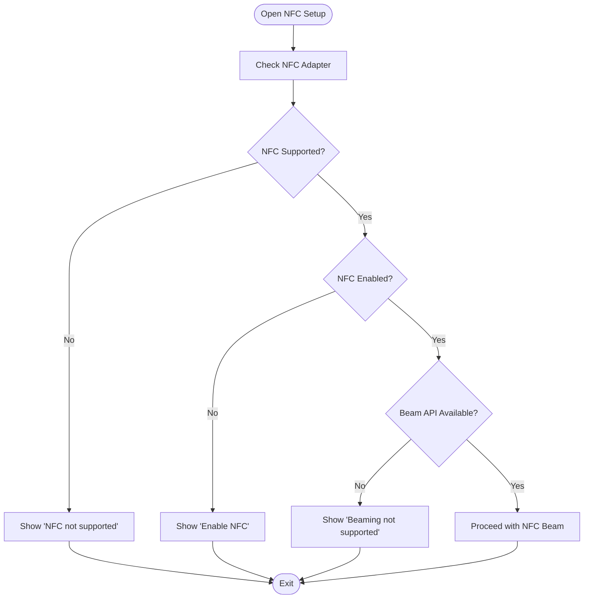
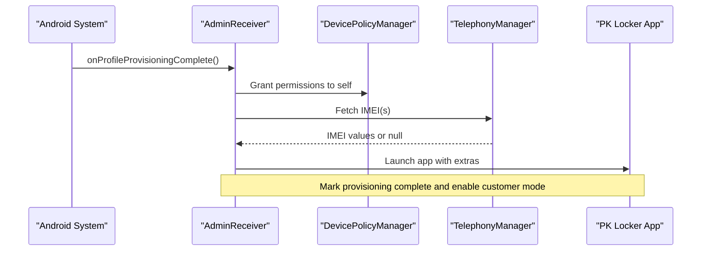
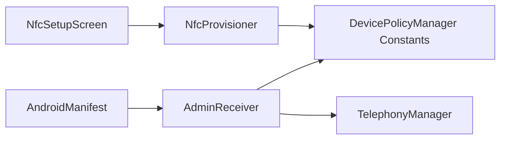

# NFC Contactless Setup

<cite>
**Referenced Files in This Document**
- [NfcProvisioner.kt](file://app/src/main/java/com/pksafe/lock/manager/util/NfcProvisioner.kt)
- [NfcSetupScreen.kt](file://app/src/main/java/com/pksafe/lock/manager/ui/provisioning/NfcSetupScreen.kt)
- [AdminReceiver.kt](file://app/src/main/java/com/pksafe/lock/manager/receiver/AdminReceiver.kt)
- [AndroidManifest.xml](file://app/src/main/AndroidManifest.xml)
- [device_admin_policies.xml](file://app/src/main/res/xml/device_admin_policies.xml)
- [MainActivity.kt](file://app/src/main/java/com/pksafe/lock/manager/MainActivity.kt)
</cite>

## Table of Contents
1. Introduction
2. Project Structure
3. Core Components
4. Architecture Overview
5. Detailed Component Analysis
6. Dependency Analysis
7. Performance Considerations
8. Troubleshooting Guide
9. Conclusion
10. Appendices

## Introduction
This document explains PK Locker’s NFC contactless provisioning system for tap-to-configure device enrollment. It covers how the app prepares provisioning data, how that data is embedded into an NDEF message, and how a target Android device can be enrolled as a Device Owner via NFC during initial setup. It also documents current implementation status, supported technologies, user workflow, permissions, hardware requirements, compatibility considerations across Android versions, error handling, and fallback mechanisms when NFC is unavailable or deprecated on certain platforms.

## Project Structure
The NFC provisioning feature spans UI, utility, and receiver components:
- UI layer: A Compose screen to initiate NFC-based setup and guide users through the process.
- Utility layer: A helper class that builds the provisioning NDEF payload using Android’s Device Policy Manager constants.
- Receiver layer: The Device Admin receiver that finalizes provisioning and sets up post-provisioning behavior.
- Manifest: Declares the Device Admin receiver and policies required for enrollment.

**Diagram sources**
- [NfcSetupScreen.kt:29-45](file://app/src/main/java/com/pksafe/lock/manager/ui/provisioning/NfcSetupScreen.kt#L29-L45)
- [NfcProvisioner.kt:22-48](file://app/src/main/java/com/pksafe/lock/manager/util/NfcProvisioner.kt#L22-L48)
- [AndroidManifest.xml:87-99](file://app/src/main/AndroidManifest.xml#L87-L99)
- [AdminReceiver.kt:16-36](file://app/src/main/java/com/pksafe/lock/manager/receiver/AdminReceiver.kt#L16-L36)

**Section sources**
- [NfcSetupScreen.kt:29-45](file://app/src/main/java/com/pksafe/lock/manager/ui/provisioning/NfcSetupScreen.kt#L29-L45)
- [NfcProvisioner.kt:22-48](file://app/src/main/java/com/pksafe/lock/manager/util/NfcProvisioner.kt#L22-L48)
- [AndroidManifest.xml:87-99](file://app/src/main/AndroidManifest.xml#L87-L99)
- [AdminReceiver.kt:16-36](file://app/src/main/java/com/pksafe/lock/manager/receiver/AdminReceiver.kt#L16-L36)

## Core Components
- NfcProvisioner: Builds the provisioning NDEF message containing Device Policy Manager enrollment properties (package name, component name, download URL, signature checksum, locale/time zone flags).
- NfcSetupScreen: Detects NFC availability and state; currently notes that NFC Beam APIs are deprecated/removed on recent Android versions and shows appropriate messages.
- AdminReceiver: Handles provisioning completion events, grants critical permissions to itself as Device Owner, fetches IMEI, and launches the app to finalize setup.
- AndroidManifest: Registers the Device Admin receiver with required policies and intent filters for provisioning lifecycle events.

Key responsibilities:
- Payload construction: NfcProvisioner serializes provisioning properties into a MIME-type NDEF record using DevicePolicyManager constants.
- User guidance: NfcSetupScreen checks NFC adapter presence and enabled state, and informs users about platform limitations.
- Post-setup automation: AdminReceiver ensures the app gains necessary privileges and proceeds to customer mode.

**Section sources**
- [NfcProvisioner.kt:22-48](file://app/src/main/java/com/pksafe/lock/manager/util/NfcProvisioner.kt#L22-L48)
- [NfcSetupScreen.kt:34-45](file://app/src/main/java/com/pksafe/lock/manager/ui/provisioning/NfcSetupScreen.kt#L34-L45)
- [AdminReceiver.kt:16-36](file://app/src/main/java/com/pksafe/lock/manager/receiver/AdminReceiver.kt#L16-L36)
- [AndroidManifest.xml:87-99](file://app/src/main/AndroidManifest.xml#L87-L99)

## Architecture Overview
The NFC provisioning flow integrates three layers:
- UI triggers NFC readiness checks and guides users.
- Utility constructs the provisioning NDEF payload based on Device Policy Manager constants.
- Receiver handles provisioning completion and finalizes device ownership and permissions.

**Diagram sources**
- [NfcSetupScreen.kt:34-45](file://app/src/main/java/com/pksafe/lock/manager/ui/provisioning/NfcSetupScreen.kt#L34-L45)
- [NfcProvisioner.kt:22-48](file://app/src/main/java/com/pksafe/lock/manager/util/NfcProvisioner.kt#L22-L48)
- [AdminReceiver.kt:16-36](file://app/src/main/java/com/pksafe/lock/manager/receiver/AdminReceiver.kt#L16-L36)

## Detailed Component Analysis

### NfcProvisioner
Purpose:
- Implements CreateNdefMessageCallback to build a provisioning NDEF message.
- Serializes Device Policy Manager enrollment properties into a MIME-type NDEF record.

Implementation highlights:
- Uses DevicePolicyManager constants for mandatory enrollment fields (package name, component name, download location, signature checksum).
- Adds optional UX-related properties (locale, time zone, leaving system apps enabled).
- Constructs a single NdefRecord with MIME type defined by DevicePolicyManager and returns an NdefMessage containing that record.

Data structure and complexity:
- Time complexity: O(1) for property serialization and record creation given fixed-size payloads.
- Space complexity: O(n) where n is the size of serialized properties plus overhead for NDEF structures.

Error handling:
- No explicit try/catch around property serialization; errors would propagate to caller if any I/O issues occur.

Optimization opportunities:
- Cache reusable parts of the payload if multiple tags are written in quick succession.
- Validate inputs before serialization to fail fast.

**Diagram sources**
- [NfcProvisioner.kt:15-48](file://app/src/main/java/com/pksafe/lock/manager/util/NfcProvisioner.kt#L15-L48)

**Section sources**
- [NfcProvisioner.kt:22-48](file://app/src/main/java/com/pksafe/lock/manager/util/NfcProvisioner.kt#L22-L48)

### NfcSetupScreen
Purpose:
- Provides the UI for initiating NFC-based setup.
- Checks NFC adapter presence and enabled state.
- Displays user instructions and informs about platform limitations.

Behavioral notes:
- Detects if NFC is unsupported or disabled and shows corresponding toasts.
- Notes that setNdefPushMessageCallback is deprecated/removed on recent Android versions; accordingly, it shows a message indicating NFC Beaming is not supported on this Android version.

User workflow:
- Guides users to ensure devices are factory reset, NFC enabled, and placed back-to-back on the Welcome screen.

Compatibility considerations:
- Explicitly accounts for deprecation/removal of NFC Beam APIs in newer Android versions.

**Diagram sources**
- [NfcSetupScreen.kt:34-45](file://app/src/main/java/com/pksafe/lock/manager/ui/provisioning/NfcSetupScreen.kt#L34-L45)

**Section sources**
- [NfcSetupScreen.kt:34-45](file://app/src/main/java/com/pksafe/lock/manager/ui/provisioning/NfcSetupScreen.kt#L34-L45)
- [NfcSetupScreen.kt:121-125](file://app/src/main/java/com/pksafe/lock/manager/ui/provisioning/NfcSetupScreen.kt#L121-L125)

### AdminReceiver
Purpose:
- Receives provisioning lifecycle events and finalizes device ownership setup.
- Grants critical permissions to itself as Device Owner.
- Fetches IMEI information and marks provisioning complete.

Processing logic:
- onEnabled/onProfileProvisioningComplete: Logs events, attempts IMEI retrieval, grants permissions, and launches the app to continue setup.
- Permission granting: Uses DevicePolicyManager to grant SMS and phone state permissions to the admin component.

Error handling:
- Gracefully handles exceptions during IMEI retrieval and continues marking provisioning complete even if IMEI cannot be fetched.

**Diagram sources**
- [AdminReceiver.kt:16-36](file://app/src/main/java/com/pksafe/lock/manager/receiver/AdminReceiver.kt#L16-L36)
- [AdminReceiver.kt:43-101](file://app/src/main/java/com/pksafe/lock/manager/receiver/AdminReceiver.kt#L43-L101)

**Section sources**
- [AdminReceiver.kt:16-36](file://app/src/main/java/com/pksafe/lock/manager/receiver/AdminReceiver.kt#L16-L36)
- [AdminReceiver.kt:43-101](file://app/src/main/java/com/pksafe/lock/manager/receiver/AdminReceiver.kt#L43-L101)

### AndroidManifest and Policies
Purpose:
- Declares the Device Admin receiver and its policies.
- Ensures the system recognizes provisioning completion events.

Key declarations:
- Receiver registration with BIND_DEVICE_ADMIN permission and resource reference to device_admin_policies.xml.
- Intent filters for DEVICE_ADMIN_ENABLED, BOOT_COMPLETED, and PROFILE_PROVISIONING_COMPLETE.

**Section sources**
- [AndroidManifest.xml:87-99](file://app/src/main/AndroidManifest.xml#L87-L99)
- [device_admin_policies.xml:1-12](file://app/src/main/res/xml/device_admin_policies.xml#L1-L12)

## Dependency Analysis
- NfcSetupScreen depends on NfcAdapter and displays UI feedback based on NFC availability and state.
- NfcProvisioner depends on DevicePolicyManager constants to construct the provisioning NDEF payload.
- AdminReceiver depends on DevicePolicyManager and TelephonyManager to finalize provisioning and gather device identifiers.
- AndroidManifest ties the receiver to the system’s provisioning lifecycle.

**Diagram sources**
- [NfcSetupScreen.kt:34-45](file://app/src/main/java/com/pksafe/lock/manager/ui/provisioning/NfcSetupScreen.kt#L34-L45)
- [NfcProvisioner.kt:22-48](file://app/src/main/java/com/pksafe/lock/manager/util/NfcProvisioner.kt#L22-L48)
- [AdminReceiver.kt:43-101](file://app/src/main/java/com/pksafe/lock/manager/receiver/AdminReceiver.kt#L43-L101)
- [AndroidManifest.xml:87-99](file://app/src/main/AndroidManifest.xml#L87-L99)

**Section sources**
- [NfcSetupScreen.kt:34-45](file://app/src/main/java/com/pksafe/lock/manager/ui/provisioning/NfcSetupScreen.kt#L34-L45)
- [NfcProvisioner.kt:22-48](file://app/src/main/java/com/pksafe/lock/manager/util/NfcProvisioner.kt#L22-L48)
- [AdminReceiver.kt:43-101](file://app/src/main/java/com/pksafe/lock/manager/receiver/AdminReceiver.kt#L43-L101)
- [AndroidManifest.xml:87-99](file://app/src/main/AndroidManifest.xml#L87-L99)

## Performance Considerations
- NDEF payload construction is lightweight and suitable for real-time use during NFC interactions.
- Avoid repeated heavy operations inside NFC callbacks; keep createNdefMessage minimal.
- If implementing bulk tag writing, batch operations and minimize UI updates to prevent blocking NFC threads.

[No sources needed since this section provides general guidance]

## Troubleshooting Guide
Common issues and resolutions:
- NFC not supported: The UI detects missing NFC hardware and informs the user. Use alternative provisioning methods (QR, cable, wireless ADB) if NFC is unavailable.
- NFC disabled: Prompt users to enable NFC in settings before attempting setup.
- NFC Beam deprecated: On newer Android versions, the Beam API may be removed; the UI indicates this limitation. Consider alternative flows such as QR-based provisioning implemented elsewhere in the app.
- Provisioning failures: Ensure the target device is on the Welcome screen after factory reset and that both devices have NFC enabled. Verify that the Device Admin receiver is properly declared and policies are configured.
- Permissions not granted: Confirm that AdminReceiver grants required permissions to itself as Device Owner and that provisioning completes successfully.

**Section sources**
- [NfcSetupScreen.kt:34-45](file://app/src/main/java/com/pksafe/lock/manager/ui/provisioning/NfcSetupScreen.kt#L34-L45)
- [AndroidManifest.xml:87-99](file://app/src/main/AndroidManifest.xml#L87-L99)
- [AdminReceiver.kt:43-101](file://app/src/main/java/com/pksafe/lock/manager/receiver/AdminReceiver.kt#L43-L101)

## Conclusion
PK Locker’s NFC provisioning system is designed to streamline device enrollment by embedding Device Policy Manager provisioning data into an NDEF message. While the utility layer correctly constructs the payload, the current UI reflects platform limitations due to deprecation/removal of NFC Beam APIs on recent Android versions. For production deployments, consider integrating alternative provisioning mechanisms (e.g., QR code-based flows already present in the app) while retaining the NDEF payload logic for environments where NFC Beam remains supported.

[No sources needed since this section summarizes without analyzing specific files]

## Appendices

### NFC Tag Format and NDEF Message Structure
- The provisioning payload is serialized into a MIME-type NDEF record using DevicePolicyManager constants.
- The NDEF message contains a single record with the MIME type defined by DevicePolicyManager for NFC provisioning.
- Properties include mandatory enrollment fields (package name, component name, download location, signature checksum) and optional UX flags (locale, time zone, system apps enabled).

Note: The current implementation focuses on building the NDEF payload; actual tag writing via NFC Beam is gated by platform support and is currently disabled in the UI due to deprecation.

**Section sources**
- [NfcProvisioner.kt:22-48](file://app/src/main/java/com/pksafe/lock/manager/util/NfcProvisioner.kt#L22-L48)

### Supported NFC Technologies
- The code uses standard Android NFC APIs (NfcAdapter, NdefMessage, NdefRecord) which operate at the platform level and abstract underlying tag technologies.
- Specific tag models (e.g., NTAG213/215/216) are not explicitly referenced in the codebase; compatibility depends on the Android device’s NFC stack and whether NFC Beam is supported.

**Section sources**
- [NfcProvisioner.kt:22-48](file://app/src/main/java/com/pksafe/lock/manager/util/NfcProvisioner.kt#L22-L48)
- [NfcSetupScreen.kt:34-45](file://app/src/main/java/com/pksafe/lock/manager/ui/provisioning/NfcSetupScreen.kt#L34-L45)

### User Workflow from Tag Creation to Provisioning Completion
- Prepare target device: Factory reset to reach the Welcome screen.
- Ensure both devices have NFC enabled.
- Initiate NFC setup on the master device; the UI checks NFC availability and informs about platform support.
- If supported, the system beams the NDEF payload to the target device, triggering provisioning.
- AdminReceiver finalizes setup by granting permissions, fetching IMEI, and launching the app.

**Section sources**
- [NfcSetupScreen.kt:121-125](file://app/src/main/java/com/pksafe/lock/manager/ui/provisioning/NfcSetupScreen.kt#L121-L125)
- [AdminReceiver.kt:16-36](file://app/src/main/java/com/pksafe/lock/manager/receiver/AdminReceiver.kt#L16-L36)

### Required Permissions and Hardware Requirements
- Device Admin receiver requires BIND_DEVICE_ADMIN and is registered with policies.
- Post-provisioning, AdminReceiver grants SMS and phone state permissions to itself as Device Owner.
- Hardware: NFC-capable device with NFC enabled; however, NFC Beam may be unavailable on newer Android versions.

**Section sources**
- [AndroidManifest.xml:87-99](file://app/src/main/AndroidManifest.xml#L87-L99)
- [AdminReceiver.kt:43-101](file://app/src/main/java/com/pksafe/lock/manager/receiver/AdminReceiver.kt#L43-L101)

### Fallback Mechanisms When NFC Is Unavailable
- The UI detects unsupported or disabled NFC and shows informative toasts.
- Alternative provisioning methods (QR, cable sync, wireless ADB) are available within the app and can be used when NFC is not viable.

**Section sources**
- [NfcSetupScreen.kt:34-45](file://app/src/main/java/com/pksafe/lock/manager/ui/provisioning/NfcSetupScreen.kt#L34-L45)
- [MainActivity.kt:1111-1171](file://app/src/main/java/com/pksafe/lock/manager/MainActivity.kt#L1111-L1171)