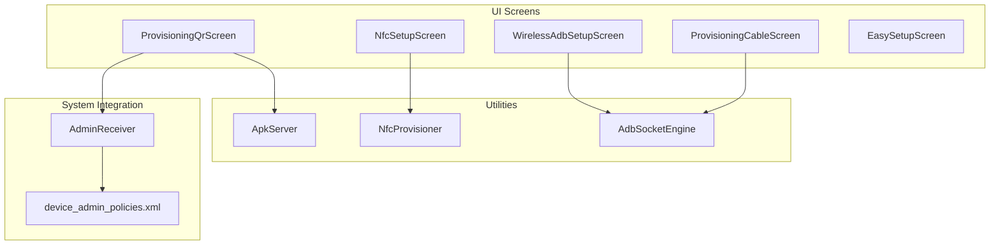
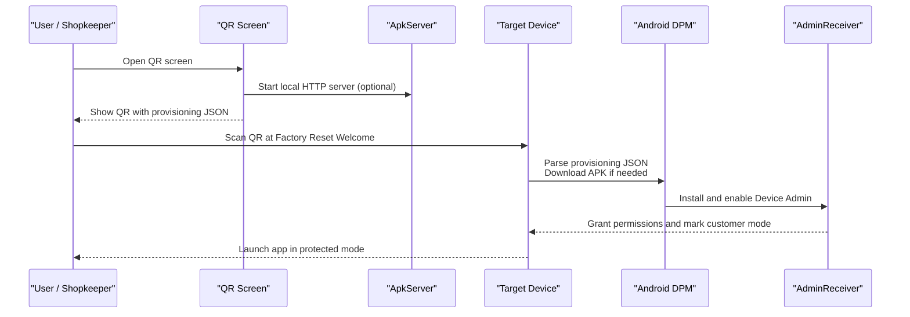
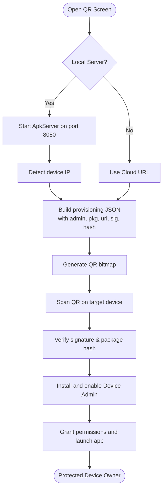
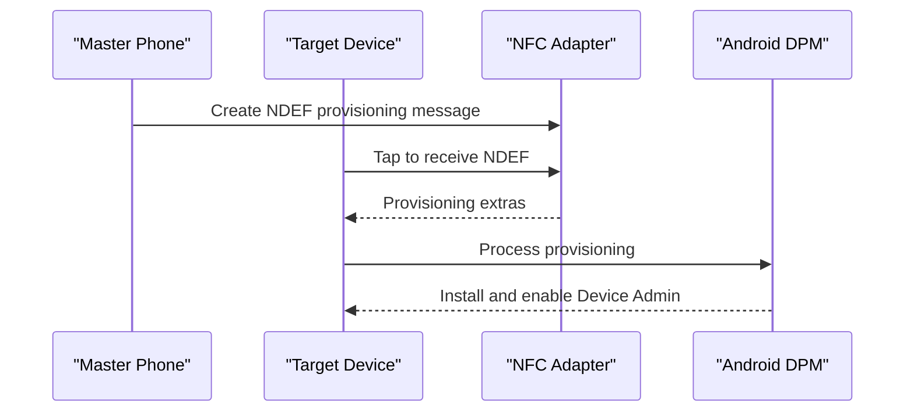
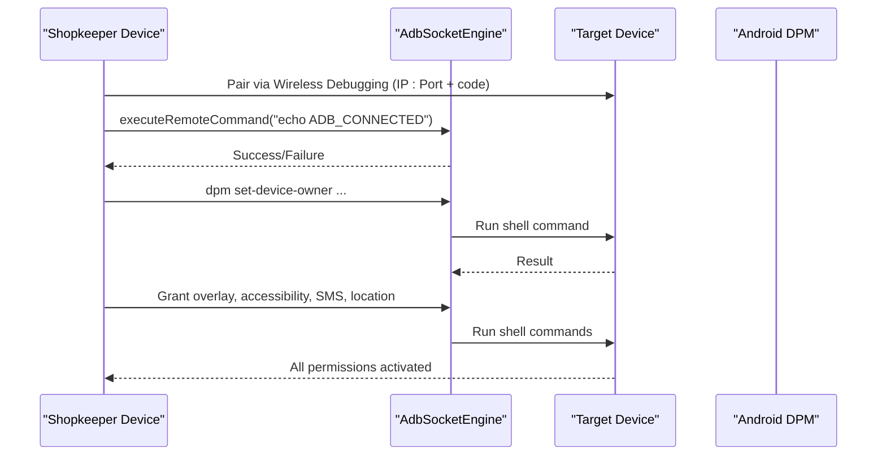
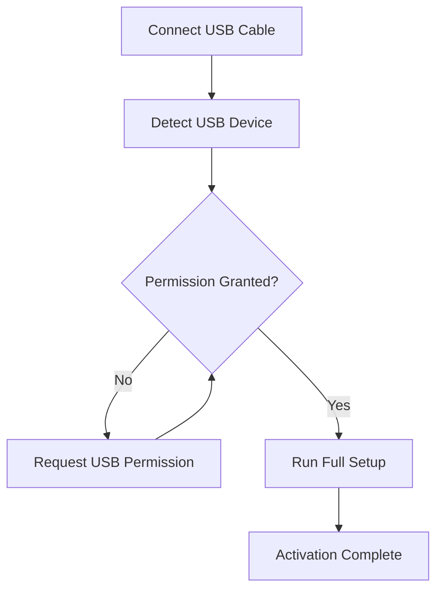
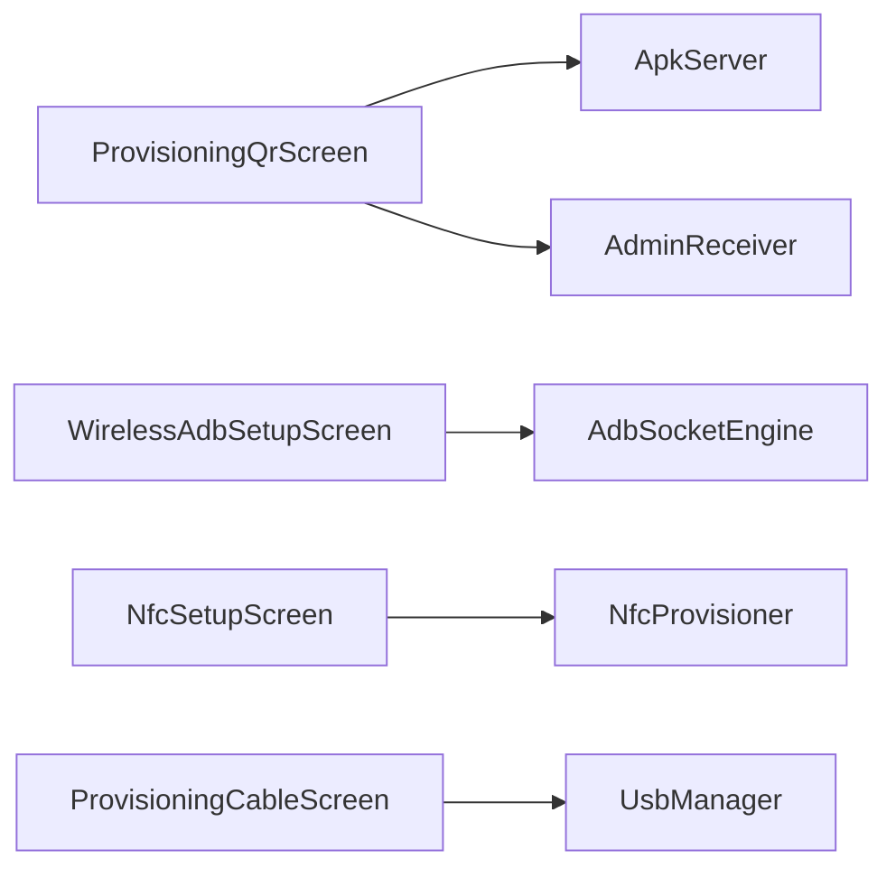

# Provisioning System

<cite>
**Referenced Files in This Document**
- [ProvisioningQrScreen.kt](file://app/src/main/java/com/pksafe/lock/manager/ui/provisioning/ProvisioningQrScreen.kt)
- [NfcSetupScreen.kt](file://app/src/main/java/com/pksafe/lock/manager/ui/provisioning/NfcSetupScreen.kt)
- [WirelessAdbSetupScreen.kt](file://app/src/main/java/com/pksafe/lock/manager/ui/provisioning/WirelessAdbSetupScreen.kt)
- [NfcProvisioner.kt](file://app/src/main/java/com/pksafe/lock/manager/util/NfcProvisioner.kt)
- [AdbSocketEngine.kt](file://app/src/main/java/com/pksafe/lock/manager/util/AdbSocketEngine.kt)
- [ApkServer.kt](file://app/src/main/java/com/pksafe/lock/manager/util/ApkServer.kt)
- [AdminReceiver.kt](file://app/src/main/java/com/pksafe/lock/manager/receiver/AdminReceiver.kt)
- [device_admin_policies.xml](file://app/src/main/res/xml/device_admin_policies.xml)
- [setup_device_owner.bat](file://setup_device_owner.bat)
- [EasySetupScreen.kt](file://app/src/main/java/com/pksafe/lock/manager/ui/provisioning/EasySetupScreen.kt)
- [ProvisioningCableScreen.kt](file://app/src/main/java/com/pksafe/lock/manager/ui/provisioning/ProvisioningCableScreen.kt)
</cite>

## Table of Contents
1. Introduction
2. Project Structure
3. Core Components
4. Architecture Overview
5. Detailed Component Analysis
6. Dependency Analysis
7. Performance Considerations
8. Troubleshooting Guide
9. Conclusion
10. Appendices

## Introduction
This document explains PK Locker’s provisioning system for multi-method device enrollment and configuration. It covers:
- QR code-based provisioning that configures the app as Device Owner for maximum security and unremovable protection
- NFC contactless setup for quick device configuration (where supported)
- Manual installation procedures for devices where automatic provisioning is not possible
- Wireless ADB debugging support for advanced setup scenarios and enterprise automation
It includes step-by-step workflows, required permissions, troubleshooting guidance, examples of QR code generation and NFC tag formatting, and best practices for large-scale deployments.

## Project Structure
The provisioning system spans UI screens, utilities, and receivers:
- UI screens guide users through QR, NFC, wireless ADB, cable-based activation, and easy manual setup flows
- Utilities provide an internal APK server, NFC provisioning message builder, and a pure Kotlin ADB socket client
- The Device Admin receiver finalizes provisioning and grants critical permissions post-setup
- XML defines device admin policies used by the app

**Diagram sources**
- [ProvisioningQrScreen.kt:120-157](file://app/src/main/java/com/pksafe/lock/manager/ui/provisioning/ProvisioningQrScreen.kt#L120-L157)
- [ApkServer.kt:25-43](file://app/src/main/java/com/pksafe/lock/manager/util/ApkServer.kt#L25-L43)
- [NfcProvisioner.kt:22-49](file://app/src/main/java/com/pksafe/lock/manager/util/NfcProvisioner.kt#L22-L49)
- [WirelessAdbSetupScreen.kt:245-367](file://app/src/main/java/com/pksafe/lock/manager/ui/provisioning/WirelessAdbSetupScreen.kt#L245-L367)
- [AdbSocketEngine.kt:25-96](file://app/src/main/java/com/pksafe/lock/manager/util/AdbSocketEngine.kt#L25-L96)
- [AdminReceiver.kt:16-36](file://app/src/main/java/com/pksafe/lock/manager/receiver/AdminReceiver.kt#L16-L36)
- [device_admin_policies.xml:1-13](file://app/src/main/res/xml/device_admin_policies.xml#L1-L13)

**Section sources**
- [ProvisioningQrScreen.kt:1-460](file://app/src/main/java/com/pksafe/lock/manager/ui/provisioning/ProvisioningQrScreen.kt#L1-L460)
- [NfcSetupScreen.kt:1-148](file://app/src/main/java/com/pksafe/lock/manager/ui/provisioning/NfcSetupScreen.kt#L1-L148)
- [WirelessAdbSetupScreen.kt:1-556](file://app/src/main/java/com/pksafe/lock/manager/ui/provisioning/WirelessAdbSetupScreen.kt#L1-L556)
- [NfcProvisioner.kt:1-51](file://app/src/main/java/com/pksafe/lock/manager/util/NfcProvisioner.kt#L1-L51)
- [AdbSocketEngine.kt:1-164](file://app/src/main/java/com/pksafe/lock/manager/util/AdbSocketEngine.kt#L1-L164)
- [ApkServer.kt:1-95](file://app/src/main/java/com/pksafe/lock/manager/util/ApkServer.kt#L1-L95)
- [AdminReceiver.kt:1-104](file://app/src/main/java/com/pksafe/lock/manager/receiver/AdminReceiver.kt#L1-L104)
- [device_admin_policies.xml:1-13](file://app/src/main/res/xml/device_admin_policies.xml#L1-L13)

## Core Components
- QR Provisioning Screen: Builds a provisioning JSON payload with device admin component, package name, download location, signature checksum, and optional package checksum; generates a QR code for factory reset devices to scan during setup wizard.
- NFC Provisioner: Creates an NDEF provisioning message using Android’s provisioning MIME type and required extras for device owner enrollment.
- Wireless ADB Setup Screen: Guides users to enable developer options and wireless debugging, pairs via pairing code, and executes remote commands to set device owner and auto-grant permissions.
- Cable Activation Screen: Detects USB-connected target device, requests permission, persists RSA keys, and runs a full activation sequence over USB.
- Easy Setup Screen: Provides a non-Device Owner flow for quick distribution and basic protection without requiring laptop or QR.
- Internal APK Server: Serves the exact installed APK from the shopkeeper phone so the target device can download it during QR provisioning.
- Device Admin Receiver: Finalizes provisioning, grants critical permissions when running as Device Owner, and marks the device as customer mode.

**Section sources**
- [ProvisioningQrScreen.kt:120-157](file://app/src/main/java/com/pksafe/lock/manager/ui/provisioning/ProvisioningQrScreen.kt#L120-L157)
- [NfcProvisioner.kt:22-49](file://app/src/main/java/com/pksafe/lock/manager/util/NfcProvisioner.kt#L22-L49)
- [WirelessAdbSetupScreen.kt:245-367](file://app/src/main/java/com/pksafe/lock/manager/ui/provisioning/WirelessAdbSetupScreen.kt#L245-L367)
- [ProvisioningCableScreen.kt:87-171](file://app/src/main/java/com/pksafe/lock/manager/ui/provisioning/ProvisioningCableScreen.kt#L87-L171)
- [EasySetupScreen.kt:29-223](file://app/src/main/java/com/pksafe/lock/manager/ui/provisioning/EasySetupScreen.kt#L29-L223)
- [ApkServer.kt:25-43](file://app/src/main/java/com/pksafe/lock/manager/util/ApkServer.kt#L25-L43)
- [AdminReceiver.kt:16-36](file://app/src/main/java/com/pksafe/lock/manager/receiver/AdminReceiver.kt#L16-L36)

## Architecture Overview
The provisioning architecture supports multiple enrollment paths converging on Device Owner status for maximum control.

**Diagram sources**
- [ProvisioningQrScreen.kt:120-157](file://app/src/main/java/com/pksafe/lock/manager/ui/provisioning/ProvisioningQrScreen.kt#L120-L157)
- [ApkServer.kt:25-43](file://app/src/main/java/com/pksafe/lock/manager/util/ApkServer.kt#L25-L43)
- [AdminReceiver.kt:16-36](file://app/src/main/java/com/pksafe/lock/manager/receiver/AdminReceiver.kt#L16-L36)

## Detailed Component Analysis

### QR Code-Based Device Owner Provisioning
- Purpose: Configure the app as Device Owner during factory reset setup for unremovable protection.
- Key behaviors:
  - Generates a provisioning JSON containing device admin component, package name, download URL, signature checksum, and optional package checksum.
  - Supports two modes: local APK server on shopkeeper phone or cloud URL fallback.
  - Computes SHA-256 hash of the served APK to include in provisioning for integrity verification.
  - Sets flags to leave system apps enabled, skip encryption, allow mobile data, and pass setup extras.
- Workflow:
  - On new device, open welcome screen, trigger QR scanner, connect to same Wi-Fi, scan QR, and let Android complete provisioning automatically.
- Security:
  - Signature checksum ensures only the signed APK is accepted.
  - Package checksum validates downloaded APK integrity.
- Permissions:
  - Device Owner grants broad capabilities; AdminReceiver sets critical runtime permissions after provisioning.

**Diagram sources**
- [ProvisioningQrScreen.kt:64-111](file://app/src/main/java/com/pksafe/lock/manager/ui/provisioning/ProvisioningQrScreen.kt#L64-L111)
- [ProvisioningQrScreen.kt:120-157](file://app/src/main/java/com/pksafe/lock/manager/ui/provisioning/ProvisioningQrScreen.kt#L120-L157)
- [ApkServer.kt:25-43](file://app/src/main/java/com/pksafe/lock/manager/util/ApkServer.kt#L25-L43)

**Section sources**
- [ProvisioningQrScreen.kt:64-111](file://app/src/main/java/com/pksafe/lock/manager/ui/provisioning/ProvisioningQrScreen.kt#L64-L111)
- [ProvisioningQrScreen.kt:120-157](file://app/src/main/java/com/pksafe/lock/manager/ui/provisioning/ProvisioningQrScreen.kt#L120-L157)
- [ProvisioningQrScreen.kt:385-459](file://app/src/main/java/com/pksafe/lock/manager/ui/provisioning/ProvisioningQrScreen.kt#L385-L459)
- [ApkServer.kt:25-43](file://app/src/main/java/com/pksafe/lock/manager/util/ApkServer.kt#L25-L43)
- [AdminReceiver.kt:16-36](file://app/src/main/java/com/pksafe/lock/manager/receiver/AdminReceiver.kt#L16-L36)

### NFC Contactless Setup
- Purpose: Quick bump-to-provision on supported devices during factory reset.
- Implementation:
  - Builds an NDEF provisioning message using Android’s provisioning MIME type and required extras.
  - Includes locale/time zone and system app flags for smoother UX.
- Current state:
  - NFC beam callback is disabled on newer Android versions; UI informs about compatibility limitations.
- Workflow:
  - Ensure both phones have NFC enabled, place target device on Welcome screen, tap back-to-back, and follow prompts.

**Diagram sources**
- [NfcProvisioner.kt:22-49](file://app/src/main/java/com/pksafe/lock/manager/util/NfcProvisioner.kt#L22-L49)
- [NfcSetupScreen.kt:34-45](file://app/src/main/java/com/pksafe/lock/manager/ui/provisioning/NfcSetupScreen.kt#L34-L45)

**Section sources**
- [NfcProvisioner.kt:22-49](file://app/src/main/java/com/pksafe/lock/manager/util/NfcProvisioner.kt#L22-L49)
- [NfcSetupScreen.kt:34-45](file://app/src/main/java/com/pksafe/lock/manager/ui/provisioning/NfcSetupScreen.kt#L34-L45)

### Wireless ADB Debugging Setup
- Purpose: Advanced setup without cables, enabling Device Owner and auto-granting permissions remotely.
- Workflow:
  - Customer installs APK via provided QR link.
  - Enable Developer Options and Wireless Debugging on target device.
  - Enter target IP:Port and 6-digit pairing code on shopkeeper device.
  - Pair and connect via ADB socket engine.
  - Execute commands to set Device Owner and grant overlay, accessibility, SMS, and location permissions.
- Commands executed:
  - Set device owner using DPM command.
  - Auto-grant overlay lock screen permission.
  - Enable anti-uninstall accessibility guard.
  - Grant offline SMS and location permissions.

**Diagram sources**
- [WirelessAdbSetupScreen.kt:245-367](file://app/src/main/java/com/pksafe/lock/manager/ui/provisioning/WirelessAdbSetupScreen.kt#L245-L367)
- [AdbSocketEngine.kt:25-96](file://app/src/main/java/com/pksafe/lock/manager/util/AdbSocketEngine.kt#L25-L96)

**Section sources**
- [WirelessAdbSetupScreen.kt:108-382](file://app/src/main/java/com/pksafe/lock/manager/ui/provisioning/WirelessAdbSetupScreen.kt#L108-L382)
- [AdbSocketEngine.kt:25-96](file://app/src/main/java/com/pksafe/lock/manager/util/AdbSocketEngine.kt#L25-L96)

### Cable-Based Activation (USB)
- Purpose: One-click activation over USB with persistent trust via RSA keys.
- Features:
  - Detects USB-connected target device and requests permission.
  - Persists RSA key pair across sessions for trusted connections.
  - Runs a full activation sequence and logs progress.
- Workflow:
  - Connect C-to-C cable, ensure Developer Options and USB Debugging are ON.
  - Allow USB permission dialog on target device.
  - Press ACTIVATE to run the full setup sequence.

**Diagram sources**
- [ProvisioningCableScreen.kt:111-171](file://app/src/main/java/com/pksafe/lock/manager/ui/provisioning/ProvisioningCableScreen.kt#L111-L171)
- [ProvisioningCableScreen.kt:294-350](file://app/src/main/java/com/pksafe/lock/manager/ui/provisioning/ProvisioningCableScreen.kt#L294-L350)

**Section sources**
- [ProvisioningCableScreen.kt:87-171](file://app/src/main/java/com/pksafe/lock/manager/ui/provisioning/ProvisioningCableScreen.kt#L87-L171)
- [ProvisioningCableScreen.kt:294-350](file://app/src/main/java/com/pksafe/lock/manager/ui/provisioning/ProvisioningCableScreen.kt#L294-L350)

### Manual Installation (Easy Setup)
- Purpose: Non-Device Owner flow for quick deployment without laptop or QR.
- Flow:
  - Share APK directly or send download link.
  - Customer installs and opens app.
  - App requests Device Admin, Overlay, and Accessibility permissions.
  - Customer enters IMEI to link to shopkeeper account.
- Limitations:
  - Does not set Device Owner; factory reset cannot be blocked.
  - Suitable for environments where Device Owner setup is not feasible.

**Section sources**
- [EasySetupScreen.kt:29-223](file://app/src/main/java/com/pksafe/lock/manager/ui/provisioning/EasySetupScreen.kt#L29-L223)

## Dependency Analysis
- QR Screen depends on:
  - ApkServer for local APK hosting
  - QRCodeWriter for generating QR images
  - AdminReceiver to finalize Device Owner setup
- Wireless ADB Screen depends on:
  - AdbSocketEngine for executing remote shell commands
  - Clipboard utilities for copying commands
- NFC Screen depends on:
  - NfcProvisioner to build provisioning NDEF messages
- Cable Screen depends on:
  - USB detection and permission handling
  - RSA key persistence for trusted connections

**Diagram sources**
- [ProvisioningQrScreen.kt:120-157](file://app/src/main/java/com/pksafe/lock/manager/ui/provisioning/ProvisioningQrScreen.kt#L120-L157)
- [ApkServer.kt:25-43](file://app/src/main/java/com/pksafe/lock/manager/util/ApkServer.kt#L25-L43)
- [WirelessAdbSetupScreen.kt:245-367](file://app/src/main/java/com/pksafe/lock/manager/ui/provisioning/WirelessAdbSetupScreen.kt#L245-L367)
- [AdbSocketEngine.kt:25-96](file://app/src/main/java/com/pksafe/lock/manager/util/AdbSocketEngine.kt#L25-L96)
- [NfcSetupScreen.kt:34-45](file://app/src/main/java/com/pksafe/lock/manager/ui/provisioning/NfcSetupScreen.kt#L34-L45)
- [NfcProvisioner.kt:22-49](file://app/src/main/java/com/pksafe/lock/manager/util/NfcProvisioner.kt#L22-L49)
- [ProvisioningCableScreen.kt:111-171](file://app/src/main/java/com/pksafe/lock/manager/ui/provisioning/ProvisioningCableScreen.kt#L111-L171)

**Section sources**
- [ProvisioningQrScreen.kt:120-157](file://app/src/main/java/com/pksafe/lock/manager/ui/provisioning/ProvisioningQrScreen.kt#L120-L157)
- [WirelessAdbSetupScreen.kt:245-367](file://app/src/main/java/com/pksafe/lock/manager/ui/provisioning/WirelessAdbSetupScreen.kt#L245-L367)
- [NfcSetupScreen.kt:34-45](file://app/src/main/java/com/pksafe/lock/manager/ui/provisioning/NfcSetupScreen.kt#L34-L45)
- [ProvisioningCableScreen.kt:111-171](file://app/src/main/java/com/pksafe/lock/manager/ui/provisioning/ProvisioningCableScreen.kt#L111-L171)

## Performance Considerations
- QR provisioning:
  - Local server reduces latency and dependency on external networks; ensure stable Wi-Fi and correct IP detection.
  - Hash computation occurs over network streams; consider caching hashes for repeated scans.
- Wireless ADB:
  - Socket timeouts and retries improve reliability; fallback to default port if initial connection fails.
  - Batch permission grants to minimize round trips.
- NFC:
  - Beam APIs may be deprecated on newer Android versions; prefer QR or ADB methods for broader compatibility.
- Cable activation:
  - USB permission dialogs can interrupt flow; persist keys to avoid re-pairing overhead.

[No sources needed since this section provides general guidance]

## Troubleshooting Guide
Common issues and resolutions:
- QR provisioning fails:
  - Ensure target device is on Factory Reset Welcome screen and has no Google account added.
  - Verify Wi-Fi connectivity between shopkeeper and target device when using local server.
  - Confirm signature checksum matches the signed APK; regenerate QR if signing changes.
- NFC not working:
  - Newer Android versions disable NFC beam callbacks; use QR or ADB instead.
  - Ensure NFC is enabled on both devices and target is on Welcome screen.
- Wireless ADB pairing errors:
  - Validate IP:Port format and ensure Wireless Debugging is ON on target device.
  - Check firewall or network isolation preventing TCP communication.
  - Use the built-in log window to copy detailed error messages.
- Cable activation problems:
  - Accept USB permission prompt on target device promptly.
  - Reconnect cable and retry if device disconnects mid-flow.
  - Use the one-click ACTIVATE button to streamline the process.
- Manual installation limitations:
  - Without Device Owner, factory reset cannot be blocked; use QR or ADB for full protection.

**Section sources**
- [ProvisioningQrScreen.kt:64-111](file://app/src/main/java/com/pksafe/lock/manager/ui/provisioning/ProvisioningQrScreen.kt#L64-L111)
- [NfcSetupScreen.kt:34-45](file://app/src/main/java/com/pksafe/lock/manager/ui/provisioning/NfcSetupScreen.kt#L34-L45)
- [WirelessAdbSetupScreen.kt:227-262](file://app/src/main/java/com/pksafe/lock/manager/ui/provisioning/WirelessAdbSetupScreen.kt#L227-L262)
- [ProvisioningCableScreen.kt:111-171](file://app/src/main/java/com/pksafe/lock/manager/ui/provisioning/ProvisioningCableScreen.kt#L111-L171)
- [EasySetupScreen.kt:194-218](file://app/src/main/java/com/pksafe/lock/manager/ui/provisioning/EasySetupScreen.kt#L194-L218)

## Conclusion
PK Locker’s provisioning system offers flexible enrollment paths tailored to different operational contexts:
- QR-based Device Owner provisioning provides maximum security and unremovable protection during factory reset setup.
- NFC enables quick bump-to-provision where supported but faces platform limitations on newer Android versions.
- Wireless ADB supports advanced automation and remote configuration without cables.
- Cable activation streamlines one-time setups with persistent trust and clear logging.
- Manual installation serves as a fallback when Device Owner setup is not possible.
Adopt best practices such as verifying signatures, ensuring network stability, and using automated scripts for large-scale deployments.

[No sources needed since this section summarizes without analyzing specific files]

## Appendices

### Step-by-Step Workflows Summary
- QR Device Owner:
  - Factory reset device to Welcome screen
  - Connect to same Wi-Fi as shopkeeper
  - Scan QR generated by ProvisioningQrScreen
  - Let Android complete provisioning and launch app
- NFC:
  - Enable NFC on both devices
  - Place target on Welcome screen
  - Tap back-to-back and follow prompts
- Wireless ADB:
  - Install APK via QR link
  - Enable Developer Options and Wireless Debugging
  - Enter IP:Port and pairing code
  - Pair and set Device Owner; auto-grant permissions
- Cable Activation:
  - Connect USB cable and accept permission
  - Press ACTIVATE to run full setup
- Manual Installation:
  - Share APK or send download link
  - Install and grant requested permissions
  - Enter IMEI to link to account

**Section sources**
- [ProvisioningQrScreen.kt:120-157](file://app/src/main/java/com/pksafe/lock/manager/ui/provisioning/ProvisioningQrScreen.kt#L120-L157)
- [NfcSetupScreen.kt:86-127](file://app/src/main/java/com/pksafe/lock/manager/ui/provisioning/NfcSetupScreen.kt#L86-L127)
- [WirelessAdbSetupScreen.kt:108-382](file://app/src/main/java/com/pksafe/lock/manager/ui/provisioning/WirelessAdbSetupScreen.kt#L108-L382)
- [ProvisioningCableScreen.kt:294-350](file://app/src/main/java/com/pksafe/lock/manager/ui/provisioning/ProvisioningCableScreen.kt#L294-L350)
- [EasySetupScreen.kt:107-189](file://app/src/main/java/com/pksafe/lock/manager/ui/provisioning/EasySetupScreen.kt#L107-L189)

### Required Permissions and Policies
- Device Admin policies defined for force-lock, password limits, wipe-data, and more.
- Post-provisioning, critical permissions are granted by AdminReceiver when running as Device Owner.

**Section sources**
- [device_admin_policies.xml:1-13](file://app/src/main/res/xml/device_admin_policies.xml#L1-L13)
- [AdminReceiver.kt:43-60](file://app/src/main/java/com/pksafe/lock/manager/receiver/AdminReceiver.kt#L43-L60)

### Examples and Automation
- QR code generation:
  - Built-in QR generation uses ZXing to encode provisioning JSON with admin component, package name, download URL, signature checksum, and optional package checksum.
- NFC tag formatting:
  - NDEF provisioning message created with Android’s provisioning MIME type and required extras.
- Automated deployment script:
  - Windows batch script guides ADB setup, installs APK, checks accounts, and sets Device Owner via DPM command.

**Section sources**
- [ProvisioningQrScreen.kt:120-157](file://app/src/main/java/com/pksafe/lock/manager/ui/provisioning/ProvisioningQrScreen.kt#L120-L157)
- [NfcProvisioner.kt:22-49](file://app/src/main/java/com/pksafe/lock/manager/util/NfcProvisioner.kt#L22-L49)
- [setup_device_owner.bat:1-85](file://setup_device_owner.bat#L1-L85)

### Device Compatibility and Security Implications
- Compatibility:
  - QR works on all devices supporting factory reset provisioning.
  - NFC beam is limited on newer Android versions; prefer QR or ADB.
  - Wireless ADB requires Developer Options and compatible OS features.
  - Cable activation requires USB debugging and proper permissions.
- Security:
  - Device Owner provides strongest protection, including blocking uninstall and factory reset.
  - Signature and package checksums prevent tampering during QR provisioning.
  - Manual installation lacks Device Owner protections; use for low-risk scenarios.

**Section sources**
- [ProvisioningQrScreen.kt:120-157](file://app/src/main/java/com/pksafe/lock/manager/ui/provisioning/ProvisioningQrScreen.kt#L120-L157)
- [NfcSetupScreen.kt:34-45](file://app/src/main/java/com/pksafe/lock/manager/ui/provisioning/NfcSetupScreen.kt#L34-L45)
- [WirelessAdbSetupScreen.kt:245-367](file://app/src/main/java/com/pksafe/lock/manager/ui/provisioning/WirelessAdbSetupScreen.kt#L245-L367)
- [EasySetupScreen.kt:194-218](file://app/src/main/java/com/pksafe/lock/manager/ui/provisioning/EasySetupScreen.kt#L194-L218)

### Best Practices for Large-Scale Deployment
- Standardize on QR provisioning for consistent Device Owner enrollment.
- Precompute and distribute APK hashes to speed up verification.
- Use wireless ADB for remote automation where secure networks exist.
- Maintain a clean factory image without Google accounts to simplify provisioning.
- Automate steps with scripts and centralized dashboards for monitoring success rates.

[No sources needed since this section provides general guidance]