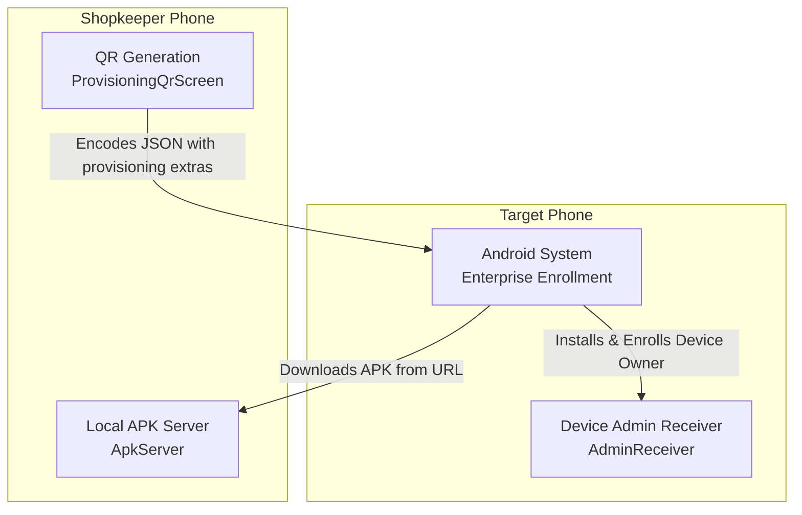
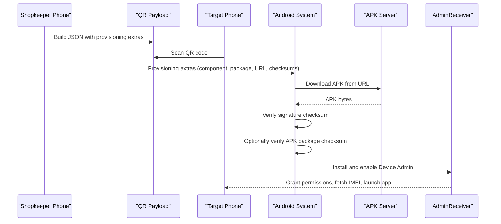
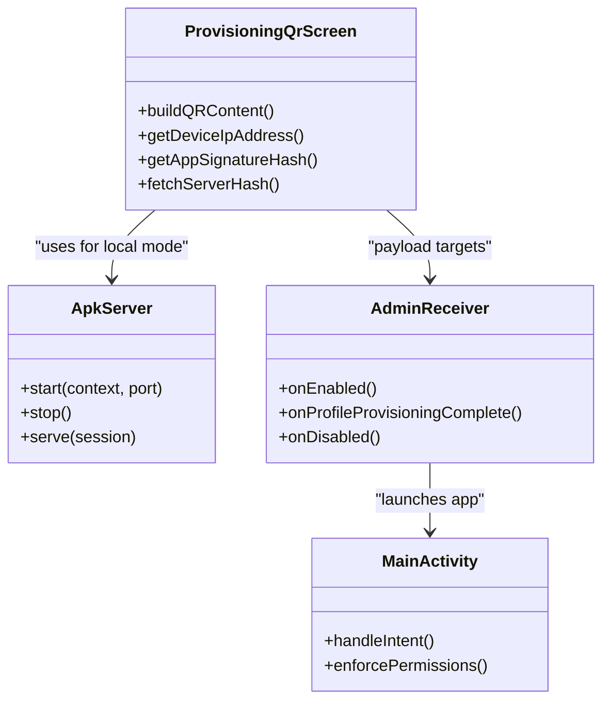

# QR Code Provisioning

<cite>
**Referenced Files in This Document**
- [ProvisioningQrScreen.kt](file://app/src/main/java/com/pksafe/lock/manager/ui/provisioning/ProvisioningQrScreen.kt)
- [ApkServer.kt](file://app/src/main/java/com/pksafe/lock/manager/util/ApkServer.kt)
- [AdminReceiver.kt](file://app/src/main/java/com/pksafe/lock/manager/receiver/AdminReceiver.kt)
- [NfcProvisioner.kt](file://app/src/main/java/com/pksafe/lock/manager/util/NfcProvisioner.kt)
- [device_admin_policies.xml](file://app/src/main/res/xml/device_admin_policies.xml)
- [MainActivity.kt](file://app/src/main/java/com/pksafe/lock/manager/MainActivity.kt)
</cite>

## Table of Contents
1. Introduction
2. Project Structure
3. Core Components
4. Architecture Overview
5. Detailed Component Analysis
6. Dependency Analysis
7. Performance Considerations
8. Troubleshooting Guide
9. Conclusion

## Introduction
This document explains PK Locker’s QR code provisioning system for Device Owner enrollment. It covers how the shopkeeper phone generates a QR code that encodes device administrator configuration, package download location, signature checksum, and APK hash verification. It also documents two deployment modes:
- Local server mode (phone-based): The shopkeeper’s phone hosts an HTTP server to serve the exact installed APK.
- Cloud mode (Vercel-based): A hosted URL serves the APK via Vercel.

The guide includes step-by-step setup workflow from factory reset through automatic Device Owner provisioning, technical details of QR content structure and Android provisioning extras, security measures like signature verification and APK integrity checks, and troubleshooting guidance for common issues.

## Project Structure
PK Locker implements QR-based Device Owner provisioning primarily within the provisioning UI and supporting utilities:
- QR generation and payload construction live in the provisioning screen.
- A lightweight local HTTP server serves the app’s own APK during local server mode.
- An NFC helper demonstrates the same provisioning extras used by Android’s enterprise enrollment flow.
- The device admin receiver finalizes provisioning and sets up permissions and customer state.
- Policies are declared in XML for device admin capabilities.
- Main activity orchestrates post-provisioning behavior and permission enforcement.

**Diagram sources**
- [ProvisioningQrScreen.kt:120-157](file://app/src/main/java/com/pksafe/lock/manager/ui/provisioning/ProvisioningQrScreen.kt#L120-L157)
- [ApkServer.kt:46-93](file://app/src/main/java/com/pksafe/lock/manager/util/ApkServer.kt#L46-L93)
- [AdminReceiver.kt:23-36](file://app/src/main/java/com/pksafe/lock/manager/receiver/AdminReceiver.kt#L23-L36)

**Section sources**
- [ProvisioningQrScreen.kt:120-157](file://app/src/main/java/com/pksafe/lock/manager/ui/provisioning/ProvisioningQrScreen.kt#L120-L157)
- [ApkServer.kt:46-93](file://app/src/main/java/com/pksafe/lock/manager/util/ApkServer.kt#L46-L93)
- [AdminReceiver.kt:23-36](file://app/src/main/java/com/pksafe/lock/manager/receiver/AdminReceiver.kt#L23-L36)
- [device_admin_policies.xml:1-13](file://app/src/main/res/xml/device_admin_policies.xml#L1-L13)

## Core Components
- QR Payload Builder: Constructs the JSON payload containing all required Android provisioning extras for Device Owner enrollment, including component name, package name, download URL, signature checksum, optional package checksum, and UX/system flags.
- Local APK Server: Serves the currently installed APK from the shopkeeper’s phone over HTTP so the target phone can download it during enrollment.
- Device Admin Receiver: Activated after successful enrollment to finalize setup, grant critical permissions as Device Owner, and launch the app in customer mode.
- NFC Provisioner: Demonstrates equivalent provisioning extras using NFC, useful for understanding the data model beyond QR.
- Device Admin Policies: Declares device admin capabilities available to the app.

Key responsibilities:
- QR content structure and safety checks (signature and APK hash).
- Seamless switching between local server and cloud modes.
- Post-enrollment automation (permissions, IMEI capture, app launch).

**Section sources**
- [ProvisioningQrScreen.kt:120-157](file://app/src/main/java/com/pksafe/lock/manager/ui/provisioning/ProvisioningQrScreen.kt#L120-L157)
- [ApkServer.kt:46-93](file://app/src/main/java/com/pksafe/lock/manager/util/ApkServer.kt#L46-L93)
- [AdminReceiver.kt:23-36](file://app/src/main/java/com/pksafe/lock/manager/receiver/AdminReceiver.kt#L23-L36)
- [NfcProvisioner.kt:22-49](file://app/src/main/java/com/pksafe/lock/manager/util/NfcProvisioner.kt#L22-L49)
- [device_admin_policies.xml:1-13](file://app/src/main/res/xml/device_admin_policies.xml#L1-L13)

## Architecture Overview
The provisioning flow uses Android’s enterprise enrollment mechanism triggered by scanning a QR code. The QR contains a JSON payload with provisioning extras. Android downloads the APK from the provided URL, verifies the signature checksum, optionally validates the APK package checksum, installs the app, and enrolls it as Device Owner. After enrollment, the device admin receiver runs to complete setup.

**Diagram sources**
- [ProvisioningQrScreen.kt:120-157](file://app/src/main/java/com/pksafe/lock/manager/ui/provisioning/ProvisioningQrScreen.kt#L120-L157)
- [ApkServer.kt:46-93](file://app/src/main/java/com/pksafe/lock/manager/util/ApkServer.kt#L46-L93)
- [AdminReceiver.kt:23-36](file://app/src/main/java/com/pksafe/lock/manager/receiver/AdminReceiver.kt#L23-L36)

## Detailed Component Analysis

### QR Content Structure and Payload
- Device Admin Component Name: Points to the app’s device admin receiver class.
- Device Admin Package Name: The app’s package identifier.
- Download Location: URL where the target phone will download the APK.
- Signature Checksum: Base64-encoded SHA-256 of the signing certificate; mandatory for QR-based Device Owner enrollment.
- Package Checksum: Optional SHA-256 of the APK file for additional integrity verification.
- System/UI Flags: Locale, time zone, encryption skip, mobile data allowance, and leaving system apps enabled.
- Admin Extras Bundle: Custom key-value pairs passed to the app after setup.

Implementation highlights:
- QR content is built as a JSON string containing all provisioning extras.
- Signature checksum is computed from the current app’s signing certificate.
- APK hash is fetched from the serving URL and included when available.

**Section sources**
- [ProvisioningQrScreen.kt:120-157](file://app/src/main/java/com/pksafe/lock/manager/ui/provisioning/ProvisioningQrScreen.kt#L120-L157)
- [ProvisioningQrScreen.kt:420-443](file://app/src/main/java/com/pksafe/lock/manager/ui/provisioning/ProvisioningQrScreen.kt#L420-L443)
- [ProvisioningQrScreen.kt:445-459](file://app/src/main/java/com/pksafe/lock/manager/ui/provisioning/ProvisioningQrScreen.kt#L445-L459)

### Local Server Mode (Phone-Based)
- Purpose: Serve the exact installed APK from the shopkeeper’s phone without external dependencies.
- Behavior: Starts a lightweight HTTP server on a configurable port, copies the current APK into a cache directory, and serves it at a known path.
- IP Detection: Detects the phone’s WiFi IP address to construct the download URL for the target phone.
- Status Feedback: Provides status messages indicating readiness or errors.

Operational notes:
- Requires the target phone to be on the same network (WiFi or hotspot) as the shopkeeper phone.
- If WiFi is not connected, the server cannot be reached by the target phone.

**Section sources**
- [ProvisioningQrScreen.kt:64-111](file://app/src/main/java/com/pksafe/lock/manager/ui/provisioning/ProvisioningQrScreen.kt#L64-L111)
- [ProvisioningQrScreen.kt:385-418](file://app/src/main/java/com/pksafe/lock/manager/ui/provisioning/ProvisioningQrScreen.kt#L385-L418)
- [ApkServer.kt:14-44](file://app/src/main/java/com/pksafe/lock/manager/util/ApkServer.kt#L14-L44)
- [ApkServer.kt:46-93](file://app/src/main/java/com/pksafe/lock/manager/util/ApkServer.kt#L46-L93)

### Cloud Mode (Vercel-Based)
- Purpose: Use a hosted URL to serve the APK, enabling remote provisioning without requiring the shopkeeper phone to host a server.
- Behavior: Uses a predefined Vercel URL for the APK download location. Computes and displays the APK hash from the hosted file.
- Advantages: Works across networks; no need for local WiFi connectivity between devices.

Considerations:
- Ensure the hosted APK matches the expected signature and version.
- Network availability on the target phone is required to download the APK.

**Section sources**
- [ProvisioningQrScreen.kt:54-111](file://app/src/main/java/com/pksafe/lock/manager/ui/provisioning/ProvisioningQrScreen.kt#L54-L111)

### Device Admin Receiver and Post-Provisioning Setup
- Activation: Triggered after successful Device Owner enrollment.
- Responsibilities:
  - Fetch IMEI and store provisioning state.
  - Grant critical permissions to itself as Device Owner.
  - Launch the app with provisioning mode extras to continue setup.

Security implications:
- Grants only necessary permissions programmatically as Device Owner.
- Ensures the app can operate securely even if user interactions are limited during initial setup.

**Section sources**
- [AdminReceiver.kt:23-36](file://app/src/main/java/com/pksafe/lock/manager/receiver/AdminReceiver.kt#L23-L36)
- [AdminReceiver.kt:43-102](file://app/src/main/java/com/pksafe/lock/manager/receiver/AdminReceiver.kt#L43-L102)

### NFC Provisioning Reference
- Demonstrates the same provisioning extras used by Android’s enterprise enrollment via NFC.
- Useful for understanding the data model and flags independent of QR.

**Section sources**
- [NfcProvisioner.kt:22-49](file://app/src/main/java/com/pksafe/lock/manager/util/NfcProvisioner.kt#L22-L49)

### Device Admin Policies
- Declares device admin capabilities such as force lock, password policies, wipe data, and others.
- These policies define what the app can enforce once activated as Device Admin.

**Section sources**
- [device_admin_policies.xml:1-13](file://app/src/main/res/xml/device_admin_policies.xml#L1-L13)

## Dependency Analysis
The QR provisioning system depends on:
- QR payload builder for constructing Android provisioning extras.
- Local server utility for serving the APK in phone-based mode.
- Device admin receiver for post-enrollment automation.
- Main activity for enforcing permissions and managing app state post-setup.

**Diagram sources**
- [ProvisioningQrScreen.kt:120-157](file://app/src/main/java/com/pksafe/lock/manager/ui/provisioning/ProvisioningQrScreen.kt#L120-L157)
- [ApkServer.kt:14-44](file://app/src/main/java/com/pksafe/lock/manager/util/ApkServer.kt#L14-L44)
- [AdminReceiver.kt:23-36](file://app/src/main/java/com/pksafe/lock/manager/receiver/AdminReceiver.kt#L23-L36)
- [MainActivity.kt:108-124](file://app/src/main/java/com/pksafe/lock/manager/MainActivity.kt#L108-L124)

**Section sources**
- [ProvisioningQrScreen.kt:120-157](file://app/src/main/java/com/pksafe/lock/manager/ui/provisioning/ProvisioningQrScreen.kt#L120-L157)
- [ApkServer.kt:14-44](file://app/src/main/java/com/pksafe/lock/manager/util/ApkServer.kt#L14-L44)
- [AdminReceiver.kt:23-36](file://app/src/main/java/com/pksafe/lock/manager/receiver/AdminReceiver.kt#L23-L36)
- [MainActivity.kt:108-124](file://app/src/main/java/com/pksafe/lock/manager/MainActivity.kt#L108-L124)

## Performance Considerations
- QR generation: Uses efficient bitmap creation; ensure sufficient memory on low-end devices.
- APK hashing: Streaming hash computation avoids loading entire APK into memory; keep network requests off the main thread.
- Local server: Lightweight HTTP server minimizes overhead; ensure port conflicts are handled gracefully.
- Network reliability: Prefer stable WiFi for local mode; cloud mode reduces dependency on local network but requires internet access.

[No sources needed since this section provides general guidance]

## Troubleshooting Guide

Common issues and resolutions:
- WiFi connectivity problems (local mode):
  - Ensure both phones are on the same WiFi or hotspot.
  - Confirm the shopkeeper phone has a valid IP address and the server is running.
  - Check firewall or network isolation settings that may block local traffic.

- QR scanning failures:
  - Verify the QR content is generated successfully and shows “Ready” status.
  - Ensure the target phone can reach the APK URL (same network for local mode; internet for cloud mode).
  - Confirm the signature checksum matches the app’s signing certificate.

- Device compatibility requirements:
  - Enterprise enrollment via QR requires supported Android versions and manufacturer implementations.
  - Some OEM skins may restrict QR scanning on the welcome screen; ensure the device allows scanning during setup.

- APK download or verification errors:
  - Validate the APK URL returns the correct file and MIME type.
  - Ensure the APK signature matches the expected certificate; mismatched signatures will fail enrollment.
  - For cloud mode, confirm the hosted APK is updated and accessible.

- Post-enrollment issues:
  - If the app does not launch after enrollment, check the device admin receiver logs and ensure permissions were granted.
  - Verify that the app’s overlay and accessibility permissions are granted if required by your workflow.

**Section sources**
- [ProvisioningQrScreen.kt:64-111](file://app/src/main/java/com/pksafe/lock/manager/ui/provisioning/ProvisioningQrScreen.kt#L64-L111)
- [ProvisioningQrScreen.kt:385-418](file://app/src/main/java/com/pksafe/lock/manager/ui/provisioning/ProvisioningQrScreen.kt#L385-L418)
- [ApkServer.kt:46-93](file://app/src/main/java/com/pksafe/lock/manager/util/ApkServer.kt#L46-L93)
- [AdminReceiver.kt:43-102](file://app/src/main/java/com/pksafe/lock/manager/receiver/AdminReceiver.kt#L43-L102)

## Step-by-Step Setup Workflow
Follow these steps to provision a new device as Device Owner using QR scanning:

1. Factory Reset the target phone to the Welcome screen.
2. Activate the QR scanner on the Welcome screen (typically by tapping multiple times).
3. Connect the target phone to the same WiFi network as the shopkeeper phone (for local mode) or ensure internet access (for cloud mode).
4. On the shopkeeper phone, open the QR provisioning screen and choose:
   - Local server mode: Start the phone-based server and confirm “Ready” status.
   - Cloud mode: Confirm the hosted URL and “Ready” status.
5. Scan the displayed QR code on the target phone.
6. Allow the system to download and install the app, then enroll as Device Owner.
7. After enrollment completes, the app launches automatically and continues setup (permissions, IMEI capture, etc.).

Notes:
- Local mode requires both devices on the same network.
- Cloud mode requires internet access on the target phone.
- Signature checksum must match the app’s signing certificate; otherwise, enrollment fails.

**Section sources**
- [ProvisioningQrScreen.kt:64-111](file://app/src/main/java/com/pksafe/lock/manager/ui/provisioning/ProvisioningQrScreen.kt#L64-L111)
- [ProvisioningQrScreen.kt:326-348](file://app/src/main/java/com/pksafe/lock/manager/ui/provisioning/ProvisioningQrScreen.kt#L326-L348)
- [AdminReceiver.kt:23-36](file://app/src/main/java/com/pksafe/lock/manager/receiver/AdminReceiver.kt#L23-L36)

## Security Measures
- Signature Checksum: Mandatory field ensures the enrolled app matches the expected signing certificate.
- APK Package Checksum: Optional field adds integrity verification for the downloaded APK.
- Secure Permissions: As Device Owner, the app grants only necessary permissions programmatically.
- Policy Enforcement: Device admin policies define restrictions and controls enforced post-enrollment.

**Section sources**
- [ProvisioningQrScreen.kt:120-157](file://app/src/main/java/com/pksafe/lock/manager/ui/provisioning/ProvisioningQrScreen.kt#L120-L157)
- [AdminReceiver.kt:43-102](file://app/src/main/java/com/pksafe/lock/manager/receiver/AdminReceiver.kt#L43-L102)
- [device_admin_policies.xml:1-13](file://app/src/main/res/xml/device_admin_policies.xml#L1-L13)

## Conclusion
PK Locker’s QR code provisioning system enables secure, automated Device Owner enrollment with robust security checks and flexible deployment options. Local server mode offers offline-friendly provisioning on shared networks, while cloud mode simplifies remote deployments. By encoding essential provisioning extras, validating signatures and APK integrity, and automating post-enrollment setup, the system provides a reliable pathway to fully managed devices suitable for EMI protection and enterprise-grade control.

[No sources needed since this section summarizes without analyzing specific files]