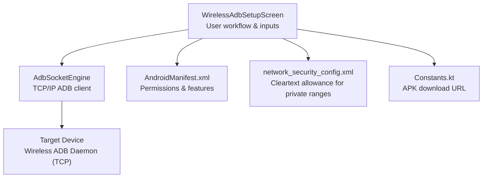
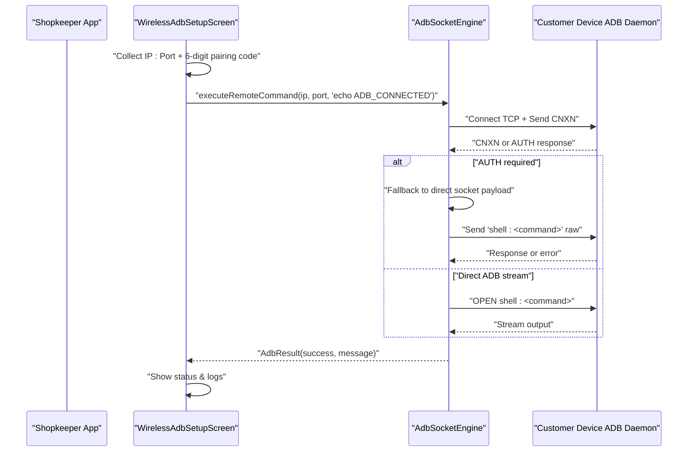
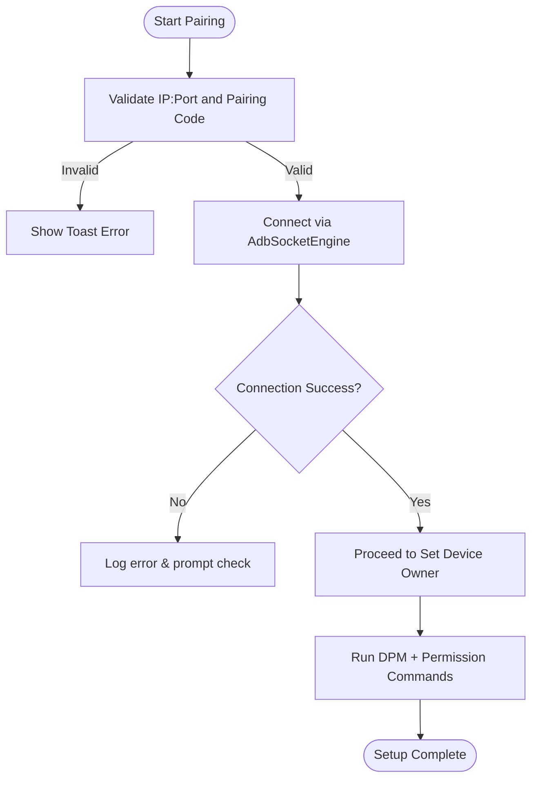
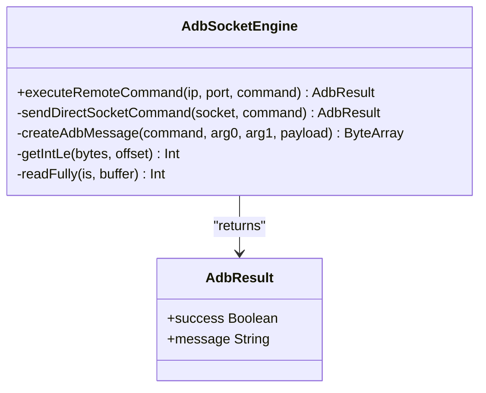
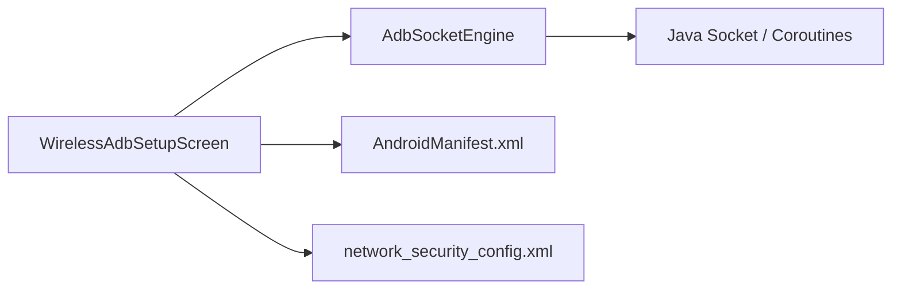

# Wireless ADB Configuration

<cite>
**Referenced Files in This Document**
- [AdbSocketEngine.kt](file://app/src/main/java/com/pksafe/lock/manager/util/AdbSocketEngine.kt)
- [WirelessAdbSetupScreen.kt](file://app/src/main/java/com/pksafe/lock/manager/ui/provisioning/WirelessAdbSetupScreen.kt)
- [UsbAdbEngine.kt](file://app/src/main/java/com/pksafe/lock/manager/util/UsbAdbEngine.kt)
- [Constants.kt](file://app/src/main/java/com/pksafe/lock/manager/util/Constants.kt)
- [network_security_config.xml](file://app/src/main/res/xml/network_security_config.xml)
- [AndroidManifest.xml](file://app/src/main/AndroidManifest.xml)
</cite>

## Table of Contents
1. [Introduction](#introduction)
2. [Project Structure](#project-structure)
3. [Core Components](#core-components)
4. [Architecture Overview](#architecture-overview)
5. [Detailed Component Analysis](#detailed-component-analysis)
6. [Dependency Analysis](#dependency-analysis)
7. [Performance Considerations](#performance-considerations)
8. [Troubleshooting Guide](#troubleshooting-guide)
9. [Conclusion](#conclusion)
10. [Appendices](#appendices)

## Introduction
This document explains PK Locker’s wireless ADB setup for remote device management without a physical USB connection. It covers how to enable wireless debugging on the target device, establish a secure TCP/IP connection from the shopkeeper device to the customer device, and execute provisioning commands remotely. It also details the AdbSocketEngine implementation that handles network communication, connection establishment, command execution over IP networks, and fallback behaviors when authentication or pairing is required. Finally, it provides configuration examples for LAN, WiFi hotspot, and internet-based connections, along with troubleshooting guidance for firewall restrictions, connectivity issues, and device compatibility.

## Project Structure
The wireless ADB feature spans UI, networking, and system integration layers:
- UI layer guides users through enabling developer options, turning on wireless debugging, pairing via a 6-digit code, and executing device owner setup.
- Networking layer implements a pure Kotlin ADB socket client to connect to the Android wireless ADB daemon over TCP and run shell commands.
- Security and permissions are configured via manifest and network security settings to allow local cleartext traffic where needed.

**Diagram sources**
- [WirelessAdbSetupScreen.kt:52-556](file://app/src/main/java/com/pksafe/lock/manager/ui/provisioning/WirelessAdbSetupScreen.kt#L52-L556)
- [AdbSocketEngine.kt:18-164](file://app/src/main/java/com/pksafe/lock/manager/util/AdbSocketEngine.kt#L18-L164)
- [AndroidManifest.xml:1-160](file://app/src/main/AndroidManifest.xml#L1-L160)
- [network_security_config.xml:1-28](file://app/src/main/res/xml/network_security_config.xml#L1-L28)
- [Constants.kt:1-10](file://app/src/main/java/com/pksafe/lock/manager/util/Constants.kt#L1-L10)

**Section sources**
- [WirelessAdbSetupScreen.kt:52-556](file://app/src/main/java/com/pksafe/lock/manager/ui/provisioning/WirelessAdbSetupScreen.kt#L52-L556)
- [AdbSocketEngine.kt:18-164](file://app/src/main/java/com/pksafe/lock/manager/util/AdbSocketEngine.kt#L18-L164)
- [AndroidManifest.xml:1-160](file://app/src/main/AndroidManifest.xml#L1-L160)
- [network_security_config.xml:1-28](file://app/src/main/res/xml/network_security_config.xml#L1-L28)
- [Constants.kt:1-10](file://app/src/main/java/com/pksafe/lock/manager/util/Constants.kt#L1-L10)

## Core Components
- WirelessAdbSetupScreen: Orchestrates the user workflow to install the APK, enable developer options, turn on wireless debugging, pair using a 6-digit code, and set device owner plus auto-grant critical permissions.
- AdbSocketEngine: Implements a minimal ADB client over TCP/IP to connect to the target device’s wireless ADB daemon, send CNXN/OPEN messages, handle AUTH responses, and execute shell commands with fallbacks.
- UsbAdbEngine: Provides a USB-host ADB engine used by other flows; included here for context on ADB protocol handling and RSA key exchange during USB provisioning.
- Constants: Holds URLs for APK downloads and server endpoints used in QR-based provisioning flows.
- Network security config and manifest: Configure permissions and allow cleartext traffic for private IP ranges used in local device-to-device communication.

**Section sources**
- [WirelessAdbSetupScreen.kt:52-556](file://app/src/main/java/com/pksafe/lock/manager/ui/provisioning/WirelessAdbSetupScreen.kt#L52-L556)
- [AdbSocketEngine.kt:18-164](file://app/src/main/java/com/pksafe/lock/manager/util/AdbSocketEngine.kt#L18-L164)
- [UsbAdbEngine.kt:13-354](file://app/src/main/java/com/pksafe/lock/manager/util/UsbAdbEngine.kt#L13-L354)
- [Constants.kt:1-10](file://app/src/main/java/com/pksafe/lock/manager/util/Constants.kt#L1-L10)
- [AndroidManifest.xml:1-160](file://app/src/main/AndroidManifest.xml#L1-L160)
- [network_security_config.xml:1-28](file://app/src/main/res/xml/network_security_config.xml#L1-L28)

## Architecture Overview
The wireless ADB flow connects the shopkeeper device to the customer device over TCP/IP using Android’s built-in wireless debugging. The UI collects the target IP and port and a 6-digit pairing code, then uses AdbSocketEngine to establish a connection and run provisioning commands. If the target requires pairing/authentication, the engine falls back to direct socket payload transmission.

**Diagram sources**
- [WirelessAdbSetupScreen.kt:226-263](file://app/src/main/java/com/pksafe/lock/manager/ui/provisioning/WirelessAdbSetupScreen.kt#L226-L263)
- [AdbSocketEngine.kt:25-96](file://app/src/main/java/com/pksafe/lock/manager/util/AdbSocketEngine.kt#L25-L96)

## Detailed Component Analysis

### WirelessAdbSetupScreen
Responsibilities:
- Guides users through steps: install APK via QR, enable Developer Options, enable Wireless Debugging, enter IP:Port and pairing code, pair/connect, and set device owner with auto-permissions.
- Parses IP and port from user input, defaults to loopback and standard ADB port if not provided.
- Uses AdbSocketEngine to test connectivity and execute provisioning commands.

Key behaviors:
- Validates inputs (IP:Port format and 6-digit pairing code).
- Executes a test command to verify connection before proceeding.
- Runs a sequence of device owner and permission commands after successful connection.

**Diagram sources**
- [WirelessAdbSetupScreen.kt:226-263](file://app/src/main/java/com/pksafe/lock/manager/ui/provisioning/WirelessAdbSetupScreen.kt#L226-L263)
- [WirelessAdbSetupScreen.kt:320-367](file://app/src/main/java/com/pksafe/lock/manager/ui/provisioning/WirelessAdbSetupScreen.kt#L320-L367)

**Section sources**
- [WirelessAdbSetupScreen.kt:52-556](file://app/src/main/java/com/pksafe/lock/manager/ui/provisioning/WirelessAdbSetupScreen.kt#L52-L556)

### AdbSocketEngine
Responsibilities:
- Establishes TCP connection to the target device’s wireless ADB daemon.
- Sends ADB CNXN handshake, reads headers, and handles AUTH responses.
- Opens a shell stream to execute commands and parses success indicators.
- Implements fallback to direct socket payload when ADB auth/pairing is required or when initial stream fails.
- Retries on non-standard ports by falling back to default ADB port.

Implementation highlights:
- Uses low-level socket I/O and constructs ADB messages with correct checksums and little-endian encoding.
- Detects AUTH requirement and switches to direct payload mode.
- Returns structured results indicating success and messages.

**Diagram sources**
- [AdbSocketEngine.kt:18-164](file://app/src/main/java/com/pksafe/lock/manager/util/AdbSocketEngine.kt#L18-L164)

**Section sources**
- [AdbSocketEngine.kt:18-164](file://app/src/main/java/com/pksafe/lock/manager/util/AdbSocketEngine.kt#L18-L164)

### UsbAdbEngine (Contextual Reference)
While not used for wireless ADB, this component demonstrates full ADB protocol handling over USB host, including RSA key generation, token signing, and device owner setup. It helps understand the broader ADB ecosystem and authentication mechanisms relevant to wireless flows.

**Section sources**
- [UsbAdbEngine.kt:13-354](file://app/src/main/java/com/pksafe/lock/manager/util/UsbAdbEngine.kt#L13-L354)

## Dependency Analysis
- WirelessAdbSetupScreen depends on AdbSocketEngine for networked command execution and on system services for clipboard and Wi-Fi IP detection.
- AdbSocketEngine relies on Java networking primitives and coroutine IO dispatchers for asynchronous operations.
- Network security configuration allows cleartext HTTP within private IP ranges, which may be relevant for local device-to-device scenarios.
- Manifest declares necessary permissions and features, including USB host capability and various runtime permissions.

**Diagram sources**
- [WirelessAdbSetupScreen.kt:52-556](file://app/src/main/java/com/pksafe/lock/manager/ui/provisioning/WirelessAdbSetupScreen.kt#L52-L556)
- [AdbSocketEngine.kt:18-164](file://app/src/main/java/com/pksafe/lock/manager/util/AdbSocketEngine.kt#L18-L164)
- [AndroidManifest.xml:1-160](file://app/src/main/AndroidManifest.xml#L1-L160)
- [network_security_config.xml:1-28](file://app/src/main/res/xml/network_security_config.xml#L1-L28)

**Section sources**
- [WirelessAdbSetupScreen.kt:52-556](file://app/src/main/java/com/pksafe/lock/manager/ui/provisioning/WirelessAdbSetupScreen.kt#L52-L556)
- [AdbSocketEngine.kt:18-164](file://app/src/main/java/com/pksafe/lock/manager/util/AdbSocketEngine.kt#L18-L164)
- [AndroidManifest.xml:1-160](file://app/src/main/AndroidManifest.xml#L1-L160)
- [network_security_config.xml:1-28](file://app/src/main/res/xml/network_security_config.xml#L1-L28)

## Performance Considerations
- Timeouts: Default timeouts are applied to socket connections and reads to avoid blocking indefinitely.
- Fallback logic: When ADB authentication is required or initial stream fails, the engine retries via direct socket payload and/or alternative ports to improve robustness.
- Command batching: The UI executes multiple commands sequentially; consider batching or parallelizing where safe to reduce total setup time.
- Logging: Extensive logging aids diagnostics but should be minimized in production to reduce overhead.

[No sources needed since this section provides general guidance]

## Troubleshooting Guide
Common issues and resolutions:
- Firewall restrictions: Ensure inbound TCP access to the target device’s wireless ADB port is allowed on both devices’ firewalls. Private ranges are permitted for cleartext per network security config.
- Connectivity problems: Verify both devices are on the same subnet or that routing/NAT allows direct TCP between them. Confirm the target IP and port are correct.
- Authentication/pairing: If the target requires pairing, use the 6-digit pairing code flow and ensure the pairing dialog remains open while entering the code. The engine will fall back to direct socket payload when needed.
- Port mismatch: If the specified port fails, the engine attempts fallback to the default ADB port.
- Device compatibility: Wireless debugging availability varies by Android version and OEM skin. Ensure Developer Options and Wireless Debugging are enabled on the target device.

Configuration examples:
- LAN: Both devices connected to the same router; use the customer device’s local IP and the port shown under Wireless Debugging.
- WiFi hotspot: Use the hotspot-provided IP range; ensure devices can communicate across the hotspot’s isolation policies.
- Internet-based: Requires port forwarding or NAT traversal; ensure firewall rules permit inbound TCP to the target’s ADB port and that the public IP/port are reachable.

**Section sources**
- [AdbSocketEngine.kt:25-96](file://app/src/main/java/com/pksafe/lock/manager/util/AdbSocketEngine.kt#L25-L96)
- [WirelessAdbSetupScreen.kt:226-263](file://app/src/main/java/com/pksafe/lock/manager/ui/provisioning/WirelessAdbSetupScreen.kt#L226-L263)
- [network_security_config.xml:1-28](file://app/src/main/res/xml/network_security_config.xml#L1-L28)

## Conclusion
PK Locker’s wireless ADB setup enables remote provisioning and management of customer devices without physical USB cables. The WirelessAdbSetupScreen guides users through enabling wireless debugging and pairing, while AdbSocketEngine handles TCP/IP communication, ADB handshake, and command execution with robust fallbacks. Proper network configuration and troubleshooting steps ensure reliable operation across LAN, hotspot, and internet topologies.

[No sources needed since this section summarizes without analyzing specific files]

## Appendices
- Permissions and features declared in the manifest support remote control and background services.
- Constants provide the APK download URL used in QR-based provisioning flows.

**Section sources**
- [AndroidManifest.xml:1-160](file://app/src/main/AndroidManifest.xml#L1-L160)
- [Constants.kt:1-10](file://app/src/main/java/com/pksafe/lock/manager/util/Constants.kt#L1-L10)