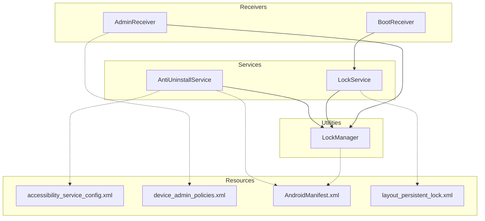
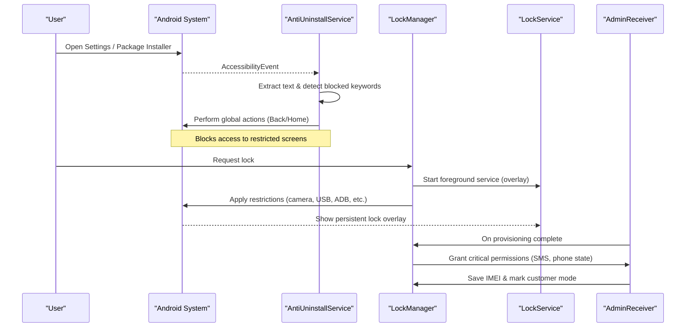
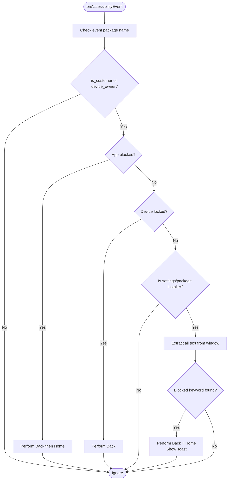
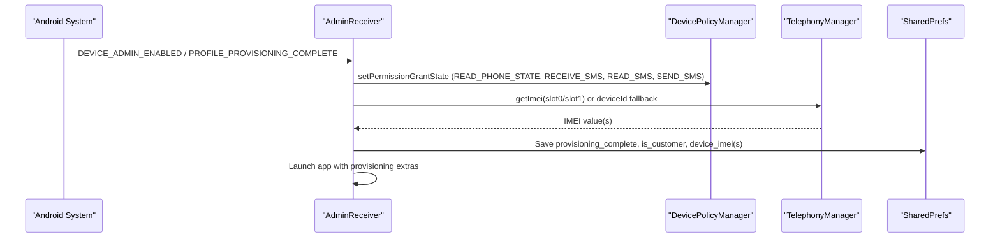
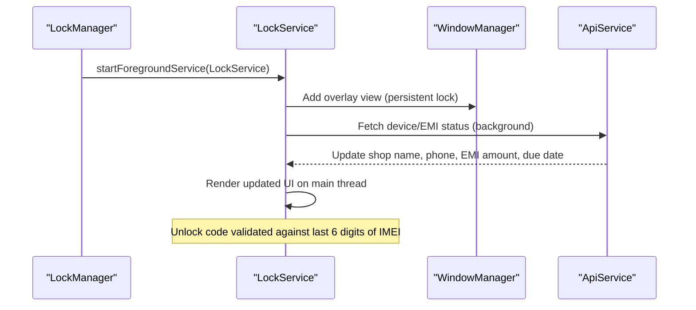
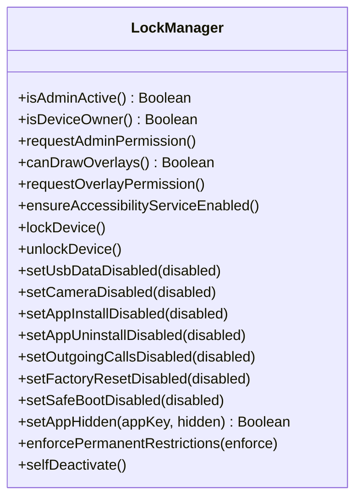
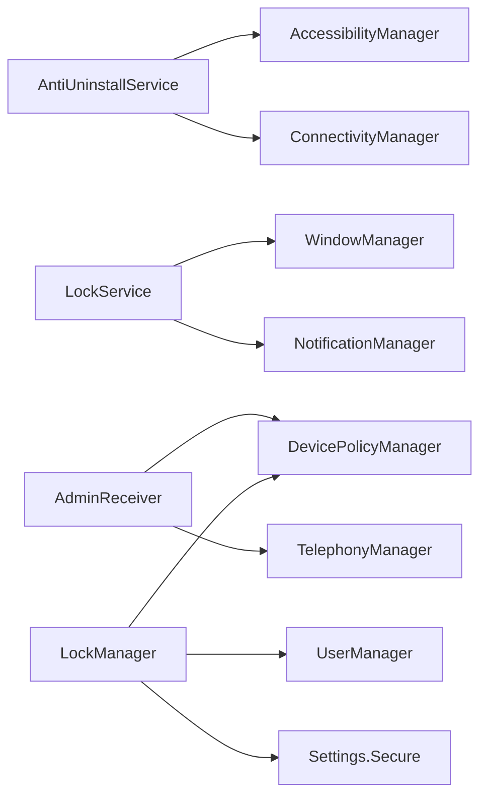

# Anti-Tampering Protection

<cite>
**Referenced Files in This Document**
- [AntiUninstallService.kt](file://app/src/main/java/com/pksafe/lock/manager/service/AntiUninstallService.kt)
- [AdminReceiver.kt](file://app/src/main/java/com/pksafe/lock/manager/receiver/AdminReceiver.kt)
- [LockService.kt](file://app/src/main/java/com/pksafe/lock/manager/service/LockService.kt)
- [LockManager.kt](file://app/src/main/java/com/pksafe/lock/manager/util/LockManager.kt)
- [BootReceiver.kt](file://app/src/main/java/com/pksafe/lock/manager/receiver/BootReceiver.kt)
- [accessibility_service_config.xml](file://app/src/main/res/xml/accessibility_service_config.xml)
- [device_admin_policies.xml](file://app/src/main/res/xml/device_admin_policies.xml)
- [AndroidManifest.xml](file://app/src/main/AndroidManifest.xml)
- [layout_persistent_lock.xml](file://app/src/main/res/layout/layout_persistent_lock.xml)
</cite>

## Table of Contents
1. [Introduction](#introduction)
2. [Project Structure](#project-structure)
3. [Core Components](#core-components)
4. [Architecture Overview](#architecture-overview)
5. [Detailed Component Analysis](#detailed-component-analysis)
6. [Dependency Analysis](#dependency-analysis)
7. [Performance Considerations](#performance-considerations)
8. [Troubleshooting Guide](#troubleshooting-guide)
9. [Conclusion](#conclusion)

## Introduction
This document explains PK Locker’s anti-tampering protection mechanisms that prevent unauthorized removal or modification of the application and enforce persistent device locking. It covers:
- Accessibility-based tamper detection and prevention via AntiUninstallService
- Device Administrator integration through AdminReceiver for policy enforcement
- Persistent overlay lock screen via LockService to maintain a locked interface
- Fallback protections when Device Owner privileges are unavailable
- Self-deactivation flow to safely remove administrative privileges when authorized by shopkeepers
- Examples of tamper detection scenarios, activation flows, and recovery mechanisms

## Project Structure
PK Locker organizes anti-tampering logic across services, receivers, utilities, and configuration resources:
- Services: AntiUninstallService (accessibility guard), LockService (persistent overlay lock)
- Receivers: AdminReceiver (device admin lifecycle), BootReceiver (restart protection)
- Utilities: LockManager (policy enforcement, restrictions, self-deactivation)
- Resources: accessibility_service_config.xml, device_admin_policies.xml, AndroidManifest.xml, layout_persistent_lock.xml

**Diagram sources**
- [AntiUninstallService.kt:22-224](file://app/src/main/java/com/pksafe/lock/manager/service/AntiUninstallService.kt#L22-L224)
- [LockService.kt:41-330](file://app/src/main/java/com/pksafe/lock/manager/service/LockService.kt#L41-L330)
- [AdminReceiver.kt:14-104](file://app/src/main/java/com/pksafe/lock/manager/receiver/AdminReceiver.kt#L14-L104)
- [BootReceiver.kt:10-27](file://app/src/main/java/com/pksafe/lock/manager/receiver/BootReceiver.kt#L10-L27)
- [LockManager.kt:27-406](file://app/src/main/java/com/pksafe/lock/manager/util/LockManager.kt#L27-L406)
- [accessibility_service_config.xml:1-8](file://app/src/main/res/xml/accessibility_service_config.xml#L1-L8)
- [device_admin_policies.xml:1-13](file://app/src/main/res/xml/device_admin_policies.xml#L1-L13)
- [AndroidManifest.xml:73-112](file://app/src/main/AndroidManifest.xml#L73-L112)
- [layout_persistent_lock.xml:1-234](file://app/src/main/res/layout/layout_persistent_lock.xml#L1-L234)

**Section sources**
- [AndroidManifest.xml:73-112](file://app/src/main/AndroidManifest.xml#L73-L112)

## Core Components
- AntiUninstallService: An AccessibilityService that monitors system UI events and blocks attempts to uninstall, disable, or modify PK Locker settings. It also enforces app blocking and full-device lock states.
- AdminReceiver: Handles device administrator lifecycle events, grants critical permissions when device owner is active, and captures IMEI for secure identification.
- LockService: Runs as a foreground service and displays a persistent overlay lock screen with dynamic data and unlock code entry. It applies hardware restrictions via LockManager.
- LockManager: Central orchestrator for device policies, user restrictions, overlay permission requests, and self-deactivation. Provides methods to lock/unlock devices and enforce permanent restrictions.
- BootReceiver: Ensures the lock overlay restarts after reboot if admin privileges and overlay permissions are available.

**Section sources**
- [AntiUninstallService.kt:22-224](file://app/src/main/java/com/pksafe/lock/manager/service/AntiUninstallService.kt#L22-L224)
- [AdminReceiver.kt:14-104](file://app/src/main/java/com/pksafe/lock/manager/receiver/AdminReceiver.kt#L14-L104)
- [LockService.kt:41-330](file://app/src/main/java/com/pksafe/lock/manager/service/LockService.kt#L41-L330)
- [LockManager.kt:27-406](file://app/src/main/java/com/pksafe/lock/manager/util/LockManager.kt#L27-L406)
- [BootReceiver.kt:10-27](file://app/src/main/java/com/pksafe/lock/manager/receiver/BootReceiver.kt#L10-L27)

## Architecture Overview
PK Locker uses a layered defense strategy:
- Device Owner/Admin layer: Enforces strong restrictions (factory reset, USB, ADB, safe boot, camera, status bar) and enables enterprise features like setting accessibility services.
- Accessibility layer: Monitors UI interactions and prevents navigation into restricted areas (settings, package installer).
- Overlay layer: Maintains a persistent lock screen that cannot be bypassed easily and requires an unlock code tied to device identity.
- Persistence layer: Restarts protection on boot and reacts to connectivity changes to auto-lock when offline.

**Diagram sources**
- [AntiUninstallService.kt:136-211](file://app/src/main/java/com/pksafe/lock/manager/service/AntiUninstallService.kt#L136-L211)
- [LockManager.kt:111-148](file://app/src/main/java/com/pksafe/lock/manager/util/LockManager.kt#L111-L148)
- [LockService.kt:50-80](file://app/src/main/java/com/pksafe/lock/manager/service/LockService.kt#L50-L80)
- [AdminReceiver.kt:23-36](file://app/src/main/java/com/pksafe/lock/manager/receiver/AdminReceiver.kt#L23-L36)
- [AdminReceiver.kt:43-102](file://app/src/main/java/com/pksafe/lock/manager/receiver/AdminReceiver.kt#L43-L102)

## Detailed Component Analysis

### AntiUninstallService (Accessibility Guard)
Responsibilities:
- Detects attempts to navigate to settings or package installer and blocks them using global back/home actions.
- Scans visible screen content for blocked keywords related to uninstallation or security modifications.
- Enforces app-level blocking based on configured keys and known package mappings.
- Honors full-device lock state to prevent leaving the locked interface except for dialer/telecom.
- Registers a connectivity receiver to trigger auto-lock when internet disconnects (customer mode only).

Key behaviors:
- Keyword filtering includes terms like “uninstall,” “device admin,” “accessibility,” “developer options,” and more.
- Dynamic app blocking supports multiple packages per category (e.g., messaging apps).
- Checks whether the accessibility service itself is enabled; provides a helper method for runtime checks.

**Diagram sources**
- [AntiUninstallService.kt:136-211](file://app/src/main/java/com/pksafe/lock/manager/service/AntiUninstallService.kt#L136-L211)
- [AntiUninstallService.kt:26-48](file://app/src/main/java/com/pksafe/lock/manager/service/AntiUninstallService.kt#L26-L48)

**Section sources**
- [AntiUninstallService.kt:22-224](file://app/src/main/java/com/pksafe/lock/manager/service/AntiUninstallService.kt#L22-L224)
- [accessibility_service_config.xml:1-8](file://app/src/main/res/xml/accessibility_service_config.xml#L1-L8)

### AdminReceiver (Device Administrator Integration)
Responsibilities:
- Responds to device admin enable/disable and profile provisioning completion.
- Grants critical permissions (phone state, SMS) to the app when it becomes device owner.
- Captures device IMEI(s) and marks provisioning complete and customer mode.

Protection aspects:
- Ensures essential permissions are granted automatically upon provisioning.
- Triggers app launch post-provisioning to finalize setup.

**Diagram sources**
- [AdminReceiver.kt:16-36](file://app/src/main/java/com/pksafe/lock/manager/receiver/AdminReceiver.kt#L16-L36)
- [AdminReceiver.kt:43-102](file://app/src/main/java/com/pksafe/lock/manager/receiver/AdminReceiver.kt#L43-L102)

**Section sources**
- [AdminReceiver.kt:14-104](file://app/src/main/java/com/pksafe/lock/manager/receiver/AdminReceiver.kt#L14-L104)
- [device_admin_policies.xml:1-13](file://app/src/main/res/xml/device_admin_policies.xml#L1-L13)

### LockService (Persistent Lock Overlay)
Responsibilities:
- Starts as a foreground service with a high-priority notification.
- Displays a persistent overlay view that blocks navigation and input to other apps.
- Supports hidden unlock code entry validated against a dynamic master code derived from device IMEI.
- Refreshes lock overlay data from server to show current EMI details and shop information.

Protection aspects:
- Uses overlay flags to stay on top and handle key events to block back/home/app switch/menu.
- Auto-locks on connectivity loss when auto-lock is enabled.

**Diagram sources**
- [LockService.kt:50-80](file://app/src/main/java/com/pksafe/lock/manager/service/LockService.kt#L50-L80)
- [LockService.kt:125-234](file://app/src/main/java/com/pksafe/lock/manager/service/LockService.kt#L125-L234)
- [LockService.kt:240-314](file://app/src/main/java/com/pksafe/lock/manager/service/LockService.kt#L240-L314)

**Section sources**
- [LockService.kt:41-330](file://app/src/main/java/com/pksafe/lock/manager/service/LockService.kt#L41-L330)
- [layout_persistent_lock.xml:1-234](file://app/src/main/res/layout/layout_persistent_lock.xml#L1-L234)

### LockManager (Policy Enforcement and Self-Deactivation)
Responsibilities:
- Requests device admin and overlay permissions.
- Enables accessibility service via Device Owner APIs and falls back to direct settings writes.
- Applies hard restrictions (camera, USB file transfer, factory reset, safe boot, ADB, status bar, keyguard).
- Provides individual controls for app hiding/install/uninstall/calls/factory reset/safe boot.
- Implements self-deactivation to clear all restrictions and remove device admin/owner privileges.

Protection aspects:
- Enforces permanent restrictions even when unlocked to prevent easy bypass.
- Coordinates overlay and policy enforcement to ensure consistent lock state.

**Diagram sources**
- [LockManager.kt:27-406](file://app/src/main/java/com/pksafe/lock/manager/util/LockManager.kt#L27-L406)

**Section sources**
- [LockManager.kt:27-406](file://app/src/main/java/com/pksafe/lock/manager/util/LockManager.kt#L27-L406)

### BootReceiver (Restart Protection)
Responsibilities:
- Listens for BOOT_COMPLETED and restarts the lock overlay if device admin is active and overlay permission is granted.

Protection aspects:
- Ensures protection persists across reboots.

**Section sources**
- [BootReceiver.kt:10-27](file://app/src/main/java/com/pksafe/lock/manager/receiver/BootReceiver.kt#L10-L27)

## Dependency Analysis
PK Locker’s anti-tampering stack depends on Android platform APIs and internal components:
- AntiUninstallService depends on AccessibilityService and ConnectivityManager to monitor and react to system events.
- LockService depends on WindowManager for overlay rendering and NotificationManager for foreground persistence.
- AdminReceiver depends on DevicePolicyManager and TelephonyManager to manage policies and capture device identifiers.
- LockManager coordinates DevicePolicyManager, UserManager, and Settings APIs to apply restrictions and enable services.

**Diagram sources**
- [AntiUninstallService.kt:112-117](file://app/src/main/java/com/pksafe/lock/manager/service/AntiUninstallService.kt#L112-L117)
- [LockService.kt:107-123](file://app/src/main/java/com/pksafe/lock/manager/service/LockService.kt#L107-L123)
- [AdminReceiver.kt:43-102](file://app/src/main/java/com/pksafe/lock/manager/receiver/AdminReceiver.kt#L43-L102)
- [LockManager.kt:81-108](file://app/src/main/java/com/pksafe/lock/manager/util/LockManager.kt#L81-L108)
- [LockManager.kt:151-200](file://app/src/main/java/com/pksafe/lock/manager/util/LockManager.kt#L151-L200)

**Section sources**
- [AndroidManifest.xml:73-112](file://app/src/main/AndroidManifest.xml#L73-L112)

## Performance Considerations
- Accessibility scanning: Recursive text extraction can be CPU-intensive; ensure efficient traversal and avoid excessive allocations. The implementation recycles nodes and catches exceptions to minimize overhead.
- Foreground service: LockService runs persistently; ensure notifications are minimal and background tasks (network calls) use coroutines to avoid blocking the main thread.
- Policy enforcement: Applying many user restrictions may have performance implications on some OEM skins; batch operations where possible and log failures gracefully.
- Connectivity monitoring: Registering receivers for connectivity changes should be done carefully to avoid unnecessary wakeups; consider batching checks.

[No sources needed since this section provides general guidance]

## Troubleshooting Guide
Common issues and resolutions:
- Accessibility service not starting:
  - Ensure device owner privileges are active and use DevicePolicyManager.setSecureSetting to enable the service reliably on modern Android versions.
  - Verify accessibility config XML is correctly referenced in the manifest.
- Overlay not appearing:
  - Confirm overlay permission is granted and the service starts in foreground mode.
  - Check that the device is not an admin/shopkeeper device (LockService stops immediately for admin devices).
- Device admin not activating:
  - Validate device_admin_policies.xml is included and the receiver handles provisioning completion.
  - Ensure required permissions are granted during provisioning.
- Uninstall attempts still succeed:
  - Confirm device owner restrictions (DISALLOW_UNINSTALL_APPS) are applied and accessibility guard is active.
  - Check that blocked keywords and settings interception are functioning.
- Self-deactivation fails:
  - Ensure all user restrictions are cleared before removing device owner and admin roles.
  - Verify shared preferences flags are reset to release customer mode.

**Section sources**
- [LockManager.kt:81-108](file://app/src/main/java/com/pksafe/lock/manager/util/LockManager.kt#L81-L108)
- [LockManager.kt:351-404](file://app/src/main/java/com/pksafe/lock/manager/util/LockManager.kt#L351-L404)
- [AntiUninstallService.kt:26-79](file://app/src/main/java/com/pksafe/lock/manager/service/AntiUninstallService.kt#L26-L79)
- [AdminReceiver.kt:23-36](file://app/src/main/java/com/pksafe/lock/manager/receiver/AdminReceiver.kt#L23-L36)
- [LockService.kt:54-80](file://app/src/main/java/com/pksafe/lock/manager/service/LockService.kt#L54-L80)

## Conclusion
PK Locker implements a robust, multi-layered anti-tampering system combining device administration, accessibility monitoring, and persistent overlays to protect against unauthorized uninstallation and modification. The design ensures:
- Strong policy enforcement when device owner privileges are available
- Fallback protections via accessibility services when device owner is not present
- Persistent lock screens that resist navigation and require secure unlock codes
- Safe self-deactivation to restore normal device operation under authorized control

These mechanisms collectively provide resilient protection suitable for commercial deployments where device integrity and compliance are critical.

[No sources needed since this section summarizes without analyzing specific files]