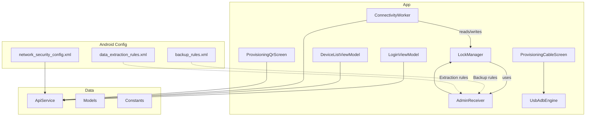
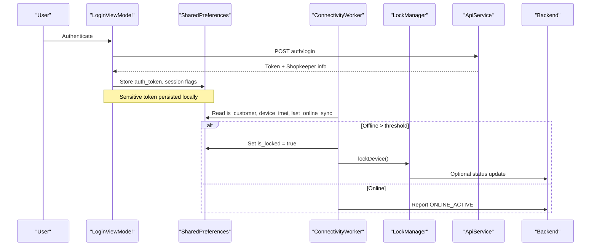
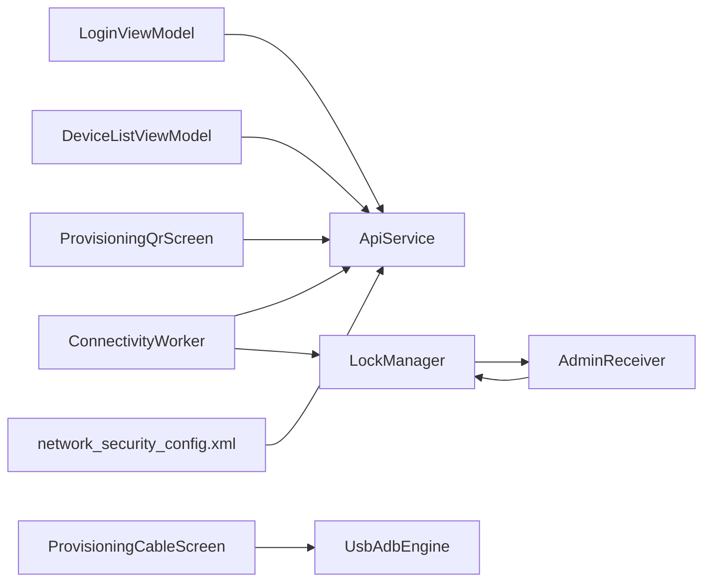
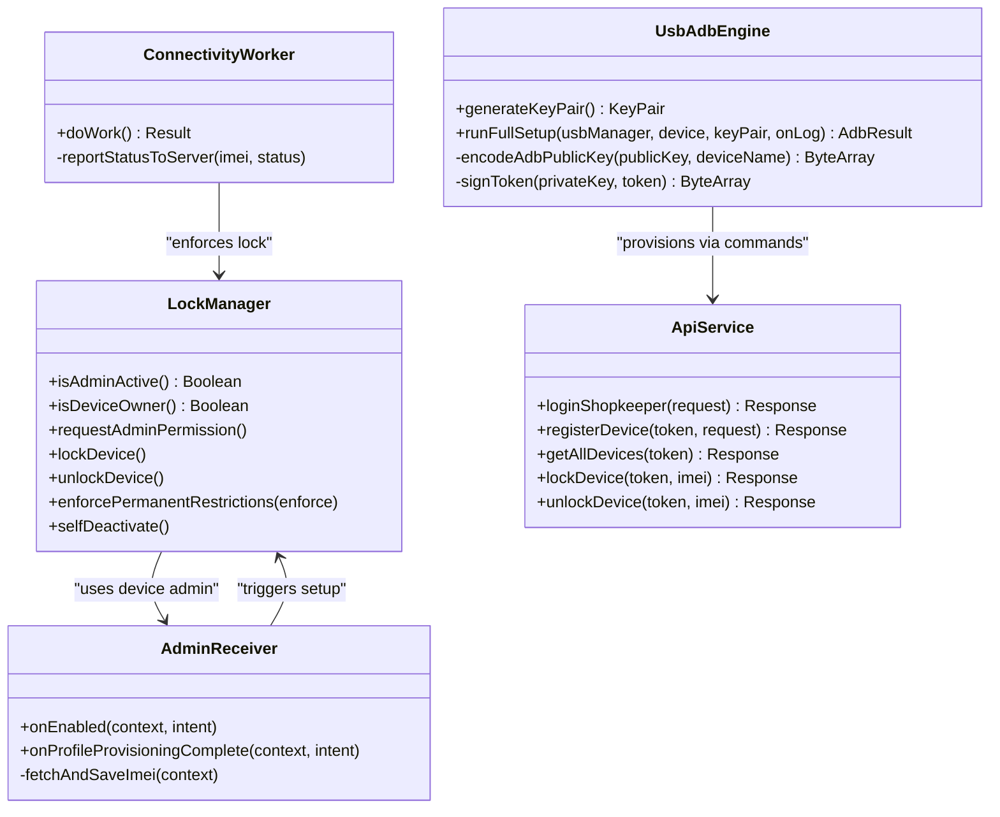

# Data Protection & Storage

<cite>
**Referenced Files in This Document**
- [LockManager.kt](file://app/src/main/java/com/pksafe/lock/manager/util/LockManager.kt)
- [ApiService.kt](file://app/src/main/java/com/pksafe/lock/manager/data/ApiService.kt)
- [Models.kt](file://app/src/main/java/com/pksafe/lock/manager/data/Models.kt)
- [Constants.kt](file://app/src/main/java/com/pksafe/lock/manager/util/Constants.kt)
- [ConnectivityWorker.kt](file://app/src/main/java/com/pksafe/lock/manager/service/ConnectivityWorker.kt)
- [AdminReceiver.kt](file://app/src/main/java/com/pksafe/lock/manager/receiver/AdminReceiver.kt)
- [ProvisioningCableScreen.kt](file://app/src/main/java/com/pksafe/lock/manager/ui/provisioning/ProvisioningCableScreen.kt)
- [UsbAdbEngine.kt](file://app/src/main/java/com/pksafe/lock/manager/util/UsbAdbEngine.kt)
- [ProvisioningQrScreen.kt](file://app/src/main/java/com/pksafe/lock/manager/ui/provisioning/ProvisioningQrScreen.kt)
- [LoginViewModel.kt](file://app/src/main/java/com/pksafe/lock/manager/ui/login/LoginViewModel.kt)
- [DeviceListViewModel.kt](file://app/src/main/java/com/pksafe/lock/manager/ui/devices/DeviceListViewModel.kt)
- [backup_rules.xml](file://app/src/main/res/xml/backup_rules.xml)
- [data_extraction_rules.xml](file://app/src/main/res/xml/data_extraction_rules.xml)
- [network_security_config.xml](file://app/src/main/res/xml/network_security_config.xml)
</cite>

## Table of Contents
1. Introduction
2. Project Structure
3. Core Components
4. Architecture Overview
5. Detailed Component Analysis
6. Dependency Analysis
7. Performance Considerations
8. Troubleshooting Guide
9. Conclusion
10. Appendices

## Introduction
This document explains PK Locker’s data protection mechanisms for sensitive information stored locally on devices. It covers how SharedPreferences is used to store device state, authentication tokens, and configuration; the encryption strategies applied to protect sensitive data such as device identifiers, credentials, and lock status; secure storage practices for API keys and enrollment information; input validation and sanitization patterns; lifecycle management and secure deletion; compliance considerations; and backup/restore behavior that preserves integrity while preventing unauthorized access.

## Project Structure
PK Locker organizes security-sensitive logic across utilities, services, UI components, and Android configuration:
- Utilities implement device policy enforcement and USB ADB-based provisioning with cryptographic operations.
- Services run background tasks to enforce lock policies and communicate with the server using stored tokens.
- UI components handle login, device control, and provisioning flows, persisting minimal necessary state in SharedPreferences.
- Android XML resources define network security rules and backup/extraction policies.

**Diagram sources**
- [LockManager.kt:27-148](file://app/src/main/java/com/pksafe/lock/manager/util/LockManager.kt#L27-L148)
- [ConnectivityWorker.kt:15-60](file://app/src/main/java/com/pksafe/lock/manager/service/ConnectivityWorker.kt#L15-L60)
- [AdminReceiver.kt:14-104](file://app/src/main/java/com/pksafe/lock/manager/receiver/AdminReceiver.kt#L14-L104)
- [ProvisioningQrScreen.kt:93-158](file://app/src/main/java/com/pksafe/lock/manager/ui/provisioning/ProvisioningQrScreen.kt#L93-L158)
- [ProvisioningCableScreen.kt:48-84](file://app/src/main/java/com/pksafe/lock/manager/ui/provisioning/ProvisioningCableScreen.kt#L48-L84)
- [UsbAdbEngine.kt:18-53](file://app/src/main/java/com/pksafe/lock/manager/util/UsbAdbEngine.kt#L18-L53)
- [ApiService.kt:11-185](file://app/src/main/java/com/pksafe/lock/manager/data/ApiService.kt#L11-L185)
- [Models.kt:45-175](file://app/src/main/java/com/pksafe/lock/manager/data/Models.kt#L45-L175)
- [Constants.kt:3-10](file://app/src/main/java/com/pksafe/lock/manager/util/Constants.kt#L3-L10)
- [network_security_config.xml:9-27](file://app/src/main/res/xml/network_security_config.xml#L9-L27)
- [backup_rules.xml:8-13](file://app/src/main/res/xml/backup_rules.xml#L8-L13)
- [data_extraction_rules.xml:6-19](file://app/src/main/res/xml/data_extraction_rules.xml#L6-L19)

**Section sources**
- [LockManager.kt:27-148](file://app/src/main/java/com/pksafe/lock/manager/util/LockManager.kt#L27-L148)
- [ConnectivityWorker.kt:15-60](file://app/src/main/java/com/pksafe/lock/manager/service/ConnectivityWorker.kt#L15-L60)
- [AdminReceiver.kt:14-104](file://app/src/main/java/com/pksafe/lock/manager/receiver/AdminReceiver.kt#L14-L104)
- [ProvisioningQrScreen.kt:93-158](file://app/src/main/java/com/pksafe/lock/manager/ui/provisioning/ProvisioningQrScreen.kt#L93-L158)
- [ProvisioningCableScreen.kt:48-84](file://app/src/main/java/com/pksafe/lock/manager/ui/provisioning/ProvisioningCableScreen.kt#L48-L84)
- [UsbAdbEngine.kt:18-53](file://app/src/main/java/com/pksafe/lock/manager/util/UsbAdbEngine.kt#L18-L53)
- [ApiService.kt:11-185](file://app/src/main/java/com/pksafe/lock/manager/data/ApiService.kt#L11-L185)
- [Models.kt:45-175](file://app/src/main/java/com/pksafe/lock/manager/data/Models.kt#L45-L175)
- [Constants.kt:3-10](file://app/src/main/java/com/pksafe/lock/manager/util/Constants.kt#L3-L10)
- [network_security_config.xml:9-27](file://app/src/main/res/xml/network_security_config.xml#L9-L27)
- [backup_rules.xml:8-13](file://app/src/main/res/xml/backup_rules.xml#L8-L13)
- [data_extraction_rules.xml:6-19](file://app/src/main/res/xml/data_extraction_rules.xml#L6-L19)

## Core Components
- LockManager enforces device-level restrictions and manages lock/unlock state via Device Policy Manager and SharedPreferences flags.
- ConnectivityWorker periodically checks connectivity and enforces local locking if a device remains offline beyond a threshold, updating server status when possible.
- AdminReceiver captures IMEI and marks provisioning completion, storing identifiers and customer mode flags in SharedPreferences.
- Provisioning screens (QR and Cable) orchestrate device enrollment, including QR payload generation and USB ADB handshake with RSA key exchange.
- UsbAdbEngine implements ADB over USB with RSA key pair generation, token signing, and public key encoding for secure device-to-device setup.
- LoginViewModel stores authentication tokens and session flags in SharedPreferences after successful login.
- DeviceListViewModel reads stored tokens to call API endpoints for device control and deregistration.
- ApiService defines authenticated endpoints used throughout the app.
- Models define request/response structures for devices, controls, EMI schedules, and key orders.
- Constants centralize base URLs and download endpoints.
- Network security config restricts cleartext traffic except for private LAN ranges and localhost.
- Backup and data extraction rules are present but not yet configured to exclude sensitive SharedPreferences.

**Section sources**
- [LockManager.kt:27-148](file://app/src/main/java/com/pksafe/lock/manager/util/LockManager.kt#L27-L148)
- [ConnectivityWorker.kt:15-60](file://app/src/main/java/com/pksafe/lock/manager/service/ConnectivityWorker.kt#L15-L60)
- [AdminReceiver.kt:14-104](file://app/src/main/java/com/pksafe/lock/manager/receiver/AdminReceiver.kt#L14-L104)
- [ProvisioningQrScreen.kt:93-158](file://app/src/main/java/com/pksafe/lock/manager/ui/provisioning/ProvisioningQrScreen.kt#L93-L158)
- [ProvisioningCableScreen.kt:48-84](file://app/src/main/java/com/pksafe/lock/manager/ui/provisioning/ProvisioningCableScreen.kt#L48-L84)
- [UsbAdbEngine.kt:18-53](file://app/src/main/java/com/pksafe/lock/manager/util/UsbAdbEngine.kt#L18-L53)
- [LoginViewModel.kt:30-86](file://app/src/main/java/com/pksafe/lock/manager/ui/login/LoginViewModel.kt#L30-L86)
- [DeviceListViewModel.kt:33-245](file://app/src/main/java/com/pksafe/lock/manager/ui/devices/DeviceListViewModel.kt#L33-L245)
- [ApiService.kt:11-185](file://app/src/main/java/com/pksafe/lock/manager/data/ApiService.kt#L11-L185)
- [Models.kt:45-175](file://app/src/main/java/com/pksafe/lock/manager/data/Models.kt#L45-L175)
- [Constants.kt:3-10](file://app/src/main/java/com/pksafe/lock/manager/util/Constants.kt#L3-L10)
- [network_security_config.xml:9-27](file://app/src/main/res/xml/network_security_config.xml#L9-L27)
- [backup_rules.xml:8-13](file://app/src/main/res/xml/backup_rules.xml#L8-L13)
- [data_extraction_rules.xml:6-19](file://app/src/main/res/xml/data_extraction_rules.xml#L6-L19)

## Architecture Overview
The system combines Android enterprise APIs, background workers, and encrypted device-to-device communication to protect sensitive data at rest and in transit.

**Diagram sources**
- [LoginViewModel.kt:30-86](file://app/src/main/java/com/pksafe/lock/manager/ui/login/LoginViewModel.kt#L30-L86)
- [ConnectivityWorker.kt:15-60](file://app/src/main/java/com/pksafe/lock/manager/service/ConnectivityWorker.kt#L15-L60)
- [LockManager.kt:111-148](file://app/src/main/java/com/pksafe/lock/manager/util/LockManager.kt#L111-L148)
- [ApiService.kt:11-185](file://app/src/main/java/com/pksafe/lock/manager/data/ApiService.kt#L11-L185)

## Detailed Component Analysis

### SharedPreferences Usage and Security Considerations
- Authentication tokens and session flags are stored in a dedicated SharedPreferences instance named “PKLockerPrefs”. Keys include auth_token, is_admin, is_logged_in, is_customer, is_locked, settings_blocked, auto_lock_enabled, shop_name, shop_phone.
- Device identifiers (IMEI, optional IMEI2) and provisioning flags are stored by AdminReceiver during device owner activation.
- Lock state and user preferences are managed by LockManager, which toggles is_locked and clears or sets additional flags during unlock and self-deactivation.
- USB ADB provisioning persists RSA key pairs under a separate SharedPreferences (“usb_adb_prefs”) for device-to-device ADB authentication.

Security considerations:
- Tokens and identifiers are stored in plain text within SharedPreferences. While convenient, this increases risk if the device is rooted or backups are enabled without exclusions.
- Consider encrypting sensitive values using Android Keystore-backed symmetric keys before writing to SharedPreferences, especially for tokens and IMEIs.
- Restrict backup and cloud extraction to exclude sensitive SharedPreferences files to prevent leakage.

**Section sources**
- [LoginViewModel.kt:46-58](file://app/src/main/java/com/pksafe/lock/manager/ui/login/LoginViewModel.kt#L46-L58)
- [AdminReceiver.kt:43-104](file://app/src/main/java/com/pksafe/lock/manager/receiver/AdminReceiver.kt#L43-L104)
- [LockManager.kt:136-148](file://app/src/main/java/com/pksafe/lock/manager/util/LockManager.kt#L136-L148)
- [LockManager.kt:351-404](file://app/src/main/java/com/pksafe/lock/manager/util/LockManager.kt#L351-L404)
- [ProvisioningCableScreen.kt:48-84](file://app/src/main/java/com/pksafe/lock/manager/ui/provisioning/ProvisioningCableScreen.kt#L48-L84)

### Encryption Strategies for Sensitive Data
- RSA Key Pair Generation: UsbAdbEngine generates 2048-bit RSA key pairs for ADB authentication between devices.
- Token Signing: During ADB handshake, the private key signs challenges from the device to establish trust.
- Public Key Encoding: The engine encodes the RSA public key into ADB wire format and sends it to trigger an “Allow USB Debugging” prompt on the target device.
- APK Hash Verification: ProvisioningQrScreen computes SHA-256 hashes for APK verification and includes signature checksums in QR payloads for device owner provisioning.

Recommendations:
- Use Android Keystore to manage RSA keys securely and avoid persisting raw private keys in SharedPreferences.
- Encrypt sensitive fields (tokens, IMEIs) with AES-GCM using keys bound to hardware-backed Keystore.
- Validate all downloaded artifacts (APKs) using signature and hash checks before installation.

**Section sources**
- [UsbAdbEngine.kt:47-53](file://app/src/main/java/com/pksafe/lock/manager/util/UsbAdbEngine.kt#L47-L53)
- [UsbAdbEngine.kt:176-185](file://app/src/main/java/com/pksafe/lock/manager/util/UsbAdbEngine.kt#L176-L185)
- [UsbAdbEngine.kt:146-174](file://app/src/main/java/com/pksafe/lock/manager/util/UsbAdbEngine.kt#L146-L174)
- [ProvisioningQrScreen.kt:120-158](file://app/src/main/java/com/pksafe/lock/manager/ui/provisioning/ProvisioningQrScreen.kt#L120-L158)
- [ProvisioningQrScreen.kt:447-459](file://app/src/main/java/com/pksafe/lock/manager/ui/provisioning/ProvisioningQrScreen.kt#L447-L459)

### Secure Storage of API Keys, Tokens, and Enrollment Info
- API Base URL and APK download URL are centralized in Constants to avoid hardcoding in multiple places.
- Auth tokens are passed as Authorization headers in Retrofit calls defined by ApiService.
- Enrollment data (IMEI, provisioning flags, customer mode) is stored in SharedPreferences by AdminReceiver upon device owner activation.
- USB ADB keys are stored in a separate SharedPreferences namespace to isolate provisioning secrets from general app state.

Best practices:
- Rotate tokens server-side and invalidate old sessions promptly.
- Avoid logging tokens or sensitive identifiers.
- Minimize persisted data scope; only keep what is necessary for functionality.

**Section sources**
- [Constants.kt:3-10](file://app/src/main/java/com/pksafe/lock/manager/util/Constants.kt#L3-L10)
- [ApiService.kt:11-185](file://app/src/main/java/com/pksafe/lock/manager/data/ApiService.kt#L11-L185)
- [AdminReceiver.kt:43-104](file://app/src/main/java/com/pksafe/lock/manager/receiver/AdminReceiver.kt#L43-L104)
- [ProvisioningCableScreen.kt:48-84](file://app/src/main/java/com/pksafe/lock/manager/ui/provisioning/ProvisioningCableScreen.kt#L48-L84)

### Input Validation and Sanitization
- LoginViewModel validates phone and password presence before initiating login.
- ProvisioningQrScreen constructs JSON payloads for device owner provisioning with explicit flags and checksums, reducing ambiguity.
- ConnectivityWorker reads stored flags and thresholds to decide locking behavior, avoiding arbitrary inputs.

Mitigations:
- Validate and sanitize all user inputs at boundaries (UI and API layers).
- Enforce strict schemas for payloads sent to the server.
- Reject malformed or unexpected values early to reduce attack surface.

**Section sources**
- [LoginViewModel.kt:30-40](file://app/src/main/java/com/pksafe/lock/manager/ui/login/LoginViewModel.kt#L30-L40)
- [ProvisioningQrScreen.kt:120-158](file://app/src/main/java/com/pksafe/lock/manager/ui/provisioning/ProvisioningQrScreen.kt#L120-L158)
- [ConnectivityWorker.kt:17-47](file://app/src/main/java/com/pksafe/lock/manager/service/ConnectivityWorker.kt#L17-L47)

### Protection Against Common Vulnerabilities
- SQL Injection: Not applicable in this Android client codebase; ensure backend APIs use parameterized queries and validate inputs server-side.
- XSS: Not directly relevant for native Android apps; however, any WebView usage should enforce strict content policies and disable JavaScript where unnecessary.
- Network Security: network_security_config.xml disables cleartext by default and allows HTTP only for private IP ranges and localhost, mitigating accidental insecure communications.

**Section sources**
- [network_security_config.xml:9-27](file://app/src/main/res/xml/network_security_config.xml#L9-L27)

### Data Lifecycle Management and Secure Deletion
- Self-deactivation flow removes Device Owner privileges, clears user restrictions, removes Device Admin, and resets SharedPreferences flags to release the device fully.
- Unlock flow stops overlay services, removes hardware restrictions, and updates lock state in SharedPreferences.
- ConnectivityWorker enforces automatic locking when offline beyond a threshold, ensuring consistent state even without connectivity.

Compliance notes:
- Ensure deletion procedures remove all sensitive references (tokens, identifiers) and do not leave residual data in logs or caches.
- Provide audit trails for deactivation and unlocking actions where appropriate.

**Section sources**
- [LockManager.kt:136-148](file://app/src/main/java/com/pksafe/lock/manager/util/LockManager.kt#L136-L148)
- [LockManager.kt:299-315](file://app/src/main/java/com/pksafe/lock/manager/util/LockManager.kt#L299-L315)
- [LockManager.kt:351-404](file://app/src/main/java/com/pksafe/lock/manager/util/LockManager.kt#L351-L404)
- [ConnectivityWorker.kt:17-47](file://app/src/main/java/com/pksafe/lock/manager/service/ConnectivityWorker.kt#L17-L47)

### Backup and Restore Mechanisms
- backup_rules.xml and data_extraction_rules.xml are present but currently unconfigured to exclude sensitive SharedPreferences.
- To maintain integrity and prevent unauthorized access:
  - Exclude sensitive SharedPreferences namespaces (e.g., “PKLockerPrefs”, “usb_adb_prefs”) from full backup and cloud extraction.
  - Ensure restore processes re-validate device ownership and re-establish secure channels before restoring sensitive state.

**Section sources**
- [backup_rules.xml:8-13](file://app/src/main/res/xml/backup_rules.xml#L8-L13)
- [data_extraction_rules.xml:6-19](file://app/src/main/res/xml/data_extraction_rules.xml#L6-L19)

## Dependency Analysis
PK Locker’s data protection depends on coordinated interactions among UI, utilities, services, and Android configuration:

**Diagram sources**
- [LoginViewModel.kt:30-86](file://app/src/main/java/com/pksafe/lock/manager/ui/login/LoginViewModel.kt#L30-L86)
- [DeviceListViewModel.kt:33-245](file://app/src/main/java/com/pksafe/lock/manager/ui/devices/DeviceListViewModel.kt#L33-L245)
- [ConnectivityWorker.kt:15-60](file://app/src/main/java/com/pksafe/lock/manager/service/ConnectivityWorker.kt#L15-L60)
- [AdminReceiver.kt:14-104](file://app/src/main/java/com/pksafe/lock/manager/receiver/AdminReceiver.kt#L14-L104)
- [ProvisioningCableScreen.kt:48-84](file://app/src/main/java/com/pksafe/lock/manager/ui/provisioning/ProvisioningCableScreen.kt#L48-L84)
- [UsbAdbEngine.kt:18-53](file://app/src/main/java/com/pksafe/lock/manager/util/UsbAdbEngine.kt#L18-L53)
- [ProvisioningQrScreen.kt:93-158](file://app/src/main/java/com/pksafe/lock/manager/ui/provisioning/ProvisioningQrScreen.kt#L93-L158)
- [ApiService.kt:11-185](file://app/src/main/java/com/pksafe/lock/manager/data/ApiService.kt#L11-L185)
- [network_security_config.xml:9-27](file://app/src/main/res/xml/network_security_config.xml#L9-L27)

**Section sources**
- [LoginViewModel.kt:30-86](file://app/src/main/java/com/pksafe/lock/manager/ui/login/LoginViewModel.kt#L30-L86)
- [DeviceListViewModel.kt:33-245](file://app/src/main/java/com/pksafe/lock/manager/ui/devices/DeviceListViewModel.kt#L33-L245)
- [ConnectivityWorker.kt:15-60](file://app/src/main/java/com/pksafe/lock/manager/service/ConnectivityWorker.kt#L15-L60)
- [AdminReceiver.kt:14-104](file://app/src/main/java/com/pksafe/lock/manager/receiver/AdminReceiver.kt#L14-L104)
- [ProvisioningCableScreen.kt:48-84](file://app/src/main/java/com/pksafe/lock/manager/ui/provisioning/ProvisioningCableScreen.kt#L48-L84)
- [UsbAdbEngine.kt:18-53](file://app/src/main/java/com/pksafe/lock/manager/util/UsbAdbEngine.kt#L18-L53)
- [ProvisioningQrScreen.kt:93-158](file://app/src/main/java/com/pksafe/lock/manager/ui/provisioning/ProvisioningQrScreen.kt#L93-L158)
- [ApiService.kt:11-185](file://app/src/main/java/com/pksafe/lock/manager/data/ApiService.kt#L11-L185)
- [network_security_config.xml:9-27](file://app/src/main/res/xml/network_security_config.xml#L9-L27)

## Performance Considerations
- Background locking and heartbeat reporting via ConnectivityWorker should be throttled to avoid excessive battery drain.
- ADB USB operations in UsbAdbEngine involve bulk transfers and timeouts; ensure efficient error handling and retries to minimize delays.
- SharedPreferences reads/writes are lightweight but should be batched where possible to reduce I/O overhead.

[No sources needed since this section provides general guidance]

## Troubleshooting Guide
Common issues and resolutions:
- ADB connection failures: Verify USB permissions and cable connection; check logs for “Allow USB Debugging?” prompts and ensure correct interface/endpoint discovery.
- Device not locking when offline: Confirm ConnectivityWorker runs and SharedPreferences flags are set correctly; verify last_online_sync timestamps.
- Provisioning QR errors: Ensure signature checksum and APK hash are valid; confirm network access and domain allowances in network_security_config.xml.
- Backup leakage: Update backup_rules.xml and data_extraction_rules.xml to exclude sensitive SharedPreferences namespaces.

**Section sources**
- [UsbAdbEngine.kt:188-352](file://app/src/main/java/com/pksafe/lock/manager/util/UsbAdbEngine.kt#L188-L352)
- [ConnectivityWorker.kt:17-60](file://app/src/main/java/com/pksafe/lock/manager/service/ConnectivityWorker.kt#L17-L60)
- [ProvisioningQrScreen.kt:120-158](file://app/src/main/java/com/pksafe/lock/manager/ui/provisioning/ProvisioningQrScreen.kt#L120-L158)
- [network_security_config.xml:9-27](file://app/src/main/res/xml/network_security_config.xml#L9-L27)
- [backup_rules.xml:8-13](file://app/src/main/res/xml/backup_rules.xml#L8-L13)
- [data_extraction_rules.xml:6-19](file://app/src/main/res/xml/data_extraction_rules.xml#L6-L19)

## Conclusion
PK Locker integrates Android enterprise APIs, background enforcement, and cryptographic device-to-device communication to protect sensitive data both at rest and in transit. SharedPreferences is used extensively for device state, tokens, and configuration; however, sensitive values should be encrypted at rest using Android Keystore. Backup and extraction rules must be explicitly configured to exclude sensitive data. Input validation and network security configurations help mitigate common vulnerabilities. Robust lifecycle management ensures secure deletion and consistent state transitions.

[No sources needed since this section summarizes without analyzing specific files]

## Appendices

### Class Diagram: Core Security Components

**Diagram sources**
- [LockManager.kt:27-148](file://app/src/main/java/com/pksafe/lock/manager/util/LockManager.kt#L27-L148)
- [ConnectivityWorker.kt:15-60](file://app/src/main/java/com/pksafe/lock/manager/service/ConnectivityWorker.kt#L15-L60)
- [AdminReceiver.kt:14-104](file://app/src/main/java/com/pksafe/lock/manager/receiver/AdminReceiver.kt#L14-L104)
- [UsbAdbEngine.kt:18-53](file://app/src/main/java/com/pksafe/lock/manager/util/UsbAdbEngine.kt#L18-L53)
- [ApiService.kt:11-185](file://app/src/main/java/com/pksafe/lock/manager/data/ApiService.kt#L11-L185)