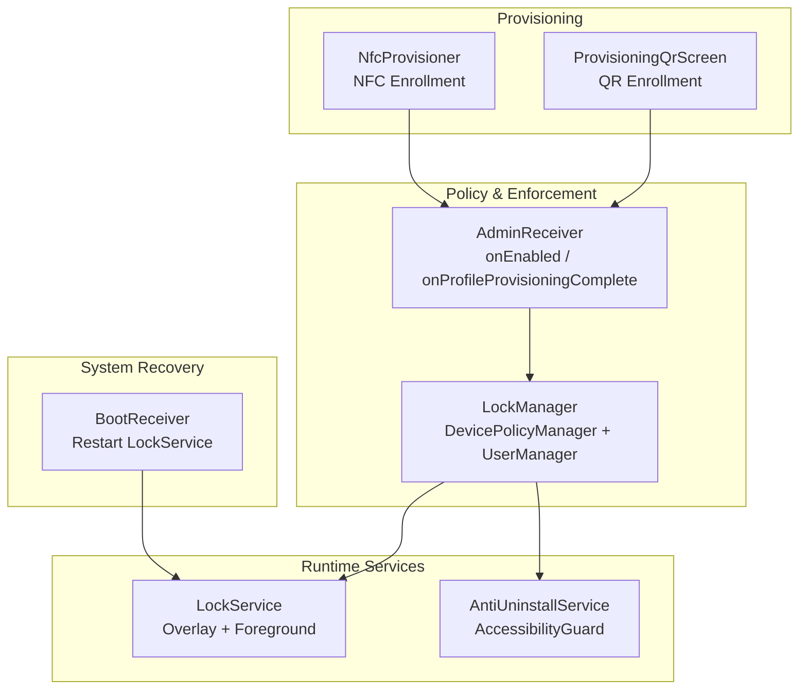
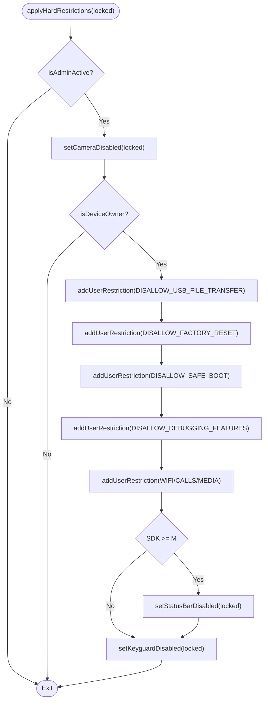
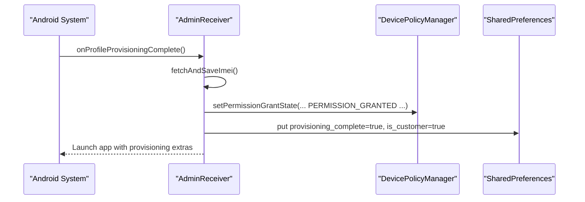
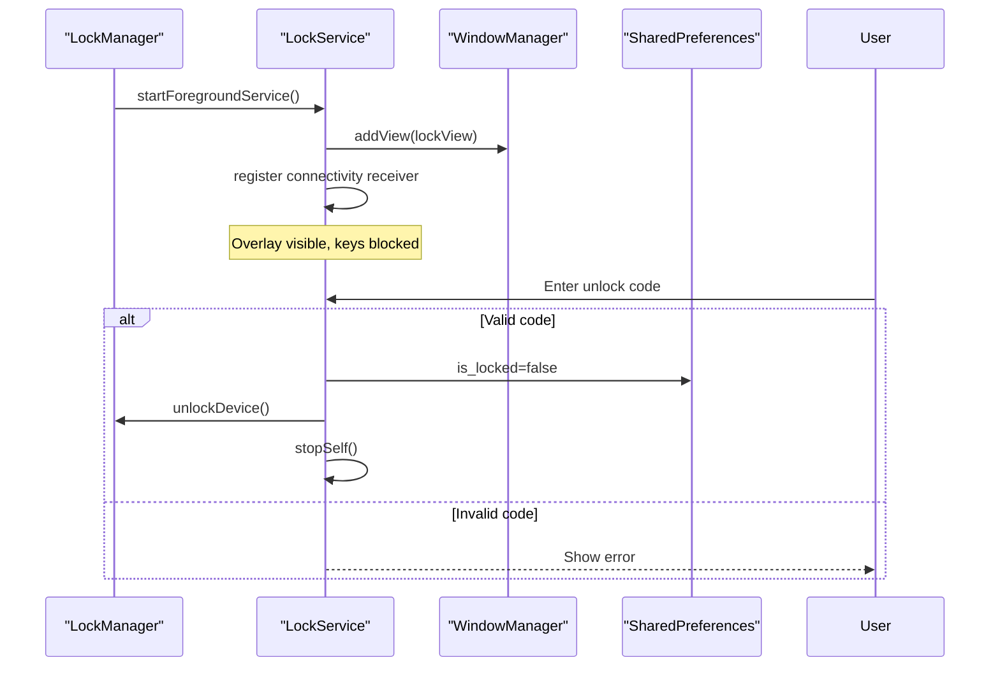
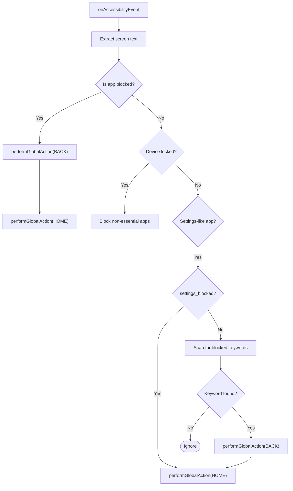
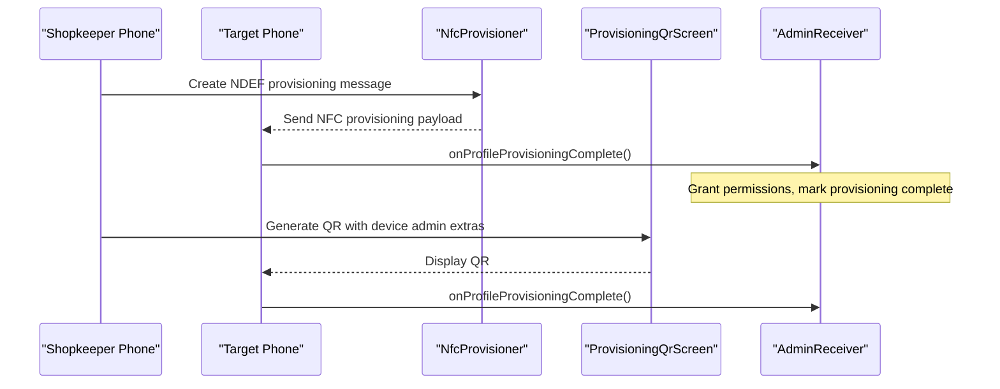
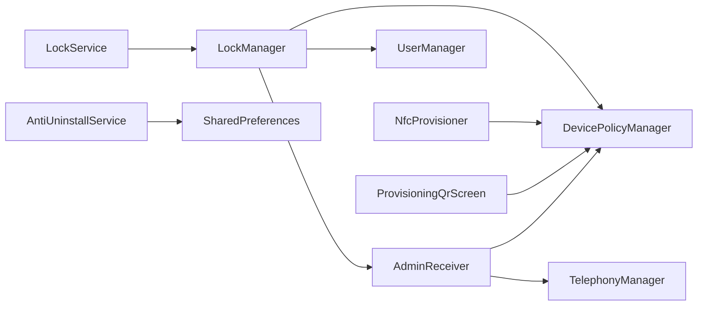

# Device Security Controls

<cite>
**Referenced Files in This Document**
- [LockManager.kt](file://app/src/main/java/com/pksafe/lock/manager/util/LockManager.kt)
- [AdminReceiver.kt](file://app/src/main/java/com/pksafe/lock/manager/receiver/AdminReceiver.kt)
- [device_admin_policies.xml](file://app/src/main/res/xml/device_admin_policies.xml)
- [AntiUninstallService.kt](file://app/src/main/java/com/pksafe/lock/manager/service/AntiUninstallService.kt)
- [LockService.kt](file://app/src/main/java/com/pksafe/lock/manager/service/LockService.kt)
- [BootReceiver.kt](file://app/src/main/java/com/pksafe/lock/manager/receiver/BootReceiver.kt)
- [NfcProvisioner.kt](file://app/src/main/java/com/pksafe/lock/manager/util/NfcProvisioner.kt)
- [ProvisioningQrScreen.kt](file://app/src/main/java/com/pksafe/lock/manager/ui/provisioning/ProvisioningQrScreen.kt)
</cite>

## Table of Contents
1. [Introduction](#introduction)
2. [Project Structure](#project-structure)
3. [Core Components](#core-components)
4. [Architecture Overview](#architecture-overview)
5. [Detailed Component Analysis](#detailed-component-analysis)
6. [Dependency Analysis](#dependency-analysis)
7. [Performance Considerations](#performance-considerations)
8. [Troubleshooting Guide](#troubleshooting-guide)
9. [Conclusion](#conclusion)

## Introduction
This document explains PK Locker’s device security controls implemented via Android’s Device Policy Manager and related system APIs. It focuses on hardware restriction mechanisms such as camera disablement, USB file transfer blocking, factory reset prevention, safe mode bypass protection, ADB debugging restrictions, status bar disabling, keyguard control, and prevention of system settings modifications. It also details how user restrictions are applied using UserManager constants (DISALLOW_USB_FILE_TRANSFER, DISALLOW_FACTORY_RESET, DISALLOW_SAFE_BOOT, DISALLOW_DEBUGGING_FEATURES), how these controls are enforced during lock/unlock cycles, how permanent restrictions are maintained, and how individual controls are exposed for dashboard management. Finally, it clarifies the differences between device owner and device admin privileges and their impact on available security controls.

## Project Structure
PK Locker implements device security across several modules:
- Policy enforcement and user restrictions are centralized in a utility class that interacts with DevicePolicyManager.
- An AdminReceiver handles provisioning completion and privilege setup.
- Services provide persistent enforcement: a foreground overlay service to enforce locking UI and an accessibility-based guard to block unauthorized actions.
- Provisioning utilities support setting up device owner via NFC or QR flows.
- Boot-time recovery ensures services restart after reboot.



**Diagram sources**
- [LockManager.kt:27-49](file://app/src/main/java/com/pksafe/lock/manager/util/LockManager.kt#L27-L49)
- [AdminReceiver.kt:14-36](file://app/src/main/java/com/pksafe/lock/manager/receiver/AdminReceiver.kt#L14-L36)
- [LockService.kt:41-80](file://app/src/main/java/com/pksafe/lock/manager/service/LockService.kt#L41-L80)
- [AntiUninstallService.kt:22-86](file://app/src/main/java/com/pksafe/lock/manager/service/AntiUninstallService.kt#L22-L86)
- [NfcProvisioner.kt:15-49](file://app/src/main/java/com/pksafe/lock/manager/util/NfcProvisioner.kt#L15-L49)
- [ProvisioningQrScreen.kt:131-153](file://app/src/main/java/com/pksafe/lock/manager/ui/provisioning/ProvisioningQrScreen.kt#L131-L153)
- [BootReceiver.kt:10-25](file://app/src/main/java/com/pksafe/lock/manager/receiver/BootReceiver.kt#L10-L25)

**Section sources**
- [LockManager.kt:27-49](file://app/src/main/java/com/pksafe/lock/manager/util/LockManager.kt#L27-L49)
- [AdminReceiver.kt:14-36](file://app/src/main/java/com/pksafe/lock/manager/receiver/AdminReceiver.kt#L14-L36)
- [LockService.kt:41-80](file://app/src/main/java/com/pksafe/lock/manager/service/LockService.kt#L41-L80)
- [AntiUninstallService.kt:22-86](file://app/src/main/java/com/pksafe/lock/manager/service/AntiUninstallService.kt#L22-L86)
- [NfcProvisioner.kt:15-49](file://app/src/main/java/com/pksafe/lock/manager/util/NfcProvisioner.kt#L15-L49)
- [ProvisioningQrScreen.kt:131-153](file://app/src/main/java/com/pksafe/lock/manager/ui/provisioning/ProvisioningQrScreen.kt#L131-L153)
- [BootReceiver.kt:10-25](file://app/src/main/java/com/pksafe/lock/manager/receiver/BootReceiver.kt#L10-L25)

## Core Components
- LockManager: Central orchestrator for applying and clearing device restrictions, managing camera, USB, factory reset, safe boot, ADB/debugging, status bar, and keyguard controls. Also exposes per-feature toggles for dashboard use and enforces permanent restrictions.
- AdminReceiver: Receives device admin lifecycle events; on provisioning complete, grants critical permissions and marks provisioning finished.
- LockService: Foreground service that displays a persistent lock overlay, blocks navigation keys, and triggers unlock flow.
- AntiUninstallService: Accessibility-based guard that intercepts sensitive actions (settings, uninstall attempts, developer options) and navigates away when restricted.
- Provisioning helpers (NFC/QR): Provide enterprise enrollment flows to set device owner and ensure app privileges.
- BootReceiver: Restarts LockService on boot if conditions are met.

**Section sources**
- [LockManager.kt:110-192](file://app/src/main/java/com/pksafe/lock/manager/util/LockManager.kt#L110-L192)
- [AdminReceiver.kt:16-36](file://app/src/main/java/com/pksafe/lock/manager/receiver/AdminReceiver.kt#L16-L36)
- [LockService.kt:50-80](file://app/src/main/java/com/pksafe/lock/manager/service/LockService.kt#L50-L80)
- [AntiUninstallService.kt:136-210](file://app/src/main/java/com/pksafe/lock/manager/service/AntiUninstallService.kt#L136-L210)
- [NfcProvisioner.kt:22-49](file://app/src/main/java/com/pksafe/lock/manager/util/NfcProvisioner.kt#L22-L49)
- [ProvisioningQrScreen.kt:131-153](file://app/src/main/java/com/pksafe/lock/manager/ui/provisioning/ProvisioningQrScreen.kt#L131-L153)
- [BootReceiver.kt:10-25](file://app/src/main/java/com/pksafe/lock/manager/receiver/BootReceiver.kt#L10-L25)

## Architecture Overview
The security architecture combines policy-level controls (DevicePolicyManager/UserManager) with runtime enforcement (services). During provisioning, device owner is established so that advanced restrictions can be applied. When locked, LockManager applies hardware and software restrictions and starts a foreground overlay service to prevent interaction. The accessibility guard monitors UI events to block unauthorized changes. On boot, the receiver restores the lock state by restarting the service.

```mermaid
sequenceDiagram
participant User as "User"
participant DPM as "DevicePolicyManager"
participant UM as "UserManager"
participant LM as "LockManager"
participant LS as "LockService"
participant AUS as "AntiUninstallService"
User->>LM : lockDevice()
LM->>LS : startForegroundService(LockService)
LM->>DPM : setCameraDisabled(true)
LM->>UM : addUserRestriction(DISALLOW_USB_FILE_TRANSFER)
LM->>UM : addUserRestriction(DISALLOW_FACTORY_RESET)
LM->>UM : addUserRestriction(DISALLOW_SAFE_BOOT)
LM->>UM : addUserRestriction(DISALLOW_DEBUGGING_FEATURES)
LM->>DPM : setStatusBarDisabled(true)
LM->>DPM : setKeyguardDisabled(true)
LM->>DPM : lockNow()
Note over LS,AUS : Overlay visible; Accessibility guard active
```

**Diagram sources**
- [LockManager.kt:110-192](file://app/src/main/java/com/pksafe/lock/manager/util/LockManager.kt#L110-L192)
- [LockService.kt:50-80](file://app/src/main/java/com/pksafe/lock/manager/service/LockService.kt#L50-L80)
- [AntiUninstallService.kt:136-210](file://app/src/main/java/com/pksafe/lock/manager/service/AntiUninstallService.kt#L136-L210)

## Detailed Component Analysis

### LockManager: Hardware Restrictions and User Restrictions
LockManager centralizes all device security controls:
- Camera disablement via DevicePolicyManager.
- USB file transfer blocking via UserManager.DISALLOW_USB_FILE_TRANSFER.
- Factory reset prevention via UserManager.DISALLOW_FACTORY_RESET.
- Safe mode bypass protection via UserManager.DISALLOW_SAFE_BOOT.
- ADB/debugging restrictions via UserManager.DISALLOW_DEBUGGING_FEATURES.
- Additional restrictions like Wi‑Fi configuration, outgoing calls, and physical media mounting.
- Status bar expansion disabled via DevicePolicyManager.
- Keyguard disabled to show custom lock UI directly.
- Individual toggle methods for dashboard management (USB, camera, app install/uninstall, outgoing calls, factory reset, safe boot).
- Permanent restriction enforcement to keep critical protections always enabled on customer devices.
- Self-deactivation routine that clears all restrictions and removes device owner/admin privileges.



**Diagram sources**
- [LockManager.kt:150-192](file://app/src/main/java/com/pksafe/lock/manager/util/LockManager.kt#L150-L192)

**Section sources**
- [LockManager.kt:110-192](file://app/src/main/java/com/pksafe/lock/manager/util/LockManager.kt#L110-L192)
- [LockManager.kt:202-261](file://app/src/main/java/com/pksafe/lock/manager/util/LockManager.kt#L202-L261)
- [LockManager.kt:299-315](file://app/src/main/java/com/pksafe/lock/manager/util/LockManager.kt#L299-L315)
- [LockManager.kt:354-404](file://app/src/main/java/com/pksafe/lock/manager/util/LockManager.kt#L354-L404)

### AdminReceiver: Provisioning and Privilege Setup
- Handles device admin enablement and provisioning completion.
- Grants critical permissions to self when running as device owner.
- Marks provisioning complete and launches the app to finalize setup.



**Diagram sources**
- [AdminReceiver.kt:23-36](file://app/src/main/java/com/pksafe/lock/manager/receiver/AdminReceiver.kt#L23-L36)
- [AdminReceiver.kt:43-99](file://app/src/main/java/com/pksafe/lock/manager/receiver/AdminReceiver.kt#L43-L99)

**Section sources**
- [AdminReceiver.kt:16-36](file://app/src/main/java/com/pksafe/lock/manager/receiver/AdminReceiver.kt#L16-L36)
- [AdminReceiver.kt:43-99](file://app/src/main/java/com/pksafe/lock/manager/receiver/AdminReceiver.kt#L43-L99)

### LockService: Persistent Lock Overlay and Interaction Blocking
- Runs as a foreground service with a persistent notification.
- Displays an overlay view that blocks back/home/recents/menu keys and requires a master code to unlock.
- Integrates with LockManager to remove restrictions upon successful unlock.



**Diagram sources**
- [LockService.kt:50-80](file://app/src/main/java/com/pksafe/lock/manager/service/LockService.kt#L50-L80)
- [LockService.kt:125-225](file://app/src/main/java/com/pksafe/lock/manager/service/LockService.kt#L125-L225)
- [LockService.kt:200-218](file://app/src/main/java/com/pksafe/lock/manager/service/LockService.kt#L200-L218)

**Section sources**
- [LockService.kt:50-80](file://app/src/main/java/com/pksafe/lock/manager/service/LockService.kt#L50-L80)
- [LockService.kt:125-225](file://app/src/main/java/com/pksafe/lock/manager/service/LockService.kt#L125-L225)
- [LockService.kt:200-218](file://app/src/main/java/com/pksafe/lock/manager/service/LockService.kt#L200-L218)

### AntiUninstallService: Accessibility-Based Guard
- Monitors UI events to detect attempts to access settings, uninstallers, or developer options.
- Blocks navigation to restricted screens by performing global actions (back/home).
- Supports dynamic app blocking based on preferences and known package mappings.
- Ensures auto-lock behavior when connectivity is lost and auto-lock is enabled.



**Diagram sources**
- [AntiUninstallService.kt:136-210](file://app/src/main/java/com/pksafe/lock/manager/service/AntiUninstallService.kt#L136-L210)

**Section sources**
- [AntiUninstallService.kt:22-86](file://app/src/main/java/com/pksafe/lock/manager/service/AntiUninstallService.kt#L22-L86)
- [AntiUninstallService.kt:136-210](file://app/src/main/java/com/pksafe/lock/manager/service/AntiUninstallService.kt#L136-L210)

### Provisioning: Device Owner Setup via NFC/QR
- NFC provisioner creates an NDEF message with required provisioning properties to enroll the app as device owner.
- QR provisioning screen constructs JSON payload with device admin package info, signature checksum, and flags to skip encryption and allow mobile data.



**Diagram sources**
- [NfcProvisioner.kt:22-49](file://app/src/main/java/com/pksafe/lock/manager/util/NfcProvisioner.kt#L22-L49)
- [ProvisioningQrScreen.kt:131-153](file://app/src/main/java/com/pksafe/lock/manager/ui/provisioning/ProvisioningQrScreen.kt#L131-L153)
- [AdminReceiver.kt:23-36](file://app/src/main/java/com/pksafe/lock/manager/receiver/AdminReceiver.kt#L23-L36)

**Section sources**
- [NfcProvisioner.kt:22-49](file://app/src/main/java/com/pksafe/lock/manager/util/NfcProvisioner.kt#L22-L49)
- [ProvisioningQrScreen.kt:131-153](file://app/src/main/java/com/pksafe/lock/manager/ui/provisioning/ProvisioningQrScreen.kt#L131-L153)
- [AdminReceiver.kt:23-36](file://app/src/main/java/com/pksafe/lock/manager/receiver/AdminReceiver.kt#L23-L36)

### Boot-Time Recovery
- On boot completed, checks if admin is active and overlays allowed, then restarts LockService to restore lock state.

**Section sources**
- [BootReceiver.kt:10-25](file://app/src/main/java/com/pksafe/lock/manager/receiver/BootReceiver.kt#L10-L25)

## Dependency Analysis
- LockManager depends on DevicePolicyManager and UserManager to apply restrictions. It references AdminReceiver component name for policy operations.
- LockService depends on WindowManager for overlay and integrates with LockManager for unlocking.
- AntiUninstallService depends on AccessibilityService APIs and SharedPreferences to enforce policies at runtime.
- AdminReceiver depends on DevicePolicyManager to grant permissions and on TelephonyManager to read IMEI.
- Provisioning components depend on DevicePolicyManager provisioning APIs to enroll device owner.



**Diagram sources**
- [LockManager.kt:27-49](file://app/src/main/java/com/pksafe/lock/manager/util/LockManager.kt#L27-L49)
- [AdminReceiver.kt:43-99](file://app/src/main/java/com/pksafe/lock/manager/receiver/AdminReceiver.kt#L43-L99)
- [NfcProvisioner.kt:22-49](file://app/src/main/java/com/pksafe/lock/manager/util/NfcProvisioner.kt#L22-L49)
- [ProvisioningQrScreen.kt:131-153](file://app/src/main/java/com/pksafe/lock/manager/ui/provisioning/ProvisioningQrScreen.kt#L131-L153)

**Section sources**
- [LockManager.kt:27-49](file://app/src/main/java/com/pksafe/lock/manager/util/LockManager.kt#L27-L49)
- [AdminReceiver.kt:43-99](file://app/src/main/java/com/pksafe/lock/manager/receiver/AdminReceiver.kt#L43-L99)
- [NfcProvisioner.kt:22-49](file://app/src/main/java/com/pksafe/lock/manager/util/NfcProvisioner.kt#L22-L49)
- [ProvisioningQrScreen.kt:131-153](file://app/src/main/java/com/pksafe/lock/manager/ui/provisioning/ProvisioningQrScreen.kt#L131-L153)

## Performance Considerations
- Restriction application is lightweight and executed synchronously during lock/unlock; avoid frequent toggling to minimize overhead.
- Foreground service and overlay should be kept minimal to reduce memory footprint; reuse views and avoid heavy image processing on the main thread.
- Accessibility monitoring runs continuously; ensure event processing remains efficient and avoids deep tree traversals where possible.
- Network calls for live EMI updates run on background threads to prevent UI jank.

[No sources needed since this section provides general guidance]

## Troubleshooting Guide
- If restrictions do not apply, verify device admin is active and device owner privileges are granted before attempting advanced restrictions.
- If USB/file transfer cannot be blocked, confirm SDK version supports UserManager restrictions and that device owner is set.
- If status bar or keyguard controls fail, check API level compatibility and ensure proper component names are used.
- If overlay does not appear, ensure overlay permission is granted and service is started as foreground.
- If accessibility guard fails to block settings, confirm the service is enabled via secure settings and that the app has necessary permissions.

**Section sources**
- [LockManager.kt:150-192](file://app/src/main/java/com/pksafe/lock/manager/util/LockManager.kt#L150-L192)
- [LockService.kt:125-225](file://app/src/main/java/com/pksafe/lock/manager/service/LockService.kt#L125-L225)
- [AntiUninstallService.kt:136-210](file://app/src/main/java/com/pksafe/lock/manager/service/AntiUninstallService.kt#L136-L210)

## Conclusion
PK Locker implements robust device security controls through a combination of DevicePolicyManager and UserManager restrictions, runtime enforcement via services, and accessibility-based guards. Device owner privileges unlock advanced capabilities such as USB blocking, factory reset prevention, safe mode bypass protection, ADB restrictions, status bar disabling, and keyguard control. These controls are applied during lock cycles, enforced permanently for critical protections, and managed individually via dashboard methods. Proper provisioning ensures device owner setup, while boot-time recovery maintains persistent enforcement.

[No sources needed since this section summarizes without analyzing specific files]