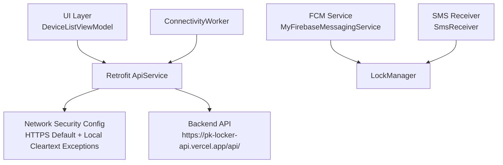
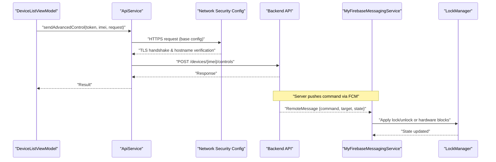
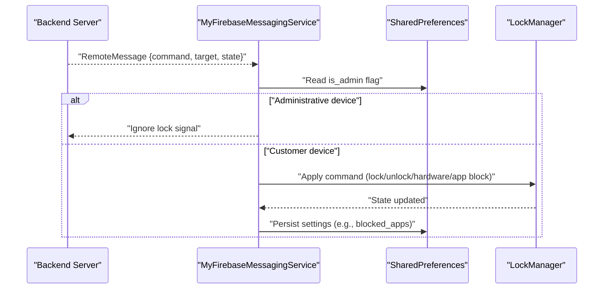
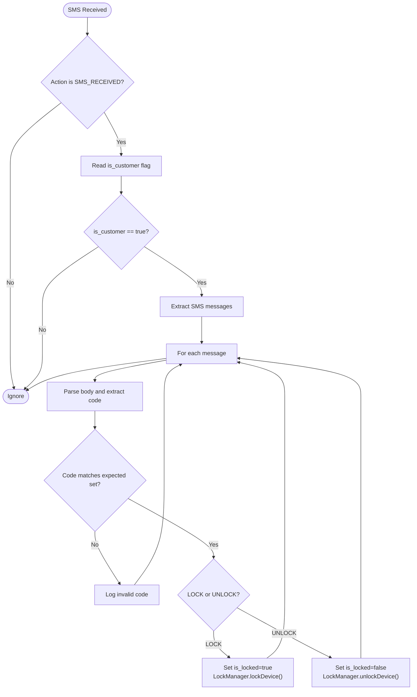
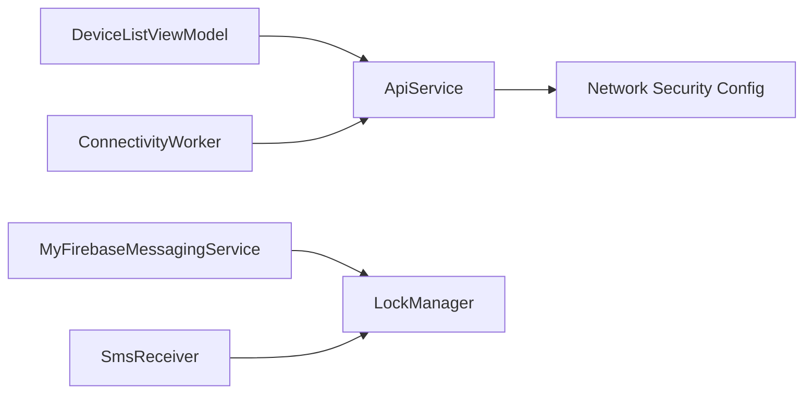

# Secure Communication

<cite>
**Referenced Files in This Document**
- [network_security_config.xml](file://app/src/main/res/xml/network_security_config.xml)
- [AndroidManifest.xml](file://app/src/main/AndroidManifest.xml)
- [ApiService.kt (app)](file://app/src/main/java/com/pksafe/lock/manager/data/ApiService.kt)
- [Constants.kt](file://app/src/main/java/com/pksafe/lock/manager/util/Constants.kt)
- [DeviceListViewModel.kt](file://app/src/main/java/com/pksafe/lock/manager/ui/devices/DeviceListViewModel.kt)
- [ConnectivityWorker.kt](file://app/src/main/java/com/pksafe/lock/manager/service/ConnectivityWorker.kt)
- [MyFirebaseMessagingService.kt](file://app/src/main/java/com/pksafe/lock/manager/service/MyFirebaseMessagingService.kt)
- [SmsReceiver.kt](file://app/src/main/java/com/pksafe/lock/manager/receiver/SmsReceiver.kt)
- [LockManager.kt](file://app/src/main/java/com/pksafe/lock/manager/util/LockManager.kt)
</cite>

## Table of Contents
1. Introduction
2. Project Structure
3. Core Components
4. Architecture Overview
5. Detailed Component Analysis
6. Dependency Analysis
7. Performance Considerations
8. Troubleshooting Guide
9. Conclusion

## Introduction
This document explains PK Locker’s secure communication protocols between the mobile device and backend servers. It covers network security configuration, Retrofit-based API client usage with authentication headers, Firebase Cloud Messaging for secure push notifications and real-time device control, and offline SMS command processing with SHA-256 code validation. It also addresses certificate trust, hostname verification, and protection against man-in-the-middle attacks, along with examples and troubleshooting guidance while maintaining security standards.

## Project Structure
PK Locker implements a layered approach:
- Network security is enforced via Android’s network security configuration to allow HTTPS by default and limited cleartext only for local/private ranges used for device-to-device locker communication.
- The API layer uses Retrofit interfaces with Authorization headers for authenticated requests.
- Background services handle FCM commands and periodic connectivity checks.
- An SMS receiver processes offline lock/unlock commands using deterministic codes derived from IMEI.

**Diagram sources**
- [ApiService.kt (app):11-185](file://app/src/main/java/com/pksafe/lock/manager/data/ApiService.kt#L11-L185)
- [network_security_config.xml:9-27](file://app/src/main/res/xml/network_security_config.xml#L9-L27)
- [Constants.kt:3-10](file://app/src/main/java/com/pksafe/lock/manager/util/Constants.kt#L3-L10)
- [MyFirebaseMessagingService.kt:20-224](file://app/src/main/java/com/pksafe/lock/manager/service/MyFirebaseMessagingService.kt#L20-L224)
- [SmsReceiver.kt:29-163](file://app/src/main/java/com/pksafe/lock/manager/receiver/SmsReceiver.kt#L29-L163)
- [ConnectivityWorker.kt:15-71](file://app/src/main/java/com/pksafe/lock/manager/service/ConnectivityWorker.kt#L15-L71)

**Section sources**
- [network_security_config.xml:9-27](file://app/src/main/res/xml/network_security_config.xml#L9-L27)
- [AndroidManifest.xml:36-46](file://app/src/main/AndroidManifest.xml#L36-L46)
- [Constants.kt:3-10](file://app/src/main/java/com/pksafe/lock/manager/util/Constants.kt#L3-L10)

## Core Components
- Network Security Configuration: Enforces HTTPS by default and allows HTTP only for private/local IP ranges and localhost for device-to-device communication.
- Retrofit API Client: Defines endpoints for authentication, device management, EMI, key orders, and admin controls; all protected endpoints require an Authorization header.
- Firebase Cloud Messaging: Receives remote commands to lock/unlock devices, toggle hardware features, block apps, and deregister devices.
- SMS Command Processing: Validates offline lock/unlock messages using SHA-256 codes derived from IMEI.
- Lock Manager: Applies Device Policy Manager restrictions and enforces device state changes based on commands.

**Section sources**
- [ApiService.kt (app):11-185](file://app/src/main/java/com/pksafe/lock/manager/data/ApiService.kt#L11-L185)
- [MyFirebaseMessagingService.kt:20-224](file://app/src/main/java/com/pksafe/lock/manager/service/MyFirebaseMessagingService.kt#L20-L224)
- [SmsReceiver.kt:29-163](file://app/src/main/java/com/pksafe/lock/manager/receiver/SmsReceiver.kt#L29-L163)
- [LockManager.kt:110-192](file://app/src/main/java/com/pksafe/lock/manager/util/LockManager.kt#L110-L192)

## Architecture Overview
The system ensures secure communication through multiple layers:
- HTTPS enforcement via Android network security configuration.
- Authentication tokens passed as Authorization headers in Retrofit calls.
- FCM delivers secure, server-initiated commands that trigger local enforcement via LockManager.
- Offline SMS commands use deterministic codes validated locally without internet.

**Diagram sources**
- [DeviceListViewModel.kt:173-195](file://app/src/main/java/com/pksafe/lock/manager/ui/devices/DeviceListViewModel.kt#L173-L195)
- [ApiService.kt (app):58-63](file://app/src/main/java/com/pksafe/lock/manager/data/ApiService.kt#L58-L63)
- [network_security_config.xml:9-27](file://app/src/main/res/xml/network_security_config.xml#L9-L27)
- [MyFirebaseMessagingService.kt:20-224](file://app/src/main/java/com/pksafe/lock/manager/service/MyFirebaseMessagingService.kt#L20-L224)
- [LockManager.kt:110-192](file://app/src/main/java/com/pksafe/lock/manager/util/LockManager.kt#L110-L192)

## Detailed Component Analysis

### Network Security Configuration
- Base policy denies cleartext traffic globally and trusts system certificates.
- Domain-specific exceptions permit HTTP for private IP ranges and localhost to support device-to-device locker communication and local development APIs.
- Manifest references the network security configuration file.

Security implications:
- Prevents accidental HTTP usage for production endpoints.
- Limits cleartext to controlled local networks, reducing exposure to MITM risks on public networks.

**Section sources**
- [network_security_config.xml:9-27](file://app/src/main/res/xml/network_security_config.xml#L9-L27)
- [AndroidManifest.xml:36-46](file://app/src/main/AndroidManifest.xml#L36-L46)

### Retrofit-Based API Client
- Endpoints are defined for authentication, device registration, listing, stats, locking/unlocking, advanced controls, token updates, SIM change notifications, location updates, EMI management, key orders, and admin approvals.
- Protected endpoints require an Authorization header with a Bearer token.
- Base URL points to a production HTTPS endpoint.

Authentication and error handling:
- Tokens are retrieved from shared preferences and injected into the Authorization header.
- View models handle success/failure logging and refresh device lists after successful actions.

Example secure API call flow:
- ViewModel constructs a Retrofit instance using the base URL and creates ApiService.
- Calls sendAdvancedControl with Bearer token and payload.
- Logs success or failure and refreshes device state.

**Section sources**
- [ApiService.kt (app):11-185](file://app/src/main/java/com/pksafe/lock/manager/data/ApiService.kt#L11-L185)
- [Constants.kt:3-10](file://app/src/main/java/com/pksafe/lock/manager/util/Constants.kt#L3-L10)
- [DeviceListViewModel.kt:173-195](file://app/src/main/java/com/pksafe/lock/manager/ui/devices/DeviceListViewModel.kt#L173-L195)

### Firebase Cloud Messaging Integration
- MyFirebaseMessagingService receives RemoteMessage payloads containing commands like lock, unlock, hardware_block, app_block, unlock_all, deregister, and request_data.
- Administrative devices ignore remote lock signals to prevent self-locking.
- Commands update local state via LockManager and persist settings in SharedPreferences.
- Full-screen notifications and wake locks ensure critical lock events are visible even when the app is backgrounded.

Security considerations:
- Commands are processed locally based on server-provided data; ensure server-side validation and authorization before sending commands.
- Deregistration clears all restrictions and removes Device Admin/Owner privileges safely.

**Diagram sources**
- [MyFirebaseMessagingService.kt:20-224](file://app/src/main/java/com/pksafe/lock/manager/service/MyFirebaseMessagingService.kt#L20-L224)
- [LockManager.kt:110-192](file://app/src/main/java/com/pksafe/lock/manager/util/LockManager.kt#L110-L192)

**Section sources**
- [MyFirebaseMessagingService.kt:20-224](file://app/src/main/java/com/pksafe/lock/manager/service/MyFirebaseMessagingService.kt#L20-L224)

### SMS Command Processing with SHA-256 Validation
- SmsReceiver handles incoming SMS messages and validates commands for lock/unlock operations.
- Valid codes are either stored in SharedPreferences (from backend provisioning) or generated deterministically using SHA-256 of “LOCK_{imei}” and “UNLOCK_{imei}”.
- Only customer devices process these commands; administrative devices ignore them.
- Upon valid command, the receiver triggers LockManager to enforce device state changes.

Security benefits:
- Deterministic code generation ensures offline operation without exposing secrets.
- Abort broadcast hides SMS from default apps to prevent user tampering.

**Diagram sources**
- [SmsReceiver.kt:29-163](file://app/src/main/java/com/pksafe/lock/manager/receiver/SmsReceiver.kt#L29-L163)
- [LockManager.kt:110-192](file://app/src/main/java/com/pksafe/lock/manager/util/LockManager.kt#L110-L192)

**Section sources**
- [SmsReceiver.kt:29-163](file://app/src/main/java/com/pksafe/lock/manager/receiver/SmsReceiver.kt#L29-L163)

### Certificate Validation and Hostname Verification
- Android’s network security configuration trusts system certificates by default, enabling standard TLS validation and hostname verification for HTTPS endpoints.
- Cleartext is disabled globally except for specified private/local domains, mitigating downgrade attacks.
- Production API base URL uses HTTPS, ensuring encrypted transport.

Recommendations:
- Consider adding certificate pinning for high-security endpoints to further reduce MITM risk.
- Monitor certificate expiration and rotate CA roots as needed.

**Section sources**
- [network_security_config.xml:9-27](file://app/src/main/res/xml/network_security_config.xml#L9-L27)
- [Constants.kt:3-10](file://app/src/main/java/com/pksafe/lock/manager/util/Constants.kt#L3-L10)

## Dependency Analysis
Key dependencies and relationships:
- DeviceListViewModel depends on Retrofit ApiService for device control and status updates.
- ConnectivityWorker periodically reports device status to the backend using ApiService.
- MyFirebaseMessagingService depends on LockManager to enforce commands.
- SmsReceiver depends on LockManager for offline lock/unlock enforcement.
- All network calls rely on Android’s network security configuration for transport security.

**Diagram sources**
- [DeviceListViewModel.kt:173-195](file://app/src/main/java/com/pksafe/lock/manager/ui/devices/DeviceListViewModel.kt#L173-L195)
- [ConnectivityWorker.kt:15-71](file://app/src/main/java/com/pksafe/lock/manager/service/ConnectivityWorker.kt#L15-L71)
- [MyFirebaseMessagingService.kt:20-224](file://app/src/main/java/com/pksafe/lock/manager/service/MyFirebaseMessagingService.kt#L20-L224)
- [SmsReceiver.kt:29-163](file://app/src/main/java/com/pksafe/lock/manager/receiver/SmsReceiver.kt#L29-L163)
- [network_security_config.xml:9-27](file://app/src/main/res/xml/network_security_config.xml#L9-L27)

**Section sources**
- [DeviceListViewModel.kt:173-195](file://app/src/main/java/com/pksafe/lock/manager/ui/devices/DeviceListViewModel.kt#L173-L195)
- [ConnectivityWorker.kt:15-71](file://app/src/main/java/com/pksafe/lock/manager/service/ConnectivityWorker.kt#L15-L71)
- [MyFirebaseMessagingService.kt:20-224](file://app/src/main/java/com/pksafe/lock/manager/service/MyFirebaseMessagingService.kt#L20-L224)
- [SmsReceiver.kt:29-163](file://app/src/main/java/com/pksafe/lock/manager/receiver/SmsReceiver.kt#L29-L163)

## Performance Considerations
- Use Retrofit with Gson for efficient serialization/deserialization.
- Avoid unnecessary network calls; batch updates where possible.
- Leverage background workers (ConnectivityWorker) for periodic syncs to minimize main-thread overhead.
- Ensure FCM commands are lightweight and idempotent to reduce processing time.

[No sources needed since this section provides general guidance]

## Troubleshooting Guide
Common issues and resolutions:
- HTTPS connection failures: Verify network security configuration and ensure the device trusts the server’s certificate chain. Check for misconfigured domain exceptions.
- Authentication errors: Confirm that Authorization headers include valid Bearer tokens and that tokens are refreshed when expired.
- FCM not receiving commands: Ensure the service is registered in the manifest and that permissions are granted. Check logs for RemoteMessage parsing errors.
- SMS commands ignored: Verify that the device is marked as customer and that IMEIs are present in SharedPreferences. Confirm that codes match expected values.
- Lock/unlock not applied: Ensure Device Admin/Device Owner privileges are active and that LockManager methods execute without exceptions.

**Section sources**
- [network_security_config.xml:9-27](file://app/src/main/res/xml/network_security_config.xml#L9-L27)
- [ApiService.kt (app):11-185](file://app/src/main/java/com/pksafe/lock/manager/data/ApiService.kt#L11-L185)
- [MyFirebaseMessagingService.kt:20-224](file://app/src/main/java/com/pksafe/lock/manager/service/MyFirebaseMessagingService.kt#L20-L224)
- [SmsReceiver.kt:29-163](file://app/src/main/java/com/pksafe/lock/manager/receiver/SmsReceiver.kt#L29-L163)
- [LockManager.kt:110-192](file://app/src/main/java/com/pksafe/lock/manager/util/LockManager.kt#L110-L192)

## Conclusion
PK Locker employs a robust, multi-layered approach to secure communication:
- HTTPS enforcement with selective cleartext exceptions for controlled local networks.
- Retrofit-based API calls secured with Authorization headers.
- FCM-driven real-time device control with safe administrative overrides.
- Offline SMS commands validated using deterministic SHA-256 codes.
These measures collectively protect data transmission and device integrity while supporting both online and offline operational modes.

[No sources needed since this section summarizes without analyzing specific files]