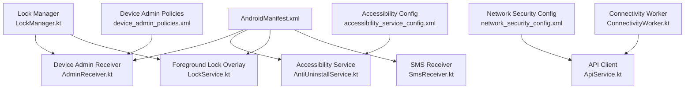
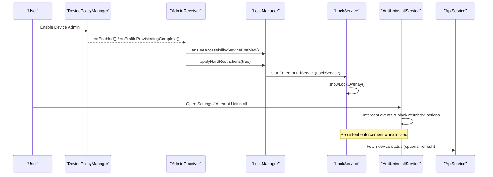
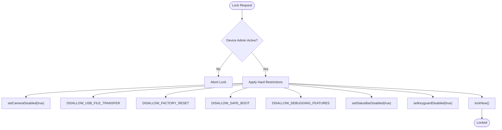
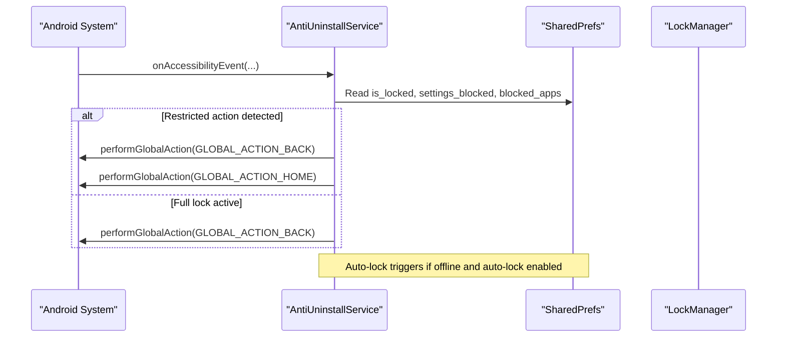
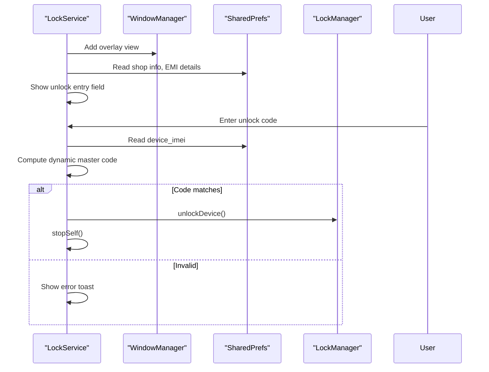
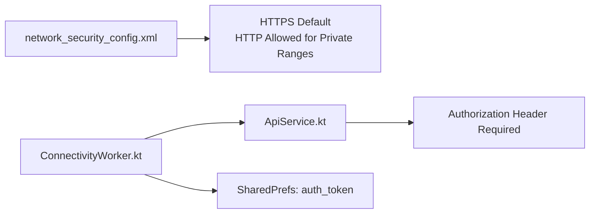
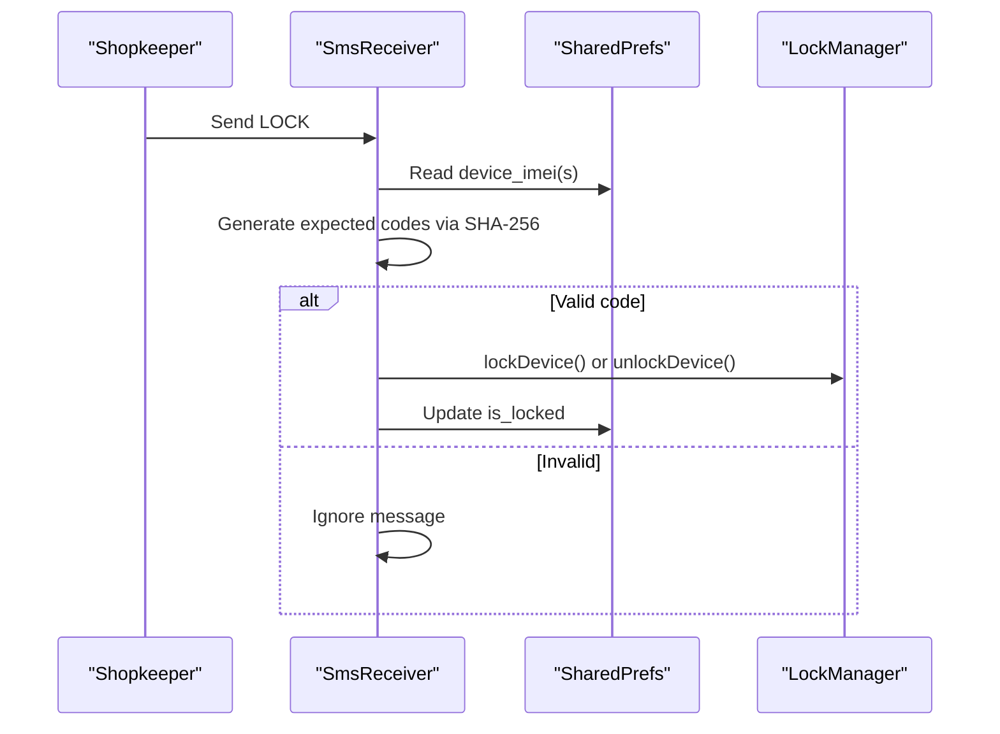
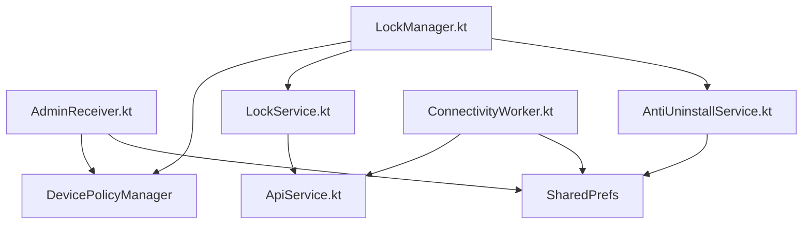

# Security Implementation

<cite>
**Referenced Files in This Document**
- [AndroidManifest.xml](file://app/src/main/AndroidManifest.xml)
- [device_admin_policies.xml](file://app/src/main/res/xml/device_admin_policies.xml)
- [accessibility_service_config.xml](file://app/src/main/res/xml/accessibility_service_config.xml)
- [network_security_config.xml](file://app/src/main/res/xml/network_security_config.xml)
- [AdminReceiver.kt](file://app/src/main/java/com/pksafe/lock/manager/receiver/AdminReceiver.kt)
- [AntiUninstallService.kt](file://app/src/main/java/com/pksafe/lock/manager/service/AntiUninstallService.kt)
- [LockManager.kt](file://app/src/main/java/com/pksafe/lock/manager/util/LockManager.kt)
- [LockService.kt](file://app/src/main/java/com/pksafe/lock/manager/service/LockService.kt)
- [SmsReceiver.kt](file://app/src/main/java/com/pksafe/lock/manager/receiver/SmsReceiver.kt)
- [ApiService.kt](file://app/src/main/java/com/pksafe/lock/manager/data/ApiService.kt)
- [ConnectivityWorker.kt](file://app/src/main/java/com/pksafe/lock/manager/service/ConnectivityWorker.kt)
</cite>

## Table of Contents
1. Introduction
2. Project Structure
3. Core Components
4. Architecture Overview
5. Detailed Component Analysis
6. Dependency Analysis
7. Performance Considerations
8. Troubleshooting Guide
9. Conclusion
10. Appendices

## Introduction
This document explains PK Locker’s multi-layered security implementation that protects device integrity and data confidentiality on Android devices. It covers hardware restriction controls via the Android Device Policy Manager, anti-uninstall protections using Accessibility Services and Device Administrator privileges, secure communication and storage practices, authentication mechanisms for sensitive operations, system modification prevention, tamper detection strategies, and enterprise-grade configuration guidance.

## Project Structure
PK Locker organizes security-related logic across receivers, services, utilities, and configuration resources:
- Receivers handle provisioning events, SMS-based lock/unlock, SIM state changes, and boot-time recovery.
- Services provide persistent foreground overlays, accessibility-based UI interception, and background connectivity monitoring.
- Utilities centralize policy enforcement, overlay management, and device owner capabilities.
- XML resources define device admin policies, accessibility service behavior, and network security rules.

**Diagram sources**
- [AndroidManifest.xml:73-112](file://app/src/main/AndroidManifest.xml#L73-L112)
- [AdminReceiver.kt:14-41](file://app/src/main/java/com/pksafe/lock/manager/receiver/AdminReceiver.kt#L14-L41)
- [AntiUninstallService.kt:22-80](file://app/src/main/java/com/pksafe/lock/manager/service/AntiUninstallService.kt#L22-L80)
- [LockService.kt:41-80](file://app/src/main/java/com/pksafe/lock/manager/service/LockService.kt#L41-L80)
- [SmsReceiver.kt:29-44](file://app/src/main/java/com/pksafe/lock/manager/receiver/SmsReceiver.kt#L29-L44)
- [network_security_config.xml:9-27](file://app/src/main/res/xml/network_security_config.xml#L9-L27)
- [device_admin_policies.xml:1-12](file://app/src/main/res/xml/device_admin_policies.xml#L1-L12)
- [accessibility_service_config.xml:1-8](file://app/src/main/res/xml/accessibility_service_config.xml#L1-L8)
- [LockManager.kt:27-49](file://app/src/main/java/com/pksafe/lock/manager/util/LockManager.kt#L27-L49)
- [ApiService.kt:11-109](file://app/src/main/java/com/pksafe/lock/manager/data/ApiService.kt#L11-L109)
- [ConnectivityWorker.kt:15-47](file://app/src/main/java/com/pksafe/lock/manager/service/ConnectivityWorker.kt#L15-L47)

**Section sources**
- [AndroidManifest.xml:5-23](file://app/src/main/AndroidManifest.xml#L5-L23)
- [AndroidManifest.xml:73-112](file://app/src/main/AndroidManifest.xml#L73-L112)
- [device_admin_policies.xml:1-12](file://app/src/main/res/xml/device_admin_policies.xml#L1-L12)
- [accessibility_service_config.xml:1-8](file://app/src/main/res/xml/accessibility_service_config.xml#L1-L8)
- [network_security_config.xml:9-27](file://app/src/main/res/xml/network_security_config.xml#L9-L27)

## Core Components
- Device Policy Manager integration enforces hardware restrictions (camera disablement, USB file transfer blocking, factory reset prevention, safe mode blocking, debugging features blocking), status bar control, and keyguard behavior.
- Anti-uninstall protection uses an Accessibility Service to intercept settings navigation and block keywords related to uninstallation or disabling security features.
- Foreground lock overlay ensures a persistent, tamper-resistant UI with keyboard handling and back/home/recents interception.
- Offline SMS-based lock/unlock provides a resilient control channel without internet.
- Network security configuration restricts cleartext traffic by default and allows it only for private LAN ranges used for local device-to-device communication.

**Section sources**
- [LockManager.kt:150-200](file://app/src/main/java/com/pksafe/lock/manager/util/LockManager.kt#L150-L200)
- [AntiUninstallService.kt:22-80](file://app/src/main/java/com/pksafe/lock/manager/service/AntiUninstallService.kt#L22-L80)
- [LockService.kt:125-168](file://app/src/main/java/com/pksafe/lock/manager/service/LockService.kt#L125-L168)
- [SmsReceiver.kt:29-44](file://app/src/main/java/com/pksafe/lock/manager/receiver/SmsReceiver.kt#L29-L44)
- [network_security_config.xml:9-27](file://app/src/main/res/xml/network_security_config.xml#L9-L27)

## Architecture Overview
PK Locker combines OS-level device administration, accessibility interception, and a persistent overlay to enforce security policies. The flow begins with device provisioning and admin activation, followed by continuous monitoring and enforcement through services and workers.

**Diagram sources**
- [AdminReceiver.kt:16-36](file://app/src/main/java/com/pksafe/lock/manager/receiver/AdminReceiver.kt#L16-L36)
- [LockManager.kt:81-108](file://app/src/main/java/com/pksafe/lock/manager/util/LockManager.kt#L81-L108)
- [LockManager.kt:111-134](file://app/src/main/java/com/pksafe/lock/manager/util/LockManager.kt#L111-L134)
- [LockService.kt:54-80](file://app/src/main/java/com/pksafe/lock/manager/service/LockService.kt#L54-L80)
- [AntiUninstallService.kt:136-211](file://app/src/main/java/com/pksafe/lock/manager/service/AntiUninstallService.kt#L136-L211)
- [ApiService.kt:101-109](file://app/src/main/java/com/pksafe/lock/manager/data/ApiService.kt#L101-L109)

## Detailed Component Analysis

### Device Policy Manager Controls
- Camera disablement is enforced when locking to prevent media capture.
- USB file transfer, factory reset, safe mode, and debugging features are blocked via user restrictions when device owner privileges are active.
- Status bar expansion can be disabled to reduce bypass vectors.
- Keyguard behavior is adjusted to present the custom lock overlay directly.

**Diagram sources**
- [LockManager.kt:150-192](file://app/src/main/java/com/pksafe/lock/manager/util/LockManager.kt#L150-L192)
- [LockManager.kt:111-134](file://app/src/main/java/com/pksafe/lock/manager/util/LockManager.kt#L111-L134)

**Section sources**
- [LockManager.kt:150-200](file://app/src/main/java/com/pksafe/lock/manager/util/LockManager.kt#L150-L200)
- [device_admin_policies.xml:1-12](file://app/src/main/res/xml/device_admin_policies.xml#L1-L12)

### Anti-Uninstall Protection (Accessibility Service)
- Intercepts window state changes and extracts visible text to detect attempts to access settings or uninstall flows.
- Blocks navigation to restricted screens and returns to home when restricted actions are detected.
- Supports dynamic app blocking based on known package mappings and user-configured keys.
- Ensures service running state is verified via system settings and AccessibilityManager.

**Diagram sources**
- [AntiUninstallService.kt:136-211](file://app/src/main/java/com/pksafe/lock/manager/service/AntiUninstallService.kt#L136-L211)
- [AntiUninstallService.kt:88-117](file://app/src/main/java/com/pksafe/lock/manager/service/AntiUninstallService.kt#L88-L117)

**Section sources**
- [AntiUninstallService.kt:22-80](file://app/src/main/java/com/pksafe/lock/manager/service/AntiUninstallService.kt#L22-L80)
- [AntiUninstallService.kt:136-211](file://app/src/main/java/com/pksafe/lock/manager/service/AntiUninstallService.kt#L136-L211)
- [accessibility_service_config.xml:1-8](file://app/src/main/res/xml/accessibility_service_config.xml#L1-L8)

### Foreground Lock Overlay and Authentication
- Runs as a foreground service with a persistent notification to resist termination.
- Displays an overlay that blocks back/home/recents and captures numeric input for unlock codes.
- Uses a dynamic master code derived from the last six digits of the stored IMEI; falls back to a hardcoded value if IMEI is invalid.
- Integrates with LockManager to remove hardware restrictions upon successful unlock.

**Diagram sources**
- [LockService.kt:54-80](file://app/src/main/java/com/pksafe/lock/manager/service/LockService.kt#L54-L80)
- [LockService.kt:125-168](file://app/src/main/java/com/pksafe/lock/manager/service/LockService.kt#L125-L168)
- [LockService.kt:189-218](file://app/src/main/java/com/pksafe/lock/manager/service/LockService.kt#L189-L218)
- [LockManager.kt:136-148](file://app/src/main/java/com/pksafe/lock/manager/util/LockManager.kt#L136-L148)

**Section sources**
- [LockService.kt:54-80](file://app/src/main/java/com/pksafe/lock/manager/service/LockService.kt#L54-L80)
- [LockService.kt:125-168](file://app/src/main/java/com/pksafe/lock/manager/service/LockService.kt#L125-L168)
- [LockService.kt:189-218](file://app/src/main/java/com/pksafe/lock/manager/service/LockService.kt#L189-L218)

### Secure Communication Protocols
- Network security configuration disables cleartext by default and permits HTTP only for private IP ranges and localhost used for local device-to-device communication.
- API client uses Retrofit endpoints requiring Authorization headers for authenticated requests.
- Connectivity worker periodically reports device status and can trigger local lock if offline beyond a threshold.

**Diagram sources**
- [network_security_config.xml:9-27](file://app/src/main/res/xml/network_security_config.xml#L9-L27)
- [ApiService.kt:11-109](file://app/src/main/java/com/pksafe/lock/manager/data/ApiService.kt#L11-L109)
- [ConnectivityWorker.kt:15-47](file://app/src/main/java/com/pksafe/lock/manager/service/ConnectivityWorker.kt#L15-L47)

**Section sources**
- [network_security_config.xml:9-27](file://app/src/main/res/xml/network_security_config.xml#L9-L27)
- [ApiService.kt:11-109](file://app/src/main/java/com/pksafe/lock/manager/data/ApiService.kt#L11-L109)
- [ConnectivityWorker.kt:15-47](file://app/src/main/java/com/pksafe/lock/manager/service/ConnectivityWorker.kt#L15-L47)

### Encrypted Data Storage and Local Persistence
- Sensitive operational flags and identifiers are stored in SharedPreferences (e.g., device IMEI, lock state, customer flag).
- While not cryptographic encryption, these values are protected by Android’s per-app sandbox and are not backed up by default due to manifest configuration.
- For stronger protection, consider encrypting sensitive fields using Android Keystore-backed encryption before persistence.

**Section sources**
- [AndroidManifest.xml:36-46](file://app/src/main/AndroidManifest.xml#L36-L46)
- [AdminReceiver.kt:78-98](file://app/src/main/java/com/pksafe/lock/manager/receiver/AdminReceiver.kt#L78-L98)
- [LockService.kt:171-188](file://app/src/main/java/com/pksafe/lock/manager/service/LockService.kt#L171-L188)

### Authentication Mechanisms
- SMS-based lock/unlock uses deterministic SHA-256 codes derived from prefixes and device IMEI(s), enabling offline verification without internet.
- Server-side commands require Authorization headers; tokens are read from SharedPrefs.
- Provisioning QR includes device admin component metadata for secure enrollment.

**Diagram sources**
- [SmsReceiver.kt:29-44](file://app/src/main/java/com/pksafe/lock/manager/receiver/SmsReceiver.kt#L29-L44)
- [SmsReceiver.kt:94-141](file://app/src/main/java/com/pksafe/lock/manager/receiver/SmsReceiver.kt#L94-L141)
- [LockManager.kt:111-148](file://app/src/main/java/com/pksafe/lock/manager/util/LockManager.kt#L111-L148)

**Section sources**
- [SmsReceiver.kt:29-44](file://app/src/main/java/com/pksafe/lock/manager/receiver/SmsReceiver.kt#L29-L44)
- [SmsReceiver.kt:94-141](file://app/src/main/java/com/pksafe/lock/manager/receiver/SmsReceiver.kt#L94-L141)
- [ApiService.kt:11-109](file://app/src/main/java/com/pksafe/lock/manager/data/ApiService.kt#L11-L109)

### System Modification Prevention and Tamper Detection
- Device Owner restrictions block factory reset, safe mode, USB file transfer, and debugging features to prevent common bypass techniques.
- Accessibility Service monitors for attempts to access settings or uninstall flows and blocks them.
- Foreground service and overlay persist even if the app is backgrounded; connectivity worker enforces lock if offline too long.

**Section sources**
- [LockManager.kt:150-200](file://app/src/main/java/com/pksafe/lock/manager/util/LockManager.kt#L150-L200)
- [AntiUninstallService.kt:136-211](file://app/src/main/java/com/pksafe/lock/manager/service/AntiUninstallService.kt#L136-L211)
- [ConnectivityWorker.kt:15-47](file://app/src/main/java/com/pksafe/lock/manager/service/ConnectivityWorker.kt#L15-L47)

## Dependency Analysis
The following diagram shows how core components depend on each other and on Android platform services.

**Diagram sources**
- [AdminReceiver.kt:14-41](file://app/src/main/java/com/pksafe/lock/manager/receiver/AdminReceiver.kt#L14-L41)
- [LockManager.kt:27-49](file://app/src/main/java/com/pksafe/lock/manager/util/LockManager.kt#L27-L49)
- [LockService.kt:41-80](file://app/src/main/java/com/pksafe/lock/manager/service/LockService.kt#L41-L80)
- [AntiUninstallService.kt:22-80](file://app/src/main/java/com/pksafe/lock/manager/service/AntiUninstallService.kt#L22-L80)
- [ApiService.kt:11-109](file://app/src/main/java/com/pksafe/lock/manager/data/ApiService.kt#L11-L109)
- [ConnectivityWorker.kt:15-47](file://app/src/main/java/com/pksafe/lock/manager/service/ConnectivityWorker.kt#L15-L47)

**Section sources**
- [AndroidManifest.xml:73-112](file://app/src/main/AndroidManifest.xml#L73-L112)
- [LockManager.kt:27-49](file://app/src/main/java/com/pksafe/lock/manager/util/LockManager.kt#L27-L49)

## Performance Considerations
- Minimize accessibility tree traversal depth; reuse extracted text buffers and avoid excessive logging in production.
- Use WorkManager for periodic connectivity checks to conserve battery and respect system constraints.
- Keep overlay rendering lightweight; avoid heavy image decoding on the main thread.
- Cache API responses locally where appropriate to reduce network overhead.

[No sources needed since this section provides general guidance]

## Troubleshooting Guide
- If device cannot be locked, verify Device Admin is active and permissions granted; check logs for DPM errors during restriction application.
- If overlay does not appear, confirm foreground service started and overlay permission granted; validate WindowManager parameters and focus handling.
- If SMS lock/unlock fails, ensure IMEI(s) are saved and codes match expected SHA-256 derivation; verify broadcast priority and message parsing.
- If network calls fail, review network security configuration and ensure Authorization header is set correctly.

**Section sources**
- [LockManager.kt:150-200](file://app/src/main/java/com/pksafe/lock/manager/util/LockManager.kt#L150-L200)
- [LockService.kt:125-168](file://app/src/main/java/com/pksafe/lock/manager/service/LockService.kt#L125-L168)
- [SmsReceiver.kt:94-141](file://app/src/main/java/com/pksafe/lock/manager/receiver/SmsReceiver.kt#L94-L141)
- [network_security_config.xml:9-27](file://app/src/main/res/xml/network_security_config.xml#L9-L27)

## Conclusion
PK Locker implements a robust, multi-layered security model combining Android Device Policy Manager restrictions, Accessibility-based interception, a persistent lock overlay, and secure communication channels. These layers collectively protect device integrity and data confidentiality, support offline control via SMS, and provide enterprise-ready configuration options for device management scenarios.

[No sources needed since this section summarizes without analyzing specific files]

## Appendices

### Security Policy Configuration Examples
- Device Admin policies include force-lock, password limits, watch-login, reset-password, wipe-data, expire-password, and disable-keyguard-features.
- Accessibility service configured to receive window state/content changes and retrieve interactive windows for interception.
- Network security config sets HTTPS as default and allows HTTP only for private ranges and localhost.

**Section sources**
- [device_admin_policies.xml:1-12](file://app/src/main/res/xml/device_admin_policies.xml#L1-L12)
- [accessibility_service_config.xml:1-8](file://app/src/main/res/xml/accessibility_service_config.xml#L1-L8)
- [network_security_config.xml:9-27](file://app/src/main/res/xml/network_security_config.xml#L9-L27)

### Permission Management Strategies
- Declare minimal required permissions; use Device Owner APIs to grant critical permissions programmatically when possible.
- Restrict overlay usage to necessary contexts and request only when needed.
- Avoid broad permissions unless justified; leverage scoped storage and explicit intent filters.

**Section sources**
- [AndroidManifest.xml:5-23](file://app/src/main/AndroidManifest.xml#L5-L23)
- [AdminReceiver.kt:43-60](file://app/src/main/java/com/pksafe/lock/manager/receiver/AdminReceiver.kt#L43-L60)

### Encryption Standards and Compliance Considerations
- Prefer HTTPS for all server communications; restrict cleartext to private ranges explicitly.
- Store sensitive identifiers in SharedPreferences with awareness of backup exclusions; consider Android Keystore for cryptographic keys.
- For enterprise compliance, ensure audit logging, least privilege, and clear deactivation workflows for releasing device ownership.

**Section sources**
- [network_security_config.xml:9-27](file://app/src/main/res/xml/network_security_config.xml#L9-L27)
- [AndroidManifest.xml:36-46](file://app/src/main/AndroidManifest.xml#L36-L46)
- [LockManager.kt:351-404](file://app/src/main/java/com/pksafe/lock/manager/util/LockManager.kt#L351-L404)