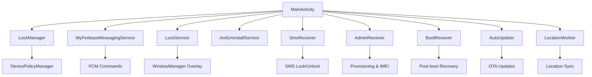
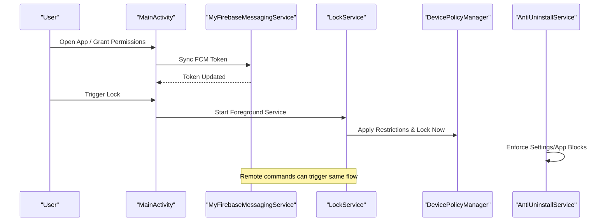
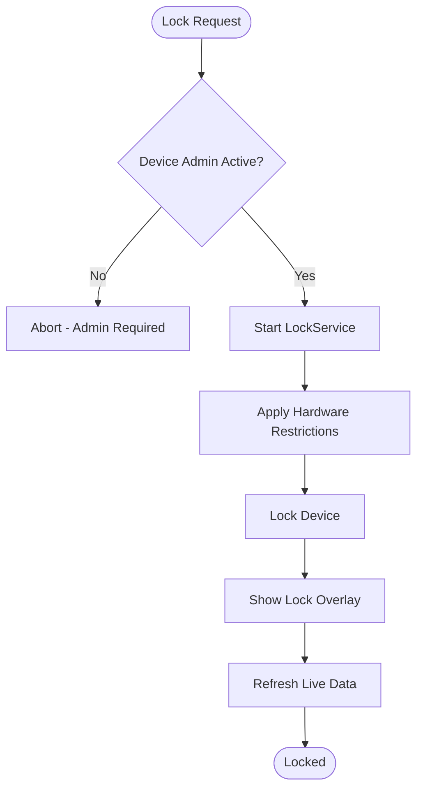
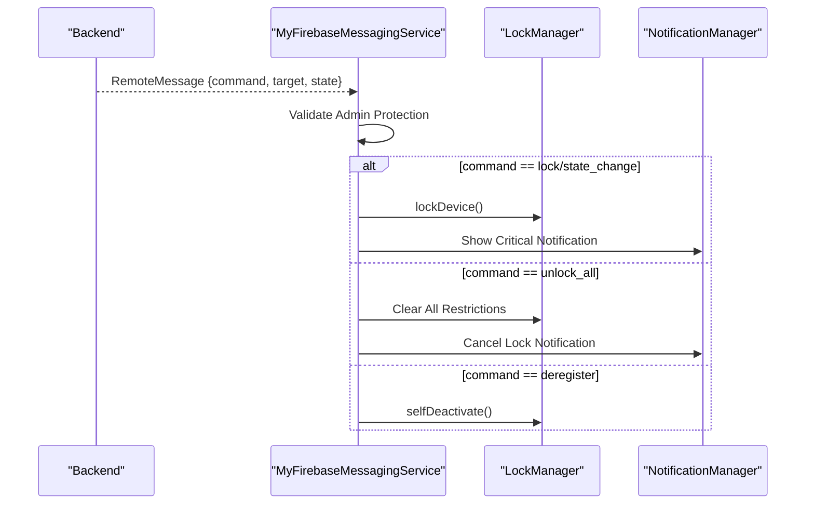
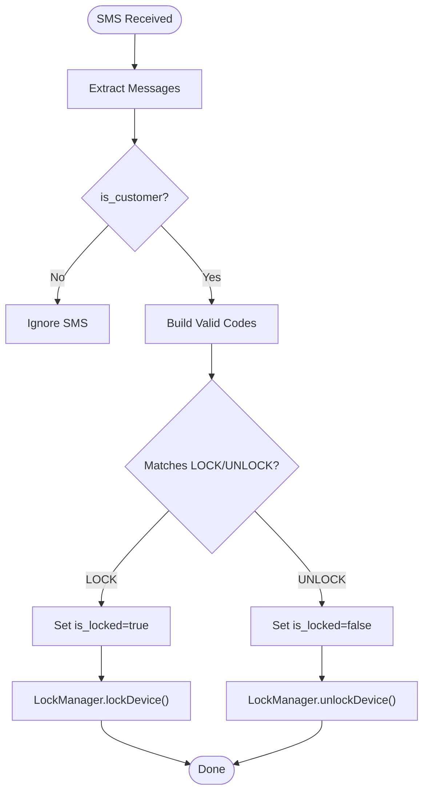
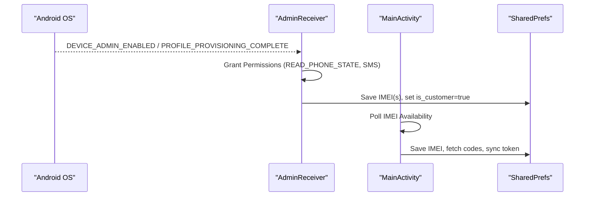
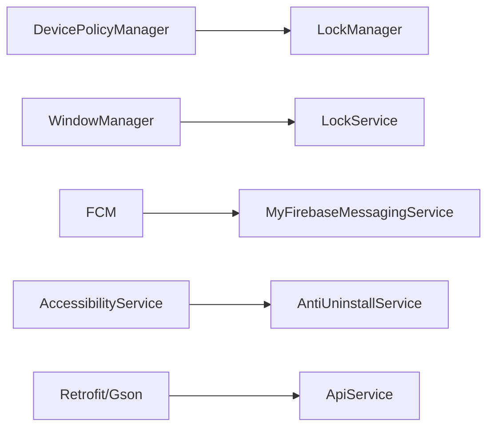

# Troubleshooting & Maintenance

<cite>
**Referenced Files in This Document**
- [AndroidManifest.xml](file://app/src/main/AndroidManifest.xml)
- [MainActivity.kt](file://app/src/main/java/com/pksafe/lock\manager/MainActivity.kt)
- [LockService.kt](file://app/src/main/java/com/pksafe/lock\manager/service/LockService.kt)
- [MyFirebaseMessagingService.kt](file://app/src/main/java/com/pksafe/lock\manager/service/MyFirebaseMessagingService.kt)
- [AntiUninstallService.kt](file://app/src/main/java/com/pksafe/lock\manager/service/AntiUninstallService.kt)
- [LockManager.kt](file://app/src/main/java/com/pksafe/lock\manager/util/LockManager.kt)
- [SmsReceiver.kt](file://app/src/main/java/com/pksafe/lock\manager/receiver/SmsReceiver.kt)
- [AdminReceiver.kt](file://app/src/main/java/com/pksafe/lock\manager/receiver/AdminReceiver.kt)
- [BootReceiver.kt](file://app/src/main/java/com/pksafe/lock\manager/receiver/BootReceiver.kt)
- [ApiService.kt](file://app/src/main/java/com/pksafe/lock\manager/data/ApiService.kt)
- [Constants.kt](file://app/src/main/java/com/pksafe/lock\manager/util/Constants.kt)
- [AutoUpdater.kt](file://app/src/main/java/com/pksafe/lock\manager/util/AutoUpdater.kt)
- [LocationWorker.kt](file://app/src/main/java/com/pksafe/lock\manager/worker/LocationWorker.kt)
</cite>

## Table of Contents
1. Introduction
2. Project Structure
3. Core Components
4. Architecture Overview
5. Detailed Component Analysis
6. Dependency Analysis
7. Performance Considerations
8. Troubleshooting Guide
9. Conclusion
10. Appendices

## Introduction
This document provides comprehensive troubleshooting and maintenance guidance for PK Locker, focusing on diagnosing and resolving common issues during deployment and operation. It covers permission-related failures, connectivity problems, device registration conflicts, provisioning errors, push notification delivery failures, IMEI mismatch issues, overlay permission denials, and more. It also includes step-by-step diagnostic procedures, log analysis techniques, systematic debugging approaches, maintenance procedures for updating device fleets, managing device lifecycles, routine health checks, performance optimization, battery usage considerations, escalation procedures, and support resources.

## Project Structure
PK Locker is an Android application with a layered architecture:
- UI layer (Compose-based screens) orchestrates user flows and state
- Services enforce lock overlays, background tasks, and FCM handling
- Receivers handle boot events, SMS commands, SIM changes, and device admin lifecycle
- Utilities manage device policies, permissions, updates, and configuration
- Data layer defines API endpoints used by the app to communicate with the backend

**Diagram sources**
- [MainActivity.kt:65-124](file://app/src/main/java/com/pksafe/lock\manager/MainActivity.kt#L65-L124)
- [LockManager.kt:27-46](file://app/src/main/java/com/pksafe/lock\manager/util/LockManager.kt#L27-L46)
- [LockService.kt:41-80](file://app/src/main/java/com/pksafe/lock\manager/service/LockService.kt#L41-L80)
- [MyFirebaseMessagingService.kt:20-47](file://app/src/main/java/com/pksafe/lock\manager/service/MyFirebaseMessagingService.kt#L20-L47)
- [AntiUninstallService.kt:22-80](file://app/src/main/java/com/pksafe/lock\manager/service/AntiUninstallService.kt#L22-L80)
- [SmsReceiver.kt:29-44](file://app/src/main/java/com/pksafe/lock\manager/receiver/SmsReceiver.kt#L29-L44)
- [AdminReceiver.kt:14-36](file://app/src/main/java/com/pksafe/lock\manager/receiver/AdminReceiver.kt#L14-L36)
- [BootReceiver.kt:10-25](file://app/src/main/java/com/pksafe/lock\manager/receiver/BootReceiver.kt#L10-L25)
- [AutoUpdater.kt:29-77](file://app/src/main/java/com/pksafe/lock\manager/util/AutoUpdater.kt#L29-L77)
- [LocationWorker.kt:18-69](file://app/src/main/java/com/pksafe/lock\manager/worker/LocationWorker.kt#L18-L69)

**Section sources**
- [AndroidManifest.xml:1-160](file://app/src/main/AndroidManifest.xml#L1-L160)
- [MainActivity.kt:65-124](file://app/src/main/java/com/pksafe/lock\manager/MainActivity.kt#L65-L124)

## Core Components
- MainActivity: Entry point; handles deep links, permission prompts, startup refresh, FCM token sync, and navigation between customer/admin flows.
- LockService: Foreground service that renders the persistent lock overlay, enforces hardware restrictions via Device Policy Manager, and refreshes live data from the server.
- MyFirebaseMessagingService: Processes remote commands (lock/unlock, hardware blocks, app blocking, unlock-all, deregister), triggers full-screen notifications, and manages wake locks.
- AntiUninstallService: Accessibility guard that prevents unauthorized settings access, blocks apps, and auto-locks on network loss when enabled.
- LockManager: Central utility for device policy enforcement, overlay/admin requests, permanent restrictions, and self-deactivation.
- SmsReceiver: Offline lock/unlock via SMS using deterministic codes derived from IMEI or server-provided codes.
- AdminReceiver: Handles device admin enablement/profile provisioning completion and IMEI capture.
- BootReceiver: Restarts lock services after reboot if conditions are met.
- AutoUpdater: Checks for new versions and performs silent installation via PackageInstaller.
- LocationWorker: Periodically captures and reports device location to the backend.

**Section sources**
- [MainActivity.kt:126-445](file://app/src/main/java/com/pksafe/lock\manager/MainActivity.kt#L126-L445)
- [LockService.kt:41-330](file://app/src/main/java/com/pksafe/lock\manager/service/LockService.kt#L41-L330)
- [MyFirebaseMessagingService.kt:20-309](file://app/src/main/java/com/pksafe/lock\manager/service/MyFirebaseMessagingService.kt#L20-L309)
- [AntiUninstallService.kt:22-224](file://app/src/main/java/com/pksafe/lock\manager/service/AntiUninstallService.kt#L22-L224)
- [LockManager.kt:27-406](file://app/src/main/java/com/pksafe/lock\manager/util/LockManager.kt#L27-L406)
- [SmsReceiver.kt:29-164](file://app/src/main/java/com/pksafe/lock\manager/receiver/SmsReceiver.kt#L29-L164)
- [AdminReceiver.kt:14-104](file://app/src/main/java/com/pksafe/lock\manager/receiver/AdminReceiver.kt#L14-L104)
- [BootReceiver.kt:10-25](file://app/src/main/java/com/pksafe/lock\manager/receiver/BootReceiver.kt#L10-L25)
- [AutoUpdater.kt:29-151](file://app/src/main/java/com/pksafe/lock\manager/util/AutoUpdater.kt#L29-L151)
- [LocationWorker.kt:18-70](file://app/src/main/java/com/pksafe/lock\manager/worker/LocationWorker.kt#L18-L70)

## Architecture Overview
The system integrates multiple Android subsystems to enforce security and manage device lifecycle:
- UI triggers actions and displays status
- Services run foreground overlays and process FCM commands
- Receivers react to system events and messages
- Utilities apply enterprise-level restrictions and manage updates
- Data layer communicates with the backend for device control and telemetry

**Diagram sources**
- [MainActivity.kt:334-353](file://app/src/main/java/com/pksafe/lock\manager/MainActivity.kt#L334-L353)
- [MyFirebaseMessagingService.kt:47-68](file://app/src/main/java/com/pksafe/lock\manager/service/MyFirebaseMessagingService.kt#L47-L68)
- [LockService.kt:111-134](file://app/src/main/java/com/pksafe/lock\manager/util/LockManager.kt#L111-L134)
- [AntiUninstallService.kt:136-211](file://app/src/main/java/com/pksafe/lock\manager/service/AntiUninstallService.kt#L136-L211)

## Detailed Component Analysis

### Lock Enforcement Flow
- LockManager coordinates starting the foreground LockService, applying hardware restrictions, and locking the device.
- LockService creates a persistent overlay, binds necessary flags to allow input and interaction, and refreshes live data from the backend.
- AntiUninstallService monitors accessibility events to block unauthorized actions and supports auto-lock on connectivity loss.

**Diagram sources**
- [LockManager.kt:111-134](file://app/src/main/java/com/pksafe/lock\manager/util/LockManager.kt#L111-L134)
- [LockService.kt:125-234](file://app/src/main/java/com/pksafe/lock\manager/service/LockService.kt#L125-L234)

**Section sources**
- [LockManager.kt:111-192](file://app/src/main/java/com/pksafe/lock\manager/util/LockManager.kt#L111-L192)
- [LockService.kt:54-234](file://app/src/main/java/com/pksafe/lock\manager/service/LockService.kt#L54-L234)
- [AntiUninstallService.kt:82-117](file://app/src/main/java/com/pksafe/lock\manager/service/AntiUninstallService.kt#L82-L117)

### FCM Command Handling
- MyFirebaseMessagingService processes commands like lock/unlock, hardware blocks, app blocking, unlock-all, and deregister.
- It ensures administrative devices are not affected by remote locking commands and uses wake locks and full-screen notifications to ensure visibility.

**Diagram sources**
- [MyFirebaseMessagingService.kt:22-224](file://app/src/main/java/com/pksafe/lock\manager/service/MyFirebaseMessagingService.kt#L22-L224)
- [LockManager.kt:351-404](file://app/src/main/java/com/pksafe/lock\manager/util/LockManager.kt#L351-L404)

**Section sources**
- [MyFirebaseMessagingService.kt:22-224](file://app/src/main/java/com/pksafe/lock\manager/service/MyFirebaseMessagingService.kt#L22-L224)

### SMS-Based Offline Lock/Unlock
- SmsReceiver validates incoming SMS against deterministic codes generated from IMEI or server-provided codes.
- On valid commands, it sets the lock state and invokes LockManager to enforce lock/unlock.

**Diagram sources**
- [SmsReceiver.kt:44-143](file://app/src/main/java/com/pksafe/lock\manager/receiver/SmsReceiver.kt#L44-L143)
- [LockManager.kt:111-148](file://app/src/main/java/com/pksafe/lock\manager/util/LockManager.kt#L111-L148)

**Section sources**
- [SmsReceiver.kt:44-164](file://app/src/main/java/com/pksafe/lock\manager/receiver/SmsReceiver.kt#L44-L164)

### Provisioning and IMEI Capture
- AdminReceiver handles device admin enablement and profile provisioning completion, granting critical permissions and capturing IMEI(s).
- MainActivity polls for IMEI availability and saves it to preferences, triggering server sync and offline code generation.

**Diagram sources**
- [AdminReceiver.kt:16-36](file://app/src/main/java/com/pksafe/lock\manager/receiver/AdminReceiver.kt#L16-L36)
- [AdminReceiver.kt:43-102](file://app/src/main/java/com/pksafe/lock\manager/receiver/AdminReceiver.kt#L43-L102)
- [MainActivity.kt:598-628](file://app/src/main/java/com/pksafe/lock\manager/MainActivity.kt#L598-L628)

**Section sources**
- [AdminReceiver.kt:16-102](file://app/src/main/java/com/pksafe/lock\manager/receiver/AdminReceiver.kt#L16-L102)
- [MainActivity.kt:598-628](file://app/src/main/java/com/pksafe/lock\manager/MainActivity.kt#L598-L628)

### Post-Boot Recovery
- BootReceiver restarts the lock service if device admin is active and overlay permission is granted.

**Section sources**
- [BootReceiver.kt:10-25](file://app/src/main/java/com/pksafe/lock\manager/receiver/BootReceiver.kt#L10-L25)

### OTA Updates
- AutoUpdater checks version endpoint, downloads APK, and installs silently using PackageInstaller. UpdateReceiver handles post-installation callbacks.

**Section sources**
- [AutoUpdater.kt:29-151](file://app/src/main/java/com/pksafe/lock\manager/util/AutoUpdater.kt#L29-L151)

### Location Telemetry
- LocationWorker periodically captures device location and sends it to the backend via ApiService.

**Section sources**
- [LocationWorker.kt:18-70](file://app/src/main/java/com/pksafe/lock\manager/worker/LocationWorker.kt#L18-L70)

## Dependency Analysis
Key runtime dependencies and their roles:
- DevicePolicyManager: Enforces hardware restrictions, app hiding, and device owner features.
- WindowManager: Renders persistent lock overlay with specific flags for input handling and visibility.
- Firebase Cloud Messaging: Delivers remote commands and requires proper channel setup and permissions.
- AccessibilityService: Guards against unauthorized settings access and enforces app blocking.
- Retrofit + Gson: Communicates with backend for device control, telemetry, and update metadata.

**Diagram sources**
- [LockManager.kt:27-46](file://app/src/main/java/com/pksafe/lock\manager/util/LockManager.kt#L27-L46)
- [LockService.kt:125-155](file://app/src/main/java/com/pksafe/lock\manager/service/LockService.kt#L125-L155)
- [MyFirebaseMessagingService.kt:20-47](file://app/src/main/java/com/pksafe/lock\manager/service/MyFirebaseMessagingService.kt#L20-L47)
- [AntiUninstallService.kt:22-80](file://app/src/main/java/com/pksafe/lock\manager/service/AntiUninstallService.kt#L22-L80)
- [ApiService.kt:11-185](file://app/src/main/java/com/pksafe/lock\manager/data/ApiService.kt#L11-L185)

**Section sources**
- [ApiService.kt:11-185](file://app/src/main/java/com/pksafe/lock\manager/data/ApiService.kt#L11-L185)
- [Constants.kt:3-10](file://app/src/main/java/com/pksafe/lock\manager/util/Constants.kt#L3-L10)

## Performance Considerations
- Foreground Service: LockService runs as a foreground service with a high-importance notification channel to minimize background kills. Ensure the channel exists and notification remains ongoing while locked.
- Overlay Input Handling: The overlay uses specific window flags to allow keyboard input and prevent modal blocking. Misconfiguration can cause input issues.
- Network Calls: Background tasks use coroutines and IO dispatchers to avoid blocking UI threads. Ensure timeouts and retries are appropriate for fleet scale.
- Battery Optimization: Avoid excessive polling; prefer WorkManager for periodic tasks like location sync. Use efficient location priorities to balance accuracy and power.
- Memory Management: Reuse views and avoid heavy allocations in overlay rendering. Clean up listeners and receivers in onDestroy to prevent leaks.

[No sources needed since this section provides general guidance]

## Troubleshooting Guide

### Permission-Related Failures
Symptoms:
- Overlay cannot be drawn; lock screen does not appear.
- Cannot start foreground service; crashes or immediate stop.
- Notifications not shown; FCM commands ignored.

Diagnostic Steps:
- Verify SYSTEM_ALERT_WINDOW permission is granted and overlay setting is enabled for the app.
- Confirm FOREGROUND_SERVICE and FOREGROUND_SERVICE_SPECIAL_USE permissions are declared and accepted by the OS.
- Ensure POST_NOTIFICATIONS is granted on supported Android versions.
- Check that the app’s notification channels are created before posting notifications.

Common Fixes:
- Prompt users to grant overlay permission via Settings.ACTION_MANAGE_OVERLAY_PERMISSION.
- For newer Android versions, request notification permission explicitly.
- Validate that the app is not restricted by “Manage app if unused” or similar power-saving features.

Log Indicators:
- Overlay creation exceptions or missing permissions.
- Foreground service start failures due to missing permissions.
- Notification channel creation logs.

**Section sources**
- [AndroidManifest.xml:5-23](file://app/src/main/AndroidManifest.xml#L5-L23)
- [MainActivity.kt:170-274](file://app/src/main/java/com/pksafe/lock\manager/MainActivity.kt#L170-L274)
- [LockService.kt:107-123](file://app/src/main/java/com/pksafe/lock\manager/service/LockService.kt#L107-L123)

### Connectivity Issues
Symptoms:
- Backend calls fail; device info not refreshed; location not synced.
- Auto-lock does not trigger on network loss.

Diagnostic Steps:
- Check network capabilities and connectivity actions.
- Validate base URL configuration and response codes.
- Inspect WorkManager scheduling for location sync.

Common Fixes:
- Ensure internet permission is declared and network security config allows required traffic.
- Adjust timeouts and retry logic for robustness.
- Confirm WorkManager jobs are scheduled and executed.

Log Indicators:
- HTTP response codes and error messages from Retrofit calls.
- Connectivity change broadcasts and auto-lock triggers.
- WorkManager execution logs.

**Section sources**
- [Constants.kt:3-10](file://app/src/main/java/com/pksafe/lock\manager/util/Constants.kt#L3-L10)
- [LockService.kt:82-105](file://app/src/main/java/com/pksafe/lock\manager/service/LockService.kt#L82-L105)
- [LocationWorker.kt:20-69](file://app/src/main/java/com/pksafe/lock\manager/worker/LocationWorker.kt#L20-L69)

### Device Registration Conflicts
Symptoms:
- Duplicate device entries; IMEI mismatches; provisioning incomplete.

Diagnostic Steps:
- Confirm device admin enablement and profile provisioning completion.
- Verify IMEI capture and storage in preferences.
- Check server-side registration responses and token updates.

Common Fixes:
- Re-run provisioning via QR/ADB to reset device owner state.
- Clear conflicting preferences and re-enroll device.
- Ensure unique IMEI per device and correct dual-SIM handling.

Log Indicators:
- Admin receiver logs for enablement and provisioning completion.
- IMEI fetch results and preference updates.
- Token sync logs.

**Section sources**
- [AdminReceiver.kt:16-36](file://app/src/main/java/com/pksafe/lock\manager/receiver/AdminReceiver.kt#L16-L36)
- [AdminReceiver.kt:43-102](file://app/src/main/java/com/pksafe/lock\manager/receiver/AdminReceiver.kt#L43-L102)
- [MainActivity.kt:334-353](file://app/src/main/java/com/pksafe/lock\manager/MainActivity.kt#L334-L353)

### Provisioning Errors
Symptoms:
- Device owner not activated; app behaves in limited mode; manual steps required.

Diagnostic Steps:
- Verify device admin policies and meta-data declarations.
- Check intent filters for provisioning events.
- Ensure overlay and accessibility services are enabled post-provisioning.

Common Fixes:
- Re-initiate provisioning flow; confirm all required permissions granted.
- Use device owner enrollment methods consistently across OEMs.
- Validate accessibility service activation via secure settings.

Log Indicators:
- Admin receiver provisioning complete logs.
- Accessibility service enablement attempts.
- Overlay permission prompts and outcomes.

**Section sources**
- [AndroidManifest.xml:87-112](file://app/src/main/AndroidManifest.xml#L87-L112)
- [AdminReceiver.kt:23-36](file://app/src/main/java/com/pksafe/lock\manager/receiver/AdminReceiver.kt#L23-L36)
- [LockManager.kt:81-108](file://app/src/main/java/com/pksafe/lock\manager/util/LockManager.kt#L81-L108)

### Failed Device Owner Setup
Symptoms:
- Device owner privileges not applied; restrictions not enforced; uninstall possible.

Diagnostic Steps:
- Confirm device admin is active and device owner app flag is set.
- Check secure settings for accessibility services.
- Validate that restrictions are applied only when device owner is present.

Common Fixes:
- Re-enroll device as owner; clear existing restrictions before re-applying.
- Ensure all required permissions are granted to the app as device owner.
- Use enterprise APIs to enable accessibility services reliably.

Log Indicators:
- Device policy manager logs for restriction application.
- Accessibility service enablement via secure settings.
- Self-deactivation logs indicating removal of privileges.

**Section sources**
- [LockManager.kt:151-192](file://app/src/main/java/com/pksafe/lock\manager/util/LockManager.kt#L151-L192)
- [LockManager.kt:351-404](file://app/src/main/java/com/pksafe/lock\manager/util/LockManager.kt#L351-L404)

### Overlay Permission Denials
Symptoms:
- Lock overlay fails to display; user cannot interact with input fields.

Diagnostic Steps:
- Check overlay permission status and prompt user to grant.
- Validate window flags used for overlay creation.
- Ensure overlay view inflation succeeds and focus is set.

Common Fixes:
- Direct users to overlay permission settings; provide “Check Again” flow.
- Use correct layout type and flags for input handling.
- Handle exceptions during overlay addition gracefully.

Log Indicators:
- Overlay permission checks and prompts.
- Window manager add/remove view logs.
- Input handling logs.

**Section sources**
- [MainActivity.kt:170-274](file://app/src/main/java/com/pksafe/lock\manager/MainActivity.kt#L170-L274)
- [LockService.kt:125-155](file://app/src/main/java/com/pksafe/lock\manager/service/LockService.kt#L125-L155)

### IMEI Mismatch Problems
Symptoms:
- SMS codes do not match; lock/unlock fails; server sync incorrect.

Diagnostic Steps:
- Verify IMEI capture during provisioning and fallback mechanisms.
- Check both primary and secondary IMEI storage.
- Ensure deterministic code generation matches backend logic.

Common Fixes:
- Re-capture IMEI via device owner permissions; update preferences.
- Align code generation algorithm with backend; validate inputs.
- Provide manual IMEI entry fallback when automatic capture fails.

Log Indicators:
- IMEI fetch logs and preference updates.
- SMS code validation logs.
- Server sync logs for device status.

**Section sources**
- [AdminReceiver.kt:43-102](file://app/src/main/java/com/pksafe/lock\manager/receiver/AdminReceiver.kt#L43-L102)
- [SmsReceiver.kt:64-93](file://app/src/main/java/com/pksafe/lock\manager/receiver/SmsReceiver.kt#L64-L93)
- [MainActivity.kt:598-628](file://app/src/main/java/com/pksafe/lock\manager/MainActivity.kt#L598-L628)

### Push Notification Delivery Failures
Symptoms:
- FCM tokens not updated; remote commands not received; no lock/unlock triggered.

Diagnostic Steps:
- Confirm FCM token retrieval and server sync.
- Check notification channels and permissions.
- Validate FCM service declaration and intent filters.

Common Fixes:
- Re-sync FCM token; ensure server receives updated tokens.
- Create and configure notification channels properly.
- Verify manifest declarations for messaging service and permissions.

Log Indicators:
- FCM token sync logs.
- Notification channel creation logs.
- Message receipt and processing logs.

**Section sources**
- [MainActivity.kt:334-353](file://app/src/main/java/com/pksafe/lock\manager/MainActivity.kt#L334-L353)
- [MyFirebaseMessagingService.kt:22-47](file://app/src/main/java/com/pksafe/lock\manager/service/MyFirebaseMessagingService.kt#L22-L47)
- [AndroidManifest.xml:73-85](file://app/src/main/AndroidManifest.xml#L73-L85)

### Maintenance Procedures

#### Updating Device Fleets
- Use AutoUpdater to check for new versions and perform silent installations where device owner privileges allow.
- Monitor update success/failure logs and handle rollback scenarios.

**Section sources**
- [AutoUpdater.kt:29-151](file://app/src/main/java/com/pksafe/lock\manager/util/AutoUpdater.kt#L29-L151)

#### Managing Device Lifecycles
- Deregister devices via FCM commands to remove all restrictions and device admin/owner privileges.
- Use self-deactivation to release devices for normal uninstallation.

**Section sources**
- [MyFirebaseMessagingService.kt:169-211](file://app/src/main/java/com/pksafe/lock\manager/service/MyFirebaseMessagingService.kt#L169-L211)
- [LockManager.kt:351-404](file://app/src/main/java/com/pksafe/lock\manager/util/LockManager.kt#L351-L404)

#### Routine Health Checks
- Verify device admin status, overlay permission, accessibility service running, and FCM token presence.
- Schedule periodic location sync and validate backend connectivity.

**Section sources**
- [MainActivity.kt:678-687](file://app/src/main/java/com/pksafe/lock\manager/MainActivity.kt#L678-L687)
- [LocationWorker.kt:20-69](file://app/src/main/java/com/pksafe/lock\manager/worker/LocationWorker.kt#L20-L69)

### Performance Optimization Techniques
- Minimize overlay redraws; reuse views and avoid heavy computations in UI thread.
- Use WorkManager for background tasks; adjust frequency based on device constraints.
- Optimize network calls with caching and efficient payloads.

[No sources needed since this section provides general guidance]

### Memory Management Considerations
- Unregister receivers and cancel pending operations in onDestroy.
- Avoid holding references to context longer than necessary; use application context where appropriate.
- Monitor memory usage during overlay rendering and background tasks.

**Section sources**
- [LockService.kt:316-329](file://app/src/main/java/com/pksafe/lock\manager/service/LockService.kt#L316-L329)
- [AntiUninstallService.kt:215-223](file://app/src/main/java/com/pksafe/lock\manager/service/AntiUninstallService.kt#L215-L223)

### Battery Usage Optimization
- Prefer balanced location priority to reduce power consumption.
- Limit frequent polling; rely on system-triggered events (boot, SIM change, connectivity).
- Use wake locks sparingly and release promptly.

**Section sources**
- [LocationWorker.kt:32-36](file://app/src/main/java/com/pksafe/lock\manager/worker/LocationWorker.kt#L32-L36)
- [MyFirebaseMessagingService.kt:292-307](file://app/src/main/java/com/pksafe/lock\manager/service/MyFirebaseMessagingService.kt#L292-L307)

### Escalation Procedures
- If device owner privileges cannot be removed or restrictions persist, perform a full self-deactivation sequence and verify device admin removal.
- For persistent overlay or service issues, reboot the device and re-check permissions and services.
- Collect logs from key components (FCM, LockService, AdminReceiver, AntiUninstallService) and share with support.

**Section sources**
- [LockManager.kt:351-404](file://app/src/main/java/com/pksafe/lock\manager/util/LockManager.kt#L351-L404)
- [MyFirebaseMessagingService.kt:169-211](file://app/src/main/java/com/pksafe/lock\manager/service/MyFirebaseMessagingService.kt#L169-L211)

### Support Resources
- Refer to internal documentation for backend API contracts and provisioning guides.
- Contact platform support for OEM-specific enrollment issues and device policy limitations.

[No sources needed since this section summarizes without analyzing specific files]

## Conclusion
PK Locker integrates multiple Android subsystems to enforce device security and manage lifecycle events effectively. By understanding component responsibilities, following diagnostic procedures, and applying maintenance best practices, teams can resolve common issues efficiently and maintain reliable operations across diverse device fleets. Continuous monitoring, logging, and adherence to platform guidelines will help ensure robust performance and user experience.

[No sources needed since this section summarizes without analyzing specific files]

## Appendices

### Log Analysis Quick Reference
- FCM Logs: Look for token sync, message receipt, and command processing.
- Lock Service Logs: Check overlay creation, restriction application, and data refresh.
- Admin Receiver Logs: Verify provisioning completion and IMEI capture.
- Anti-Uninstall Service Logs: Review blocked actions and auto-lock triggers.
- Location Worker Logs: Confirm location capture and backend sync.

**Section sources**
- [MyFirebaseMessagingService.kt:22-47](file://app/src/main/java/com/pksafe/lock\manager/service/MyFirebaseMessagingService.kt#L22-L47)
- [LockService.kt:227-314](file://app/src/main/java/com/pksafe/lock\manager/service/LockService.kt#L227-L314)
- [AdminReceiver.kt:16-36](file://app/src/main/java/com/pksafe/lock\manager/receiver/AdminReceiver.kt#L16-L36)
- [AntiUninstallService.kt:136-211](file://app/src/main/java/com/pksafe/lock\manager/service/AntiUninstallService.kt#L136-L211)
- [LocationWorker.kt:20-69](file://app/src/main/java/com/pksafe/lock\manager/worker/LocationWorker.kt#L20-L69)