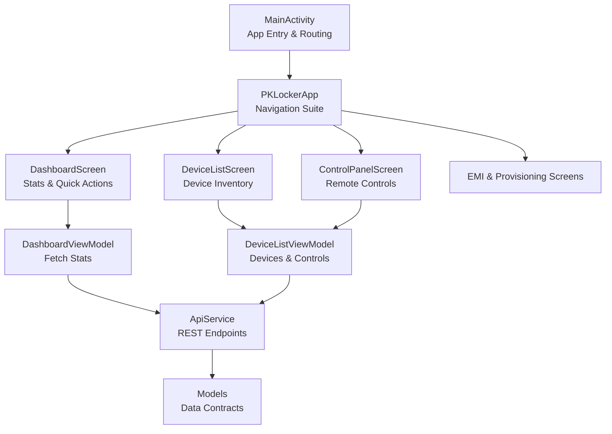
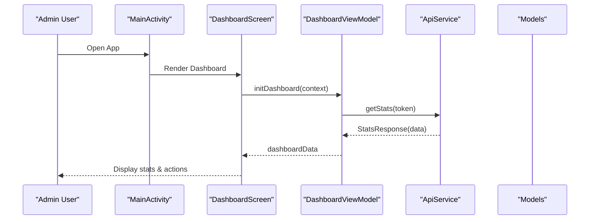
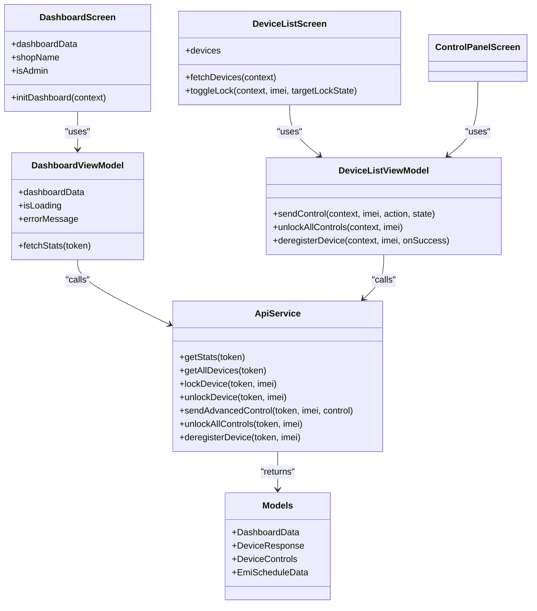

# Admin Dashboard

<cite>
**Referenced Files in This Document**
- [MainActivity.kt](file://app/src/main/java/com/pksafe/lock/manager/MainActivity.kt)
- [DashboardScreen.kt](file://app/src/main/java/com/pksafe/lock/manager/ui/dashboard/DashboardScreen.kt)
- [DashboardViewModel.kt](file://app/src/main/java/com/pksafe/lock/manager/ui/dashboard/DashboardViewModel.kt)
- [DeviceListScreen.kt](file://app/src/main/java/com/pksafe/lock/manager/ui/devices/DeviceListScreen.kt)
- [DeviceListViewModel.kt](file://app/src/main/java/com/pksafe/lock/manager/ui/devices/DeviceListViewModel.kt)
- [ControlPanelScreen.kt](file://app/src/main/java/com/pksafe/lock/manager/ui/devices/ControlPanelScreen.kt)
- [ApiService.kt](file://app/src/main/java/com/pksafe/lock/manager/data/ApiService.kt)
- [Models.kt](file://app/src/main/java/com/pksafe/lock/manager/data/Models.kt)
- [Theme.kt](file://app/src/main/java/com/pksafe/lock/manager/ui/theme/Theme.kt)
</cite>

## Table of Contents
1. [Introduction](#introduction)
2. [Project Structure](#project-structure)
3. [Core Components](#core-components)
4. [Architecture Overview](#architecture-overview)
5. [Detailed Component Analysis](#detailed-component-analysis)
6. [Dependency Analysis](#dependency-analysis)
7. [Performance Considerations](#performance-considerations)
8. [Troubleshooting Guide](#troubleshooting-guide)
9. [Conclusion](#conclusion)
10. [Appendices](#appendices)

## Introduction
This document provides comprehensive documentation for PK Locker’s admin dashboard interface focused on device inventory management and administrative controls. It covers the main dashboard screen that displays device statistics, analytics, and quick actions; the device list with status monitoring, filtering, and bulk operations; and the control panel for remote device management including lock/unlock and hardware restriction controls. It also explains the Jetpack Compose UI architecture, state management using ViewModels, data binding via Retrofit APIs, responsive design considerations, and accessibility features implemented across the admin interface.

## Project Structure
The admin dashboard is part of a larger Android application built with Jetpack Compose. The navigation entry point orchestrates authentication, role-based routing (admin vs customer), and screens such as Dashboard, Device List, Control Panel, EMI screens, and provisioning flows.

**Diagram sources**
- [MainActivity.kt:1025-1180](file://app/src/main/java/com/pksafe/lock/manager/MainActivity.kt#L1025-L1180)
- [DashboardScreen.kt:35-429](file://app/src/main/java/com/pksafe/lock/manager/ui/dashboard/DashboardScreen.kt#L35-L429)
- [DeviceListScreen.kt:36-190](file://app/src/main/java/com/pksafe/lock/manager/ui/devices/DeviceListScreen.kt#L36-L190)
- [ControlPanelScreen.kt:53-229](file://app/src/main/java/com/pksafe/lock/manager/ui/devices/ControlPanelScreen.kt#L53-L229)
- [DashboardViewModel.kt:16-65](file://app/src/main/java/com/pksafe/lock/manager/ui/dashboard/DashboardViewModel.kt#L16-L65)
- [DeviceListViewModel.kt:18-245](file://app/src/main/java/com/pksafe/lock/manager/ui/devices/DeviceListViewModel.kt#L18-L245)
- [ApiService.kt:11-185](file://app/src/main/java/com/pksafe/lock/manager/data/ApiService.kt#L11-L185)
- [Models.kt:22-175](file://app/src/main/java/com/pksafe/lock/manager/data/Models.kt#L22-L175)

**Section sources**
- [MainActivity.kt:1025-1180](file://app/src/main/java/com/pksafe/lock/manager/MainActivity.kt#L1025-L1180)
- [Theme.kt:21-33](file://app/src/main/java/com/pksafe/lock/manager/ui/theme/Theme.kt#L21-L33)

## Core Components
- Dashboard Screen: Displays shop info, premium banner, platform key stats, quick action grid, and support card. Initializes dashboard data from server and shows loading states.
- Device List Screen: Lists devices with search/filter, status badges, and per-device actions (panel, EMI, lock/unlock). Includes modal dialogs and bottom sheets for EMI schedule management.
- Control Panel Screen: Tabbed interface for secure control, hardware tech details, live tracker, customer profile, and EMI ledger. Provides lock/unlock confirmation, offline SMS mode, and emergency reset controls.
- ViewModels: Manage state, fetch data via ApiService, handle errors, and coordinate UI updates.
- Data Layer: Retrofit API service with typed endpoints and data models for devices, controls, EMI schedules, and analytics.

**Section sources**
- [DashboardScreen.kt:35-429](file://app/src/main/java/com/pksafe/lock/manager/ui/dashboard/DashboardScreen.kt#L35-L429)
- [DeviceListScreen.kt:36-190](file://app/src/main/java/com/pksafe/lock/manager/ui/devices/DeviceListScreen.kt#L36-L190)
- [ControlPanelScreen.kt:53-229](file://app/src/main/java/com/pksafe/lock/manager/ui/devices/ControlPanelScreen.kt#L53-L229)
- [DashboardViewModel.kt:16-65](file://app/src/main/java/com/pksafe/lock/manager/ui/dashboard/DashboardViewModel.kt#L16-L65)
- [DeviceListViewModel.kt:18-245](file://app/src/main/java/com/pksafe/lock/manager/ui/devices/DeviceListViewModel.kt#L18-L245)
- [ApiService.kt:11-185](file://app/src/main/java/com/pksafe/lock/manager/data/ApiService.kt#L11-L185)
- [Models.kt:22-175](file://app/src/main/java/com/pksafe/lock/manager/data/Models.kt#L22-L175)

## Architecture Overview
The admin dashboard follows a MVVM pattern with Jetpack Compose UI and Retrofit for networking. ViewModels encapsulate business logic and state, while screens are declarative and reactive to state changes. Navigation is centralized in MainActivity, which routes between screens based on user roles and actions.

**Diagram sources**
- [MainActivity.kt:1025-1180](file://app/src/main/java/com/pksafe/lock/manager/MainActivity.kt#L1025-L1180)
- [DashboardScreen.kt:35-429](file://app/src/main/java/com/pksafe/lock/manager/ui/dashboard/DashboardScreen.kt#L35-L429)
- [DashboardViewModel.kt:16-65](file://app/src/main/java/com/pksafe/lock/manager/ui/dashboard/DashboardViewModel.kt#L16-L65)
- [ApiService.kt:36-44](file://app/src/main/java/com/pksafe/lock/manager/data/ApiService.kt#L36-L44)
- [Models.kt:22-43](file://app/src/main/java/com/pksafe/lock/manager/data/Models.kt#L22-L43)

## Detailed Component Analysis

### Dashboard Screen
- Displays shop name, phone, verified admin badge, share APK, refresh stats.
- Shows premium banner with feature indicators (no SIM, no net, auto lock).
- Platform stat cards for Android/iOS keys availability, used, total.
- Quick action grid for EMIs, active customers, QR/NFC setup, buy keys, video help.
- Support card with contact info.

State Management:
- Uses DashboardViewModel to fetch stats and manage loading/error states.
- Reads shared preferences for shop info and admin flag.

Networking:
- Calls getStats endpoint with bearer token.
- Updates dashboardData on success; sets error messages on failure.

Responsive Design:
- Uses flexible layouts with weight distribution and scrollable content.
- Adapts to different screen sizes via Compose modifiers.

Accessibility:
- Content descriptions for icons and images.
- Clear visual hierarchy and contrast.

**Section sources**
- [DashboardScreen.kt:35-429](file://app/src/main/java/com/pksafe/lock/manager/ui/dashboard/DashboardScreen.kt#L35-L429)
- [DashboardViewModel.kt:16-65](file://app/src/main/java/com/pksafe/lock/manager/ui/dashboard/DashboardViewModel.kt#L16-L65)
- [ApiService.kt:36-44](file://app/src/main/java/com/pksafe/lock/manager/data/ApiService.kt#L36-L44)
- [Models.kt:22-43](file://app/src/main/java/com/pksafe/lock/manager/data/Models.kt#L22-L43)

### Device List Screen
- Lists devices with search by name or IMEI.
- Status badges indicate locked/active state.
- Per-device actions: open control panel, view EMI schedule, quick lock/unlock.
- Modal dialog confirms lock/unlock action.
- Bottom sheet shows EMI schedule with mark-as-paid and reschedule options.

State Management:
- DeviceListViewModel manages device list, loading, and error states.
- Handles EMI schedule fetching, marking payments, and rescheduling plans.

Networking:
- Fetches all devices, EMI schedules, and performs lock/unlock and control commands.
- Refreshes lists after successful operations.

Bulk Operations:
- Lock/unlock individual devices via confirm dialog.
- Mark multiple EMIs as paid through bottom sheet interactions.

Responsive Design:
- LazyColumn for efficient scrolling.
- Adaptive spacing and typography.

Accessibility:
- Descriptive labels and icons.
- Clear feedback for actions.

**Section sources**
- [DeviceListScreen.kt:36-190](file://app/src/main/java/com/pksafe/lock/manager/ui/devices/DeviceListScreen.kt#L36-L190)
- [DeviceListViewModel.kt:18-245](file://app/src/main/java/com/pksafe/lock/manager/ui/devices/DeviceListViewModel.kt#L18-L245)
- [ApiService.kt:26-99](file://app/src/main/java/com/pksafe/lock/manager/data/ApiService.kt#L26-L99)
- [Models.kt:45-175](file://app/src/main/java/com/pksafe/lock/manager/data/Models.kt#L45-L175)

### Control Panel Screen
- Tabbed interface: Secure Control, Hardware Tech, Live Tracker, Customer Profile, EMI Ledger.
- Online/Offline mode toggle for control delivery (cloud vs SMS).
- Emergency reset clears all restrictions.
- Security system controls: auto-lock, SIM change lock, USB block, camera block, app install/settings locks.
- App restrictions: Instagram, WhatsApp, YouTube blocks.
- Terminal utilities: location ping, warning audio/wallpaper.
- EMI reminder protocol: WhatsApp, SMS+Push, warning siren.
- Danger zone: de-register terminal with confirmation.

State Management:
- Uses DeviceListViewModel for device data and control commands.
- Local state for tabs, mode selection, and dialogs.

Networking:
- Sends advanced control commands and unlocks all controls.
- Fetches device data on load.

Responsive Design:
- Scrollable content with padding and spacing.
- Compact header and tab navigation.

Accessibility:
- Clear labels and icons for each control.
- Confirmation dialogs for critical actions.

**Section sources**
- [ControlPanelScreen.kt:53-229](file://app/src/main/java/com/pksafe/lock/manager/ui/devices/ControlPanelScreen.kt#L53-L229)
- [DeviceListViewModel.kt:143-220](file://app/src/main/java/com/pksafe/lock/manager/ui/devices/DeviceListViewModel.kt#L143-L220)
- [ApiService.kt:58-99](file://app/src/main/java/com/pksafe/lock/manager/data/ApiService.kt#L58-L99)
- [Models.kt:78-101](file://app/src/main/java/com/pksafe/lock/manager/data/Models.kt#L78-L101)

### Common Administrative Workflows
- Adding New Devices: Navigate to registration screen from dashboard; validate available keys; register device and refresh device list.
- Managing Device Groups: Filter devices by name/IMEI; view EMI schedules; mark payments; reschedule plans.
- Performing Bulk Operations: Lock/unlock devices via confirm dialogs; unlock all controls; de-register terminals with confirmation.

**Section sources**
- [MainActivity.kt:1111-1176](file://app/src/main/java/com/pksafe/lock/manager/MainActivity.kt#L1111-L1176)
- [DeviceListScreen.kt:145-166](file://app/src/main/java/com/pksafe/lock/manager/ui/devices/DeviceListScreen.kt#L145-L166)
- [ControlPanelScreen.kt:257-308](file://app/src/main/java/com/pksafe/lock/manager/ui/devices/ControlPanelScreen.kt#L257-L308)

## Dependency Analysis
The admin dashboard components depend on ViewModels for state management and ApiService for network operations. Data models define the structure of responses and requests.

**Diagram sources**
- [DashboardScreen.kt:35-429](file://app/src/main/java/com/pksafe/lock/manager/ui/dashboard/DashboardScreen.kt#L35-L429)
- [DashboardViewModel.kt:16-65](file://app/src/main/java/com/pksafe/lock/manager/ui/dashboard/DashboardViewModel.kt#L16-L65)
- [DeviceListScreen.kt:36-190](file://app/src/main/java/com/pksafe/lock/manager/ui/devices/DeviceListScreen.kt#L36-L190)
- [DeviceListViewModel.kt:18-245](file://app/src/main/java/com/pksafe/lock/manager/ui/devices/DeviceListViewModel.kt#L18-L245)
- [ControlPanelScreen.kt:53-229](file://app/src/main/java/com/pksafe/lock/manager/ui/devices/ControlPanelScreen.kt#L53-L229)
- [ApiService.kt:11-185](file://app/src/main/java/com/pksafe/lock/manager/data/ApiService.kt#L11-L185)
- [Models.kt:22-175](file://app/src/main/java/com/pksafe/lock/manager/data/Models.kt#L22-L175)

**Section sources**
- [ApiService.kt:11-185](file://app/src/main/java/com/pksafe/lock/manager/data/ApiService.kt#L11-L185)
- [Models.kt:22-175](file://app/src/main/java/com/pksafe/lock/manager/data/Models.kt#L22-L175)

## Performance Considerations
- Use lazy lists for device listing to optimize rendering performance.
- Debounce search input if needed to reduce re-renders.
- Cache frequently accessed data locally when appropriate.
- Handle network errors gracefully to avoid UI freezes.
- Minimize unnecessary recompositions by structuring state properly.

[No sources needed since this section provides general guidance]

## Troubleshooting Guide
- Authentication Issues: Ensure valid token is present in shared preferences before making API calls.
- Network Errors: Check connectivity and retry failed requests with appropriate error messages.
- State Synchronization: Refresh device lists after lock/unlock operations to reflect accurate status.
- Permission Denials: Handle missing permissions for SMS, location, and overlay access in customer mode.

**Section sources**
- [DashboardViewModel.kt:46-65](file://app/src/main/java/com/pksafe/lock/manager/ui/dashboard/DashboardViewModel.kt#L46-L65)
- [DeviceListViewModel.kt:33-64](file://app/src/main/java/com/pksafe/lock/manager/ui/devices/DeviceListViewModel.kt#L33-L64)
- [MainActivity.kt:170-325](file://app/src/main/java/com/pksafe/lock/manager/MainActivity.kt#L170-L325)

## Conclusion
The PK Locker admin dashboard provides a comprehensive interface for managing device inventory and administrative controls. With a clear separation of concerns using ViewModels and Retrofit, the application ensures maintainable and scalable code. The responsive design and accessibility features enhance usability across different devices and user needs.

[No sources needed since this section summarizes without analyzing specific files]

## Appendices
- Responsive Design: Utilizes Compose modifiers like fillMaxWidth, weight, and padding to adapt to various screen sizes.
- Accessibility: Implements content descriptions, clear visual hierarchy, and keyboard navigation support where applicable.

[No sources needed since this section provides general guidance]