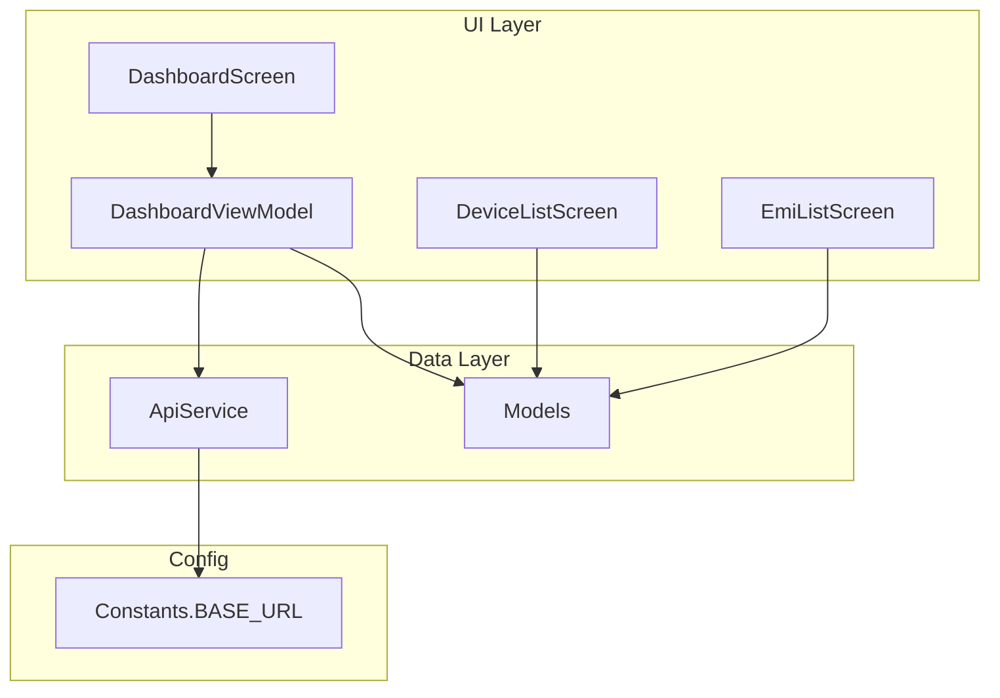
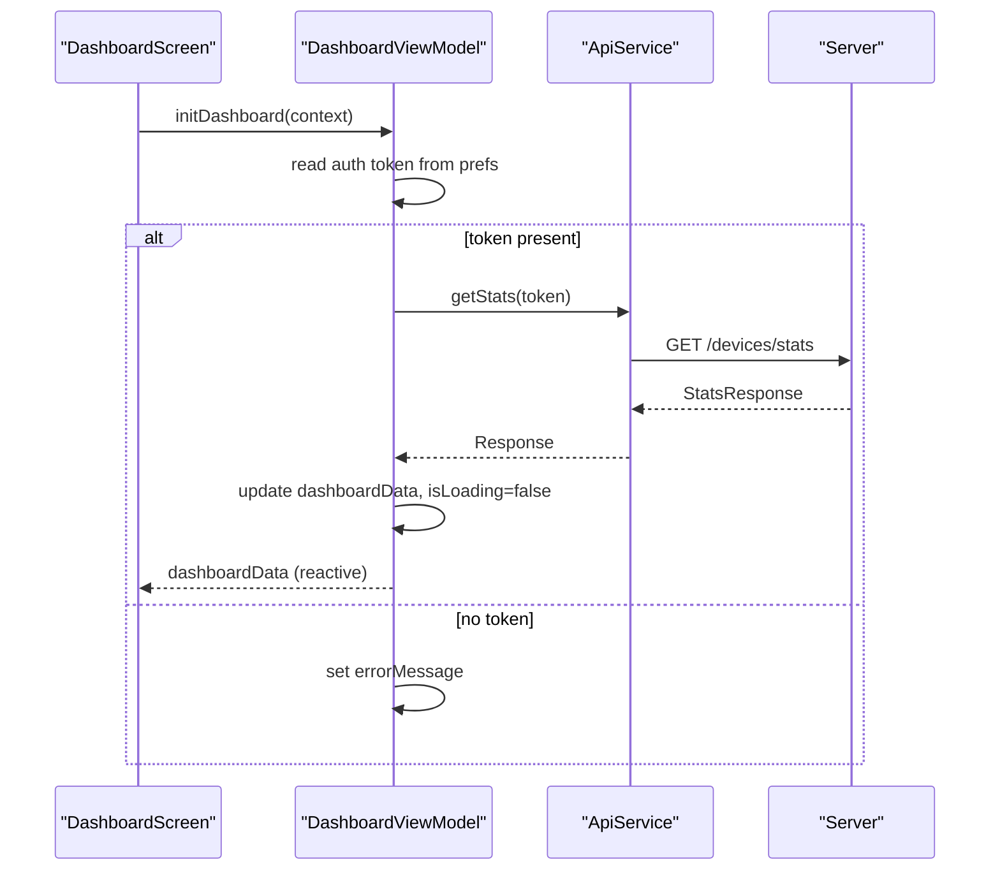
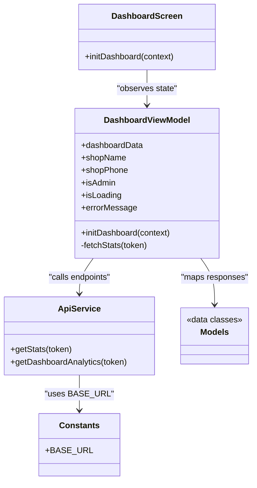

# Analytics Dashboard

<cite>
**Referenced Files in This Document**
- [DashboardScreen.kt](file://app/src/main/java/com/pksafe/lock/manager/ui/dashboard/DashboardScreen.kt)
- [DashboardViewModel.kt](file://app/src/main/java/com/pksafe/lock/manager/ui/dashboard/DashboardViewModel.kt)
- [ApiService.kt](file://app/src/main/java/com/pksafe/lock/manager/data/ApiService.kt)
- [Models.kt](file://app/src/main/java/com/pksafe/lock/manager/data/Models.kt)
- [Constants.kt](file://app/src/main/java/com/pksafe/lock/manager/util/Constants.kt)
- [DeviceListScreen.kt](file://app/src/main/java/com/pksafe/lock/manager/ui/devices/DeviceListScreen.kt)
- [EmiListScreen.kt](file://app/src/main/java/com/pksafe/lock/manager/ui/emi/EmiListScreen.kt)
</cite>

## Table of Contents
1. [Introduction](#introduction)
2. [Project Structure](#project-structure)
3. [Core Components](#core-components)
4. [Architecture Overview](#architecture-overview)
5. [Detailed Component Analysis](#detailed-component-analysis)
6. [Dependency Analysis](#dependency-analysis)
7. [Performance Considerations](#performance-considerations)
8. [Troubleshooting Guide](#troubleshooting-guide)
9. [Conclusion](#conclusion)
10. [Appendices](#appendices)

## Introduction
This document describes the analytics and reporting dashboard within PK Locker’s admin interface. It explains how key metrics are fetched, presented, and used to monitor business performance such as active devices, payment collection rates, and default indicators. It also covers visualization components (cards, lists, progress indicators), filtering capabilities for device data, export options, common analytical queries, and privacy/access controls for sensitive business intelligence.

## Project Structure
The analytics dashboard is implemented using Jetpack Compose UI with a ViewModel-driven architecture. The main entry points for analytics are:
- Dashboard screen and ViewModel that fetch and display stats
- API service layer defining endpoints for stats and analytics
- Data models describing dashboard metrics and device information
- Device list and EMI screens that provide additional operational insights

**Diagram sources**
- [DashboardScreen.kt:35-46](file://app/src/main/java/com/pksafe/lock/manager/ui/dashboard/DashboardScreen.kt#L35-L46)
- [DashboardViewModel.kt:16-31](file://app/src/main/java/com/pksafe/lock/manager/ui/dashboard/DashboardViewModel.kt#L16-L31)
- [ApiService.kt:36-44](file://app/src/main/java/com/pksafe/lock/manager/data/ApiService.kt#L36-L44)
- [Models.kt:23-43](file://app/src/main/java/com/pksafe/lock/manager/data/Models.kt#L23-L43)
- [Constants.kt:3-10](file://app/src/main/java/com/pksafe/lock/manager/util/Constants.kt#L3-L10)

**Section sources**
- [DashboardScreen.kt:35-46](file://app/src/main/java/com/pksafe/lock/manager/ui/dashboard/DashboardScreen.kt#L35-L46)
- [DashboardViewModel.kt:16-31](file://app/src/main/java/com/pksafe/lock/manager/ui/dashboard/DashboardViewModel.kt#L16-L31)
- [ApiService.kt:36-44](file://app/src/main/java/com/pksafe/lock/manager/data/ApiService.kt#L36-L44)
- [Models.kt:23-43](file://app/src/main/java/com/pksafe/lock/manager/data/Models.kt#L23-L43)
- [Constants.kt:3-10](file://app/src/main/java/com/pksafe/lock/manager/util/Constants.kt#L3-L10)

## Core Components
- DashboardScreen: Renders the admin dashboard UI, including platform key cards, action grid, support card, and loading states. It triggers data initialization via the ViewModel.
- DashboardViewModel: Manages authentication state, fetches dashboard statistics from the server, and exposes reactive state to the UI.
- ApiService: Declares REST endpoints for device stats and dashboard analytics, along with other management operations.
- Models: Defines data structures for dashboard stats, analytics, device details, and EMI schedules.
- DeviceListScreen and EmiListScreen: Provide operational views for customer base and EMI collections, complementing the dashboard metrics.

Key responsibilities:
- Fetch and cache dashboard metrics (platform keys, device counts, analytics).
- Present metrics through cards and lists with clear status indicators.
- Support search/filtering on device lists for targeted analysis.
- Enable EMI actions (mark paid, reschedule) to influence collection metrics.

**Section sources**
- [DashboardScreen.kt:35-46](file://app/src/main/java/com/pksafe/lock/manager/ui/dashboard/DashboardScreen.kt#L35-L46)
- [DashboardViewModel.kt:16-65](file://app/src/main/java/com/pksafe/lock/manager/ui/dashboard/DashboardViewModel.kt#L16-L65)
- [ApiService.kt:36-44](file://app/src/main/java/com/pksafe/lock/manager/data/ApiService.kt#L36-L44)
- [Models.kt:23-43](file://app/src/main/java/com/pksafe/lock/manager/data/Models.kt#L23-L43)
- [DeviceListScreen.kt:101-138](file://app/src/main/java/com/pksafe/lock/manager/ui/devices/DeviceListScreen.kt#L101-L138)
- [EmiListScreen.kt:100-213](file://app/src/main/java/com/pksafe/lock/manager/ui/emi/EmiListScreen.kt#L100-L213)

## Architecture Overview
The dashboard follows a clean separation between UI, state management, and data access:
- UI (Compose screens) observe ViewModel state and render accordingly.
- ViewModel handles network calls, error handling, and state updates.
- ApiService defines typed endpoints; Retrofit performs HTTP requests.
- Models map JSON payloads to Kotlin data classes.

**Diagram sources**
- [DashboardScreen.kt:43-46](file://app/src/main/java/com/pksafe/lock/manager/ui/dashboard/DashboardScreen.kt#L43-L46)
- [DashboardViewModel.kt:32-65](file://app/src/main/java/com/pksafe/lock/manager/ui/dashboard/DashboardViewModel.kt#L32-L65)
- [ApiService.kt:36-39](file://app/src/main/java/com/pksafe/lock/manager/data/ApiService.kt#L36-L39)

**Section sources**
- [DashboardScreen.kt:43-46](file://app/src/main/java/com/pksafe/lock/manager/ui/dashboard/DashboardScreen.kt#L43-L46)
- [DashboardViewModel.kt:32-65](file://app/src/main/java/com/pksafe/lock/manager/ui/dashboard/DashboardViewModel.kt#L32-L65)
- [ApiService.kt:36-39](file://app/src/main/java/com/pksafe/lock/manager/data/ApiService.kt#L36-L39)

## Detailed Component Analysis

### Dashboard Screen and Metrics
- Displays platform key availability (Android/iOS) and total device counts.
- Shows an “EMI Protection Active” banner with feature highlights.
- Provides quick actions (Wireless ADB setup, Cable activation, QR/NFC setup, Buy Keys, Video Help).
- Includes a support contact card.
- Uses a linear progress indicator during data load.

Visualization elements:
- PlatformStatCard: shows available, used, and total keys per platform.
- ActionGridItem: tiles for quick actions with enabled/disabled states.
- BannerFeatureItem: compact feature badges.

Metrics exposed by the backend model include:
- PlatformKeys: totalKeys, usedKeys, availableKeys
- DeviceStats: total, locked, deregistered
- DashboardAnalytics: monthlyCollection, collectionRate, highRiskCount, overdueTrend, bestCustomers, deviceStats

These fields enable administrators to track active devices, payment collection rates, and risk indicators.

**Section sources**
- [DashboardScreen.kt:243-266](file://app/src/main/java/com/pksafe/lock/manager/ui/dashboard/DashboardScreen.kt#L243-L266)
- [DashboardScreen.kt:277-358](file://app/src/main/java/com/pksafe/lock/manager/ui/dashboard/DashboardScreen.kt#L277-L358)
- [DashboardScreen.kt:369-391](file://app/src/main/java/com/pksafe/lock/manager/ui/dashboard/DashboardScreen.kt#L369-L391)
- [Models.kt:23-43](file://app/src/main/java/com/pksafe/lock/manager/data/Models.kt#L23-L43)

### Dashboard ViewModel and Data Flow
- Reads shop identity and admin flag from local preferences.
- If an auth token exists, calls the stats endpoint; otherwise sets an error message.
- Updates loading state and displays errors to the UI.

Error handling:
- On successful response, populates dashboardData.
- On failure or exception, sets errorMessage and ensures isLoading is cleared.

Authentication:
- Token is retrieved from SharedPreferences and passed as Authorization header.

**Section sources**
- [DashboardViewModel.kt:16-65](file://app/src/main/java/com/pksafe/lock/manager/ui/dashboard/DashboardViewModel.kt#L16-L65)
- [ApiService.kt:36-39](file://app/src/main/java/com/pksafe/lock/manager/data/ApiService.kt#L36-L39)

### API Endpoints for Analytics
- GET /devices/stats: returns dashboard stats including platform keys and device counts.
- GET /devices/dashboard-analytics: returns extended analytics (collection rate, overdue trends, best customers, device stats).

Both endpoints require an Authorization header with a bearer token.

**Section sources**
- [ApiService.kt:36-44](file://app/src/main/java/com/pksafe/lock/manager/data/ApiService.kt#L36-L44)

### Data Models for Analytics
- StatsResponse wraps DashboardData.
- DashboardData includes:
  - android/ios PlatformKeys
  - devices DeviceStats
  - analytics DashboardAnalytics (monthlyCollection, collectionRate, highRiskCount, overdueTrend, bestCustomers, deviceStats)
- OverdueEntry and BestCustomerEntry support trend and ranking visualizations.
- AnalyticsDeviceStats provides locked/unlocked device counts.

These models underpin charts, graphs, and progress indicators in the dashboard.

**Section sources**
- [Models.kt:23-43](file://app/src/main/java/com/pksafe/lock/manager/data/Models.kt#L23-L43)

### Filtering Capabilities
- DeviceListScreen supports text-based filtering by customer name or IMEI via a search bar.
- Results are filtered client-side before rendering.

While region/device type/customer segment filters are not implemented in the current codebase, the existing search pattern can be extended to add multi-criteria filters.

**Section sources**
- [DeviceListScreen.kt:101-138](file://app/src/main/java/com/pksafe/lock/manager/ui/devices/DeviceListScreen.kt#L101-L138)

### Export Functionality
- No explicit export-to-CSV/PDF/Excel functionality is implemented in the analyzed files.
- The dashboard relies on in-app views and lists for analysis. External export would require adding new features to serialize data and trigger system share/download intents.

[No sources needed since this section summarizes implementation status]

### Common Analytical Queries and Scenarios
- Active devices overview: use DeviceStats.total to gauge installed base size.
- Payment collection rate: use DashboardAnalytics.collectionRate and monthlyCollection to assess revenue health.
- Default risk: use DashboardAnalytics.highRiskCount and overdueTrend to identify delinquency patterns.
- Top performers: use bestCustomers to recognize high-value accounts.
- Device control effectiveness: use AnalyticsDeviceStats.locked vs unlocked to evaluate enforcement outcomes.

Example scenarios:
- Weekly review: compare monthlyCollection across recent months using overdueTrend.
- Risk mitigation: focus outreach on highRiskCount segments and overdue entries.
- Capacity planning: track availableKeys vs usedKeys to manage license supply.

[No sources needed since this section provides conceptual guidance]

### Privacy and Access Controls
- Authentication: dashboard data is protected by requiring a bearer token in the Authorization header.
- Admin context: the UI reads an admin flag from preferences to conditionally show admin-specific indicators.
- Data minimization: only necessary fields are requested and displayed.

Recommendations:
- Enforce role-based access at the API level to restrict analytics endpoints to authorized roles.
- Avoid logging sensitive identifiers in logs or toast messages.
- Secure storage of tokens and PII in SharedPreferences with appropriate flags.

**Section sources**
- [DashboardViewModel.kt:32-44](file://app/src/main/java/com/pksafe/lock/manager/ui/dashboard/DashboardViewModel.kt#L32-L44)
- [ApiService.kt:36-44](file://app/src/main/java/com/pksafe/lock/manager/data/ApiService.kt#L36-L44)

## Dependency Analysis
The dashboard depends on:
- Compose UI components for rendering
- ViewModel for state and lifecycle
- Retrofit + Gson for networking and serialization
- Constants for base URL configuration
- Data models for structured responses

**Diagram sources**
- [DashboardScreen.kt:35-46](file://app/src/main/java/com/pksafe/lock/manager/ui/dashboard/DashboardScreen.kt#L35-L46)
- [DashboardViewModel.kt:16-65](file://app/src/main/java/com/pksafe/lock/manager/ui/dashboard/DashboardViewModel.kt#L16-L65)
- [ApiService.kt:36-44](file://app/src/main/java/com/pksafe/lock/manager/data/ApiService.kt#L36-L44)
- [Models.kt:23-43](file://app/src/main/java/com/pksafe/lock/manager/data/Models.kt#L23-L43)
- [Constants.kt:3-10](file://app/src/main/java/com/pksafe/lock/manager/util/Constants.kt#L3-L10)

**Section sources**
- [DashboardScreen.kt:35-46](file://app/src/main/java/com/pksafe/lock/manager/ui/dashboard/DashboardScreen.kt#L35-L46)
- [DashboardViewModel.kt:16-65](file://app/src/main/java/com/pksafe/lock/manager/ui/dashboard/DashboardViewModel.kt#L16-L65)
- [ApiService.kt:36-44](file://app/src/main/java/com/pksafe/lock/manager/data/ApiService.kt#L36-L44)
- [Models.kt:23-43](file://app/src/main/java/com/pksafe/lock/manager/data/Models.kt#L23-L43)
- [Constants.kt:3-10](file://app/src/main/java/com/pksafe/lock/manager/util/Constants.kt#L3-L10)

## Performance Considerations
- Network calls are performed in coroutines within the ViewModel scope to avoid blocking the UI thread.
- Loading state prevents redundant refreshes and improves UX.
- Client-side filtering in DeviceListScreen reduces UI overhead by operating on in-memory lists.
- Consider caching strategies (e.g., disk cache) for analytics endpoints if frequent polling is required.

[No sources needed since this section provides general guidance]

## Troubleshooting Guide
Common issues and resolutions:
- Authentication required: ensure a valid token is stored in preferences; the ViewModel will set an error message if missing.
- Connection failed: check network connectivity and server availability; the ViewModel catches exceptions and sets an error message.
- Empty dashboard data: verify the server returns success and data; inspect API responses and ensure endpoints are reachable.

Operational tips:
- Use the refresh button in the dashboard to re-fetch stats.
- For device-related issues, use DeviceListScreen to search and toggle lock states where applicable.
- For EMI tracking, use EmiListScreen to mark payments and view schedules.

**Section sources**
- [DashboardViewModel.kt:32-65](file://app/src/main/java/com/pksafe/lock/manager/ui/dashboard/DashboardViewModel.kt#L32-L65)
- [DeviceListScreen.kt:101-138](file://app/src/main/java/com/pksafe/lock/manager/ui/devices/DeviceListScreen.kt#L101-L138)
- [EmiListScreen.kt:100-213](file://app/src/main/java/com/pksafe/lock/manager/ui/emi/EmiListScreen.kt#L100-L213)

## Conclusion
The PK Locker analytics dashboard provides a focused view of key business metrics through platform key cards, device statistics, and analytics data. While advanced charting and export features are not present in the current codebase, the foundation is solid for extending visualizations, adding filters, and implementing export capabilities. Security is enforced via token-based authentication, and the modular structure allows for future enhancements without disrupting existing flows.

[No sources needed since this section summarizes without analyzing specific files]

## Appendices

### Visualization Components Reference
- PlatformStatCard: displays available, used, and total keys per platform.
- ActionGridItem: tiles for quick actions with enabled/disabled states.
- BannerFeatureItem: compact feature badges for EMI protection features.
- LinearProgressIndicator: indicates loading state during data fetch.

**Section sources**
- [DashboardScreen.kt:243-266](file://app/src/main/java/com/pksafe/lock/manager/ui/dashboard/DashboardScreen.kt#L243-L266)
- [DashboardScreen.kt:369-391](file://app/src/main/java/com/pksafe/lock/manager/ui/dashboard/DashboardScreen.kt#L369-L391)
- [DashboardScreen.kt:230-232](file://app/src/main/java/com/pksafe/lock/manager/ui/dashboard/DashboardScreen.kt#L230-L232)

### EMI and Collection Insights
- EmiListScreen presents upcoming EMIs with due dates, amounts, and loan totals.
- Actions allow marking payments as paid and viewing detailed schedules.

**Section sources**
- [EmiListScreen.kt:100-213](file://app/src/main/java/com/pksafe/lock/manager/ui/emi/EmiListScreen.kt#L100-L213)