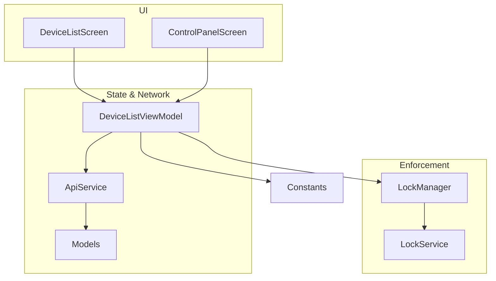
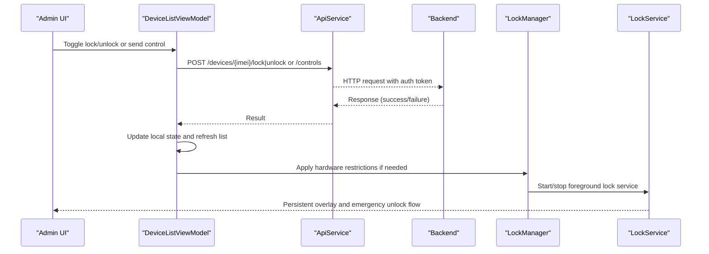
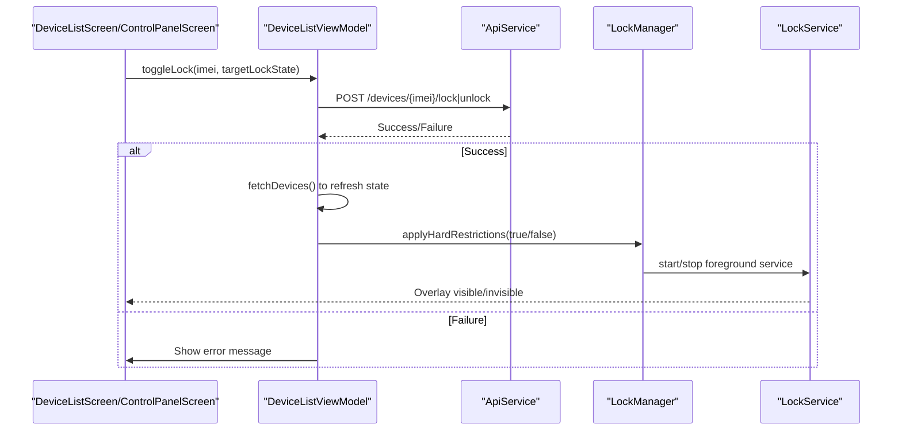
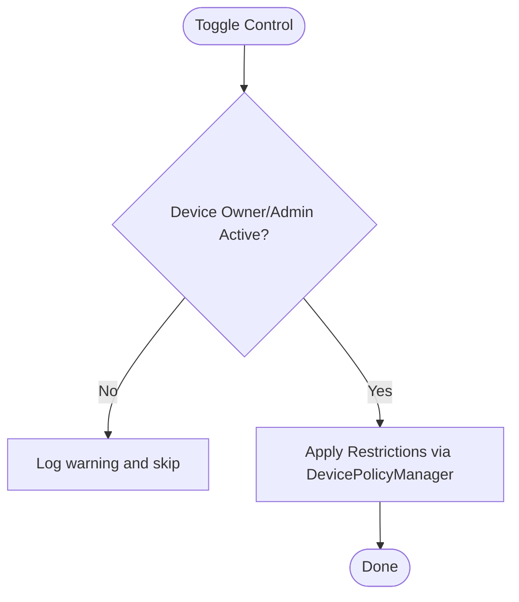
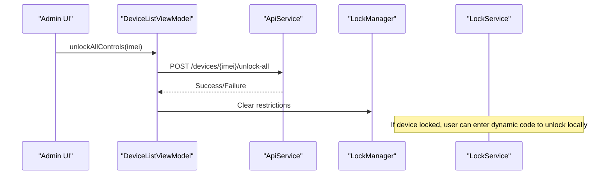
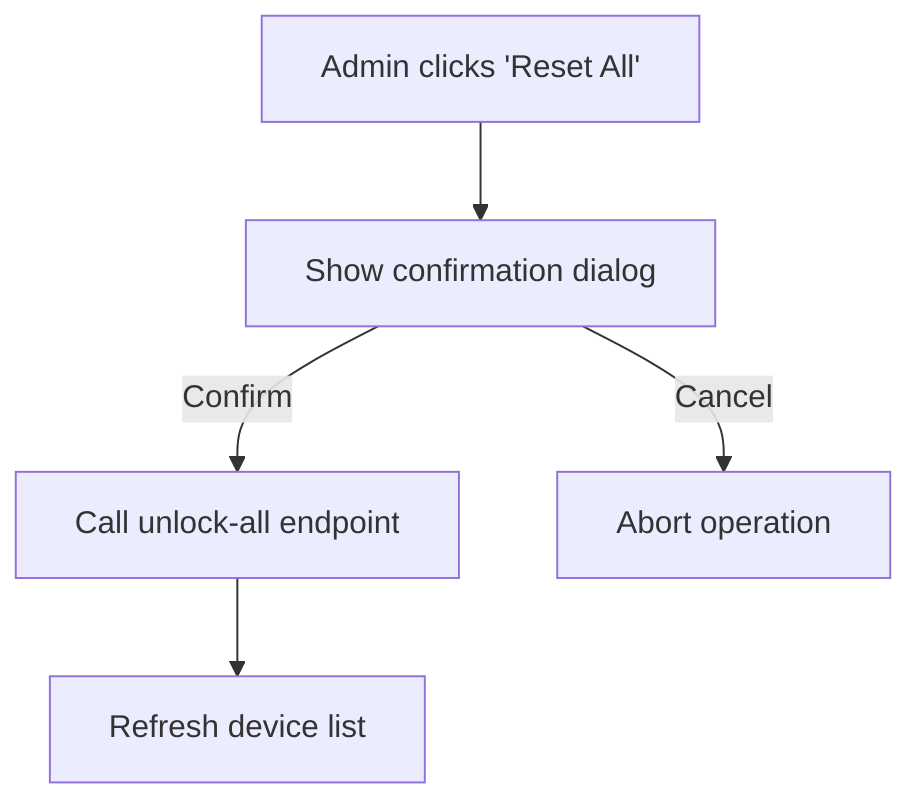
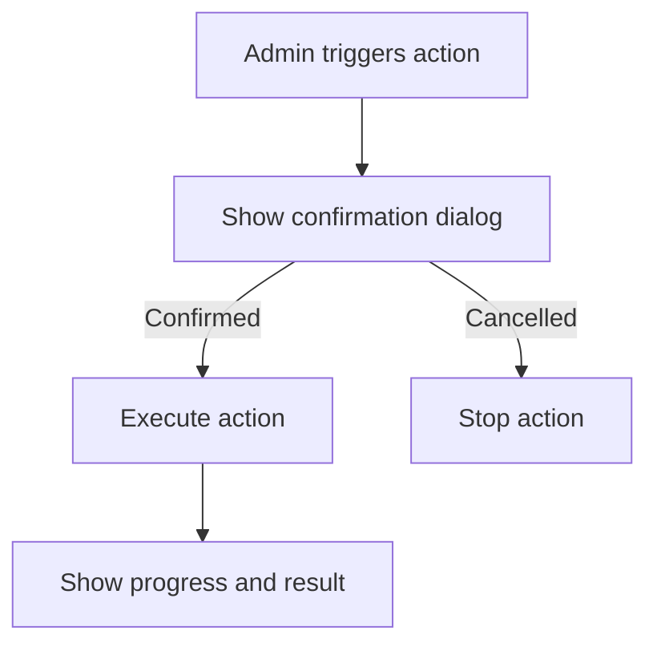
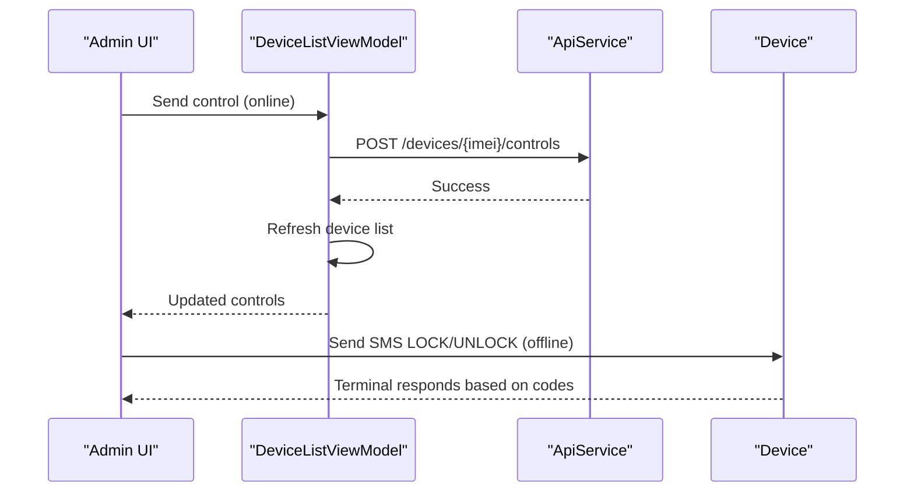
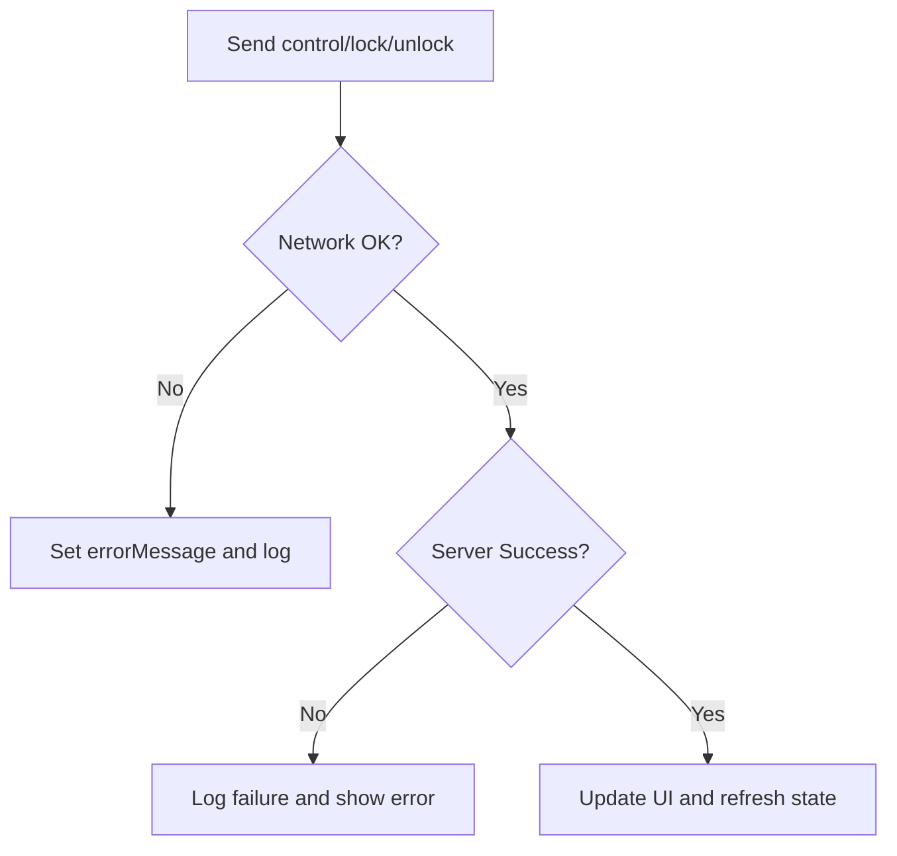
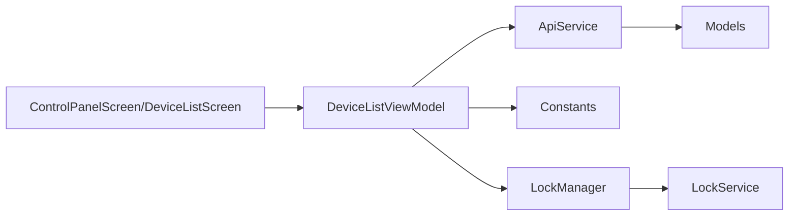

# Control Panel

<cite>
**Referenced Files in This Document**
- [ControlPanelScreen.kt](file://app/src/main/java/com/pksafe/lock/manager/ui/devices/ControlPanelScreen.kt)
- [DeviceListScreen.kt](file://app/src/main/java/com/pksafe/lock/manager/ui/devices/DeviceListScreen.kt)
- [DeviceListViewModel.kt](file://app/src/main/java/com/pksafe/lock/manager/ui/devices/DeviceListViewModel.kt)
- [ApiService.kt](file://app/src/main/java/com/pksafe/lock/manager/data/ApiService.kt)
- [Models.kt](file://app/src/main/java/com/pksafe/lock/manager/data/Models.kt)
- [LockManager.kt](file://app/src/main/java/com/pksafe/lock/manager/util/LockManager.kt)
- [LockService.kt](file://app/src/main/java/com/pksafe/lock/manager/service/LockService.kt)
- [Constants.kt](file://app/src/main/java/com/pksafe/lock/manager/util/Constants.kt)
</cite>

## Table of Contents
1. [Introduction](#introduction)
2. [Project Structure](#project-structure)
3. [Core Components](#core-components)
4. [Architecture Overview](#architecture-overview)
5. [Detailed Component Analysis](#detailed-component-analysis)
6. [Dependency Analysis](#dependency-analysis)
7. [Performance Considerations](#performance-considerations)
8. [Troubleshooting Guide](#troubleshooting-guide)
9. [Conclusion](#conclusion)
10. [Appendices](#appendices)

## Introduction
This document explains the PK Locker control panel interface for remote device control and management. It focuses on:
- Lock/unlock operations tied to payment status
- Hardware restriction controls (camera, USB debugging, factory reset protection, app installation restrictions)
- Emergency override features for troubleshooting or customer service
- Bulk control operations for managing multiple devices
- Safety mechanisms and confirmation dialogs to prevent accidental lockdowns
- Common workflows and error handling strategies for failed operations

The control panel is implemented as a Compose UI with a ViewModel orchestrating API calls and state updates, while device enforcement is handled by system-level services and policies.

## Project Structure
The control panel spans UI screens, view models, data models, and enforcement services:
- UI screens present device lists and per-device control panels
- View models manage network requests and state
- Data models define request/response structures
- Enforcement utilities apply Android Device Policy Manager restrictions
- Services enforce persistent lock overlays and emergency unlock flows

**Diagram sources**
- [DeviceListScreen.kt:38-190](file://app/src/main/java/com/pksafe/lock/manager/ui/devices/DeviceListScreen.kt#L38-L190)
- [ControlPanelScreen.kt:55-230](file://app/src/main/java/com/pksafe/lock/manager/ui/devices/ControlPanelScreen.kt#L55-L230)
- [DeviceListViewModel.kt:18-246](file://app/src/main/java/com/pksafe/lock/manager/ui/devices/DeviceListViewModel.kt#L18-L246)
- [ApiService.kt:11-185](file://app/src/main/java/com/pksafe/lock/manager/data/ApiService.kt#L11-L185)
- [Models.kt:45-219](file://app/src/main/java/com/pksafe/lock/manager/data/Models.kt#L45-L219)
- [LockManager.kt:27-406](file://app/src/main/java/com/pksafe/lock/manager/util/LockManager.kt#L27-L406)
- [LockService.kt:41-330](file://app/src/main/java/com/pksafe/lock/manager/service/LockService.kt#L41-L330)
- [Constants.kt:3-10](file://app/src/main/java/com/pksafe/lock/manager/util/Constants.kt#L3-L10)

**Section sources**
- [DeviceListScreen.kt:38-190](file://app/src/main/java/com/pksafe/lock/manager/ui/devices/DeviceListScreen.kt#L38-L190)
- [ControlPanelScreen.kt:55-230](file://app/src/main/java/com/pksafe/lock/manager/ui/devices/ControlPanelScreen.kt#L55-L230)
- [DeviceListViewModel.kt:18-246](file://app/src/main/java/com/pksafe/lock/manager/ui/devices/DeviceListViewModel.kt#L18-L246)
- [ApiService.kt:11-185](file://app/src/main/java/com/pksafe/lock/manager/data/ApiService.kt#L11-L185)
- [Models.kt:45-219](file://app/src/main/java/com/pksafe/lock/manager/data/Models.kt#L45-L219)
- [LockManager.kt:27-406](file://app/src/main/java/com/pksafe/lock/manager/util/LockManager.kt#L27-L406)
- [LockService.kt:41-330](file://app/src/main/java/com/pksafe/lock/manager/service/LockService.kt#L41-L330)
- [Constants.kt:3-10](file://app/src/main/java/com/pksafe/lock/manager/util/Constants.kt#L3-L10)

## Core Components
- ControlPanelScreen: Presents tabs for secure control, hardware tech, live tracker, customer profile, and EMI ledger; provides online/offline modes and safety dialogs for lock/release and bulk resets.
- DeviceListScreen: Lists devices, supports search, quick lock/unlock with confirmations, and EMI schedule management via a bottom sheet.
- DeviceListViewModel: Orchestrates fetching devices, toggling lock/unlock, sending advanced controls, unlocking all controls, deregistering devices, and EMI operations.
- ApiService: Retrofit interface defining endpoints for device lifecycle, controls, and EMI management.
- Models: Data contracts for devices, controls, app restrictions, location/geofence, and EMI schedules.
- LockManager: Applies Android Device Policy Manager restrictions (camera, USB, factory reset, safe boot, ADB/debugging, settings), app hiding, warning alarms/wallpaper, and self-deactivation.
- LockService: Foreground service that renders a persistent lock overlay, handles auto-lock on connectivity loss, and supports emergency unlock via dynamic code.

**Section sources**
- [ControlPanelScreen.kt:55-230](file://app/src/main/java/com/pksafe/lock/manager/ui/devices/ControlPanelScreen.kt#L55-L230)
- [DeviceListScreen.kt:38-190](file://app/src/main/java/com/pksafe/lock/manager/ui/devices/DeviceListScreen.kt#L38-L190)
- [DeviceListViewModel.kt:18-246](file://app/src/main/java/com/pksafe/lock/manager/ui/devices/DeviceListViewModel.kt#L18-L246)
- [ApiService.kt:11-185](file://app/src/main/java/com/pksafe/lock/manager/data/ApiService.kt#L11-L185)
- [Models.kt:45-219](file://app/src/main/java/com/pksafe/lock/manager/data/Models.kt#L45-L219)
- [LockManager.kt:27-406](file://app/src/main/java/com/pksafe/lock/manager/util/LockManager.kt#L27-L406)
- [LockService.kt:41-330](file://app/src/main/java/com/pksafe/lock/manager/service/LockService.kt#L41-L330)

## Architecture Overview
The control panel follows a layered architecture:
- UI layer (Compose screens) triggers actions
- ViewModel layer manages state and network calls
- API layer communicates with backend endpoints
- Enforcement layer applies OS-level restrictions and maintains persistent lock states

**Diagram sources**
- [DeviceListViewModel.kt:143-220](file://app/src/main/java/com/pksafe/lock/manager/ui/devices/DeviceListViewModel.kt#L143-L220)
- [ApiService.kt:46-99](file://app/src/main/java/com/pksafe/lock/manager/data/ApiService.kt#L46-L99)
- [LockManager.kt:111-192](file://app/src/main/java/com/pksafe/lock/manager/util/LockManager.kt#L111-L192)
- [LockService.kt:50-80](file://app/src/main/java/com/pksafe/lock/manager/service/LockService.kt#L50-L80)

## Detailed Component Analysis

### Remote Lock/Unlock Workflow
- Admin initiates lock/unlock from DeviceListScreen or ControlPanelScreen
- ViewModel validates authentication and calls appropriate endpoint
- On success, UI refreshes device list to reflect new status
- LockManager enforces system-level restrictions when locking; unlocks clear them

**Diagram sources**
- [DeviceListScreen.kt:56-81](file://app/src/main/java/com/pksafe/lock/manager/ui/devices/DeviceListScreen.kt#L56-L81)
- [ControlPanelScreen.kt:72-98](file://app/src/main/java/com/pksafe/lock/manager/ui/devices/ControlPanelScreen.kt#L72-L98)
- [DeviceListViewModel.kt:143-171](file://app/src/main/java/com/pksafe/lock/manager/ui/devices/DeviceListViewModel.kt#L143-L171)
- [ApiService.kt:46-56](file://app/src/main/java/com/pksafe/lock/manager/data/ApiService.kt#L46-L56)
- [LockManager.kt:111-192](file://app/src/main/java/com/pksafe/lock/manager/util/LockManager.kt#L111-L192)
- [LockService.kt:50-80](file://app/src/main/java/com/pksafe/lock/manager/service/LockService.kt#L50-L80)

**Section sources**
- [DeviceListScreen.kt:56-81](file://app/src/main/java/com/pksafe/lock/manager/ui/devices/DeviceListScreen.kt#L56-L81)
- [ControlPanelScreen.kt:72-98](file://app/src/main/java/com/pksafe/lock/manager/ui/devices/ControlPanelScreen.kt#L72-L98)
- [DeviceListViewModel.kt:143-171](file://app/src/main/java/com/pksafe/lock/manager/ui/devices/DeviceListViewModel.kt#L143-L171)
- [ApiService.kt:46-56](file://app/src/main/java/com/pksafe/lock/manager/data/ApiService.kt#L46-L56)
- [LockManager.kt:111-192](file://app/src/main/java/com/pksafe/lock/manager/util/LockManager.kt#L111-L192)
- [LockService.kt:50-80](file://app/src/main/java/com/pksafe/lock/manager/service/LockService.kt#L50-L80)

### Hardware Restriction Controls
- Camera blocking: toggled via device policy manager
- USB file transfer and debugging prevention: blocked via user restrictions
- Factory reset protection: enforced via user restrictions
- App installation restrictions: block unknown sources and app installs
- Additional controls: settings lock, outgoing calls, safe boot, status bar expansion

These are applied through LockManager methods and enforced at the OS level. The ControlPanel exposes switches for these controls and sends commands via the ViewModel to the backend.

**Diagram sources**
- [LockManager.kt:151-200](file://app/src/main/java/com/pksafe/lock/manager/util/LockManager.kt#L151-L200)
- [LockManager.kt:204-261](file://app/src/main/java/com/pksafe/lock/manager/util/LockManager.kt#L204-L261)
- [ControlPanelScreen.kt:310-345](file://app/src/main/java/com/pksafe/lock/manager/ui/devices/ControlPanelScreen.kt#L310-L345)

**Section sources**
- [LockManager.kt:151-200](file://app/src/main/java/com/pksafe/lock/manager/util/LockManager.kt#L151-L200)
- [LockManager.kt:204-261](file://app/src/main/java/com/pksafe/lock/manager/util/LockManager.kt#L204-L261)
- [ControlPanelScreen.kt:310-345](file://app/src/main/java/com/pksafe/lock/manager/ui/devices/ControlPanelScreen.kt#L310-L345)

### Emergency Override Features
- Emergency Reset: Clears all active restrictions (USB, camera, apps) via a confirmation dialog and dedicated API call
- Offline SMS Commands: Provides direct terminal connection using lock/unlock codes sent via SMS without cloud dependency
- Emergency Unlock Code: LockService accepts a dynamic master code derived from IMEI to unlock the device locally for troubleshooting

**Diagram sources**
- [ControlPanelScreen.kt:255-280](file://app/src/main/java/com/pksafe/lock/manager/ui/devices/ControlPanelScreen.kt#L255-L280)
- [DeviceListViewModel.kt:197-220](file://app/src/main/java/com/pksafe/lock/manager/ui/devices/DeviceListViewModel.kt#L197-L220)
- [ApiService.kt:89-93](file://app/src/main/java/com/pksafe/lock/manager/data/ApiService.kt#L89-L93)
- [LockService.kt:200-218](file://app/src/main/java/com/pksafe/lock/manager/service/LockService.kt#L200-L218)

**Section sources**
- [ControlPanelScreen.kt:255-280](file://app/src/main/java/com/pksafe/lock/manager/ui/devices/ControlPanelScreen.kt#L255-L280)
- [DeviceListViewModel.kt:197-220](file://app/src/main/java/com/pksafe/lock/manager/ui/devices/DeviceListViewModel.kt#L197-L220)
- [ApiService.kt:89-93](file://app/src/main/java/com/pksafe/lock/manager/data/ApiService.kt#L89-L93)
- [LockService.kt:200-218](file://app/src/main/java/com/pksafe/lock/manager/service/LockService.kt#L200-L218)

### Bulk Control Operations
- Bulk unlock all controls: One-click action clears all active restrictions for a device after confirmation
- Bulk device lock/unlock: From DeviceListScreen, quick actions trigger confirmations before applying changes across devices

Safety mechanisms include explicit confirmation dialogs and typed confirmations for destructive actions like deregistration.

**Diagram sources**
- [ControlPanelScreen.kt:255-280](file://app/src/main/java/com/pksafe/lock/manager/ui/devices/ControlPanelScreen.kt#L255-L280)
- [DeviceListViewModel.kt:197-220](file://app/src/main/java/com/pksafe/lock/manager/ui/devices/DeviceListViewModel.kt#L197-L220)

**Section sources**
- [ControlPanelScreen.kt:255-280](file://app/src/main/java/com/pksafe/lock/manager/ui/devices/ControlPanelScreen.kt#L255-L280)
- [DeviceListViewModel.kt:197-220](file://app/src/main/java/com/pksafe/lock/manager/ui/devices/DeviceListViewModel.kt#L197-L220)

### Safety Mechanisms and Confirmation Dialogs
- Lock/Unlock confirmation: Prevents accidental lockdowns by requiring explicit confirmation
- Deregistration confirmation: Requires typing “CONFIRM” to permanently release a device
- Processing indicators: Switch items show loading states and timeouts to avoid stuck states
- Auto-lock on connectivity loss: Ensures security posture even if internet drops

**Diagram sources**
- [DeviceListScreen.kt:56-81](file://app/src/main/java/com/pksafe/lock/manager/ui/devices/DeviceListScreen.kt#L56-L81)
- [ControlPanelScreen.kt:72-98](file://app/src/main/java/com/pksafe/lock/manager/ui/devices/ControlPanelScreen.kt#L72-L98)
- [ControlPanelScreen.kt:435-472](file://app/src/main/java/com/pksafe/lock/manager/ui/devices/ControlPanelScreen.kt#L435-L472)
- [ControlPanelScreen.kt:510-552](file://app/src/main/java/com/pksafe/lock/manager/ui/devices/ControlPanelScreen.kt#L510-L552)

**Section sources**
- [DeviceListScreen.kt:56-81](file://app/src/main/java/com/pksafe/lock/manager/ui/devices/DeviceListScreen.kt#L56-L81)
- [ControlPanelScreen.kt:72-98](file://app/src/main/java/com/pksafe/lock/manager/ui/devices/ControlPanelScreen.kt#L72-L98)
- [ControlPanelScreen.kt:435-472](file://app/src/main/java/com/pksafe/lock/manager/ui/devices/ControlPanelScreen.kt#L435-L472)
- [ControlPanelScreen.kt:510-552](file://app/src/main/java/com/pksafe/lock/manager/ui/devices/ControlPanelScreen.kt#L510-L552)

### Common Control Workflows
- Online mode: Sends control commands via API; UI reflects server state after refresh
- Offline mode: Uses SMS with lock/unlock codes to directly control the terminal without cloud dependency
- EMI reminders: Triggers multi-channel notifications and optional audio warnings

**Diagram sources**
- [ControlPanelScreen.kt:208-221](file://app/src/main/java/com/pksafe/lock/manager/ui/devices/ControlPanelScreen.kt#L208-L221)
- [ControlPanelScreen.kt:571-623](file://app/src/main/java/com/pksafe/lock/manager/ui/devices/ControlPanelScreen.kt#L571-L623)
- [DeviceListViewModel.kt:173-195](file://app/src/main/java/com/pksafe/lock/manager/ui/devices/DeviceListViewModel.kt#L173-L195)
- [ApiService.kt:58-63](file://app/src/main/java/com/pksafe/lock/manager/data/ApiService.kt#L58-L63)

**Section sources**
- [ControlPanelScreen.kt:208-221](file://app/src/main/java/com/pksafe/lock/manager/ui/devices/ControlPanelScreen.kt#L208-L221)
- [ControlPanelScreen.kt:571-623](file://app/src/main/java/com/pksafe/lock/manager/ui/devices/ControlPanelScreen.kt#L571-L623)
- [DeviceListViewModel.kt:173-195](file://app/src/main/java/com/pksafe/lock/manager/ui/devices/DeviceListViewModel.kt#L173-L195)
- [ApiService.kt:58-63](file://app/src/main/java/com/pksafe/lock/manager/data/ApiService.kt#L58-L63)

### Error Handling Strategies
- Authentication checks: ViewModel verifies tokens before making requests
- Network errors: Catches exceptions and sets user-friendly error messages
- Server errors: Logs response codes/messages and prevents invalid state transitions
- Local fallbacks: Offline SMS mode ensures control continuity when cloud is unavailable
- Service resilience: LockService runs in foreground and persists overlay to maintain security posture

**Diagram sources**
- [DeviceListViewModel.kt:33-64](file://app/src/main/java/com/pksafe/lock/manager/ui/devices/DeviceListViewModel.kt#L33-L64)
- [DeviceListViewModel.kt:143-171](file://app/src/main/java/com/pksafe/lock/manager/ui/devices/DeviceListViewModel.kt#L143-L171)
- [DeviceListViewModel.kt:173-195](file://app/src/main/java/com/pksafe/lock/manager/ui/devices/DeviceListViewModel.kt#L173-L195)
- [DeviceListViewModel.kt:197-220](file://app/src/main/java/com/pksafe/lock/manager/ui/devices/DeviceListViewModel.kt#L197-L220)

**Section sources**
- [DeviceListViewModel.kt:33-64](file://app/src/main/java/com/pksafe/lock/manager/ui/devices/DeviceListViewModel.kt#L33-L64)
- [DeviceListViewModel.kt:143-171](file://app/src/main/java/com/pksafe/lock/manager/ui/devices/DeviceListViewModel.kt#L143-L171)
- [DeviceListViewModel.kt:173-195](file://app/src/main/java/com/pksafe/lock/manager/ui/devices/DeviceListViewModel.kt#L173-L195)
- [DeviceListViewModel.kt:197-220](file://app/src/main/java/com/pksafe/lock/manager/ui/devices/DeviceListViewModel.kt#L197-L220)

## Dependency Analysis
Key dependencies and relationships:
- UI depends on ViewModel for state and actions
- ViewModel depends on ApiService for network operations and Constants for base URL
- Enforcement depends on LockManager for OS-level restrictions and LockService for persistent overlay
- Data models define contracts between UI, ViewModel, and backend

**Diagram sources**
- [ControlPanelScreen.kt:55-230](file://app/src/main/java/com/pksafe/lock/manager/ui/devices/ControlPanelScreen.kt#L55-L230)
- [DeviceListScreen.kt:38-190](file://app/src/main/java/com/pksafe/lock/manager/ui/devices/DeviceListScreen.kt#L38-L190)
- [DeviceListViewModel.kt:18-246](file://app/src/main/java/com/pksafe/lock/manager/ui/devices/DeviceListViewModel.kt#L18-L246)
- [ApiService.kt:11-185](file://app/src/main/java/com/pksafe/lock/manager/data/ApiService.kt#L11-L185)
- [Models.kt:45-219](file://app/src/main/java/com/pksafe/lock/manager/data/Models.kt#L45-L219)
- [LockManager.kt:27-406](file://app/src/main/java/com/pksafe/lock/manager/util/LockManager.kt#L27-L406)
- [LockService.kt:41-330](file://app/src/main/java/com/pksafe/lock/manager/service/LockService.kt#L41-L330)
- [Constants.kt:3-10](file://app/src/main/java/com/pksafe/lock/manager/util/Constants.kt#L3-L10)

**Section sources**
- [ControlPanelScreen.kt:55-230](file://app/src/main/java/com/pksafe/lock/manager/ui/devices/ControlPanelScreen.kt#L55-L230)
- [DeviceListScreen.kt:38-190](file://app/src/main/java/com/pksafe/lock/manager/ui/devices/DeviceListScreen.kt#L38-L190)
- [DeviceListViewModel.kt:18-246](file://app/src/main/java/com/pksafe/lock/manager/ui/devices/DeviceListViewModel.kt#L18-L246)
- [ApiService.kt:11-185](file://app/src/main/java/com/pksafe/lock/manager/data/ApiService.kt#L11-L185)
- [Models.kt:45-219](file://app/src/main/java/com/pksafe/lock/manager/data/Models.kt#L45-L219)
- [LockManager.kt:27-406](file://app/src/main/java/com/pksafe/lock/manager/util/LockManager.kt#L27-L406)
- [LockService.kt:41-330](file://app/src/main/java/com/pksafe/lock/manager/service/LockService.kt#L41-L330)
- [Constants.kt:3-10](file://app/src/main/java/com/pksafe/lock/manager/util/Constants.kt#L3-L10)

## Performance Considerations
- Minimize unnecessary network calls by refreshing only after successful operations
- Use foreground services to ensure lock overlay persistence without excessive resource usage
- Implement timeouts for processing states to avoid UI stalls
- Prefer offline SMS mode when cloud connectivity is unreliable to reduce latency

[No sources needed since this section provides general guidance]

## Troubleshooting Guide
Common issues and resolutions:
- Authentication required: Ensure valid token exists before performing operations
- Connection failed: Check network connectivity and retry; use offline SMS mode as fallback
- Server error: Inspect response codes and messages; verify backend availability
- Restrictions not applied: Verify Device Owner/Admin privileges and OS version compatibility
- Emergency unlock not working: Confirm dynamic code matches last six digits of IMEI; check overlay permissions

**Section sources**
- [DeviceListViewModel.kt:33-64](file://app/src/main/java/com/pksafe/lock/manager/ui/devices/DeviceListViewModel.kt#L33-L64)
- [DeviceListViewModel.kt:143-171](file://app/src/main/java/com/pksafe/lock/manager/ui/devices/DeviceListViewModel.kt#L143-L171)
- [LockManager.kt:151-200](file://app/src/main/java/com/pksafe/lock/manager/util/LockManager.kt#L151-L200)
- [LockService.kt:200-218](file://app/src/main/java/com/pksafe/lock/manager/service/LockService.kt#L200-L218)

## Conclusion
The PK Locker control panel provides robust remote device control and management capabilities with strong safety mechanisms. Administrators can lock/unlock devices, enforce hardware restrictions, perform emergency overrides, and manage multiple devices efficiently. The layered architecture ensures reliable communication between UI, state management, and enforcement layers, while offline modes and confirmation dialogs enhance usability and safety.

[No sources needed since this section summarizes without analyzing specific files]

## Appendices

### API Endpoints Used by Control Panel
- Lock device: POST /devices/{imei}/lock
- Unlock device: POST /devices/{imei}/unlock
- Advanced controls: POST /devices/{imei}/controls
- Unlock all controls: POST /devices/{imei}/unlock-all
- Deregister device: POST /devices/{imei}/deregister
- Fetch devices: GET /devices
- Fetch EMI schedule: GET /emis/device/{imei}
- Mark EMI paid: POST /emis/{emiId}/mark-paid
- Reschedule EMI plan: POST /emis/device/{imei}

**Section sources**
- [ApiService.kt:46-99](file://app/src/main/java/com/pksafe/lock/manager/data/ApiService.kt#L46-L99)
- [ApiService.kt:112-129](file://app/src/main/java/com/pksafe/lock/manager/data/ApiService.kt#L112-L129)