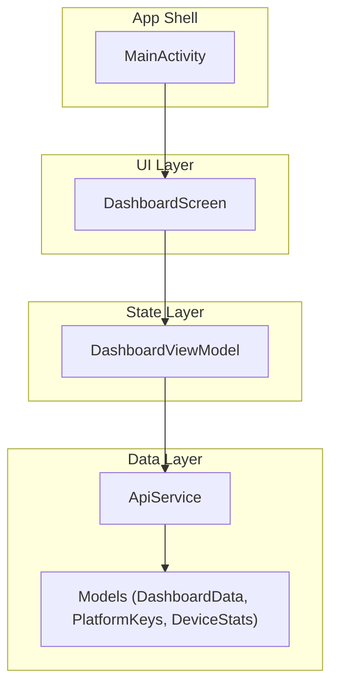
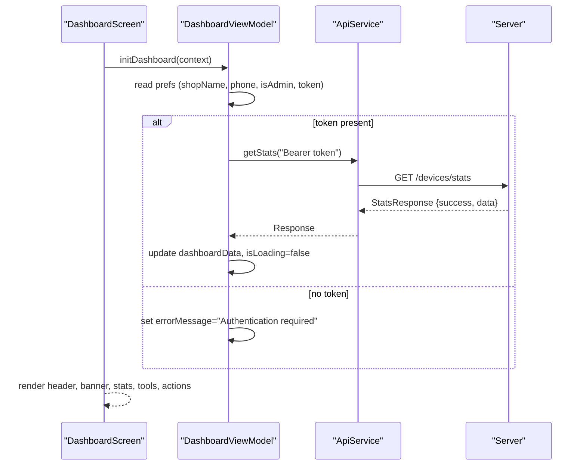
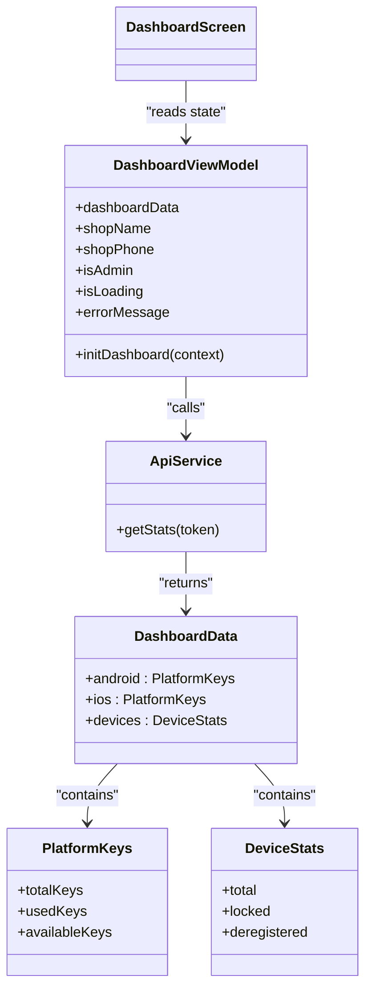
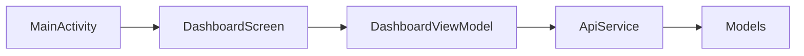

# Dashboard Overview

<cite>
**Referenced Files in This Document**
- [DashboardScreen.kt](file://app/src/main/java/com/pksafe/lock/manager/ui/dashboard/DashboardScreen.kt)
- [DashboardViewModel.kt](file://app/src/main/java/com/pksafe/lock/manager/ui/dashboard/DashboardViewModel.kt)
- [ApiService.kt](file://app/src/main/java/com/pksafe/lock/manager/data/ApiService.kt)
- [Models.kt](file://app/src/main/java/com/pksafe/lock/manager/data/Models.kt)
- [MainActivity.kt](file://app/src/main/java/com/pksafe/lock/manager/MainActivity.kt)
- [Theme.kt](file://app/src/main/java/com/pksafe/lock/manager/ui/theme/Theme.kt)
- [Color.kt](file://app/src/main/java/com/pksafe/lock/manager/ui/theme/Color.kt)
</cite>

## Table of Contents
1. Introduction
2. Project Structure
3. Core Components
4. Architecture Overview
5. Detailed Component Analysis
6. Dependency Analysis
7. Performance Considerations
8. Troubleshooting Guide
9. Conclusion

## Introduction
This document explains the PK Locker dashboard overview interface that shopkeepers use as a central hub to manage device inventory and monitor EMI protection status. It covers:
- The header section with profile information, verification status, and quick actions (APK sharing and refresh)
- The premium banner system showing real-time security indicators (NO SIM, NO NET, AUTO LOCK)
- Platform statistics cards for Android and iOS key management (available, used, total)
- Shopkeeper master tools (wireless ADB setup, cable activation) and customer management shortcuts
- Common interactions and responsive design patterns used across the interface

## Project Structure
The dashboard is implemented using Jetpack Compose and follows a clean separation between UI and state:
- UI layer: DashboardScreen composable defines the layout, sections, and user interactions
- State layer: DashboardViewModel manages data fetching, loading states, and error messages
- Data layer: ApiService and Models define network endpoints and response structures
- App entry and navigation: MainActivity orchestrates authentication, permissions, and routes to screens

**Diagram sources**
- [DashboardScreen.kt:35-46](file://app/src/main/java/com/pksafe/lock/manager/ui/dashboard/DashboardScreen.kt#L35-L46)
- [DashboardViewModel.kt:16-30](file://app/src/main/java/com/pksafe/lock/manager/ui/dashboard/DashboardViewModel.kt#L16-L30)
- [ApiService.kt:36-44](file://app/src/main/java/com/pksafe/lock/manager/data/ApiService.kt#L36-L44)
- [Models.kt:22-31](file://app/src/main/java/com/pksafe/lock/manager/data/Models.kt#L22-L31)
- [MainActivity.kt:126-144](file://app/src/main/java/com/pksafe/lock/manager/MainActivity.kt#L126-L144)

**Section sources**
- [DashboardScreen.kt:35-46](file://app/src/main/java/com/pksafe/lock/manager/ui/dashboard/DashboardScreen.kt#L35-L46)
- [DashboardViewModel.kt:16-30](file://app/src/main/java/com/pksafe/lock/manager/ui/dashboard/DashboardViewModel.kt#L16-L30)
- [ApiService.kt:36-44](file://app/src/main/java/com/pksafe/lock/manager/data/ApiService.kt#L36-L44)
- [Models.kt:22-31](file://app/src/main/java/com/pksafe/lock/manager/data/Models.kt#L22-L31)
- [MainActivity.kt:126-144](file://app/src/main/java/com/pksafe/lock/manager/MainActivity.kt#L126-L144)

## Core Components
- Header area: Displays shop name, phone, verified admin badge, APK share button, and refresh button
- Premium banner: Shows “EMI Protection Active” and three indicator chips (NO SIM, NO NET, AUTO LOCK)
- System Stats: Two platform cards (Android, iOS) each showing available, used, and total keys
- Shopkeeper Master Tools: Wireless ADB Setup card and Instant Cable Activation card
- Manage Customers grid: Shortcuts like Upcoming EMIs, Active Customers, QR Code, NFC Setup, Buy Keys, Video Help
- Support card: Contact helpdesk number

These components are composed within a scrollable column with consistent spacing and Material 3 styling.

**Section sources**
- [DashboardScreen.kt:56-168](file://app/src/main/java/com/pksafe/lock/manager/ui/dashboard/DashboardScreen.kt#L56-L168)
- [DashboardScreen.kt:172-228](file://app/src/main/java/com/pksafe/lock/manager/ui/dashboard/DashboardScreen.kt#L172-L228)
- [DashboardScreen.kt:235-266](file://app/src/main/java/com/pksafe/lock/manager/ui/dashboard/DashboardScreen.kt#L235-L266)
- [DashboardScreen.kt:268-358](file://app/src/main/java/com/pksafe/lock/manager/ui/dashboard/DashboardScreen.kt#L268-L358)
- [DashboardScreen.kt:360-425](file://app/src/main/java/com/pksafe/lock/manager/ui/dashboard/DashboardScreen.kt#L360-L425)

## Architecture Overview
The dashboard uses a unidirectional data flow:
- On launch, the screen triggers initialization which loads shop info from local preferences and fetches stats from the server
- The ViewModel handles network calls via Retrofit and updates UI state (loading, data, errors)
- The UI reacts to state changes and renders sections accordingly

**Diagram sources**
- [DashboardScreen.kt:43-48](file://app/src/main/java/com/pksafe/lock/manager/ui/dashboard/DashboardScreen.kt#L43-L48)
- [DashboardViewModel.kt:32-64](file://app/src/main/java/com/pksafe/lock/manager/ui/dashboard/DashboardViewModel.kt#L32-L64)
- [ApiService.kt:36-39](file://app/src/main/java/com/pksafe/lock/manager/data/ApiService.kt#L36-L39)
- [Models.kt:22-31](file://app/src/main/java/com/pksafe/lock/manager/data/Models.kt#L22-L31)

## Detailed Component Analysis

### Header Section
- Profile avatar/logo with shop name and phone
- Verified admin badge when applicable
- Quick actions:
  - Share APK: Copies the app’s base APK to cache and shares via system chooser
  - Refresh: Re-initializes dashboard data by calling the ViewModel’s init method

Common interactions:
- Tapping Share APK opens the OS share sheet for Bluetooth/WhatsApp/etc.
- Tapping Refresh shows a progress indicator while stats are reloaded

Responsive behavior:
- Uses flexible Row with space-between alignment to keep profile on the left and actions on the right
- Icons sized consistently; background circles provide visual affordance

**Section sources**
- [DashboardScreen.kt:56-168](file://app/src/main/java/com/pksafe/lock/manager/ui/dashboard/DashboardScreen.kt#L56-L168)

### Premium Banner and Security Indicators
- Prominent banner titled “PK LOCKER SECURE” with “EMI Protection Active”
- Three indicator chips:
  - NO SIM (red tint)
  - NO NET (amber tint)
  - AUTO LOCK (green tint)
These are static UI elements representing security status categories. They visually communicate protection posture at a glance.

**Section sources**
- [DashboardScreen.kt:172-228](file://app/src/main/java/com/pksafe/lock/manager/ui/dashboard/DashboardScreen.kt#L172-L228)

### Platform Statistics Cards
- Two side-by-side cards for Android and iOS
- Each card displays:
  - Available keys count
  - Used keys count
  - Total keys count
- Values are sourced from the dashboard data returned by the server

Data mapping:
- Android and iOS counts come from PlatformKeys fields in DashboardData
- Device totals come from DeviceStats

**Section sources**
- [DashboardScreen.kt:235-266](file://app/src/main/java/com/pksafe/lock/manager/ui/dashboard/DashboardScreen.kt#L235-L266)
- [Models.kt:22-31](file://app/src/main/java/com/pksafe/lock/manager/data/Models.kt#L22-L31)

### Shopkeeper Master Tools
- Wireless ADB Setup card:
  - Describes a no-cable setup via Wi-Fi code
  - Button navigates to Wireless ADB flow via menu callback
- Instant Cable Activation card:
  - One-click cable provisioning shortcut
  - Button navigates to Cable Sync flow via menu callback

Navigation pattern:
- Both cards call back into the host activity/screen via an onMenuItemClick lambda to navigate to respective flows

**Section sources**
- [DashboardScreen.kt:268-358](file://app/src/main/java/com/pksafe/lock/manager/ui/dashboard/DashboardScreen.kt#L268-L358)

### Manage Customers Grid
- Action grid items include:
  - Upcoming EMIs
  - Active Customers
  - QR Code
  - NFC Setup
  - Buy Keys
  - Video Help
  - Key Requests (pinned first)
- Items can be enabled/disabled; disabled items show a “Coming Soon” toast

Interactions:
- Clicking enabled items invokes onMenuItemClick with the action title
- Disabled items inform users via toast

**Section sources**
- [DashboardScreen.kt:360-391](file://app/src/main/java/com/pksafe/lock/manager/ui/dashboard/DashboardScreen.kt#L360-L391)

### Support Card
- Provides contact helpdesk number and a forward arrow indicating navigation or call intent

**Section sources**
- [DashboardScreen.kt:393-425](file://app/src/main/java/com/pksafe/lock/manager/ui/dashboard/DashboardScreen.kt#L393-L425)

### Class and Data Relationships

**Diagram sources**
- [DashboardScreen.kt:35-48](file://app/src/main/java/com/pksafe/lock/manager/ui/dashboard/DashboardScreen.kt#L35-L48)
- [DashboardViewModel.kt:16-30](file://app/src/main/java/com/pksafe/lock/manager/ui/dashboard/DashboardViewModel.kt#L16-L30)
- [ApiService.kt:36-39](file://app/src/main/java/com/pksafe/lock/manager/data/ApiService.kt#L36-L39)
- [Models.kt:22-31](file://app/src/main/java/com/pksafe/lock/manager/data/Models.kt#L22-L31)

## Dependency Analysis
- UI depends on ViewModel for state and actions
- ViewModel depends on ApiService for network operations
- ApiService depends on Retrofit configuration and data models
- MainActivity provides navigation callbacks and lifecycle context

**Diagram sources**
- [DashboardScreen.kt:35-48](file://app/src/main/java/com/pksafe/lock/manager/ui/dashboard/DashboardScreen.kt#L35-L48)
- [DashboardViewModel.kt:16-30](file://app/src/main/java/com/pksafe/lock/manager/ui/dashboard/DashboardViewModel.kt#L16-L30)
- [ApiService.kt:36-39](file://app/src/main/java/com/pksafe/lock/manager/data/ApiService.kt#L36-L39)
- [Models.kt:22-31](file://app/src/main/java/com/pksafe/lock/manager/data/Models.kt#L22-L31)
- [MainActivity.kt:126-144](file://app/src/main/java/com/pksafe/lock/manager/MainActivity.kt#L126-L144)

**Section sources**
- [DashboardScreen.kt:35-48](file://app/src/main/java/com/pksafe/lock/manager/ui/dashboard/DashboardScreen.kt#L35-L48)
- [DashboardViewModel.kt:16-30](file://app/src/main/java/com/pksafe/lock/manager/ui/dashboard/DashboardViewModel.kt#L16-L30)
- [ApiService.kt:36-39](file://app/src/main/java/com/pksafe/lock/manager/data/ApiService.kt#L36-L39)
- [Models.kt:22-31](file://app/src/main/java/com/pksafe/lock/manager/data/Models.kt#L22-L31)
- [MainActivity.kt:126-144](file://app/src/main/java/com/pksafe/lock/manager/MainActivity.kt#L126-L144)

## Performance Considerations
- Network requests run in a coroutine scope to avoid blocking the UI thread
- Loading state prevents redundant UI updates and indicates ongoing work
- Local preference reads are lightweight and executed before network calls
- Image/icon rendering uses vector icons and simple shapes for efficient composition

[No sources needed since this section provides general guidance]

## Troubleshooting Guide
- Authentication required: If no auth token is found in preferences, the ViewModel sets an error message instead of fetching stats
- Connection failed: Network exceptions are caught and surfaced as a connection failure message
- APK sharing issues: Errors during file copy or sharing are caught and shown via toast
- Disabled actions: Some grid items may be disabled; tapping them shows a “Coming Soon” message

**Section sources**
- [DashboardViewModel.kt:32-64](file://app/src/main/java/com/pksafe/lock/manager/ui/dashboard/DashboardViewModel.kt#L32-L64)
- [DashboardScreen.kt:120-166](file://app/src/main/java/com/pksafe/lock/manager/ui/dashboard/DashboardScreen.kt#L120-L166)
- [DashboardScreen.kt:486-528](file://app/src/main/java/com/pksafe/lock/manager/ui/dashboard/DashboardScreen.kt#L486-L528)

## Conclusion
The PK Locker dashboard provides a clear, modern interface for shopkeepers to:
- View profile and verification status
- Quickly share the app or refresh data
- Monitor EMI protection status through a prominent banner
- Track key usage across Android and iOS platforms
- Access essential tools for wireless ADB and cable activation
- Navigate to customer management features efficiently

The implementation leverages Compose for responsive layouts, a ViewModel for state management, and a well-defined API contract for reliable data retrieval.

[No sources needed since this section summarizes without analyzing specific files]