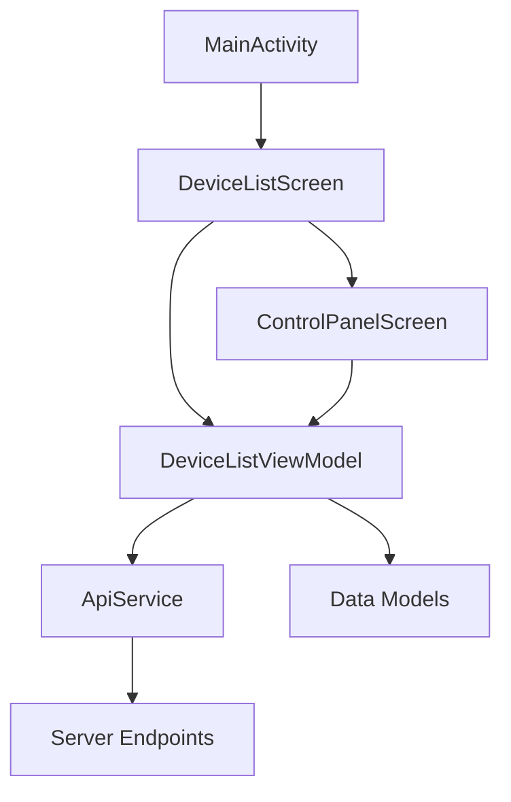
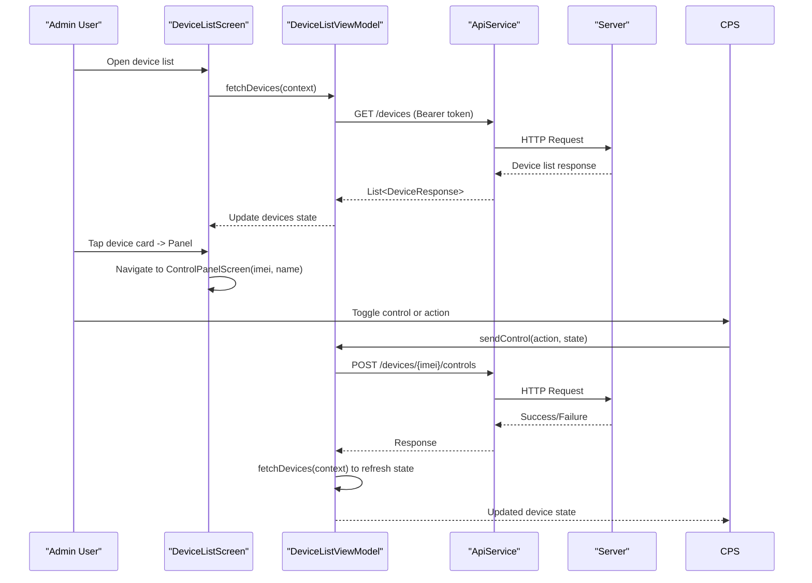
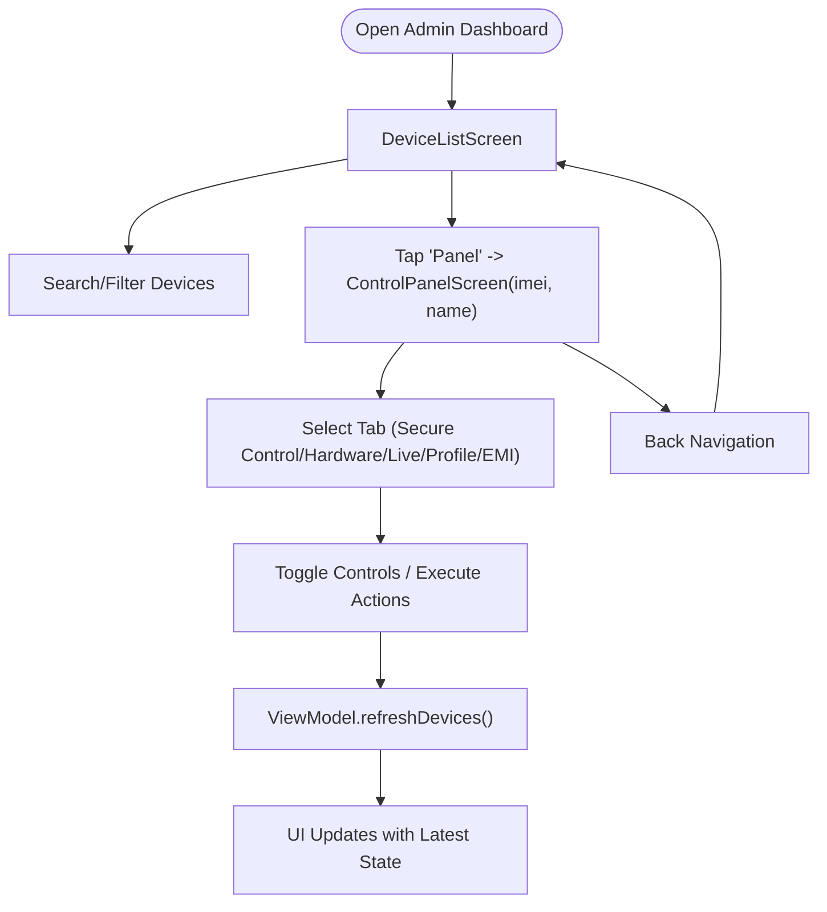
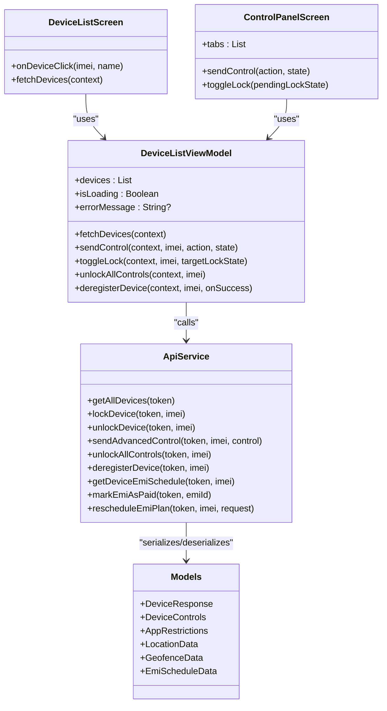

# Device Detail View

<cite>
**Referenced Files in This Document**
- [DeviceListScreen.kt](file://app/src/main/java/com/pksafe/lock/manager/ui/devices/DeviceListScreen.kt)
- [ControlPanelScreen.kt](file://app/src/main/java/com/pksafe/lock/manager/ui/devices/ControlPanelScreen.kt)
- [DeviceListViewModel.kt](file://app/src/main/java/com/pksafe/lock/manager/ui/devices/DeviceListViewModel.kt)
- [ApiService.kt](file://app/src/main/java/com/pksafe/lock/manager/data/ApiService.kt)
- [Models.kt](file://app/src/main/java/com/pksafe/lock/manager/data/Models.kt)
- [MainActivity.kt](file://app/src/main/java/com/pksafe/lock/manager/MainActivity.kt)
</cite>

## Table of Contents
1. Introduction
2. Project Structure
3. Core Components
4. Architecture Overview
5. Detailed Component Analysis
6. Dependency Analysis
7. Performance Considerations
8. Troubleshooting Guide
9. Conclusion

## Introduction
This document explains the device detail view and control panel functionality in PK Locker’s admin dashboard. It covers:
- How device information is displayed (hardware specs, software version, location data, activity logs)
- The control panel interface for granular device management (hardware restrictions, app blocking, system modification prevention, security settings)
- Navigation flow from device list to detailed view and back, including state preservation and data synchronization
- Real-time status updates, activity monitoring, and administrative actions for individual device management

## Project Structure
The admin dashboard uses a Compose-based UI with a ViewModel-driven architecture:
- Device list screen shows all devices and provides entry points to the detail/control panel
- Control panel screen organizes features into tabs: Secure Control, Hardware Tech, Live Tracker, Customer Profile, EMI Ledger
- A shared ViewModel manages device state, API calls, and control commands
- Retrofit ApiService defines endpoints for device operations, controls, and EMI scheduling
- Data models define device properties, controls, app restrictions, location, and EMI structures

**Diagram sources**
- [MainActivity.kt:126-444](file://app/src/main/java/com/pksafe/lock/manager/MainActivity.kt#L126-L444)
- [DeviceListScreen.kt:38-190](file://app/src/main/java/com/pksafe/lock/manager/ui/devices/DeviceListScreen.kt#L38-L190)
- [ControlPanelScreen.kt:54-229](file://app/src/main/java/com/pksafe/lock/manager/ui/devices/ControlPanelScreen.kt#L54-L229)
- [DeviceListViewModel.kt:18-246](file://app/src/main/java/com/pksafe/lock/manager/ui/devices/DeviceListViewModel.kt#L18-L246)
- [ApiService.kt:11-185](file://app/src/main/java/com/pksafe/lock/manager/data/ApiService.kt#L11-L185)
- [Models.kt:45-175](file://app/src/main/java/com/pksafe/lock/manager/data/Models.kt#L45-L175)

**Section sources**
- [DeviceListScreen.kt:38-190](file://app/src/main/java/com/pksafe/lock/manager/ui/devices/DeviceListScreen.kt#L38-L190)
- [ControlPanelScreen.kt:54-229](file://app/src/main/java/com/pksafe/lock/manager/ui/devices/ControlPanelScreen.kt#L54-L229)
- [DeviceListViewModel.kt:18-246](file://app/src/main/java/com/pksafe/lock/manager/ui/devices/DeviceListViewModel.kt#L18-L246)
- [ApiService.kt:11-185](file://app/src/main/java/com/pksafe/lock/manager/data/ApiService.kt#L11-L185)
- [Models.kt:45-175](file://app/src/main/java/com/pksafe/lock/manager/data/Models.kt#L45-L175)
- [MainActivity.kt:126-444](file://app/src/main/java/com/pksafe/lock/manager/MainActivity.kt#L126-L444)

## Core Components
- DeviceListScreen: Displays device cards, search/filtering, quick lock/unlock, and navigation to the control panel and EMI sheet.
- ControlPanelScreen: Tabbed interface for secure controls, hardware tech info, live tracking, customer profile, and EMI ledger; supports online/offline modes and emergency reset.
- DeviceListViewModel: Central state holder for devices, loading/error states, and methods to fetch devices, toggle locks, send advanced controls, unlock all controls, deregister devices, and manage EMI schedules.
- ApiService: Retrofit interface defining endpoints for device CRUD, controls, location notifications, EMI schedule, and key orders.
- Models: Data classes representing device responses, controls, app restrictions, location/geofence, EMI schedule, and request/response payloads.

Key responsibilities:
- State synchronization after control actions via refresh calls
- Error handling and user feedback through messages and UI states
- Offline SMS mode support for lock/unlock without cloud connectivity

**Section sources**
- [DeviceListScreen.kt:38-190](file://app/src/main/java/com/pksafe/lock/manager/ui/devices/DeviceListScreen.kt#L38-L190)
- [ControlPanelScreen.kt:54-229](file://app/src/main/java/com/pksafe/lock/manager/ui/devices/ControlPanelScreen.kt#L54-L229)
- [DeviceListViewModel.kt:18-246](file://app/src/main/java/com/pksafe/lock/manager/ui/devices/DeviceListViewModel.kt#L18-L246)
- [ApiService.kt:11-185](file://app/src/main/java/com/pksafe/lock/manager/data/ApiService.kt#L11-L185)
- [Models.kt:45-175](file://app/src/main/java/com/pksafe/lock/manager/data/Models.kt#L45-L175)

## Architecture Overview
The admin dashboard follows a layered architecture:
- UI Layer: Compose screens (DeviceListScreen, ControlPanelScreen)
- State Management: ViewModel (DeviceListViewModel)
- Networking: Retrofit ApiService
- Data: Typed models (Models.kt)
- App Entry: MainActivity orchestrates authentication and routing

**Diagram sources**
- [DeviceListScreen.kt:136-166](file://app/src/main/java/com/pksafe/lock/manager/ui/devices/DeviceListScreen.kt#L136-L166)
- [ControlPanelScreen.kt:208-221](file://app/src/main/java/com/pksafe/lock/manager/ui/devices/ControlPanelScreen.kt#L208-L221)
- [DeviceListViewModel.kt:33-64](file://app/src/main/java/com/pksafe/lock/manager/ui/devices/DeviceListViewModel.kt#L33-L64)
- [DeviceListViewModel.kt:173-195](file://app/src/main/java/com/pksafe/lock/manager/ui/devices/DeviceListViewModel.kt#L173-L195)
- [ApiService.kt:26-63](file://app/src/main/java/com/pksafe/lock/manager/data/ApiService.kt#L26-L63)

## Detailed Component Analysis

### Device List Screen
- Presents a searchable list of devices with status badges and quick actions
- Provides navigation to the control panel via onDeviceClick callback
- Supports quick lock/unlock with confirmation dialog
- Includes an EMI bottom sheet for viewing and managing installment schedules

Key behaviors:
- Fetches devices on startup using viewModel.fetchDevices(context)
- Filters devices by name or IMEI
- Shows loading indicators and empty state with refresh action
- Opens EMI sheet and triggers fetching schedule per device

Navigation:
- onDeviceClick passes imei and customerName to navigate to ControlPanelScreen

**Section sources**
- [DeviceListScreen.kt:38-190](file://app/src/main/java/com/pksafe/lock/manager/ui/devices/DeviceListScreen.kt#L38-L190)
- [DeviceListScreen.kt:192-325](file://app/src/main/java/com/pksafe/lock/manager/ui/devices/DeviceListScreen.kt#L192-L325)
- [DeviceListScreen.kt:372-513](file://app/src/main/java/com/pksafe/lock/manager/ui/devices/DeviceListScreen.kt#L372-L513)

### Control Panel Screen
- Organized into tabs: Secure Control, Hardware Tech, Live Tracker, Customer Profile, EMI Ledger
- Mode selection: Online Mode (cloud) vs Offline Mode (SMS)
- Bottom bar actions: Secure Lock and Release with confirmation dialog
- Emergency Reset: Clears all active restrictions for the terminal

Tab contents:
- Secure Control: Toggles for auto-lock, SIM change lock, USB block, camera block, install/settings blocks, app restrictions (Instagram, WhatsApp, YouTube), utility actions (location ping, warning audio/wallpaper), EMI reminder protocol, de-register terminal
- Hardware Tech: Displays product name, model identifier, Android version, primary/secondary IMEI
- Live Tracker: Shows current location, history, geofence, and map integration
- Customer Profile: Shows account holder details, contact, CNIC, images, guarantor info
- EMI Ledger: Financial summary and repayment plan details

State synchronization:
- After sending controls, the ViewModel refreshes device list to reflect server state
- Loading indicators during processing; error messages handled gracefully

Offline SMS mode:
- Provides direct SMS actions to lock/unlock using stored codes
- Displays security keys for offline use

**Section sources**
- [ControlPanelScreen.kt:54-229](file://app/src/main/java/com/pksafe/lock/manager/ui/devices/ControlPanelScreen.kt#L54-L229)
- [ControlPanelScreen.kt:251-494](file://app/src/main/java/com/pksafe/lock/manager/ui/devices/ControlPanelScreen.kt#L251-L494)
- [ControlPanelScreen.kt:571-623](file://app/src/main/java/com/pksafe/lock/manager/ui/devices/ControlPanelScreen.kt#L571-L623)
- [ControlPanelScreen.kt:651-719](file://app/src/main/java/com/pksafe/lock/manager/ui/devices/ControlPanelScreen.kt#L651-L719)
- [ControlPanelScreen.kt:745-800](file://app/src/main/java/com/pksafe/lock/manager/ui/devices/ControlPanelScreen.kt#L745-L800)

### Device List ViewModel
Responsibilities:
- Fetch device list and update state
- Manage EMI schedule retrieval, marking payments, rescheduling plans
- Toggle device lock/unlock
- Send advanced control commands and refresh state
- Unlock all controls and deregister devices

Error handling:
- Sets errorMessage on failures
- Logs errors for debugging
- Ensures UI reflects accurate state by refreshing after successful operations

Data synchronization:
- After control actions, fetchDevices(context) is called to ensure consistency
- EMI operations trigger schedule refresh and soft list refresh

**Section sources**
- [DeviceListViewModel.kt:18-246](file://app/src/main/java/com/pksafe/lock/manager/ui/devices/DeviceListViewModel.kt#L18-L246)

### API Service and Data Models
API endpoints used:
- Device management: get all devices, lock/unlock, unlock all, deregister
- Controls: send advanced control
- Location: notify location updates
- EMI: get schedule, mark paid, reschedule plan

Data models:
- DeviceResponse includes identity, status, controls, appRestrictions, location, geofence, locationHistory, and financial fields
- DeviceControls and AppRestrictions define granular toggles
- LocationData, GeofenceData, LocationEntry represent tracking data
- EmiScheduleData and related types structure payment schedules

**Section sources**
- [ApiService.kt:11-185](file://app/src/main/java/com/pksafe/lock/manager/data/ApiService.kt#L11-L185)
- [Models.kt:45-175](file://app/src/main/java/com/pksafe/lock/manager/data/Models.kt#L45-L175)

### Navigation Flow and State Preservation
- MainActivity sets up the app entry point and routes based on login state and role
- DeviceListScreen navigates to ControlPanelScreen with imei and customerName
- ControlPanelScreen finds the selected device from the ViewModel’s device list
- Back navigation returns to the previous screen
- State preservation:
  - Devices are fetched on screen start and refreshed after actions
  - Tabs and mode selections are local to ControlPanelScreen
  - Shared preferences store auth tokens and roles for persistence across sessions

**Diagram sources**
- [MainActivity.kt:126-444](file://app/src/main/java/com/pksafe/lock/manager/MainActivity.kt#L126-L444)
- [DeviceListScreen.kt:136-166](file://app/src/main/java/com/pksafe/lock/manager/ui/devices/DeviceListScreen.kt#L136-L166)
- [ControlPanelScreen.kt:208-221](file://app/src/main/java/com/pksafe/lock/manager/ui/devices/ControlPanelScreen.kt#L208-L221)
- [DeviceListViewModel.kt:33-64](file://app/src/main/java/com/pksafe/lock/manager/ui/devices/DeviceListViewModel.kt#L33-L64)

## Dependency Analysis
Component relationships:
- DeviceListScreen depends on DeviceListViewModel for state and actions
- ControlPanelScreen depends on DeviceListViewModel for device data and control commands
- DeviceListViewModel depends on ApiService for network operations
- ApiService depends on Retrofit and typed Models for serialization/deserialization
- MainActivity orchestrates authentication and navigation between screens

Potential coupling:
- Tight coupling between screens and ViewModel for device state
- Centralized API surface reduces duplication but increases reliance on ApiService contracts

External dependencies:
- Retrofit for HTTP requests
- Gson for JSON parsing
- Firebase Messaging for token sync
- WorkManager for periodic location sync

**Diagram sources**
- [DeviceListScreen.kt:38-190](file://app/src/main/java/com/pksafe/lock/manager/ui/devices/DeviceListScreen.kt#L38-L190)
- [ControlPanelScreen.kt:54-229](file://app/src/main/java/com/pksafe/lock/manager/ui/devices/ControlPanelScreen.kt#L54-L229)
- [DeviceListViewModel.kt:18-246](file://app/src/main/java/com/pksafe/lock/manager/ui/devices/DeviceListViewModel.kt#L18-L246)
- [ApiService.kt:11-185](file://app/src/main/java/com/pksafe/lock/manager/data/ApiService.kt#L11-L185)
- [Models.kt:45-175](file://app/src/main/java/com/pksafe/lock/manager/data/Models.kt#L45-L175)

**Section sources**
- [DeviceListScreen.kt:38-190](file://app/src/main/java/com/pksafe/lock/manager/ui/devices/DeviceListScreen.kt#L38-L190)
- [ControlPanelScreen.kt:54-229](file://app/src/main/java/com/pksafe/lock/manager/ui/devices/ControlPanelScreen.kt#L54-L229)
- [DeviceListViewModel.kt:18-246](file://app/src/main/java/com/pksafe/lock/manager/ui/devices/DeviceListViewModel.kt#L18-L246)
- [ApiService.kt:11-185](file://app/src/main/java/com/pksafe/lock/manager/data/ApiService.kt#L11-L185)
- [Models.kt:45-175](file://app/src/main/java/com/pksafe/lock/manager/data/Models.kt#L45-L175)

## Performance Considerations
- Network calls are performed in coroutines to avoid blocking the UI thread
- Loading indicators provide feedback during asynchronous operations
- State refresh after control actions ensures UI consistency without excessive polling
- Offline SMS mode reduces dependency on network availability
- Map rendering and animations should be optimized to prevent jank on low-end devices

[No sources needed since this section provides general guidance]

## Troubleshooting Guide
Common issues and resolutions:
- Authentication required: Ensure valid token is present before fetching devices
- Server errors: Check response codes and log messages; retry with refresh
- Connection failures: Validate network connectivity and retry logic
- Control command failures: Review logs and verify endpoint parameters; refresh state to rollback UI
- EMI schedule load failures: Confirm device has an active schedule; handle empty states gracefully

Operational tips:
- Use the Emergency Reset to clear all restrictions when necessary
- Verify offline SMS codes are available for lock/unlock without internet
- Monitor background location sync to ensure accurate tracking updates

**Section sources**
- [DeviceListViewModel.kt:33-64](file://app/src/main/java/com/pksafe/lock/manager/ui/devices/DeviceListViewModel.kt#L33-L64)
- [DeviceListViewModel.kt:173-195](file://app/src/main/java/com/pksafe/lock/manager/ui/devices/DeviceListViewModel.kt#L173-L195)
- [ControlPanelScreen.kt:251-494](file://app/src/main/java/com/pksafe/lock/manager/ui/devices/ControlPanelScreen.kt#L251-L494)

## Conclusion
PK Locker’s admin dashboard provides a comprehensive device detail view and control panel that enable administrators to:
- Inspect device hardware/software details, location data, and activity logs
- Apply granular controls for hardware restrictions, app blocking, and system modifications
- Manage EMI schedules and financial summaries
- Operate in both online and offline modes for robust device management
The architecture leverages a clean separation of concerns with Compose UI, ViewModel state management, and Retrofit networking, ensuring maintainability and scalability while delivering real-time updates and reliable administrative actions.

[No sources needed since this section summarizes without analyzing specific files]