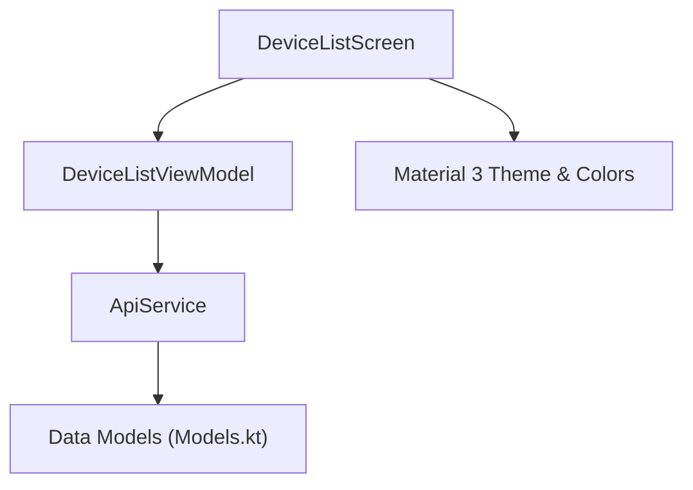
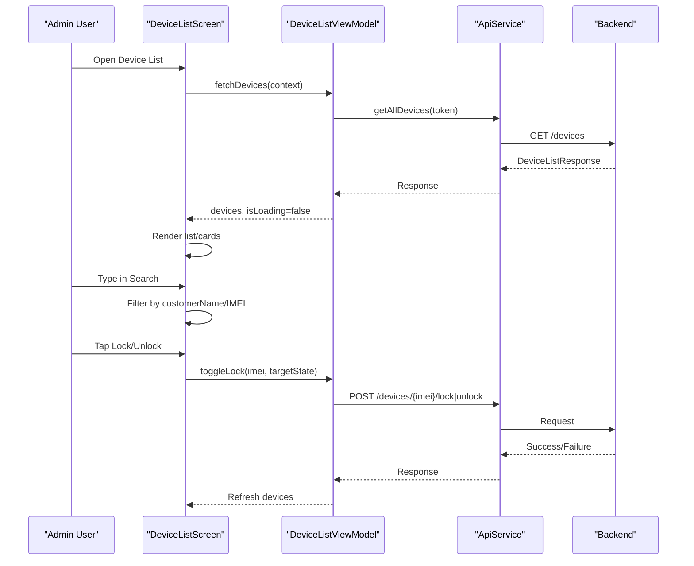
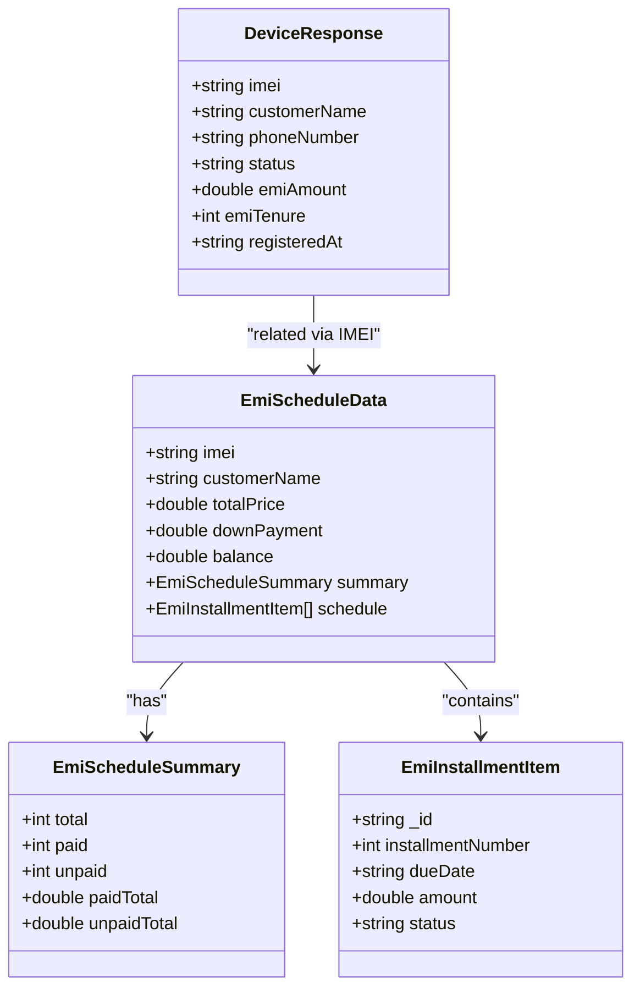
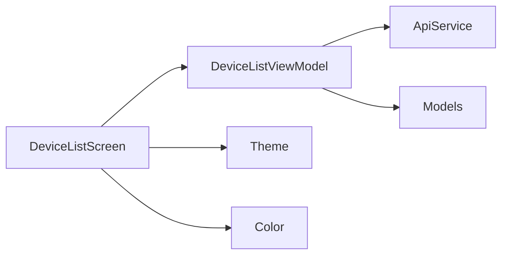

# Device List Interface

<cite>
**Referenced Files in This Document**
- [DeviceListScreen.kt](file://app/src/main/java/com/pksafe/lock/manager/ui/devices/DeviceListScreen.kt)
- [DeviceListViewModel.kt](file://app/src/main/java/com/pksafe/lock/manager/ui/devices/DeviceListViewModel.kt)
- [Models.kt](file://app/src/main/java/com/pksafe/lock/manager/data/Models.kt)
- [ApiService.kt](file://app/src/main/java/com/pksafe/lock/manager/data/ApiService.kt)
- [Theme.kt](file://app/src/main/java/com/pksafe/lock/manager/ui/theme/Theme.kt)
- [Color.kt](file://app/src/main/java/com/pksafe/lock/manager/ui/theme/Color.kt)
</cite>

## Table of Contents
1. [Introduction](#introduction)
2. [Project Structure](#project-structure)
3. [Core Components](#core-components)
4. [Architecture Overview](#architecture-overview)
5. [Detailed Component Analysis](#detailed-component-analysis)
6. [Dependency Analysis](#dependency-analysis)
7. [Performance Considerations](#performance-considerations)
8. [Troubleshooting Guide](#troubleshooting-guide)
9. [Conclusion](#conclusion)

## Introduction
This document describes the device list interface component used in PK Locker’s admin dashboard. It is implemented with Jetpack Compose and Material Design 3 to display enrolled devices, their current status, customer information, and connection state. The interface includes:
- Real-time search by customer name or IMEI
- Premium card design showing phone number, EMI amount, registration date, and tenure
- Loading states, empty list handling, and refresh behavior
- Responsive layout considerations
- Accessibility features for screen readers and assistive technologies

## Project Structure
The device list feature spans UI, view model, data models, and API integration:
- UI layer: Composable screens and cards for rendering the device list and EMI details
- State management: ViewModel orchestrating network calls and local state
- Data models: Typed responses for devices and EMI schedules
- API layer: Retrofit service definitions for backend endpoints

**Diagram sources**
- [DeviceListScreen.kt:38-174](file://app/src/main/java/com/pksafe/lock/manager/ui/devices/DeviceListScreen.kt#L38-L174)
- [DeviceListViewModel.kt:18-64](file://app/src/main/java/com/pksafe/lock/manager/ui/devices/DeviceListViewModel.kt#L18-L64)
- [ApiService.kt:26-29](file://app/src/main/java/com/pksafe/lock/manager/data/ApiService.kt#L26-L29)
- [Models.kt:46-76](file://app/src/main/java/com/pksafe/lock/manager/data/Models.kt#L46-L76)
- [Theme.kt:21-33](file://app/src/main/java/com/pksafe/lock/manager/ui/theme/Theme.kt#L21-L33)

**Section sources**
- [DeviceListScreen.kt:38-174](file://app/src/main/java/com/pksafe/lock/manager/ui/devices/DeviceListScreen.kt#L38-L174)
- [DeviceListViewModel.kt:18-64](file://app/src/main/java/com/pksafe/lock/manager/ui/devices/DeviceListViewModel.kt#L18-L64)
- [ApiService.kt:26-29](file://app/src/main/java/com/pksafe/lock/manager/data/ApiService.kt#L26-L29)
- [Models.kt:46-76](file://app/src/main/java/com/pksafe/lock/manager/data/Models.kt#L46-L76)
- [Theme.kt:21-33](file://app/src/main/java/com/pksafe/lock/manager/ui/theme/Theme.kt#L21-L33)

## Core Components
- DeviceListScreen: Renders the top app bar, modern search input, device list, loading indicators, empty state, and EMI bottom sheet. Implements real-time filtering by customer name or IMEI.
- PremiumDeviceCard: Displays device details including customer name, truncated IMEI, status badge, phone number, EMI amount, registration date, tenure, and action buttons (Panel, EMIs, quick lock/unlock).
- EmiBottomSheetContent: Shows EMI schedule summary and per-installment items with mark-as-paid actions and a reconfiguration dialog.
- DeviceListViewModel: Manages fetching devices, toggling lock/unlock, fetching and updating EMI schedules, and error handling. Uses Retrofit via ApiService.

Key responsibilities:
- UI composition and user interactions
- Local state for search query and dialogs
- Filtering logic for search
- Navigation callbacks and EMI sheet triggers
- Network orchestration and state updates

**Section sources**
- [DeviceListScreen.kt:38-174](file://app/src/main/java/com/pksafe/lock/manager/ui/devices/DeviceListScreen.kt#L38-L174)
- [DeviceListScreen.kt:192-325](file://app/src/main/java/com/pksafe/lock/manager/ui/devices/DeviceListScreen.kt#L192-L325)
- [DeviceListScreen.kt:372-513](file://app/src/main/java/com/pksafe/lock/manager/ui/devices/DeviceListScreen.kt#L372-L513)
- [DeviceListViewModel.kt:18-64](file://app/src/main/java/com/pksafe/lock/manager/ui/devices/DeviceListViewModel.kt#L18-L64)
- [DeviceListViewModel.kt:70-141](file://app/src/main/java/com/pksafe/lock/manager/ui/devices/DeviceListViewModel.kt#L70-L141)
- [DeviceListViewModel.kt:143-171](file://app/src/main/java/com/pksafe/lock/manager/ui/devices/DeviceListViewModel.kt#L143-L171)

## Architecture Overview
The device list follows a clean separation between UI and business logic:
- UI composable reads state from ViewModel and triggers actions
- ViewModel performs network requests using Retrofit and updates state
- Data models define typed structures for server responses
- Theme provides Material 3 color scheme and typography

**Diagram sources**
- [DeviceListScreen.kt:52-64](file://app/src/main/java/com/pksafe/lock/manager/ui/devices/DeviceListScreen.kt#L52-L64)
- [DeviceListScreen.kt:136-138](file://app/src/main/java/com/pksafe/lock/manager/ui/devices/DeviceListScreen.kt#L136-L138)
- [DeviceListScreen.kt:148-163](file://app/src/main/java/com/pksafe/lock/manager/ui/devices/DeviceListScreen.kt#L148-L163)
- [DeviceListViewModel.kt:33-64](file://app/src/main/java/com/pksafe/lock/manager/ui/devices/DeviceListViewModel.kt#L33-L64)
- [DeviceListViewModel.kt:143-171](file://app/src/main/java/com/pksafe/lock/manager/ui/devices/DeviceListViewModel.kt#L143-L171)
- [ApiService.kt:26-29](file://app/src/main/java/com/pksafe/lock/manager/data/ApiService.kt#L26-L29)
- [ApiService.kt:46-56](file://app/src/main/java/com/pksafe/lock/manager/data/ApiService.kt#L46-L56)

## Detailed Component Analysis

### DeviceListScreen
- Top App Bar: Center-aligned title “Customer Base”, navigation icon, and refresh action that triggers device fetch.
- Modern Search Bar: OutlinedTextField with placeholder, leading search icon, trailing clear icon when text is present, rounded corners, and focus styling. Filters the displayed list in real time based on customer name or IMEI.
- LazyColumn: Efficiently renders filtered devices with spacing and padding.
- Loading States: Circular progress indicator during initial load; linear progress at top when refreshing.
- Empty List Handling: Placeholder with icon, message, and refresh button.
- Pull-to-refresh: A top linear progress indicator is shown while loading; swipe-to-refresh can be added around the LazyColumn if desired.
- EMI Bottom Sheet: ModalBottomSheet displays EMI schedule and controls; opens when tapping “EMIs” on a device card.

Search behavior:
- Filters devices where either customerName contains the query (case-insensitive) or IMEI contains the query.

Accessibility notes:
- Icons use contentDescription values where appropriate; decorative icons may pass null to avoid unnecessary announcements.

**Section sources**
- [DeviceListScreen.kt:83-127](file://app/src/main/java/com/pksafe/lock/manager/ui/devices/DeviceListScreen.kt#L83-L127)
- [DeviceListScreen.kt:131-172](file://app/src/main/java/com/pksafe/lock/manager/ui/devices/DeviceListScreen.kt#L131-L172)
- [DeviceListScreen.kt:176-189](file://app/src/main/java/com/pksafe/lock/manager/ui/devices/DeviceListScreen.kt#L176-L189)

### PremiumDeviceCard
- Header: Circular avatar area with gradient background and person icon; customer name and truncated IMEI badge.
- Status Badge: Visual indicator showing LOCKED or ACTIVE with color-coded dot and label.
- Info Grid: Two-row grid displaying Phone, Installment (EMI amount), Registration Date, and Tenure (months).
- Action Row:
  - Panel button: Navigates to device control panel.
  - EMIs button: Opens EMI bottom sheet for the selected device.
  - Quick Lock/Unlock: Icon button toggles device lock state with confirmation dialog.

Design highlights:
- Rounded corners, subtle borders, and consistent spacing align with Material 3 aesthetics.
- Color usage differentiates primary actions, secondary actions, and status indicators.

**Section sources**
- [DeviceListScreen.kt:192-325](file://app/src/main/java/com/pksafe/lock/manager/ui/devices/DeviceListScreen.kt#L192-L325)

### EMI Bottom Sheet and Reschedule Dialog
- Header: Customer name and subtitle “EMI Schedule & Payments”; edit icon to open reschedule dialog.
- Stats Row: Total loan, paid, remaining amounts with color-coded backgrounds.
- Installments List: Each installment shows month number, amount, due date, and status; unpaid items include “MARK PAID” button.
- Reschedule Dialog: Allows adding down payment, adjusting remaining tenure, and optionally setting custom monthly EMI; previews new balance and estimated EMI before applying changes.

Network interactions:
- Fetches EMI schedule for the selected device.
- Marks installments as paid and refreshes both EMI schedule and main device list.
- Reschedules EMI plan with updated parameters.

**Section sources**
- [DeviceListScreen.kt:372-513](file://app/src/main/java/com/pksafe/lock/manager/ui/devices/DeviceListScreen.kt#L372-L513)
- [DeviceListScreen.kt:515-626](file://app/src/main/java/com/pksafe/lock/manager/ui/devices/DeviceListScreen.kt#L515-L626)
- [DeviceListViewModel.kt:70-141](file://app/src/main/java/com/pksafe/lock/manager/ui/devices/DeviceListViewModel.kt#L70-L141)

### DeviceListViewModel
Responsibilities:
- Fetch devices: Retrieves token from SharedPreferences, calls API, updates devices list, handles errors, and manages loading state.
- Toggle lock/unlock: Sends lock or unlock request and refreshes device list upon success.
- EMI operations: Fetches EMI schedule, marks installments as paid, and reschedules EMI plans; refreshes related lists after successful operations.
- Error handling: Sets errorMessage on failures and logs exceptions.

State:
- devices: List of DeviceResponse
- isLoading: Boolean flag for loading states
- errorMessage: Optional error message string
- selectedEmiSchedule: Current EMI schedule data for the selected device
- isFetchingEmi: Flag to show loader in EMI bottom sheet

**Section sources**
- [DeviceListViewModel.kt:18-64](file://app/src/main/java/com/pksafe/lock/manager/ui/devices/DeviceListViewModel.kt#L18-L64)
- [DeviceListViewModel.kt:70-141](file://app/src/main/java/com/pksafe/lock/manager/ui/devices/DeviceListViewModel.kt#L70-L141)
- [DeviceListViewModel.kt:143-171](file://app/src/main/java/com/pksafe/lock/manager/ui/devices/DeviceListViewModel.kt#L143-L171)

### Data Models and API Integration
- DeviceResponse: Represents device details including IMEI, customer name, phone number, status, EMI fields, registration date, and more.
- EmiScheduleData and related types: Represent EMI schedule, summary, and installment items.
- ApiService: Defines endpoints for device listing, locking/unlocking, EMI schedule retrieval, marking payments, and rescheduling plans.

**Diagram sources**
- [Models.kt:46-76](file://app/src/main/java/com/pksafe/lock/manager/data/Models.kt#L46-L76)
- [Models.kt:123-147](file://app/src/main/java/com/pksafe/lock/manager/data/Models.kt#L123-L147)

**Section sources**
- [Models.kt:46-76](file://app/src/main/java/com/pksafe/lock/manager/data/Models.kt#L46-L76)
- [Models.kt:123-147](file://app/src/main/java/com/pksafe/lock/manager/data/Models.kt#L123-L147)
- [ApiService.kt:26-29](file://app/src/main/java/com/pksafe/lock/manager/data/ApiService.kt#L26-L29)
- [ApiService.kt:46-56](file://app/src/main/java/com/pksafe/lock/manager/data/ApiService.kt#L46-L56)
- [ApiService.kt:111-129](file://app/src/main/java/com/pksafe/lock/manager/data/ApiService.kt#L111-L129)

## Dependency Analysis
- DeviceListScreen depends on DeviceListViewModel for state and actions.
- DeviceListViewModel depends on ApiService for network calls and Models for typed responses.
- Theme and Color provide Material 3 styling and brand colors used across the UI.

**Diagram sources**
- [DeviceListScreen.kt:38-174](file://app/src/main/java/com/pksafe/lock/manager/ui/devices/DeviceListScreen.kt#L38-L174)
- [DeviceListViewModel.kt:18-64](file://app/src/main/java/com/pksafe/lock/manager/ui/devices/DeviceListViewModel.kt#L18-L64)
- [ApiService.kt:26-29](file://app/src/main/java/com/pksafe/lock/manager/data/ApiService.kt#L26-L29)
- [Models.kt:46-76](file://app/src/main/java/com/pksafe/lock/manager/data/Models.kt#L46-L76)
- [Theme.kt:21-33](file://app/src/main/java/com/pksafe/lock/manager/ui/theme/Theme.kt#L21-L33)
- [Color.kt:5-11](file://app/src/main/java/com/pksafe/lock/manager/ui/theme/Color.kt#L5-L11)

**Section sources**
- [DeviceListScreen.kt:38-174](file://app/src/main/java/com/pksafe/lock/manager/ui/devices/DeviceListScreen.kt#L38-L174)
- [DeviceListViewModel.kt:18-64](file://app/src/main/java/com/pksafe/lock/manager/ui/devices/DeviceListViewModel.kt#L18-L64)
- [ApiService.kt:26-29](file://app/src/main/java/com/pksafe/lock/manager/data/ApiService.kt#L26-L29)
- [Models.kt:46-76](file://app/src/main/java/com/pksafe/lock/manager/data/Models.kt#L46-L76)
- [Theme.kt:21-33](file://app/src/main/java/com/pksafe/lock/manager/ui/theme/Theme.kt#L21-L33)
- [Color.kt:5-11](file://app/src/main/java/com/pksafe/lock/manager/ui/theme/Color.kt#L5-L11)

## Performance Considerations
- LazyColumn efficiently renders large device lists with minimal memory overhead.
- Real-time search filters are computed locally; consider debouncing long queries if performance degrades with very large datasets.
- Network calls are scoped within viewModelScope to avoid leaks and ensure lifecycle-aware execution.
- Avoid excessive recompositions by keeping state minimal and derived computations efficient.

[No sources needed since this section provides general guidance]

## Troubleshooting Guide
Common issues and resolutions:
- Authentication required: If no token is found in SharedPreferences, fetchDevices returns early with an error message. Ensure login flow sets the token correctly.
- Connection failed: Network errors set errorMessage and clear devices; verify connectivity and retry.
- Server errors: Non-successful responses set error messages; check server status and logs.
- EMI operations fail: Marking payments or rescheduling plans may fail; errors are logged and surfaced via errorMessage; refresh operations are triggered on success.

Error handling locations:
- Device fetch: try/catch block sets errorMessage and clears devices on failure.
- EMI fetch/mark/reschedule: try/catch blocks handle exceptions and update UI state accordingly.

**Section sources**
- [DeviceListViewModel.kt:33-64](file://app/src/main/java/com/pksafe/lock/manager/ui/devices/DeviceListViewModel.kt#L33-L64)
- [DeviceListViewModel.kt:70-141](file://app/src/main/java/com/pksafe/lock/manager/ui/devices/DeviceListViewModel.kt#L70-L141)
- [DeviceListViewModel.kt:143-171](file://app/src/main/java/com/pksafe/lock/manager/ui/devices/DeviceListViewModel.kt#L143-L171)

## Conclusion
The device list interface provides a modern, accessible, and responsive experience for administrators managing enrolled devices. It leverages Jetpack Compose and Material Design 3 to deliver a premium look and feel, with robust search, detailed device cards, and comprehensive EMI management. The architecture cleanly separates UI and business logic, ensuring maintainability and scalability.

[No sources needed since this section summarizes without analyzing specific files]