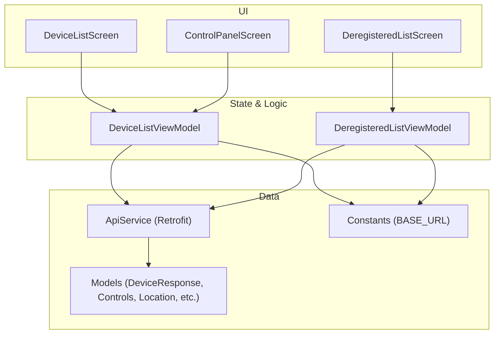
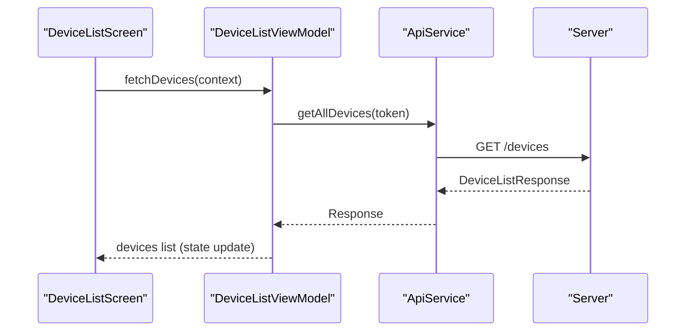
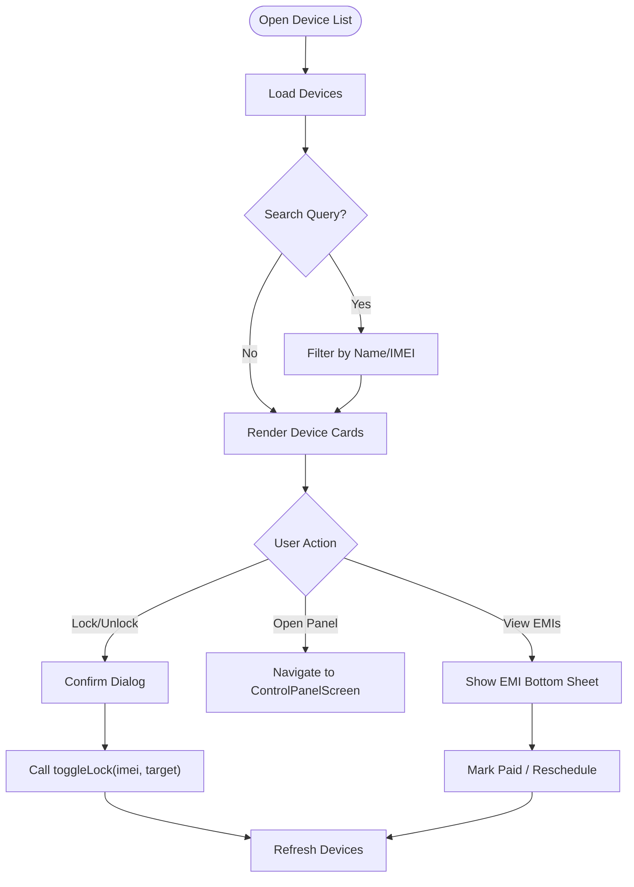
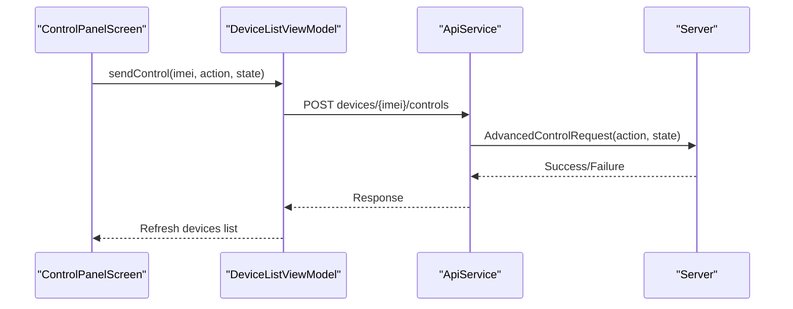
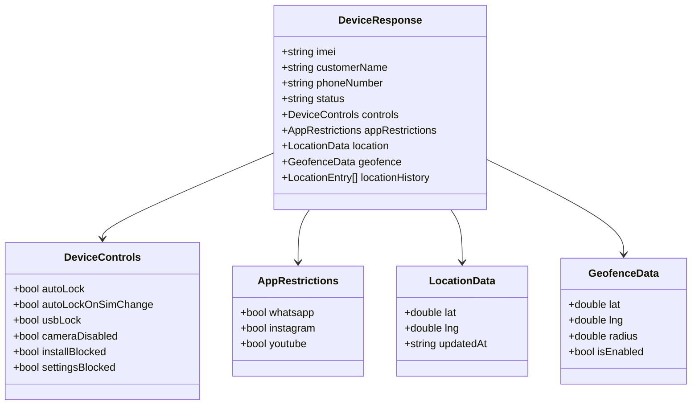
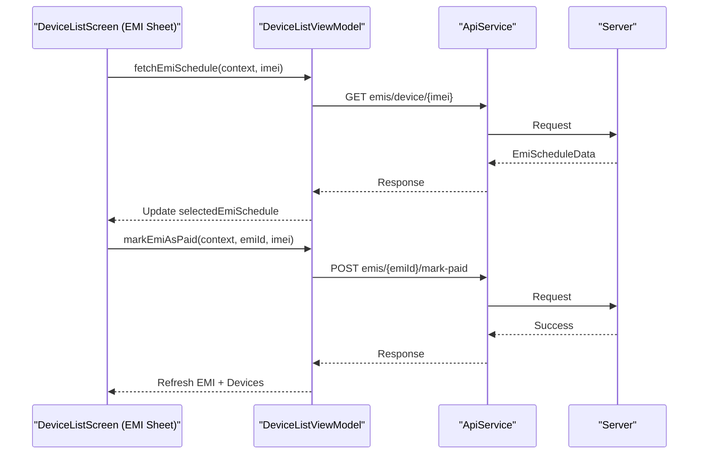
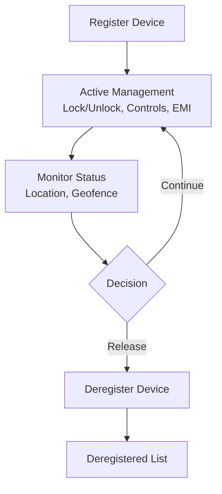
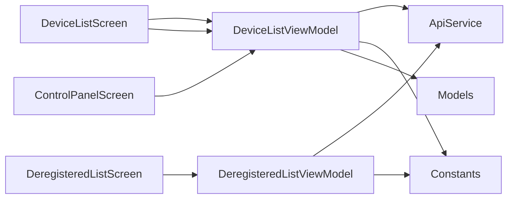

# Device Management

<cite>
**Referenced Files in This Document**
- [DeviceListScreen.kt](file://app/src/main/java/com/pksafe/lock/manager/ui/devices/DeviceListScreen.kt)
- [DeviceListViewModel.kt](file://app/src/main/java/com/pksafe/lock/manager/ui/devices/DeviceListViewModel.kt)
- [ControlPanelScreen.kt](file://app/src/main/java/com/pksafe/lock/manager/ui/devices/ControlPanelScreen.kt)
- [ApiService.kt](file://app/src/main/java/com/pksafe/lock/manager/data/ApiService.kt)
- [Models.kt](file://app/src/main/java/com/pksafe/lock/manager/data/Models.kt)
- [DeregisteredListScreen.kt](file://app/src/main/java/com/pksafe/lock/manager/ui/deregister/DeregisteredListScreen.kt)
- [DeregisteredListViewModel.kt](file://app/src/main/java/com/pksafe/lock/manager/ui/deregister/DeregisteredListViewModel.kt)
- [Constants.kt](file://app/src/main/java/com/pksafe/lock/manager/util/Constants.kt)
</cite>

## Table of Contents
1. Introduction
2. Project Structure
3. Core Components
4. Architecture Overview
5. Detailed Component Analysis
6. Dependency Analysis
7. Performance Considerations
8. Troubleshooting Guide
9. Conclusion

## Introduction
This document explains the device management system within PK Locker’s admin dashboard. It covers the device list interface, filtering and search, bulk operations (mass lock/unlock, hardware restriction updates, configuration changes), the device detail view with comprehensive information and controls, lifecycle management from enrollment to decommissioning, and performance strategies for large inventories.

## Project Structure
The device management feature is implemented using Jetpack Compose UI components backed by a ViewModel that communicates with a REST API via Retrofit. The key modules are:
- UI screens for listing devices and managing individual devices
- ViewModels handling state, network calls, and business logic
- Data models describing device entities, controls, location, and EMI schedules
- API service definitions for all server endpoints
- Deregistration flow for decommissioned devices

**Diagram sources**
- [DeviceListScreen.kt:38-174](file://app/src/main/java/com/pksafe/lock/manager/ui/devices/DeviceListScreen.kt#L38-L174)
- [ControlPanelScreen.kt:54-229](file://app/src/main/java/com/pksafe/lock/manager/ui/devices/ControlPanelScreen.kt#L54-L229)
- [DeviceListViewModel.kt:18-64](file://app/src/main/java/com/pksafe/lock/manager/ui/devices/DeviceListViewModel.kt#L18-L64)
- [DeregisteredListViewModel.kt:16-57](file://app/src/main/java/com/pksafe/lock/manager/ui/deregister/DeregisteredListViewModel.kt#L16-L57)
- [ApiService.kt:11-185](file://app/src/main/java/com/pksafe/lock/manager/data/ApiService.kt#L11-L185)
- [Models.kt:45-121](file://app/src/main/java/com/pksafe/lock/manager/data/Models.kt#L45-L121)
- [Constants.kt:3-9](file://app/src/main/java/com/pksafe/lock/manager/util/Constants.kt#L3-L9)

**Section sources**
- [DeviceListScreen.kt:38-174](file://app/src/main/java/com/pksafe/lock/manager/ui/devices/DeviceListScreen.kt#L38-L174)
- [DeviceListViewModel.kt:18-64](file://app/src/main/java/com/pksafe/lock/manager/ui/devices/DeviceListViewModel.kt#L18-L64)
- [ApiService.kt:11-185](file://app/src/main/java/com/pksafe/lock/manager/data/ApiService.kt#L11-L185)
- [Models.kt:45-121](file://app/src/main/java/com/pksafe/lock/manager/data/Models.kt#L45-L121)
- [Constants.kt:3-9](file://app/src/main/java/com/pksafe/lock/manager/util/Constants.kt#L3-L9)

## Core Components
- Device list screen: Displays enrolled devices with status badges, quick actions, and search filtering. Supports opening the control panel per device and viewing EMI details.
- Control panel screen: Provides per-device controls including security toggles, app restrictions, utilities, offline SMS commands, and deregistration.
- ViewModels: Encapsulate fetching device lists, applying lock/unlock, sending advanced controls, unlocking all controls, and handling EMI schedule operations.
- API service: Defines endpoints for device CRUD, controls, location reporting, EMI scheduling, and deregistration.
- Models: Define device data structures, controls, location, geofence, and EMI schedule objects.

**Section sources**
- [DeviceListScreen.kt:38-174](file://app/src/main/java/com/pksafe/lock/manager/ui/devices/DeviceListScreen.kt#L38-L174)
- [ControlPanelScreen.kt:54-229](file://app/src/main/java/com/pksafe/lock/manager/ui/devices/ControlPanelScreen.kt#L54-L229)
- [DeviceListViewModel.kt:18-245](file://app/src/main/java/com/pksafe/lock/manager/ui/devices/DeviceListViewModel.kt#L18-L245)
- [ApiService.kt:11-185](file://app/src/main/java/com/pksafe/lock/manager/data/ApiService.kt#L11-L185)
- [Models.kt:45-121](file://app/src/main/java/com/pksafe/lock/manager/data/Models.kt#L45-L121)

## Architecture Overview
The system follows a clean separation between UI, state management, and data access:
- UI screens observe ViewModel state and trigger actions.
- ViewModels perform network requests through Retrofit and update local state.
- Data models represent server payloads and are used across layers.
- Constants centralize base URL configuration.

**Diagram sources**
- [DeviceListScreen.kt:52-54](file://app/src/main/java/com/pksafe/lock/manager/ui/devices/DeviceListScreen.kt#L52-L54)
- [DeviceListViewModel.kt:33-64](file://app/src/main/java/com/pksafe/lock/manager/ui/devices/DeviceListViewModel.kt#L33-L64)
- [ApiService.kt:26-29](file://app/src/main/java/com/pksafe/lock/manager/data/ApiService.kt#L26-L29)

## Detailed Component Analysis

### Device List Interface
- Displays enrolled devices with customer name, IMEI snippet, phone number, registration date, tenure, and installment amount.
- Status badge shows Locked or Active based on device status.
- Search bar filters devices by customer name or IMEI locally.
- Quick actions include Lock/Unlock confirmation dialog and opening the Control Panel.
- EMI bottom sheet allows viewing payment schedule, marking installments as paid, and rescheduling plans.

**Diagram sources**
- [DeviceListScreen.kt:52-174](file://app/src/main/java/com/pksafe/lock/manager/ui/devices/DeviceListScreen.kt#L52-L174)
- [DeviceListViewModel.kt:143-171](file://app/src/main/java/com/pksafe/lock/manager/ui/devices/DeviceListViewModel.kt#L143-L171)

**Section sources**
- [DeviceListScreen.kt:38-174](file://app/src/main/java/com/pksafe/lock/manager/ui/devices/DeviceListScreen.kt#L38-L174)
- [DeviceListViewModel.kt:143-171](file://app/src/main/java/com/pksafe/lock/manager/ui/devices/DeviceListViewModel.kt#L143-L171)

### Filtering and Search
- Local filtering is performed on the client side by matching the search query against customerName and imei fields.
- No server-side pagination or filtering is currently invoked; this keeps interactions fast but may scale poorly with very large datasets.

**Section sources**
- [DeviceListScreen.kt:101-138](file://app/src/main/java/com/pksafe/lock/manager/ui/devices/DeviceListScreen.kt#L101-L138)
- [Models.kt:48-76](file://app/src/main/java/com/pksafe/lock/manager/data/Models.kt#L48-L76)

### Bulk Operations
- Mass lock/unlock: Implemented per device via confirmation dialogs and toggleLock method. There is no explicit multi-select bulk operation in the current codebase; administrators can quickly iterate through devices to apply lock/unlock.
- Hardware restriction updates: Per-device controls are sent via sendAdvancedControl with action keys such as autoLock, usbLock, cameraDisabled, installBlocked, settingsBlocked, and app-specific restrictions.
- Configuration changes: EMI plan rescheduling and marking payments as paid are supported via dedicated endpoints and ViewModel methods.

**Diagram sources**
- [ControlPanelScreen.kt:310-345](file://app/src/main/java/com/pksafe/lock/manager/ui/devices/ControlPanelScreen.kt#L310-L345)
- [DeviceListViewModel.kt:173-195](file://app/src/main/java/com/pksafe/lock/manager/ui/devices/DeviceListViewModel.kt#L173-L195)
- [ApiService.kt:58-63](file://app/src/main/java/com/pksafe/lock/manager/data/ApiService.kt#L58-L63)

**Section sources**
- [ControlPanelScreen.kt:310-345](file://app/src/main/java/com/pksafe/lock/manager/ui/devices/ControlPanelScreen.kt#L310-L345)
- [DeviceListViewModel.kt:173-195](file://app/src/main/java/com/pksafe/lock/manager/ui/devices/DeviceListViewModel.kt#L173-L195)
- [ApiService.kt:58-63](file://app/src/main/java/com/pksafe/lock/manager/data/ApiService.kt#L58-L63)

### Device Detail View (Control Panel)
- Tabs: Secure Control, Hardware Tech, Live Tracker, Customer Profile, EMI Ledger.
- Secure Control: Toggles for auto-lock, SIM change lock, USB block, camera block, app install lock, settings lock; app restrictions; utility actions like requesting location and triggering warning audio/wallpaper; EMI reminder protocol with WhatsApp/SMS/Push triggers; emergency reset to clear all controls; deregistration workflow.
- Hardware Tech: Shows device identity and security IDs.
- Live Tracker: Displays current location and history; integrates map components.
- Customer Profile: Shows profile photo, contact info, CNIC proof, guarantor details.
- EMI Ledger: Financial summary and repayment plan details.

**Diagram sources**
- [Models.kt:48-121](file://app/src/main/java/com/pksafe/lock/manager/data/Models.kt#L48-L121)

**Section sources**
- [ControlPanelScreen.kt:54-229](file://app/src/main/java/com/pksafe/lock/manager/ui/devices/ControlPanelScreen.kt#L54-L229)
- [ControlPanelScreen.kt:251-494](file://app/src/main/java/com/pksafe/lock/manager/ui/devices/ControlPanelScreen.kt#L251-L494)
- [ControlPanelScreen.kt:651-719](file://app/src/main/java/com/pksafe/lock/manager/ui/devices/ControlPanelScreen.kt#L651-L719)
- [Models.kt:48-121](file://app/src/main/java/com/pksafe/lock/manager/data/Models.kt#L48-L121)

### EMI Schedule Management
- Fetch EMI schedule per device and display summaries and installment items.
- Mark installments as paid and refresh both EMI sheet and main device list.
- Reschedule plan by adjusting down payment, tenure, and custom EMI amount; validates balance and recalculates estimated EMI.

**Diagram sources**
- [DeviceListViewModel.kt:70-141](file://app/src/main/java/com/pksafe/lock/manager/ui/devices/DeviceListViewModel.kt#L70-L141)
- [ApiService.kt:112-129](file://app/src/main/java/com/pksafe/lock/manager/data/ApiService.kt#L112-L129)
- [Models.kt:123-147](file://app/src/main/java/com/pksafe/lock/manager/data/Models.kt#L123-L147)

**Section sources**
- [DeviceListViewModel.kt:70-141](file://app/src/main/java/com/pksafe/lock/manager/ui/devices/DeviceListViewModel.kt#L70-L141)
- [ApiService.kt:112-129](file://app/src/main/java/com/pksafe/lock/manager/data/ApiService.kt#L112-L129)
- [Models.kt:123-147](file://app/src/main/java/com/pksafe/lock/manager/data/Models.kt#L123-L147)

### Lifecycle Management: Enrollment to Decommissioning
- Enrollment: Register device via API endpoint; includes device identifiers, customer info, EMI plan, and optional media assets.
- Active Management: Lock/unlock, apply hardware restrictions, request location, trigger warnings, manage EMI payments and reschedules.
- Decommissioning: Deregister device permanently; moves it to the deregistered list view for audit.

**Diagram sources**
- [ApiService.kt:20-24](file://app/src/main/java/com/pksafe/lock/manager/data/ApiService.kt#L20-L24)
- [ApiService.kt:46-56](file://app/src/main/java/com/pksafe/lock/manager/data/ApiService.kt#L46-L56)
- [ApiService.kt:89-99](file://app/src/main/java/com/pksafe/lock/manager/data/ApiService.kt#L89-L99)
- [DeviceListViewModel.kt:222-244](file://app/src/main/java/com/pksafe/lock/manager/ui/devices/DeviceListViewModel.kt#L222-L244)
- [DeregisteredListScreen.kt:35-108](file://app/src/main/java/com/pksafe/lock/manager/ui/deregister/DeregisteredListScreen.kt#L35-L108)

**Section sources**
- [ApiService.kt:20-24](file://app/src/main/java/com/pksafe/lock/manager/data/ApiService.kt#L20-L24)
- [ApiService.kt:46-56](file://app/src/main/java/com/pksafe/lock/manager/data/ApiService.kt#L46-L56)
- [ApiService.kt:89-99](file://app/src/main/java/com/pksafe/lock/manager/data/ApiService.kt#L89-L99)
- [DeviceListViewModel.kt:222-244](file://app/src/main/java/com/pksafe/lock/manager/ui/devices/DeviceListViewModel.kt#L222-L244)
- [DeregisteredListScreen.kt:35-108](file://app/src/main/java/com/pksafe/lock/manager/ui/deregister/DeregisteredListScreen.kt#L35-L108)

## Dependency Analysis
- UI depends on ViewModels for state and actions.
- ViewModels depend on ApiService for network operations and on Constants for BASE_URL.
- Models define shared contracts between UI and API layers.
- Deregistration flow uses a separate ViewModel and screen to show released devices.

**Diagram sources**
- [DeviceListScreen.kt:38-174](file://app/src/main/java/com/pksafe/lock/manager/ui/devices/DeviceListScreen.kt#L38-L174)
- [ControlPanelScreen.kt:54-229](file://app/src/main/java/com/pksafe/lock/manager/ui/devices/ControlPanelScreen.kt#L54-L229)
- [DeviceListViewModel.kt:18-64](file://app/src/main/java/com/pksafe/lock/manager/ui/devices/DeviceListViewModel.kt#L18-L64)
- [DeregisteredListViewModel.kt:16-57](file://app/src/main/java/com/pksafe/lock/manager/ui/deregister/DeregisteredListViewModel.kt#L16-L57)
- [ApiService.kt:11-185](file://app/src/main/java/com/pksafe/lock/manager/data/ApiService.kt#L11-L185)
- [Constants.kt:3-9](file://app/src/main/java/com/pksafe/lock/manager/util/Constants.kt#L3-L9)

**Section sources**
- [DeviceListViewModel.kt:18-64](file://app/src/main/java/com/pksafe/lock/manager/ui/devices/DeviceListViewModel.kt#L18-L64)
- [DeregisteredListViewModel.kt:16-57](file://app/src/main/java/com/pksafe/lock/manager/ui/deregister/DeregisteredListViewModel.kt#L16-L57)
- [ApiService.kt:11-185](file://app/src/main/java/com/pksafe/lock/manager/data/ApiService.kt#L11-L185)
- [Constants.kt:3-9](file://app/src/main/java/com/pksafe/lock/manager/util/Constants.kt#L3-L9)

## Performance Considerations
- Client-side filtering: Current filtering is done in-memory on the device list. For large inventories, consider implementing server-side pagination and filtering to reduce payload size and improve responsiveness.
- Network efficiency: Each control action triggers a full device list refresh. Batch operations or optimistic UI updates with background reconciliation could reduce redundant network calls.
- State caching: Persist recent device lists locally to avoid repeated fetches when navigating back to the list.
- Image loading: Use efficient image loading libraries and cache images for profile pictures and proofs to minimize bandwidth and improve rendering speed.
- Background sync: Leverage WorkManager-like patterns to keep device locations and statuses updated without blocking UI.

[No sources needed since this section provides general guidance]

## Troubleshooting Guide
- Authentication errors: If token is missing, fetch operations return an authentication error message. Ensure login has completed and token is stored.
- Network failures: Connection errors set an error message and empty device lists. Verify connectivity and retry.
- Control command failures: When sending advanced controls, check logs for action failures and ensure the device is reachable and authorized.
- EMI operations: Errors during mark-as-paid or reschedule will surface messages; verify inputs and retry after resolving issues.
- Deregistration: Confirm the release process and verify the device appears in the deregistered list afterward.

**Section sources**
- [DeviceListViewModel.kt:33-64](file://app/src/main/java/com/pksafe/lock/manager/ui/devices/DeviceListViewModel.kt#L33-L64)
- [DeviceListViewModel.kt:173-195](file://app/src/main/java/com/pksafe/lock/manager/ui/devices/DeviceListViewModel.kt#L173-L195)
- [DeviceListViewModel.kt:222-244](file://app/src/main/java/com/pksafe/lock/manager/ui/devices/DeviceListViewModel.kt#L222-L244)
- [DeregisteredListViewModel.kt:31-57](file://app/src/main/java/com/pksafe/lock/manager/ui/deregister/DeregisteredListViewModel.kt#L31-L57)

## Conclusion
PK Locker’s device management system provides a robust admin dashboard for overseeing enrolled devices, applying security controls, tracking locations, and managing EMI schedules. While current filtering and refresh strategies are effective for moderate inventories, scaling to large device counts benefits from server-side pagination, batch operations, and optimized data loading. The modular architecture separates UI, state, and data concerns, enabling maintainable enhancements and future scalability.