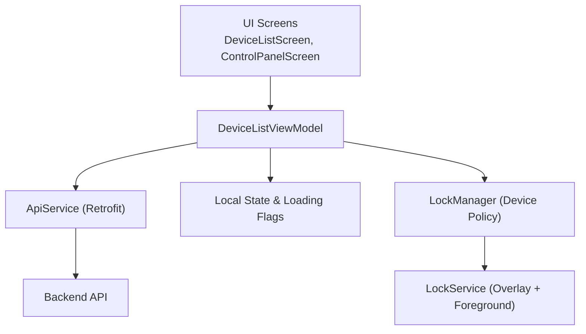
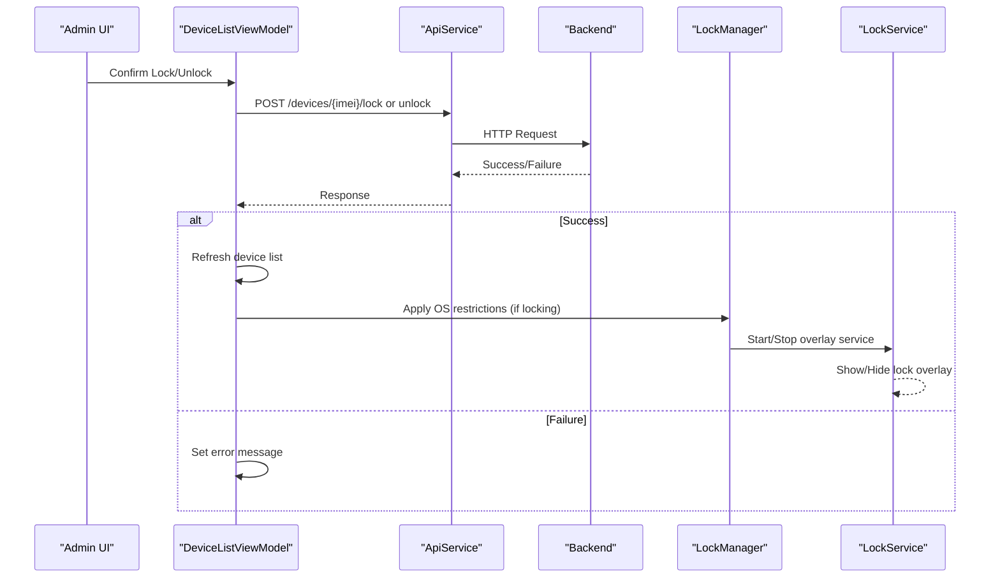
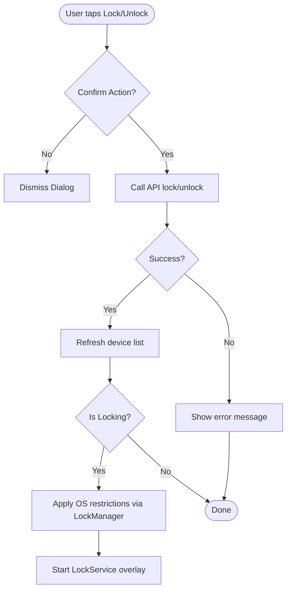
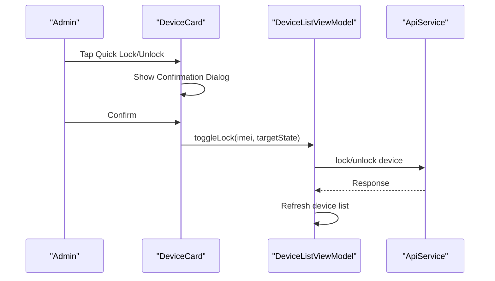
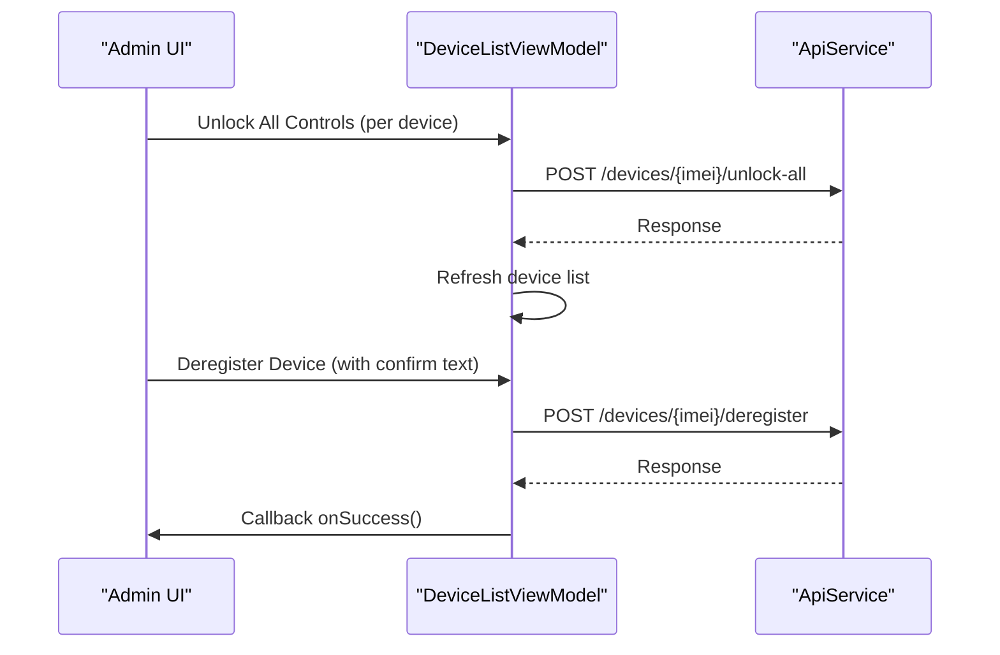
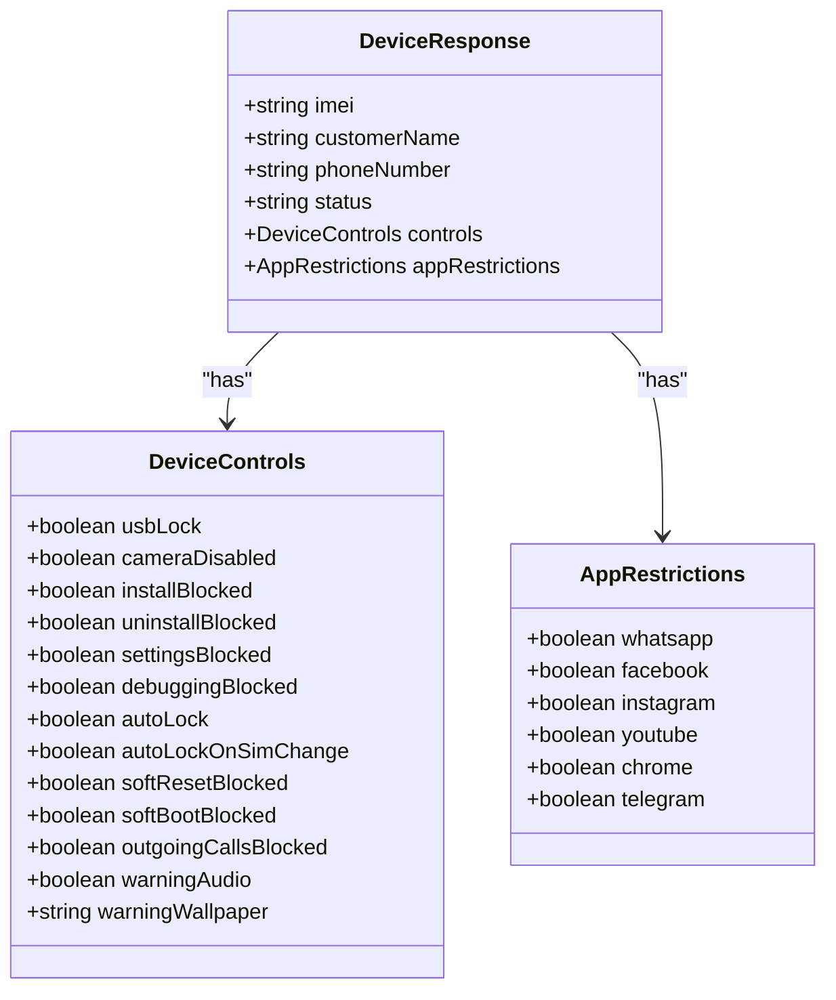
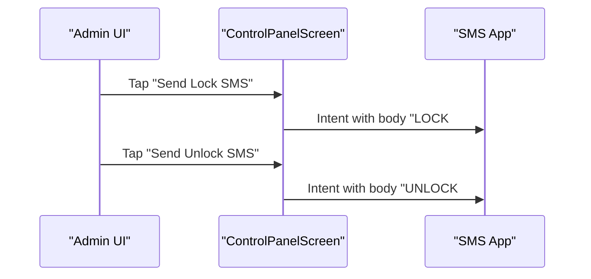
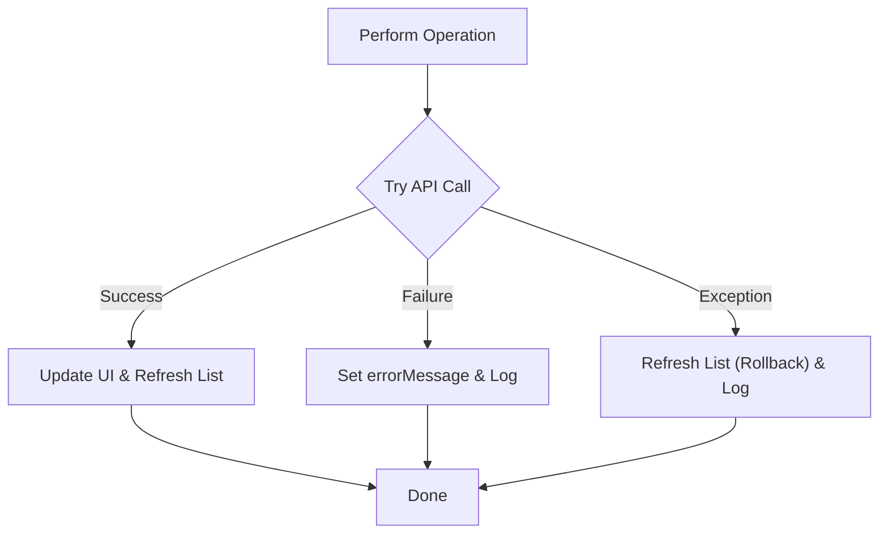
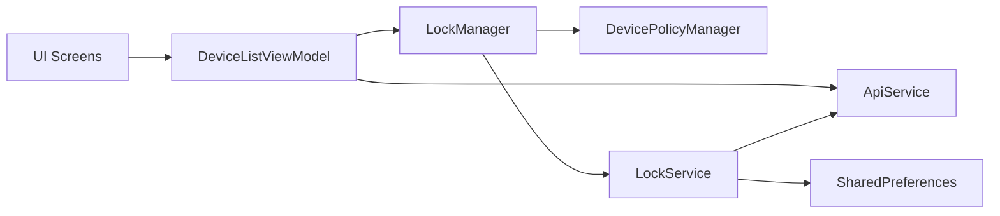

# Device Operations

<cite>
**Referenced Files in This Document**
- [DeviceListScreen.kt](file://app/src/main/java/com/pksafe/lock/manager/ui/devices/DeviceListScreen.kt)
- [DeviceListViewModel.kt](file://app/src/main/java/com/pksafe/lock/manager/ui/devices/DeviceListViewModel.kt)
- [ControlPanelScreen.kt](file://app/src/main/java/com/pksafe/lock/manager/ui/devices/ControlPanelScreen.kt)
- [LockManager.kt](file://app/src/main/java/com/pksafe/lock/manager/util/LockManager.kt)
- [LockService.kt](file://app/src/main/java/com/pksafe/lock/manager/service/LockService.kt)
- [ApiService.kt](file://app/src/main/java/com/pksafe/lock/manager/data/ApiService.kt)
- [Models.kt](file://app/src/main/java/com/pksafe/lock/manager/data/Models.kt)
</cite>

## Table of Contents
1. Introduction
2. Project Structure
3. Core Components
4. Architecture Overview
5. Detailed Component Analysis
6. Dependency Analysis
7. Performance Considerations
8. Troubleshooting Guide
9. Conclusion

## Introduction
This document explains device operation capabilities in PK Locker’s device management system with a focus on lock/unlock functionality, quick action buttons, bulk operations, error handling, user feedback, and transaction rollback behavior. It covers how administrators can remotely control device access through confirmation dialogs and immediate state changes, and how the app enforces restrictions at the OS level.

## Project Structure
The device operations span UI screens, view model logic, local enforcement services, and API integration:
- UI screens present devices, quick actions, and detailed controls.
- The view model orchestrates network calls and state updates.
- LockManager applies OS-level restrictions via Device Policy Manager.
- LockService provides persistent overlay enforcement and offline unlock flow.
- ApiService defines endpoints for lock/unlock, advanced controls, and reset operations.
- Models define request/response structures used across components.

**Diagram sources**
- [DeviceListScreen.kt:38-174](file://app/src/main/java/com/pksafe/lock/manager/ui/devices/DeviceListScreen.kt#L38-L174)
- [ControlPanelScreen.kt:55-229](file://app/src/main/java/com/pksafe/lock/manager/ui/devices/ControlPanelScreen.kt#L55-L229)
- [DeviceListViewModel.kt:143-220](file://app/src/main/java/com/pksafe/lock/manager/ui/devices/DeviceListViewModel.kt#L143-L220)
- [LockManager.kt:111-148](file://app/src/main/java/com/pksafe/lock/manager/util/LockManager.kt#L111-L148)
- [LockService.kt:50-80](file://app/src/main/java/com/pksafe/lock/manager/service/LockService.kt#L50-L80)
- [ApiService.kt:46-93](file://app/src/main/java/com/pksafe/lock/manager/data/ApiService.kt#L46-L93)

**Section sources**
- [DeviceListScreen.kt:38-174](file://app/src/main/java/com/pksafe/lock/manager/ui/devices/DeviceListScreen.kt#L38-L174)
- [ControlPanelScreen.kt:55-229](file://app/src/main/java/com/pksafe/lock/manager/ui/devices/ControlPanelScreen.kt#L55-L229)
- [DeviceListViewModel.kt:143-220](file://app/src/main/java/com/pksafe/lock/manager/ui/devices/DeviceListViewModel.kt#L143-L220)
- [LockManager.kt:111-148](file://app/src/main/java/com/pksafe/lock/manager/util/LockManager.kt#L111-L148)
- [LockService.kt:50-80](file://app/src/main/java/com/pksafe/lock/manager/service/LockService.kt#L50-L80)
- [ApiService.kt:46-93](file://app/src/main/java/com/pksafe/lock/manager/data/ApiService.kt#L46-L93)

## Core Components
- DeviceListScreen: Displays devices, search, refresh, and quick lock/unlock actions with confirmation dialogs.
- ControlPanelScreen: Provides per-device secure controls, emergency reset, SMS-based offline commands, and de-registration flows.
- DeviceListViewModel: Orchestrates API calls for lock/unlock, advanced controls, EMI schedule, and resets; manages loading/error states and refreshes device lists after successful operations.
- LockManager: Applies OS-level restrictions using Device Policy Manager (camera, USB, factory reset, safe mode, ADB, settings, status bar).
- LockService: Runs a foreground service with an overlay to enforce lock state, handle offline unlock codes, and update lock screen content from server data.
- ApiService: Retrofit interface defining endpoints for lock/unlock, advanced controls, unlock-all, deregister, and EMI operations.
- Models: Data classes representing device info, controls, app restrictions, EMI schedules, and requests/responses.

**Section sources**
- [DeviceListScreen.kt:38-174](file://app/src/main/java/com/pksafe/lock/manager/ui/devices/DeviceListScreen.kt#L38-L174)
- [ControlPanelScreen.kt:55-229](file://app/src/main/java/com/pksafe/lock/manager/ui/devices/ControlPanelScreen.kt#L55-L229)
- [DeviceListViewModel.kt:143-220](file://app/src/main/java/com/pksafe/lock/manager/ui/devices/DeviceListViewModel.kt#L143-L220)
- [LockManager.kt:111-148](file://app/src/main/java/com/pksafe/lock/manager/util/LockManager.kt#L111-L148)
- [LockService.kt:50-80](file://app/src/main/java/com/pksafe/lock/manager/service/LockService.kt#L50-L80)
- [ApiService.kt:46-93](file://app/src/main/java/com/pksafe/lock/manager/data/ApiService.kt#L46-L93)
- [Models.kt:48-101](file://app/src/main/java/com/pksafe/lock/manager/data/Models.kt#L48-L101)

## Architecture Overview
The admin initiates device operations from the UI. The view model validates authentication, calls the backend API, and updates UI state. On success, the device list is refreshed to reflect the new state. For immediate enforcement, LockManager applies OS-level restrictions and starts LockService to maintain a persistent lock overlay. Advanced controls are sent via a unified endpoint that toggles features like USB block, camera disable, install block, etc.

**Diagram sources**
- [DeviceListViewModel.kt:143-171](file://app/src/main/java/com/pksafe/lock/manager/ui/devices/DeviceListViewModel.kt#L143-L171)
- [ApiService.kt:46-56](file://app/src/main/java/com/pksafe/lock/manager/data/ApiService.kt#L46-L56)
- [LockManager.kt:111-148](file://app/src/main/java/com/pksafe/lock/manager/util/LockManager.kt#L111-L148)
- [LockService.kt:50-80](file://app/src/main/java/com/pksafe/lock/manager/service/LockService.kt#L50-L80)

## Detailed Component Analysis

### Lock/Unlock Functionality with Confirmation Dialogs
- Admin triggers lock/unlock from either the device list card or the control panel.
- A confirmation dialog appears before execution to prevent accidental changes.
- Upon confirmation, the view model calls the appropriate API endpoint and refreshes the device list on success.
- If locking, LockManager applies hardware restrictions and starts LockService to enforce the lock overlay.

**Diagram sources**
- [DeviceListScreen.kt:56-81](file://app/src/main/java/com/pksafe/lock/manager/ui/devices/DeviceListScreen.kt#L56-L81)
- [DeviceListViewModel.kt:143-171](file://app/src/main/java/com/pksafe/lock/manager/ui/devices/DeviceListViewModel.kt#L143-L171)
- [ControlPanelScreen.kt:72-98](file://app/src/main/java/com/pksafe/lock/manager/ui/devices/ControlPanelScreen.kt#L72-L98)
- [LockManager.kt:111-148](file://app/src/main/java/com/pksafe/lock/manager/util/LockManager.kt#L111-L148)

**Section sources**
- [DeviceListScreen.kt:56-81](file://app/src/main/java/com/pksafe/lock/manager/ui/devices/DeviceListScreen.kt#L56-L81)
- [DeviceListViewModel.kt:143-171](file://app/src/main/java/com/pksafe/lock/manager/ui/devices/DeviceListViewModel.kt#L143-L171)
- [ControlPanelScreen.kt:72-98](file://app/src/main/java/com/pksafe/lock/manager/ui/devices/ControlPanelScreen.kt#L72-L98)
- [LockManager.kt:111-148](file://app/src/main/java/com/pksafe/lock/manager/util/LockManager.kt#L111-L148)

### Quick Action Buttons
- Each device card shows a quick lock/unlock button that adapts to the current device status.
- Tapping the button opens a confirmation dialog to ensure intentional action.
- After confirmation, the same lock/unlock flow executes as above.

**Diagram sources**
- [DeviceListScreen.kt:145-165](file://app/src/main/java/com/pksafe/lock/manager/ui/devices/DeviceListScreen.kt#L145-L165)
- [DeviceListViewModel.kt:143-171](file://app/src/main/java/com/pksafe/lock/manager/ui/devices/DeviceListViewModel.kt#L143-L171)
- [ApiService.kt:46-56](file://app/src/main/java/com/pksafe/lock/manager/data/ApiService.kt#L46-L56)

**Section sources**
- [DeviceListScreen.kt:145-165](file://app/src/main/java/com/pksafe/lock/manager/ui/devices/DeviceListScreen.kt#L145-L165)
- [DeviceListViewModel.kt:143-171](file://app/src/main/java/com/pksafe/lock/manager/ui/devices/DeviceListViewModel.kt#L143-L171)

### Bulk Operation Support
- Unlock All Controls: Clears all active restrictions (USB, Camera, Apps, etc.) for a specific device via a dedicated endpoint.
- Deregister Device: Removes a device from the secure network and clears privileges, requiring explicit confirmation text input.
- Note: There is no mass lock/unlock across multiple devices in this codebase; bulk operations are scoped to a single device at a time.

**Diagram sources**
- [DeviceListViewModel.kt:197-220](file://app/src/main/java/com/pksafe/lock/manager/ui/devices/DeviceListViewModel.kt#L197-L220)
- [DeviceListViewModel.kt:222-244](file://app/src/main/java/com/pksafe/lock/manager/ui/devices/DeviceListViewModel.kt#L222-L244)
- [ApiService.kt:89-99](file://app/src/main/java/com/pksafe/lock/manager/data/ApiService.kt#L89-L99)
- [ControlPanelScreen.kt:255-280](file://app/src/main/java/com/pksafe/lock/manager/ui/devices/ControlPanelScreen.kt#L255-L280)
- [ControlPanelScreen.kt:432-472](file://app/src/main/java/com/pksafe/lock/manager/ui/devices/ControlPanelScreen.kt#L432-L472)

**Section sources**
- [DeviceListViewModel.kt:197-244](file://app/src/main/java/com/pksafe/lock/manager/ui/devices/DeviceListViewModel.kt#L197-L244)
- [ApiService.kt:89-99](file://app/src/main/java/com/pksafe/lock/manager/data/ApiService.kt#L89-L99)
- [ControlPanelScreen.kt:255-280](file://app/src/main/java/com/pksafe/lock/manager/ui/devices/ControlPanelScreen.kt#L255-L280)
- [ControlPanelScreen.kt:432-472](file://app/src/main/java/com/pksafe/lock/manager/ui/devices/ControlPanelScreen.kt#L432-L472)

### Advanced Controls and Immediate State Changes
- Advanced controls allow toggling features such as USB terminal block, camera disable, application install lock, system settings lock, auto-lock behaviors, and more.
- These are sent via a unified endpoint with an action and state payload.
- On success, the device list is refreshed to reflect accurate state.

**Diagram sources**
- [Models.kt:48-101](file://app/src/main/java/com/pksafe/lock/manager/data/Models.kt#L48-L101)

**Section sources**
- [DeviceListViewModel.kt:173-195](file://app/src/main/java/com/pksafe/lock/manager/ui/devices/DeviceListViewModel.kt#L173-L195)
- [ApiService.kt:58-63](file://app/src/main/java/com/pksafe/lock/manager/data/ApiService.kt#L58-L63)
- [Models.kt:48-101](file://app/src/main/java/com/pksafe/lock/manager/data/Models.kt#L48-L101)

### Offline SMS Commands
- The control panel supports sending lock/unlock SMS directly to the device when offline.
- The app constructs messages using stored lock/unlock codes and launches the device’s SMS app.
- This complements cloud-based operations by enabling direct terminal connection without internet.

**Diagram sources**
- [ControlPanelScreen.kt:571-623](file://app/src/main/java/com/pksafe/lock/manager/ui/devices/ControlPanelScreen.kt#L571-L623)

**Section sources**
- [ControlPanelScreen.kt:571-623](file://app/src/main/java/com/pksafe/lock/manager/ui/devices/ControlPanelScreen.kt#L571-L623)

### Error Handling, User Feedback, and Transaction Rollback
- Network errors and API failures set an error message in the view model and clear device lists where appropriate.
- On exceptions during lock/unlock or advanced controls, the view model refreshes the device list to roll back UI state to the server’s authoritative state.
- Loading indicators provide feedback during operations.
- Critical destructive actions require explicit confirmation (e.g., deregistration requires typing “CONFIRM”).

**Diagram sources**
- [DeviceListViewModel.kt:33-64](file://app/src/main/java/com/pksafe/lock/manager/ui/devices/DeviceListViewModel.kt#L33-L64)
- [DeviceListViewModel.kt:143-171](file://app/src/main/java/com/pksafe/lock/manager/ui/devices/DeviceListViewModel.kt#L143-L171)
- [DeviceListViewModel.kt:173-195](file://app/src/main/java/com/pksafe/lock/manager/ui/devices/DeviceListViewModel.kt#L173-L195)
- [DeviceListViewModel.kt:197-220](file://app/src/main/java/com/pksafe/lock/manager/ui/devices/DeviceListViewModel.kt#L197-L220)

**Section sources**
- [DeviceListViewModel.kt:33-64](file://app/src/main/java/com/pksafe/lock/manager/ui/devices/DeviceListViewModel.kt#L33-L64)
- [DeviceListViewModel.kt:143-171](file://app/src/main/java/com/pksafe/lock/manager/ui/devices/DeviceListViewModel.kt#L143-L171)
- [DeviceListViewModel.kt:173-195](file://app/src/main/java/com/pksafe/lock/manager/ui/devices/DeviceListViewModel.kt#L173-L195)
- [DeviceListViewModel.kt:197-220](file://app/src/main/java/com/pksafe/lock/manager/ui/devices/DeviceListViewModel.kt#L197-L220)

## Dependency Analysis
- UI depends on the view model for state and actions.
- View model depends on ApiService for remote operations and on LockManager for local enforcement.
- LockManager uses Android Device Policy Manager APIs to apply restrictions and may start LockService for persistent enforcement.
- LockService interacts with SharedPreferences and optionally fetches live data from the backend to update the lock overlay.

**Diagram sources**
- [DeviceListViewModel.kt:143-220](file://app/src/main/java/com/pksafe/lock/manager/ui/devices/DeviceListViewModel.kt#L143-L220)
- [LockManager.kt:27-46](file://app/src/main/java/com/pksafe/lock/manager/util/LockManager.kt#L27-L46)
- [LockService.kt:50-80](file://app/src/main/java/com/pksafe/lock/manager/service/LockService.kt#L50-L80)
- [ApiService.kt:46-93](file://app/src/main/java/com/pksafe/lock/manager/data/ApiService.kt#L46-L93)

**Section sources**
- [DeviceListViewModel.kt:143-220](file://app/src/main/java/com/pksafe/lock/manager/ui/devices/DeviceListViewModel.kt#L143-L220)
- [LockManager.kt:27-46](file://app/src/main/java/com/pksafe/lock/manager/util/LockManager.kt#L27-L46)
- [LockService.kt:50-80](file://app/src/main/java/com/pksafe/lock/manager/service/LockService.kt#L50-L80)
- [ApiService.kt:46-93](file://app/src/main/java/com/pksafe/lock/manager/data/ApiService.kt#L46-L93)

## Performance Considerations
- Avoid excessive network calls by refreshing the device list only after successful operations.
- Use foreground services for persistent overlays to ensure reliability under memory pressure.
- Debounce or throttle UI-triggered actions if needed to prevent redundant requests.
- Cache device state locally where appropriate and reconcile with server state after operations.

[No sources needed since this section provides general guidance]

## Troubleshooting Guide
- Authentication required: Ensure a valid token exists before fetching devices or performing operations.
- Network errors: Check connectivity and retry; the view model sets error messages and logs failures.
- OS-level restrictions not applied: Verify Device Admin and Device Owner permissions; LockManager checks these before applying restrictions.
- Overlay issues: LockService ensures proper window flags and handles keyboard interactions; verify overlay permission if needed.
- Destructive actions: Deregistration requires explicit confirmation text; ensure correct input to proceed.

**Section sources**
- [DeviceListViewModel.kt:33-64](file://app/src/main/java/com/pksafe/lock/manager/ui/devices/DeviceListViewModel.kt#L33-L64)
- [LockManager.kt:46-73](file://app/src/main/java/com/pksafe/lock/manager/util/LockManager.kt#L46-L73)
- [LockService.kt:125-168](file://app/src/main/java/com/pksafe/lock/manager/service/LockService.kt#L125-L168)
- [ControlPanelScreen.kt:432-472](file://app/src/main/java/com/pksafe/lock/manager/ui/devices/ControlPanelScreen.kt#L432-L472)

## Conclusion
PK Locker’s device management system provides robust lock/unlock capabilities with confirmation dialogs, quick action buttons, and targeted bulk operations per device. Advanced controls enable granular restriction management, while LockManager and LockService enforce OS-level security. Error handling and state reconciliation ensure reliable operations and consistent UI state. Administrators can confidently manage device access with clear feedback and safeguards against unintended actions.

[No sources needed since this section summarizes without analyzing specific files]