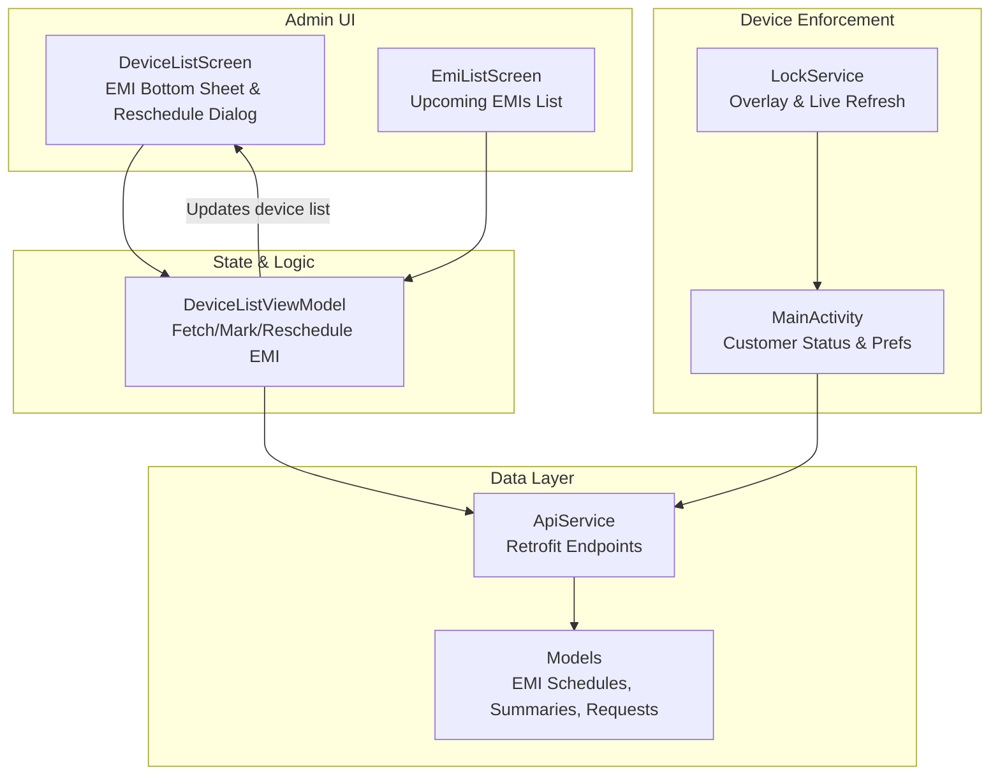
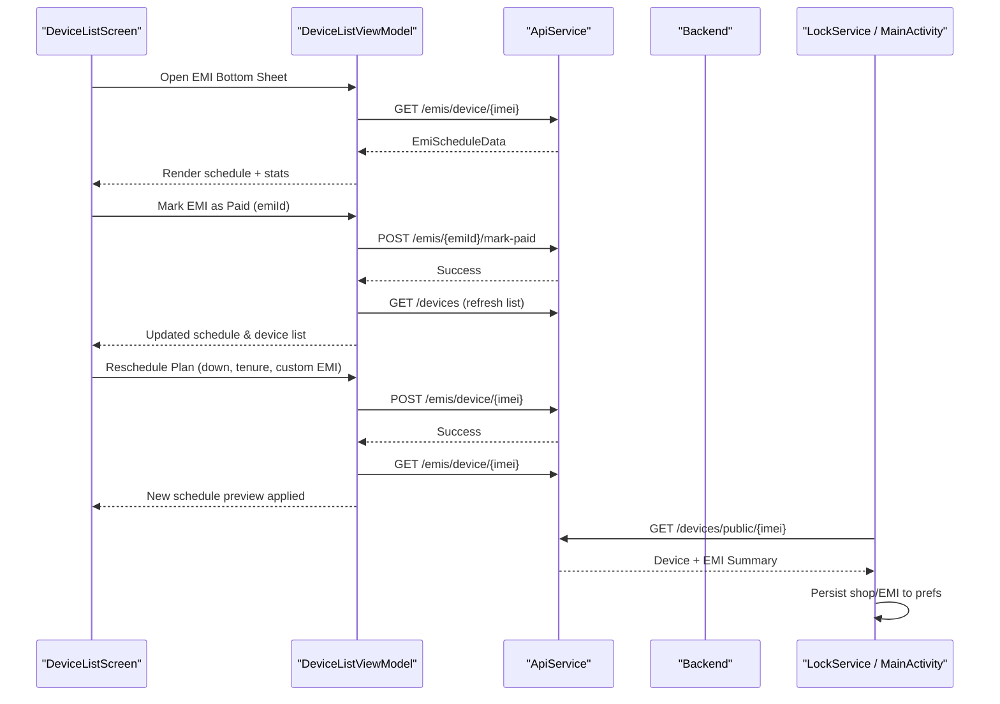
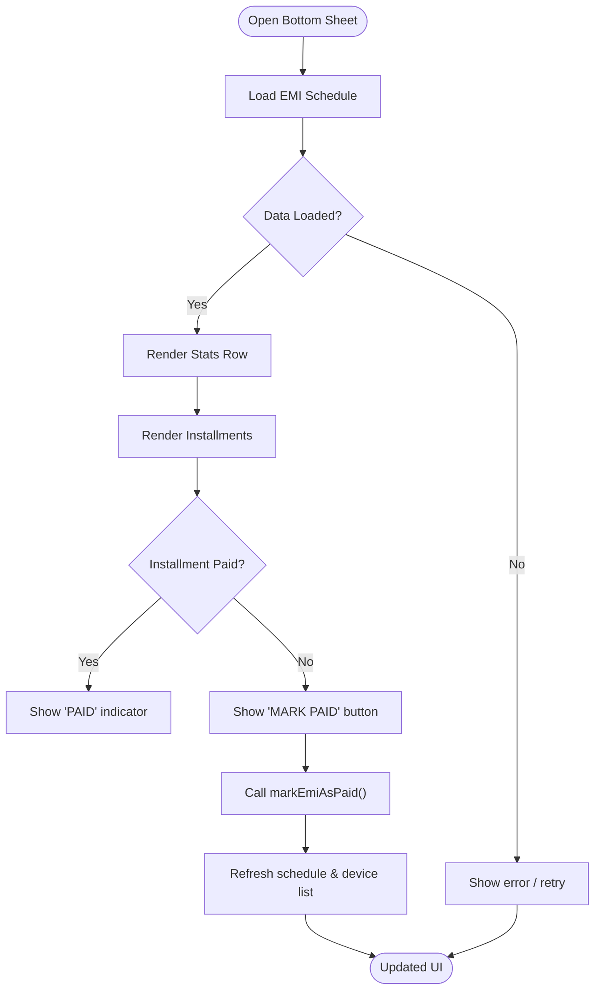
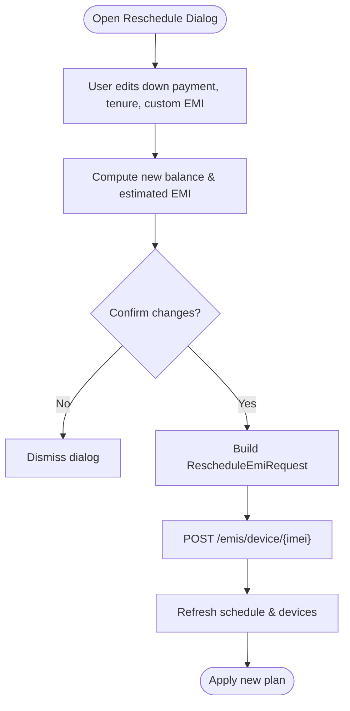
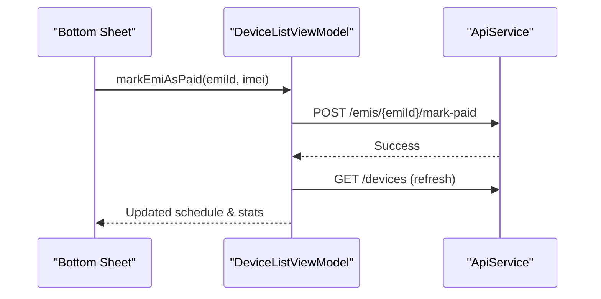
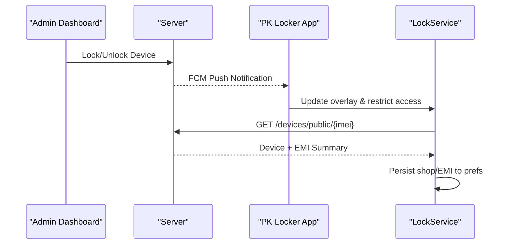
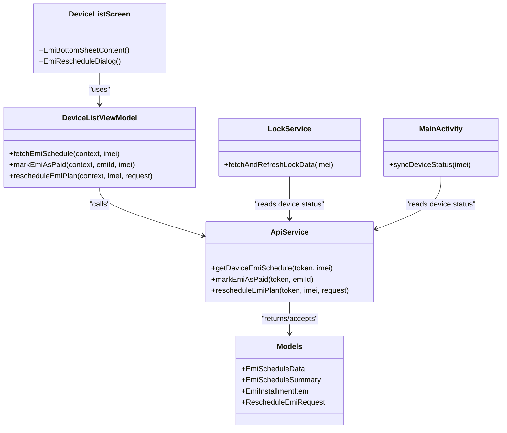

# EMI Management

<cite>
**Referenced Files in This Document**
- [EmiListScreen.kt](file://app/src/main/java/com/pksafe/lock/manager/ui/emi/EmiListScreen.kt)
- [DeviceListScreen.kt](file://app/src/main/java/com/pksafe/lock/manager/ui/devices/DeviceListScreen.kt)
- [DeviceListViewModel.kt](file://app/src/main/java/com/pksafe/lock/manager/ui/devices/DeviceListViewModel.kt)
- [Models.kt](file://app/src/main/java/com/pksafe/lock/manager/data/Models.kt)
- [ApiService.kt](file://app/src/main/java/com/pksafe/lock/manager/data/ApiService.kt)
- [LockService.kt](file://app/src/main/java/com/pksafe/lock/manager/service/LockService.kt)
- [MainActivity.kt](file://app/src/main/java/com/pksafe/lock/manager/MainActivity.kt)
- [README.md](file://README.md)
</cite>

## Table of Contents
1. [Introduction](#introduction)
2. [Project Structure](#project-structure)
3. [Core Components](#core-components)
4. [Architecture Overview](#architecture-overview)
5. [Detailed Component Analysis](#detailed-component-analysis)
6. [Dependency Analysis](#dependency-analysis)
7. [Performance Considerations](#performance-considerations)
8. [Troubleshooting Guide](#troubleshooting-guide)
9. [Conclusion](#conclusion)

## Introduction
This document explains the EMI (Equated Monthly Installment) management system integrated into PK Locker’s device management interface. It covers:
- The modal bottom sheet that displays complete EMI schedules, payment history, remaining balance, and upcoming installments.
- Rescheduling functionality to modify loan terms, adjust down payments, extend tenures, and customize monthly EMI amounts with real-time preview calculations.
- Payment tracking showing paid vs unpaid installments with visual indicators and status markers.
- Integration between EMI status and device lock/unlock functionality, where payment defaults trigger automatic device restrictions and unlocking upon payment confirmation.

## Project Structure
The EMI feature spans UI screens, a ViewModel for state and API orchestration, data models, and service components that enforce device restrictions based on EMI status.

**Diagram sources**
- [DeviceListScreen.kt:372-638](file://app/src/main/java/com/pksafe/lock/manager/ui/devices/DeviceListScreen.kt#L372-L638)
- [EmiListScreen.kt:38-98](file://app/src/main/java/com/pksafe/lock/manager/ui/emi/EmiListScreen.kt#L38-L98)
- [DeviceListViewModel.kt:66-141](file://app/src/main/java/com/pksafe/lock/manager/ui/devices/DeviceListViewModel.kt#L66-L141)
- [ApiService.kt:111-129](file://app/src/main/java/com/pksafe/lock/manager/data/ApiService.kt#L111-L129)
- [Models.kt:124-173](file://app/src/main/java/com/pksafe/lock/manager/data/Models.kt#L124-L173)
- [LockService.kt:230-330](file://app/src/main/java/com/pksafe/lock/manager/service/LockService.kt#L230-L330)
- [MainActivity.kt:501-563](file://app/src/main/java/com/pksafe/lock/manager/MainActivity.kt#L501-L563)

**Section sources**
- [DeviceListScreen.kt:372-638](file://app/src/main/java/com/pksafe/lock/manager/ui/devices/DeviceListScreen.kt#L372-L638)
- [EmiListScreen.kt:38-98](file://app/src/main/java/com/pksafe/lock/manager/ui/emi/EmiListScreen.kt#L38-L98)
- [DeviceListViewModel.kt:66-141](file://app/src/main/java/com/pksafe/lock/manager/ui/devices/DeviceListViewModel.kt#L66-L141)
- [ApiService.kt:111-129](file://app/src/main/java/com/pksafe/lock/manager/data/ApiService.kt#L111-L129)
- [Models.kt:124-173](file://app/src/main/java/com/pksafe/lock/manager/data/Models.kt#L124-L173)
- [LockService.kt:230-330](file://app/src/main/java/com/pksafe/lock/manager/service/LockService.kt#L230-L330)
- [MainActivity.kt:501-563](file://app/src/main/java/com/pksafe/lock/manager/MainActivity.kt#L501-L563)

## Core Components
- EMI Bottom Sheet: Displays total loan, paid totals, remaining balances, and an installment list with paid/unpaid states and actions.
- Reschedule Dialog: Allows administrators to add down payment, change tenure, and optionally set a custom EMI amount with live preview.
- Payment Tracking: Visual indicators for paid vs unpaid installments; “Mark as Paid” action updates schedule and refreshes lists.
- Device Lock Integration: Customer-facing overlay fetches live EMI info and persists shop/EMI details; remote lock/unlock flows are documented in the README.

**Section sources**
- [DeviceListScreen.kt:372-638](file://app/src/main/java/com/pksafe/lock/manager/ui/devices/DeviceListScreen.kt#L372-L638)
- [DeviceListViewModel.kt:66-141](file://app/src/main/java/com/pksafe/lock/manager/ui/devices/DeviceListViewModel.kt#L66-L141)
- [Models.kt:124-173](file://app/src/main/java/com/pksafe/lock/manager/data/Models.kt#L124-L173)
- [README.md:81-122](file://README.md#L81-L122)

## Architecture Overview
The EMI flow is driven by Compose UI components backed by a ViewModel that orchestrates Retrofit calls to the backend. After marking payments or rescheduling plans, the UI refreshes to reflect updated schedules and device statuses. On the customer side, the lock overlay periodically refreshes EMI details from the server and persists them for offline visibility.

**Diagram sources**
- [DeviceListScreen.kt:372-638](file://app/src/main/java/com/pksafe/lock/manager/ui/devices/DeviceListScreen.kt#L372-L638)
- [DeviceListViewModel.kt:66-141](file://app/src/main/java/com/pksafe/lock/manager/ui/devices/DeviceListViewModel.kt#L66-L141)
- [ApiService.kt:111-129](file://app/src/main/java/com/pksafe/lock/manager/data/ApiService.kt#L111-L129)
- [LockService.kt:230-330](file://app/src/main/java/com/pksafe/lock/manager/service/LockService.kt#L230-L330)
- [MainActivity.kt:501-563](file://app/src/main/java/com/pksafe/lock/manager/MainActivity.kt#L501-L563)

## Detailed Component Analysis

### EMI Bottom Sheet (Modal)
- Purpose: Show complete EMI schedule, summary statistics (total loan, paid, remaining), and per-installment actions.
- Key behaviors:
  - Loads schedule via ViewModel using IMEI.
  - Displays stats row with color-coded cards for paid and remaining.
  - Lists each installment with due date, amount, and status.
  - Provides “Mark as Paid” button for unpaid items.
  - Opens reschedule dialog when available.

**Diagram sources**
- [DeviceListScreen.kt:372-638](file://app/src/main/java/com/pksafe/lock/manager/ui/devices/DeviceListScreen.kt#L372-L638)
- [DeviceListViewModel.kt:66-141](file://app/src/main/java/com/pksafe/lock/manager/ui/devices/DeviceListViewModel.kt#L66-L141)

**Section sources**
- [DeviceListScreen.kt:372-638](file://app/src/main/java/com/pksafe/lock/manager/ui/devices/DeviceListScreen.kt#L372-L638)
- [DeviceListViewModel.kt:66-141](file://app/src/main/java/com/pksafe/lock/manager/ui/devices/DeviceListViewModel.kt#L66-L141)

### Rescheduling Functionality
- Purpose: Allow administrators to reconfigure loan terms with real-time preview.
- Inputs:
  - Additional down payment (optional).
  - Remaining tenure in months.
  - Custom monthly EMI (optional; if empty, auto-calculated).
- Preview logic: Computes new balance and estimated EMI based on inputs.
- Submission: Builds a request object and calls the reschedule endpoint; then refreshes schedule and device list.

**Diagram sources**
- [DeviceListScreen.kt:515-626](file://app/src/main/java/com/pksafe/lock/manager/ui/devices/DeviceListScreen.kt#L515-L626)
- [DeviceListViewModel.kt:119-141](file://app/src/main/java/com/pksafe/lock/manager/ui/devices/DeviceListViewModel.kt#L119-L141)
- [ApiService.kt:124-129](file://app/src/main/java/com/pksafe/lock/manager/data/ApiService.kt#L124-L129)
- [Models.kt:226-233](file://app/src/main/java/com/pksafe/lock/manager/data/Models.kt#L226-L233)

**Section sources**
- [DeviceListScreen.kt:515-626](file://app/src/main/java/com/pksafe/lock/manager/ui/devices/DeviceListScreen.kt#L515-L626)
- [DeviceListViewModel.kt:119-141](file://app/src/main/java/com/pksafe/lock/manager/ui/devices/DeviceListViewModel.kt#L119-L141)
- [ApiService.kt:124-129](file://app/src/main/java/com/pksafe/lock/manager/data/ApiService.kt#L124-L129)
- [Models.kt:226-233](file://app/src/main/java/com/pksafe/lock/manager/data/Models.kt#L226-L233)

### Payment Tracking System
- Visual Indicators:
  - Paid installments show a check icon and “PAID” label with muted styling.
  - Unpaid installments display a “MARK PAID” button.
- Actions:
  - Tapping “MARK PAID” triggers the ViewModel method to call the backend, then refreshes both the EMI schedule and the main device list to reflect updated totals and balances.

**Diagram sources**
- [DeviceListScreen.kt:489-507](file://app/src/main/java/com/pksafe/lock/manager/ui/devices/DeviceListScreen.kt#L489-L507)
- [DeviceListViewModel.kt:93-117](file://app/src/main/java/com/pksafe/lock/manager/ui/devices/DeviceListViewModel.kt#L93-L117)
- [ApiService.kt:118-122](file://app/src/main/java/com/pksafe/lock/manager/data/ApiService.kt#L118-L122)

**Section sources**
- [DeviceListScreen.kt:489-507](file://app/src/main/java/com/pksafe/lock/manager/ui/devices/DeviceListScreen.kt#L489-L507)
- [DeviceListViewModel.kt:93-117](file://app/src/main/java/com/pksafe/lock/manager/ui/devices/DeviceListViewModel.kt#L93-L117)
- [ApiService.kt:118-122](file://app/src/main/java/com/pksafe/lock/manager/data/ApiService.kt#L118-L122)

### Upcoming EMIs Screen
- Purpose: Provide a high-level view of upcoming EMIs across devices with key fields like due date, EMI amount, and total loan.
- Behavior: Renders a list of device cards with status pills and a placeholder action to mark EMI as paid.

**Section sources**
- [EmiListScreen.kt:38-98](file://app/src/main/java/com/pksafe/lock/manager/ui/emi/EmiListScreen.kt#L38-L98)
- [EmiListScreen.kt:100-227](file://app/src/main/java/com/pksafe/lock/manager/ui/emi/EmiListScreen.kt#L100-L227)

### Device Lock/Unlock Integration with EMI
- Remote Lock/Unlock Flow:
  - When EMI is overdue, admin can lock the device remotely; the app receives a push notification and locks the screen with payment details and support contact.
  - When EMI is marked paid, admin unlocks the device; the app unlocks instantly.
- Customer Overlay:
  - LockService fetches live EMI details and shop information from the public device status endpoint and persists them for offline use.
  - MainActivity also retrieves device status and saves EMI-related preferences for the customer experience.

**Diagram sources**
- [README.md:93-107](file://README.md#L93-L107)
- [LockService.kt:230-330](file://app/src/main/java/com/pksafe/lock/manager/service/LockService.kt#L230-L330)
- [MainActivity.kt:501-563](file://app/src/main/java/com/pksafe/lock/manager/MainActivity.kt#L501-L563)

**Section sources**
- [README.md:93-107](file://README.md#L93-L107)
- [LockService.kt:230-330](file://app/src/main/java/com/pksafe/lock/manager/service/LockService.kt#L230-L330)
- [MainActivity.kt:501-563](file://app/src/main/java/com/pksafe/lock/manager/MainActivity.kt#L501-L563)

## Dependency Analysis
- UI depends on ViewModel for state and API calls.
- ViewModel uses ApiService to interact with backend endpoints for EMI scheduling, payment marking, and rescheduling.
- Data models define the structure of EMI schedules, summaries, and requests.
- LockService and MainActivity integrate with the same API to keep customer-facing overlays synchronized with EMI status.

**Diagram sources**
- [DeviceListScreen.kt:372-638](file://app/src/main/java/com/pksafe/lock/manager/ui/devices/DeviceListScreen.kt#L372-L638)
- [DeviceListViewModel.kt:66-141](file://app/src/main/java/com/pksafe/lock/manager/ui/devices/DeviceListViewModel.kt#L66-L141)
- [ApiService.kt:111-129](file://app/src/main/java/com/pksafe/lock/manager/data/ApiService.kt#L111-L129)
- [Models.kt:124-173](file://app/src/main/java/com/pksafe/lock/manager/data/Models.kt#L124-L173)
- [Models.kt:226-233](file://app/src/main/java/com/pksafe/lock/manager/data/Models.kt#L226-L233)
- [LockService.kt:230-330](file://app/src/main/java/com/pksafe/lock/manager/service/LockService.kt#L230-L330)
- [MainActivity.kt:501-563](file://app/src/main/java/com/pksafe/lock/manager/MainActivity.kt#L501-L563)

**Section sources**
- [DeviceListScreen.kt:372-638](file://app/src/main/java/com/pksafe/lock/manager/ui/devices/DeviceListScreen.kt#L372-L638)
- [DeviceListViewModel.kt:66-141](file://app/src/main/java/com/pksafe/lock/manager/ui/devices/DeviceListViewModel.kt#L66-L141)
- [ApiService.kt:111-129](file://app/src/main/java/com/pksafe/lock/manager/data/ApiService.kt#L111-L129)
- [Models.kt:124-173](file://app/src/main/java/com/pksafe/lock/manager/data/Models.kt#L124-L173)
- [Models.kt:226-233](file://app/src/main/java/com/pksafe/lock/manager/data/Models.kt#L226-L233)
- [LockService.kt:230-330](file://app/src/main/java/com/pksafe/lock/manager/service/LockService.kt#L230-L330)
- [MainActivity.kt:501-563](file://app/src/main/java/com/pksafe/lock/manager/MainActivity.kt#L501-L563)

## Performance Considerations
- Network Calls: All EMI operations are asynchronous; ensure token availability before invoking methods to avoid unnecessary retries.
- UI Refresh: After marking payments or rescheduling, the ViewModel refreshes both EMI schedule and device list to maintain consistency.
- Offline Support: LockService persists EMI details locally so the customer overlay remains informative even without connectivity.

[No sources needed since this section provides general guidance]

## Troubleshooting Guide
- Authentication Required: If no auth token is present, EMI operations will not proceed. Ensure login has completed and token is stored.
- Network Errors: Connection failures during EMI fetch/mark/reschedule result in error messages; verify network connectivity and retry.
- Failed to Load Schedule: If the schedule fails to load, check server response codes and ensure the correct IMEI is used.
- Payment Marking Issues: If marking as paid fails, inspect error messages and confirm the emiId is valid.

**Section sources**
- [DeviceListViewModel.kt:66-141](file://app/src/main/java/com/pksafe/lock/manager/ui/devices/DeviceListViewModel.kt#L66-L141)
- [DeviceListScreen.kt:439-446](file://app/src/main/java/com/pksafe/lock/manager/ui/devices/DeviceListScreen.kt#L439-L446)

## Conclusion
The EMI management system integrates seamlessly with PK Locker’s device controls to provide administrators with comprehensive oversight and control over loan terms and payment tracking. The bottom sheet offers clear visibility into schedules and balances, while the rescheduling dialog enables flexible adjustments with immediate feedback. Payment actions update both EMI records and device status, ensuring enforcement aligns with payment behavior. The customer overlay keeps users informed about their obligations and support contacts, enhancing transparency and compliance.

[No sources needed since this section summarizes without analyzing specific files]